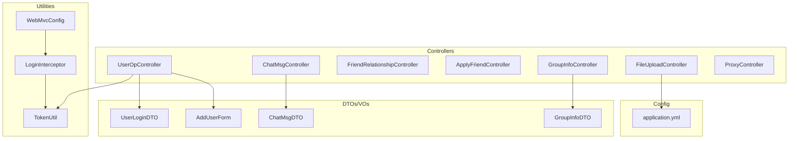
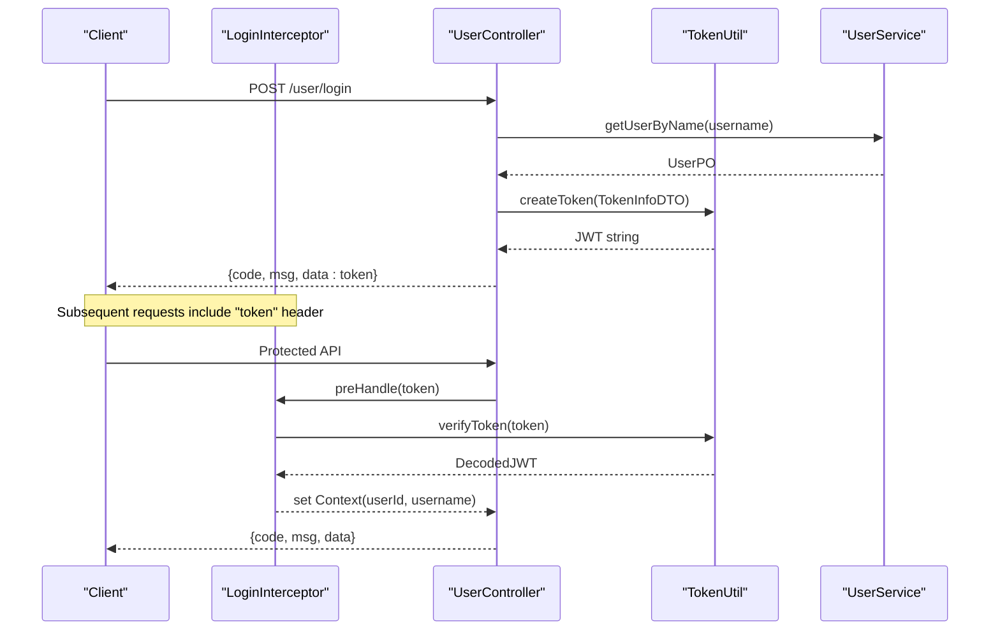
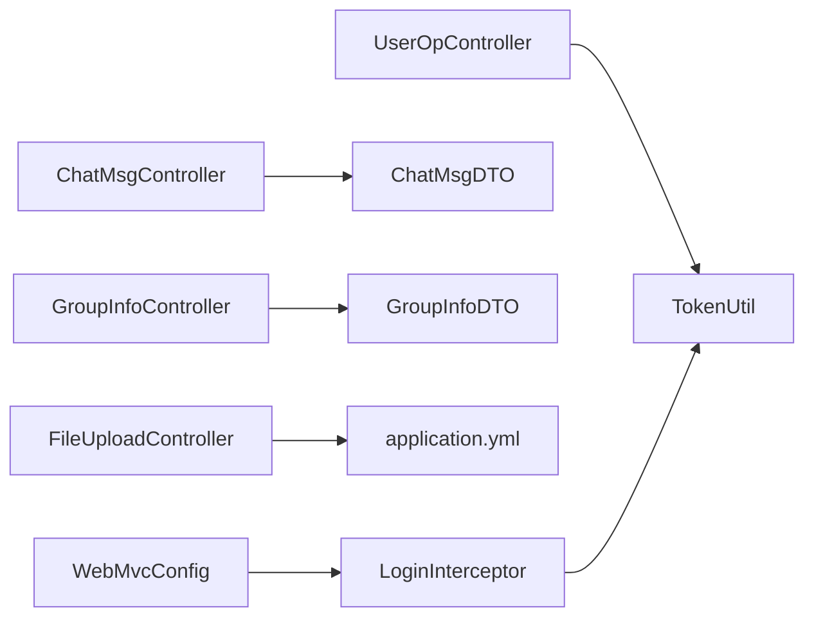
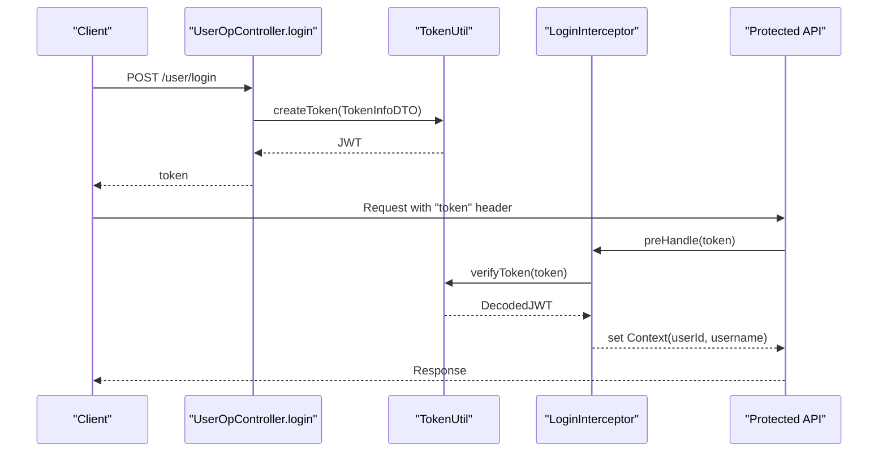

# API Documentation

<cite>
**Referenced Files in This Document**
- [ChatMsgController.java](file://src/main/java/com/hch/chat_simple/controller/ChatMsgController.java)
- [UserOpController.java](file://src/main/java/com/hch/chat_simple/controller/UserOpController.java)
- [FriendRelationshipController.java](file://src/main/java/com/hch/chat_simple/controller/FriendRelationshipController.java)
- [ApplyFriendController.java](file://src/main/java/com/hch/chat_simple/controller/ApplyFriendController.java)
- [GroupInfoController.java](file://src/main/java/com/hch/chat_simple/controller/GroupInfoController.java)
- [FileUploadController.java](file://src/main/java/com/hch/chat_simple/controller/FileUploadController.java)
- [ProxyController.java](file://src/main/java/com/hch/chat_simple/controller/ProxyController.java)
- [UserLoginDTO.java](file://src/main/java/com/hch/chat_simple/pojo/dto/UserLoginDTO.java)
- [AddUserForm.java](file://src/main/java/com/hch/chat_simple/pojo/dto/AddUserForm.java)
- [ChatMsgDTO.java](file://src/main/java/com/hch/chat_simple/pojo/dto/ChatMsgDTO.java)
- [GroupInfoDTO.java](file://src/main/java/com/hch/chat_simple/pojo/dto/GroupInfoDTO.java)
- [TokenUtil.java](file://src/main/java/com/hch/chat_simple/util/TokenUtil.java)
- [WebMvcConfig.java](file://src/main/java/com/hch/chat_simple/config/WebMvcConfig.java)
- [LoginInterceptor.java](file://src/main/java/com/hch/chat_simple/config/LoginInterceptor.java)
- [application.yml](file://src/main/resources/application.yml)
</cite>

## Table of Contents
1. [Introduction](#introduction)
2. [Project Structure](#project-structure)
3. [Core Components](#core-components)
4. [Architecture Overview](#architecture-overview)
5. [Detailed Component Analysis](#detailed-component-analysis)
6. [Dependency Analysis](#dependency-analysis)
7. [Performance Considerations](#performance-considerations)
8. [Troubleshooting Guide](#troubleshooting-guide)
9. [Conclusion](#conclusion)
10. [Appendices](#appendices)

## Introduction
This document provides comprehensive API documentation for the Chat Simple application. It covers all REST endpoints grouped by controllers, including authentication and authorization via JWT, message management, user operations, friend relationships, groups, file uploads, and proxy operations. For each endpoint, you will find HTTP methods, URL patterns, request/response schemas, authentication requirements, and error codes. Practical examples using curl commands and JSON payloads are included, along with rate limiting, input validation, and security considerations.

## Project Structure
The backend is a Spring Boot application with the following key areas:
- Controllers: expose REST endpoints for messaging, user operations, friends, groups, file upload, and proxy.
- DTOs/POs/VOs: define request/response schemas.
- Services: business logic implementations.
- Configurations: interceptors, CORS, and web MVC setup.
- Utilities: JWT token generation/verification, MinIO integration, and payload wrappers.
- Resources: application configuration and MyBatis mapper XMLs.

**Diagram sources**
- [ChatMsgController.java:31-57](file://src/main/java/com/hch/chat_simple/controller/ChatMsgController.java#L31-L57)
- [UserOpController.java:35-113](file://src/main/java/com/hch/chat_simple/controller/UserOpController.java#L35-L113)
- [FriendRelationshipController.java:28-48](file://src/main/java/com/hch/chat_simple/controller/FriendRelationshipController.java#L28-L48)
- [ApplyFriendController.java:28-54](file://src/main/java/com/hch/chat_simple/controller/ApplyFriendController.java#L28-L54)
- [GroupInfoController.java:30-67](file://src/main/java/com/hch/chat_simple/controller/GroupInfoController.java#L30-L67)
- [FileUploadController.java:22-81](file://src/main/java/com/hch/chat_simple/controller/FileUploadController.java#L22-L81)
- [ProxyController.java:1-174](file://src/main/java/com/hch/chat_simple/controller/ProxyController.java#L1-L174)
- [TokenUtil.java:18-70](file://src/main/java/com/hch/chat_simple/util/TokenUtil.java#L18-L70)
- [LoginInterceptor.java:28-108](file://src/main/java/com/hch/chat_simple/config/LoginInterceptor.java#L28-L108)
- [WebMvcConfig.java:8-27](file://src/main/java/com/hch/chat_simple/config/WebMvcConfig.java#L8-L27)
- [UserLoginDTO.java:9-21](file://src/main/java/com/hch/chat_simple/pojo/dto/UserLoginDTO.java#L9-L21)
- [AddUserForm.java:7-22](file://src/main/java/com/hch/chat_simple/pojo/dto/AddUserForm.java#L7-L22)
- [ChatMsgDTO.java:11-61](file://src/main/java/com/hch/chat_simple/pojo/dto/ChatMsgDTO.java#L11-L61)
- [GroupInfoDTO.java:6-25](file://src/main/java/com/hch/chat_simple/pojo/dto/GroupInfoDTO.java#L6-L25)
- [application.yml:1-89](file://src/main/resources/application.yml#L1-L89)

**Section sources**
- [ChatMsgController.java:31-57](file://src/main/java/com/hch/chat_simple/controller/ChatMsgController.java#L31-L57)
- [UserOpController.java:35-113](file://src/main/java/com/hch/chat_simple/controller/UserOpController.java#L35-L113)
- [FriendRelationshipController.java:28-48](file://src/main/java/com/hch/chat_simple/controller/FriendRelationshipController.java#L28-L48)
- [ApplyFriendController.java:28-54](file://src/main/java/com/hch/chat_simple/controller/ApplyFriendController.java#L28-L54)
- [GroupInfoController.java:30-67](file://src/main/java/com/hch/chat_simple/controller/GroupInfoController.java#L30-L67)
- [FileUploadController.java:22-81](file://src/main/java/com/hch/chat_simple/controller/FileUploadController.java#L22-L81)
- [ProxyController.java:1-174](file://src/main/java/com/hch/chat_simple/controller/ProxyController.java#L1-L174)
- [TokenUtil.java:18-70](file://src/main/java/com/hch/chat_simple/util/TokenUtil.java#L18-L70)
- [WebMvcConfig.java:8-27](file://src/main/java/com/hch/chat_simple/config/WebMvcConfig.java#L8-L27)
- [LoginInterceptor.java:28-108](file://src/main/java/com/hch/chat_simple/config/LoginInterceptor.java#L28-L108)
- [application.yml:1-89](file://src/main/resources/application.yml#L1-L89)

## Core Components
- Authentication and Authorization
  - JWT-based authentication with HMAC signature.
  - Interceptor validates token presence and expiry; sets user context for protected routes.
  - Public endpoints are annotated with a no-auth marker to bypass interceptor.
- Payload Wrapper
  - All responses use a unified wrapper with status, message, and data fields.
- Validation
  - DTOs enforce non-blank constraints for required fields.
- Cloud Storage
  - MinIO integration for bucket operations, upload, preview, download, and removal.

**Section sources**
- [TokenUtil.java:18-70](file://src/main/java/com/hch/chat_simple/util/TokenUtil.java#L18-L70)
- [LoginInterceptor.java:28-108](file://src/main/java/com/hch/chat_simple/config/LoginInterceptor.java#L28-L108)
- [WebMvcConfig.java:8-27](file://src/main/java/com/hch/chat_simple/config/WebMvcConfig.java#L8-L27)
- [UserLoginDTO.java:9-21](file://src/main/java/com/hch/chat_simple/pojo/dto/UserLoginDTO.java#L9-L21)
- [AddUserForm.java:7-22](file://src/main/java/com/hch/chat_simple/pojo/dto/AddUserForm.java#L7-L22)
- [application.yml:84-89](file://src/main/resources/application.yml#L84-L89)

## Architecture Overview
The API follows a layered architecture:
- Presentation Layer: Controllers expose endpoints.
- Business Layer: Services implement domain logic.
- Persistence Layer: MyBatis-Plus mappers and SQL XML.
- Infrastructure: JWT, MinIO, RocketMQ, Redis, Redisson.

**Diagram sources**
- [UserOpController.java:44-66](file://src/main/java/com/hch/chat_simple/controller/UserOpController.java#L44-L66)
- [TokenUtil.java:23-30](file://src/main/java/com/hch/chat_simple/util/TokenUtil.java#L23-L30)
- [LoginInterceptor.java:44-72](file://src/main/java/com/hch/chat_simple/config/LoginInterceptor.java#L44-L72)

## Detailed Component Analysis

### Authentication and Authorization
- JWT Token Generation
  - Algorithm: HMAC SHA-256.
  - Issuer: configured issuer.
  - Expiration: 30 minutes.
  - Claims: subject (JSON string of TokenInfoDTO), issuer, expiration, and a test claim.
- Token Verification
  - Verifies issuer and signature.
  - Accepts a grace period for expiration checks.
  - Parses subject to TokenInfoDTO for context.
- Interceptor Behavior
  - Applies to all paths except login and Swagger.
  - Reads "token" header.
  - On expired token, sets a new token in context and throws an expired exception for downstream handling.
  - On missing/invalid token, returns a structured error response.

Security Considerations
- Use HTTPS in production to protect tokens.
- Rotate signing keys periodically.
- Enforce short-lived tokens with refresh strategies.
- Validate and sanitize all inputs.

Rate Limiting
- Not implemented in the provided code; consider adding rate limiting per IP or per user ID at the gateway or interceptor level.

**Section sources**
- [TokenUtil.java:18-70](file://src/main/java/com/hch/chat_simple/util/TokenUtil.java#L18-L70)
- [LoginInterceptor.java:28-108](file://src/main/java/com/hch/chat_simple/config/LoginInterceptor.java#L28-L108)
- [WebMvcConfig.java:8-27](file://src/main/java/com/hch/chat_simple/config/WebMvcConfig.java#L8-L27)

### Chat Message Management (ChatMsgController)
Endpoints
- POST /chatMsg/selectNotReadMsg
  - Description: Fetch unread messages for the current user.
  - Auth: Required.
  - Request: none.
  - Response: Payload<List<ChatMsgVO>>.
  - Example curl:
    - curl -X POST http://localhost:9001/chatMsg/selectNotReadMsg -H "token: YOUR_JWT_TOKEN"
- POST /chatMsg/sendMsg
  - Description: Send a chat message.
  - Auth: Required.
  - Request body: ChatMsgDTO.
  - Response: Payload<ChatMsgVO>.
  - Example curl:
    - curl -X POST http://localhost:9001/chatMsg/sendMsg -H "Content-Type: application/json" -H "token: YOUR_JWT_TOKEN" -d '{ "chatType": 1, "content": "Hello", "receiveUserId": 2 }'
- POST /chatMsg/selectGroupChatMsgNotRead
  - Description: Fetch unread group messages based on query.
  - Auth: Required.
  - Request body: GroupNotReadMsgQuery.
  - Response: Payload<List<ChatMsgVO>>.
  - Example curl:
    - curl -X POST http://localhost:9001/chatMsg/selectGroupChatMsgNotRead -H "Content-Type: application/json" -H "token: YOUR_JWT_TOKEN" -d '{ "groupId": 101 }'

Validation
- ChatMsgDTO fields are validated by the service layer; ensure chatType, content, and receiver identifiers are provided.

Error Codes
- Standardized via Payload wrapper; typical codes include SUCCESS, USER_NOT_FOUND, PWD_ERROR, FILE_UPLOAD_FAIL.

**Section sources**
- [ChatMsgController.java:31-57](file://src/main/java/com/hch/chat_simple/controller/ChatMsgController.java#L31-L57)
- [ChatMsgDTO.java:11-61](file://src/main/java/com/hch/chat_simple/pojo/dto/ChatMsgDTO.java#L11-L61)

### User Operations (UserOpController)
Endpoints
- POST /user/login
  - Description: Authenticate user and return JWT.
  - Auth: Not required.
  - Request body: UserLoginDTO (username, password).
  - Response: Payload<String> (token).
  - Example curl:
    - curl -X POST http://localhost:9001/user/login -H "Content-Type: application/json" -d '{ "username": "alice", "password": "secret" }'
- POST /user/userInfo
  - Description: Get current user info.
  - Auth: Required.
  - Request: none.
  - Response: Payload<UserVO>.
  - Example curl:
    - curl -X POST http://localhost:9001/user/userInfo -H "token: YOUR_JWT_TOKEN"
- POST /user/searchUser
  - Description: Search users by name query.
  - Auth: Required.
  - Request body: UserQuery (defined in VO layer).
  - Response: Payload<List<UserVO>>.
  - Example curl:
    - curl -X POST http://localhost:9001/user/searchUser -H "Content-Type: application/json" -H "token: YOUR_JWT_TOKEN" -d '{ "name": "bob" }'
- POST /user/insertUser
  - Description: Register a new user.
  - Auth: Not required.
  - Request body: AddUserForm (username, password, name).
  - Response: Payload<Boolean>.
  - Example curl:
    - curl -X POST http://localhost:9001/user/insertUser -H "Content-Type: application/json" -d '{ "username": "eve", "password": "pass", "name": "Eve" }'

Validation
- UserLoginDTO enforces non-blank username/password.
- AddUserForm enforces non-blank username/password/name.

Security Considerations
- Passwords are hashed by the service; ensure bcrypt is used during registration.
- Protect against brute force by implementing rate limiting and account lockout policies.

Error Codes
- USER_NOT_FOUND, PWD_ERROR, SUCCESS.

**Section sources**
- [UserOpController.java:35-113](file://src/main/java/com/hch/chat_simple/controller/UserOpController.java#L35-L113)
- [UserLoginDTO.java:9-21](file://src/main/java/com/hch/chat_simple/pojo/dto/UserLoginDTO.java#L9-L21)
- [AddUserForm.java:7-22](file://src/main/java/com/hch/chat_simple/pojo/dto/AddUserForm.java#L7-L22)

### Friend Relationship Management (FriendRelationshipController)
Endpoints
- POST /friendship/friendList
  - Description: Retrieve friend list based on query.
  - Auth: Required.
  - Request body: FriendRelationshipQuery.
  - Response: Payload<List<FriendRelationshipVO>>.
  - Example curl:
    - curl -X POST http://localhost:9001/friendship/friendList -H "Content-Type: application/json" -H "token: YOUR_JWT_TOKEN" -d '{ "userId": 1 }'
- POST /friendship/applyFriend
  - Description: Submit a friend application.
  - Auth: Required.
  - Request body: ApplyFriendDTO.
  - Response: Payload (success indicator).
  - Example curl:
    - curl -X POST http://localhost:9001/friendship/applyFriend -H "Content-Type: application/json" -H "token: YOUR_JWT_TOKEN" -d '{ "targetUserId": 2 }'

Notes
- Additional endpoints exist in a separate controller for application records and confirmations.

**Section sources**
- [FriendRelationshipController.java:28-48](file://src/main/java/com/hch/chat_simple/controller/FriendRelationshipController.java#L28-L48)

### Friend Application Records (ApplyFriendController)
Endpoints
- POST /applyFriend/applyRecord
  - Description: List friend applications with optional last update filter.
  - Auth: Required.
  - Query param: updateLast (optional).
  - Response: Payload<List<ApplyFriendVO>>.
  - Example curl:
    - curl -X POST "http://localhost:9001/applyFriend/applyRecord?updateLast=1699123456000" -H "token: YOUR_JWT_TOKEN"
- POST /applyFriend/applyFriend
  - Description: Create a friend application.
  - Auth: Required.
  - Request body: ApplyFriendDTO.
  - Response: Payload<ApplyFriendVO>.
  - Example curl:
    - curl -X POST http://localhost:9001/applyFriend/applyFriend -H "Content-Type: application/json" -H "token: YOUR_JWT_TOKEN" -d '{ "targetUserId": 3 }'
- POST /applyFriend/applyFriendConfirm
  - Description: Confirm a friend application.
  - Auth: Required.
  - Request body: ApplyFriendDTO.
  - Response: Payload<ApplyFriendVO>.
  - Example curl:
    - curl -X POST http://localhost:9001/applyFriend/applyFriendConfirm -H "Content-Type: application/json" -H "token: YOUR_JWT_TOKEN" -d '{ "applyId": 10 }'

**Section sources**
- [ApplyFriendController.java:28-54](file://src/main/java/com/hch/chat_simple/controller/ApplyFriendController.java#L28-L54)

### Group Information Management (GroupInfoController)
Endpoints
- POST /groupInfo/addGroupChat
  - Description: Create a new group chat.
  - Auth: Required.
  - Request body: GroupInfoDTO.
  - Response: Payload (operation result).
  - Example curl:
    - curl -X POST http://localhost:9001/groupInfo/addGroupChat -H "Content-Type: application/json" -H "token: YOUR_JWT_TOKEN" -d '{ "groupName": "Team Alpha", "selfId": 1 }'
- GET /groupInfo/findGroupMemberById
  - Description: Get current members of a group.
  - Auth: Required.
  - Query param: groupId.
  - Response: Payload<List<GroupMemberVO>>.
  - Example curl:
    - curl "http://localhost:9001/groupInfo/findGroupMemberById?groupId=101" -H "token: YOUR_JWT_TOKEN"
- POST /groupInfo/addGroupMembers
  - Description: Add members to a group.
  - Auth: Required.
  - Request body: AddGroupMembersDTO.
  - Response: Payload (operation result).
  - Example curl:
    - curl -X POST http://localhost:9001/groupInfo/addGroupMembers -H "Content-Type: application/json" -H "token: YOUR_JWT_TOKEN" -d '{ "groupId": 101, "memberIds": [2, 3] }'
- GET /groupInfo/findAllGroupMemberById
  - Description: Get all group members including left members for historical chat display.
  - Auth: Required.
  - Query param: groupId.
  - Response: Payload<List<GroupMemberVO>>.
  - Example curl:
    - curl "http://localhost:9001/groupInfo/findAllGroupMemberById?groupId=101" -H "token: YOUR_JWT_TOKEN"

**Section sources**
- [GroupInfoController.java:30-67](file://src/main/java/com/hch/chat_simple/controller/GroupInfoController.java#L30-L67)
- [GroupInfoDTO.java:6-25](file://src/main/java/com/hch/chat_simple/pojo/dto/GroupInfoDTO.java#L6-L25)

### File Upload and Cloud Storage (FileUploadController)
Endpoints
- GET /file/bucketExists
  - Description: Check if a bucket exists.
  - Auth: Required.
  - Query param: bucketName.
  - Response: Payload.
  - Example curl:
    - curl "http://localhost:9001/file/bucketExists?bucketName=chat" -H "token: YOUR_JWT_TOKEN"
- GET /file/makeBucket
  - Description: Create a bucket.
  - Auth: Required.
  - Query param: bucketName.
  - Response: Payload.
  - Example curl:
    - curl "http://localhost:9001/file/makeBucket?bucketName=chat" -H "token: YOUR_JWT_TOKEN"
- GET /file/removeBucket
  - Description: Remove a bucket.
  - Auth: Required.
  - Query param: bucketName.
  - Response: Payload.
  - Example curl:
    - curl "http://localhost:9001/file/removeBucket?bucketName=chat" -H "token: YOUR_JWT_TOKEN"
- GET /file/getAllBuckets
  - Description: List all buckets.
  - Auth: Required.
  - Response: Payload.
  - Example curl:
    - curl "http://localhost:9001/file/getAllBuckets" -H "token: YOUR_JWT_TOKEN"
- POST /file/upload
  - Description: Upload a file; returns a public view URL.
  - Auth: Required.
  - Form field: file (multipart).
  - Response: Payload<String> (view URL).
  - Example curl:
    - curl -X POST "http://localhost:9001/file/upload" -H "token: YOUR_JWT_TOKEN" -F "file=@/path/to/file.txt"
- GET /file/preview
  - Description: Preview a file by name.
  - Auth: Required.
  - Query param: fileName.
  - Response: Payload.
  - Example curl:
    - curl "http://localhost:9001/file/preview?fileName=abc.txt" -H "token: YOUR_JWT_TOKEN"
- GET /file/download
  - Description: Download a file; writes to response stream.
  - Auth: Required.
  - Query param: fileName.
  - Response: Streamed file.
  - Example curl:
    - curl "http://localhost:9001/file/download?fileName=abc.txt" -H "token: YOUR_JWT_TOKEN" -o downloaded_file
- GET /file/remove
  - Description: Delete files by URLs.
  - Auth: Required.
  - Request body: List<String> (file URLs).
  - Response: Payload.
  - Example curl:
    - curl -X GET http://localhost:9001/file/remove -H "Content-Type: application/json" -H "token: YOUR_JWT_TOKEN" -d '[ "http://localhost:9000/chat/abc.txt" ]'

Cloud Storage Configuration
- Access key, secret key, bucket name, and endpoint URL are configured in application.yml.

**Section sources**
- [FileUploadController.java:22-81](file://src/main/java/com/hch/chat_simple/controller/FileUploadController.java#L22-L81)
- [application.yml:84-89](file://src/main/resources/application.yml#L84-L89)

### Proxy Controller (ProxyController)
Status
- The controller is currently commented out and not active in the runtime.

Recommendation
- If proxy functionality is needed, implement routing logic to target instances based on chat type and group/user IDs, and ensure SSL/TLS configuration for secure upstream communication.

**Section sources**
- [ProxyController.java:1-174](file://src/main/java/com/hch/chat_simple/controller/ProxyController.java#L1-L174)

## Dependency Analysis
- Controllers depend on services and DTOs.
- Interceptor depends on TokenUtil and ContextUtil.
- FileUploadController depends on MinIO configuration and utilities.
- WebMvcConfig registers interceptors and excludes public paths.

**Diagram sources**
- [UserOpController.java:35-113](file://src/main/java/com/hch/chat_simple/controller/UserOpController.java#L35-L113)
- [ChatMsgController.java:31-57](file://src/main/java/com/hch/chat_simple/controller/ChatMsgController.java#L31-L57)
- [GroupInfoController.java:30-67](file://src/main/java/com/hch/chat_simple/controller/GroupInfoController.java#L30-L67)
- [FileUploadController.java:22-81](file://src/main/java/com/hch/chat_simple/controller/FileUploadController.java#L22-L81)
- [TokenUtil.java:18-70](file://src/main/java/com/hch/chat_simple/util/TokenUtil.java#L18-L70)
- [LoginInterceptor.java:28-108](file://src/main/java/com/hch/chat_simple/config/LoginInterceptor.java#L28-L108)
- [WebMvcConfig.java:8-27](file://src/main/java/com/hch/chat_simple/config/WebMvcConfig.java#L8-L27)
- [application.yml:84-89](file://src/main/resources/application.yml#L84-L89)

**Section sources**
- [UserOpController.java:35-113](file://src/main/java/com/hch/chat_simple/controller/UserOpController.java#L35-L113)
- [ChatMsgController.java:31-57](file://src/main/java/com/hch/chat_simple/controller/ChatMsgController.java#L31-L57)
- [GroupInfoController.java:30-67](file://src/main/java/com/hch/chat_simple/controller/GroupInfoController.java#L30-L67)
- [FileUploadController.java:22-81](file://src/main/java/com/hch/chat_simple/controller/FileUploadController.java#L22-L81)
- [TokenUtil.java:18-70](file://src/main/java/com/hch/chat_simple/util/TokenUtil.java#L18-L70)
- [LoginInterceptor.java:28-108](file://src/main/java/com/hch/chat_simple/config/LoginInterceptor.java#L28-L108)
- [WebMvcConfig.java:8-27](file://src/main/java/com/hch/chat_simple/config/WebMvcConfig.java#L8-L27)
- [application.yml:84-89](file://src/main/resources/application.yml#L84-L89)

## Performance Considerations
- Token verification is lightweight; cache decoded claims if needed.
- MinIO operations are network-bound; consider connection pooling and timeouts.
- Use pagination for large lists (friends, group members, chat history).
- Offload heavy tasks to asynchronous consumers (RocketMQ) where applicable.

## Troubleshooting Guide
Common Issues
- Missing or invalid token
  - Symptom: Unauthorized response with token-related error code.
  - Resolution: Re-authenticate and obtain a new token; ensure "token" header is present.
- Expired token
  - Symptom: Token expired exception; server may return a new token in context.
  - Resolution: Refresh token flow; re-issue token upon successful verification.
- File upload failures
  - Symptom: Upload returns failure code.
  - Resolution: Verify bucket existence and permissions; check MinIO endpoint configuration.

Error Codes Overview
- Token errors: token verification failed, token does not exist.
- General: SUCCESS, USER_NOT_FOUND, PWD_ERROR, FILE_UPLOAD_FAIL.

**Section sources**
- [LoginInterceptor.java:74-82](file://src/main/java/com/hch/chat_simple/config/LoginInterceptor.java#L74-L82)
- [TokenUtil.java:48-59](file://src/main/java/com/hch/chat_simple/util/TokenUtil.java#L48-L59)
- [FileUploadController.java:50-57](file://src/main/java/com/hch/chat_simple/controller/FileUploadController.java#L50-L57)

## Conclusion
This API documentation outlines the Chat Simple application’s REST endpoints, authentication model, and operational guidelines. By following the provided patterns for authentication, validation, and error handling, you can integrate clients securely and efficiently. For production deployments, consider adding rate limiting, input sanitization, and robust monitoring.

## Appendices

### Authentication Flow

**Diagram sources**
- [UserOpController.java:44-66](file://src/main/java/com/hch/chat_simple/controller/UserOpController.java#L44-L66)
- [TokenUtil.java:23-30](file://src/main/java/com/hch/chat_simple/util/TokenUtil.java#L23-L30)
- [LoginInterceptor.java:44-72](file://src/main/java/com/hch/chat_simple/config/LoginInterceptor.java#L44-L72)