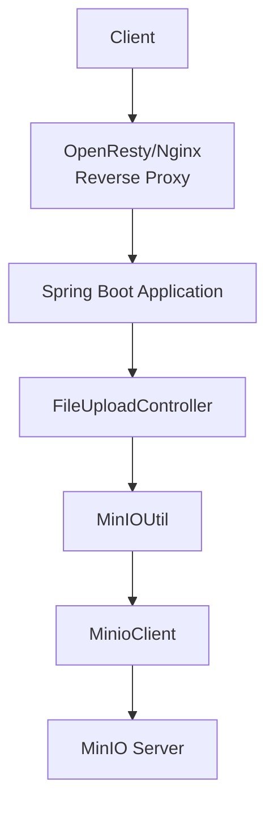
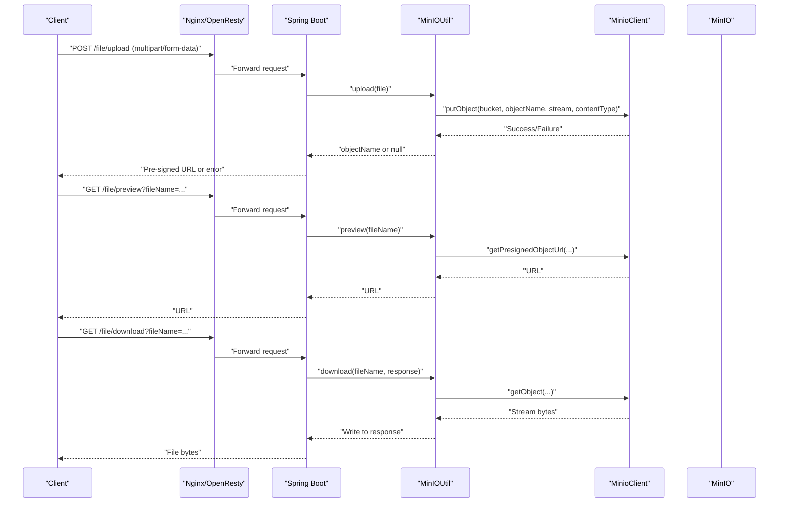
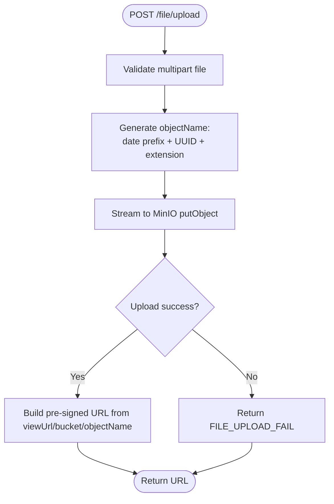
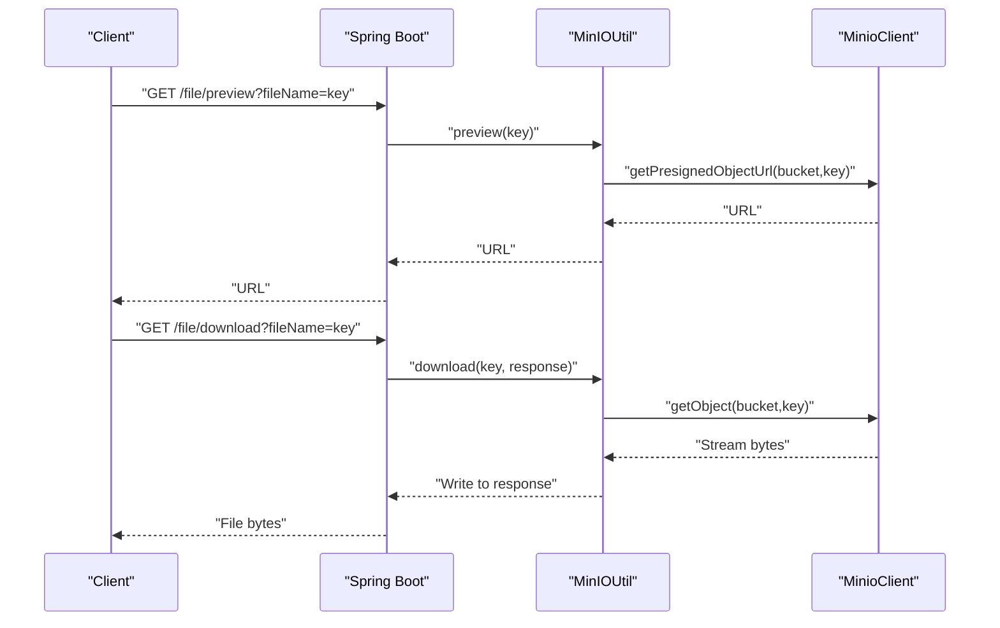
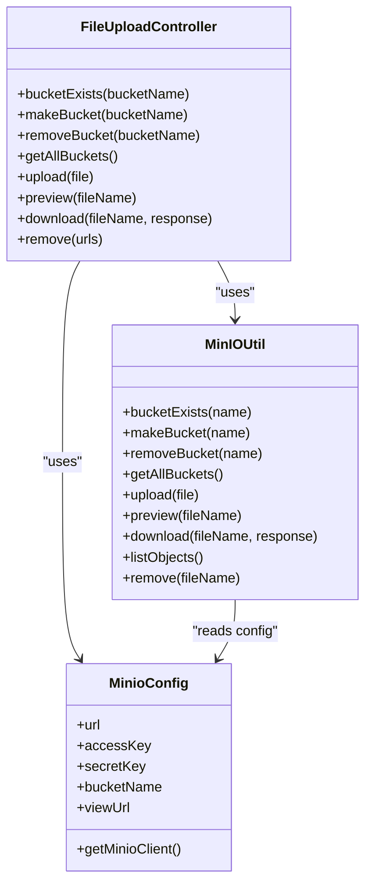

# File Upload API

<cite>
**Referenced Files in This Document**
- [FileUploadController.java](file://src/main/java/com/hch/chat_simple/controller/FileUploadController.java)
- [MinIOUtil.java](file://src/main/java/com/hch/chat_simple/util/MinIOUtil.java)
- [MinioConfig.java](file://src/main/java/com/hch/chat_simple/config/MinioConfig.java)
- [application.yml](file://src/main/resources/application.yml)
- [Payload.java](file://src/main/java/com/hch/chat_simple/util/Payload.java)
- [StatusCodeEnum.java](file://src/main/java/com/hch/chat_simple/util/StatusCodeEnum.java)
- [WebMvcConfig.java](file://src/main/java/com/hch/chat_simple/config/WebMvcConfig.java)
- [ExceptionAspectHandler.java](file://src/main/java/com/hch/chat_simple/config/ExceptionAspectHandler.java)
- [nginx.conf](file://openresty_nginx_conf/nginx.conf)
- [pom.xml](file://pom.xml)
</cite>

## Table of Contents
1. [Introduction](#introduction)
2. [Project Structure](#project-structure)
3. [Core Components](#core-components)
4. [Architecture Overview](#architecture-overview)
5. [Detailed Component Analysis](#detailed-component-analysis)
6. [Dependency Analysis](#dependency-analysis)
7. [Performance Considerations](#performance-considerations)
8. [Troubleshooting Guide](#troubleshooting-guide)
9. [Conclusion](#conclusion)
10. [Appendices](#appendices)

## Introduction
This document provides comprehensive API documentation for file upload and cloud storage endpoints. It covers the FileUploadController endpoints for uploading files, generating pre-signed URLs for preview, downloading stored objects, and removing objects. It also documents MinIO cloud storage integration, multipart/form-data handling, request/response schemas, file naming strategies, bucket configuration, access control exposure via MinIO view URL, and file lifecycle management. Security considerations such as virus scanning and malicious file detection are addressed conceptually, along with practical examples and curl commands for common operations.

## Project Structure
The file upload feature is implemented within a Spring Boot application. The primary controller exposes REST endpoints under /file/, delegating MinIO operations to a utility class. Configuration for MinIO is externalized via application.yml and mapped to a configuration bean. Interceptors and exception handling are configured globally.

**Diagram sources**
- [FileUploadController.java:22-81](file://src/main/java/com/hch/chat_simple/controller/FileUploadController.java#L22-L81)
- [MinIOUtil.java:48-197](file://src/main/java/com/hch/chat_simple/util/MinIOUtil.java#L48-L197)
- [MinioConfig.java:10-31](file://src/main/java/com/hch/chat_simple/config/MinioConfig.java#L10-L31)
- [application.yml:84-89](file://src/main/resources/application.yml#L84-L89)
- [nginx.conf:35-81](file://openresty_nginx_conf/nginx.conf#L35-L81)

**Section sources**
- [FileUploadController.java:22-81](file://src/main/java/com/hch/chat_simple/controller/FileUploadController.java#L22-L81)
- [MinIOUtil.java:48-197](file://src/main/java/com/hch/chat_simple/util/MinIOUtil.java#L48-L197)
- [MinioConfig.java:10-31](file://src/main/java/com/hch/chat_simple/config/MinioConfig.java#L10-L31)
- [application.yml:84-89](file://src/main/resources/application.yml#L84-L89)
- [WebMvcConfig.java:8-26](file://src/main/java/com/hch/chat_simple/config/WebMvcConfig.java#L8-L26)
- [nginx.conf:35-81](file://openresty_nginx_conf/nginx.conf#L35-L81)

## Core Components
- FileUploadController: Exposes endpoints for bucket management, file upload, preview (pre-signed URL), download, and removal.
- MinIOUtil: Encapsulates MinIO operations including upload, preview, download, list, and remove.
- MinioConfig: Provides MinIO endpoint, credentials, bucket name, and view URL for external access.
- Payload and StatusCodeEnum: Standardized response envelope and status codes used across the API.
- WebMvcConfig and ExceptionAspectHandler: Global interceptors and exception handling for cross-cutting concerns.
- Nginx/OpenResty: Reverse proxy configuration routing traffic to the Spring Boot application.

**Section sources**
- [FileUploadController.java:22-81](file://src/main/java/com/hch/chat_simple/controller/FileUploadController.java#L22-L81)
- [MinIOUtil.java:48-197](file://src/main/java/com/hch/chat_simple/util/MinIOUtil.java#L48-L197)
- [MinioConfig.java:10-31](file://src/main/java/com/hch/chat_simple/config/MinioConfig.java#L10-L31)
- [Payload.java:5-29](file://src/main/java/com/hch/chat_simple/util/Payload.java#L5-L29)
- [StatusCodeEnum.java:6-21](file://src/main/java/com/hch/chat_simple/util/StatusCodeEnum.java#L6-L21)
- [WebMvcConfig.java:8-26](file://src/main/java/com/hch/chat_simple/config/WebMvcConfig.java#L8-L26)
- [ExceptionAspectHandler.java:12-23](file://src/main/java/com/hch/chat_simple/config/ExceptionAspectHandler.java#L12-L23)
- [nginx.conf:35-81](file://openresty_nginx_conf/nginx.conf#L35-L81)

## Architecture Overview
The upload pipeline streams multipart file content directly to MinIO using the MinioClient. Uploaded objects are stored under a date-based prefix and identified by a UUID-based filename. Pre-signed URLs are generated for temporary access to objects. Download requests stream object content back to clients. Removal deletes objects by their internal object name.

**Diagram sources**
- [FileUploadController.java:50-68](file://src/main/java/com/hch/chat_simple/controller/FileUploadController.java#L50-L68)
- [MinIOUtil.java:98-163](file://src/main/java/com/hch/chat_simple/util/MinIOUtil.java#L98-L163)
- [MinioConfig.java:10-31](file://src/main/java/com/hch/chat_simple/config/MinioConfig.java#L10-L31)

## Detailed Component Analysis

### FileUploadController Endpoints
- Base Path: /file/
- Content-Type: multipart/form-data for upload; query parameters for others
- Authentication: Global interceptors apply to all paths except specific exclusions.

Endpoints:
- GET /file/bucketExists?bucketName={name}
  - Purpose: Check if a bucket exists
  - Response: Payload<Boolean>
- GET /file/makeBucket?bucketName={name}
  - Purpose: Create a bucket
  - Response: Payload<Boolean>
- GET /file/removeBucket?bucketName={name}
  - Purpose: Remove a bucket
  - Response: Payload<Boolean>
- GET /file/getAllBuckets
  - Purpose: List all buckets
  - Response: Payload<List<Bucket>>
- POST /file/upload
  - Request: multipart/form-data with field name=file
  - Response: Payload<String> containing a pre-signed URL constructed from viewUrl, bucketName, and objectName
  - Failure: Payload with code FILE_UPLOAD_FAIL
- GET /file/preview?fileName={key}
  - Purpose: Generate a pre-signed URL for temporary access
  - Response: Payload<String> URL
- GET /file/download?fileName={key}
  - Purpose: Stream file content to client
  - Response: HTTP 200 with file bytes; headers set for attachment
- GET /file/remove
  - Request: JSON body array of URLs pointing to objects
  - Behavior: Extracts object name from URL and removes the object
  - Response: Payload<String> success message

Security and Access Control:
- Pre-signed URLs enable controlled access to objects without exposing raw MinIO endpoints.
- Access permissions depend on MinIO bucket policies and credentials configured in MinioConfig.

**Section sources**
- [FileUploadController.java:30-77](file://src/main/java/com/hch/chat_simple/controller/FileUploadController.java#L30-L77)
- [MinioConfig.java:15-26](file://src/main/java/com/hch/chat_simple/config/MinioConfig.java#L15-L26)
- [Payload.java:18-28](file://src/main/java/com/hch/chat_simple/util/Payload.java#L18-L28)
- [StatusCodeEnum.java:13-13](file://src/main/java/com/hch/chat_simple/util/StatusCodeEnum.java#L13-L13)

### Upload Operation Flow
- Input validation: Ensures original filename is present.
- Naming strategy: date-based prefix (yyyy/MM/dd) plus UUID-based filename preserving original extension.
- Streaming: Uses InputStream and size-aware PutObjectArgs to stream content to MinIO.
- Error handling: Returns null on failure; controller maps to standardized error response.

**Diagram sources**
- [FileUploadController.java:50-57](file://src/main/java/com/hch/chat_simple/controller/FileUploadController.java#L50-L57)
- [MinIOUtil.java:98-122](file://src/main/java/com/hch/chat_simple/util/MinIOUtil.java#L98-L122)
- [MinioConfig.java:23-26](file://src/main/java/com/hch/chat_simple/config/MinioConfig.java#L23-L26)

**Section sources**
- [MinIOUtil.java:98-122](file://src/main/java/com/hch/chat_simple/util/MinIOUtil.java#L98-L122)
- [FileUploadController.java:50-57](file://src/main/java/com/hch/chat_simple/controller/FileUploadController.java#L50-L57)

### Preview and Download Operations
- Preview: Generates a pre-signed GET URL for temporary access to an object.
- Download: Streams object bytes to the HTTP response with appropriate headers for file attachment.

**Diagram sources**
- [FileUploadController.java:59-68](file://src/main/java/com/hch/chat_simple/controller/FileUploadController.java#L59-L68)
- [MinIOUtil.java:124-163](file://src/main/java/com/hch/chat_simple/util/MinIOUtil.java#L124-L163)

**Section sources**
- [MinIOUtil.java:124-163](file://src/main/java/com/hch/chat_simple/util/MinIOUtil.java#L124-L163)
- [FileUploadController.java:59-68](file://src/main/java/com/hch/chat_simple/controller/FileUploadController.java#L59-L68)

### Bucket Management Endpoints
- Check existence, create, remove, and list buckets.
- Useful for administrative tasks and environment initialization.

**Section sources**
- [FileUploadController.java:30-48](file://src/main/java/com/hch/chat_simple/controller/FileUploadController.java#L30-L48)
- [MinIOUtil.java:56-96](file://src/main/java/com/hch/chat_simple/util/MinIOUtil.java#L56-L96)

### File Naming Strategy and Storage Layout
- Date-based prefix: yyyy/MM/dd/
- Filename: UUID + original extension
- Bucket: Configured via bucketName property
- Example layout: {bucket}/{yyyy/MM/dd/UUID.ext}

**Section sources**
- [MinIOUtil.java:106-108](file://src/main/java/com/hch/chat_simple/util/MinIOUtil.java#L106-L108)
- [application.yml:87-87](file://src/main/resources/application.yml#L87-L87)

### Cloud Storage Integration (MinIO)
- Endpoint and credentials: Provided by MinioConfig mapped from application.yml.
- View URL: Used to construct publicly accessible pre-signed URLs.
- Client: MinioClient bean initialized with endpoint and credentials.

**Section sources**
- [MinioConfig.java:15-31](file://src/main/java/com/hch/chat_simple/config/MinioConfig.java#L15-L31)
- [application.yml:84-89](file://src/main/resources/application.yml#L84-L89)
- [FileUploadController.java:54-54](file://src/main/java/com/hch/chat_simple/controller/FileUploadController.java#L54-L54)

### Request/Response Schemas
- Request bodies:
  - multipart/form-data: field name=file
  - JSON array of URLs for removal operation
- Response envelopes:
  - Payload<T>: data, code, remark
  - Standardized codes via StatusCodeEnum

Example response shape:
- Success: { "data": "...", "code": 202, "remark": "Success" }
- Error: { "data": null, "code": 510, "remark": "File upload failed" }

**Section sources**
- [Payload.java:18-28](file://src/main/java/com/hch/chat_simple/util/Payload.java#L18-L28)
- [StatusCodeEnum.java:6-21](file://src/main/java/com/hch/chat_simple/util/StatusCodeEnum.java#L6-L21)
- [FileUploadController.java:50-57](file://src/main/java/com/hch/chat_simple/controller/FileUploadController.java#L50-L57)

### Practical Examples

- Upload a file (image/document/audio):
  - curl -X POST http://localhost:9001/file/upload -F file=@/path/to/your/file -H "Content-Type: multipart/form-data"
  - Response: Pre-signed URL to access the uploaded object

- Generate a preview URL:
  - curl "http://localhost:9001/file/preview?fileName={objectName}"

- Download a file:
  - curl -O -J "http://localhost:9001/file/download?fileName={objectName}"

- Remove files by URLs:
  - curl -X GET "http://localhost:9001/file/remove" -H "Content-Type: application/json" -d '["{viewUrl}/{bucket}/{objectName}"]'

Notes:
- Replace placeholders with actual values from your deployment.
- Ensure the bucket exists and is accessible with configured credentials.

**Section sources**
- [FileUploadController.java:50-77](file://src/main/java/com/hch/chat_simple/controller/FileUploadController.java#L50-L77)
- [MinioConfig.java:23-26](file://src/main/java/com/hch/chat_simple/config/MinioConfig.java#L23-L26)

### Supported File Formats and Size Limits
- Supported formats: Controlled by the caller’s file selection; no server-side format restrictions are enforced.
- Size limits: Not enforced by the server code; practical limits depend on JVM heap, available memory, and network buffering.
- Bandwidth: Limited by network throughput and client/server configurations.

Recommendation:
- Configure application-level multipart size limits and content-type checks at the framework or reverse proxy layer if needed.

**Section sources**
- [MinIOUtil.java:98-122](file://src/main/java/com/hch/chat_simple/util/MinIOUtil.java#L98-L122)
- [nginx.conf:35-81](file://openresty_nginx_conf/nginx.conf#L35-L81)

### Security Considerations
- Virus scanning and malicious file detection: Not implemented in the current codebase. Consider integrating anti-virus scanning or content inspection at the ingress or post-upload stages.
- Access control: Use MinIO bucket policies and IAM credentials to restrict access. The viewUrl is intended for controlled access; ensure policies align with your security posture.
- Validation: Add content-type checks and size limits at the controller or filter layer if required.

**Section sources**
- [MinioConfig.java:15-26](file://src/main/java/com/hch/chat_simple/config/MinioConfig.java#L15-L26)
- [FileUploadController.java:50-57](file://src/main/java/com/hch/chat_simple/controller/FileUploadController.java#L50-L57)

### Error Handling
- Upload failures: Returned as standardized error payload with code FILE_UPLOAD_FAIL.
- Global exceptions: Token-related exceptions are handled centrally with a specific error response.

**Section sources**
- [FileUploadController.java:56-56](file://src/main/java/com/hch/chat_simple/controller/FileUploadController.java#L56-L56)
- [StatusCodeEnum.java:13-13](file://src/main/java/com/hch/chat_simple/util/StatusCodeEnum.java#L13-L13)
- [ExceptionAspectHandler.java:16-20](file://src/main/java/com/hch/chat_simple/config/ExceptionAspectHandler.java#L16-L20)

## Dependency Analysis
- FileUploadController depends on MinioConfig and MinIOUtil.
- MinIOUtil depends on MinioClient and MinioConfig.
- MinioClient bean is configured via MinioConfig.
- Global interceptors and Swagger resources are registered via WebMvcConfig.

**Diagram sources**
- [FileUploadController.java:22-81](file://src/main/java/com/hch/chat_simple/controller/FileUploadController.java#L22-L81)
- [MinIOUtil.java:48-197](file://src/main/java/com/hch/chat_simple/util/MinIOUtil.java#L48-L197)
- [MinioConfig.java:10-31](file://src/main/java/com/hch/chat_simple/config/MinioConfig.java#L10-L31)

**Section sources**
- [FileUploadController.java:22-81](file://src/main/java/com/hch/chat_simple/controller/FileUploadController.java#L22-L81)
- [MinIOUtil.java:48-197](file://src/main/java/com/hch/chat_simple/util/MinIOUtil.java#L48-L197)
- [MinioConfig.java:10-31](file://src/main/java/com/hch/chat_simple/config/MinioConfig.java#L10-L31)

## Performance Considerations
- Streaming uploads: The implementation streams file content to MinIO, reducing memory overhead.
- Pre-signed URLs: Offloads download traffic from the application server to MinIO.
- Buffering: Download uses a fixed-size buffer during streaming.

Recommendations:
- Tune JVM heap and thread pools for high concurrency.
- Consider chunked transfers and compression at the reverse proxy if bandwidth is constrained.
- Monitor MinIO server performance and network throughput.

**Section sources**
- [MinIOUtil.java:141-163](file://src/main/java/com/hch/chat_simple/util/MinIOUtil.java#L141-L163)

## Troubleshooting Guide
Common issues and resolutions:
- Upload fails with standardized error:
  - Verify bucket exists and credentials are correct.
  - Check MinIO server availability and network connectivity.
- Empty filename validation error:
  - Ensure the multipart form includes a valid file field.
- Download returns empty or partial content:
  - Confirm the object name matches the stored key.
  - Verify MinIO bucket policies allow getObject.
- Pre-signed URL invalid:
  - Ensure viewUrl is correctly configured and accessible.
  - Confirm the object exists and is readable.

**Section sources**
- [FileUploadController.java:50-57](file://src/main/java/com/hch/chat_simple/controller/FileUploadController.java#L50-L57)
- [MinIOUtil.java:98-122](file://src/main/java/com/hch/chat_simple/util/MinIOUtil.java#L98-L122)
- [MinioConfig.java:23-26](file://src/main/java/com/hch/chat_simple/config/MinioConfig.java#L23-L26)

## Conclusion
The FileUploadController provides a concise set of endpoints for managing files with MinIO. It supports upload, preview, download, and removal operations with standardized responses. The implementation emphasizes streaming and pre-signed URLs for efficient and secure access. Administrators can manage buckets and inspect objects. For production deployments, consider adding content-type validation, size limits, virus scanning, and robust access controls aligned with MinIO policies.

## Appendices

### API Reference Summary
- POST /file/upload
  - Body: multipart/form-data; field=file
  - Response: Pre-signed URL string
- GET /file/preview?fileName={key}
  - Response: Pre-signed URL string
- GET /file/download?fileName={key}
  - Response: File bytes with appropriate headers
- GET /file/remove
  - Body: JSON array of pre-signed URLs
  - Response: Success message
- GET /file/bucketExists?bucketName={name}
  - Response: Boolean
- GET /file/makeBucket?bucketName={name}
  - Response: Boolean
- GET /file/removeBucket?bucketName={name}
  - Response: Boolean
- GET /file/getAllBuckets
  - Response: List of buckets

**Section sources**
- [FileUploadController.java:30-77](file://src/main/java/com/hch/chat_simple/controller/FileUploadController.java#L30-L77)

### Configuration Reference
- MinIO endpoint, credentials, bucket name, and view URL are configured in application.yml under the minio namespace and injected via MinioConfig.

**Section sources**
- [application.yml:84-89](file://src/main/resources/application.yml#L84-L89)
- [MinioConfig.java:15-31](file://src/main/java/com/hch/chat_simple/config/MinioConfig.java#L15-L31)