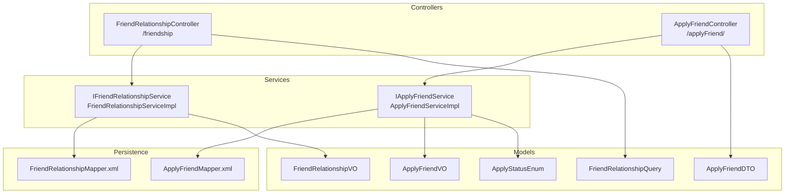
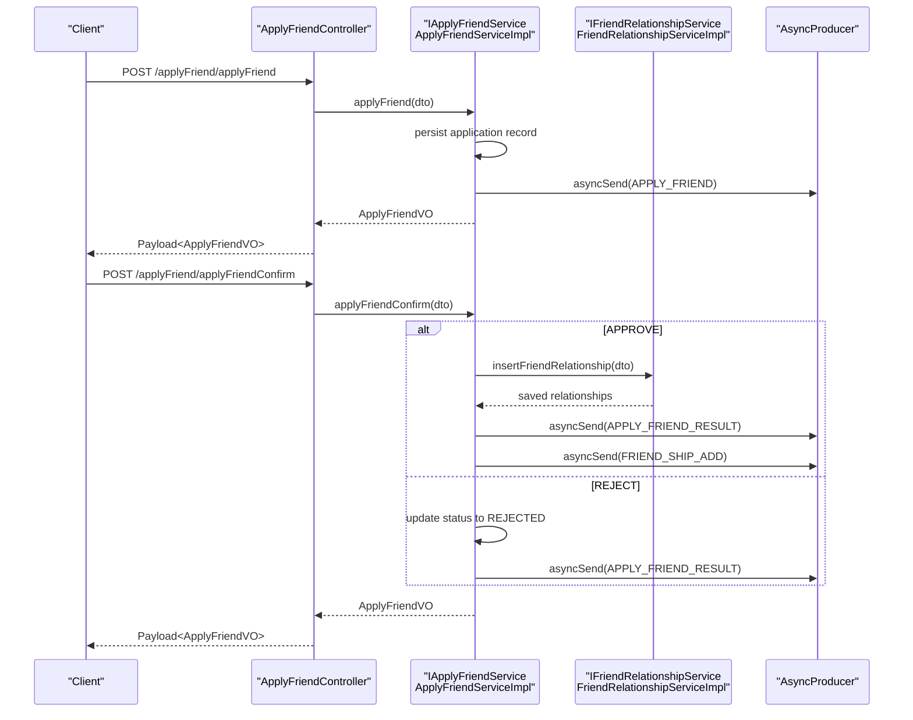
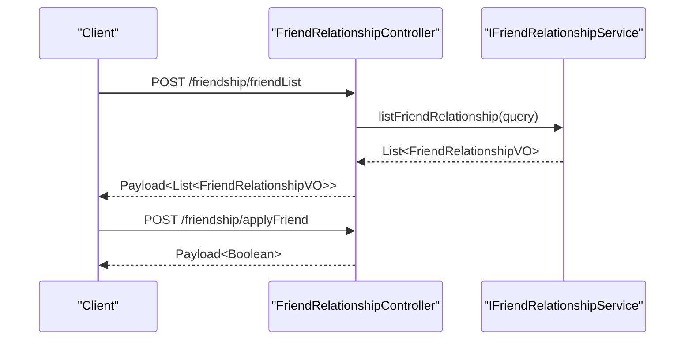
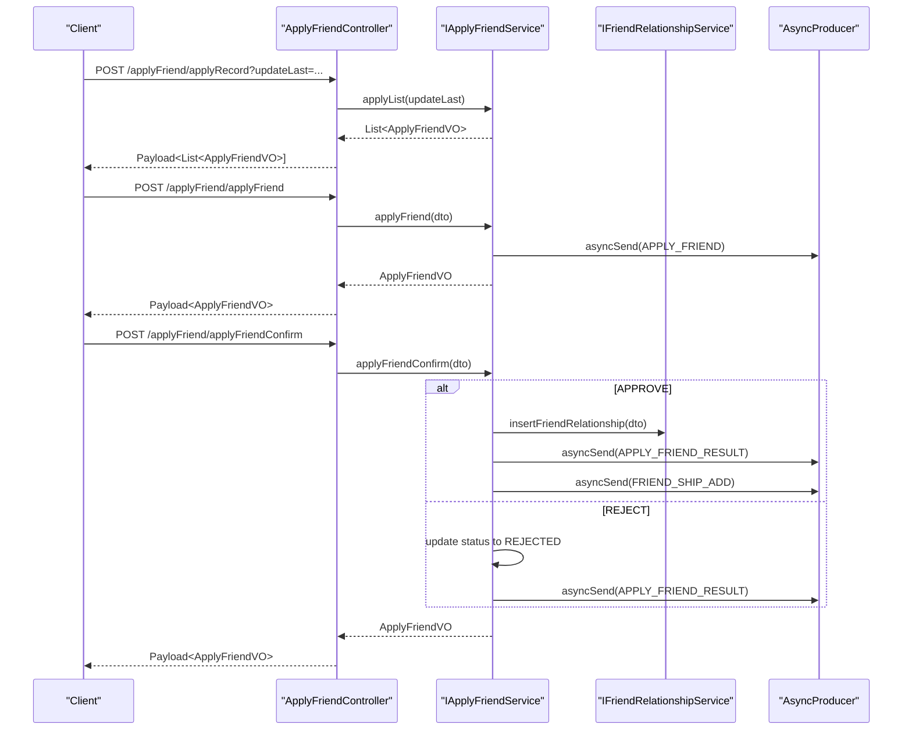
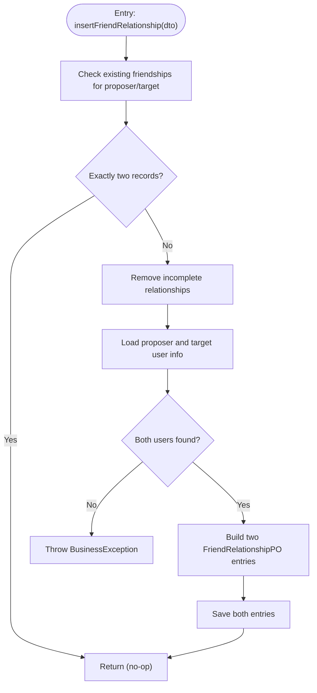
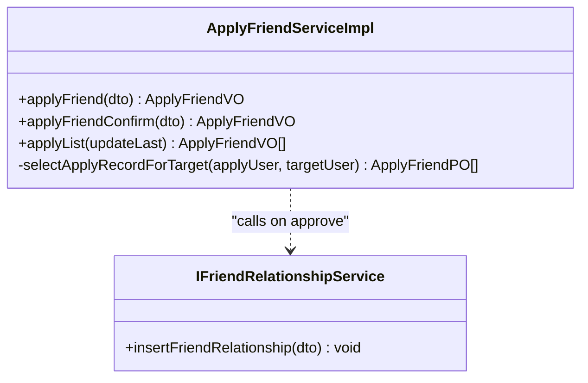
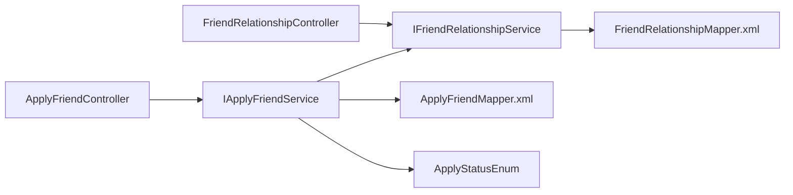

# Friend Relationship API

<cite>
**Referenced Files in This Document**
- [FriendRelationshipController.java](file://src/main/java/com/hch/chat_simple/controller/FriendRelationshipController.java)
- [ApplyFriendController.java](file://src/main/java/com/hch/chat_simple/controller/ApplyFriendController.java)
- [IFriendRelationshipService.java](file://src/main/java/com/hch/chat_simple/service/IFriendRelationshipService.java)
- [IApplyFriendService.java](file://src/main/java/com/hch/chat_simple/service/IApplyFriendService.java)
- [FriendRelationshipServiceImpl.java](file://src/main/java/com/hch/chat_simple/service/impl/FriendRelationshipServiceImpl.java)
- [ApplyFriendServiceImpl.java](file://src/main/java/com/hch/chat_simple/service/impl/ApplyFriendServiceImpl.java)
- [FriendRelationshipQuery.java](file://src/main/java/com/hch/chat_simple/pojo/query/FriendRelationshipQuery.java)
- [FriendRelationshipVO.java](file://src/main/java/com/hch/chat_simple/pojo/vo/FriendRelationshipVO.java)
- [ApplyFriendDTO.java](file://src/main/java/com/hch/chat_simple/pojo/dto/ApplyFriendDTO.java)
- [ApplyFriendVO.java](file://src/main/java/com/hch/chat_simple/pojo/vo/ApplyFriendVO.java)
- [ApplyStatusEnum.java](file://src/main/java/com/hch/chat_simple/enums/ApplyStatusEnum.java)
- [Payload.java](file://src/main/java/com/hch/chat_simple/util/Payload.java)
- [FriendRelationshipMapper.xml](file://src/main/resources/mapper/FriendRelationshipMapper.xml)
- [ApplyFriendMapper.xml](file://src/main/resources/mapper/ApplyFriendMapper.xml)
</cite>

## Table of Contents
1. [Introduction](#introduction)
2. [Project Structure](#project-structure)
3. [Core Components](#core-components)
4. [Architecture Overview](#architecture-overview)
5. [Detailed Component Analysis](#detailed-component-analysis)
6. [Dependency Analysis](#dependency-analysis)
7. [Performance Considerations](#performance-considerations)
8. [Troubleshooting Guide](#troubleshooting-guide)
9. [Conclusion](#conclusion)
10. [Appendices](#appendices)

## Introduction
This document provides comprehensive API documentation for friend relationship management endpoints. It covers:
- FriendRelationshipController endpoints for retrieving friend lists and initiating friend applications
- ApplyFriendController endpoints for sending friend requests, confirming applications, and querying application records
- Request/response schemas using ApplyFriendDTO and FriendRelationshipVO models
- Authentication requirements via a logged-in session/token
- Approval workflows, application status lifecycle, and notification mechanisms
- Practical examples for friend request operations, approval processes, and friend list queries
- Validation rules, privacy considerations, mutual friend visibility, and bulk operations
- Error handling for duplicate requests, invalid user IDs, and permission violations

## Project Structure
The friend relationship subsystem is organized around controllers, services, DTOs/VOs, enums, and MyBatis mapper XMLs. Controllers expose REST endpoints under base paths /friendship and /applyFriend/. Services encapsulate business logic and integrate with persistence and messaging.

**Diagram sources**
- [FriendRelationshipController.java:28-48](file://src/main/java/com/hch/chat_simple/controller/FriendRelationshipController.java#L28-L48)
- [ApplyFriendController.java:28-54](file://src/main/java/com/hch/chat_simple/controller/ApplyFriendController.java#L28-L54)
- [IFriendRelationshipService.java:20-25](file://src/main/java/com/hch/chat_simple/service/IFriendRelationshipService.java#L20-L25)
- [IApplyFriendService.java:18-25](file://src/main/java/com/hch/chat_simple/service/IApplyFriendService.java#L18-L25)
- [FriendRelationshipServiceImpl.java:40-111](file://src/main/java/com/hch/chat_simple/service/impl/FriendRelationshipServiceImpl.java#L40-L111)
- [ApplyFriendServiceImpl.java:44-225](file://src/main/java/com/hch/chat_simple/service/impl/ApplyFriendServiceImpl.java#L44-L225)
- [FriendRelationshipQuery.java:8-18](file://src/main/java/com/hch/chat_simple/pojo/query/FriendRelationshipQuery.java#L8-L18)
- [FriendRelationshipVO.java:15-52](file://src/main/java/com/hch/chat_simple/pojo/vo/FriendRelationshipVO.java#L15-L52)
- [ApplyFriendDTO.java:10-41](file://src/main/java/com/hch/chat_simple/pojo/dto/ApplyFriendDTO.java#L10-L41)
- [ApplyFriendVO.java:9-50](file://src/main/java/com/hch/chat_simple/pojo/vo/ApplyFriendVO.java#L9-L50)
- [ApplyStatusEnum.java:6-29](file://src/main/java/com/hch/chat_simple/enums/ApplyStatusEnum.java#L6-L29)
- [FriendRelationshipMapper.xml:1-6](file://src/main/resources/mapper/FriendRelationshipMapper.xml#L1-L6)
- [ApplyFriendMapper.xml:1-6](file://src/main/resources/mapper/ApplyFriendMapper.xml#L1-L6)

**Section sources**
- [FriendRelationshipController.java:28-48](file://src/main/java/com/hch/chat_simple/controller/FriendRelationshipController.java#L28-L48)
- [ApplyFriendController.java:28-54](file://src/main/java/com/hch/chat_simple/controller/ApplyFriendController.java#L28-L54)

## Core Components
- FriendRelationshipController
  - GET /friendship/friendList: Retrieve current user’s friend list filtered by name/id
  - POST /friendship/applyFriend: Initiate a friend application (currently returns a generic success payload)
- ApplyFriendController
  - POST /applyFriend/applyRecord: Fetch application records for the current user
  - POST /applyFriend/applyFriend: Submit a friend application
  - POST /applyFriend/applyFriendConfirm: Approve or reject a pending application

Response envelope
- All endpoints return a standardized Payload<T> wrapper containing code, remark, and data.

**Section sources**
- [FriendRelationshipController.java:37-47](file://src/main/java/com/hch/chat_simple/controller/FriendRelationshipController.java#L37-L47)
- [ApplyFriendController.java:35-51](file://src/main/java/com/hch/chat_simple/controller/ApplyFriendController.java#L35-L51)
- [Payload.java:6-28](file://src/main/java/com/hch/chat_simple/util/Payload.java#L6-L28)

## Architecture Overview
The system follows a layered architecture:
- Controllers handle HTTP requests and delegate to services
- Services implement business logic, validate inputs, manage transactions, and publish notifications
- Persistence is handled via MyBatis mapper XMLs (empty in this snapshot)
- Messaging is integrated via AsyncProducer for real-time notifications

**Diagram sources**
- [ApplyFriendController.java:41-51](file://src/main/java/com/hch/chat_simple/controller/ApplyFriendController.java#L41-L51)
- [ApplyFriendServiceImpl.java:57-89](file://src/main/java/com/hch/chat_simple/service/impl/ApplyFriendServiceImpl.java#L57-L89)
- [FriendRelationshipServiceImpl.java:57-108](file://src/main/java/com/hch/chat_simple/service/impl/FriendRelationshipServiceImpl.java#L57-L108)

## Detailed Component Analysis

### FriendRelationshipController
- Endpoint: POST /friendship/friendList
  - Purpose: Retrieve current user’s friend list
  - Request body: FriendRelationshipQuery
  - Response: Payload<List<FriendRelationshipVO>>
  - Notes: Uses current authenticated user ID to filter records

- Endpoint: POST /friendship/applyFriend
  - Purpose: Initiate a friend application
  - Request body: ApplyFriendDTO
  - Response: Payload<Boolean> (success indicator)
  - Notes: Implementation currently returns a generic success; actual application logic is handled by ApplyFriendController

**Diagram sources**
- [FriendRelationshipController.java:37-47](file://src/main/java/com/hch/chat_simple/controller/FriendRelationshipController.java#L37-L47)
- [IFriendRelationshipService.java:20-25](file://src/main/java/com/hch/chat_simple/service/IFriendRelationshipService.java#L20-L25)

**Section sources**
- [FriendRelationshipController.java:37-47](file://src/main/java/com/hch/chat_simple/controller/FriendRelationshipController.java#L37-L47)
- [FriendRelationshipQuery.java:8-18](file://src/main/java/com/hch/chat_simple/pojo/query/FriendRelationshipQuery.java#L8-L18)
- [FriendRelationshipVO.java:15-52](file://src/main/java/com/hch/chat_simple/pojo/vo/FriendRelationshipVO.java#L15-L52)

### ApplyFriendController
- Endpoint: POST /applyFriend/applyRecord
  - Purpose: Fetch application records for the current user
  - Query param: updateLast (optional timestamp)
  - Response: Payload<List<ApplyFriendVO>>
  - Notes: Returns records where the current user is the target or creator

- Endpoint: POST /applyFriend/applyFriend
  - Purpose: Submit a friend application
  - Request body: ApplyFriendDTO
  - Response: Payload<ApplyFriendVO>
  - Notes: Persists two mirrored records (initiator and target), sets status to APPLYING, and publishes a notification

- Endpoint: POST /applyFriend/applyFriendConfirm
  - Purpose: Approve or reject a pending application
  - Request body: ApplyFriendDTO
  - Response: Payload<ApplyFriendVO>
  - Notes: On approval, creates bidirectional friend relationships and notifies both parties; on rejection, updates status accordingly

**Diagram sources**
- [ApplyFriendController.java:35-51](file://src/main/java/com/hch/chat_simple/controller/ApplyFriendController.java#L35-L51)
- [ApplyFriendServiceImpl.java:57-89](file://src/main/java/com/hch/chat_simple/service/impl/ApplyFriendServiceImpl.java#L57-L89)
- [ApplyFriendServiceImpl.java:91-174](file://src/main/java/com/hch/chat_simple/service/impl/ApplyFriendServiceImpl.java#L91-L174)

**Section sources**
- [ApplyFriendController.java:35-51](file://src/main/java/com/hch/chat_simple/controller/ApplyFriendController.java#L35-L51)
- [ApplyFriendDTO.java:10-41](file://src/main/java/com/hch/chat_simple/pojo/dto/ApplyFriendDTO.java#L10-L41)
- [ApplyFriendVO.java:9-50](file://src/main/java/com/hch/chat_simple/pojo/vo/ApplyFriendVO.java#L9-L50)

### Service Layer Details

#### IFriendRelationshipService and FriendRelationshipServiceImpl
- listFriendRelationship(query): Filters friend records by current user ID and optional name/id search criteria
- insertFriendRelationship(dto): Creates bidirectional friend entries upon approval, ensuring no conflicting partial relationships remain

**Diagram sources**
- [FriendRelationshipServiceImpl.java:57-108](file://src/main/java/com/hch/chat_simple/service/impl/FriendRelationshipServiceImpl.java#L57-L108)

**Section sources**
- [IFriendRelationshipService.java:20-25](file://src/main/java/com/hch/chat_simple/service/IFriendRelationshipService.java#L20-L25)
- [FriendRelationshipServiceImpl.java:46-108](file://src/main/java/com/hch/chat_simple/service/impl/FriendRelationshipServiceImpl.java#L46-L108)

#### IApplyFriendService and ApplyFriendServiceImpl
- applyFriend(dto): Persists mirrored application records, sets status to APPLYING, and publishes a notification
- applyFriendConfirm(dto): Resolves application (approve or reject), optionally creates friend relationships, and notifies both parties
- applyList(updateLast): Retrieves records for the current user, optionally filtered by update timestamp

**Diagram sources**
- [ApplyFriendServiceImpl.java:44-225](file://src/main/java/com/hch/chat_simple/service/impl/ApplyFriendServiceImpl.java#L44-L225)
- [IFriendRelationshipService.java:20-25](file://src/main/java/com/hch/chat_simple/service/IFriendRelationshipService.java#L20-L25)

**Section sources**
- [IApplyFriendService.java:18-25](file://src/main/java/com/hch/chat_simple/service/IApplyFriendService.java#L18-L25)
- [ApplyFriendServiceImpl.java:57-174](file://src/main/java/com/hch/chat_simple/service/impl/ApplyFriendServiceImpl.java#L57-L174)

### Data Models

#### ApplyFriendDTO
- Fields:
  - proposerId: Long
  - proposerName: String
  - proposerRemark: String (validation: not blank)
  - proposerReason: String
  - targetUser: Long (validation: not null)
  - appliedRemark: String
  - applyRemark: String
  - applyPass: Integer (approval flag)

**Section sources**
- [ApplyFriendDTO.java:10-41](file://src/main/java/com/hch/chat_simple/pojo/dto/ApplyFriendDTO.java#L10-L41)

#### ApplyFriendVO
- Fields:
  - id: Long
  - proposerId: Long
  - proposerName: String
  - proposerRemark: String
  - proposerReason: String
  - targetUser: Long
  - appliedRemark: String
  - applyRemark: String
  - applyPass: Integer
  - updatedAt: LocalDateTime
  - updateTime: Long (millis since epoch)

**Section sources**
- [ApplyFriendVO.java:9-50](file://src/main/java/com/hch/chat_simple/pojo/vo/ApplyFriendVO.java#L9-L50)

#### FriendRelationshipQuery
- Fields:
  - name: String
  - id: Long
  - searchType: Integer (1-name, 2-id)

**Section sources**
- [FriendRelationshipQuery.java:8-18](file://src/main/java/com/hch/chat_simple/pojo/query/FriendRelationshipQuery.java#L8-L18)

#### FriendRelationshipVO
- Fields:
  - id: Long
  - friendId: Long
  - friendName: String
  - friendRemark: String
  - dr: String
  - createdAt: LocalDateTime
  - creatorBy: String
  - modifierId: Long
  - modifierBy: String
  - updatedAt: LocalDateTime
  - creatorId: Long

**Section sources**
- [FriendRelationshipVO.java:15-52](file://src/main/java/com/hch/chat_simple/pojo/vo/FriendRelationshipVO.java#L15-L52)

### Application Status Enumeration
- APPLYING: 0
- APPLY_PASS: 1
- APPLY_REJECT: 2

**Section sources**
- [ApplyStatusEnum.java:6-29](file://src/main/java/com/hch/chat_simple/enums/ApplyStatusEnum.java#L6-L29)

## Dependency Analysis
- Controllers depend on services for business operations
- Services depend on persistence (MyBatis) and messaging (AsyncProducer)
- DTOs/VOs define request/response contracts
- Enums standardize status values

**Diagram sources**
- [FriendRelationshipController.java:28-48](file://src/main/java/com/hch/chat_simple/controller/FriendRelationshipController.java#L28-L48)
- [ApplyFriendController.java:28-54](file://src/main/java/com/hch/chat_simple/controller/ApplyFriendController.java#L28-L54)
- [IFriendRelationshipService.java:20-25](file://src/main/java/com/hch/chat_simple/service/IFriendRelationshipService.java#L20-L25)
- [IApplyFriendService.java:18-25](file://src/main/java/com/hch/chat_simple/service/IApplyFriendService.java#L18-L25)
- [FriendRelationshipMapper.xml:1-6](file://src/main/resources/mapper/FriendRelationshipMapper.xml#L1-L6)
- [ApplyFriendMapper.xml:1-6](file://src/main/resources/mapper/ApplyFriendMapper.xml#L1-L6)
- [ApplyStatusEnum.java:6-29](file://src/main/java/com/hch/chat_simple/enums/ApplyStatusEnum.java#L6-L29)

**Section sources**
- [FriendRelationshipController.java:28-48](file://src/main/java/com/hch/chat_simple/controller/FriendRelationshipController.java#L28-L48)
- [ApplyFriendController.java:28-54](file://src/main/java/com/hch/chat_simple/controller/ApplyFriendController.java#L28-L54)

## Performance Considerations
- Friend list filtering uses database conditions based on current user ID and optional name/id search; ensure appropriate indexes on relevant columns
- Bulk operations: Services use batch saves for friend relationships to reduce round-trips
- Notification publishing is asynchronous to avoid blocking request handling
- Pagination or limit clauses could be introduced in future versions for large datasets

[No sources needed since this section provides general guidance]

## Troubleshooting Guide
Common errors and resolutions:
- Invalid user IDs
  - Symptom: Business exceptions indicating missing proposer/target user during relationship creation
  - Resolution: Verify targetUser and proposerId values; ensure users exist
- Permission violations
  - Symptom: Access denied when querying application records or confirming applications
  - Resolution: Confirm that the current user matches the expected creator/target in the records
- Duplicate or conflicting relationships
  - Symptom: Attempting to approve an application that would create redundant relationships
  - Resolution: The service removes incomplete relationships before creating new ones; ensure approvals are processed once
- Notification delivery failures
  - Symptom: Recipient does not receive application or result notifications
  - Resolution: Check AsyncProducer configuration and topic routing; verify tag mapping for the target user

**Section sources**
- [FriendRelationshipServiceImpl.java:78-85](file://src/main/java/com/hch/chat_simple/service/impl/FriendRelationshipServiceImpl.java#L78-L85)
- [ApplyFriendServiceImpl.java:115-148](file://src/main/java/com/hch/chat_simple/service/impl/ApplyFriendServiceImpl.java#L115-L148)

## Conclusion
The friend relationship APIs provide a clear contract for managing friend applications and relationships. Controllers expose straightforward endpoints, services encapsulate validation and transactional logic, and asynchronous messaging ensures timely notifications. Future enhancements can include richer privacy controls, bulk operations, and pagination for large friend lists.

[No sources needed since this section summarizes without analyzing specific files]

## Appendices

### API Reference Summary

- FriendRelationshipController
  - POST /friendship/friendList
    - Request body: FriendRelationshipQuery
    - Response: Payload<List<FriendRelationshipVO>>
  - POST /friendship/applyFriend
    - Request body: ApplyFriendDTO
    - Response: Payload<Boolean>

- ApplyFriendController
  - POST /applyFriend/applyRecord
    - Query param: updateLast (optional)
    - Response: Payload<List<ApplyFriendVO>>
  - POST /applyFriend/applyFriend
    - Request body: ApplyFriendDTO
    - Response: Payload<ApplyFriendVO>
  - POST /applyFriend/applyFriendConfirm
    - Request body: ApplyFriendDTO
    - Response: Payload<ApplyFriendVO>

**Section sources**
- [FriendRelationshipController.java:37-47](file://src/main/java/com/hch/chat_simple/controller/FriendRelationshipController.java#L37-L47)
- [ApplyFriendController.java:35-51](file://src/main/java/com/hch/chat_simple/controller/ApplyFriendController.java#L35-L51)

### Request/Response Schemas

- FriendRelationshipQuery
  - name: String
  - id: Long
  - searchType: Integer (1-name, 2-id)

- FriendRelationshipVO
  - id, friendId, friendName, friendRemark, dr, createdAt, creatorBy, modifierId, modifierBy, updatedAt, creatorId

- ApplyFriendDTO
  - proposerId, proposerName, proposerRemark (required), proposerReason, targetUser (required), appliedRemark, applyRemark, applyPass

- ApplyFriendVO
  - id, proposerId, proposerName, proposerRemark, proposerReason, targetUser, appliedRemark, applyRemark, applyPass, updatedAt, updateTime

**Section sources**
- [FriendRelationshipQuery.java:8-18](file://src/main/java/com/hch/chat_simple/pojo/query/FriendRelationshipQuery.java#L8-L18)
- [FriendRelationshipVO.java:15-52](file://src/main/java/com/hch/chat_simple/pojo/vo/FriendRelationshipVO.java#L15-L52)
- [ApplyFriendDTO.java:10-41](file://src/main/java/com/hch/chat_simple/pojo/dto/ApplyFriendDTO.java#L10-L41)
- [ApplyFriendVO.java:9-50](file://src/main/java/com/hch/chat_simple/pojo/vo/ApplyFriendVO.java#L9-L50)

### Privacy Settings and Mutual Visibility
- Friend list visibility is scoped to the current user’s records
- Remarks and reasons are stored per direction (appliedRemark vs applyRemark)
- Recommendation: Introduce user-level privacy preferences to control who can send friend requests and whether mutual friends are visible

[No sources needed since this section provides general guidance]

### Bulk Operations
- Batch saving is used when creating friend relationships upon approval
- Recommendation: Extend ApplyFriendController to support batch application submission and confirmations

[No sources needed since this section provides general guidance]

### Practical Examples

- Friend request submission
  - Endpoint: POST /applyFriend/applyFriend
  - Example request body:
    - proposerRemark: "Hi there!"
    - proposerReason: "We met at the conference"
    - targetUser: 12345
    - appliedRemark: "Sure, let's connect"
  - Expected response: ApplyFriendVO with applyPass set to APPLYING

- Approve a friend request
  - Endpoint: POST /applyFriend/applyFriendConfirm
  - Example request body:
    - proposerId: 12345
    - targetUser: current user id
    - applyPass: 1 (APPLY_PASS)
  - Expected outcome: Bidirectional friend relationships created; notifications sent

- Query friend list
  - Endpoint: POST /friendship/friendList
  - Example request body:
    - searchType: 1
    - name: "Alex"
  - Expected response: List<FriendRelationshipVO> filtered by current user and name

- Query application records
  - Endpoint: POST /applyFriend/applyRecord
  - Example request body:
    - updateLast: null (or timestamp)
  - Expected response: List<ApplyFriendVO> for the current user

**Section sources**
- [ApplyFriendController.java:35-51](file://src/main/java/com/hch/chat_simple/controller/ApplyFriendController.java#L35-L51)
- [FriendRelationshipController.java:37-47](file://src/main/java/com/hch/chat_simple/controller/FriendRelationshipController.java#L37-L47)
- [ApplyFriendServiceImpl.java:57-89](file://src/main/java/com/hch/chat_simple/service/impl/ApplyFriendServiceImpl.java#L57-L89)
- [FriendRelationshipServiceImpl.java:46-55](file://src/main/java/com/hch/chat_simple/service/impl/FriendRelationshipServiceImpl.java#L46-L55)