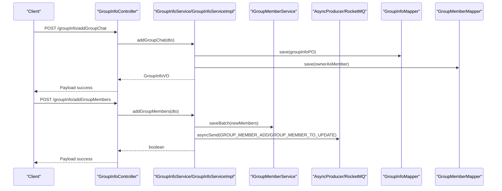
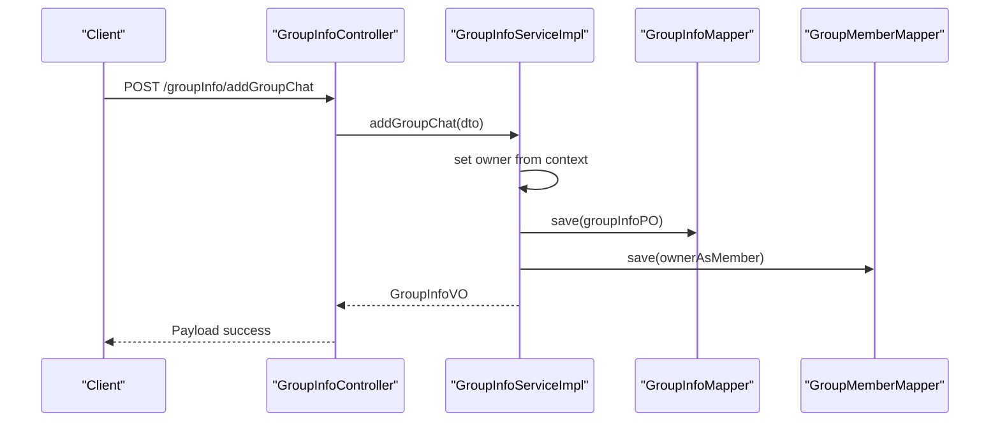
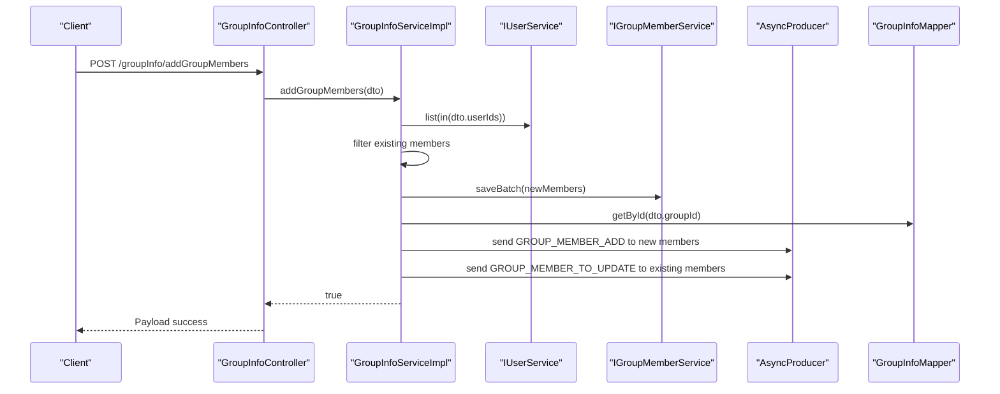
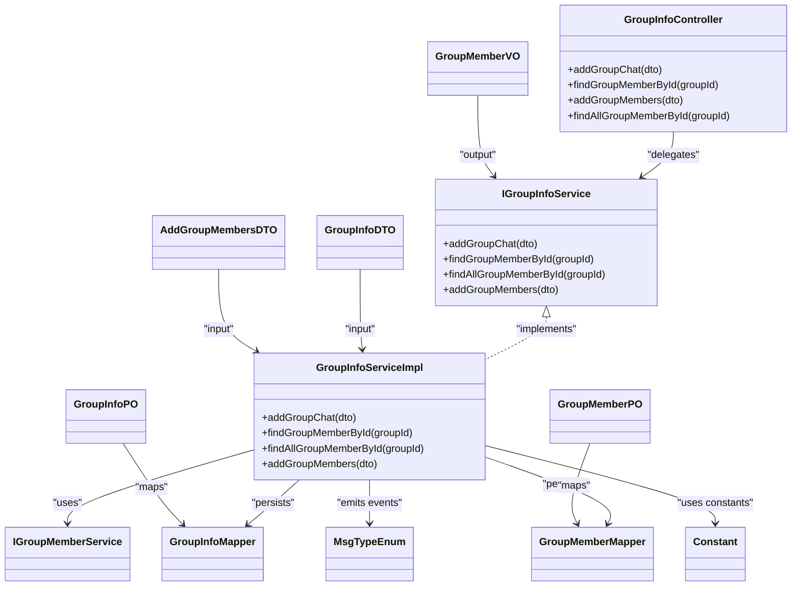

# Group Chat API

<cite>
**Referenced Files in This Document**
- [GroupInfoController.java](file://src/main/java/com/hch/chat_simple/controller/GroupInfoController.java)
- [IGroupInfoService.java](file://src/main/java/com/hch/chat_simple/service/IGroupInfoService.java)
- [GroupInfoServiceImpl.java](file://src/main/java/com/hch/chat_simple/service/impl/GroupInfoServiceImpl.java)
- [IGroupMemberService.java](file://src/main/java/com/hch/chat_simple/service/IGroupMemberService.java)
- [GroupInfoDTO.java](file://src/main/java/com/hch/chat_simple/pojo/dto/GroupInfoDTO.java)
- [AddGroupMembersDTO.java](file://src/main/java/com/hch/chat_simple/pojo/dto/AddGroupMembersDTO.java)
- [GroupMemberVO.java](file://src/main/java/com/hch/chat_simple/pojo/vo/GroupMemberVO.java)
- [GroupInfoPO.java](file://src/main/java/com/hch/chat_simple/pojo/po/GroupInfoPO.java)
- [GroupMemberPO.java](file://src/main/java/com/hch/chat_simple/pojo/po/GroupMemberPO.java)
- [GroupInfoMapper.java](file://src/main/java/com/hch/chat_simple/mapper/GroupInfoMapper.java)
- [GroupMemberMapper.java](file://src/main/java/com/hch/chat_simple/mapper/GroupMemberMapper.java)
- [Constant.java](file://src/main/java/com/hch/chat_simple/util/Constant.java)
- [MsgTypeEnum.java](file://src/main/java/com/hch/chat_simple/enums/MsgTypeEnum.java)
- [application.yml](file://src/main/resources/application.yml)
</cite>

## Table of Contents
1. [Introduction](#introduction)
2. [Project Structure](#project-structure)
3. [Core Components](#core-components)
4. [Architecture Overview](#architecture-overview)
5. [Detailed Component Analysis](#detailed-component-analysis)
6. [Dependency Analysis](#dependency-analysis)
7. [Performance Considerations](#performance-considerations)
8. [Troubleshooting Guide](#troubleshooting-guide)
9. [Conclusion](#conclusion)
10. [Appendices](#appendices)

## Introduction
This document provides comprehensive API documentation for group chat management endpoints. It covers group creation, retrieval of group information, member management (adding/removing members, updating roles), and related messaging notifications. The focus is on the GroupInfoController endpoints and supporting services/models, including request/response schemas, authentication/authorization requirements, and operational behaviors such as group visibility settings and member capacity considerations.

## Project Structure
The group chat module is organized around a controller-service-layer pattern with MyBatis-Plus mappers and PO/VO DTOs. Controllers expose REST endpoints under a base path, services encapsulate business logic, and mappers handle persistence. Messaging is integrated via RocketMQ for asynchronous notifications.

```mermaid
graph TB
subgraph "REST Layer"
C1["GroupInfoController<br/>Base Path: /groupInfo/"]
end
subgraph "Service Layer"
S1["IGroupInfoService"]
S2["GroupInfoServiceImpl"]
S3["IGroupMemberService"]
end
subgraph "Persistence"
M1["GroupInfoMapper"]
M2["GroupMemberMapper"]
end
subgraph "Models"
D1["GroupInfoDTO"]
D2["AddGroupMembersDTO"]
V1["GroupMemberVO"]
P1["GroupInfoPO"]
P2["GroupMemberPO"]
end
subgraph "Messaging"
E1["MsgTypeEnum"]
CFG["application.yml<br/>RocketMQ Topics"]
end
C1 --> S1
S1 < --> S2
S2 --> M1
S2 --> M2
S2 --> S3
S2 --> E1
E1 --> CFG
D1 --> S2
D2 --> S2
V1 --> S1
P1 --> M1
P2 --> M2
```

**Diagram sources**
- [GroupInfoController.java:30-67](file://src/main/java/com/hch/chat_simple/controller/GroupInfoController.java#L30-L67)
- [IGroupInfoService.java:21-30](file://src/main/java/com/hch/chat_simple/service/IGroupInfoService.java#L21-L30)
- [GroupInfoServiceImpl.java:44-142](file://src/main/java/com/hch/chat_simple/service/impl/GroupInfoServiceImpl.java#L44-L142)
- [IGroupMemberService.java:18-20](file://src/main/java/com/hch/chat_simple/service/IGroupMemberService.java#L18-L20)
- [GroupInfoMapper.java:17-20](file://src/main/java/com/hch/chat_simple/mapper/GroupInfoMapper.java#L17-L20)
- [GroupMemberMapper.java:17-20](file://src/main/java/com/hch/chat_simple/mapper/GroupMemberMapper.java#L17-L20)
- [GroupInfoDTO.java:8-25](file://src/main/java/com/hch/chat_simple/pojo/dto/GroupInfoDTO.java#L8-L25)
- [AddGroupMembersDTO.java:9-15](file://src/main/java/com/hch/chat_simple/pojo/dto/AddGroupMembersDTO.java#L9-L15)
- [GroupMemberVO.java:15-39](file://src/main/java/com/hch/chat_simple/pojo/vo/GroupMemberVO.java#L15-L39)
- [GroupInfoPO.java:22-49](file://src/main/java/com/hch/chat_simple/pojo/po/GroupInfoPO.java#L22-L49)
- [GroupMemberPO.java:20-48](file://src/main/java/com/hch/chat_simple/pojo/po/GroupMemberPO.java#L20-L48)
- [MsgTypeEnum.java:6-24](file://src/main/java/com/hch/chat_simple/enums/MsgTypeEnum.java#L6-L24)
- [application.yml:39-51](file://src/main/resources/application.yml#L39-L51)

**Section sources**
- [GroupInfoController.java:30-67](file://src/main/java/com/hch/chat_simple/controller/GroupInfoController.java#L30-L67)
- [IGroupInfoService.java:21-30](file://src/main/java/com/hch/chat_simple/service/IGroupInfoService.java#L21-L30)
- [GroupInfoServiceImpl.java:44-142](file://src/main/java/com/hch/chat_simple/service/impl/GroupInfoServiceImpl.java#L44-L142)
- [application.yml:39-51](file://src/main/resources/application.yml#L39-L51)

## Core Components
- GroupInfoController: Exposes endpoints for group creation, member retrieval, and bulk member addition.
- IGroupInfoService: Defines service contract for group operations.
- GroupInfoServiceImpl: Implements group creation, member queries, and member addition with notifications.
- DTOs and VO: GroupInfoDTO, AddGroupMembersDTO, GroupMemberVO define request/response shapes.
- POs: GroupInfoPO, GroupMemberPO represent persisted entities.
- Messaging: MsgTypeEnum defines event types; application.yml configures RocketMQ topics.

**Section sources**
- [GroupInfoController.java:30-67](file://src/main/java/com/hch/chat_simple/controller/GroupInfoController.java#L30-L67)
- [IGroupInfoService.java:21-30](file://src/main/java/com/hch/chat_simple/service/IGroupInfoService.java#L21-L30)
- [GroupInfoServiceImpl.java:44-142](file://src/main/java/com/hch/chat_simple/service/impl/GroupInfoServiceImpl.java#L44-L142)
- [GroupInfoDTO.java:8-25](file://src/main/java/com/hch/chat_simple/pojo/dto/GroupInfoDTO.java#L8-L25)
- [AddGroupMembersDTO.java:9-15](file://src/main/java/com/hch/chat_simple/pojo/dto/AddGroupMembersDTO.java#L9-L15)
- [GroupMemberVO.java:15-39](file://src/main/java/com/hch/chat_simple/pojo/vo/GroupMemberVO.java#L15-L39)
- [GroupInfoPO.java:22-49](file://src/main/java/com/hch/chat_simple/pojo/po/GroupInfoPO.java#L22-L49)
- [GroupMemberPO.java:20-48](file://src/main/java/com/hch/chat_simple/pojo/po/GroupMemberPO.java#L20-L48)
- [MsgTypeEnum.java:6-24](file://src/main/java/com/hch/chat_simple/enums/MsgTypeEnum.java#L6-L24)

## Architecture Overview
The group chat API follows a layered architecture:
- REST endpoints delegate to service interfaces.
- Services orchestrate persistence via MyBatis-Plus mappers and emit asynchronous events via RocketMQ.
- Member addition triggers notifications to newly added members and existing members.



**Diagram sources**
- [GroupInfoController.java:39-59](file://src/main/java/com/hch/chat_simple/controller/GroupInfoController.java#L39-L59)
- [IGroupInfoService.java:23-29](file://src/main/java/com/hch/chat_simple/service/IGroupInfoService.java#L23-L29)
- [GroupInfoServiceImpl.java:59-80](file://src/main/java/com/hch/chat_simple/service/impl/GroupInfoServiceImpl.java#L59-L80)
- [GroupInfoServiceImpl.java:101-141](file://src/main/java/com/hch/chat_simple/service/impl/GroupInfoServiceImpl.java#L101-L141)
- [MsgTypeEnum.java:13-14](file://src/main/java/com/hch/chat_simple/enums/MsgTypeEnum.java#L13-L14)
- [application.yml:47-51](file://src/main/resources/application.yml#L47-L51)

## Detailed Component Analysis

### GroupInfoController Endpoints
- Base Path: /groupInfo/
- Authentication: Requires login; enforced by interceptors configured in the application.
- Authorization: Operations are bound to the current authenticated user context.

Endpoints:
- POST /groupInfo/addGroupChat
  - Purpose: Create a new group chat with the caller as the initial owner/member.
  - Request Body: GroupInfoDTO
  - Response: Payload wrapping GroupInfoVO
  - Notes: The service sets the group owner from the current user context.

- GET /groupInfo/findGroupMemberById
  - Purpose: Retrieve active members of a group (status = in-group).
  - Query Param: groupId (Long)
  - Response: Payload wrapping List<GroupMemberVO>

- POST /groupInfo/addGroupMembers
  - Purpose: Add multiple users to a group.
  - Request Body: AddGroupMembersDTO (groupId, userIds)
  - Response: Payload wrapping boolean
  - Behavior: Filters out existing members; persists new memberships; emits notifications.

- GET /groupInfo/findAllGroupMemberById
  - Purpose: Retrieve all group members including those who left (for chat history).
  - Query Param: groupId (Long)
  - Response: Payload wrapping List<GroupMemberVO>

**Section sources**
- [GroupInfoController.java:39-66](file://src/main/java/com/hch/chat_simple/controller/GroupInfoController.java#L39-L66)
- [IGroupInfoService.java:23-29](file://src/main/java/com/hch/chat_simple/service/IGroupInfoService.java#L23-L29)

### Group Creation Workflow


**Diagram sources**
- [GroupInfoController.java:39-44](file://src/main/java/com/hch/chat_simple/controller/GroupInfoController.java#L39-L44)
- [GroupInfoServiceImpl.java:61-80](file://src/main/java/com/hch/chat_simple/service/impl/GroupInfoServiceImpl.java#L61-L80)
- [GroupInfoMapper.java:17-20](file://src/main/java/com/hch/chat_simple/mapper/GroupInfoMapper.java#L17-L20)
- [GroupMemberMapper.java:17-20](file://src/main/java/com/hch/chat_simple/mapper/GroupMemberMapper.java#L17-L20)

**Section sources**
- [GroupInfoServiceImpl.java:61-80](file://src/main/java/com/hch/chat_simple/service/impl/GroupInfoServiceImpl.java#L61-L80)

### Bulk Member Addition Workflow


**Diagram sources**
- [GroupInfoController.java:54-59](file://src/main/java/com/hch/chat_simple/controller/GroupInfoController.java#L54-L59)
- [GroupInfoServiceImpl.java:101-141](file://src/main/java/com/hch/chat_simple/service/impl/GroupInfoServiceImpl.java#L101-L141)
- [MsgTypeEnum.java:13-14](file://src/main/java/com/hch/chat_simple/enums/MsgTypeEnum.java#L13-L14)
- [application.yml:47-51](file://src/main/resources/application.yml#L47-L51)

**Section sources**
- [GroupInfoServiceImpl.java:101-141](file://src/main/java/com/hch/chat_simple/service/impl/GroupInfoServiceImpl.java#L101-L141)

### Data Models

#### GroupInfoDTO
- groupName: string
- groupRemark: string
- groupStatus: integer (0=open, 1=members invite, 2=owner invites only, 3=password-protected)
- groupLockPwd: string
- selfId: long (owner id)

#### AddGroupMembersDTO
- userIds: array of long
- groupId: long

#### GroupMemberVO
- id: long
- groupId: long
- memberId: long
- memberName: string
- memberRemark: string
- inviteId: long

#### GroupInfoPO
- id: long
- groupName: string
- groupRemark: string
- groupStatus: integer
- groupLockPwd: string
- selfId: long

#### GroupMemberPO
- id: long
- groupId: long
- memberId: long
- memberName: string
- memberRemark: string
- inviteId: long
- status: integer (0=left, 1=in-group)

**Section sources**
- [GroupInfoDTO.java:8-25](file://src/main/java/com/hch/chat_simple/pojo/dto/GroupInfoDTO.java#L8-L25)
- [AddGroupMembersDTO.java:9-15](file://src/main/java/com/hch/chat_simple/pojo/dto/AddGroupMembersDTO.java#L9-L15)
- [GroupMemberVO.java:15-39](file://src/main/java/com/hch/chat_simple/pojo/vo/GroupMemberVO.java#L15-L39)
- [GroupInfoPO.java:22-49](file://src/main/java/com/hch/chat_simple/pojo/po/GroupInfoPO.java#L22-L49)
- [GroupMemberPO.java:20-48](file://src/main/java/com/hch/chat_simple/pojo/po/GroupMemberPO.java#L20-L48)

### Group Visibility Settings
- groupStatus values:
  - 0: Open (anyone can join)
  - 1: Members invite (existing members invite)
  - 2: Owner invites only (only owner can add)
  - 3: Password-protected (requires groupLockPwd)
- These settings are part of GroupInfoPO/DTO and influence membership policies.

**Section sources**
- [GroupInfoDTO.java:17](file://src/main/java/com/hch/chat_simple/pojo/dto/GroupInfoDTO.java#L17)
- [GroupInfoPO.java:40](file://src/main/java/com/hch/chat_simple/pojo/po/GroupInfoPO.java#L40)

### Member Capacity Limits
- The service filters duplicates by checking existing members before insertion.
- There is no explicit maximum member limit enforced in the current implementation; practical limits depend on storage and performance.

**Section sources**
- [GroupInfoServiceImpl.java:108-122](file://src/main/java/com/hch/chat_simple/service/impl/GroupInfoServiceImpl.java#L108-L122)

### Ownership Transfer
- Ownership is represented by selfId in GroupInfoPO/DTO.
- No dedicated endpoint exists for ownership transfer in the current controller; implement via a new endpoint if required.

**Section sources**
- [GroupInfoDTO.java:24](file://src/main/java/com/hch/chat_simple/pojo/dto/GroupInfoDTO.java#L24)
- [GroupInfoPO.java:46](file://src/main/java/com/hch/chat_simple/pojo/po/GroupInfoPO.java#L46)

### Member Invitation Mechanisms
- Owner or authorized members can add users via addGroupMembers.
- Inviter identity (inviteId) is recorded per member.
- Notifications are sent to invited users and existing members upon successful addition.

**Section sources**
- [GroupInfoServiceImpl.java:123-138](file://src/main/java/com/hch/chat_simple/service/impl/GroupInfoServiceImpl.java#L123-L138)
- [GroupMemberPO.java:42](file://src/main/java/com/hch/chat_simple/pojo/po/GroupMemberPO.java#L42)

### Group-Specific Message Handling and Broadcast Permissions
- Messaging events:
  - GROUP_MEMBER_ADD: notifies newly added members
  - GROUP_MEMBER_TO_UPDATE: notifies existing members about new joiners
- Topic configuration is defined in application.yml under mq.topic.composition.

**Section sources**
- [MsgTypeEnum.java:13-14](file://src/main/java/com/hch/chat_simple/enums/MsgTypeEnum.java#L13-L14)
- [application.yml:47-51](file://src/main/resources/application.yml#L47-L51)

### Moderation Controls
- Current implementation does not expose moderator promotion/demotion endpoints.
- Member status filtering is limited to active members (IN_GROUP) in queries.

**Section sources**
- [GroupInfoServiceImpl.java:82-90](file://src/main/java/com/hch/chat_simple/service/impl/GroupInfoServiceImpl.java#L82-L90)
- [Constant.java:23-25](file://src/main/java/com/hch/chat_simple/util/Constant.java#L23-L25)

### Examples

- Create a group with initial owner as member
  - Endpoint: POST /groupInfo/addGroupChat
  - Request Body: GroupInfoDTO with groupName, groupRemark, groupStatus, groupLockPwd, selfId
  - Response: Payload with GroupInfoVO

- Manage group settings
  - Update groupStatus and groupLockPwd via administrative actions (no dedicated endpoint shown); adjust selfId for ownership transfer if needed.

- Add members to a group
  - Endpoint: POST /groupInfo/addGroupMembers
  - Request Body: AddGroupMembersDTO with groupId and userIds
  - Response: Payload with boolean success

- Retrieve active members
  - Endpoint: GET /groupInfo/findGroupMemberById?groupId={id}
  - Response: Payload with List<GroupMemberVO>

- Retrieve all members (including left)
  - Endpoint: GET /groupInfo/findAllGroupMemberById?groupId={id}
  - Response: Payload with List<GroupMemberVO>

**Section sources**
- [GroupInfoController.java:39-66](file://src/main/java/com/hch/chat_simple/controller/GroupInfoController.java#L39-L66)
- [GroupInfoDTO.java:8-25](file://src/main/java/com/hch/chat_simple/pojo/dto/GroupInfoDTO.java#L8-L25)
- [AddGroupMembersDTO.java:9-15](file://src/main/java/com/hch/chat_simple/pojo/dto/AddGroupMembersDTO.java#L9-L15)
- [GroupMemberVO.java:15-39](file://src/main/java/com/hch/chat_simple/pojo/vo/GroupMemberVO.java#L15-L39)

## Dependency Analysis


**Diagram sources**
- [GroupInfoController.java:30-67](file://src/main/java/com/hch/chat_simple/controller/GroupInfoController.java#L30-L67)
- [IGroupInfoService.java:21-30](file://src/main/java/com/hch/chat_simple/service/IGroupInfoService.java#L21-L30)
- [GroupInfoServiceImpl.java:44-142](file://src/main/java/com/hch/chat_simple/service/impl/GroupInfoServiceImpl.java#L44-L142)
- [IGroupMemberService.java:18-20](file://src/main/java/com/hch/chat_simple/service/IGroupMemberService.java#L18-L20)
- [GroupInfoMapper.java:17-20](file://src/main/java/com/hch/chat_simple/mapper/GroupInfoMapper.java#L17-L20)
- [GroupMemberMapper.java:17-20](file://src/main/java/com/hch/chat_simple/mapper/GroupMemberMapper.java#L17-L20)
- [GroupInfoDTO.java:8-25](file://src/main/java/com/hch/chat_simple/pojo/dto/GroupInfoDTO.java#L8-L25)
- [AddGroupMembersDTO.java:9-15](file://src/main/java/com/hch/chat_simple/pojo/dto/AddGroupMembersDTO.java#L9-L15)
- [GroupMemberVO.java:15-39](file://src/main/java/com/hch/chat_simple/pojo/vo/GroupMemberVO.java#L15-L39)
- [GroupInfoPO.java:22-49](file://src/main/java/com/hch/chat_simple/pojo/po/GroupInfoPO.java#L22-L49)
- [GroupMemberPO.java:20-48](file://src/main/java/com/hch/chat_simple/pojo/po/GroupMemberPO.java#L20-L48)
- [MsgTypeEnum.java:6-24](file://src/main/java/com/hch/chat_simple/enums/MsgTypeEnum.java#L6-L24)
- [Constant.java:3-32](file://src/main/java/com/hch/chat_simple/util/Constant.java#L3-L32)

**Section sources**
- [GroupInfoServiceImpl.java:44-142](file://src/main/java/com/hch/chat_simple/service/impl/GroupInfoServiceImpl.java#L44-L142)

## Performance Considerations
- Batch operations: addGroupMembers uses batch insert for new members to reduce round-trips.
- Filtering: Existing members are filtered before insertion to avoid duplicates.
- Asynchronous notifications: Uses RocketMQ to offload notification dispatching and improve response latency.
- Query scoping: findGroupMemberById filters by IN_GROUP status to minimize result size.

[No sources needed since this section provides general guidance]

## Troubleshooting Guide
Common scenarios and resolutions:
- Insufficient permissions
  - Cause: Caller lacks authorization to add members or modify group settings.
  - Resolution: Ensure the caller is authenticated and authorized; verify group membership rules (e.g., groupStatus).
- Invalid group operations
  - Cause: Attempting to add users to a non-existent group or with invalid groupId.
  - Resolution: Validate groupId and existence before invoking addGroupMembers.
- Member capacity limits
  - Symptom: Unexpected duplicate entries.
  - Cause: Attempting to add users already present in the group.
  - Resolution: The service filters duplicates; ensure userIds do not overlap with existing members.
- Notification delivery failures
  - Symptom: Newly added members do not receive notifications.
  - Resolution: Verify RocketMQ configuration and topic names in application.yml; confirm AsyncProducer connectivity.

**Section sources**
- [GroupInfoServiceImpl.java:108-122](file://src/main/java/com/hch/chat_simple/service/impl/GroupInfoServiceImpl.java#L108-L122)
- [application.yml:47-51](file://src/main/resources/application.yml#L47-L51)

## Conclusion
The group chat API provides essential endpoints for group lifecycle management and member administration. GroupInfoController exposes straightforward CRUD-like operations for groups and members, backed by robust service logic that handles deduplication, status filtering, and asynchronous notifications. Administrators can manage group visibility and membership policies through groupStatus and selfId. Extending the API to support ownership transfer, moderation roles, and explicit member removal would further enhance administrative capabilities.

[No sources needed since this section summarizes without analyzing specific files]

## Appendices

### API Reference Summary

- POST /groupInfo/addGroupChat
  - Description: Create a new group chat with the current user as owner and initial member.
  - Request: GroupInfoDTO
  - Response: Payload<GroupInfoVO>

- GET /groupInfo/findGroupMemberById?groupId={id}
  - Description: Retrieve active members of a group.
  - Response: Payload<List<GroupMemberVO>>

- POST /groupInfo/addGroupMembers
  - Description: Add multiple users to a group; filters duplicates; sends notifications.
  - Request: AddGroupMembersDTO
  - Response: Payload<boolean>

- GET /groupInfo/findAllGroupMemberById?groupId={id}
  - Description: Retrieve all members including those who left.
  - Response: Payload<List<GroupMemberVO>>

**Section sources**
- [GroupInfoController.java:39-66](file://src/main/java/com/hch/chat_simple/controller/GroupInfoController.java#L39-L66)