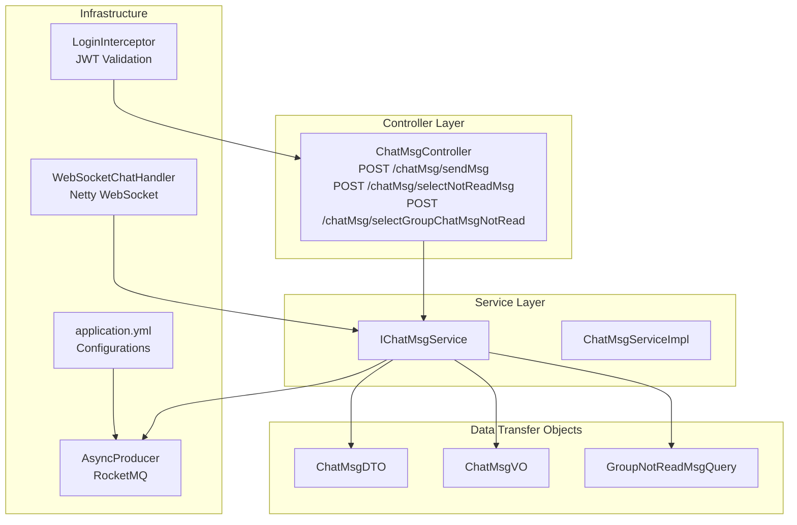
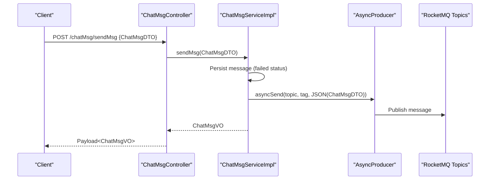
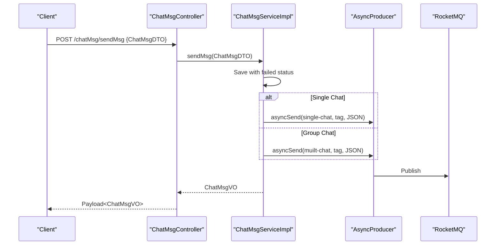
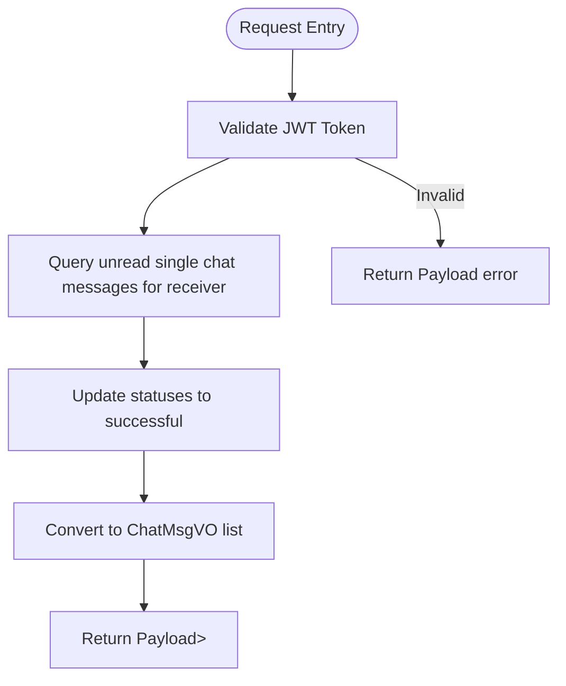
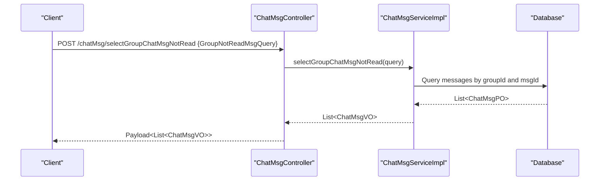
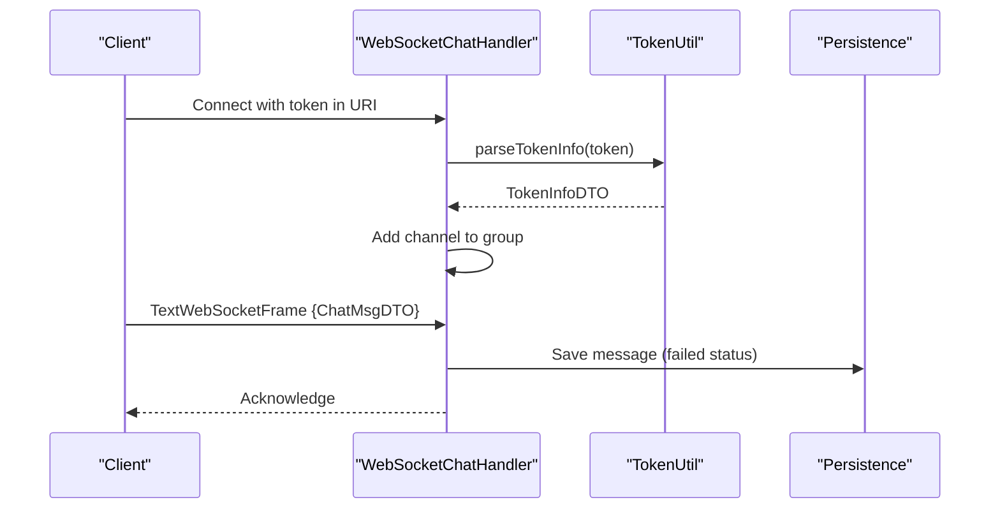
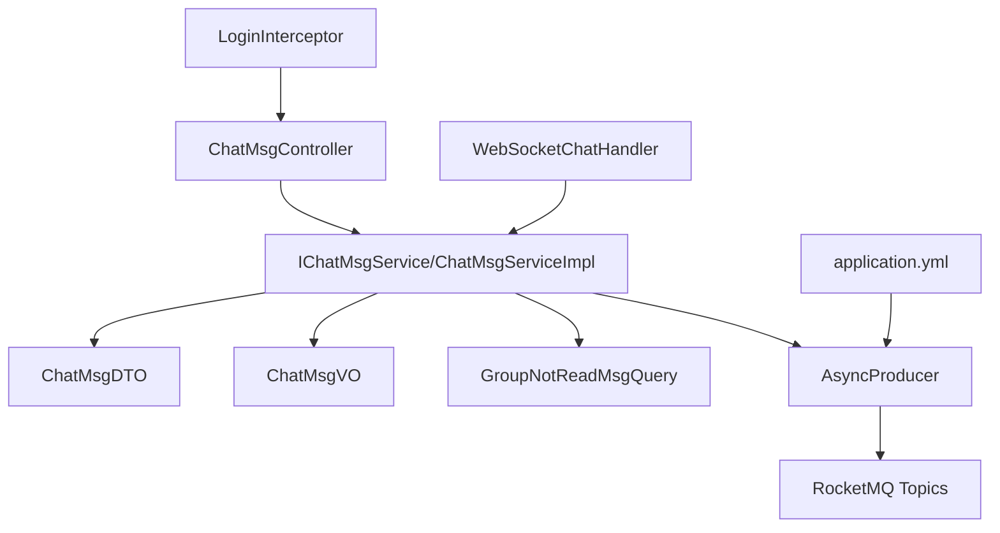

# Message Management API

<cite>
**Referenced Files in This Document**
- [ChatMsgController.java](file://src/main/java/com/hch/chat_simple/controller/ChatMsgController.java)
- [ChatMsgDTO.java](file://src/main/java/com/hch/chat_simple/pojo/dto/ChatMsgDTO.java)
- [ChatMsgVO.java](file://src/main/java/com/hch/chat_simple/pojo/vo/ChatMsgVO.java)
- [IChatMsgService.java](file://src/main/java/com/hch/chat_simple/service/IChatMsgService.java)
- [ChatMsgServiceImpl.java](file://src/main/java/com/hch/chat_simple/service/impl/ChatMsgServiceImpl.java)
- [GroupNotReadMsgQuery.java](file://src/main/java/com/hch/chat_simple/pojo/query/GroupNotReadMsgQuery.java)
- [LoginInterceptor.java](file://src/main/java/com/hch/chat_simple/config/LoginInterceptor.java)
- [WebSocketChatHandler.java](file://src/main/java/com/hch/chat_simple/handler/WebSocketChatHandler.java)
- [MsgTypeEnum.java](file://src/main/java/com/hch/chat_simple/enums/MsgTypeEnum.java)
- [Constant.java](file://src/main/java/com/hch/chat_simple/util/Constant.java)
- [AsyncProducer.java](file://src/main/java/com/hch/chat_simple/mq/AsyncProducer.java)
- [application.yml](file://src/main/resources/application.yml)
- [Payload.java](file://src/main/java/com/hch/chat_simple/util/Payload.java)
- [TokenUtil.java](file://src/main/java/com/hch/chat_simple/util/TokenUtil.java)
</cite>

## Table of Contents
1. [Introduction](#introduction)
2. [Project Structure](#project-structure)
3. [Core Components](#core-components)
4. [Architecture Overview](#architecture-overview)
5. [Detailed Component Analysis](#detailed-component-analysis)
6. [Dependency Analysis](#dependency-analysis)
7. [Performance Considerations](#performance-considerations)
8. [Troubleshooting Guide](#troubleshooting-guide)
9. [Conclusion](#conclusion)

## Introduction
This document provides comprehensive API documentation for message management endpoints focused on chat message operations. It covers three primary endpoints exposed by the ChatMsgController:
- POST /chatMsg/sendMsg: Send a single chat message
- POST /chatMsg/selectNotReadMsg: Retrieve unread personal messages
- POST /chatMsg/selectGroupChatMsgNotRead: Fetch unread group chat messages

The documentation specifies HTTP method, URL pattern, request/response schemas using ChatMsgDTO and ChatMsgVO models, authentication requirements via JWT tokens, error handling, practical examples with JSON payloads, message types, payload validation rules, and WebSocket integration for real-time message delivery. It also addresses rate limiting, message size limits, and security considerations for message transmission.

## Project Structure
The message management functionality resides in the controller-service-mapper layer with supporting utilities for authentication, messaging queues, and WebSocket handling.

**Diagram sources**
- [ChatMsgController.java:31-57](file://src/main/java/com/hch/chat_simple/controller/ChatMsgController.java#L31-L57)
- [IChatMsgService.java:20-27](file://src/main/java/com/hch/chat_simple/service/IChatMsgService.java#L20-L27)
- [ChatMsgServiceImpl.java:55-183](file://src/main/java/com/hch/chat_simple/service/impl/ChatMsgServiceImpl.java#L55-L183)
- [ChatMsgDTO.java:12-61](file://src/main/java/com/hch/chat_simple/pojo/dto/ChatMsgDTO.java#L12-L61)
- [ChatMsgVO.java:12-61](file://src/main/java/com/hch/chat_simple/pojo/vo/ChatMsgVO.java#L12-L61)
- [GroupNotReadMsgQuery.java:8-26](file://src/main/java/com/hch/chat_simple/pojo/query/GroupNotReadMsgQuery.java#L8-L26)
- [LoginInterceptor.java:28-108](file://src/main/java/com/hch/chat_simple/config/LoginInterceptor.java#L28-L108)
- [WebSocketChatHandler.java:48-195](file://src/main/java/com/hch/chat_simple/handler/WebSocketChatHandler.java#L48-L195)
- [AsyncProducer.java:17-62](file://src/main/java/com/hch/chat_simple/mq/AsyncProducer.java#L17-L62)
- [application.yml:39-89](file://src/main/resources/application.yml#L39-L89)

**Section sources**
- [ChatMsgController.java:31-57](file://src/main/java/com/hch/chat_simple/controller/ChatMsgController.java#L31-L57)
- [application.yml:39-89](file://src/main/resources/application.yml#L39-L89)

## Core Components
- ChatMsgController: Exposes three endpoints under /chatMsg for sending messages, retrieving unread personal messages, and fetching unread group chat messages.
- ChatMsgServiceImpl: Implements business logic for message sending, persistence, MQ publishing, and unread message retrieval.
- ChatMsgDTO: Request schema for sending messages, including message type, chat type, sender/receiver identifiers, content, group metadata, timestamps, and content type/length.
- ChatMsgVO: Response schema representing persisted message records with identifiers, types, content, timestamps, and status.
- GroupNotReadMsgQuery: Query schema for fetching unread group messages, containing a list of group parameters with groupId and last message id.
- LoginInterceptor: Enforces JWT-based authentication for requests, extracting token from the "token" header and setting user context.
- WebSocketChatHandler: Handles WebSocket connections for real-time messaging, validating tokens, managing channel groups, and preparing message payloads.
- AsyncProducer: Asynchronous RocketMQ producer for dispatching single and group chat messages to message brokers.
- application.yml: Contains RocketMQ topics, Redisson configuration, and other infrastructure settings.

**Section sources**
- [ChatMsgController.java:31-57](file://src/main/java/com/hch/chat_simple/controller/ChatMsgController.java#L31-L57)
- [ChatMsgServiceImpl.java:55-183](file://src/main/java/com/hch/chat_simple/service/impl/ChatMsgServiceImpl.java#L55-L183)
- [ChatMsgDTO.java:12-61](file://src/main/java/com/hch/chat_simple/pojo/dto/ChatMsgDTO.java#L12-L61)
- [ChatMsgVO.java:12-61](file://src/main/java/com/hch/chat_simple/pojo/vo/ChatMsgVO.java#L12-L61)
- [GroupNotReadMsgQuery.java:8-26](file://src/main/java/com/hch/chat_simple/pojo/query/GroupNotReadMsgQuery.java#L8-L26)
- [LoginInterceptor.java:28-108](file://src/main/java/com/hch/chat_simple/config/LoginInterceptor.java#L28-L108)
- [WebSocketChatHandler.java:48-195](file://src/main/java/com/hch/chat_simple/handler/WebSocketChatHandler.java#L48-L195)
- [AsyncProducer.java:17-62](file://src/main/java/com/hch/chat_simple/mq/AsyncProducer.java#L17-L62)
- [application.yml:39-89](file://src/main/resources/application.yml#L39-L89)

## Architecture Overview
The message management API follows a layered architecture:
- HTTP endpoints accept requests and return standardized responses via Payload wrappers.
- Controllers delegate to services for business logic.
- Services persist messages, publish to MQ topics for asynchronous delivery, and query unread messages.
- WebSocket handlers manage real-time connections and token verification.
- Interceptors enforce JWT authentication and set user context.

**Diagram sources**
- [ChatMsgController.java:45-49](file://src/main/java/com/hch/chat_simple/controller/ChatMsgController.java#L45-L49)
- [ChatMsgServiceImpl.java:98-144](file://src/main/java/com/hch/chat_simple/service/impl/ChatMsgServiceImpl.java#L98-L144)
- [AsyncProducer.java:40-59](file://src/main/java/com/hch/chat_simple/mq/AsyncProducer.java#L40-L59)

**Section sources**
- [ChatMsgController.java:31-57](file://src/main/java/com/hch/chat_simple/controller/ChatMsgController.java#L31-L57)
- [ChatMsgServiceImpl.java:55-183](file://src/main/java/com/hch/chat_simple/service/impl/ChatMsgServiceImpl.java#L55-L183)
- [AsyncProducer.java:17-62](file://src/main/java/com/hch/chat_simple/mq/AsyncProducer.java#L17-L62)

## Detailed Component Analysis

### Endpoint: POST /chatMsg/sendMsg
- Purpose: Send a single chat message or broadcast a group chat message asynchronously.
- Authentication: Required. Token must be provided in the "token" header; validated by LoginInterceptor.
- Request Body Schema: ChatMsgDTO
  - Fields: msgType, chatType, sendUserId, receiveUserId, content, groupId, createdAt, dateTime, msgId, friendId, groupToUserIds, contentType, contentLen.
  - Notes: For single chat, receiveUserId must be present; for group chat, groupId and groupToUserIds are used.
- Response Body Schema: ChatMsgVO
  - Fields: msgId, msgType, chatType, sendUserId, receiveUserId, content, groupId, status, dr, createdAt, creatorId, dateTime, contentType, contentLen.
- Processing Logic:
  - Set sender identity and timestamps from context and current time.
  - Save message with failed status initially.
  - Publish to appropriate RocketMQ topic based on chatType (single vs group).
  - Return persisted message as ChatMsgVO.
- Error Handling:
  - Invalid or missing token results in a Payload error response.
  - Token expiration triggers a refreshed token and error code.
- Practical Example:
  - Single chat:
    - Header: token: "<JWT_TOKEN>"
    - Body: {"msgType": 2, "chatType": 1, "receiveUserId": 1001, "content": "Hello", "contentType": 1, "contentLen": 5}
  - Group chat:
    - Header: token: "<JWT_TOKEN>"
    - Body: {"msgType": 2, "chatType": 2, "groupId": 2001, "content": "Group update", "contentType": 1, "contentLen": 12}

**Diagram sources**
- [ChatMsgController.java:45-49](file://src/main/java/com/hch/chat_simple/controller/ChatMsgController.java#L45-L49)
- [ChatMsgServiceImpl.java:98-144](file://src/main/java/com/hch/chat_simple/service/impl/ChatMsgServiceImpl.java#L98-L144)
- [AsyncProducer.java:40-59](file://src/main/java/com/hch/chat_simple/mq/AsyncProducer.java#L40-L59)

**Section sources**
- [ChatMsgController.java:45-49](file://src/main/java/com/hch/chat_simple/controller/ChatMsgController.java#L45-L49)
- [ChatMsgServiceImpl.java:98-144](file://src/main/java/com/hch/chat_simple/service/impl/ChatMsgServiceImpl.java#L98-L144)
- [ChatMsgDTO.java:12-61](file://src/main/java/com/hch/chat_simple/pojo/dto/ChatMsgDTO.java#L12-L61)
- [ChatMsgVO.java:12-61](file://src/main/java/com/hch/chat_simple/pojo/vo/ChatMsgVO.java#L12-L61)
- [LoginInterceptor.java:30-90](file://src/main/java/com/hch/chat_simple/config/LoginInterceptor.java#L30-L90)
- [TokenUtil.java:48-69](file://src/main/java/com/hch/chat_simple/util/TokenUtil.java#L48-L69)

### Endpoint: POST /chatMsg/selectNotReadMsg
- Purpose: Retrieve unread personal messages for the authenticated user.
- Authentication: Required. Token must be provided in the "token" header.
- Request Body: Empty (no body required).
- Response Body Schema: Payload<List<ChatMsgVO>>
  - Returns a list of ChatMsgVO entries where receiveUserId matches the authenticated user, chatType indicates single chat, and status equals failed.
  - After retrieval, statuses are updated to successful to prevent duplicate reads.
- Processing Logic:
  - Query messages filtered by receiver, chat type, and failed status.
  - Update statuses to successful in batch.
  - Convert to VO list with computed dateTime.
- Practical Example:
  - Header: token: "<JWT_TOKEN>"
  - Body: (empty)
  - Response: Payload with data array of ChatMsgVO items.

**Diagram sources**
- [ChatMsgController.java:39-43](file://src/main/java/com/hch/chat_simple/controller/ChatMsgController.java#L39-L43)
- [ChatMsgServiceImpl.java:71-95](file://src/main/java/com/hch/chat_simple/service/impl/ChatMsgServiceImpl.java#L71-L95)

**Section sources**
- [ChatMsgController.java:39-43](file://src/main/java/com/hch/chat_simple/controller/ChatMsgController.java#L39-L43)
- [ChatMsgServiceImpl.java:71-95](file://src/main/java/com/hch/chat_simple/service/impl/ChatMsgServiceImpl.java#L71-L95)
- [ChatMsgVO.java:12-61](file://src/main/java/com/hch/chat_simple/pojo/vo/ChatMsgVO.java#L12-L61)
- [Constant.java:8-22](file://src/main/java/com/hch/chat_simple/util/Constant.java#L8-L22)

### Endpoint: POST /chatMsg/selectGroupChatMsgNotRead
- Purpose: Fetch unread group chat messages for specified groups after a given message id.
- Authentication: Required. Token must be provided in the "token" header.
- Request Body Schema: GroupNotReadMsgQuery
  - Fields: groupList (array of SingleGroupParam)
    - SingleGroupParam: groupId, msgId
- Response Body Schema: Payload<List<ChatMsgVO>>
  - Returns ChatMsgVO entries where chatType equals group chat and id is greater than the provided msgId for each group.
- Processing Logic:
  - Validate non-empty group list.
  - Build dynamic OR conditions across groups and message ids.
  - Query messages and convert to VO list with computed dateTime.
- Practical Example:
  - Header: token: "<JWT_TOKEN>"
  - Body: {"groupList": [{"groupId": 2001, "msgId": 5001}, {"groupId": 2002, "msgId": 5002}]}
  - Response: Payload with data array of ChatMsgVO items.

**Diagram sources**
- [ChatMsgController.java:51-54](file://src/main/java/com/hch/chat_simple/controller/ChatMsgController.java#L51-L54)
- [ChatMsgServiceImpl.java:146-181](file://src/main/java/com/hch/chat_simple/service/impl/ChatMsgServiceImpl.java#L146-L181)
- [GroupNotReadMsgQuery.java:8-26](file://src/main/java/com/hch/chat_simple/pojo/query/GroupNotReadMsgQuery.java#L8-L26)

**Section sources**
- [ChatMsgController.java:51-54](file://src/main/java/com/hch/chat_simple/controller/ChatMsgController.java#L51-L54)
- [ChatMsgServiceImpl.java:146-181](file://src/main/java/com/hch/chat_simple/service/impl/ChatMsgServiceImpl.java#L146-L181)
- [GroupNotReadMsgQuery.java:8-26](file://src/main/java/com/hch/chat_simple/pojo/query/GroupNotReadMsgQuery.java#L8-L26)
- [ChatMsgVO.java:12-61](file://src/main/java/com/hch/chat_simple/pojo/vo/ChatMsgVO.java#L12-L61)

### Message Types and Payload Validation Rules
- Message Type Enum: MsgTypeEnum defines supported message categories including SEND_MSG for chat messages.
- Chat Type: SINGLE_CHAT (1) and MUILT_CHAT (2) indicate single or group chat respectively.
- Validation Rules:
  - Single chat requires receiveUserId.
  - Group chat requires groupId and content.
  - contentType indicates textual or voice content; contentLen reflects length.
  - Timestamps are managed automatically with createdAt and dateTime.

**Section sources**
- [MsgTypeEnum.java:6-15](file://src/main/java/com/hch/chat_simple/enums/MsgTypeEnum.java#L6-L15)
- [Constant.java:19-22](file://src/main/java/com/hch/chat_simple/util/Constant.java#L19-L22)
- [ChatMsgDTO.java:12-61](file://src/main/java/com/hch/chat_simple/pojo/dto/ChatMsgDTO.java#L12-L61)

### WebSocket Integration for Real-Time Delivery
- WebSocketChatHandler manages WebSocket connections:
  - Validates token from request attributes and sets user context.
  - Adds channels to a group for broadcasting.
  - Processes incoming text frames and prepares message payloads.
- Integration Notes:
  - While HTTP endpoints primarily handle message sending, WebSocket handlers support real-time session management and token verification.
  - Messages sent via HTTP are published to MQ topics for asynchronous delivery and status updates.

**Diagram sources**
- [WebSocketChatHandler.java:118-162](file://src/main/java/com/hch/chat_simple/handler/WebSocketChatHandler.java#L118-L162)
- [TokenUtil.java:61-69](file://src/main/java/com/hch/chat_simple/util/TokenUtil.java#L61-L69)

**Section sources**
- [WebSocketChatHandler.java:48-195](file://src/main/java/com/hch/chat_simple/handler/WebSocketChatHandler.java#L48-L195)
- [TokenUtil.java:48-69](file://src/main/java/com/hch/chat_simple/util/TokenUtil.java#L48-L69)

## Dependency Analysis
The following diagram illustrates key dependencies among components involved in message management:

**Diagram sources**
- [ChatMsgController.java:31-57](file://src/main/java/com/hch/chat_simple/controller/ChatMsgController.java#L31-L57)
- [IChatMsgService.java:20-27](file://src/main/java/com/hch/chat_simple/service/IChatMsgService.java#L20-L27)
- [ChatMsgServiceImpl.java:55-183](file://src/main/java/com/hch/chat_simple/service/impl/ChatMsgServiceImpl.java#L55-L183)
- [AsyncProducer.java:17-62](file://src/main/java/com/hch/chat_simple/mq/AsyncProducer.java#L17-L62)
- [application.yml:39-89](file://src/main/resources/application.yml#L39-L89)

**Section sources**
- [ChatMsgController.java:31-57](file://src/main/java/com/hch/chat_simple/controller/ChatMsgController.java#L31-L57)
- [ChatMsgServiceImpl.java:55-183](file://src/main/java/com/hch/chat_simple/service/impl/ChatMsgServiceImpl.java#L55-L183)
- [AsyncProducer.java:17-62](file://src/main/java/com/hch/chat_simple/mq/AsyncProducer.java#L17-L62)
- [application.yml:39-89](file://src/main/resources/application.yml#L39-L89)

## Performance Considerations
- Asynchronous Messaging:
  - Single and group chat messages are published to RocketMQ topics for asynchronous processing, reducing HTTP request latency.
  - Topic configurations are defined in application.yml.
- Batch Updates:
  - Unread message retrieval updates statuses in batch to avoid repeated reads and improve throughput.
- Query Optimization:
  - Group unread queries use dynamic OR conditions per group and message id to minimize redundant scans.
- Concurrency:
  - WebSocket handlers utilize a fixed thread pool for processing events.

**Section sources**
- [ChatMsgServiceImpl.java:71-95](file://src/main/java/com/hch/chat_simple/service/impl/ChatMsgServiceImpl.java#L71-L95)
- [ChatMsgServiceImpl.java:146-181](file://src/main/java/com/hch/chat_simple/service/impl/ChatMsgServiceImpl.java#L146-L181)
- [WebSocketChatHandler.java:55-55](file://src/main/java/com/hch/chat_simple/handler/WebSocketChatHandler.java#L55-L55)
- [application.yml:39-89](file://src/main/resources/application.yml#L39-L89)

## Troubleshooting Guide
- Authentication Failures:
  - Missing or invalid token results in a Payload error response indicating token validation failure or absence.
  - Token expiration triggers a refreshed token and error code; clients should retry with the new token.
- Message Sending Issues:
  - Ensure chatType and required identifiers (receiveUserId for single chat, groupId for group chat) are provided.
  - Verify contentType and contentLen align with message content.
- Unread Messages Retrieval:
  - For selectNotReadMsg, confirm the receiver matches the authenticated user and statuses are properly updated.
  - For selectGroupChatMsgNotRead, ensure groupList contains valid groupId and msgId pairs.
- WebSocket Connectivity:
  - Confirm token parsing succeeds and channels are added to the group for broadcasting.

**Section sources**
- [LoginInterceptor.java:74-82](file://src/main/java/com/hch/chat_simple/config/LoginInterceptor.java#L74-L82)
- [LoginInterceptor.java:16-20](file://src/main/java/com/hch/chat_simple/config/LoginInterceptor.java#L16-L20)
- [TokenUtil.java:48-69](file://src/main/java/com/hch/chat_simple/util/TokenUtil.java#L48-L69)
- [Payload.java:18-28](file://src/main/java/com/hch/chat_simple/util/Payload.java#L18-L28)

## Conclusion
The Message Management API provides robust endpoints for sending and retrieving chat messages with strong authentication, asynchronous delivery via RocketMQ, and optional WebSocket integration for real-time sessions. The documented schemas, validation rules, and error handling ensure predictable behavior for clients. For production deployments, consider implementing rate limiting, message size constraints, and additional security measures as per organizational policies.