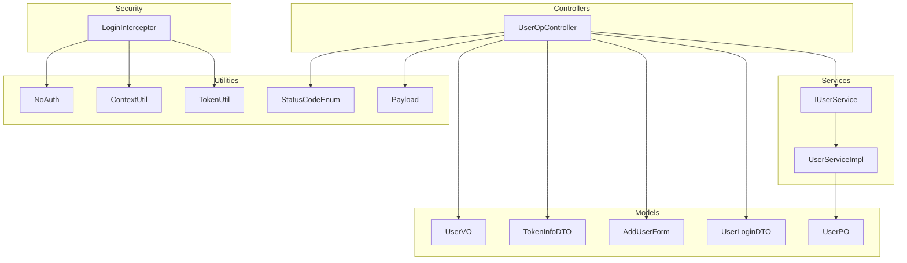
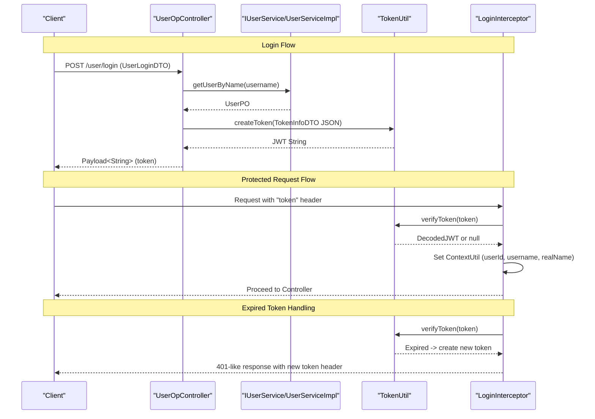
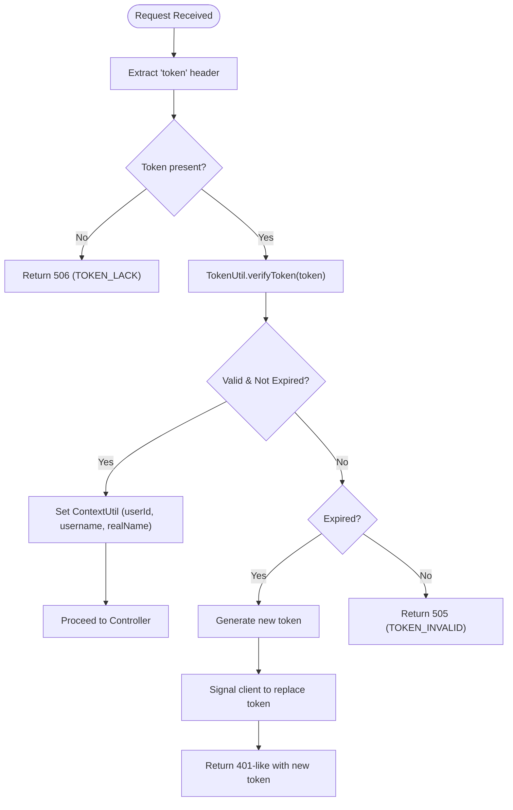
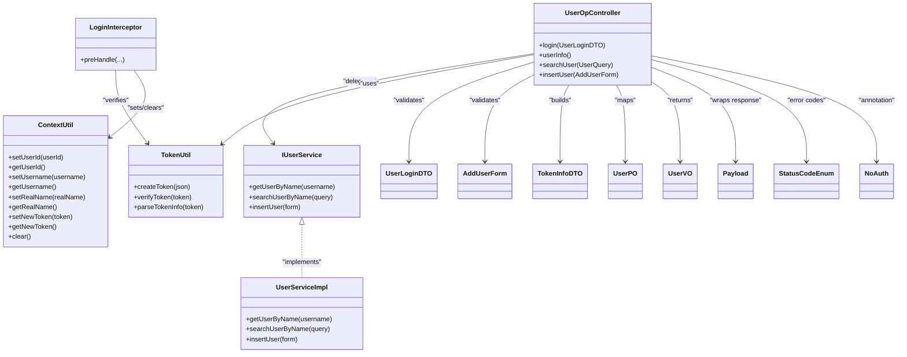

# User Authentication API

<cite>
**Referenced Files in This Document**
- [UserOpController.java](file://src/main/java/com/hch/chat_simple/controller/UserOpController.java)
- [UserLoginDTO.java](file://src/main/java/com/hch/chat_simple/pojo/dto/UserLoginDTO.java)
- [AddUserForm.java](file://src/main/java/com/hch/chat_simple/pojo/dto/AddUserForm.java)
- [TokenInfoDTO.java](file://src/main/java/com/hch/chat_simple/pojo/dto/TokenInfoDTO.java)
- [UserPO.java](file://src/main/java/com/hch/chat_simple/pojo/po/UserPO.java)
- [UserVO.java](file://src/main/java/com/hch/chat_simple/pojo/vo/UserVO.java)
- [IUserService.java](file://src/main/java/com/hch/chat_simple/service/IUserService.java)
- [UserServiceImpl.java](file://src/main/java/com/hch/chat_simple/service/impl/UserServiceImpl.java)
- [TokenUtil.java](file://src/main/java/com/hch/chat_simple/util/TokenUtil.java)
- [LoginInterceptor.java](file://src/main/java/com/hch/chat_simple/config/LoginInterceptor.java)
- [ContextUtil.java](file://src/main/java/com/hch/chat_simple/util/ContextUtil.java)
- [Payload.java](file://src/main/java/com/hch/chat_simple/util/Payload.java)
- [StatusCodeEnum.java](file://src/main/java/com/hch/chat_simple/util/StatusCodeEnum.java)
- [NoAuth.java](file://src/main/java/com/hch/chat_simple/auth/NoAuth.java)
- [application.yml](file://src/main/resources/application.yml)
</cite>

## Table of Contents
1. [Introduction](#introduction)
2. [Project Structure](#project-structure)
3. [Core Components](#core-components)
4. [Architecture Overview](#architecture-overview)
5. [Detailed Component Analysis](#detailed-component-analysis)
6. [Dependency Analysis](#dependency-analysis)
7. [Performance Considerations](#performance-considerations)
8. [Troubleshooting Guide](#troubleshooting-guide)
9. [Conclusion](#conclusion)

## Introduction
This document provides comprehensive API documentation for user authentication and management endpoints. It covers UserOpController endpoints for user registration, login, and profile retrieval, along with JWT token-based authentication and session management. The documentation specifies HTTP methods, URL patterns, request/response schemas using UserLoginDTO and UserPO models, token lifecycle, and practical examples for common operations. It also outlines security measures, validation rules, and error handling.

## Project Structure
The authentication-related components are organized under the controller, service, DTO/PO/VO models, utilities, and configuration packages. The primary entry point for user operations is the UserOpController, which delegates to IUserService implementations for persistence and business logic.



**Diagram sources**
- [UserOpController.java:35-113](file://src/main/java/com/hch/chat_simple/controller/UserOpController.java#L35-L113)
- [IUserService.java:19-27](file://src/main/java/com/hch/chat_simple/service/IUserService.java#L19-L27)
- [UserServiceImpl.java:37-99](file://src/main/java/com/hch/chat_simple/service/impl/UserServiceImpl.java#L37-L99)
- [UserLoginDTO.java:11-21](file://src/main/java/com/hch/chat_simple/pojo/dto/UserLoginDTO.java#L11-L21)
- [AddUserForm.java:9-22](file://src/main/java/com/hch/chat_simple/pojo/dto/AddUserForm.java#L9-L22)
- [TokenInfoDTO.java:14-19](file://src/main/java/com/hch/chat_simple/pojo/dto/TokenInfoDTO.java#L14-L19)
- [UserPO.java:26-46](file://src/main/java/com/hch/chat_simple/pojo/po/UserPO.java#L26-L46)
- [UserVO.java:27-43](file://src/main/java/com/hch/chat_simple/pojo/vo/UserVO.java#L27-L43)
- [TokenUtil.java:18-70](file://src/main/java/com/hch/chat_simple/util/TokenUtil.java#L18-L70)
- [ContextUtil.java:5-51](file://src/main/java/com/hch/chat_simple/util/ContextUtil.java#L5-L51)
- [Payload.java:6-29](file://src/main/java/com/hch/chat_simple/util/Payload.java#L6-L29)
- [StatusCodeEnum.java:6-21](file://src/main/java/com/hch/chat_simple/util/StatusCodeEnum.java#L6-L21)
- [LoginInterceptor.java:28-108](file://src/main/java/com/hch/chat_simple/config/LoginInterceptor.java#L28-L108)
- [NoAuth.java:8-13](file://src/main/java/com/hch/chat_simple/auth/NoAuth.java#L8-L13)

**Section sources**
- [UserOpController.java:35-113](file://src/main/java/com/hch/chat_simple/controller/UserOpController.java#L35-L113)
- [application.yml:1-89](file://src/main/resources/application.yml#L1-L89)

## Core Components
- UserOpController: Exposes endpoints for login, user info retrieval, user search, and user insertion. It integrates with JWT token generation and validation via TokenUtil and LoginInterceptor.
- DTO/PO/VO Models: Define request/response schemas and domain entities for user operations.
- IUserService and UserServiceImpl: Encapsulate business logic for user queries, inserts, and password encoding.
- TokenUtil: Implements JWT creation, verification, and parsing with issuer, expiration, and HMAC signing.
- LoginInterceptor: Validates tokens from the "token" header, sets thread-local context, and handles expired tokens by issuing a new token.
- ContextUtil: Provides thread-safe storage for user identity during request processing.
- Payload and StatusCodeEnum: Standardize API response structure and error codes.

**Section sources**
- [UserOpController.java:44-111](file://src/main/java/com/hch/chat_simple/controller/UserOpController.java#L44-L111)
- [TokenUtil.java:23-69](file://src/main/java/com/hch/chat_simple/util/TokenUtil.java#L23-L69)
- [LoginInterceptor.java:30-97](file://src/main/java/com/hch/chat_simple/config/LoginInterceptor.java#L30-L97)
- [ContextUtil.java:12-49](file://src/main/java/com/hch/chat_simple/util/ContextUtil.java#L12-L49)
- [Payload.java:18-28](file://src/main/java/com/hch/chat_simple/util/Payload.java#L18-L28)
- [StatusCodeEnum.java:6-21](file://src/main/java/com/hch/chat_simple/util/StatusCodeEnum.java#L6-L21)

## Architecture Overview
The authentication flow relies on JWT tokens issued upon successful login. Subsequent requests must include the token in the "token" header. The interceptor validates the token, sets user context, and handles token expiration by returning a refreshed token.



**Diagram sources**
- [UserOpController.java:44-66](file://src/main/java/com/hch/chat_simple/controller/UserOpController.java#L44-L66)
- [UserServiceImpl.java:43-48](file://src/main/java/com/hch/chat_simple/service/impl/UserServiceImpl.java#L43-L48)
- [TokenUtil.java:23-30](file://src/main/java/com/hch/chat_simple/util/TokenUtil.java#L23-L30)
- [LoginInterceptor.java:44-71](file://src/main/java/com/hch/chat_simple/config/LoginInterceptor.java#L44-L71)

## Detailed Component Analysis

### User Registration Endpoint
- Endpoint: POST /user/insertUser
- Description: Registers a new user with username, password, and real name. Passwords are hashed using BCrypt before persistence.
- Authentication: NoAuth annotation allows unauthenticated access for registration.
- Request Schema: AddUserForm
  - username: string, required
  - password: string, required
  - name: string, required
- Response Schema: Payload<Boolean>
- Validation Rules:
  - All fields are required (NotBlank).
  - Username uniqueness is enforced at service level.
- Security Measures:
  - Passwords are hashed using BCrypt.
  - Input validation prevents empty credentials.
- Example curl:
  ```bash
  curl -X POST http://localhost:9001/user/insertUser \
    -H "Content-Type: application/json" \
    -d '{"username":"alice","password":"SecurePass!2024","name":"Alice"}'
  ```

**Section sources**
- [UserOpController.java:106-111](file://src/main/java/com/hch/chat_simple/controller/UserOpController.java#L106-L111)
- [AddUserForm.java:9-22](file://src/main/java/com/hch/chat_simple/pojo/dto/AddUserForm.java#L9-L22)
- [UserServiceImpl.java:82-97](file://src/main/java/com/hch/chat_simple/service/impl/UserServiceImpl.java#L82-L97)

### Login Endpoint
- Endpoint: POST /user/login
- Description: Authenticates a user by verifying credentials and issuing a JWT token.
- Authentication: NoAuth annotation allows unauthenticated access for login.
- Request Schema: UserLoginDTO
  - username: string, required
  - password: string, required
- Response Schema: Payload<String> (JWT token)
- Processing Logic:
  - Lookup user by username.
  - Verify password using BCrypt.
  - Build TokenInfoDTO with username, userId, and realName.
  - Sign and return JWT.
- Error Codes:
  - USER_NOT_FOUND: 508
  - PWD_ERROR: 509
- Example curl:
  ```bash
  curl -X POST http://localhost:9001/user/login \
    -H "Content-Type: application/json" \
    -d '{"username":"alice","password":"SecurePass!2024"}'
  ```

**Section sources**
- [UserOpController.java:44-66](file://src/main/java/com/hch/chat_simple/controller/UserOpController.java#L44-L66)
- [UserLoginDTO.java:11-21](file://src/main/java/com/hch/chat_simple/pojo/dto/UserLoginDTO.java#L11-L21)
- [UserServiceImpl.java:43-48](file://src/main/java/com/hch/chat_simple/service/impl/UserServiceImpl.java#L43-L48)
- [TokenUtil.java:23-30](file://src/main/java/com/hch/chat_simple/util/TokenUtil.java#L23-L30)
- [StatusCodeEnum.java:10-12](file://src/main/java/com/hch/chat_simple/util/StatusCodeEnum.java#L10-L12)

### User Information Retrieval Endpoint
- Endpoint: POST /user/userInfo
- Description: Returns the authenticated user's profile information.
- Authentication: Requires a valid "token" header.
- Response Schema: Payload<UserVO>
  - id: number
  - username: string
  - name: string
  - friendRelation: boolean
- Processing Logic:
  - Extract userId from ContextUtil.
  - Load UserPO and convert to UserVO.
- Example curl:
  ```bash
  curl -X POST http://localhost:9001/user/userInfo \
    -H "token: <JWT_TOKEN>"
  ```

**Section sources**
- [UserOpController.java:74-80](file://src/main/java/com/hch/chat_simple/controller/UserOpController.java#L74-L80)
- [UserVO.java:27-43](file://src/main/java/com/hch/chat_simple/pojo/vo/UserVO.java#L27-L43)
- [ContextUtil.java:16-17](file://src/main/java/com/hch/chat_simple/util/ContextUtil.java#L16-L17)

### User Search Endpoint
- Endpoint: POST /user/searchUser
- Description: Searches users by username pattern and marks friendship relationship for the current user.
- Authentication: Requires a valid "token" header.
- Request Schema: UserQuery (username: string, required)
- Response Schema: Payload<List<UserVO>>
- Processing Logic:
  - Query users with LIKE pattern and limit.
  - Determine friendship relation against current user.
- Example curl:
  ```bash
  curl -X POST http://localhost:9001/user/searchUser \
    -H "token: <JWT_TOKEN>" \
    -H "Content-Type: application/json" \
    -d '{"username":"ali"}'
  ```

**Section sources**
- [UserOpController.java:100-104](file://src/main/java/com/hch/chat_simple/controller/UserOpController.java#L100-L104)
- [UserServiceImpl.java:50-80](file://src/main/java/com/hch/chat_simple/service/impl/UserServiceImpl.java#L50-L80)

### Token Management and Session Handling
- Token Creation:
  - Issuer: "chat_admin"
  - Expiration: 30 minutes
  - Signing Algorithm: HMAC256 with key "testabcd"
  - Subject: JSON-encoded TokenInfoDTO containing username, userId, and realName
- Token Verification:
  - Verifies issuer and signature.
  - Accepts a grace period for expiration.
- Refresh Mechanism:
  - On expired token detection, the interceptor generates a new token and signals the client to replace the stored token.
- Header Requirement:
  - All protected endpoints require the "token" header.



**Diagram sources**
- [LoginInterceptor.java:44-71](file://src/main/java/com/hch/chat_simple/config/LoginInterceptor.java#L44-L71)
- [TokenUtil.java:48-69](file://src/main/java/com/hch/chat_simple/util/TokenUtil.java#L48-L69)
- [ContextUtil.java:12-49](file://src/main/java/com/hch/chat_simple/util/ContextUtil.java#L12-L49)

**Section sources**
- [TokenUtil.java:19-30](file://src/main/java/com/hch/chat_simple/util/TokenUtil.java#L19-L30)
- [TokenUtil.java:48-69](file://src/main/java/com/hch/chat_simple/util/TokenUtil.java#L48-L69)
- [LoginInterceptor.java:44-71](file://src/main/java/com/hch/chat_simple/config/LoginInterceptor.java#L44-L71)
- [ContextUtil.java:12-49](file://src/main/java/com/hch/chat_simple/util/ContextUtil.java#L12-L49)

### Logout Procedure
- Current Implementation: There is no explicit logout endpoint. Tokens are validated server-side and can be refreshed automatically by the interceptor when expired.
- Recommended Approach: Implement a blacklist mechanism (e.g., Redis) to invalidate tokens on logout. Alternatively, reduce token TTL and rely on automatic refresh behavior.

[No sources needed since this section provides general guidance]

## Dependency Analysis
The following diagram shows key dependencies among components involved in authentication and user management.



**Diagram sources**
- [UserOpController.java:35-113](file://src/main/java/com/hch/chat_simple/controller/UserOpController.java#L35-L113)
- [IUserService.java:19-27](file://src/main/java/com/hch/chat_simple/service/IUserService.java#L19-L27)
- [UserServiceImpl.java:37-99](file://src/main/java/com/hch/chat_simple/service/impl/UserServiceImpl.java#L37-L99)
- [TokenUtil.java:18-70](file://src/main/java/com/hch/chat_simple/util/TokenUtil.java#L18-L70)
- [LoginInterceptor.java:28-108](file://src/main/java/com/hch/chat_simple/config/LoginInterceptor.java#L28-L108)
- [ContextUtil.java:5-51](file://src/main/java/com/hch/chat_simple/util/ContextUtil.java#L5-L51)
- [UserLoginDTO.java:11-21](file://src/main/java/com/hch/chat_simple/pojo/dto/UserLoginDTO.java#L11-L21)
- [AddUserForm.java:9-22](file://src/main/java/com/hch/chat_simple/pojo/dto/AddUserForm.java#L9-L22)
- [TokenInfoDTO.java:14-19](file://src/main/java/com/hch/chat_simple/pojo/dto/TokenInfoDTO.java#L14-L19)
- [UserPO.java:26-46](file://src/main/java/com/hch/chat_simple/pojo/po/UserPO.java#L26-L46)
- [UserVO.java:27-43](file://src/main/java/com/hch/chat_simple/pojo/vo/UserVO.java#L27-L43)
- [Payload.java:6-29](file://src/main/java/com/hch/chat_simple/util/Payload.java#L6-L29)
- [StatusCodeEnum.java:6-21](file://src/main/java/com/hch/chat_simple/util/StatusCodeEnum.java#L6-L21)
- [NoAuth.java:8-13](file://src/main/java/com/hch/chat_simple/auth/NoAuth.java#L8-L13)

**Section sources**
- [UserOpController.java:35-113](file://src/main/java/com/hch/chat_simple/controller/UserOpController.java#L35-L113)
- [UserServiceImpl.java:37-99](file://src/main/java/com/hch/chat_simple/service/impl/UserServiceImpl.java#L37-L99)
- [TokenUtil.java:18-70](file://src/main/java/com/hch/chat_simple/util/TokenUtil.java#L18-L70)
- [LoginInterceptor.java:28-108](file://src/main/java/com/hch/chat_simple/config/LoginInterceptor.java#L28-L108)
- [ContextUtil.java:5-51](file://src/main/java/com/hch/chat_simple/util/ContextUtil.java#L5-L51)

## Performance Considerations
- Token Expiration: Short-lived tokens (30 minutes) reduce risk and enable frequent refresh. Consider adjusting TTL based on usage patterns.
- Interceptor Overhead: Token verification occurs per request; caching verified tokens server-side can reduce CPU load.
- Database Queries: User lookup by username is O(1) with proper indexing; ensure indexes exist on the username field.
- Password Hashing: BCrypt cost factor impacts CPU usage; tune according to hardware capacity.

[No sources needed since this section provides general guidance]

## Troubleshooting Guide
Common Issues and Resolutions:
- Missing Token Header
  - Symptom: Response indicates token missing.
  - Resolution: Include "token" header with every protected request.
  - Error Code: 506 (TOKEN_LACK)
- Invalid Token
  - Symptom: Token verification fails.
  - Resolution: Re-authenticate to obtain a new token.
  - Error Code: 505 (TOKEN_INVALID)
- Expired Token
  - Symptom: Interceptor detects expiration and returns a new token.
  - Resolution: Replace the stored token with the newly returned token.
  - Behavior: Automatic refresh via interceptor.
- User Not Found
  - Symptom: Login fails due to unknown username.
  - Resolution: Register the user or verify credentials.
  - Error Code: 508 (USER_NOT_FOUND)
- Password Error
  - Symptom: Login fails due to incorrect password.
  - Resolution: Correct password or reset account.
  - Error Code: 509 (PWD_ERROR)

**Section sources**
- [LoginInterceptor.java:74-82](file://src/main/java/com/hch/chat_simple/config/LoginInterceptor.java#L74-L82)
- [StatusCodeEnum.java:8-13](file://src/main/java/com/hch/chat_simple/util/StatusCodeEnum.java#L8-L13)
- [UserOpController.java:51-55](file://src/main/java/com/hch/chat_simple/controller/UserOpController.java#L51-L55)

## Conclusion
The User Authentication API provides a straightforward JWT-based authentication model with clear endpoints for registration, login, and profile operations. Input validation, BCrypt password hashing, and token lifecycle management are integrated into the controller and service layers. The interceptor ensures secure request processing and graceful token refresh. For production, consider implementing explicit logout, token blacklisting, and stricter password policies.