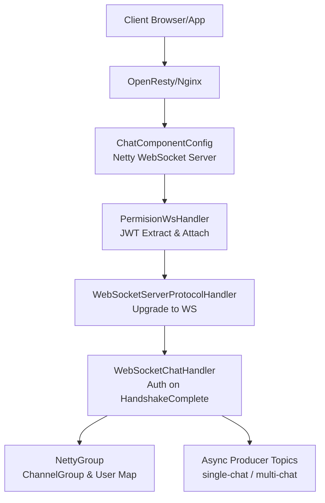
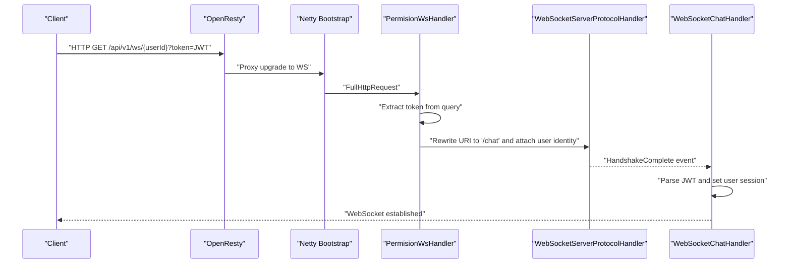
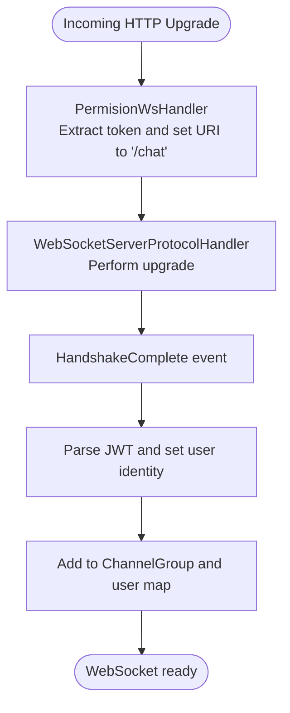
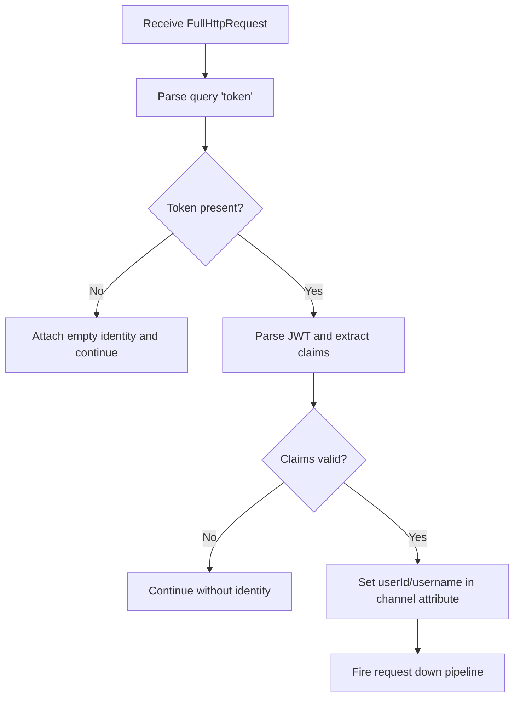
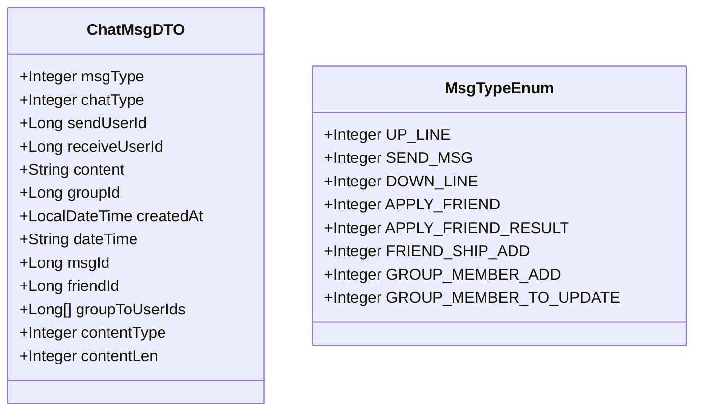
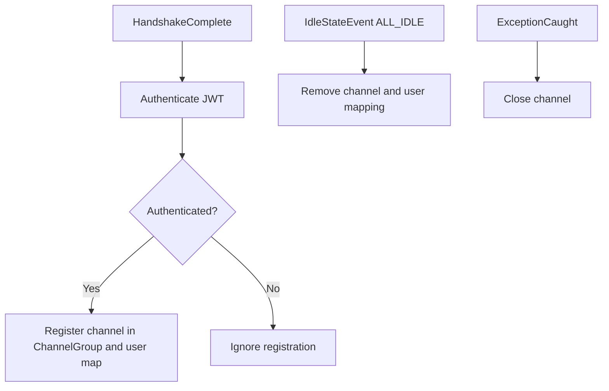
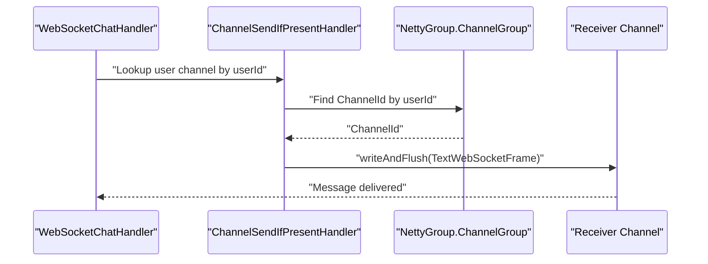
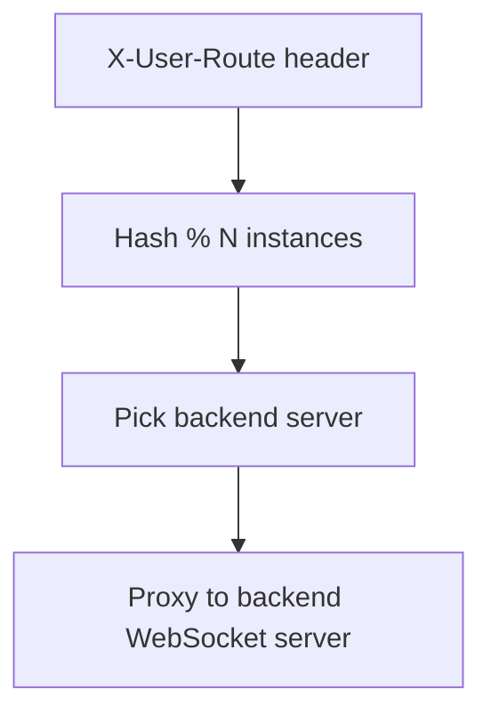
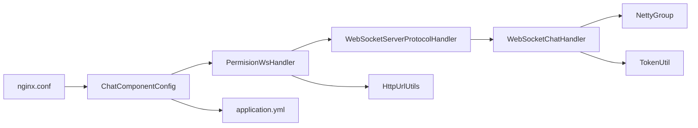

# WebSocket API

<cite>
**Referenced Files in This Document**
- [ChatComponentConfig.java](file://src/main/java/com/hch/chat_simple/config/ChatComponentConfig.java)
- [PermisionWsHandler.java](file://src/main/java/com/hch/chat_simple/handler/PermisionWsHandler.java)
- [WebSocketChatHandler.java](file://src/main/java/com/hch/chat_simple/handler/WebSocketChatHandler.java)
- [ChannelSendIfPresentHandler.java](file://src/main/java/com/hch/chat_simple/handler/ChannelSendIfPresentHandler.java)
- [NettyGroup.java](file://src/main/java/com/hch/chat_simple/config/NettyGroup.java)
- [TokenUtil.java](file://src/main/java/com/hch/chat_simple/util/TokenUtil.java)
- [HttpUrlUtils.java](file://src/main/java/com/hch/chat_simple/util/HttpUrlUtils.java)
- [application.yml](file://src/main/resources/application.yml)
- [nginx.conf](file://openresty_nginx_conf/nginx.conf)
- [MsgTypeEnum.java](file://src/main/java/com/hch/chat_simple/enums/MsgTypeEnum.java)
- [Constant.java](file://src/main/java/com/hch/chat_simple/util/Constant.java)
- [ChatMsgDTO.java](file://src/main/java/com/hch/chat_simple/pojo/dto/ChatMsgDTO.java)
- [WebSocketPerssionVerify.java](file://src/main/java/com/hch/chat_simple/pojo/dto/WebSocketPerssionVerify.java)
- [UserOpController.java](file://src/main/java/com/hch/chat_simple/controller/UserOpController.java)
</cite>

## Table of Contents
1. [Introduction](#introduction)
2. [Project Structure](#project-structure)
3. [Core Components](#core-components)
4. [Architecture Overview](#architecture-overview)
5. [Detailed Component Analysis](#detailed-component-analysis)
6. [Dependency Analysis](#dependency-analysis)
7. [Performance Considerations](#performance-considerations)
8. [Troubleshooting Guide](#troubleshooting-guide)
9. [Conclusion](#conclusion)
10. [Appendices](#appendices)

## Introduction
This document specifies the WebSocket API for real-time communication in the chat application. It covers connection establishment, handshake and authentication via JWT, message frame formats, event types, routing and broadcasting, and operational guidance for clients. It also documents the server-side handlers, configuration, and integration with OpenResty for load-balanced routing.

## Project Structure
The WebSocket stack is implemented with Netty and exposed behind OpenResty. The server binds a dedicated port for WebSocket traffic and delegates HTTP upgrade to the WebSocket protocol handler. OpenResty routes WebSocket connections to specific application instances based on a routing header and forwards the upgrade request to the configured backend.

**Diagram sources**
- [ChatComponentConfig.java:74-89](file://src/main/java/com/hch/chat_simple/config/ChatComponentConfig.java#L74-L89)
- [PermisionWsHandler.java:32-66](file://src/main/java/com/hch/chat_simple/handler/PermisionWsHandler.java#L32-L66)
- [WebSocketChatHandler.java:119-163](file://src/main/java/com/hch/chat_simple/handler/WebSocketChatHandler.java#L119-L163)
- [NettyGroup.java:11-26](file://src/main/java/com/hch/chat_simple/config/NettyGroup.java#L11-L26)
- [application.yml:49-51](file://src/main/resources/application.yml#L49-L51)

**Section sources**
- [ChatComponentConfig.java:33-89](file://src/main/java/com/hch/chat_simple/config/ChatComponentConfig.java#L33-L89)
- [nginx.conf:53-81](file://openresty_nginx_conf/nginx.conf#L53-L81)

## Core Components
- WebSocket server bootstrap and pipeline configuration
- Permission and JWT extraction handler
- Business WebSocket handler for authentication and message routing
- Channel management and broadcast utilities
- Message DTO and type definitions
- Token utilities for JWT parsing and verification

**Section sources**
- [ChatComponentConfig.java:33-89](file://src/main/java/com/hch/chat_simple/config/ChatComponentConfig.java#L33-L89)
- [PermisionWsHandler.java:26-81](file://src/main/java/com/hch/chat_simple/handler/PermisionWsHandler.java#L26-L81)
- [WebSocketChatHandler.java:50-196](file://src/main/java/com/hch/chat_simple/handler/WebSocketChatHandler.java#L50-L196)
- [ChannelSendIfPresentHandler.java:14-34](file://src/main/java/com/hch/chat_simple/handler/ChannelSendIfPresentHandler.java#L14-L34)
- [ChatMsgDTO.java:11-62](file://src/main/java/com/hch/chat_simple/pojo/dto/ChatMsgDTO.java#L11-L62)
- [MsgTypeEnum.java:6-25](file://src/main/java/com/hch/chat_simple/enums/MsgTypeEnum.java#L6-L25)
- [TokenUtil.java:18-71](file://src/main/java/com/hch/chat_simple/util/TokenUtil.java#L18-L71)

## Architecture Overview
The WebSocket API uses a layered Netty pipeline:
- HTTP codec and aggregator
- Permission handler extracts JWT from query and attaches user identity to the channel
- WebSocket protocol handler performs the upgrade
- Business handler authenticates on handshake completion, manages user sessions, and processes messages

**Diagram sources**
- [PermisionWsHandler.java:32-66](file://src/main/java/com/hch/chat_simple/handler/PermisionWsHandler.java#L32-L66)
- [ChatComponentConfig.java:74-89](file://src/main/java/com/hch/chat_simple/config/ChatComponentConfig.java#L74-L89)
- [WebSocketChatHandler.java:119-163](file://src/main/java/com/hch/chat_simple/handler/WebSocketChatHandler.java#L119-L163)
- [nginx.conf:53-81](file://openresty_nginx_conf/nginx.conf#L53-L81)

## Detailed Component Analysis

### Connection Establishment and Handshake
- OpenResty rewrites the incoming path and forwards the upgrade request to the Netty WebSocket server bound on a configurable port.
- The permission handler extracts the JWT from the query string and attaches user identity to the channel attributes.
- The WebSocket protocol handler upgrades the connection and triggers a handshake-complete event.
- The business handler validates the JWT on the handshake-complete event, stores the user’s channel mapping, and adds the channel to the global group.

**Diagram sources**
- [PermisionWsHandler.java:32-66](file://src/main/java/com/hch/chat_simple/handler/PermisionWsHandler.java#L32-L66)
- [ChatComponentConfig.java:74-89](file://src/main/java/com/hch/chat_simple/config/ChatComponentConfig.java#L74-L89)
- [WebSocketChatHandler.java:119-163](file://src/main/java/com/hch/chat_simple/handler/WebSocketChatHandler.java#L119-L163)

**Section sources**
- [ChatComponentConfig.java:33-89](file://src/main/java/com/hch/chat_simple/config/ChatComponentConfig.java#L33-L89)
- [PermisionWsHandler.java:29-66](file://src/main/java/com/hch/chat_simple/handler/PermisionWsHandler.java#L29-L66)
- [WebSocketChatHandler.java:119-163](file://src/main/java/com/hch/chat_simple/handler/WebSocketChatHandler.java#L119-L163)
- [nginx.conf:53-81](file://openresty_nginx_conf/nginx.conf#L53-L81)

### Authentication and Permission Verification
- JWT is extracted from the query parameter named token.
- The token is parsed to obtain user identity; if invalid, the connection is not authenticated.
- On successful authentication, the user ID and username are stored in channel attributes for later use in routing and logging.

**Diagram sources**
- [PermisionWsHandler.java:32-66](file://src/main/java/com/hch/chat_simple/handler/PermisionWsHandler.java#L32-L66)
- [TokenUtil.java:61-69](file://src/main/java/com/hch/chat_simple/util/TokenUtil.java#L61-L69)

**Section sources**
- [PermisionWsHandler.java:42-59](file://src/main/java/com/hch/chat_simple/handler/PermisionWsHandler.java#L42-L59)
- [TokenUtil.java:48-69](file://src/main/java/com/hch/chat_simple/util/TokenUtil.java#L48-L69)

### Message Handling Protocols
- Messages are sent as text frames containing JSON payloads.
- The payload includes fields such as message type, chat type, sender and receiver identifiers, content, timestamps, and optional group metadata.
- Message types include online/offline events and chat messages.

**Diagram sources**
- [ChatMsgDTO.java:11-62](file://src/main/java/com/hch/chat_simple/pojo/dto/ChatMsgDTO.java#L11-L62)
- [MsgTypeEnum.java:6-25](file://src/main/java/com/hch/chat_simple/enums/MsgTypeEnum.java#L6-L25)

**Section sources**
- [WebSocketChatHandler.java:73-109](file://src/main/java/com/hch/chat_simple/handler/WebSocketChatHandler.java#L73-L109)
- [ChatMsgDTO.java:11-62](file://src/main/java/com/hch/chat_simple/pojo/dto/ChatMsgDTO.java#L11-L62)
- [MsgTypeEnum.java:6-25](file://src/main/java/com/hch/chat_simple/enums/MsgTypeEnum.java#L6-L25)

### Connection Events and Lifecycle
- On handshake completion, the server authenticates the user and registers the channel.
- Idle detection triggers channel removal after inactivity.
- Exceptions are handled by closing the channel.

**Diagram sources**
- [WebSocketChatHandler.java:119-163](file://src/main/java/com/hch/chat_simple/handler/WebSocketChatHandler.java#L119-L163)
- [WebSocketChatHandler.java:113-116](file://src/main/java/com/hch/chat_simple/handler/WebSocketChatHandler.java#L113-L116)

**Section sources**
- [WebSocketChatHandler.java:119-163](file://src/main/java/com/hch/chat_simple/handler/WebSocketChatHandler.java#L119-L163)
- [WebSocketChatHandler.java:113-116](file://src/main/java/com/hch/chat_simple/handler/WebSocketChatHandler.java#L113-L116)

### Message Routing and Broadcasting
- Direct message delivery uses the user-to-channel mapping to target a specific client.
- Broadcast to groups is supported conceptually; the handler prepares topics for asynchronous producers, enabling cross-instance broadcasting.

**Diagram sources**
- [ChannelSendIfPresentHandler.java:21-32](file://src/main/java/com/hch/chat_simple/handler/ChannelSendIfPresentHandler.java#L21-L32)
- [NettyGroup.java:17-26](file://src/main/java/com/hch/chat_simple/config/NettyGroup.java#L17-L26)

**Section sources**
- [ChannelSendIfPresentHandler.java:14-34](file://src/main/java/com/hch/chat_simple/handler/ChannelSendIfPresentHandler.java#L14-L34)
- [NettyGroup.java:11-26](file://src/main/java/com/hch/chat_simple/config/NettyGroup.java#L11-L26)

### Connection Pooling and Load Balancing
- OpenResty routes WebSocket connections to backend instances based on a routing header. This enables horizontal scaling and connection pooling across multiple server instances.

**Diagram sources**
- [nginx.conf:58-68](file://openresty_nginx_conf/nginx.conf#L58-L68)

**Section sources**
- [nginx.conf:53-81](file://openresty_nginx_conf/nginx.conf#L53-L81)

### Practical Examples

- Establishing a WebSocket connection
  - Use the OpenResty endpoint with a JWT token query parameter.
  - Example URL pattern: [nginx.conf:53-55](file://openresty_nginx_conf/nginx.conf#L53-L55)
  - The server expects the token in the query string and will upgrade the connection after authentication.

- Sending and receiving real-time messages
  - Send a text frame with a JSON payload conforming to the message DTO structure.
  - Reference payload fields: [ChatMsgDTO.java:18-62](file://src/main/java/com/hch/chat_simple/pojo/dto/ChatMsgDTO.java#L18-L62)

- Handling connection events
  - On successful handshake, the server registers the channel and logs the user’s join.
  - Reference: [WebSocketChatHandler.java:140-149](file://src/main/java/com/hch/chat_simple/handler/WebSocketChatHandler.java#L140-L149)

- Broadcasting and direct delivery
  - Direct delivery uses the user-to-channel map and ChannelGroup.
  - Reference: [ChannelSendIfPresentHandler.java:21-32](file://src/main/java/com/hch/chat_simple/handler/ChannelSendIfPresentHandler.java#L21-L32)

- Reconnection strategies
  - Clients should reconnect on close and re-provide the token.
  - The server removes channels on idle; clients should send periodic pings or messages to stay alive.
  - Reference idle handling: [WebSocketChatHandler.java:155-161](file://src/main/java/com/hch/chat_simple/handler/WebSocketChatHandler.java#L155-L161)

**Section sources**
- [nginx.conf:53-55](file://openresty_nginx_conf/nginx.conf#L53-L55)
- [ChatMsgDTO.java:18-62](file://src/main/java/com/hch/chat_simple/pojo/dto/ChatMsgDTO.java#L18-L62)
- [WebSocketChatHandler.java:140-149](file://src/main/java/com/hch/chat_simple/handler/WebSocketChatHandler.java#L140-L149)
- [ChannelSendIfPresentHandler.java:21-32](file://src/main/java/com/hch/chat_simple/handler/ChannelSendIfPresentHandler.java#L21-L32)
- [WebSocketChatHandler.java:155-161](file://src/main/java/com/hch/chat_simple/handler/WebSocketChatHandler.java#L155-L161)

## Dependency Analysis
The WebSocket API depends on:
- Netty for transport and protocol handling
- OpenResty for reverse proxy and load balancing
- Application configuration for ports and topics
- Utility classes for JWT parsing and HTTP URL parameter extraction

**Diagram sources**
- [ChatComponentConfig.java:74-89](file://src/main/java/com/hch/chat_simple/config/ChatComponentConfig.java#L74-L89)
- [PermisionWsHandler.java:32-66](file://src/main/java/com/hch/chat_simple/handler/PermisionWsHandler.java#L32-L66)
- [WebSocketChatHandler.java:119-163](file://src/main/java/com/hch/chat_simple/handler/WebSocketChatHandler.java#L119-L163)
- [NettyGroup.java:11-26](file://src/main/java/com/hch/chat_simple/config/NettyGroup.java#L11-L26)
- [TokenUtil.java:18-71](file://src/main/java/com/hch/chat_simple/util/TokenUtil.java#L18-L71)
- [HttpUrlUtils.java:8-15](file://src/main/java/com/hch/chat_simple/util/HttpUrlUtils.java#L8-L15)
- [application.yml:49-51](file://src/main/resources/application.yml#L49-L51)
- [nginx.conf:53-81](file://openresty_nginx_conf/nginx.conf#L53-L81)

**Section sources**
- [ChatComponentConfig.java:33-89](file://src/main/java/com/hch/chat_simple/config/ChatComponentConfig.java#L33-L89)
- [PermisionWsHandler.java:29-66](file://src/main/java/com/hch/chat_simple/handler/PermisionWsHandler.java#L29-L66)
- [WebSocketChatHandler.java:119-163](file://src/main/java/com/hch/chat_simple/handler/WebSocketChatHandler.java#L119-L163)
- [NettyGroup.java:11-26](file://src/main/java/com/hch/chat_simple/config/NettyGroup.java#L11-L26)
- [TokenUtil.java:18-71](file://src/main/java/com/hch/chat_simple/util/TokenUtil.java#L18-L71)
- [HttpUrlUtils.java:8-15](file://src/main/java/com/hch/chat_simple/util/HttpUrlUtils.java#L8-L15)
- [application.yml:49-51](file://src/main/resources/application.yml#L49-L51)
- [nginx.conf:53-81](file://openresty_nginx_conf/nginx.conf#L53-L81)

## Performance Considerations
- Keep-alive and idle timeouts are configured in the Netty pipeline and OpenResty proxy settings.
- Use the ChannelGroup for efficient broadcast operations.
- Offload heavy processing to asynchronous producers for group and single-chat topics.

[No sources needed since this section provides general guidance]

## Troubleshooting Guide
- Connection fails during upgrade
  - Verify the OpenResty rewrite and proxy headers are correctly set.
  - Confirm the token query parameter is present and valid.
  - References: [nginx.conf:53-81](file://openresty_nginx_conf/nginx.conf#L53-L81), [PermisionWsHandler.java:42-66](file://src/main/java/com/hch/chat_simple/handler/PermisionWsHandler.java#L42-L66)

- Authentication errors
  - Ensure the JWT is correctly formed and not expired.
  - References: [TokenUtil.java:48-69](file://src/main/java/com/hch/chat_simple/util/TokenUtil.java#L48-L69)

- Messages not delivered
  - Check the user-to-channel mapping and ChannelGroup membership.
  - References: [ChannelSendIfPresentHandler.java:21-32](file://src/main/java/com/hch/chat_simple/handler/ChannelSendIfPresentHandler.java#L21-L32), [NettyGroup.java:17-26](file://src/main/java/com/hch/chat_simple/config/NettyGroup.java#L17-L26)

- Idle disconnects
  - Send periodic activity to prevent idle closure.
  - References: [WebSocketChatHandler.java:155-161](file://src/main/java/com/hch/chat_simple/handler/WebSocketChatHandler.java#L155-L161)

**Section sources**
- [nginx.conf:53-81](file://openresty_nginx_conf/nginx.conf#L53-L81)
- [PermisionWsHandler.java:42-66](file://src/main/java/com/hch/chat_simple/handler/PermisionWsHandler.java#L42-L66)
- [TokenUtil.java:48-69](file://src/main/java/com/hch/chat_simple/util/TokenUtil.java#L48-L69)
- [ChannelSendIfPresentHandler.java:21-32](file://src/main/java/com/hch/chat_simple/handler/ChannelSendIfPresentHandler.java#L21-L32)
- [NettyGroup.java:17-26](file://src/main/java/com/hch/chat_simple/config/NettyGroup.java#L17-L26)
- [WebSocketChatHandler.java:155-161](file://src/main/java/com/hch/chat_simple/handler/WebSocketChatHandler.java#L155-L161)

## Conclusion
The WebSocket API leverages Netty for robust real-time communication, OpenResty for scalable routing, and JWT for lightweight authentication. The design supports direct messaging and future broadcast capabilities via asynchronous producers. Clients should manage reconnection and keep-alive to ensure reliable delivery.

[No sources needed since this section summarizes without analyzing specific files]

## Appendices

### Connection URL Patterns and Parameters
- Base path: /api/v1/ws/
- Path rewrite: removes extra path segments and forwards to the WebSocket server path.
- Query parameter: token (JWT)
- References: [nginx.conf:53-55](file://openresty_nginx_conf/nginx.conf#L53-L55), [PermisionWsHandler.java:42-43](file://src/main/java/com/hch/chat_simple/handler/PermisionWsHandler.java#L42-L43)

### Message Frame Formats
- Text frame with JSON payload
- Fields: msgType, chatType, sendUserId, receiveUserId, content, groupId, createdAt, dateTime, msgId, friendId, groupToUserIds, contentType, contentLen
- References: [ChatMsgDTO.java:18-62](file://src/main/java/com/hch/chat_simple/pojo/dto/ChatMsgDTO.java#L18-L62)

### Event Types
- Online/Offline and chat message events are represented by message types.
- References: [MsgTypeEnum.java:6-25](file://src/main/java/com/hch/chat_simple/enums/MsgTypeEnum.java#L6-L25)

### Authentication and Authorization
- JWT token parsing and verification
- User identity attached to channel attributes post-handshake
- References: [TokenUtil.java:61-69](file://src/main/java/com/hch/chat_simple/util/TokenUtil.java#L61-L69), [WebSocketChatHandler.java:120-136](file://src/main/java/com/hch/chat_simple/handler/WebSocketChatHandler.java#L120-L136)

### Monitoring and Debugging
- Enable logging around permission extraction, handshake completion, and channel lifecycle events.
- Monitor OpenResty proxy headers and routing decisions.
- References: [PermisionWsHandler.java:36-40](file://src/main/java/com/hch/chat_simple/handler/PermisionWsHandler.java#L36-L40), [WebSocketChatHandler.java:140-149](file://src/main/java/com/hch/chat_simple/handler/WebSocketChatHandler.java#L140-L149), [nginx.conf:71-77](file://openresty_nginx_conf/nginx.conf#L71-L77)