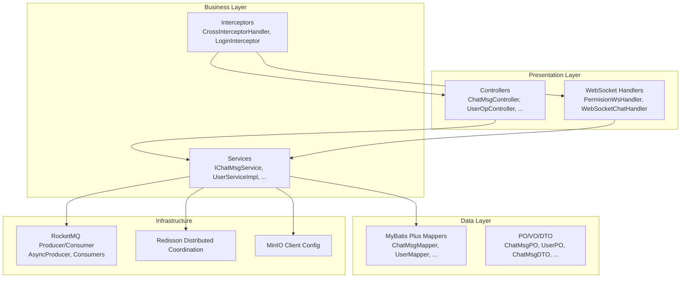
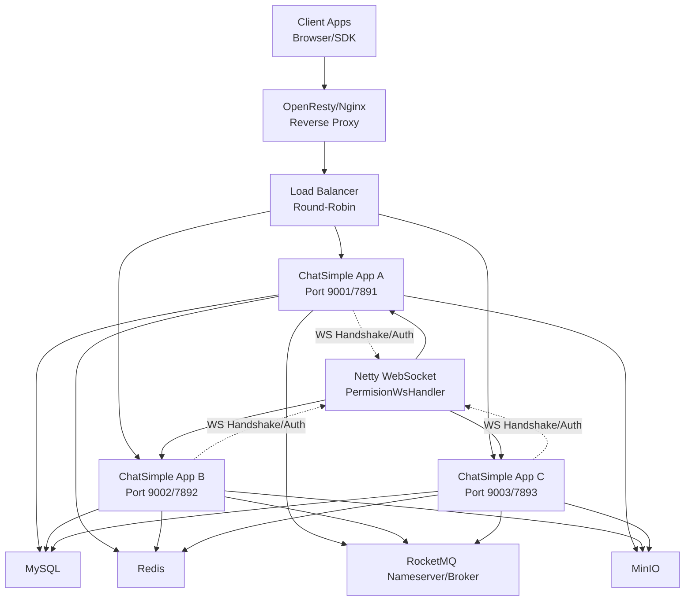
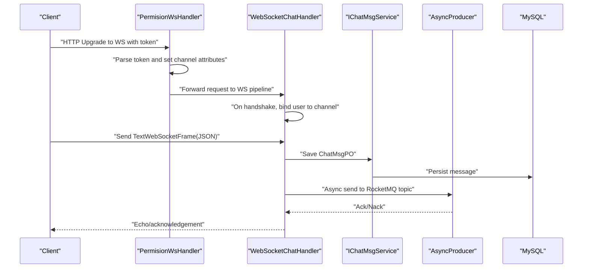
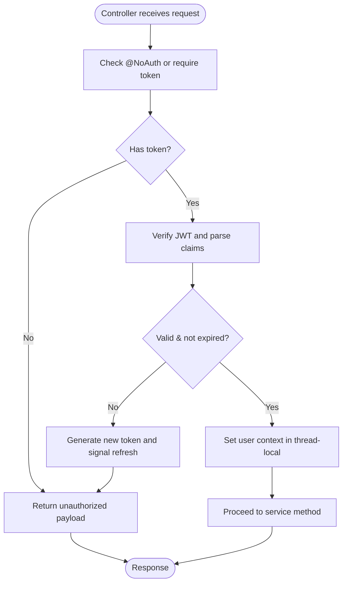
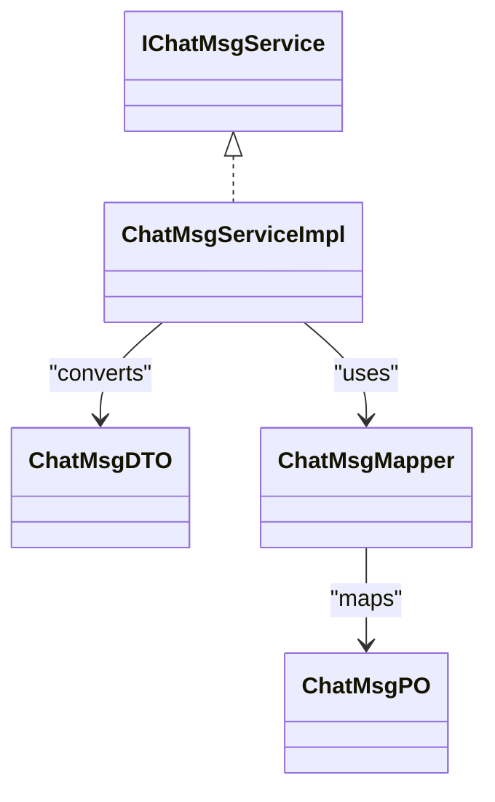
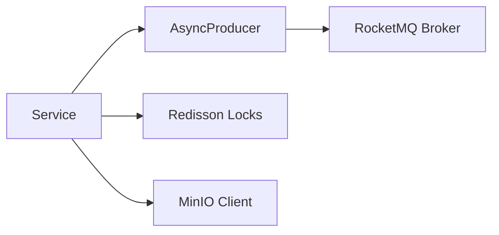
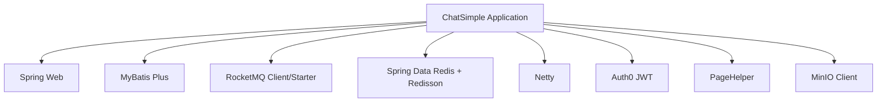
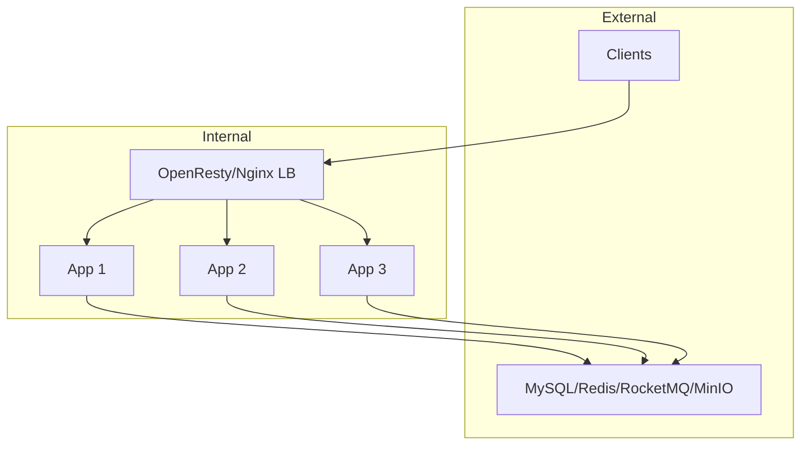

# Architecture and Design

<cite>
**Referenced Files in This Document**
- [ChatSimpleApplication.java](file://src/main/java/com/hch/chat_simple/ChatSimpleApplication.java)
- [application.yml](file://src/main/resources/application.yml)
- [pom.xml](file://pom.xml)
- [docker-compose.yml](file://docker-compose.yml)
- [Dockerfile](file://Dockerfile)
- [WebMvcConfig.java](file://src/main/java/com/hch/chat_simple/config/WebMvcConfig.java)
- [CrossInterceptorHandler.java](file://src/main/java/com/hch/chat_simple/config/CrossInterceptorHandler.java)
- [LoginInterceptor.java](file://src/main/java/com/hch/chat_simple/config/LoginInterceptor.java)
- [NettyGroup.java](file://src/main/java/com/hch/chat_simple/config/NettyGroup.java)
- [MinioConfig.java](file://src/main/java/com/hch/chat_simple/config/MinioConfig.java)
- [WebSocketChatHandler.java](file://src/main/java/com/hch/chat_simple/handler/WebSocketChatHandler.java)
- [PermisionWsHandler.java](file://src/main/java/com/hch/chat_simple/handler/PermisionWsHandler.java)
- [AsyncProducer.java](file://src/main/java/com/hch/chat_simple/mq/AsyncProducer.java)
- [MqProducerConfig.java](file://src/main/java/com/hch/chat_simple/mq/MqProducerConfig.java)
- [RedissonUtil.java](file://src/main/java/com/hch/chat_simple/util/RedissonUtil.java)
</cite>

## Table of Contents
1. [Introduction](#introduction)
2. [Project Structure](#project-structure)
3. [Core Components](#core-components)
4. [Architecture Overview](#architecture-overview)
5. [Detailed Component Analysis](#detailed-component-analysis)
6. [Dependency Analysis](#dependency-analysis)
7. [Performance Considerations](#performance-considerations)
8. [Troubleshooting Guide](#troubleshooting-guide)
9. [Conclusion](#conclusion)
10. [Appendices](#appendices)

## Introduction
This document describes the architectural design of the Chat Simple system. It outlines a layered architecture with presentation, business, and data layers, and documents the distributed design with WebSocket-based real-time communication, asynchronous message processing via RocketMQ, and cloud storage integration via MinIO. It also explains the interactions among controllers, services, mappers, WebSocket handlers, and message queue consumers, and highlights key technical decisions such as Netty for high-performance networking, MyBatis Plus for enhanced ORM, Redisson for distributed coordination, and JWT for authentication. Finally, it covers system boundaries, scalability considerations, deployment topology, and cross-cutting concerns like security, logging, and monitoring.

## Project Structure
The project follows a conventional Spring Boot layout with clear separation of concerns:
- Presentation layer: Spring MVC controllers and WebSocket handlers
- Business layer: Services and interceptors
- Data layer: MyBatis Plus mappers and POJOs
- Infrastructure: RocketMQ producers/consumers, Redisson, MinIO client configuration
- Configuration: YAML-based application settings and Maven dependencies

**Diagram sources**
- [WebMvcConfig.java:1-28](file://src/main/java/com/hch/chat_simple/config/WebMvcConfig.java#L1-L28)
- [LoginInterceptor.java:1-109](file://src/main/java/com/hch/chat_simple/config/LoginInterceptor.java#L1-L109)
- [WebSocketChatHandler.java:1-196](file://src/main/java/com/hch/chat_simple/handler/WebSocketChatHandler.java#L1-L196)
- [PermisionWsHandler.java:1-81](file://src/main/java/com/hch/chat_simple/handler/PermisionWsHandler.java#L1-L81)
- [AsyncProducer.java:1-63](file://src/main/java/com/hch/chat_simple/mq/AsyncProducer.java#L1-L63)
- [MqProducerConfig.java:1-31](file://src/main/java/com/hch/chat_simple/mq/MqProducerConfig.java#L1-L31)
- [RedissonUtil.java:1-53](file://src/main/java/com/hch/chat_simple/util/RedissonUtil.java#L1-L53)
- [MinioConfig.java:1-33](file://src/main/java/com/hch/chat_simple/config/MinioConfig.java#L1-L33)

**Section sources**
- [ChatSimpleApplication.java:1-25](file://src/main/java/com/hch/chat_simple/ChatSimpleApplication.java#L1-L25)
- [application.yml:1-89](file://src/main/resources/application.yml#L1-L89)
- [pom.xml:1-346](file://pom.xml#L1-L346)

## Core Components
- Presentation layer
  - Controllers: HTTP endpoints for chat operations, file upload, friend requests, groups, and user operations.
  - WebSocket handlers: Permission verification and chat message handling for real-time communication.
- Business layer
  - Services: Implement business logic for chat messages, user operations, friend relationships, groups, and message sending.
  - Interceptors: Cross-origin handling and JWT-based authentication.
- Data layer
  - MyBatis Plus mappers and XML mappings for persistence operations.
  - PO/VO/DTO models for domain objects and transfer data.
- Infrastructure
  - RocketMQ: Asynchronous messaging for single, multi, and composition topics.
  - Redisson: Distributed locking and coordination primitives.
  - MinIO: Cloud storage client configuration for file uploads.

**Section sources**
- [WebMvcConfig.java:1-28](file://src/main/java/com/hch/chat_simple/config/WebMvcConfig.java#L1-L28)
- [LoginInterceptor.java:1-109](file://src/main/java/com/hch/chat_simple/config/LoginInterceptor.java#L1-L109)
- [WebSocketChatHandler.java:1-196](file://src/main/java/com/hch/chat_simple/handler/WebSocketChatHandler.java#L1-L196)
- [PermisionWsHandler.java:1-81](file://src/main/java/com/hch/chat_simple/handler/PermisionWsHandler.java#L1-L81)
- [AsyncProducer.java:1-63](file://src/main/java/com/hch/chat_simple/mq/AsyncProducer.java#L1-L63)
- [MqProducerConfig.java:1-31](file://src/main/java/com/hch/chat_simple/mq/MqProducerConfig.java#L1-L31)
- [RedissonUtil.java:1-53](file://src/main/java/com/hch/chat_simple/util/RedissonUtil.java#L1-L53)
- [MinioConfig.java:1-33](file://src/main/java/com/hch/chat_simple/config/MinioConfig.java#L1-L33)

## Architecture Overview
The system employs a layered architecture with clear separation between presentation, business, and data layers. Real-time communication is handled by Netty-managed WebSocket channels, while asynchronous operations leverage RocketMQ. Persistence is managed via MyBatis Plus, and distributed coordination is provided by Redisson. Cloud storage is integrated through MinIO.

**Diagram sources**
- [docker-compose.yml:1-132](file://docker-compose.yml#L1-L132)
- [application.yml:74-89](file://src/main/resources/application.yml#L74-L89)
- [application.yml:39-52](file://src/main/resources/application.yml#L39-L52)
- [application.yml:16-20](file://src/main/resources/application.yml#L16-L20)
- [application.yml:4-6](file://src/main/resources/application.yml#L4-L6)
- [application.yml:84-89](file://src/main/resources/application.yml#L84-L89)

## Detailed Component Analysis

### Presentation Layer
- Controllers
  - Expose HTTP endpoints for chat, user operations, friend relationships, groups, and file uploads.
  - Integrated with Swagger (Knife4j) for API documentation.
- WebSocket Handlers
  - Permission handler validates tokens and prepares channel attributes.
  - Chat handler manages message lifecycle, persistence, and async dispatch.

**Diagram sources**
- [PermisionWsHandler.java:26-81](file://src/main/java/com/hch/chat_simple/handler/PermisionWsHandler.java#L1-L81)
- [WebSocketChatHandler.java:50-196](file://src/main/java/com/hch/chat_simple/handler/WebSocketChatHandler.java#L1-L196)
- [IChatMsgService.java](file://src/main/java/com/hch/chat_simple/service/IChatMsgService.java)
- [AsyncProducer.java:1-63](file://src/main/java/com/hch/chat_simple/mq/AsyncProducer.java#L1-L63)

**Section sources**
- [WebMvcConfig.java:1-28](file://src/main/java/com/hch/chat_simple/config/WebMvcConfig.java#L1-L28)
- [CrossInterceptorHandler.java:1-28](file://src/main/java/com/hch/chat_simple/config/CrossInterceptorHandler.java#L1-L28)
- [LoginInterceptor.java:1-109](file://src/main/java/com/hch/chat_simple/config/LoginInterceptor.java#L1-L109)
- [PermisionWsHandler.java:1-81](file://src/main/java/com/hch/chat_simple/handler/PermisionWsHandler.java#L1-L81)
- [WebSocketChatHandler.java:1-196](file://src/main/java/com/hch/chat_simple/handler/WebSocketChatHandler.java#L1-L196)

### Business Layer
- Services
  - Implement business operations for chat messages, user management, friend relationships, and group operations.
  - Coordinate persistence, async messaging, and external integrations.
- Interceptors
  - Cross-origin interceptor sets CORS headers.
  - Login interceptor verifies JWT, populates context, and handles token expiration.

**Diagram sources**
- [LoginInterceptor.java:28-109](file://src/main/java/com/hch/chat_simple/config/LoginInterceptor.java#L1-L109)

**Section sources**
- [LoginInterceptor.java:1-109](file://src/main/java/com/hch/chat_simple/config/LoginInterceptor.java#L1-L109)
- [CrossInterceptorHandler.java:1-28](file://src/main/java/com/hch/chat_simple/config/CrossInterceptorHandler.java#L1-L28)

### Data Layer
- MyBatis Plus
  - Mapper interfaces and XML mappings define persistence operations.
  - Global configuration supports logic delete and custom dialect.
- PO/VO/DTO
  - Strongly typed models for persistence, queries, and transport.

**Diagram sources**
- [ChatMsgPO.java](file://src/main/java/com/hch/chat_simple/pojo/po/ChatMsgPO.java)
- [ChatMsgDTO.java](file://src/main/java/com/hch/chat_simple/pojo/dto/ChatMsgDTO.java)
- [ChatMsgMapper.java](file://src/main/java/com/hch/chat_simple/mapper/ChatMsgMapper.java)
- [IChatMsgService.java](file://src/main/java/com/hch/chat_simple/service/IChatMsgService.java)
- [ChatMsgServiceImpl.java](file://src/main/java/com/hch/chat_simple/service/impl/ChatMsgServiceImpl.java)

**Section sources**
- [application.yml:24-32](file://src/main/resources/application.yml#L24-L32)
- [application.yml:34-39](file://src/main/resources/application.yml#L34-L39)

### Infrastructure Components
- RocketMQ
  - Producer configured via Spring bean; asynchronous send with callbacks.
  - Topics for single-chat, multi-chat, and composition.
- Redisson
  - Distributed locks and watchdog-based auto-renewal for coordination.
- MinIO
  - Client bean configured from application properties for object storage.

**Diagram sources**
- [AsyncProducer.java:1-63](file://src/main/java/com/hch/chat_simple/mq/AsyncProducer.java#L1-L63)
- [MqProducerConfig.java:1-31](file://src/main/java/com/hch/chat_simple/mq/MqProducerConfig.java#L1-L31)
- [RedissonUtil.java:1-53](file://src/main/java/com/hch/chat_simple/util/RedissonUtil.java#L1-L53)
- [MinioConfig.java:1-33](file://src/main/java/com/hch/chat_simple/config/MinioConfig.java#L1-L33)

**Section sources**
- [AsyncProducer.java:1-63](file://src/main/java/com/hch/chat_simple/mq/AsyncProducer.java#L1-L63)
- [MqProducerConfig.java:1-31](file://src/main/java/com/hch/chat_simple/mq/MqProducerConfig.java#L1-L31)
- [RedissonUtil.java:1-53](file://src/main/java/com/hch/chat_simple/util/RedissonUtil.java#L1-L53)
- [MinioConfig.java:1-33](file://src/main/java/com/hch/chat_simple/config/MinioConfig.java#L1-L33)

## Dependency Analysis
The system integrates several third-party libraries and infrastructure components. The primary dependencies include Spring Web, MyBatis Plus, RocketMQ, Redisson, Netty, JWT, PageHelper, and MinIO.

**Diagram sources**
- [pom.xml:54-139](file://pom.xml#L54-L139)
- [pom.xml:142-153](file://pom.xml#L142-L153)
- [pom.xml:294-297](file://pom.xml#L294-L297)
- [pom.xml:213-216](file://pom.xml#L213-L216)
- [pom.xml:155-173](file://pom.xml#L155-L173)
- [pom.xml:312-315](file://pom.xml#L312-L315)

**Section sources**
- [pom.xml:1-346](file://pom.xml#L1-L346)

## Performance Considerations
- Netty for high-performance networking: Efficient WebSocket handling with fixed thread pools and shared channel groups for broadcasting.
- MyBatis Plus: Enhanced ORM with automatic SQL generation, logic delete support, and optimized mappers.
- Redisson: Lightweight distributed locks and watchdog-based renewal to avoid deadlocks.
- RocketMQ: Asynchronous messaging decouples I/O-bound operations, improving throughput and latency.
- MinIO: Scales horizontally with object storage and supports anonymous downloads for media assets.
- Horizontal scaling: Multiple instances behind OpenResty/Nginx with load balancing and shared MySQL/Redis/RocketMQ/MinIO.

[No sources needed since this section provides general guidance]

## Troubleshooting Guide
- Authentication failures
  - Verify token presence and validity in interceptors; ensure token expiration handling is triggered and refreshed tokens are returned.
- WebSocket handshake issues
  - Confirm permission handler extracts token from URI and sets channel attributes; check Netty channel group membership and idle state events.
- RocketMQ delivery problems
  - Inspect producer callbacks for exceptions and ensure topic/group configurations match consumer groups.
- Storage errors
  - Validate MinIO endpoint, credentials, and bucket permissions; confirm bucket creation and anonymous policies if needed.
- CORS errors
  - Ensure cross-origin interceptor sets appropriate headers for allowed origins, methods, and headers.

**Section sources**
- [LoginInterceptor.java:28-109](file://src/main/java/com/hch/chat_simple/config/LoginInterceptor.java#L1-L109)
- [PermisionWsHandler.java:26-81](file://src/main/java/com/hch/chat_simple/handler/PermisionWsHandler.java#L1-L81)
- [WebSocketChatHandler.java:50-196](file://src/main/java/com/hch/chat_simple/handler/WebSocketChatHandler.java#L1-L196)
- [AsyncProducer.java:1-63](file://src/main/java/com/hch/chat_simple/mq/AsyncProducer.java#L1-L63)
- [MinioConfig.java:1-33](file://src/main/java/com/hch/chat_simple/config/MinioConfig.java#L1-L33)
- [CrossInterceptorHandler.java:1-28](file://src/main/java/com/hch/chat_simple/config/CrossInterceptorHandler.java#L1-L28)

## Conclusion
Chat Simple adopts a layered architecture with robust distributed capabilities. Real-time communication leverages Netty and WebSocket, asynchronous operations utilize RocketMQ, persistence is powered by MyBatis Plus, and coordination is handled by Redisson. The system is containerized and orchestrated via Docker Compose, enabling horizontal scaling and high availability. Security is enforced through JWT and CORS policies, while logging and monitoring can be integrated through standard Spring Boot mechanisms.

[No sources needed since this section summarizes without analyzing specific files]

## Appendices

### System Boundaries and Deployment Topology
- Internal boundaries
  - Presentation: Controllers and WebSocket handlers
  - Business: Services implementing domain logic
  - Data: MyBatis Plus mappers and POJOs
  - Infrastructure: RocketMQ, Redisson, MinIO
- External boundaries
  - Clients: Browser/SDK connecting via HTTP and WebSocket
  - Infrastructure: MySQL, Redis, RocketMQ, MinIO
- Deployment topology
  - OpenResty/Nginx reverse proxy and load balancer
  - Multiple ChatSimple instances
  - Shared MySQL, Redis, RocketMQ, and MinIO

**Diagram sources**
- [docker-compose.yml:1-132](file://docker-compose.yml#L1-L132)
- [Dockerfile:1-12](file://Dockerfile#L1-L12)

**Section sources**
- [docker-compose.yml:1-132](file://docker-compose.yml#L1-L132)
- [Dockerfile:1-12](file://Dockerfile#L1-L12)

### Configuration Highlights
- Application settings
  - Datasource, Redis, MyBatis Plus, PageHelper, RocketMQ, Redisson, server ports, MinIO
- Maven dependencies
  - Spring Web, MyBatis Plus, RocketMQ, Redisson, Netty, JWT, PageHelper, MinIO

**Section sources**
- [application.yml:1-89](file://src/main/resources/application.yml#L1-L89)
- [pom.xml:1-346](file://pom.xml#L1-L346)