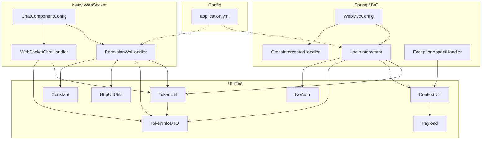
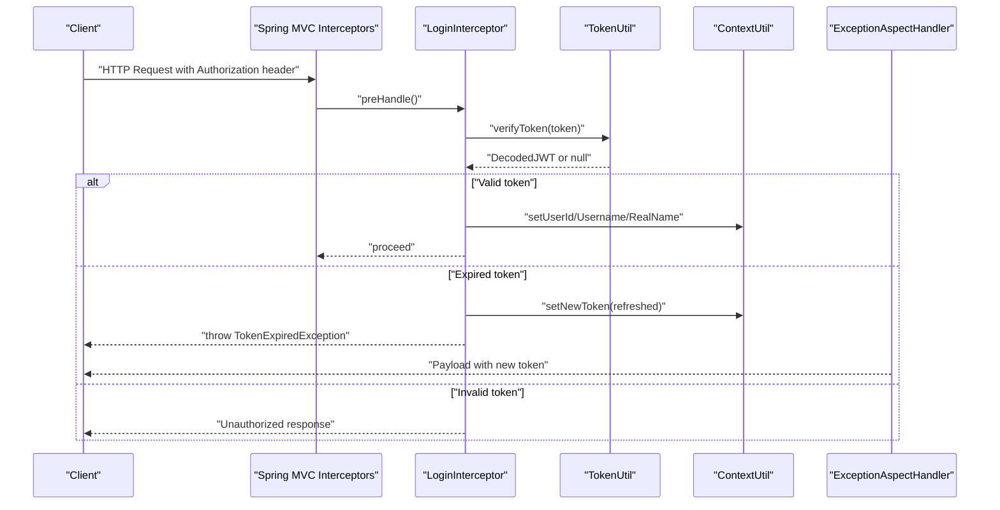
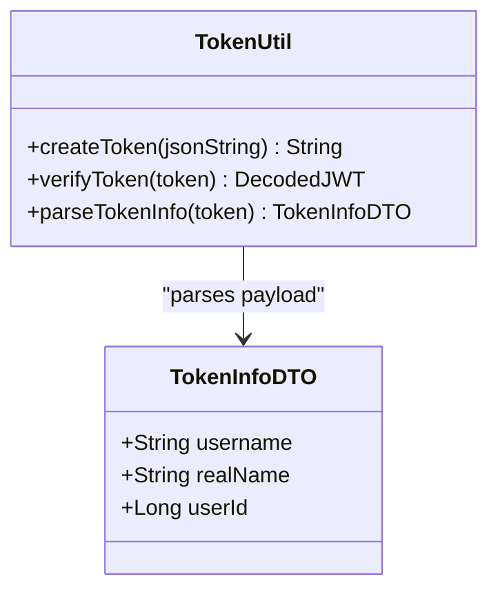
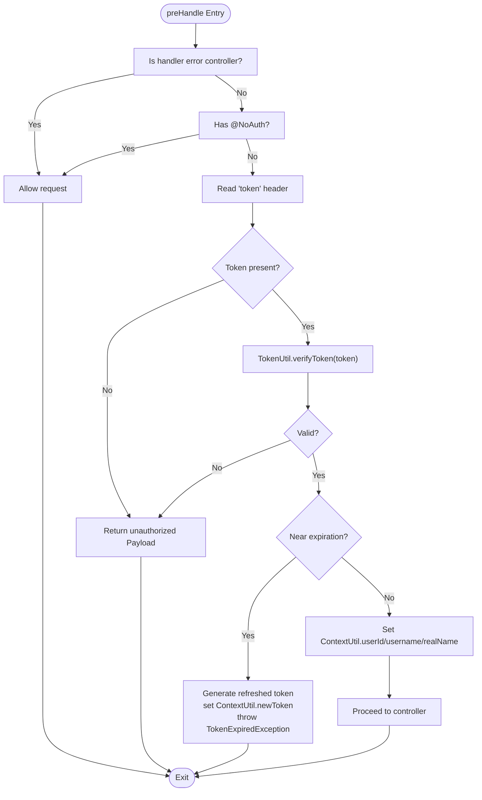
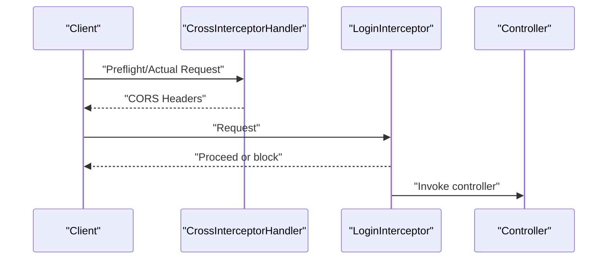
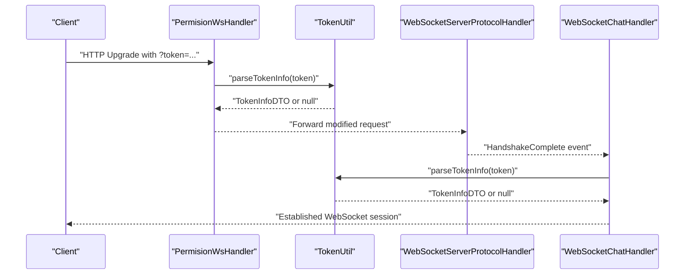
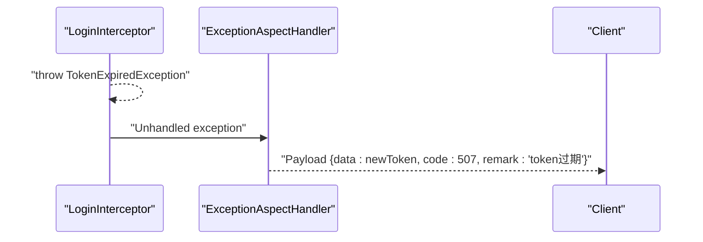
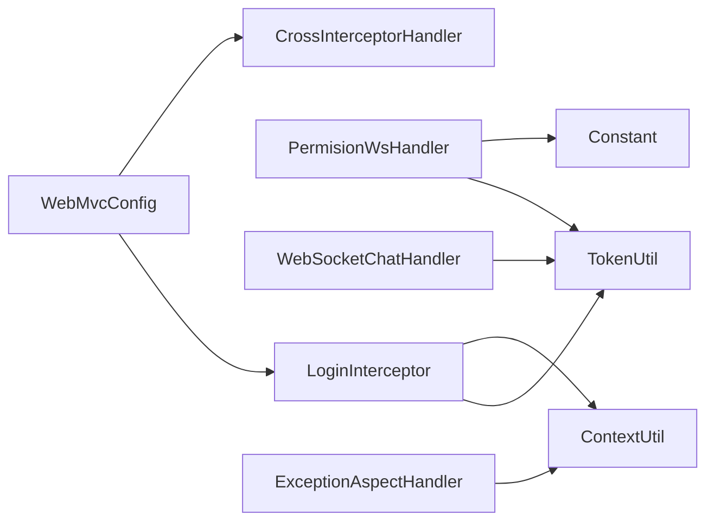

# Authentication and Security Layer

<cite>
**Referenced Files in This Document**
- [LoginInterceptor.java](file://src/main/java/com/hch/chat_simple/config/LoginInterceptor.java)
- [CrossInterceptorHandler.java](file://src/main/java/com/hch/chat_simple/config/CrossInterceptorHandler.java)
- [WebMvcConfig.java](file://src/main/java/com/hch/chat_simple/config/WebMvcConfig.java)
- [TokenUtil.java](file://src/main/java/com/hch/chat_simple/util/TokenUtil.java)
- [TokenInfoDTO.java](file://src/main/java/com/hch/chat_simple/pojo/dto/TokenInfoDTO.java)
- [ContextUtil.java](file://src/main/java/com/hch/chat_simple/util/ContextUtil.java)
- [ExceptionAspectHandler.java](file://src/main/java/com/hch/chat_simple/config/ExceptionAspectHandler.java)
- [PermisionWsHandler.java](file://src/main/java/com/hch/chat_simple/handler/PermisionWsHandler.java)
- [WebSocketChatHandler.java](file://src/main/java/com/hch/chat_simple/handler/WebSocketChatHandler.java)
- [ChatComponentConfig.java](file://src/main/java/com/hch/chat_simple/config/ChatComponentConfig.java)
- [HttpUrlUtils.java](file://src/main/java/com/hch/chat_simple/util/HttpUrlUtils.java)
- [Constant.java](file://src/main/java/com/hch/chat_simple/util/Constant.java)
- [NoAuth.java](file://src/main/java/com/hch/chat_simple/auth/NoAuth.java)
- [Payload.java](file://src/main/java/com/hch/chat_simple/util/Payload.java)
- [application.yml](file://src/main/resources/application.yml)
</cite>

## Table of Contents
1. [Introduction](#introduction)
2. [Project Structure](#project-structure)
3. [Core Components](#core-components)
4. [Architecture Overview](#architecture-overview)
5. [Detailed Component Analysis](#detailed-component-analysis)
6. [Dependency Analysis](#dependency-analysis)
7. [Performance Considerations](#performance-considerations)
8. [Security Best Practices](#security-best-practices)
9. [Troubleshooting Guide](#troubleshooting-guide)
10. [Conclusion](#conclusion)

## Introduction
This document explains the authentication and security architecture of the chat application. It covers the JWT-based authentication system (token generation, validation, and refresh), the LoginInterceptor for request filtering and permission verification, the TokenUtil utility functions, the TokenInfoDTO structure, CORS configuration via CrossInterceptorHandler, and the integration between authentication middleware and WebSocket permission handlers. It also addresses session management, role-based access control considerations, and security headers configuration.

## Project Structure
The security layer is organized around Spring MVC interceptors, Netty WebSocket handlers, and shared utilities for token management and context propagation. Key components include:
- WebMvcConfig registers interceptors for CORS and authentication.
- LoginInterceptor validates tokens and sets thread-local context.
- TokenUtil encapsulates JWT creation, verification, and parsing.
- CrossInterceptorHandler configures CORS headers.
- PermisionWsHandler and WebSocketChatHandler enforce permissions for WebSocket connections.
- ExceptionAspectHandler centralizes token expiration handling.
- ContextUtil stores per-request user identity across threads.
- TokenInfoDTO models the token payload.
- NoAuth annotation marks endpoints that bypass authentication.

**Diagram sources**
- [WebMvcConfig.java:11-16](file://src/main/java/com/hch/chat_simple/config/WebMvcConfig.java#L11-L16)
- [LoginInterceptor.java:30-90](file://src/main/java/com/hch/chat_simple/config/LoginInterceptor.java#L30-L90)
- [CrossInterceptorHandler.java:10-25](file://src/main/java/com/hch/chat_simple/config/CrossInterceptorHandler.java#L10-L25)
- [ExceptionAspectHandler.java:16-20](file://src/main/java/com/hch/chat_simple/config/ExceptionAspectHandler.java#L16-L20)
- [TokenUtil.java:23-69](file://src/main/java/com/hch/chat_simple/util/TokenUtil.java#L23-L69)
- [ContextUtil.java:12-49](file://src/main/java/com/hch/chat_simple/util/ContextUtil.java#L12-L49)
- [TokenInfoDTO.java:14-19](file://src/main/java/com/hch/chat_simple/pojo/dto/TokenInfoDTO.java#L14-L19)
- [PermisionWsHandler.java:32-66](file://src/main/java/com/hch/chat_simple/handler/PermisionWsHandler.java#L32-L66)
- [WebSocketChatHandler.java:119-145](file://src/main/java/com/hch/chat_simple/handler/WebSocketChatHandler.java#L119-L145)
- [ChatComponentConfig.java:74-89](file://src/main/java/com/hch/chat_simple/config/ChatComponentConfig.java#L74-L89)
- [HttpUrlUtils.java:10-14](file://src/main/java/com/hch/chat_simple/util/HttpUrlUtils.java#L10-L14)
- [Constant.java:6](file://src/main/java/com/hch/chat_simple/util/Constant.java#L6)
- [NoAuth.java:8-13](file://src/main/java/com/hch/chat_simple/auth/NoAuth.java#L8-L13)
- [Payload.java:18-28](file://src/main/java/com/hch/chat_simple/util/Payload.java#L18-L28)
- [application.yml:74-78](file://src/main/resources/application.yml#L74-L78)

**Section sources**
- [WebMvcConfig.java:11-16](file://src/main/java/com/hch/chat_simple/config/WebMvcConfig.java#L11-L16)
- [application.yml:74-78](file://src/main/resources/application.yml#L74-L78)

## Core Components
- JWT-based authentication with HMAC signing and fixed issuer.
- Request interception for token validation and context propagation.
- CORS configuration for controlled cross-origin requests.
- WebSocket permission enforcement via token extraction from URI query parameters.
- Centralized exception handling for token expiration with automatic token refresh signaling.

**Section sources**
- [TokenUtil.java:19-69](file://src/main/java/com/hch/chat_simple/util/TokenUtil.java#L19-L69)
- [LoginInterceptor.java:30-90](file://src/main/java/com/hch/chat_simple/config/LoginInterceptor.java#L30-L90)
- [CrossInterceptorHandler.java:10-25](file://src/main/java/com/hch/chat_simple/config/CrossInterceptorHandler.java#L10-L25)
- [PermisionWsHandler.java:32-66](file://src/main/java/com/hch/chat_simple/handler/PermisionWsHandler.java#L32-L66)
- [ExceptionAspectHandler.java:16-20](file://src/main/java/com/hch/chat_simple/config/ExceptionAspectHandler.java#L16-L20)

## Architecture Overview
The authentication and security architecture integrates HTTP and WebSocket channels:
- HTTP requests pass through WebMvcConfig interceptors for CORS and authentication.
- LoginInterceptor verifies JWTs, sets thread-local context, and triggers token refresh on expiration.
- TokenUtil manages token lifecycle and payload parsing.
- ExceptionAspectHandler returns a refreshed token indicator when expiration occurs.
- WebSocket connections are established via Netty, with PermisionWsHandler extracting and validating tokens from the handshake URI and passing verified identity downstream to WebSocketChatHandler.

**Diagram sources**
- [WebMvcConfig.java:12-16](file://src/main/java/com/hch/chat_simple/config/WebMvcConfig.java#L12-L16)
- [LoginInterceptor.java:44-89](file://src/main/java/com/hch/chat_simple/config/LoginInterceptor.java#L44-L89)
- [TokenUtil.java:48-59](file://src/main/java/com/hch/chat_simple/util/TokenUtil.java#L48-L59)
- [ContextUtil.java:12-49](file://src/main/java/com/hch/chat_simple/util/ContextUtil.java#L12-L49)
- [ExceptionAspectHandler.java:16-20](file://src/main/java/com/hch/chat_simple/config/ExceptionAspectHandler.java#L16-L20)

## Detailed Component Analysis

### JWT Token Management
TokenUtil encapsulates:
- Creation with subject payload, issuer, expiration, and HMAC signature.
- Verification with issuer validation and a grace period for expired tokens.
- Parsing of TokenInfoDTO from the token subject.

**Diagram sources**
- [TokenUtil.java:23-69](file://src/main/java/com/hch/chat_simple/util/TokenUtil.java#L23-L69)
- [TokenInfoDTO.java:14-19](file://src/main/java/com/hch/chat_simple/pojo/dto/TokenInfoDTO.java#L14-L19)

**Section sources**
- [TokenUtil.java:19-69](file://src/main/java/com/hch/chat_simple/util/TokenUtil.java#L19-L69)
- [TokenInfoDTO.java:14-19](file://src/main/java/com/hch/chat_simple/pojo/dto/TokenInfoDTO.java#L14-L19)

### HTTP Authentication Interceptor
LoginInterceptor:
- Skips interception for error controller and methods annotated with NoAuth.
- Extracts token from the Authorization header.
- Verifies token via TokenUtil and sets thread-local context.
- On near-expiration, generates a refreshed token, stores it in ContextUtil, and throws a token expiration exception to trigger a response with the new token.

**Diagram sources**
- [LoginInterceptor.java:30-90](file://src/main/java/com/hch/chat_simple/config/LoginInterceptor.java#L30-L90)
- [TokenUtil.java:48-59](file://src/main/java/com/hch/chat_simple/util/TokenUtil.java#L48-L59)
- [ContextUtil.java:12-49](file://src/main/java/com/hch/chat_simple/util/ContextUtil.java#L12-L49)

**Section sources**
- [LoginInterceptor.java:30-90](file://src/main/java/com/hch/chat_simple/config/LoginInterceptor.java#L30-L90)
- [NoAuth.java:8-13](file://src/main/java/com/hch/chat_simple/auth/NoAuth.java#L8-L13)
- [TokenUtil.java:48-59](file://src/main/java/com/hch/chat_simple/util/TokenUtil.java#L48-L59)
- [ContextUtil.java:12-49](file://src/main/java/com/hch/chat_simple/util/ContextUtil.java#L12-L49)

### CORS Configuration
CrossInterceptorHandler sets:
- Access-Control-Allow-Origin to a specific origin.
- Access-Control-Allow-Credentials to enable cookies.
- Access-Control-Allow-Methods for permitted HTTP verbs.
- Access-Control-Allow-Headers for accepted headers.
- Access-Control-Max-Age for preflight caching.

WebMvcConfig registers CrossInterceptorHandler globally and LoginInterceptor with exclusions for login and Swagger endpoints.

**Diagram sources**
- [CrossInterceptorHandler.java:10-25](file://src/main/java/com/hch/chat_simple/config/CrossInterceptorHandler.java#L10-L25)
- [WebMvcConfig.java:12-16](file://src/main/java/com/hch/chat_simple/config/WebMvcConfig.java#L12-L16)

**Section sources**
- [CrossInterceptorHandler.java:10-25](file://src/main/java/com/hch/chat_simple/config/CrossInterceptorHandler.java#L10-L25)
- [WebMvcConfig.java:12-16](file://src/main/java/com/hch/chat_simple/config/WebMvcConfig.java#L12-L16)

### WebSocket Permission Handling
PermisionWsHandler:
- Intercepts the initial HTTP request for WebSocket upgrade.
- Extracts token from the URI query parameter.
- Parses TokenInfoDTO via TokenUtil and attaches permission context to the Netty channel.
- Re-writes the request URI to the configured WebSocket path and forwards to the next handler.

WebSocketChatHandler:
- Triggers on handshake completion.
- Reads the permission context attached by PermisionWsHandler.
- Validates token and associates the channel with the user.

**Diagram sources**
- [PermisionWsHandler.java:32-66](file://src/main/java/com/hch/chat_simple/handler/PermisionWsHandler.java#L32-L66)
- [TokenUtil.java:61-69](file://src/main/java/com/hch/chat_simple/util/TokenUtil.java#L61-L69)
- [WebSocketChatHandler.java:119-145](file://src/main/java/com/hch/chat_simple/handler/WebSocketChatHandler.java#L119-L145)
- [ChatComponentConfig.java:74-89](file://src/main/java/com/hch/chat_simple/config/ChatComponentConfig.java#L74-L89)

**Section sources**
- [PermisionWsHandler.java:32-66](file://src/main/java/com/hch/chat_simple/handler/PermisionWsHandler.java#L32-L66)
- [TokenUtil.java:61-69](file://src/main/java/com/hch/chat_simple/util/TokenUtil.java#L61-L69)
- [WebSocketChatHandler.java:119-145](file://src/main/java/com/hch/chat_simple/handler/WebSocketChatHandler.java#L119-L145)
- [ChatComponentConfig.java:74-89](file://src/main/java/com/hch/chat_simple/config/ChatComponentConfig.java#L74-L89)

### Exception Handling for Token Expiration
ExceptionAspectHandler catches TokenExpiredException thrown by LoginInterceptor and returns a Payload containing the refreshed token and a specific code to signal the client to re-authenticate transparently.

**Diagram sources**
- [LoginInterceptor.java:65](file://src/main/java/com/hch/chat_simple/config/LoginInterceptor.java#L65)
- [ExceptionAspectHandler.java:16-20](file://src/main/java/com/hch/chat_simple/config/ExceptionAspectHandler.java#L16-L20)

**Section sources**
- [ExceptionAspectHandler.java:16-20](file://src/main/java/com/hch/chat_simple/config/ExceptionAspectHandler.java#L16-L20)
- [ContextUtil.java:36-42](file://src/main/java/com/hch/chat_simple/util/ContextUtil.java#L36-L42)

## Dependency Analysis
- LoginInterceptor depends on TokenUtil for verification and ContextUtil for thread-local propagation.
- PermisionWsHandler and WebSocketChatHandler depend on TokenUtil for token parsing and Constant for attribute keys.
- WebMvcConfig registers both interceptors and excludes specific paths from authentication.
- ExceptionAspectHandler depends on ContextUtil to return the refreshed token.

**Diagram sources**
- [LoginInterceptor.java:44-71](file://src/main/java/com/hch/chat_simple/config/LoginInterceptor.java#L44-L71)
- [TokenUtil.java:48-69](file://src/main/java/com/hch/chat_simple/util/TokenUtil.java#L48-L69)
- [ContextUtil.java:12-49](file://src/main/java/com/hch/chat_simple/util/ContextUtil.java#L12-L49)
- [PermisionWsHandler.java:44-59](file://src/main/java/com/hch/chat_simple/handler/PermisionWsHandler.java#L44-L59)
- [WebSocketChatHandler.java:120-136](file://src/main/java/com/hch/chat_simple/handler/WebSocketChatHandler.java#L120-L136)
- [WebMvcConfig.java:12-16](file://src/main/java/com/hch/chat_simple/config/WebMvcConfig.java#L12-L16)
- [ExceptionAspectHandler.java:16-20](file://src/main/java/com/hch/chat_simple/config/ExceptionAspectHandler.java#L16-L20)

**Section sources**
- [LoginInterceptor.java:44-71](file://src/main/java/com/hch/chat_simple/config/LoginInterceptor.java#L44-L71)
- [TokenUtil.java:48-69](file://src/main/java/com/hch/chat_simple/util/TokenUtil.java#L48-L69)
- [ContextUtil.java:12-49](file://src/main/java/com/hch/chat_simple/util/ContextUtil.java#L12-L49)
- [PermisionWsHandler.java:44-59](file://src/main/java/com/hch/chat_simple/handler/PermisionWsHandler.java#L44-L59)
- [WebSocketChatHandler.java:120-136](file://src/main/java/com/hch/chat_simple/handler/WebSocketChatHandler.java#L120-L136)
- [WebMvcConfig.java:12-16](file://src/main/java/com/hch/chat_simple/config/WebMvcConfig.java#L12-L16)
- [ExceptionAspectHandler.java:16-20](file://src/main/java/com/hch/chat_simple/config/ExceptionAspectHandler.java#L16-L20)

## Performance Considerations
- Token verification is lightweight but still adds CPU overhead per request. Consider:
  - Using a smaller expiration window with efficient refresh logic.
  - Caching decoded token metadata if needed.
  - Ensuring minimal allocations during token parsing.
- WebSocket handlers should avoid blocking operations and keep token checks fast.
- CORS preflight requests are cached via Access-Control-Max-Age, reducing repeated overhead.

[No sources needed since this section provides general guidance]

## Security Best Practices
- Token expiration and refresh:
  - Use short-lived access tokens with automatic refresh via the exception-driven mechanism.
  - Store refresh tokens securely if introduced later (not shown here).
- Secure storage:
  - Transmit tokens over HTTPS only; configure TLS at the reverse proxy and application level.
  - Avoid storing tokens in browser localStorage unless absolutely necessary; prefer httpOnly cookies if switching to cookie-based auth.
- Protection against common vulnerabilities:
  - Enforce strict CORS origins and headers.
  - Validate and sanitize all inputs, especially token values extracted from URIs.
  - Limit exposed endpoints and use @NoAuth judiciously.
- Session management:
  - ThreadLocal context is request-scoped; ensure cleanup in afterCompletion.
  - For WebSocket sessions, maintain user-to-channel mapping and invalidate on logout or token expiry.
- Role-based access control:
  - Extend TokenInfoDTO with roles/permissions and enforce checks in controllers or interceptors.
- Security headers:
  - Configure additional headers (e.g., Content-Security-Policy, X-Content-Type-Options) at the reverse proxy or via Spring Security filters.

[No sources needed since this section provides general guidance]

## Troubleshooting Guide
- Token verification fails:
  - Confirm issuer matches and encryption key is consistent.
  - Check token expiration and the grace period configuration.
- Token expired but no refresh returned:
  - Ensure LoginInterceptor throws TokenExpiredException and ExceptionAspectHandler handles it.
  - Verify ContextUtil.newToken is set before throwing.
- CORS blocked:
  - Confirm Access-Control-Allow-Origin matches the requesting origin.
  - Ensure credentials are enabled if cookies are required.
- WebSocket handshake fails:
  - Verify token is passed as a query parameter and parsed correctly.
  - Check Netty pipeline order and that PermisionWsHandler runs before WebSocketServerProtocolHandler.

**Section sources**
- [TokenUtil.java:48-59](file://src/main/java/com/hch/chat_simple/util/TokenUtil.java#L48-L59)
- [LoginInterceptor.java:65](file://src/main/java/com/hch/chat_simple/config/LoginInterceptor.java#L65)
- [ExceptionAspectHandler.java:16-20](file://src/main/java/com/hch/chat_simple/config/ExceptionAspectHandler.java#L16-L20)
- [CrossInterceptorHandler.java:14-23](file://src/main/java/com/hch/chat_simple/config/CrossInterceptorHandler.java#L14-L23)
- [PermisionWsHandler.java:42-61](file://src/main/java/com/hch/chat_simple/handler/PermisionWsHandler.java#L42-L61)
- [ChatComponentConfig.java:74-89](file://src/main/java/com/hch/chat_simple/config/ChatComponentConfig.java#L74-L89)

## Conclusion
The application implements a pragmatic JWT-based authentication system integrated with Spring MVC interceptors and Netty WebSocket handlers. TokenUtil centralizes token operations, LoginInterceptor enforces authentication and context propagation, and ExceptionAspectHandler coordinates transparent token refresh. CrossInterceptorHandler ensures controlled cross-origin behavior. Extending the system with role-based checks, stricter security headers, and secure token storage would further strengthen the security posture.