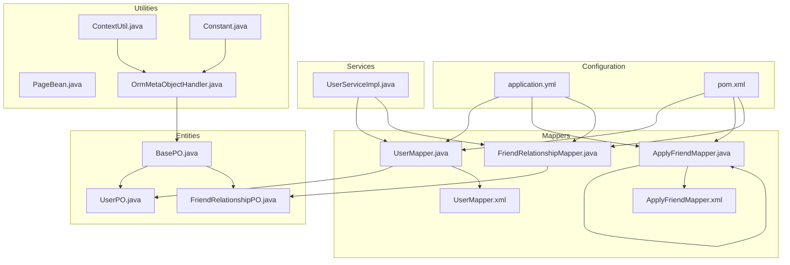
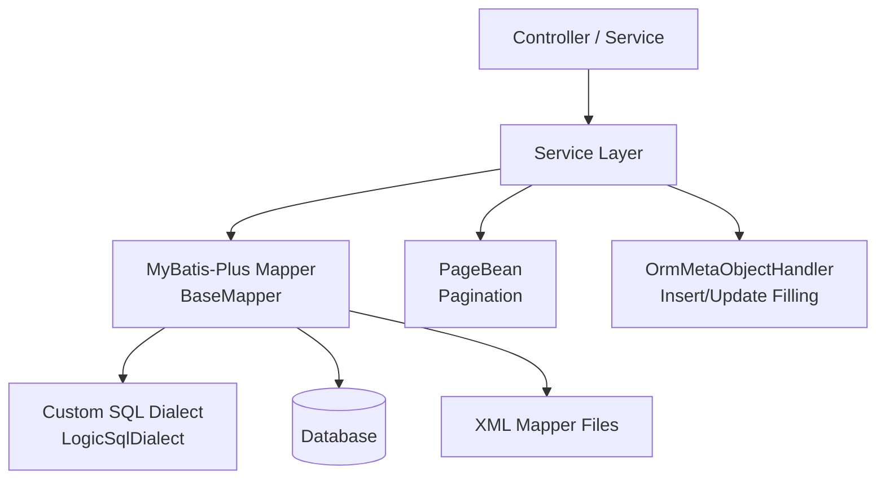
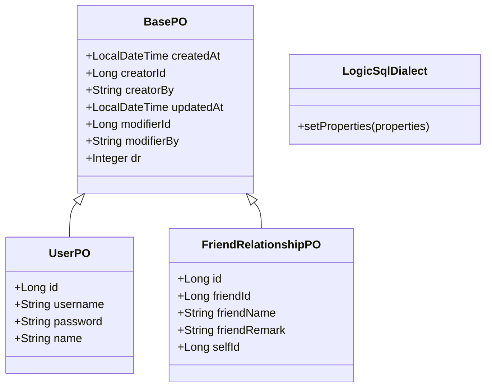
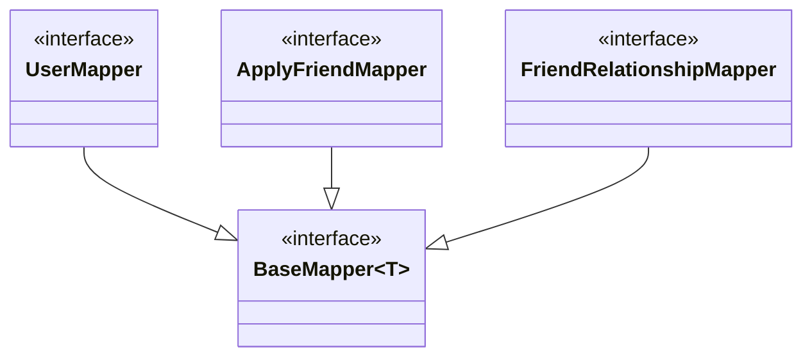
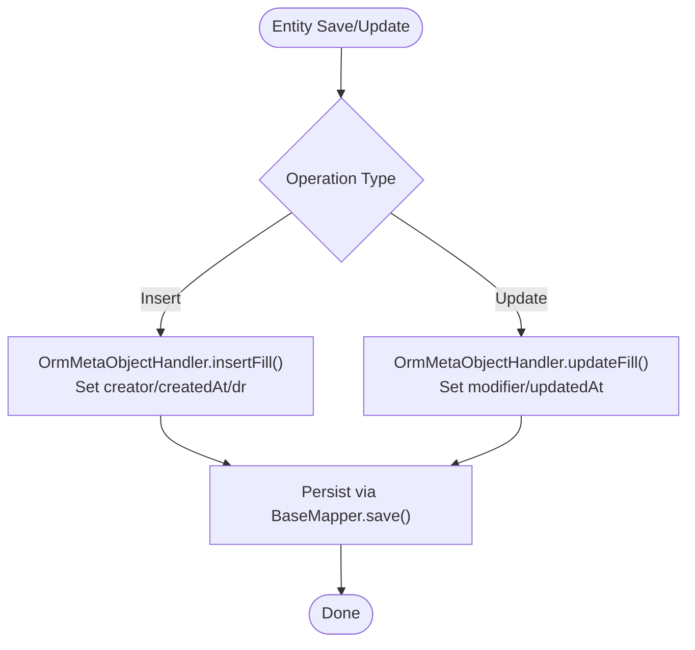
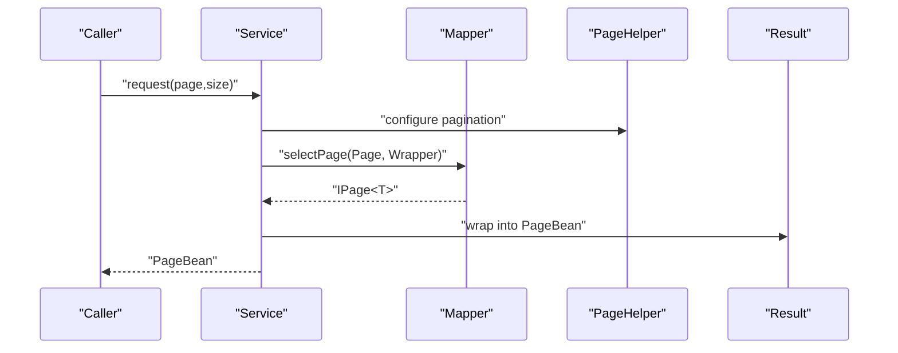
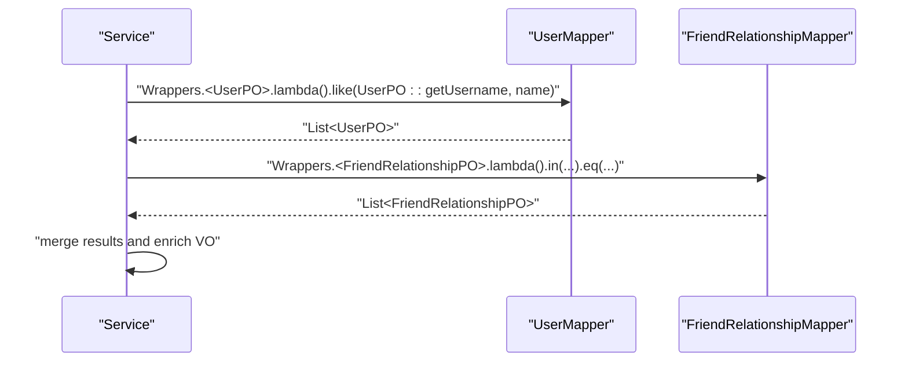
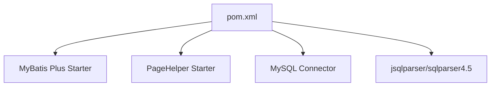

# Data Access Patterns and MyBatis Plus

<cite>
**Referenced Files in This Document**
- [LogicSqlDialect.java](file://src/main/java/com/hch/chat_simple/config/LogicSqlDialect.java)
- [PageBean.java](file://src/main/java/com/hch/chat_simple/util/PageBean.java)
- [UserMapper.java](file://src/main/java/com/hch/chat_simple/mapper/UserMapper.java)
- [ApplyFriendMapper.java](file://src/main/java/com/hch/chat_simple/mapper/ApplyFriendMapper.java)
- [FriendRelationshipMapper.java](file://src/main/java/com/hch/chat_simple/mapper/FriendRelationshipMapper.java)
- [BasePO.java](file://src/main/java/com/hch/chat_simple/pojo/po/BasePO.java)
- [UserPO.java](file://src/main/java/com/hch/chat_simple/pojo/po/UserPO.java)
- [FriendRelationshipPO.java](file://src/main/java/com/hch/chat_simple/pojo/po/FriendRelationshipPO.java)
- [UserMapper.xml](file://src/main/resources/mapper/UserMapper.xml)
- [ApplyFriendMapper.xml](file://src/main/resources/mapper/ApplyFriendMapper.xml)
- [application.yml](file://src/main/resources/application.yml)
- [pom.xml](file://pom.xml)
- [UserServiceImpl.java](file://src/main/java/com/hch/chat_simple/service/impl/UserServiceImpl.java)
- [Constant.java](file://src/main/java/com/hch/chat_simple/util/Constant.java)
- [ContextUtil.java](file://src/main/java/com/hch/chat_simple/util/ContextUtil.java)
- [OrmMetaObjectHandler.java](file://src/main/java/com/hch/chat_simple/config/OrmMetaObjectHandler.java)
</cite>

## Table of Contents
1. [Introduction](#introduction)
2. [Project Structure](#project-structure)
3. [Core Components](#core-components)
4. [Architecture Overview](#architecture-overview)
5. [Detailed Component Analysis](#detailed-component-analysis)
6. [Dependency Analysis](#dependency-analysis)
7. [Performance Considerations](#performance-considerations)
8. [Troubleshooting Guide](#troubleshooting-guide)
9. [Conclusion](#conclusion)
10. [Appendices](#appendices)

## Introduction
This document explains the data access layer architecture built with MyBatis Plus in the project. It covers enhanced ORM capabilities such as automatic SQL generation via BaseMapper, lambda-style query construction, and pagination support. It documents the custom SQL dialect for soft delete behavior, mapper interface design patterns, entity mapping strategies, and the PageBean utility for paginated queries. It also outlines integration with Spring Data patterns, demonstrates complex queries and batch operations, and provides guidance on performance optimization and transaction management.

## Project Structure
The data access layer follows a layered pattern:
- Entities (POJOs) define table mappings and shared metadata.
- Mappers declare CRUD and query contracts extending BaseMapper.
- XML mapper files provide custom SQL when needed.
- Services orchestrate business logic and leverage MyBatis Plus features.
- Global configuration enables MyBatis Plus and PageHelper behaviors.

**Diagram sources**
- [application.yml:24-32](file://src/main/resources/application.yml#L24-L32)
- [pom.xml:175-194](file://pom.xml#L175-L194)
- [BasePO.java:14-43](file://src/main/java/com/hch/chat_simple/pojo/po/BasePO.java#L14-L43)
- [UserPO.java:25-46](file://src/main/java/com/hch/chat_simple/pojo/po/UserPO.java#L25-L46)
- [FriendRelationshipPO.java:23-44](file://src/main/java/com/hch/chat_simple/pojo/po/FriendRelationshipPO.java#L23-L44)
- [UserMapper.java:18-21](file://src/main/java/com/hch/chat_simple/mapper/UserMapper.java#L18-L21)
- [ApplyFriendMapper.java:16-19](file://src/main/java/com/hch/chat_simple/mapper/ApplyFriendMapper.java#L16-L19)
- [FriendRelationshipMapper.java:17-20](file://src/main/java/com/hch/chat_simple/mapper/FriendRelationshipMapper.java#L17-L20)
- [UserMapper.xml:1-6](file://src/main/resources/mapper/UserMapper.xml#L1-L6)
- [ApplyFriendMapper.xml:1-6](file://src/main/resources/mapper/ApplyFriendMapper.xml#L1-L6)
- [UserServiceImpl.java:37-99](file://src/main/java/com/hch/chat_simple/service/impl/UserServiceImpl.java#L37-L99)
- [ContextUtil.java:1-52](file://src/main/java/com/hch/chat_simple/util/ContextUtil.java#L1-L52)
- [Constant.java:13-15](file://src/main/java/com/hch/chat_simple/util/Constant.java#L13-L15)
- [OrmMetaObjectHandler.java:16-33](file://src/main/java/com/hch/chat_simple/config/OrmMetaObjectHandler.java#L16-L33)

**Section sources**
- [application.yml:24-32](file://src/main/resources/application.yml#L24-L32)
- [pom.xml:175-194](file://pom.xml#L175-L194)

## Core Components
- BasePO: Shared audit fields and soft delete marker mapped via annotations.
- UserPO and FriendRelationshipPO: Entity classes extending BasePO with table mapping and identifiers.
- Mappers: Interfaces extending BaseMapper to inherit generic CRUD and query methods.
- XML Mappers: Optional custom SQL files per mapper namespace.
- OrmMetaObjectHandler: Automatic field filling for inserts and updates.
- PageBean: Generic pagination wrapper for API responses.
- Application configuration: MyBatis Plus and PageHelper settings.

**Section sources**
- [BasePO.java:14-43](file://src/main/java/com/hch/chat_simple/pojo/po/BasePO.java#L14-L43)
- [UserPO.java:25-46](file://src/main/java/com/hch/chat_simple/pojo/po/UserPO.java#L25-L46)
- [FriendRelationshipPO.java:23-44](file://src/main/java/com/hch/chat_simple/pojo/po/FriendRelationshipPO.java#L23-L44)
- [UserMapper.java:18-21](file://src/main/java/com/hch/chat_simple/mapper/UserMapper.java#L18-L21)
- [ApplyFriendMapper.java:16-19](file://src/main/java/com/hch/chat_simple/mapper/ApplyFriendMapper.java#L16-L19)
- [FriendRelationshipMapper.java:17-20](file://src/main/java/com/hch/chat_simple/mapper/FriendRelationshipMapper.java#L17-L20)
- [UserMapper.xml:1-6](file://src/main/resources/mapper/UserMapper.xml#L1-L6)
- [ApplyFriendMapper.xml:1-6](file://src/main/resources/mapper/ApplyFriendMapper.xml#L1-L6)
- [OrmMetaObjectHandler.java:16-33](file://src/main/java/com/hch/chat_simple/config/OrmMetaObjectHandler.java#L16-L33)
- [PageBean.java:8-20](file://src/main/java/com/hch/chat_simple/util/PageBean.java#L8-L20)
- [application.yml:24-39](file://src/main/resources/application.yml#L24-L39)

## Architecture Overview
The data access architecture leverages MyBatis Plus to:
- Generate SQL automatically from entity annotations and lambda conditions.
- Provide pagination through PageHelper integration.
- Enforce soft deletes via global logic delete configuration and dialect customization.
- Support custom SQL via XML mapper files when needed.

**Diagram sources**
- [UserServiceImpl.java:37-99](file://src/main/java/com/hch/chat_simple/service/impl/UserServiceImpl.java#L37-L99)
- [LogicSqlDialect.java:12-20](file://src/main/java/com/hch/chat_simple/config/LogicSqlDialect.java#L12-L20)
- [PageBean.java:8-20](file://src/main/java/com/hch/chat_simple/util/PageBean.java#L8-L20)
- [UserMapper.java:18-21](file://src/main/java/com/hch/chat_simple/mapper/UserMapper.java#L18-L21)
- [UserMapper.xml:1-6](file://src/main/resources/mapper/UserMapper.xml#L1-L6)
- [OrmMetaObjectHandler.java:16-33](file://src/main/java/com/hch/chat_simple/config/OrmMetaObjectHandler.java#L16-L33)

## Detailed Component Analysis

### Soft Delete and Custom SQL Dialect
- Global logic delete configuration defines the logical deletion column and values.
- A custom dialect extends the MySQL dialect to customize count and order-by parsers.
- BasePO declares the logic delete field; entities inherit it.

**Diagram sources**
- [BasePO.java:14-43](file://src/main/java/com/hch/chat_simple/pojo/po/BasePO.java#L14-L43)
- [UserPO.java:25-46](file://src/main/java/com/hch/chat_simple/pojo/po/UserPO.java#L25-L46)
- [FriendRelationshipPO.java:23-44](file://src/main/java/com/hch/chat_simple/pojo/po/FriendRelationshipPO.java#L23-L44)
- [LogicSqlDialect.java:12-20](file://src/main/java/com/hch/chat_simple/config/LogicSqlDialect.java#L12-L20)

**Section sources**
- [application.yml:26-29](file://src/main/resources/application.yml#L26-L29)
- [BasePO.java:39-42](file://src/main/java/com/hch/chat_simple/pojo/po/BasePO.java#L39-L42)
- [LogicSqlDialect.java:12-20](file://src/main/java/com/hch/chat_simple/config/LogicSqlDialect.java#L12-L20)

### Mapper Interface Design Patterns
- Mappers extend BaseMapper to inherit generic CRUD and query methods.
- Lambda conditions enable type-safe query construction.
- XML mapper files define namespaces aligned with mapper interfaces.

**Diagram sources**
- [UserMapper.java:18-21](file://src/main/java/com/hch/chat_simple/mapper/UserMapper.java#L18-L21)
- [ApplyFriendMapper.java:16-19](file://src/main/java/com/hch/chat_simple/mapper/ApplyFriendMapper.java#L16-L19)
- [FriendRelationshipMapper.java:17-20](file://src/main/java/com/hch/chat_simple/mapper/FriendRelationshipMapper.java#L17-L20)

**Section sources**
- [UserMapper.java:18-21](file://src/main/java/com/hch/chat_simple/mapper/UserMapper.java#L18-L21)
- [ApplyFriendMapper.java:16-19](file://src/main/java/com/hch/chat_simple/mapper/ApplyFriendMapper.java#L16-L19)
- [FriendRelationshipMapper.java:17-20](file://src/main/java/com/hch/chat_simple/mapper/FriendRelationshipMapper.java#L17-L20)
- [UserMapper.xml](file://src/main/resources/mapper/UserMapper.xml#L3)
- [ApplyFriendMapper.xml](file://src/main/resources/mapper/ApplyFriendMapper.xml#L3)

### Entity Mapping Strategies
- Entities use table annotations and ID strategies.
- BasePO provides shared audit and soft delete fields.
- OrmMetaObjectHandler fills audit fields during insert/update using thread-local context.

**Diagram sources**
- [OrmMetaObjectHandler.java:18-31](file://src/main/java/com/hch/chat_simple/config/OrmMetaObjectHandler.java#L18-L31)
- [ContextUtil.java:12-26](file://src/main/java/com/hch/chat_simple/util/ContextUtil.java#L12-L26)
- [Constant.java:13-15](file://src/main/java/com/hch/chat_simple/util/Constant.java#L13-L15)
- [UserPO.java:25-46](file://src/main/java/com/hch/chat_simple/pojo/po/UserPO.java#L25-L46)
- [FriendRelationshipPO.java:23-44](file://src/main/java/com/hch/chat_simple/pojo/po/FriendRelationshipPO.java#L23-L44)

**Section sources**
- [UserPO.java:25-46](file://src/main/java/com/hch/chat_simple/pojo/po/UserPO.java#L25-L46)
- [FriendRelationshipPO.java:23-44](file://src/main/java/com/hch/chat_simple/pojo/po/FriendRelationshipPO.java#L23-L44)
- [BasePO.java:14-43](file://src/main/java/com/hch/chat_simple/pojo/po/BasePO.java#L14-L43)
- [OrmMetaObjectHandler.java:16-33](file://src/main/java/com/hch/chat_simple/config/OrmMetaObjectHandler.java#L16-L33)
- [ContextUtil.java:1-52](file://src/main/java/com/hch/chat_simple/util/ContextUtil.java#L1-L52)
- [Constant.java:13-15](file://src/main/java/com/hch/chat_simple/util/Constant.java#L13-L15)

### Pagination Support and PageBean Utility
- PageHelper is configured in application.yml with reasonable defaults and method argument support.
- PageBean encapsulates page number, size, and list for API responses.
- Services can integrate pagination with MyBatis Plus Page objects and convert to PageBean.

**Diagram sources**
- [application.yml:34-38](file://src/main/resources/application.yml#L34-L38)
- [PageBean.java:8-20](file://src/main/java/com/hch/chat_simple/util/PageBean.java#L8-L20)
- [UserServiceImpl.java:50-80](file://src/main/java/com/hch/chat_simple/service/impl/UserServiceImpl.java#L50-L80)

**Section sources**
- [application.yml:34-38](file://src/main/resources/application.yml#L34-L38)
- [PageBean.java:8-20](file://src/main/java/com/hch/chat_simple/util/PageBean.java#L8-L20)
- [UserServiceImpl.java:50-80](file://src/main/java/com/hch/chat_simple/service/impl/UserServiceImpl.java#L50-L80)

### Complex Queries and Batch Operations
- Lambda queries demonstrate type-safe conditions and projections.
- Complex joins and multi-table operations are handled by composing queries across related mappers.
- Batch operations can leverage BaseMapper.batchSave and related methods when extended.

**Diagram sources**
- [UserServiceImpl.java:50-80](file://src/main/java/com/hch/chat_simple/service/impl/UserServiceImpl.java#L50-L80)
- [UserMapper.java:18-21](file://src/main/java/com/hch/chat_simple/mapper/UserMapper.java#L18-L21)
- [FriendRelationshipMapper.java:17-20](file://src/main/java/com/hch/chat_simple/mapper/FriendRelationshipMapper.java#L17-L20)

**Section sources**
- [UserServiceImpl.java:43-80](file://src/main/java/com/hch/chat_simple/service/impl/UserServiceImpl.java#L43-L80)
- [UserMapper.java:18-21](file://src/main/java/com/hch/chat_simple/mapper/UserMapper.java#L18-L21)
- [FriendRelationshipMapper.java:17-20](file://src/main/java/com/hch/chat_simple/mapper/FriendRelationshipMapper.java#L17-L20)

### Transaction Management
- Service layer uses @Service and MyBatis Plus ServiceImpl; transactions are managed by Spring declaratively.
- For complex multi-step operations, wrap in @Transactional to ensure atomicity.

[No sources needed since this section provides general guidance]

## Dependency Analysis
External dependencies relevant to data access include MyBatis Plus starter, PageHelper starter, and MySQL connector. These are declared in the Maven POM.

**Diagram sources**
- [pom.xml:175-194](file://pom.xml#L175-L194)
- [pom.xml:155-173](file://pom.xml#L155-L173)
- [pom.xml:195-210](file://pom.xml#L195-L210)

**Section sources**
- [pom.xml:175-194](file://pom.xml#L175-L194)
- [pom.xml:155-173](file://pom.xml#L155-L173)
- [pom.xml:195-210](file://pom.xml#L195-L210)

## Performance Considerations
- Query caching: Enable MyBatis second-level cache in mapper configurations when appropriate.
- Lazy loading: Use associations/collections with care; enable lazy loading selectively to avoid N+1 issues.
- Result mapping: Prefer projection queries to reduce payload size; use Page to limit rows.
- Indexing: Ensure database indexes on frequently filtered/sorted columns.
- Batch operations: Use batch insert/update methods to minimize round trips.
- Soft delete: Leverage global logic delete to avoid scanning deleted records.

[No sources needed since this section provides general guidance]

## Troubleshooting Guide
- Soft delete not applied: Verify global logic delete configuration and that entities extend BasePO.
- Unexpected results with lambda queries: Confirm lambda expressions target correct entity fields and wrappers are constructed properly.
- Pagination issues: Ensure PageHelper configuration matches method signatures and PageBean wrapping logic.
- Audit fields missing: Confirm OrmMetaObjectHandler is registered and ContextUtil holds current user info.

**Section sources**
- [application.yml:26-29](file://src/main/resources/application.yml#L26-L29)
- [BasePO.java:39-42](file://src/main/java/com/hch/chat_simple/pojo/po/BasePO.java#L39-L42)
- [UserServiceImpl.java:43-80](file://src/main/java/com/hch/chat_simple/service/impl/UserServiceImpl.java#L43-L80)
- [PageBean.java:8-20](file://src/main/java/com/hch/chat_simple/util/PageBean.java#L8-L20)
- [OrmMetaObjectHandler.java:16-33](file://src/main/java/com/hch/chat_simple/config/OrmMetaObjectHandler.java#L16-L33)
- [ContextUtil.java:12-26](file://src/main/java/com/hch/chat_simple/util/ContextUtil.java#L12-L26)

## Conclusion
The data access layer leverages MyBatis Plus to deliver a clean, maintainable, and efficient persistence model. Automatic SQL generation, lambda queries, and pagination are seamlessly integrated. Soft delete behavior is enforced globally with a custom dialect and shared entity metadata. The mapper-service pattern, combined with XML customization where needed, supports both simplicity and extensibility. With proper configuration and adherence to best practices, the system achieves strong performance and reliability.

## Appendices
- Example references:
  - Lambda query usage: [UserServiceImpl.java:43-48](file://src/main/java/com/hch/chat_simple/service/impl/UserServiceImpl.java#L43-L48)
  - Multi-table enrichment: [UserServiceImpl.java:62-78](file://src/main/java/com/hch/chat_simple/service/impl/UserServiceImpl.java#L62-L78)
  - XML mapper namespace: [UserMapper.xml](file://src/main/resources/mapper/UserMapper.xml#L3)
  - Global logic delete config: [application.yml:26-29](file://src/main/resources/application.yml#L26-L29)