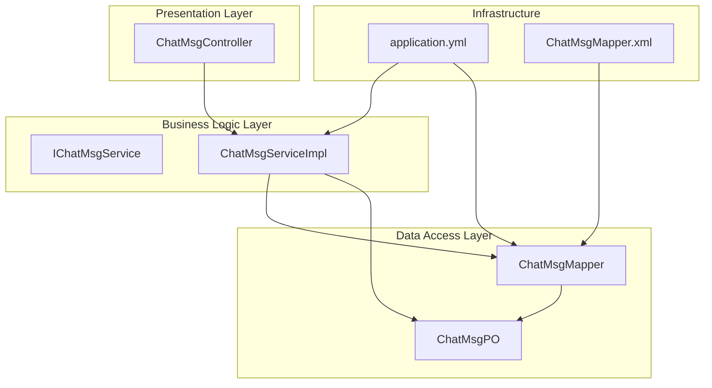
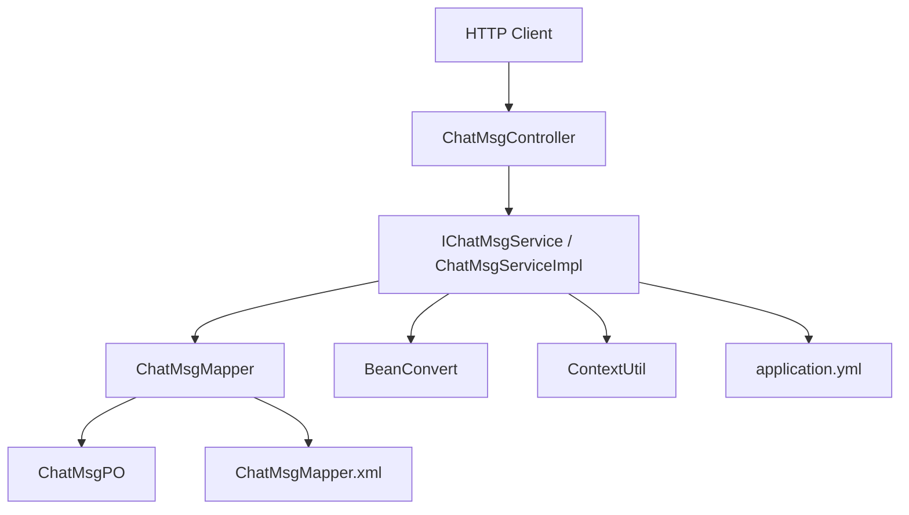
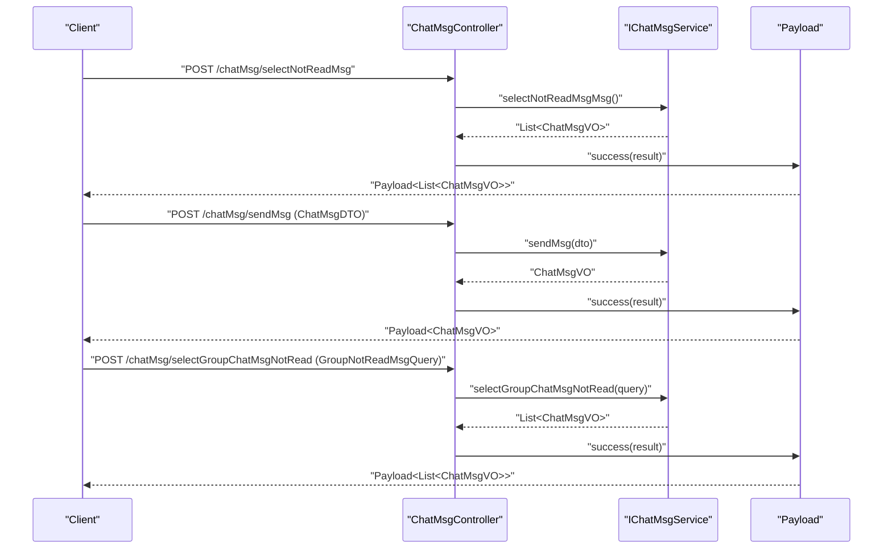
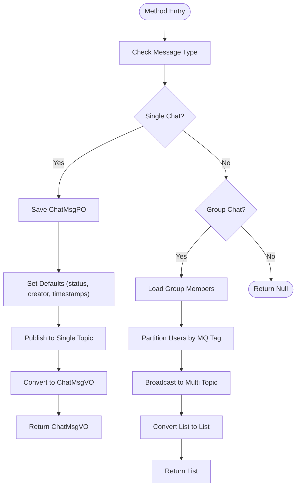
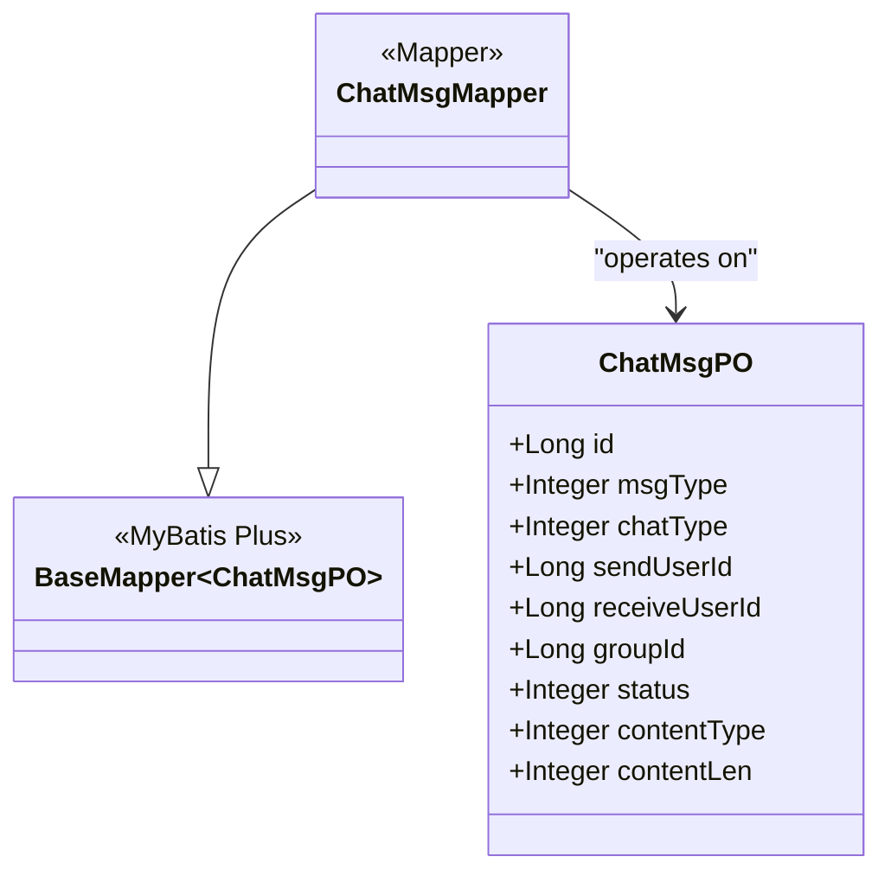
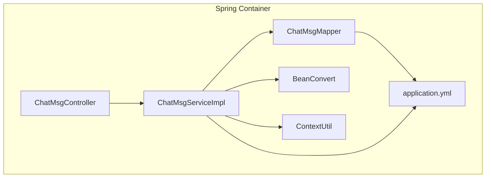

# Layered Architecture

<cite>
**Referenced Files in This Document**
- [ChatSimpleApplication.java](file://src/main/java/com/hch/chat_simple/ChatSimpleApplication.java)
- [WebMvcConfig.java](file://src/main/java/com/hch/chat_simple/config/WebMvcConfig.java)
- [ChatMsgController.java](file://src/main/java/com/hch/chat_simple/controller/ChatMsgController.java)
- [IChatMsgService.java](file://src/main/java/com/hch/chat_simple/service/IChatMsgService.java)
- [ChatMsgServiceImpl.java](file://src/main/java/com/hch/chat_simple/service/impl/ChatMsgServiceImpl.java)
- [ChatMsgMapper.java](file://src/main/java/com/hch/chat_simple/mapper/ChatMsgMapper.java)
- [ChatMsgPO.java](file://src/main/java/com/hch/chat_simple/pojo/po/ChatMsgPO.java)
- [application.yml](file://src/main/resources/application.yml)
- [ChatMsgMapper.xml](file://src/main/resources/mapper/ChatMsgMapper.xml)
- [BeanConvert.java](file://src/main/java/com/hch/chat_simple/util/BeanConvert.java)
- [ContextUtil.java](file://src/main/java/com/hch/chat_simple/util/ContextUtil.java)
- [UserServiceImpl.java](file://src/main/java/com/hch/chat_simple/service/impl/UserServiceImpl.java)
- [RedisUtil.java](file://src/main/java/com/hch/chat_simple/util/RedisUtil.java)
- [SnowflakeIdGen.java](file://src/main/java/com/hch/chat_simple/util/SnowflakeIdGen.java)
</cite>

## Table of Contents
1. [Introduction](#introduction)
2. [Project Structure](#project-structure)
3. [Core Components](#core-components)
4. [Architecture Overview](#architecture-overview)
5. [Detailed Component Analysis](#detailed-component-analysis)
6. [Dependency Analysis](#dependency-analysis)
7. [Performance Considerations](#performance-considerations)
8. [Troubleshooting Guide](#troubleshooting-guide)
9. [Conclusion](#conclusion)

## Introduction
This document explains the layered architecture design of Chat Simple, focusing on the clear separation between:
- Presentation layer (controllers)
- Business logic layer (services)
- Data access layer (mappers)

It details how Spring MVC handles HTTP requests in controllers, how services implement business rules and coordinate between components, and how MyBatis Plus manages database operations. It also documents the dependency injection pattern used throughout the application and demonstrates the flow of data and control using ChatMsgController, ChatMsgServiceImpl, and ChatMsgMapper as concrete examples. Finally, it outlines the benefits of this architectural pattern for maintainability, testability, and scalability.

## Project Structure
The application follows a conventional Maven layout with a Java package structure organized by layers:
- controller: REST endpoints exposed via Spring MVC
- service: business logic and orchestration
- mapper: MyBatis Plus mappers for data access
- po/pojo: persistent objects and DTO/VO models
- util: cross-cutting utilities
- config: Spring configuration and interceptors
- resources: application.yml, MyBatis mapper XML files

**Diagram sources**
- [ChatMsgController.java:31-57](file://src/main/java/com/hch/chat_simple/controller/ChatMsgController.java#L31-L57)
- [IChatMsgService.java:20-27](file://src/main/java/com/hch/chat_simple/service/IChatMsgService.java#L20-L27)
- [ChatMsgServiceImpl.java:53-55](file://src/main/java/com/hch/chat_simple/service/impl/ChatMsgServiceImpl.java#L53-L55)
- [ChatMsgMapper.java:17-18](file://src/main/java/com/hch/chat_simple/mapper/ChatMsgMapper.java#L17-L18)
- [ChatMsgPO.java:18-53](file://src/main/java/com/hch/chat_simple/pojo/po/ChatMsgPO.java#L18-L53)
- [application.yml:1-89](file://src/main/resources/application.yml#L1-L89)
- [ChatMsgMapper.xml:1-5](file://src/main/resources/mapper/ChatMsgMapper.xml#L1-L5)

**Section sources**
- [ChatSimpleApplication.java:14-22](file://src/main/java/com/hch/chat_simple/ChatSimpleApplication.java#L14-L22)
- [WebMvcConfig.java:8-27](file://src/main/java/com/hch/chat_simple/config/WebMvcConfig.java#L8-L27)

## Core Components
This section introduces the three layers and their responsibilities:
- Presentation layer (controllers): Expose HTTP endpoints, bind request payloads, and return standardized responses.
- Business logic layer (services): Implement domain rules, coordinate between components, manage transactions, and handle cross-cutting concerns.
- Data access layer (mappers): Define data access contracts and leverage MyBatis Plus to execute queries and mutations.

Key implementation highlights:
- Controllers depend on service interfaces for business operations.
- Services depend on mappers for persistence and on other services for collaboration.
- Mappers define DAO contracts and are implemented by MyBatis Plus based on configuration.

**Section sources**
- [ChatMsgController.java:36-49](file://src/main/java/com/hch/chat_simple/controller/ChatMsgController.java#L36-L49)
- [IChatMsgService.java:20-27](file://src/main/java/com/hch/chat_simple/service/IChatMsgService.java#L20-L27)
- [ChatMsgServiceImpl.java:53-55](file://src/main/java/com/hch/chat_simple/service/impl/ChatMsgServiceImpl.java#L53-L55)
- [ChatMsgMapper.java:17-18](file://src/main/java/com/hch/chat_simple/mapper/ChatMsgMapper.java#L17-L18)

## Architecture Overview
The layered architecture enforces a unidirectional dependency chain:
- Controllers depend on services (interface-based)
- Services depend on mappers (interface-based) and other services
- Mappers depend on persistent objects and MyBatis Plus infrastructure

**Diagram sources**
- [ChatMsgController.java:39-55](file://src/main/java/com/hch/chat_simple/controller/ChatMsgController.java#L39-L55)
- [ChatMsgServiceImpl.java:64-70](file://src/main/java/com/hch/chat_simple/service/impl/ChatMsgServiceImpl.java#L64-L70)
- [ChatMsgMapper.java:17-18](file://src/main/java/com/hch/chat_simple/mapper/ChatMsgMapper.java#L17-L18)
- [ChatMsgPO.java:18-53](file://src/main/java/com/hch/chat_simple/pojo/po/ChatMsgPO.java#L18-L53)
- [application.yml:16-32](file://src/main/resources/application.yml#L16-L32)
- [ChatMsgMapper.xml:3-5](file://src/main/resources/mapper/ChatMsgMapper.xml#L3-L5)

## Detailed Component Analysis

### Presentation Layer: ChatMsgController
Responsibilities:
- Define REST endpoints for chat message operations
- Bind request bodies to DTOs and return standardized Payload responses
- Delegate business logic to services

Key behaviors:
- Endpoint for fetching unread messages
- Endpoint for sending messages
- Endpoint for querying group chat unread messages

**Diagram sources**
- [ChatMsgController.java:39-55](file://src/main/java/com/hch/chat_simple/controller/ChatMsgController.java#L39-L55)
- [IChatMsgService.java:22-26](file://src/main/java/com/hch/chat_simple/service/IChatMsgService.java#L22-L26)

**Section sources**
- [ChatMsgController.java:36-55](file://src/main/java/com/hch/chat_simple/controller/ChatMsgController.java#L36-L55)

### Business Logic Layer: ChatMsgServiceImpl
Responsibilities:
- Implement business rules for chat messaging
- Coordinate between persistence, messaging, and other services
- Transform between DTOs/POs and VOs

Key behaviors:
- Fetch unread single-chat messages and mark them as delivered
- Persist outgoing messages and publish to asynchronous topics based on chat type
- Query group chat unread messages using composite conditions

**Diagram sources**
- [ChatMsgServiceImpl.java:97-144](file://src/main/java/com/hch/chat_simple/service/impl/ChatMsgServiceImpl.java#L97-L144)
- [ChatMsgServiceImpl.java:146-181](file://src/main/java/com/hch/chat_simple/service/impl/ChatMsgServiceImpl.java#L146-L181)

**Section sources**
- [ChatMsgServiceImpl.java:70-95](file://src/main/java/com/hch/chat_simple/service/impl/ChatMsgServiceImpl.java#L70-L95)
- [ChatMsgServiceImpl.java:97-144](file://src/main/java/com/hch/chat_simple/service/impl/ChatMsgServiceImpl.java#L97-L144)
- [ChatMsgServiceImpl.java:146-181](file://src/main/java/com/hch/chat_simple/service/impl/ChatMsgServiceImpl.java#L146-L181)

### Data Access Layer: ChatMsgMapper and MyBatis Plus
Responsibilities:
- Define the data access contract for ChatMsgPO
- Leverage MyBatis Plus BaseMapper for common CRUD operations
- Rely on application.yml and mapper XML for configuration

Key behaviors:
- Extend BaseMapper to inherit common operations
- Use application.yml for MyBatis Plus configuration and mapper locations
- Mapper XML can define custom SQL if needed

**Diagram sources**
- [ChatMsgMapper.java:17-18](file://src/main/java/com/hch/chat_simple/mapper/ChatMsgMapper.java#L17-L18)
- [ChatMsgPO.java:18-53](file://src/main/java/com/hch/chat_simple/pojo/po/ChatMsgPO.java#L18-L53)

**Section sources**
- [ChatMsgMapper.java:17-18](file://src/main/java/com/hch/chat_simple/mapper/ChatMsgMapper.java#L17-L18)
- [ChatMsgPO.java:18-53](file://src/main/java/com/hch/chat_simple/pojo/po/ChatMsgPO.java#L18-L53)
- [application.yml:24-32](file://src/main/resources/application.yml#L24-L32)
- [ChatMsgMapper.xml:3-5](file://src/main/resources/mapper/ChatMsgMapper.xml#L3-L5)

### Supporting Utilities and Configuration
- BeanConvert: Provides generic conversion between objects and lists, with optional transformer for post-processing.
- ContextUtil: ThreadLocal-based holder for current user identity used in service logic.
- application.yml: Central configuration for data source, MyBatis Plus, RocketMQ, Redisson, and server ports.

These utilities enable clean separation by encapsulating cross-cutting concerns outside of business logic.

**Section sources**
- [BeanConvert.java:17-57](file://src/main/java/com/hch/chat_simple/util/BeanConvert.java#L17-L57)
- [ContextUtil.java:12-42](file://src/main/java/com/hch/chat_simple/util/ContextUtil.java#L12-L42)
- [application.yml:1-89](file://src/main/resources/application.yml#L1-L89)

## Dependency Analysis
This section maps the dependency injection pattern across layers and shows how Spring manages component lifecycles and wiring.

**Diagram sources**
- [ChatMsgController.java:36-37](file://src/main/java/com/hch/chat_simple/controller/ChatMsgController.java#L36-L37)
- [ChatMsgServiceImpl.java:64-70](file://src/main/java/com/hch/chat_simple/service/impl/ChatMsgServiceImpl.java#L64-L70)
- [ChatMsgMapper.java:17-18](file://src/main/java/com/hch/chat_simple/mapper/ChatMsgMapper.java#L17-L18)
- [BeanConvert.java:17-26](file://src/main/java/com/hch/chat_simple/util/BeanConvert.java#L17-L26)
- [ContextUtil.java:12-18](file://src/main/java/com/hch/chat_simple/util/ContextUtil.java#L12-L18)
- [application.yml:16-32](file://src/main/resources/application.yml#L16-L32)

Additional cross-layer dependencies:
- UserServiceImpl demonstrates similar DI patterns, depending on mappers and other services.
- RedisUtil shows a utility that obtains Spring beans statically, enabling centralized caching operations.

**Section sources**
- [UserServiceImpl.java:40-41](file://src/main/java/com/hch/chat_simple/service/impl/UserServiceImpl.java#L40-L41)
- [RedisUtil.java:24-26](file://src/main/java/com/hch/chat_simple/util/RedisUtil.java#L24-L26)

## Performance Considerations
- Asynchronous messaging: Services publish messages to RocketMQ topics for single and group chats, decoupling request processing from delivery and improving throughput.
- Batch updates: Services update statuses in batches to reduce round-trips.
- Pagination and limits: Queries limit result sets to avoid heavy loads.
- Efficient conversions: BeanConvert supports Page objects and stream-based transformations to minimize overhead.
- Distributed ID generation: SnowflakeIdGen generates monotonic IDs per instance, reducing contention and ensuring uniqueness.

[No sources needed since this section provides general guidance]

## Troubleshooting Guide
Common areas to check:
- Controller endpoints: Verify endpoint paths and payload binding in controllers.
- Service logic: Confirm business rules and error handling paths in services.
- Mapper configuration: Ensure MyBatis Plus configuration and mapper XML locations are correct.
- Interceptors: Confirm cross-origin and login interceptors are registered as expected.

**Section sources**
- [WebMvcConfig.java:12-16](file://src/main/java/com/hch/chat_simple/config/WebMvcConfig.java#L12-L16)
- [application.yml:24-32](file://src/main/resources/application.yml#L24-L32)

## Conclusion
The layered architecture in Chat Simple cleanly separates concerns across presentation, business logic, and data access layers. Spring MVC controllers remain thin, delegating to services that encapsulate business rules and coordinate with mappers and external systems. MyBatis Plus simplifies data access with minimal boilerplate, while dependency injection ensures loose coupling and testability. This design improves maintainability, enables scalable growth, and facilitates unit and integration testing.