# Message Queue System (RocketMQ)

<cite>
**Referenced Files in This Document**
- [application.yml](file://src/main/resources/application.yml)
- [AsyncProducer.java](file://src/main/java/com/hch/chat_simple/mq/AsyncProducer.java)
- [MqProducerConfig.java](file://src/main/java/com/hch/chat_simple/mq/MqProducerConfig.java)
- [AsyncConsumerSingleChat.java](file://src/main/java/com/hch/chat_simple/mq/AsyncConsumerSingleChat.java)
- [AsyncConsumerMuiltChat.java](file://src/main/java/com/hch/chat_simple/mq/AsyncConsumerMuiltChat.java)
- [AsyncConsumerCompositionBusiness.java](file://src/main/java/com/hch/chat_simple/mq/AsyncConsumerCompositionBusiness.java)
- [AsyncConsumerDynamicTag.java](file://src/main/java/com/hch/chat_simple/mq/AsyncConsumerDynamicTag.java)
- [ChatMsgServiceImpl.java](file://src/main/java/com/hch/chat_simple/service/impl/ChatMsgServiceImpl.java)
- [MsgSenderServiceImpl.java](file://src/main/java/com/hch/chat_simple/service/impl/MsgSenderServiceImpl.java)
- [IChatMsgService.java](file://src/main/java/com/hch/chat_simple/service/IChatMsgService.java)
- [ChatMsgController.java](file://src/main/java/com/hch/chat_simple/controller/ChatMsgController.java)
- [ChatMsgDTO.java](file://src/main/java/com/hch/chat_simple/pojo/dto/ChatMsgDTO.java)
- [NettyGroup.java](file://src/main/java/com/hch/chat_simple/config/NettyGroup.java)
- [Constant.java](file://src/main/java/com/hch/chat_simple/util/Constant.java)
- [MsgTypeEnum.java](file://src/main/java/com/hch/chat_simple/enums/MsgTypeEnum.java)
</cite>

## Table of Contents
1. [Introduction](#introduction)
2. [Project Structure](#project-structure)
3. [Core Components](#core-components)
4. [Architecture Overview](#architecture-overview)
5. [Detailed Component Analysis](#detailed-component-analysis)
6. [Dependency Analysis](#dependency-analysis)
7. [Performance Considerations](#performance-considerations)
8. [Troubleshooting Guide](#troubleshooting-guide)
9. [Conclusion](#conclusion)
10. [Appendices](#appendices)

## Introduction
This document explains the RocketMQ-based asynchronous message processing system used in the chat application. It focuses on the producer-consumer pattern that decouples message sending from real-time delivery, enabling scalable and responsive chat operations. Topics include producer configuration, message serialization, topic management, consumer implementations for single and group chats, message acknowledgment, error handling, distributed routing via dynamic tags, ordering guarantees, fault tolerance, and integration between synchronous business operations and asynchronous messaging.

## Project Structure
The messaging subsystem resides under the mq package and integrates with the service layer and WebSocket transport for real-time delivery. Configuration is centralized in the application YAML file.

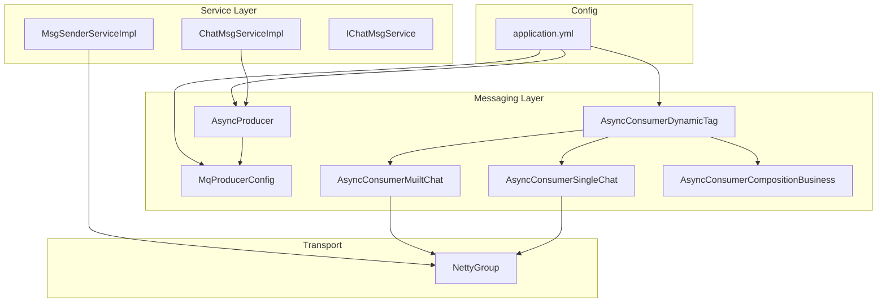

**Diagram sources**
- [AsyncProducer.java:1-63](file://src/main/java/com/hch/chat_simple/mq/AsyncProducer.java#L1-L63)
- [MqProducerConfig.java:1-31](file://src/main/java/com/hch/chat_simple/mq/MqProducerConfig.java#L1-L31)
- [AsyncConsumerSingleChat.java:1-84](file://src/main/java/com/hch/chat_simple/mq/AsyncConsumerSingleChat.java#L1-L84)
- [AsyncConsumerMuiltChat.java:1-92](file://src/main/java/com/hch/chat_simple/mq/AsyncConsumerMuiltChat.java#L1-L92)
- [AsyncConsumerCompositionBusiness.java:1-52](file://src/main/java/com/hch/chat_simple/mq/AsyncConsumerCompositionBusiness.java#L1-L52)
- [AsyncConsumerDynamicTag.java:1-215](file://src/main/java/com/hch/chat_simple/mq/AsyncConsumerDynamicTag.java#L1-L215)
- [ChatMsgServiceImpl.java:1-184](file://src/main/java/com/hch/chat_simple/service/impl/ChatMsgServiceImpl.java#L1-L184)
- [MsgSenderServiceImpl.java:1-79](file://src/main/java/com/hch/chat_simple/service/impl/MsgSenderServiceImpl.java#L1-L79)
- [NettyGroup.java:1-30](file://src/main/java/com/hch/chat_simple/config/NettyGroup.java#L1-L30)
- [application.yml:1-89](file://src/main/resources/application.yml#L1-L89)

**Section sources**
- [application.yml:39-51](file://src/main/resources/application.yml#L39-L51)
- [MqProducerConfig.java:16-28](file://src/main/java/com/hch/chat_simple/mq/MqProducerConfig.java#L16-L28)
- [AsyncProducer.java:23-29](file://src/main/java/com/hch/chat_simple/mq/AsyncProducer.java#L23-L29)

## Core Components
- Producer configuration and lifecycle: The producer group and name server address are configured via Spring beans and properties. The producer is started automatically and reused for asynchronous sends.
- AsyncProducer: Provides asynchronous send APIs with callback logging for success and failure.
- Consumers: Three consumer variants handle single chat, multi chat, and composite business notifications. They parse JSON payloads, route messages to online users via WebSocket channels, and update persistence upon successful delivery.
- Dynamic Tag Routing: Consumers subscribe to topics with tags derived from instance configuration, enabling horizontal scaling and partitioned consumption.
- Service Integration: Business services persist messages, compute routing tags, and publish to MQ. Consumers deliver to connected clients and update message status.

**Section sources**
- [MqProducerConfig.java:16-28](file://src/main/java/com/hch/chat_simple/mq/MqProducerConfig.java#L16-L28)
- [AsyncProducer.java:40-59](file://src/main/java/com/hch/chat_simple/mq/AsyncProducer.java#L40-L59)
- [AsyncConsumerSingleChat.java:47-73](file://src/main/java/com/hch/chat_simple/mq/AsyncConsumerSingleChat.java#L47-L73)
- [AsyncConsumerMuiltChat.java:57-83](file://src/main/java/com/hch/chat_simple/mq/AsyncConsumerMuiltChat.java#L57-L83)
- [AsyncConsumerDynamicTag.java:82-121](file://src/main/java/com/hch/chat_simple/mq/AsyncConsumerDynamicTag.java#L82-L121)
- [ChatMsgServiceImpl.java:98-144](file://src/main/java/com/hch/chat_simple/service/impl/ChatMsgServiceImpl.java#L98-L144)

## Architecture Overview
The system separates concerns between synchronous business operations and asynchronous delivery:
- Synchronous path: Controllers and Services persist messages and enqueue them to MQ.
- Asynchronous path: Consumers receive messages, resolve recipients, and push to WebSocket channels. Acknowledgment updates message status.

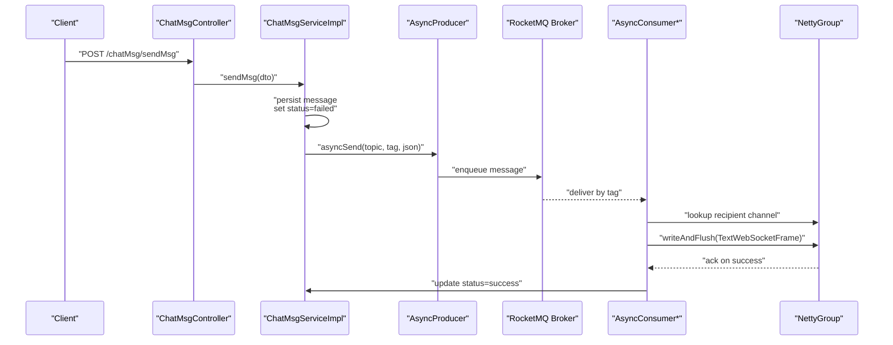

**Diagram sources**
- [ChatMsgController.java:45-49](file://src/main/java/com/hch/chat_simple/controller/ChatMsgController.java#L45-L49)
- [ChatMsgServiceImpl.java:98-144](file://src/main/java/com/hch/chat_simple/service/impl/ChatMsgServiceImpl.java#L98-L144)
- [AsyncProducer.java:40-59](file://src/main/java/com/hch/chat_simple/mq/AsyncProducer.java#L40-L59)
- [AsyncConsumerSingleChat.java:47-73](file://src/main/java/com/hch/chat_simple/mq/AsyncConsumerSingleChat.java#L47-L73)
- [NettyGroup.java:11-26](file://src/main/java/com/hch/chat_simple/config/NettyGroup.java#L11-L26)

## Detailed Component Analysis

### Producer Configuration and Lifecycle
- Producer group and name server are injected from configuration.
- A DefaultMQProducer bean is created and started during application initialization.
- AsyncProducer wraps the producer to send messages asynchronously with callbacks.

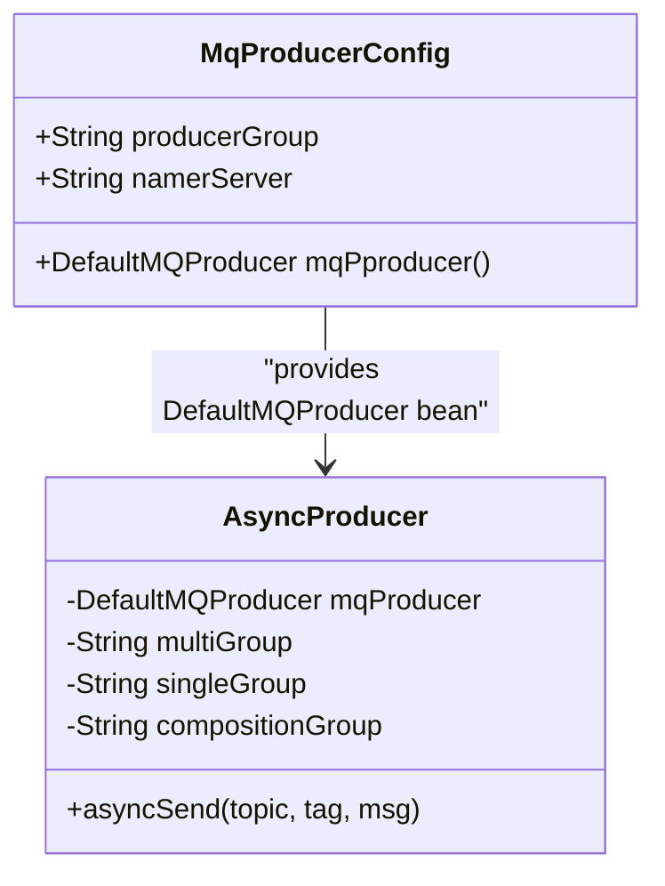

**Diagram sources**
- [MqProducerConfig.java:16-28](file://src/main/java/com/hch/chat_simple/mq/MqProducerConfig.java#L16-L28)
- [AsyncProducer.java:19-29](file://src/main/java/com/hch/chat_simple/mq/AsyncProducer.java#L19-L29)

**Section sources**
- [MqProducerConfig.java:16-28](file://src/main/java/com/hch/chat_simple/mq/MqProducerConfig.java#L16-L28)
- [AsyncProducer.java:40-59](file://src/main/java/com/hch/chat_simple/mq/AsyncProducer.java#L40-L59)

### Topic Management and Serialization
- Topics are centrally defined in configuration for single-chat, multi-chat, and composition.
- Messages are serialized to JSON strings and sent as byte arrays.
- Tags are computed per-instance to distribute load across consumers.

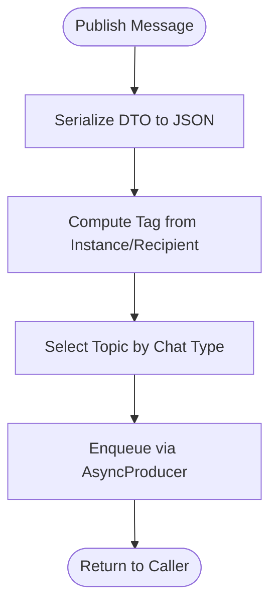

**Diagram sources**
- [application.yml:47-51](file://src/main/resources/application.yml#L47-L51)
- [ChatMsgServiceImpl.java:119-135](file://src/main/java/com/hch/chat_simple/service/impl/ChatMsgServiceImpl.java#L119-L135)
- [AsyncProducer.java:40-42](file://src/main/java/com/hch/chat_simple/mq/AsyncProducer.java#L40-L42)

**Section sources**
- [application.yml:47-51](file://src/main/resources/application.yml#L47-L51)
- [ChatMsgDTO.java:1-62](file://src/main/java/com/hch/chat_simple/pojo/dto/ChatMsgDTO.java#L1-L62)
- [ChatMsgServiceImpl.java:119-135](file://src/main/java/com/hch/chat_simple/service/impl/ChatMsgServiceImpl.java#L119-L135)

### Single Chat Consumer
- Consumes messages for direct user-to-user delivery.
- Parses JSON payload, checks chat type, and resolves the recipient’s WebSocket channel.
- On successful write, updates message status to success.

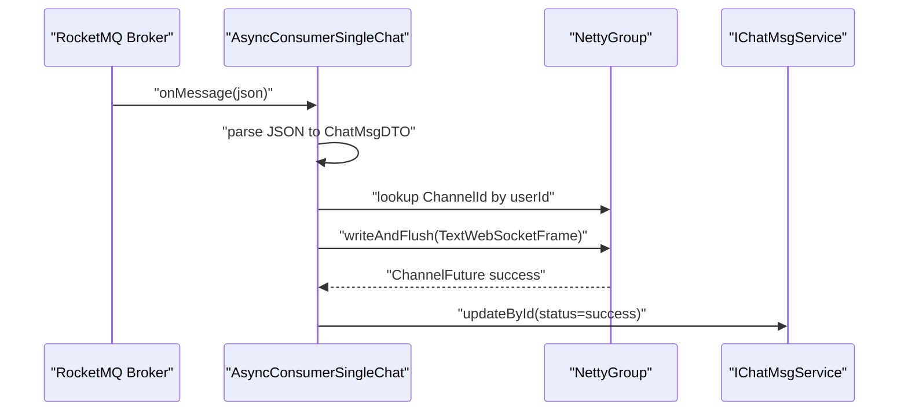

**Diagram sources**
- [AsyncConsumerSingleChat.java:47-73](file://src/main/java/com/hch/chat_simple/mq/AsyncConsumerSingleChat.java#L47-L73)
- [NettyGroup.java:21-26](file://src/main/java/com/hch/chat_simple/config/NettyGroup.java#L21-L26)
- [IChatMsgService.java:20-27](file://src/main/java/com/hch/chat_simple/service/IChatMsgService.java#L20-L27)

**Section sources**
- [AsyncConsumerSingleChat.java:47-73](file://src/main/java/com/hch/chat_simple/mq/AsyncConsumerSingleChat.java#L47-L73)
- [NettyGroup.java:21-26](file://src/main/java/com/hch/chat_simple/config/NettyGroup.java#L21-L26)
- [Constant.java:8-11](file://src/main/java/com/hch/chat_simple/util/Constant.java#L8-L11)

### Multi Chat Consumer
- Handles group chat broadcasts.
- Filters out the sender and delivers to each online member.
- Uses precomputed recipient lists embedded in the message payload.

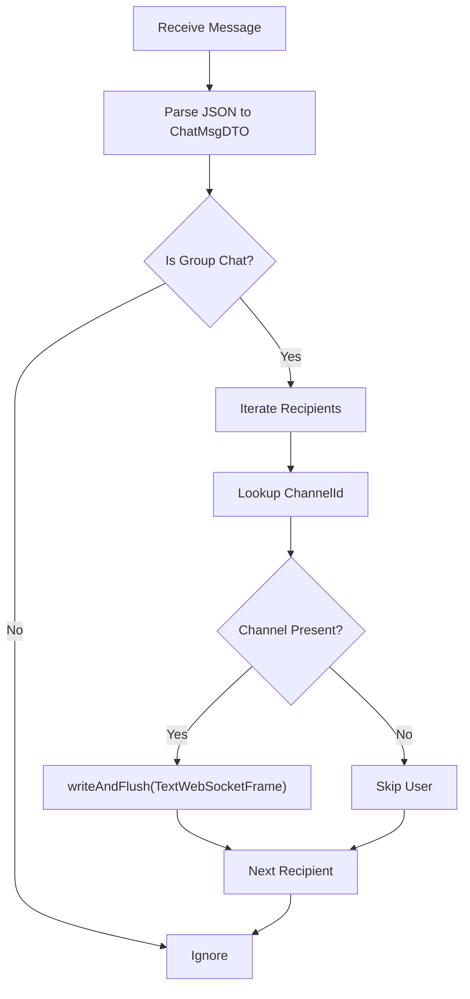

**Diagram sources**
- [AsyncConsumerMuiltChat.java:57-83](file://src/main/java/com/hch/chat_simple/mq/AsyncConsumerMuiltChat.java#L57-L83)
- [NettyGroup.java:21-26](file://src/main/java/com/hch/chat_simple/config/NettyGroup.java#L21-L26)

**Section sources**
- [AsyncConsumerMuiltChat.java:57-83](file://src/main/java/com/hch/chat_simple/mq/AsyncConsumerMuiltChat.java#L57-L83)

### Composition Business Consumer
- Routes composite messages to registered business handlers based on message type.
- Parses a composite header to extract type and channel key, then dispatches to the appropriate handler.

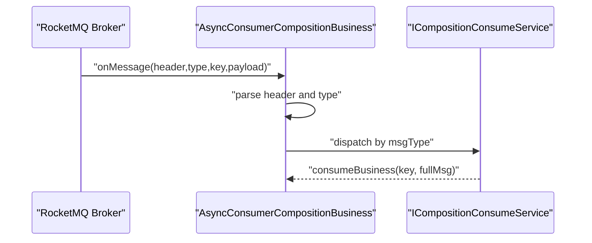

**Diagram sources**
- [AsyncConsumerCompositionBusiness.java:26-49](file://src/main/java/com/hch/chat_simple/mq/AsyncConsumerCompositionBusiness.java#L26-L49)

**Section sources**
- [AsyncConsumerCompositionBusiness.java:26-49](file://src/main/java/com/hch/chat_simple/mq/AsyncConsumerCompositionBusiness.java#L26-L49)

### Dynamic Tag Routing and Scaling
- Consumers subscribe to topics with tags derived from instance configuration.
- Tag assignment maps recipients or instances to tags, distributing messages across consumer instances.
- Consumer groups and message model are set to cluster mode for partitioned consumption.

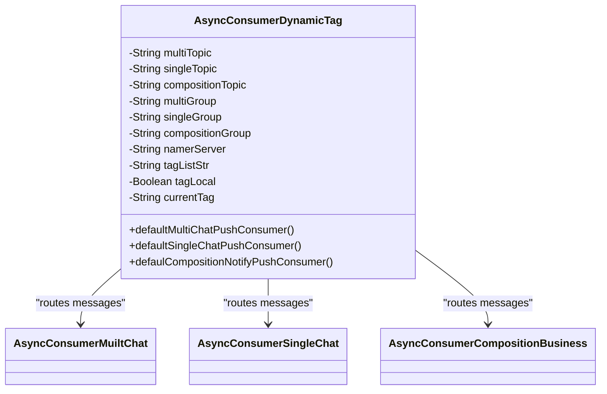

**Diagram sources**
- [AsyncConsumerDynamicTag.java:35-51](file://src/main/java/com/hch/chat_simple/mq/AsyncConsumerDynamicTag.java#L35-L51)
- [AsyncConsumerDynamicTag.java:82-121](file://src/main/java/com/hch/chat_simple/mq/AsyncConsumerDynamicTag.java#L82-L121)
- [AsyncConsumerDynamicTag.java:129-163](file://src/main/java/com/hch/chat_simple/mq/AsyncConsumerDynamicTag.java#L129-L163)
- [AsyncConsumerDynamicTag.java:165-199](file://src/main/java/com/hch/chat_simple/mq/AsyncConsumerDynamicTag.java#L165-L199)

**Section sources**
- [AsyncConsumerDynamicTag.java:82-121](file://src/main/java/com/hch/chat_simple/mq/AsyncConsumerDynamicTag.java#L82-L121)
- [AsyncConsumerDynamicTag.java:129-163](file://src/main/java/com/hch/chat_simple/mq/AsyncConsumerDynamicTag.java#L129-L163)
- [AsyncConsumerDynamicTag.java:165-199](file://src/main/java/com/hch/chat_simple/mq/AsyncConsumerDynamicTag.java#L165-L199)
- [application.yml:76-82](file://src/main/resources/application.yml#L76-L82)

### Message Acknowledgment and Error Handling
- Single chat consumer updates message status to success upon successful WebSocket write.
- Producer callbacks log success and exceptions for monitoring.
- Consumers wrap processing in try-catch blocks to propagate runtime exceptions for DLQ handling.

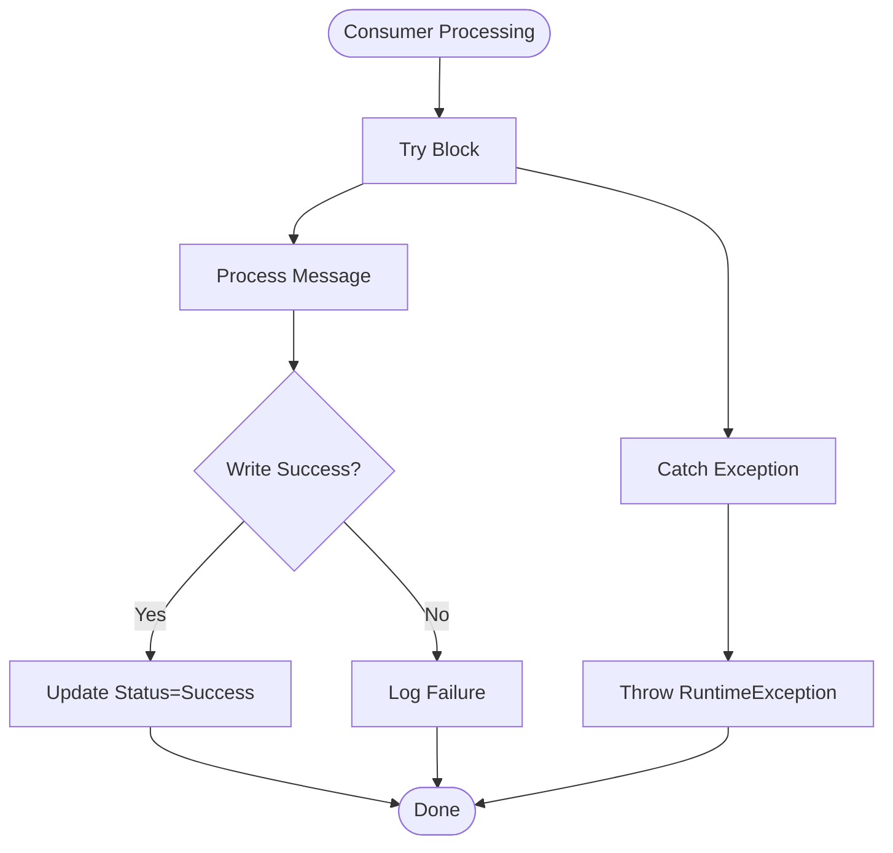

**Diagram sources**
- [AsyncConsumerSingleChat.java:76-82](file://src/main/java/com/hch/chat_simple/mq/AsyncConsumerSingleChat.java#L76-L82)
- [AsyncProducer.java:44-58](file://src/main/java/com/hch/chat_simple/mq/AsyncProducer.java#L44-L58)

**Section sources**
- [AsyncConsumerSingleChat.java:60-67](file://src/main/java/com/hch/chat_simple/mq/AsyncConsumerSingleChat.java#L60-L67)
- [AsyncProducer.java:44-58](file://src/main/java/com/hch/chat_simple/mq/AsyncProducer.java#L44-L58)

### Integration Between Synchronous Operations and Asynchronous Messaging
- The service layer persists messages synchronously, sets initial status to failed, and enqueues them for asynchronous delivery.
- Consumers acknowledge successful delivery by updating message status.
- Clients can poll for undelivered single-chat messages to recover missed deliveries.

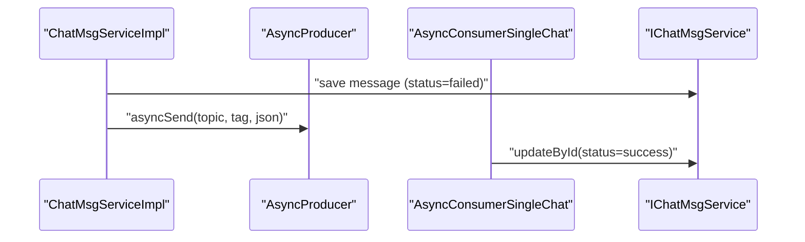

**Diagram sources**
- [ChatMsgServiceImpl.java:106-116](file://src/main/java/com/hch/chat_simple/service/impl/ChatMsgServiceImpl.java#L106-L116)
- [ChatMsgServiceImpl.java:120-124](file://src/main/java/com/hch/chat_simple/service/impl/ChatMsgServiceImpl.java#L120-L124)
- [AsyncConsumerSingleChat.java:62-66](file://src/main/java/com/hch/chat_simple/mq/AsyncConsumerSingleChat.java#L62-L66)

**Section sources**
- [ChatMsgServiceImpl.java:98-144](file://src/main/java/com/hch/chat_simple/service/impl/ChatMsgServiceImpl.java#L98-L144)
- [IChatMsgService.java:20-27](file://src/main/java/com/hch/chat_simple/service/IChatMsgService.java#L20-L27)

## Dependency Analysis
The messaging layer depends on configuration for topics, producer/consumer groups, and tag mapping. Consumers depend on Netty channels for real-time delivery and on service interfaces for persistence updates.

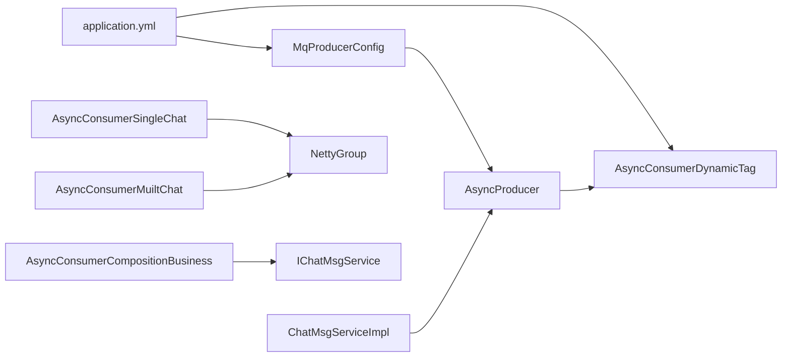

**Diagram sources**
- [application.yml:39-51](file://src/main/resources/application.yml#L39-L51)
- [MqProducerConfig.java:16-28](file://src/main/java/com/hch/chat_simple/mq/MqProducerConfig.java#L16-L28)
- [AsyncConsumerDynamicTag.java:35-51](file://src/main/java/com/hch/chat_simple/mq/AsyncConsumerDynamicTag.java#L35-L51)
- [AsyncProducer.java:19-20](file://src/main/java/com/hch/chat_simple/mq/AsyncProducer.java#L19-L20)
- [ChatMsgServiceImpl.java:64-65](file://src/main/java/com/hch/chat_simple/service/impl/ChatMsgServiceImpl.java#L64-L65)
- [AsyncConsumerSingleChat.java:38-40](file://src/main/java/com/hch/chat_simple/mq/AsyncConsumerSingleChat.java#L38-L40)
- [AsyncConsumerMuiltChat.java:38-42](file://src/main/java/com/hch/chat_simple/mq/AsyncConsumerMuiltChat.java#L38-L42)
- [AsyncConsumerCompositionBusiness.java:13-24](file://src/main/java/com/hch/chat_simple/mq/AsyncConsumerCompositionBusiness.java#L13-L24)

**Section sources**
- [application.yml:39-51](file://src/main/resources/application.yml#L39-L51)
- [AsyncConsumerDynamicTag.java:35-51](file://src/main/java/com/hch/chat_simple/mq/AsyncConsumerDynamicTag.java#L35-L51)
- [ChatMsgServiceImpl.java:64-65](file://src/main/java/com/hch/chat_simple/service/impl/ChatMsgServiceImpl.java#L64-L65)

## Performance Considerations
- Asynchronous sends: Producer uses asynchronous send with callbacks to avoid blocking the main thread.
- Fixed thread pools: Consumers use fixed-size executors to limit resource usage while handling concurrent messages.
- Tag-based distribution: Dynamic tag routing distributes messages across consumer instances, improving throughput.
- WebSocket batching: While not implemented here, batching frames at the transport level can reduce overhead.
- Persistence updates: Acknowledgments update message status after successful delivery to minimize repeated retries.

[No sources needed since this section provides general guidance]

## Troubleshooting Guide
- Producer exceptions: Producer callbacks log exceptions during send failures; verify name server connectivity and topic/tag correctness.
- Consumer errors: Runtime exceptions thrown by consumers indicate processing failures; check logs for stack traces and ensure handlers are registered.
- Delivery gaps: For single-chat, clients can poll for failed messages and reprocess them; confirm status updates occur after successful writes.
- Tag mismatches: Ensure tag list and current tag align with instance configuration; mismatched tags prevent consumption.

**Section sources**
- [AsyncProducer.java:56-58](file://src/main/java/com/hch/chat_simple/mq/AsyncProducer.java#L56-L58)
- [AsyncConsumerSingleChat.java:76-82](file://src/main/java/com/hch/chat_simple/mq/AsyncConsumerSingleChat.java#L76-L82)
- [ChatMsgServiceImpl.java:71-95](file://src/main/java/com/hch/chat_simple/service/impl/ChatMsgServiceImpl.java#L71-L95)

## Conclusion
The RocketMQ-based messaging system decouples synchronous business operations from real-time delivery, improving responsiveness and scalability. Producers publish messages asynchronously with robust callbacks, while consumers route messages to online users via WebSocket channels and update persistence upon successful delivery. Dynamic tag routing enables horizontal scaling, and explicit acknowledgment ensures reliable delivery. Together, these patterns form a resilient, high-throughput messaging backbone for the chat application.

[No sources needed since this section summarizes without analyzing specific files]

## Appendices

### Example Workflows

- Publishing a single chat message
  - Persist message with failed status.
  - Compute recipient-based tag.
  - Enqueue via AsyncProducer.
  - Consumer delivers to WebSocket; on success, update status to success.

- Publishing a group chat message
  - Persist message with failed status.
  - Compute tag per recipient group.
  - Enqueue per-tag partition.
  - Consumer delivers to all online members except the sender.

- Composite business notification
  - Producer publishes composite message with header and payload.
  - Consumer parses header, selects handler by type, and dispatches to handler.

**Section sources**
- [ChatMsgServiceImpl.java:98-144](file://src/main/java/com/hch/chat_simple/service/impl/ChatMsgServiceImpl.java#L98-L144)
- [AsyncProducer.java:40-59](file://src/main/java/com/hch/chat_simple/mq/AsyncProducer.java#L40-L59)
- [AsyncConsumerSingleChat.java:47-73](file://src/main/java/com/hch/chat_simple/mq/AsyncConsumerSingleChat.java#L47-L73)
- [AsyncConsumerMuiltChat.java:57-83](file://src/main/java/com/hch/chat_simple/mq/AsyncConsumerMuiltChat.java#L57-L83)
- [AsyncConsumerCompositionBusiness.java:26-49](file://src/main/java/com/hch/chat_simple/mq/AsyncConsumerCompositionBusiness.java#L26-L49)

### Retry Policies
- Producer callbacks: Log exceptions; external monitoring can trigger retries or dead-letter handling.
- Consumer runtime exceptions: Thrown to broker for redelivery according to broker configuration.
- Client-side recovery: Poll for failed single-chat messages and reattempt delivery.

**Section sources**
- [AsyncProducer.java:56-58](file://src/main/java/com/hch/chat_simple/mq/AsyncProducer.java#L56-L58)
- [AsyncConsumerSingleChat.java:76-82](file://src/main/java/com/hch/chat_simple/mq/AsyncConsumerSingleChat.java#L76-L82)
- [ChatMsgServiceImpl.java:71-95](file://src/main/java/com/hch/chat_simple/service/impl/ChatMsgServiceImpl.java#L71-L95)