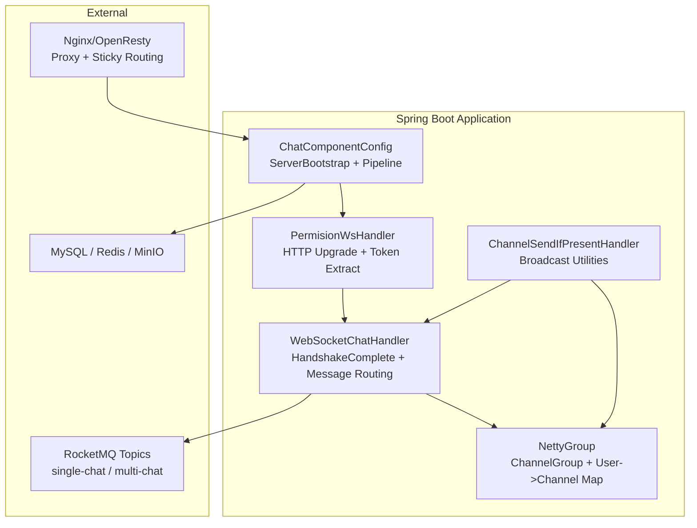
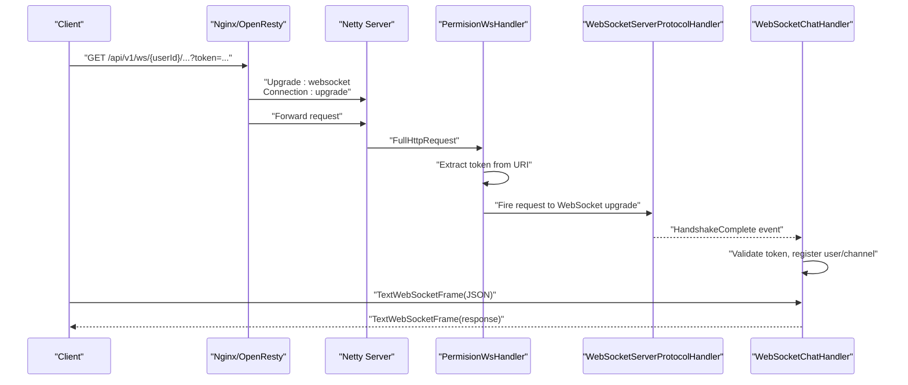
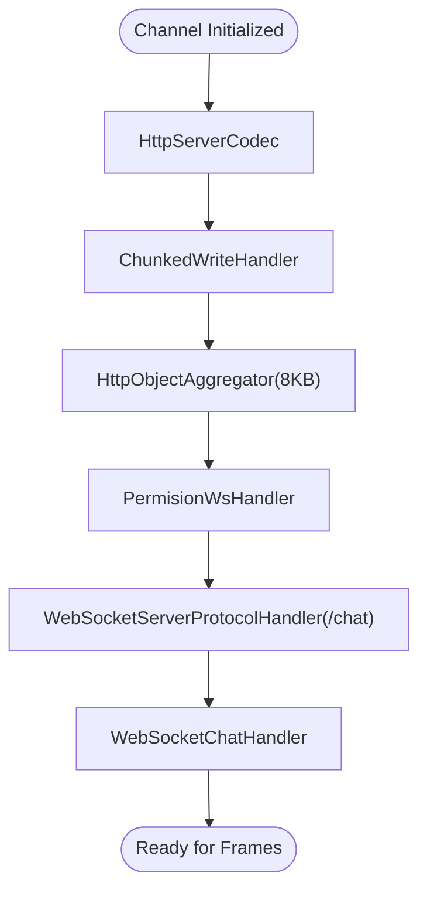
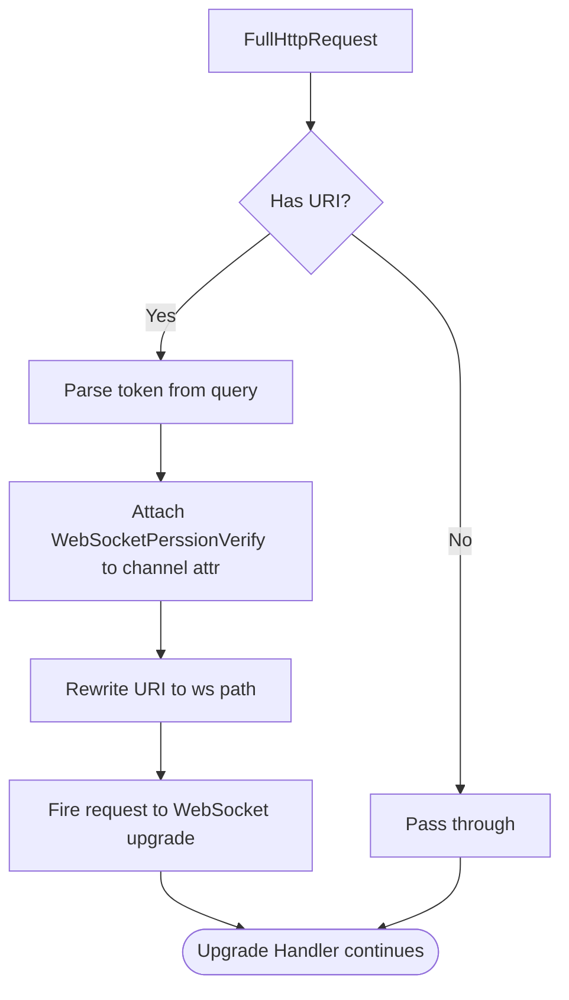
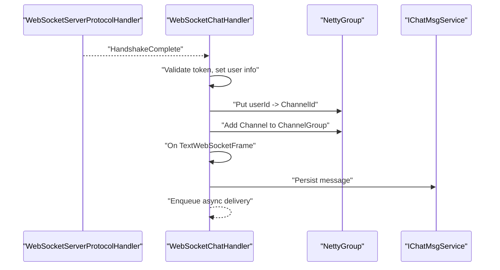
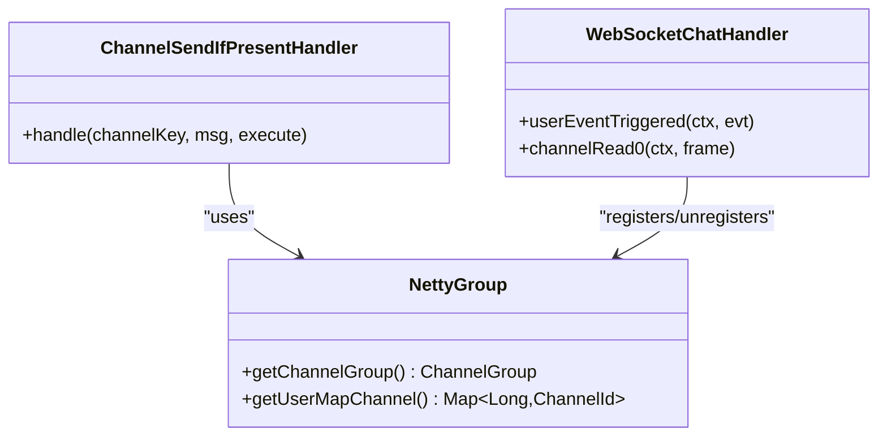
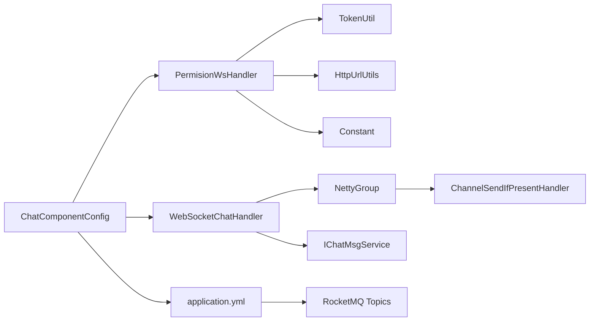

# WebSocket Communication System

<cite>
**Referenced Files in This Document**
- [ChatComponentConfig.java](file://src/main/java/com/hch/chat_simple/config/ChatComponentConfig.java)
- [NettyGroup.java](file://src/main/java/com/hch/chat_simple/config/NettyGroup.java)
- [PermisionWsHandler.java](file://src/main/java/com/hch/chat_simple/handler/PermisionWsHandler.java)
- [WebSocketChatHandler.java](file://src/main/java/com/hch/chat_simple/handler/WebSocketChatHandler.java)
- [ChannelSendIfPresentHandler.java](file://src/main/java/com/hch/chat_simple/handler/ChannelSendIfPresentHandler.java)
- [application.yml](file://src/main/resources/application.yml)
- [nginx.conf](file://openresty_nginx_conf/nginx.conf)
- [Constant.java](file://src/main/java/com/hch/chat_simple/util/Constant.java)
- [TokenUtil.java](file://src/main/java/com/hch/chat_simple/util/TokenUtil.java)
- [HttpUrlUtils.java](file://src/main/java/com/hch/chat_simple/util/HttpUrlUtils.java)
- [WebSocketPerssionVerify.java](file://src/main/java/com/hch/chat_simple/pojo/dto/WebSocketPerssionVerify.java)
- [TokenInfoDTO.java](file://src/main/java/com/hch/chat_simple/pojo/dto/TokenInfoDTO.java)
</cite>

## Table of Contents
1. [Introduction](#introduction)
2. [Project Structure](#project-structure)
3. [Core Components](#core-components)
4. [Architecture Overview](#architecture-overview)
5. [Detailed Component Analysis](#detailed-component-analysis)
6. [Dependency Analysis](#dependency-analysis)
7. [Performance Considerations](#performance-considerations)
8. [Troubleshooting Guide](#troubleshooting-guide)
9. [Conclusion](#conclusion)

## Introduction
This document explains the WebSocket communication system built on Netty for high-performance real-time messaging. It covers the ServerBootstrap configuration, channel pipeline, handler chain, HTTP upgrade to WebSocket, frame handling, permission verification, session management via a centralized channel registry, and message routing. It also includes practical examples for handshake, message framing, and broadcasting, along with scalability and performance optimization guidance for handling thousands of concurrent connections.

## Project Structure
The WebSocket stack is composed of:
- A Netty-based server configured via Spring-managed beans
- An HTTP-to-WebSocket upgrade pipeline
- Permission verification during the upgrade phase
- Business logic for message handling and routing
- Centralized session management and broadcast utilities

**Diagram sources**
- [ChatComponentConfig.java:48-89](file://src/main/java/com/hch/chat_simple/config/ChatComponentConfig.java#L48-L89)
- [NettyGroup.java:11-29](file://src/main/java/com/hch/chat_simple/config/NettyGroup.java#L11-L29)
- [PermisionWsHandler.java:26-80](file://src/main/java/com/hch/chat_simple/handler/PermisionWsHandler.java#L26-L80)
- [WebSocketChatHandler.java:50-196](file://src/main/java/com/hch/chat_simple/handler/WebSocketChatHandler.java#L50-L196)
- [ChannelSendIfPresentHandler.java:14-33](file://src/main/java/com/hch/chat_simple/handler/ChannelSendIfPresentHandler.java#L14-L33)
- [nginx.conf:53-81](file://openresty_nginx_conf/nginx.conf#L53-L81)

**Section sources**
- [ChatComponentConfig.java:48-89](file://src/main/java/com/hch/chat_simple/config/ChatComponentConfig.java#L48-L89)
- [application.yml:74-78](file://src/main/resources/application.yml#L74-L78)
- [nginx.conf:53-81](file://openresty_nginx_conf/nginx.conf#L53-L81)

## Core Components
- ServerBootstrap and pipeline
  - Boss/Worker groups, bind port, and pipeline initialization are configured in a Spring-managed bean.
  - The pipeline encodes/decodes HTTP, aggregates requests, performs permission checks, upgrades to WebSocket, and finally routes business frames.
- Permission verification
  - Extracts token from URI query and stores a verification object on the channel’s attributes for later use during handshake completion.
- Business handler
  - On handshake completion, validates token, associates user ID to channel, and registers the channel in the central registry.
  - Handles incoming WebSocket text frames, persists messages, and triggers asynchronous delivery paths.
- Session management and routing
  - Central registry maintains user-to-channel mapping and a channel group for broadcasts.
  - Broadcast utilities encapsulate sending logic to online users.

**Section sources**
- [ChatComponentConfig.java:48-89](file://src/main/java/com/hch/chat_simple/config/ChatComponentConfig.java#L48-L89)
- [PermisionWsHandler.java:32-66](file://src/main/java/com/hch/chat_simple/handler/PermisionWsHandler.java#L32-L66)
- [WebSocketChatHandler.java:118-163](file://src/main/java/com/hch/chat_simple/handler/WebSocketChatHandler.java#L118-L163)
- [NettyGroup.java:11-29](file://src/main/java/com/hch/chat_simple/config/NettyGroup.java#L11-L29)
- [ChannelSendIfPresentHandler.java:14-33](file://src/main/java/com/hch/chat_simple/handler/ChannelSendIfPresentHandler.java#L14-L33)

## Architecture Overview
The system integrates Nginx/OpenResty for sticky routing and WebSocket proxying, Netty for high-throughput transport, and Spring-managed handlers for protocol upgrade and business logic.

**Diagram sources**
- [nginx.conf:53-81](file://openresty_nginx_conf/nginx.conf#L53-L81)
- [ChatComponentConfig.java:74-89](file://src/main/java/com/hch/chat_simple/config/ChatComponentConfig.java#L74-L89)
- [PermisionWsHandler.java:32-66](file://src/main/java/com/hch/chat_simple/handler/PermisionWsHandler.java#L32-L66)
- [WebSocketChatHandler.java:118-163](file://src/main/java/com/hch/chat_simple/handler/WebSocketChatHandler.java#L118-L163)

## Detailed Component Analysis

### ServerBootstrap and Channel Pipeline
- Event loop groups: dedicated boss and worker threads for accept and I/O.
- Pipeline stages:
  - HTTP codec and chunked writer
  - HTTP object aggregator
  - Permission handler (extracts token and rewrites URI)
  - WebSocket protocol handler (upgrade, subprotocols, max frame size)
  - Business handler (message processing and session registration)

**Diagram sources**
- [ChatComponentConfig.java:74-89](file://src/main/java/com/hch/chat_simple/config/ChatComponentConfig.java#L74-L89)

**Section sources**
- [ChatComponentConfig.java:48-89](file://src/main/java/com/hch/chat_simple/config/ChatComponentConfig.java#L48-L89)

### Permission Verification and HTTP Upgrade
- Extracts token from the request URI query and attaches a verification object to the channel attributes.
- Rewrites the request URI to the configured WebSocket path and forwards it to the upgrade handler.
- The upgrade handler performs the standard WebSocket handshake.

**Diagram sources**
- [PermisionWsHandler.java:32-66](file://src/main/java/com/hch/chat_simple/handler/PermisionWsHandler.java#L32-L66)
- [HttpUrlUtils.java:10-14](file://src/main/java/com/hch/chat_simple/util/HttpUrlUtils.java#L10-L14)
- [Constant.java:6](file://src/main/java/com/hch/chat_simple/util/Constant.java#L6)

**Section sources**
- [PermisionWsHandler.java:26-80](file://src/main/java/com/hch/chat_simple/handler/PermisionWsHandler.java#L26-L80)
- [HttpUrlUtils.java:8-15](file://src/main/java/com/hch/chat_simple/util/HttpUrlUtils.java#L8-L15)
- [TokenUtil.java:61-69](file://src/main/java/com/hch/chat_simple/util/TokenUtil.java#L61-L69)
- [WebSocketPerssionVerify.java:1-22](file://src/main/java/com/hch/chat_simple/pojo/dto/WebSocketPerssionVerify.java#L1-L22)

### WebSocket Protocol Implementation and Lifecycle
- HandshakeComplete event: handler validates token, enriches user info, and registers channel in the central registry.
- Idle detection: removes stale channels after idle periods.
- Frame handling: parses JSON payload, sets metadata, persists message, and enqueues async delivery.

**Diagram sources**
- [WebSocketChatHandler.java:118-163](file://src/main/java/com/hch/chat_simple/handler/WebSocketChatHandler.java#L118-L163)
- [NettyGroup.java:11-29](file://src/main/java/com/hch/chat_simple/config/NettyGroup.java#L11-L29)

**Section sources**
- [WebSocketChatHandler.java:50-196](file://src/main/java/com/hch/chat_simple/handler/WebSocketChatHandler.java#L50-L196)
- [NettyGroup.java:11-29](file://src/main/java/com/hch/chat_simple/config/NettyGroup.java#L11-L29)

### Session Management and Message Routing
- Central registry:
  - ChannelGroup for broadcast operations
  - Map of userId to ChannelId for targeted delivery
- Broadcast utility:
  - Finds channel by ID, writes and flushes a TextWebSocketFrame if present

**Diagram sources**
- [NettyGroup.java:11-29](file://src/main/java/com/hch/chat_simple/config/NettyGroup.java#L11-L29)
- [ChannelSendIfPresentHandler.java:14-33](file://src/main/java/com/hch/chat_simple/handler/ChannelSendIfPresentHandler.java#L14-L33)
- [WebSocketChatHandler.java:50-196](file://src/main/java/com/hch/chat_simple/handler/WebSocketChatHandler.java#L50-L196)

**Section sources**
- [NettyGroup.java:11-29](file://src/main/java/com/hch/chat_simple/config/NettyGroup.java#L11-L29)
- [ChannelSendIfPresentHandler.java:14-33](file://src/main/java/com/hch/chat_simple/handler/ChannelSendIfPresentHandler.java#L14-L33)

### Example Workflows

- WebSocket handshake
  - Client connects with token in query string.
  - Permission handler extracts token and rewrites URI.
  - WebSocket protocol handler completes upgrade.
  - Business handler validates token and registers user/channel.

- Message framing and persistence
  - Client sends a JSON TextWebSocketFrame.
  - Business handler parses payload, sets metadata, persists to storage, and enqueues async delivery.

- Real-time message broadcasting
  - Broadcast utility resolves channel by user ID and writes a TextWebSocketFrame if the user is online.

**Section sources**
- [PermisionWsHandler.java:32-66](file://src/main/java/com/hch/chat_simple/handler/PermisionWsHandler.java#L32-L66)
- [WebSocketChatHandler.java:73-109](file://src/main/java/com/hch/chat_simple/handler/WebSocketChatHandler.java#L73-L109)
- [ChannelSendIfPresentHandler.java:21-32](file://src/main/java/com/hch/chat_simple/handler/ChannelSendIfPresentHandler.java#L21-L32)

## Dependency Analysis
- Spring-managed Netty server configuration
- Handlers depend on shared utilities for token parsing and constant keys
- Central registry decouples session management from business logic
- Optional external systems (MQ, DB, Redis, MinIO) are integrated via configuration

**Diagram sources**
- [ChatComponentConfig.java:38-41](file://src/main/java/com/hch/chat_simple/config/ChatComponentConfig.java#L38-L41)
- [PermisionWsHandler.java:8-12](file://src/main/java/com/hch/chat_simple/handler/PermisionWsHandler.java#L8-L12)
- [WebSocketChatHandler.java:15-26](file://src/main/java/com/hch/chat_simple/handler/WebSocketChatHandler.java#L15-L26)
- [NettyGroup.java:11-29](file://src/main/java/com/hch/chat_simple/config/NettyGroup.java#L11-L29)
- [application.yml:49-51](file://src/main/resources/application.yml#L49-L51)

**Section sources**
- [application.yml:49-51](file://src/main/resources/application.yml#L49-L51)
- [TokenUtil.java:18-70](file://src/main/java/com/hch/chat_simple/util/TokenUtil.java#L18-L70)
- [HttpUrlUtils.java:8-15](file://src/main/java/com/hch/chat_simple/util/HttpUrlUtils.java#L8-L15)
- [Constant.java:3-32](file://src/main/java/com/hch/chat_simple/util/Constant.java#L3-L32)

## Performance Considerations
- Connection limits and backlog
  - Adjust SO_BACKLOG and keepalive options in the Netty bootstrap to handle bursts.
  - Tune Nginx worker connections and proxy timeouts for long-lived sessions.
- Throughput and memory
  - Use a fixed thread pool for offloading non-I/O work in the business handler.
  - Keep message payloads compact; avoid unnecessary allocations.
- Scalability
  - Use Nginx/OpenResty sticky routing to distribute clients to multiple Netty instances.
  - Persist messages asynchronously and rely on MQ for fan-out to multiple instances.
- Idle handling
  - Implement idle state detection to evict stale channels proactively.
- Resource pools
  - Externalize session maps to distributed caches for multi-instance deployments.

[No sources needed since this section provides general guidance]

## Troubleshooting Guide
- Upgrade failures
  - Verify the WebSocket path and subprotocol configuration match the client’s expectations.
- Authentication errors
  - Confirm token extraction from the URI and that token verification succeeds.
- Channel leaks
  - Ensure removal logic executes on idle events and channel closures.
- Broadcasting issues
  - Validate user-to-channel mapping and that the channel exists in the group before sending.

**Section sources**
- [ChatComponentConfig.java:74-89](file://src/main/java/com/hch/chat_simple/config/ChatComponentConfig.java#L74-L89)
- [PermisionWsHandler.java:68-72](file://src/main/java/com/hch/chat_simple/handler/PermisionWsHandler.java#L68-L72)
- [WebSocketChatHandler.java:112-116](file://src/main/java/com/hch/chat_simple/handler/WebSocketChatHandler.java#L112-L116)
- [WebSocketChatHandler.java:165-175](file://src/main/java/com/hch/chat_simple/handler/WebSocketChatHandler.java#L165-L175)

## Conclusion
The system leverages Netty for efficient WebSocket transport, Spring for lifecycle management, and a centralized registry for session and broadcast operations. With proper tuning of connection limits, idle handling, and externalized session storage, it can scale to thousands of concurrent connections while maintaining low latency and high throughput.