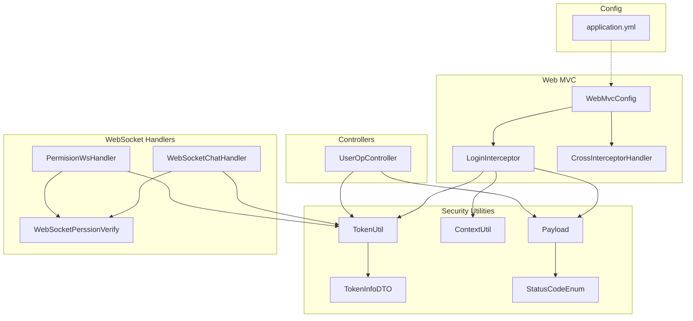
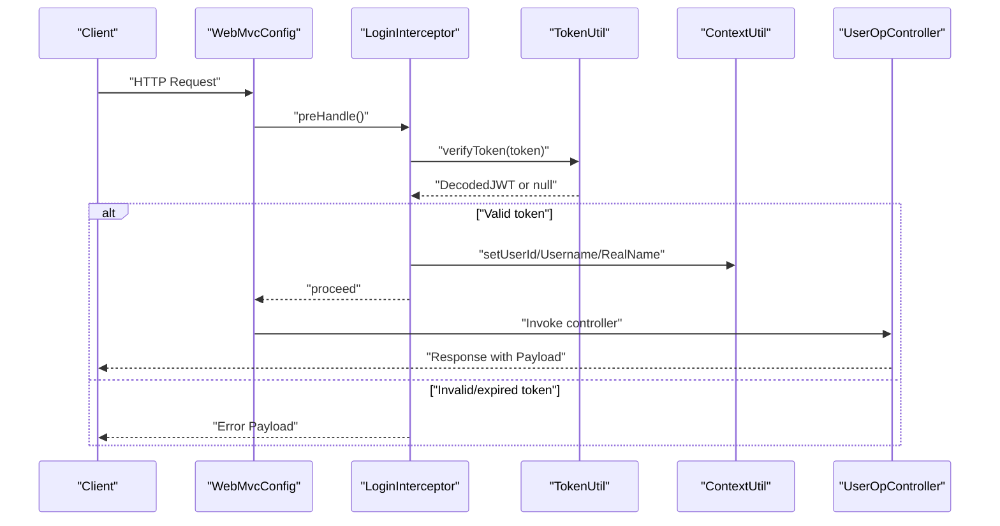
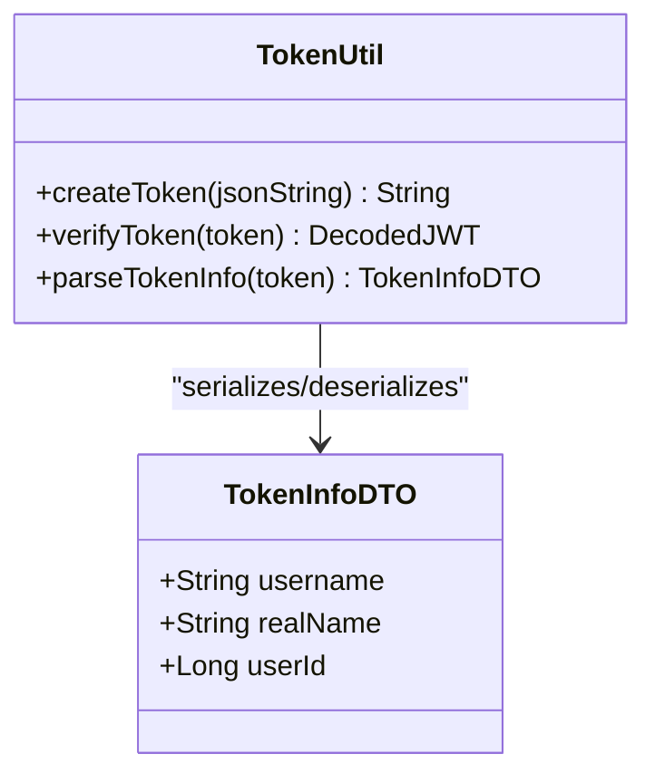
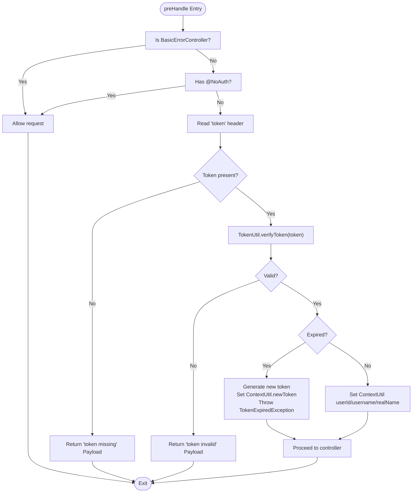
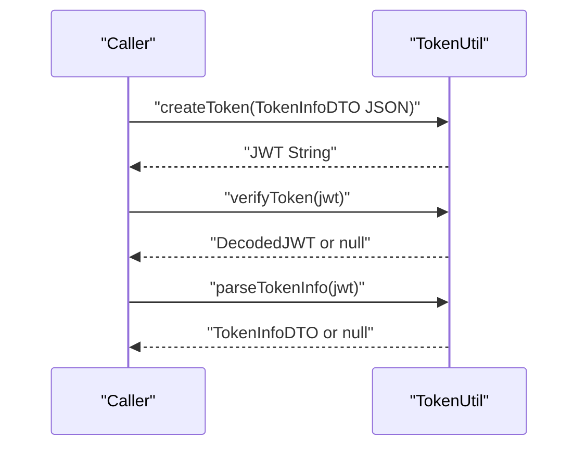
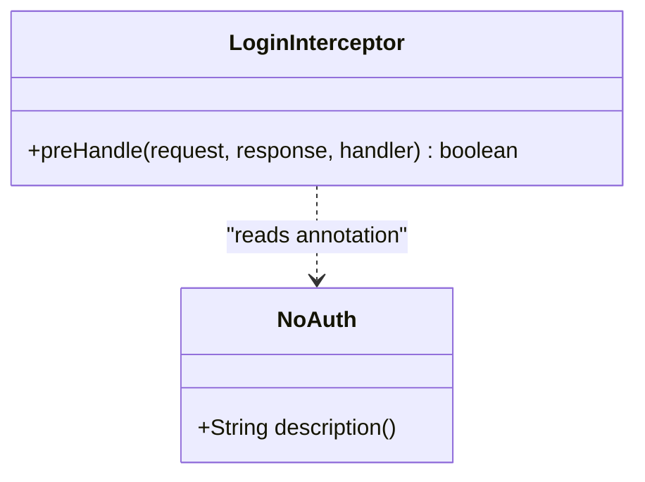
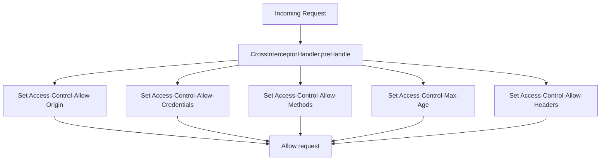
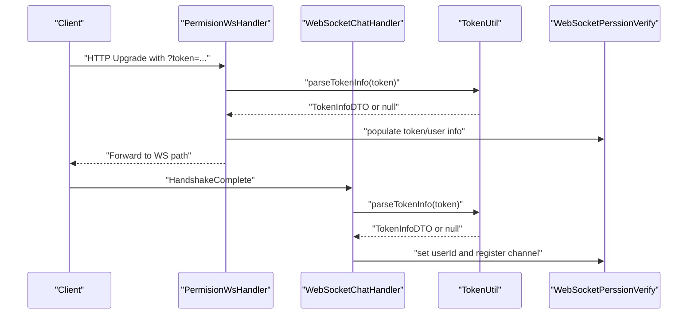
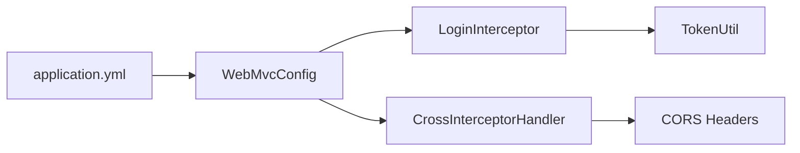
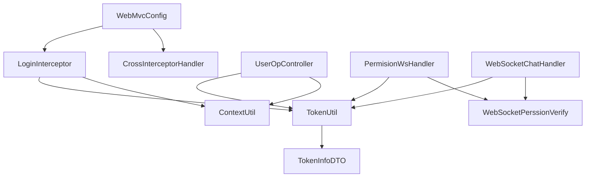

# Authentication and Security

<cite>
**Referenced Files in This Document**
- [NoAuth.java](file://src/main/java/com/hch/chat_simple/auth/NoAuth.java)
- [LoginInterceptor.java](file://src/main/java/com/hch/chat_simple/config/LoginInterceptor.java)
- [CrossInterceptorHandler.java](file://src/main/java/com/hch/chat_simple/config/CrossInterceptorHandler.java)
- [WebMvcConfig.java](file://src/main/java/com/hch/chat_simple/config/WebMvcConfig.java)
- [TokenUtil.java](file://src/main/java/com/hch/chat_simple/util/TokenUtil.java)
- [TokenInfoDTO.java](file://src/main/java/com/hch/chat_simple/pojo/dto/TokenInfoDTO.java)
- [ContextUtil.java](file://src/main/java/com/hch/chat_simple/util/ContextUtil.java)
- [Payload.java](file://src/main/java/com/hch/chat_simple/util/Payload.java)
- [StatusCodeEnum.java](file://src/main/java/com/hch/chat_simple/util/StatusCodeEnum.java)
- [UserOpController.java](file://src/main/java/com/hch/chat_simple/controller/UserOpController.java)
- [PermisionWsHandler.java](file://src/main/java/com/hch/chat_simple/handler/PermisionWsHandler.java)
- [WebSocketChatHandler.java](file://src/main/java/com/hch/chat_simple/handler/WebSocketChatHandler.java)
- [WebSocketPerssionVerify.java](file://src/main/java/com/hch/chat_simple/pojo/dto/WebSocketPerssionVerify.java)
- [application.yml](file://src/main/resources/application.yml)
</cite>

## Table of Contents
1. [Introduction](#introduction)
2. [Project Structure](#project-structure)
3. [Core Components](#core-components)
4. [Architecture Overview](#architecture-overview)
5. [Detailed Component Analysis](#detailed-component-analysis)
6. [Dependency Analysis](#dependency-analysis)
7. [Performance Considerations](#performance-considerations)
8. [Troubleshooting Guide](#troubleshooting-guide)
9. [Conclusion](#conclusion)
10. [Appendices](#appendices)

## Introduction
This document provides comprehensive authentication and security documentation for the Chat Simple application. It explains JWT token lifecycle (generation, validation, renewal), interceptor-based request authentication, token parsing utilities, endpoint bypass annotations, CORS configuration, and permission verification for WebSocket handlers. It also outlines security best practices for token storage, transmission, and validation, and highlights common vulnerabilities and mitigation strategies for real-time messaging applications.

## Project Structure
Security-related components are organized across configuration, utilities, controllers, and WebSocket handlers:
- Interceptors and CORS: configured via WebMvcConfig and CrossInterceptorHandler
- JWT utilities: TokenUtil and supporting DTOs
- Request authentication: LoginInterceptor
- Endpoint bypass: NoAuth annotation
- Controllers: UserOpController demonstrates login and protected endpoints
- WebSocket handlers: PermisionWsHandler and WebSocketChatHandler enforce permissions
- Global configuration: application.yml

**Diagram sources**
- [WebMvcConfig.java:1-28](file://src/main/java/com/hch/chat_simple/config/WebMvcConfig.java#L1-L28)
- [LoginInterceptor.java:1-109](file://src/main/java/com/hch/chat_simple/config/LoginInterceptor.java#L1-L109)
- [CrossInterceptorHandler.java:1-28](file://src/main/java/com/hch/chat_simple/config/CrossInterceptorHandler.java#L1-L28)
- [TokenUtil.java:1-71](file://src/main/java/com/hch/chat_simple/util/TokenUtil.java#L1-L71)
- [TokenInfoDTO.java:1-20](file://src/main/java/com/hch/chat_simple/pojo/dto/TokenInfoDTO.java#L1-L20)
- [ContextUtil.java:1-52](file://src/main/java/com/hch/chat_simple/util/ContextUtil.java#L1-L52)
- [Payload.java:1-30](file://src/main/java/com/hch/chat_simple/util/Payload.java#L1-L30)
- [StatusCodeEnum.java:1-22](file://src/main/java/com/hch/chat_simple/util/StatusCodeEnum.java#L1-L22)
- [UserOpController.java:1-114](file://src/main/java/com/hch/chat_simple/controller/UserOpController.java#L1-L114)
- [PermisionWsHandler.java:1-81](file://src/main/java/com/hch/chat_simple/handler/PermisionWsHandler.java#L1-L81)
- [WebSocketChatHandler.java:1-196](file://src/main/java/com/hch/chat_simple/handler/WebSocketChatHandler.java#L1-L196)
- [WebSocketPerssionVerify.java:1-22](file://src/main/java/com/hch/chat_simple/pojo/dto/WebSocketPerssionVerify.java#L1-L22)
- [application.yml:1-89](file://src/main/resources/application.yml#L1-L89)

**Section sources**
- [WebMvcConfig.java:1-28](file://src/main/java/com/hch/chat_simple/config/WebMvcConfig.java#L1-L28)
- [application.yml:1-89](file://src/main/resources/application.yml#L1-L89)

## Core Components
- JWT token utilities: TokenUtil encapsulates creation, verification, and payload extraction using HMAC signing.
- TokenInfoDTO: carries user identity embedded in the JWT subject.
- ContextUtil: thread-local holder for current request’s user context.
- LoginInterceptor: enforces authentication for protected endpoints, handles token expiration and renewal.
- NoAuth: annotation to bypass authentication on selected endpoints.
- CrossInterceptorHandler: sets CORS headers globally.
- WebSocket handlers: PermisionWsHandler extracts tokens from WS query parameters; WebSocketChatHandler verifies tokens during handshake and manages session membership.
- UserOpController: login endpoint generates JWT and protected endpoints consume it.

**Section sources**
- [TokenUtil.java:1-71](file://src/main/java/com/hch/chat_simple/util/TokenUtil.java#L1-L71)
- [TokenInfoDTO.java:1-20](file://src/main/java/com/hch/chat_simple/pojo/dto/TokenInfoDTO.java#L1-L20)
- [ContextUtil.java:1-52](file://src/main/java/com/hch/chat_simple/util/ContextUtil.java#L1-L52)
- [LoginInterceptor.java:1-109](file://src/main/java/com/hch/chat_simple/config/LoginInterceptor.java#L1-L109)
- [NoAuth.java:1-14](file://src/main/java/com/hch/chat_simple/auth/NoAuth.java#L1-L14)
- [CrossInterceptorHandler.java:1-28](file://src/main/java/com/hch/chat_simple/config/CrossInterceptorHandler.java#L1-L28)
- [PermisionWsHandler.java:1-81](file://src/main/java/com/hch/chat_simple/handler/PermisionWsHandler.java#L1-L81)
- [WebSocketChatHandler.java:1-196](file://src/main/java/com/hch/chat_simple/handler/WebSocketChatHandler.java#L1-L196)
- [UserOpController.java:1-114](file://src/main/java/com/hch/chat_simple/controller/UserOpController.java#L1-L114)

## Architecture Overview
The authentication pipeline integrates HTTP and WebSocket flows:
- HTTP requests pass through WebMvcConfig to register interceptors. LoginInterceptor validates JWT and populates ContextUtil. Protected endpoints read user context from ContextUtil. CrossInterceptorHandler applies CORS headers.
- WebSocket upgrade requests are intercepted by PermisionWsHandler to extract and validate the token from the query string. During the handshake completion, WebSocketChatHandler verifies the token again and registers the channel for messaging.

**Diagram sources**
- [WebMvcConfig.java:11-16](file://src/main/java/com/hch/chat_simple/config/WebMvcConfig.java#L11-L16)
- [LoginInterceptor.java:30-90](file://src/main/java/com/hch/chat_simple/config/LoginInterceptor.java#L30-L90)
- [TokenUtil.java:48-59](file://src/main/java/com/hch/chat_simple/util/TokenUtil.java#L48-L59)
- [ContextUtil.java:12-42](file://src/main/java/com/hch/chat_simple/util/ContextUtil.java#L12-L42)
- [UserOpController.java:44-66](file://src/main/java/com/hch/chat_simple/controller/UserOpController.java#L44-L66)

**Section sources**
- [WebMvcConfig.java:11-16](file://src/main/java/com/hch/chat_simple/config/WebMvcConfig.java#L11-L16)
- [LoginInterceptor.java:30-90](file://src/main/java/com/hch/chat_simple/config/LoginInterceptor.java#L30-L90)
- [TokenUtil.java:48-59](file://src/main/java/com/hch/chat_simple/util/TokenUtil.java#L48-L59)
- [ContextUtil.java:12-42](file://src/main/java/com/hch/chat_simple/util/ContextUtil.java#L12-L42)
- [UserOpController.java:44-66](file://src/main/java/com/hch/chat_simple/controller/UserOpController.java#L44-L66)

## Detailed Component Analysis

### JWT Token Implementation
- Creation: TokenUtil signs a JWT with HMAC using a shared key, issuer, expiration, and a subject containing serialized TokenInfoDTO.
- Verification: TokenUtil verifies signature, issuer, and expiration window; returns DecodedJWT or null.
- Parsing: TokenUtil parses the subject into TokenInfoDTO for downstream use.
- Expiration handling: LoginInterceptor detects expired tokens and triggers renewal by generating a new token and signaling via ContextUtil.

**Diagram sources**
- [TokenUtil.java:19-70](file://src/main/java/com/hch/chat_simple/util/TokenUtil.java#L19-L70)
- [TokenInfoDTO.java:14-19](file://src/main/java/com/hch/chat_simple/pojo/dto/TokenInfoDTO.java#L14-L19)

**Section sources**
- [TokenUtil.java:19-70](file://src/main/java/com/hch/chat_simple/util/TokenUtil.java#L19-L70)
- [TokenInfoDTO.java:14-19](file://src/main/java/com/hch/chat_simple/pojo/dto/TokenInfoDTO.java#L14-L19)

### LoginInterceptor: Request Authentication and Authorization Checking
- Skips interception for error controller and methods annotated with NoAuth.
- Extracts token from the "token" header, verifies it via TokenUtil.
- On valid token, sets user context in ContextUtil and proceeds.
- On expired token, constructs a new token and signals expiration to trigger renewal.
- On invalid token or missing token, responds with standardized error Payload.

**Diagram sources**
- [LoginInterceptor.java:30-90](file://src/main/java/com/hch/chat_simple/config/LoginInterceptor.java#L30-L90)
- [TokenUtil.java:48-59](file://src/main/java/com/hch/chat_simple/util/TokenUtil.java#L48-L59)
- [ContextUtil.java:12-42](file://src/main/java/com/hch/chat_simple/util/ContextUtil.java#L12-L42)
- [Payload.java:18-28](file://src/main/java/com/hch/chat_simple/util/Payload.java#L18-L28)
- [StatusCodeEnum.java:8-13](file://src/main/java/com/hch/chat_simple/util/StatusCodeEnum.java#L8-L13)

**Section sources**
- [LoginInterceptor.java:30-90](file://src/main/java/com/hch/chat_simple/config/LoginInterceptor.java#L30-L90)
- [TokenUtil.java:48-59](file://src/main/java/com/hch/chat_simple/util/TokenUtil.java#L48-L59)
- [ContextUtil.java:12-42](file://src/main/java/com/hch/chat_simple/util/ContextUtil.java#L12-L42)
- [Payload.java:18-28](file://src/main/java/com/hch/chat_simple/util/Payload.java#L18-L28)
- [StatusCodeEnum.java:8-13](file://src/main/java/com/hch/chat_simple/util/StatusCodeEnum.java#L8-L13)

### TokenUtil Utility Functions
- createToken: Builds JWT with issuer, expiration, and signed subject.
- verifyToken: Verifies signature and issuer; includes a grace period for expired tokens.
- parseTokenInfo: Extracts TokenInfoDTO from the verified subject.

**Diagram sources**
- [TokenUtil.java:23-69](file://src/main/java/com/hch/chat_simple/util/TokenUtil.java#L23-L69)

**Section sources**
- [TokenUtil.java:23-69](file://src/main/java/com/hch/chat_simple/util/TokenUtil.java#L23-L69)

### NoAuth Annotation for Bypassing Authentication
- Applied at method or type level to exclude endpoints from LoginInterceptor checks.
- Used on login and other public endpoints to allow unauthenticated access.

**Diagram sources**
- [NoAuth.java:8-13](file://src/main/java/com/hch/chat_simple/auth/NoAuth.java#L8-L13)
- [LoginInterceptor.java:39-43](file://src/main/java/com/hch/chat_simple/config/LoginInterceptor.java#L39-L43)

**Section sources**
- [NoAuth.java:8-13](file://src/main/java/com/hch/chat_simple/auth/NoAuth.java#L8-L13)
- [LoginInterceptor.java:39-43](file://src/main/java/com/hch/chat_simple/config/LoginInterceptor.java#L39-L43)

### CrossInterceptorHandler: CORS Configuration
- Sets Access-Control-Allow-Origin, Access-Control-Allow-Credentials, Access-Control-Allow-Methods, Access-Control-Max-Age, and Access-Control-Allow-Headers.
- Registered globally via WebMvcConfig to apply to all paths.

**Diagram sources**
- [CrossInterceptorHandler.java:10-25](file://src/main/java/com/hch/chat_simple/config/CrossInterceptorHandler.java#L10-L25)
- [WebMvcConfig.java:13](file://src/main/java/com/hch/chat_simple/config/WebMvcConfig.java#L13)

**Section sources**
- [CrossInterceptorHandler.java:10-25](file://src/main/java/com/hch/chat_simple/config/CrossInterceptorHandler.java#L10-L25)
- [WebMvcConfig.java:13](file://src/main/java/com/hch/chat_simple/config/WebMvcConfig.java#L13)

### WebSocket Permission Verification
- PermisionWsHandler: Extracts token from WS query string, parses TokenInfoDTO, and attaches permission context to the channel.
- WebSocketChatHandler: During handshake completion, re-verifies token, enriches permission context, and registers channels for messaging.

**Diagram sources**
- [PermisionWsHandler.java:32-66](file://src/main/java/com/hch/chat_simple/handler/PermisionWsHandler.java#L32-L66)
- [WebSocketChatHandler.java:118-163](file://src/main/java/com/hch/chat_simple/handler/WebSocketChatHandler.java#L118-L163)
- [TokenUtil.java:61-69](file://src/main/java/com/hch/chat_simple/util/TokenUtil.java#L61-L69)
- [WebSocketPerssionVerify.java:7-19](file://src/main/java/com/hch/chat_simple/pojo/dto/WebSocketPerssionVerify.java#L7-L19)

**Section sources**
- [PermisionWsHandler.java:32-66](file://src/main/java/com/hch/chat_simple/handler/PermisionWsHandler.java#L32-L66)
- [WebSocketChatHandler.java:118-163](file://src/main/java/com/hch/chat_simple/handler/WebSocketChatHandler.java#L118-L163)
- [TokenUtil.java:61-69](file://src/main/java/com/hch/chat_simple/util/TokenUtil.java#L61-L69)
- [WebSocketPerssionVerify.java:7-19](file://src/main/java/com/hch/chat_simple/pojo/dto/WebSocketPerssionVerify.java#L7-L19)

### Security Configurations in application.yml
- Interceptor registration: WebMvcConfig registers LoginInterceptor and CrossInterceptorHandler for all paths except specific public routes.
- CORS policy: CrossInterceptorHandler defines origin, credentials, methods, headers, and preflight cache.
- JWT settings: TokenUtil uses a fixed issuer and encryption key; expiration is set in minutes.
- Authentication filters: LoginInterceptor acts as the primary filter for HTTP endpoints.

**Diagram sources**
- [application.yml:1-89](file://src/main/resources/application.yml#L1-L89)
- [WebMvcConfig.java:11-16](file://src/main/java/com/hch/chat_simple/config/WebMvcConfig.java#L11-L16)
- [CrossInterceptorHandler.java:14-24](file://src/main/java/com/hch/chat_simple/config/CrossInterceptorHandler.java#L14-L24)
- [TokenUtil.java:19-30](file://src/main/java/com/hch/chat_simple/util/TokenUtil.java#L19-L30)

**Section sources**
- [application.yml:1-89](file://src/main/resources/application.yml#L1-L89)
- [WebMvcConfig.java:11-16](file://src/main/java/com/hch/chat_simple/config/WebMvcConfig.java#L11-L16)
- [CrossInterceptorHandler.java:14-24](file://src/main/java/com/hch/chat_simple/config/CrossInterceptorHandler.java#L14-L24)
- [TokenUtil.java:19-30](file://src/main/java/com/hch/chat_simple/util/TokenUtil.java#L19-L30)

## Dependency Analysis
- WebMvcConfig depends on LoginInterceptor and CrossInterceptorHandler to enforce security and CORS.
- LoginInterceptor depends on TokenUtil and ContextUtil to validate tokens and propagate user context.
- Controllers depend on TokenUtil for login and on ContextUtil for authorization.
- WebSocket handlers depend on TokenUtil and WebSocketPerssionVerify for permission checks.
- TokenUtil depends on TokenInfoDTO for payload serialization/deserialization.

**Diagram sources**
- [WebMvcConfig.java:11-16](file://src/main/java/com/hch/chat_simple/config/WebMvcConfig.java#L11-L16)
- [LoginInterceptor.java:18-20](file://src/main/java/com/hch/chat_simple/config/LoginInterceptor.java#L18-L20)
- [TokenUtil.java:8-13](file://src/main/java/com/hch/chat_simple/util/TokenUtil.java#L8-L13)
- [ContextUtil.java:3-10](file://src/main/java/com/hch/chat_simple/util/ContextUtil.java#L3-L10)
- [UserOpController.java:26](file://src/main/java/com/hch/chat_simple/controller/UserOpController.java#L26)
- [PermisionWsHandler.java:12](file://src/main/java/com/hch/chat_simple/handler/PermisionWsHandler.java#L12)
- [WebSocketChatHandler.java:26](file://src/main/java/com/hch/chat_simple/handler/WebSocketChatHandler.java#L26)
- [WebSocketPerssionVerify.java:7-19](file://src/main/java/com/hch/chat_simple/pojo/dto/WebSocketPerssionVerify.java#L7-L19)
- [TokenInfoDTO.java:14-19](file://src/main/java/com/hch/chat_simple/pojo/dto/TokenInfoDTO.java#L14-L19)

**Section sources**
- [WebMvcConfig.java:11-16](file://src/main/java/com/hch/chat_simple/config/WebMvcConfig.java#L11-L16)
- [LoginInterceptor.java:18-20](file://src/main/java/com/hch/chat_simple/config/LoginInterceptor.java#L18-L20)
- [TokenUtil.java:8-13](file://src/main/java/com/hch/chat_simple/util/TokenUtil.java#L8-L13)
- [ContextUtil.java:3-10](file://src/main/java/com/hch/chat_simple/util/ContextUtil.java#L3-L10)
- [UserOpController.java:26](file://src/main/java/com/hch/chat_simple/controller/UserOpController.java#L26)
- [PermisionWsHandler.java:12](file://src/main/java/com/hch/chat_simple/handler/PermisionWsHandler.java#L12)
- [WebSocketChatHandler.java:26](file://src/main/java/com/hch/chat_simple/handler/WebSocketChatHandler.java#L26)
- [WebSocketPerssionVerify.java:7-19](file://src/main/java/com/hch/chat_simple/pojo/dto/WebSocketPerssionVerify.java#L7-L19)
- [TokenInfoDTO.java:14-19](file://src/main/java/com/hch/chat_simple/pojo/dto/TokenInfoDTO.java#L14-L19)

## Performance Considerations
- Token verification cost: Each request performs a single HMAC verification; keep keys and issuer constants to minimize overhead.
- Context propagation: ThreadLocal usage avoids repeated parameter passing but requires cleanup in afterCompletion.
- CORS overhead: Header setting per request; ensure minimal number of exposed headers and methods.
- WebSocket scaling: ChannelGroup and user-channel mapping should be externalized (e.g., Redisson) for multi-instance deployments.

[No sources needed since this section provides general guidance]

## Troubleshooting Guide
Common issues and resolutions:
- Token validation failures: Ensure the "token" header is present and matches the issuer and key used by TokenUtil. Check StatusCodeEnum for error codes.
- Token expiration: LoginInterceptor generates a new token upon expiration; clients should handle the returned token and retry.
- CORS errors: Confirm CrossInterceptorHandler headers match the frontend origin and include credentials if needed.
- WebSocket permission denied: Verify token presence in query string and that PermisionWsHandler and WebSocketChatHandler successfully parse and attach user context.

**Section sources**
- [LoginInterceptor.java:74-82](file://src/main/java/com/hch/chat_simple/config/LoginInterceptor.java#L74-L82)
- [StatusCodeEnum.java:8-13](file://src/main/java/com/hch/chat_simple/util/StatusCodeEnum.java#L8-L13)
- [CrossInterceptorHandler.java:14-24](file://src/main/java/com/hch/chat_simple/config/CrossInterceptorHandler.java#L14-L24)
- [PermisionWsHandler.java:42-57](file://src/main/java/com/hch/chat_simple/handler/PermisionWsHandler.java#L42-L57)
- [WebSocketChatHandler.java:124-134](file://src/main/java/com/hch/chat_simple/handler/WebSocketChatHandler.java#L124-L134)

## Conclusion
The Chat Simple application implements a layered security model: HTTP requests are secured via LoginInterceptor and TokenUtil, while WebSocket sessions are validated through dedicated handlers. The NoAuth annotation enables selective bypass for public endpoints, and CrossInterceptorHandler centralizes CORS configuration. Adhering to the best practices below will further strengthen the system against common vulnerabilities.

## Appendices

### Security Best Practices for Token Storage, Transmission, and Validation
- Transport security: Use HTTPS/TLS to prevent token interception.
- Storage: Avoid storing tokens in localStorage; prefer httpOnly cookies when applicable, or secure in-memory stores.
- Validation: Enforce strict issuer and audience checks; validate expiration and clock skew.
- Rotation: Implement short-lived access tokens with a secure refresh mechanism; avoid long-lived tokens.
- Scope: Limit token scopes to least privilege; verify permissions per endpoint.
- Logging: Do not log raw tokens; mask or redact sensitive fields.

[No sources needed since this section provides general guidance]

### Secure API Usage Examples and Authentication Flow
- Login flow:
  - POST to the login endpoint with credentials.
  - Receive a signed JWT in the response.
  - Include the JWT in the "token" header for subsequent protected requests.
- Protected endpoint usage:
  - Send requests with the "token" header.
  - On expiration, expect a renewed token and retry the request.
- WebSocket usage:
  - Connect with a query parameter containing the token.
  - Upon successful handshake, the server attaches user context and registers the channel.

**Section sources**
- [UserOpController.java:44-66](file://src/main/java/com/hch/chat_simple/controller/UserOpController.java#L44-L66)
- [LoginInterceptor.java:44-82](file://src/main/java/com/hch/chat_simple/config/LoginInterceptor.java#L44-L82)
- [PermisionWsHandler.java:42-61](file://src/main/java/com/hch/chat_simple/handler/PermisionWsHandler.java#L42-L61)
- [WebSocketChatHandler.java:118-163](file://src/main/java/com/hch/chat_simple/handler/WebSocketChatHandler.java#L118-L163)

### Common Security Vulnerabilities and Mitigations for Real-Time Messaging
- CSRF: Use SameSite cookies and CSRF tokens for state-changing operations; restrict origins via CORS.
- XSS: Sanitize inputs and outputs; use Content-Security-Policy headers.
- Insecure WebSocket upgrades: Validate tokens and enforce per-message authorization.
- Token replay: Implement token binding (device, IP) and revocation lists.
- Denial of Service: Rate-limit token issuance and message rates; monitor idle connections.

[No sources needed since this section provides general guidance]