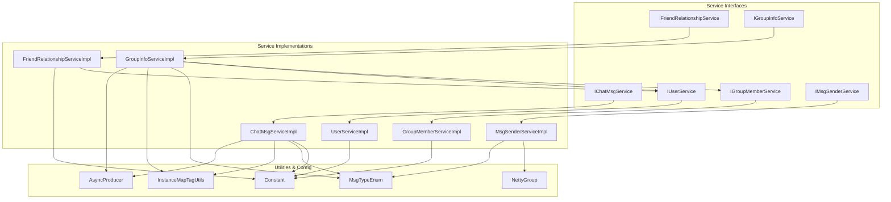
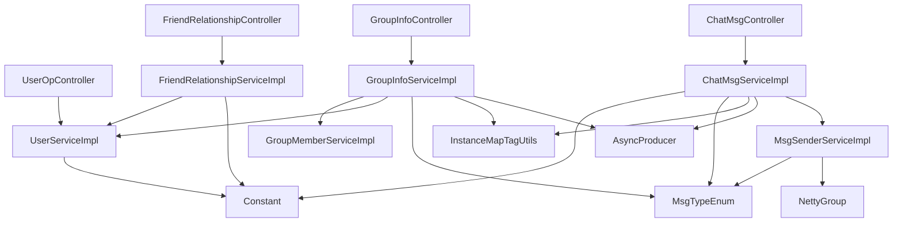
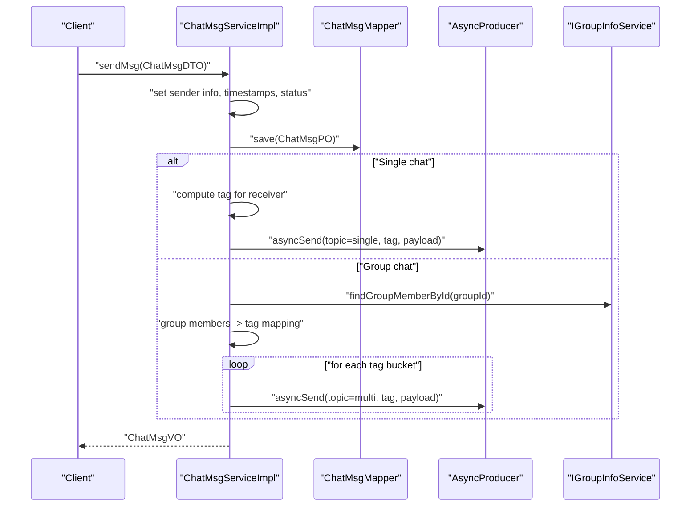
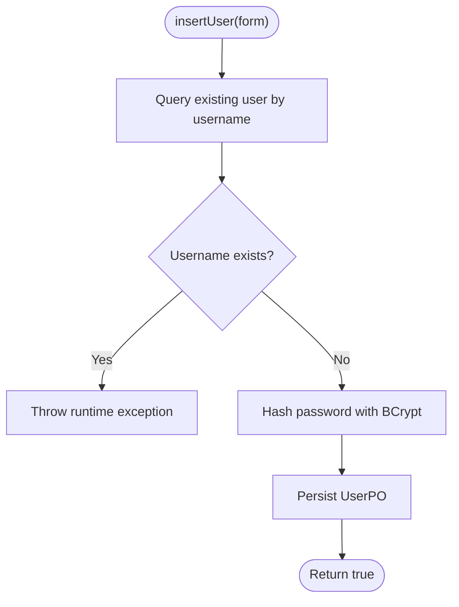
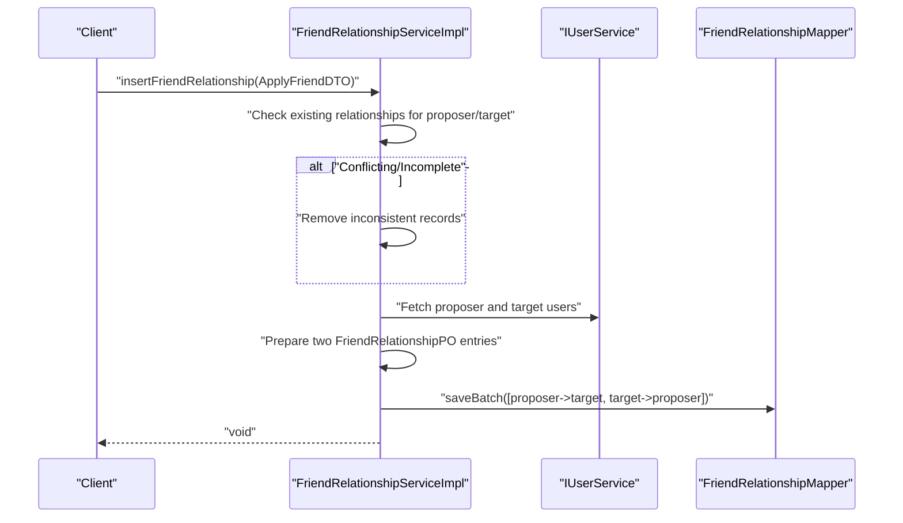
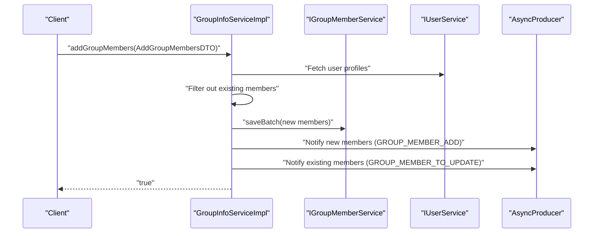
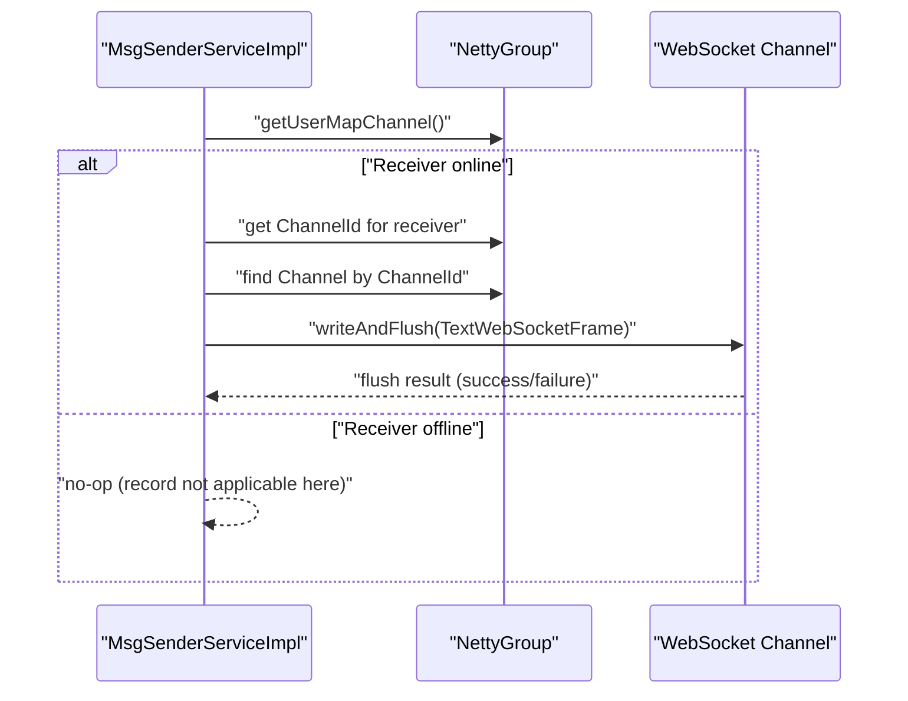
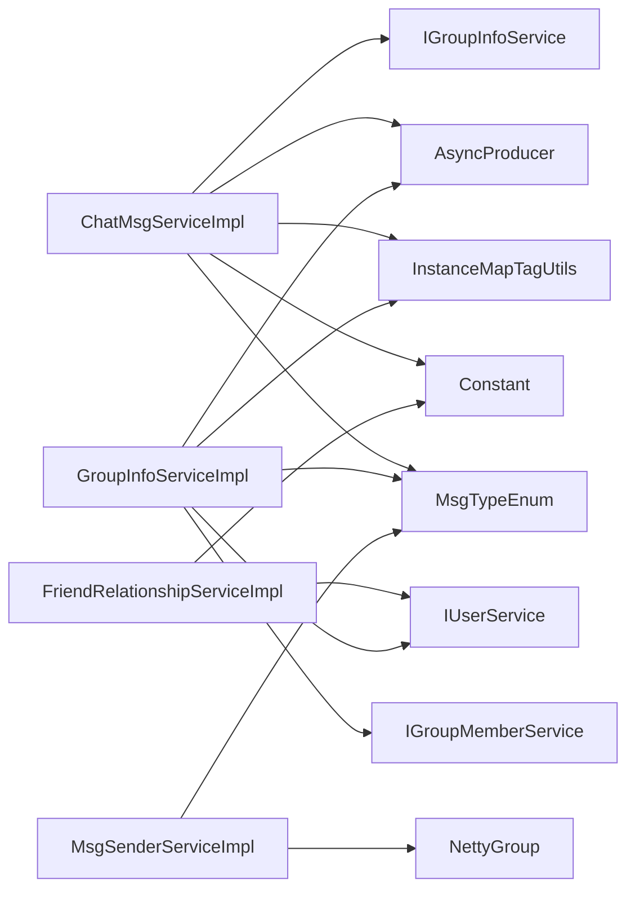

# Business Logic Layer

<cite>
**Referenced Files in This Document**
- [ChatMsgServiceImpl.java](file://src/main/java/com/hch/chat_simple/service/impl/ChatMsgServiceImpl.java)
- [IChatMsgService.java](file://src/main/java/com/hch/chat_simple/service/IChatMsgService.java)
- [UserServiceImpl.java](file://src/main/java/com/hch/chat_simple/service/impl/UserServiceImpl.java)
- [IUserService.java](file://src/main/java/com/hch/chat_simple/service/IUserService.java)
- [FriendRelationshipServiceImpl.java](file://src/main/java/com/hch/chat_simple/service/impl/FriendRelationshipServiceImpl.java)
- [IFriendRelationshipService.java](file://src/main/java/com/hch/chat_simple/service/IFriendRelationshipService.java)
- [GroupInfoServiceImpl.java](file://src/main/java/com/hch/chat_simple/service/impl/GroupInfoServiceImpl.java)
- [IGroupInfoService.java](file://src/main/java/com/hch/chat_simple/service/IGroupInfoService.java)
- [GroupMemberServiceImpl.java](file://src/main/java/com/hch/chat_simple/service/impl/GroupMemberServiceImpl.java)
- [IGroupMemberService.java](file://src/main/java/com/hch/chat_simple/service/IGroupMemberService.java)
- [MsgSenderServiceImpl.java](file://src/main/java/com/hch/chat_simple/service/impl/MsgSenderServiceImpl.java)
- [IMsgSenderService.java](file://src/main/java/com/hch/chat_simple/service/IMsgSenderService.java)
- [NettyGroup.java](file://src/main/java/com/hch/chat_simple/config/NettyGroup.java)
- [Constant.java](file://src/main/java/com/hch/chat_simple/util/Constant.java)
- [MsgTypeEnum.java](file://src/main/java/com/hch/chat_simple/enums/MsgTypeEnum.java)
- [AsyncProducer.java](file://src/main/java/com/hch/chat_simple/mq/AsyncProducer.java)
- [InstanceMapTagUtils.java](file://src/main/java/com/hch/chat_simple/util/InstanceMapTagUtils.java)
</cite>

## Table of Contents
1. [Introduction](#introduction)
2. [Project Structure](#project-structure)
3. [Core Components](#core-components)
4. [Architecture Overview](#architecture-overview)
5. [Detailed Component Analysis](#detailed-component-analysis)
6. [Dependency Analysis](#dependency-analysis)
7. [Performance Considerations](#performance-considerations)
8. [Troubleshooting Guide](#troubleshooting-guide)
9. [Conclusion](#conclusion)
10. [Appendices](#appendices)

## Introduction
This document explains the business logic layer of the chat system, focusing on service implementations and business rules. It covers:
- Chat message processing, validation, persistence, and real-time delivery via WebSocket and asynchronous messaging
- User registration, authentication, password security, and profile-related queries
- Friend relationship management, including request workflows and relationship validation
- Group creation, membership management, and group-specific business rules
- Dynamic member addition/removal and role management
- Message dispatch logic and delivery confirmation
It also documents service layer patterns, transaction management, error handling strategies, business rule validation, data consistency checks, and integration with external systems such as RocketMQ and Netty.

## Project Structure
The business logic resides primarily under the service package with supporting utilities, enums, and configuration:
- Service interfaces define contracts for domain capabilities
- Service implementations encapsulate business rules and orchestrate persistence and messaging
- Utilities provide constants, instance-tag mapping, and Netty channel management
- Enums define message types used across services
- Asynchronous producer integrates with RocketMQ for scalable message dispatch

**Diagram sources**
- [IChatMsgService.java:1-28](file://src/main/java/com/hch/chat_simple/service/IChatMsgService.java#L1-L28)
- [IUserService.java:1-28](file://src/main/java/com/hch/chat_simple/service/IUserService.java#L1-L28)
- [IFriendRelationshipService.java:1-26](file://src/main/java/com/hch/chat_simple/service/IFriendRelationshipService.java#L1-L26)
- [IGroupInfoService.java:1-31](file://src/main/java/com/hch/chat_simple/service/IGroupInfoService.java#L1-L31)
- [IGroupMemberService.java:1-21](file://src/main/java/com/hch/chat_simple/service/IGroupMemberService.java#L1-L21)
- [IMsgSenderService.java:1-11](file://src/main/java/com/hch/chat_simple/service/IMsgSenderService.java#L1-L11)
- [ChatMsgServiceImpl.java:1-184](file://src/main/java/com/hch/chat_simple/service/impl/ChatMsgServiceImpl.java#L1-L184)
- [UserServiceImpl.java:1-100](file://src/main/java/com/hch/chat_simple/service/impl/UserServiceImpl.java#L1-L100)
- [FriendRelationshipServiceImpl.java:1-112](file://src/main/java/com/hch/chat_simple/service/impl/FriendRelationshipServiceImpl.java#L1-L112)
- [GroupInfoServiceImpl.java:1-143](file://src/main/java/com/hch/chat_simple/service/impl/GroupInfoServiceImpl.java#L1-L143)
- [GroupMemberServiceImpl.java:1-21](file://src/main/java/com/hch/chat_simple/service/impl/GroupMemberServiceImpl.java#L1-L21)
- [MsgSenderServiceImpl.java:1-79](file://src/main/java/com/hch/chat_simple/service/impl/MsgSenderServiceImpl.java#L1-L79)
- [Constant.java:1-33](file://src/main/java/com/hch/chat_simple/util/Constant.java#L1-L33)
- [MsgTypeEnum.java:1-25](file://src/main/java/com/hch/chat_simple/enums/MsgTypeEnum.java#L1-L25)
- [NettyGroup.java:1-30](file://src/main/java/com/hch/chat_simple/config/NettyGroup.java#L1-L30)
- [InstanceMapTagUtils.java:1-55](file://src/main/java/com/hch/chat_simple/util/InstanceMapTagUtils.java#L1-L55)
- [AsyncProducer.java:1-63](file://src/main/java/com/hch/chat_simple/mq/AsyncProducer.java#L1-L63)

**Section sources**
- [IChatMsgService.java:1-28](file://src/main/java/com/hch/chat_simple/service/IChatMsgService.java#L1-L28)
- [IUserService.java:1-28](file://src/main/java/com/hch/chat_simple/service/IUserService.java#L1-L28)
- [IFriendRelationshipService.java:1-26](file://src/main/java/com/hch/chat_simple/service/IFriendRelationshipService.java#L1-L26)
- [IGroupInfoService.java:1-31](file://src/main/java/com/hch/chat_simple/service/IGroupInfoService.java#L1-L31)
- [IGroupMemberService.java:1-21](file://src/main/java/com/hch/chat_simple/service/IGroupMemberService.java#L1-L21)
- [IMsgSenderService.java:1-11](file://src/main/java/com/hch/chat_simple/service/IMsgSenderService.java#L1-L11)

## Core Components
This section summarizes the primary service components and their responsibilities.

- ChatMsgServiceImpl
  - Validates and persists chat messages
  - Determines chat type (single/group) and dispatches accordingly
  - Integrates with RocketMQ for asynchronous delivery and with Netty for real-time WebSocket delivery
  - Provides unread message retrieval and group-specific unread queries

- UserServiceImpl
  - User search with friend relation flagging
  - Secure user registration with password hashing
  - Username uniqueness validation

- FriendRelationshipServiceImpl
  - Lists friend relationships with flexible filtering
  - Transactional friend request approval workflow
  - Handles bidirectional friendship creation and conflict resolution

- GroupInfoServiceImpl
  - Creates groups and auto-enrolls the creator as a member
  - Manages group member additions with deduplication and notifications
  - Publishes membership change events via RocketMQ

- GroupMemberServiceImpl
  - Lightweight MyBatis-Plus service for group member persistence

- MsgSenderServiceImpl
  - Real-time message delivery over WebSocket using Netty
  - Supports single-user and broadcast-like group sending with permission checks

**Section sources**
- [ChatMsgServiceImpl.java:1-184](file://src/main/java/com/hch/chat_simple/service/impl/ChatMsgServiceImpl.java#L1-L184)
- [UserServiceImpl.java:1-100](file://src/main/java/com/hch/chat_simple/service/impl/UserServiceImpl.java#L1-L100)
- [FriendRelationshipServiceImpl.java:1-112](file://src/main/java/com/hch/chat_simple/service/impl/FriendRelationshipServiceImpl.java#L1-L112)
- [GroupInfoServiceImpl.java:1-143](file://src/main/java/com/hch/chat_simple/service/impl/GroupInfoServiceImpl.java#L1-L143)
- [GroupMemberServiceImpl.java:1-21](file://src/main/java/com/hch/chat_simple/service/impl/GroupMemberServiceImpl.java#L1-L21)
- [MsgSenderServiceImpl.java:1-79](file://src/main/java/com/hch/chat_simple/service/impl/MsgSenderServiceImpl.java#L1-L79)

## Architecture Overview
The business logic layer follows a layered pattern:
- Controllers delegate to services
- Services encapsulate business rules and coordinate persistence and messaging
- Utilities provide cross-cutting concerns (constants, enums, instance tagging)
- External integrations include RocketMQ for asynchronous messaging and Netty for real-time WebSocket communication

**Diagram sources**
- [ChatMsgServiceImpl.java:1-184](file://src/main/java/com/hch/chat_simple/service/impl/ChatMsgServiceImpl.java#L1-L184)
- [UserServiceImpl.java:1-100](file://src/main/java/com/hch/chat_simple/service/impl/UserServiceImpl.java#L1-L100)
- [FriendRelationshipServiceImpl.java:1-112](file://src/main/java/com/hch/chat_simple/service/impl/FriendRelationshipServiceImpl.java#L1-L112)
- [GroupInfoServiceImpl.java:1-143](file://src/main/java/com/hch/chat_simple/service/impl/GroupInfoServiceImpl.java#L1-L143)
- [GroupMemberServiceImpl.java:1-21](file://src/main/java/com/hch/chat_simple/service/impl/GroupMemberServiceImpl.java#L1-L21)
- [MsgSenderServiceImpl.java:1-79](file://src/main/java/com/hch/chat_simple/service/impl/MsgSenderServiceImpl.java#L1-L79)
- [Constant.java:1-33](file://src/main/java/com/hch/chat_simple/util/Constant.java#L1-L33)
- [MsgTypeEnum.java:1-25](file://src/main/java/com/hch/chat_simple/enums/MsgTypeEnum.java#L1-L25)
- [InstanceMapTagUtils.java:1-55](file://src/main/java/com/hch/chat_simple/util/InstanceMapTagUtils.java#L1-L55)
- [NettyGroup.java:1-30](file://src/main/java/com/hch/chat_simple/config/NettyGroup.java#L1-L30)
- [AsyncProducer.java:1-63](file://src/main/java/com/hch/chat_simple/mq/AsyncProducer.java#L1-L63)

## Detailed Component Analysis

### Chat Message Service
Responsibilities:
- Persist chat messages with metadata and initial status
- Validate chat type and route to appropriate delivery mechanism
- Single chat: tag-based routing to target instance via RocketMQ
- Group chat: broadcast to all instances with per-instance tagging
- Retrieve unread single-chat messages and mark them as delivered
- Query group chat unread messages across multiple groups

Key business rules:
- Status transitions: initial failure, then asynchronous success update
- Timezone normalization for consistent timestamps
- Deduplication of group member lists during broadcast preparation
- Tag-based sharding for horizontal scalability

**Diagram sources**
- [ChatMsgServiceImpl.java:98-144](file://src/main/java/com/hch/chat_simple/service/impl/ChatMsgServiceImpl.java#L98-L144)
- [AsyncProducer.java:40-59](file://src/main/java/com/hch/chat_simple/mq/AsyncProducer.java#L40-L59)
- [IGroupInfoService.java:25-27](file://src/main/java/com/hch/chat_simple/service/IGroupInfoService.java#L25-L27)

Validation and error handling:
- Returns null for invalid inputs (e.g., missing recipient in single chat)
- Uses constant values for status and chat types
- Leverages MyBatis-Plus wrappers for safe queries

Persistence and consistency:
- Saves message before publishing to ensure eventual consistency
- Batch updates for unread message status after retrieval

Integration points:
- RocketMQ topics configured via application properties
- Tag mapping utility for instance distribution

**Section sources**
- [ChatMsgServiceImpl.java:70-181](file://src/main/java/com/hch/chat_simple/service/impl/ChatMsgServiceImpl.java#L70-L181)
- [IChatMsgService.java:20-27](file://src/main/java/com/hch/chat_simple/service/IChatMsgService.java#L20-L27)
- [Constant.java:8-25](file://src/main/java/com/hch/chat_simple/util/Constant.java#L8-L25)
- [MsgTypeEnum.java:6-15](file://src/main/java/com/hch/chat_simple/enums/MsgTypeEnum.java#L6-L15)
- [InstanceMapTagUtils.java:32-47](file://src/main/java/com/hch/chat_simple/util/InstanceMapTagUtils.java#L32-L47)
- [AsyncProducer.java:40-59](file://src/main/java/com/hch/chat_simple/mq/AsyncProducer.java#L40-L59)

### User Service
Responsibilities:
- Search users by partial username with limit
- Flag whether a found user is a friend of the current user
- Register new users with password hashing and uniqueness check

Security and validation:
- Passwords are hashed using BCrypt before persistence
- Username uniqueness enforced via database query prior to save

**Diagram sources**
- [UserServiceImpl.java:82-97](file://src/main/java/com/hch/chat_simple/service/impl/UserServiceImpl.java#L82-L97)

**Section sources**
- [UserServiceImpl.java:43-97](file://src/main/java/com/hch/chat_simple/service/impl/UserServiceImpl.java#L43-L97)
- [IUserService.java:19-27](file://src/main/java/com/hch/chat_simple/service/IUserService.java#L19-L27)

### Friend Relationship Service
Responsibilities:
- List friend relationships with optional filters by name or ID
- Approve friend requests with bidirectional relationship creation
- Resolve conflicting or incomplete relationships

Transaction management:
- Method annotated with transactional semantics to ensure atomicity of dual inserts

**Diagram sources**
- [FriendRelationshipServiceImpl.java:58-108](file://src/main/java/com/hch/chat_simple/service/impl/FriendRelationshipServiceImpl.java#L58-L108)
- [IFriendRelationshipService.java:20-25](file://src/main/java/com/hch/chat_simple/service/IFriendRelationshipService.java#L20-L25)

**Section sources**
- [FriendRelationshipServiceImpl.java:46-108](file://src/main/java/com/hch/chat_simple/service/impl/FriendRelationshipServiceImpl.java#L46-L108)
- [IFriendRelationshipService.java:20-25](file://src/main/java/com/hch/chat_simple/service/IFriendRelationshipService.java#L20-L25)

### Group Info Service
Responsibilities:
- Create a new group and enroll the creator as a member
- Retrieve active and all members by group ID
- Add multiple members to a group with deduplication and notifications

Notifications:
- Sends composition events to new members and existing members
- Uses message types for member add/update actions

**Diagram sources**
- [GroupInfoServiceImpl.java:102-141](file://src/main/java/com/hch/chat_simple/service/impl/GroupInfoServiceImpl.java#L102-L141)
- [IGroupInfoService.java:29-30](file://src/main/java/com/hch/chat_simple/service/IGroupInfoService.java#L29-L30)
- [MsgTypeEnum.java:13-14](file://src/main/java/com/hch/chat_simple/enums/MsgTypeEnum.java#L13-L14)
- [AsyncProducer.java:40-59](file://src/main/java/com/hch/chat_simple/mq/AsyncProducer.java#L40-L59)

**Section sources**
- [GroupInfoServiceImpl.java:61-141](file://src/main/java/com/hch/chat_simple/service/impl/GroupInfoServiceImpl.java#L61-L141)
- [IGroupInfoService.java:21-30](file://src/main/java/com/hch/chat_simple/service/IGroupInfoService.java#L21-L30)

### Group Member Service
Responsibilities:
- Provide persistence operations for group members
- Lightweight MyBatis-Plus service with no additional business logic

**Section sources**
- [GroupMemberServiceImpl.java:17-20](file://src/main/java/com/hch/chat_simple/service/impl/GroupMemberServiceImpl.java#L17-L20)
- [IGroupMemberService.java:18-20](file://src/main/java/com/hch/chat_simple/service/IGroupMemberService.java#L18-L20)

### Message Sender Service
Responsibilities:
- Deliver messages to connected WebSocket clients
- Single-user delivery using user-to-channel mapping
- Group-like broadcast filtered to group members excluding the sender
- Permission check ensures only group members can send to a group

**Diagram sources**
- [MsgSenderServiceImpl.java:34-55](file://src/main/java/com/hch/chat_simple/service/impl/MsgSenderServiceImpl.java#L34-L55)
- [NettyGroup.java:21-26](file://src/main/java/com/hch/chat_simple/config/NettyGroup.java#L21-L26)

**Section sources**
- [MsgSenderServiceImpl.java:31-77](file://src/main/java/com/hch/chat_simple/service/impl/MsgSenderServiceImpl.java#L31-L77)
- [IMsgSenderService.java:5-10](file://src/main/java/com/hch/chat_simple/service/IMsgSenderService.java#L5-L10)
- [NettyGroup.java:11-29](file://src/main/java/com/hch/chat_simple/config/NettyGroup.java#L11-L29)

## Dependency Analysis
Service-layer dependencies and coupling:
- ChatMsgServiceImpl depends on:
  - IGroupInfoService for group member discovery
  - AsyncProducer for asynchronous delivery
  - InstanceMapTagUtils for tag-based routing
  - Constant and MsgTypeEnum for status and type constants
- FriendRelationshipServiceImpl depends on:
  - IUserService for user lookup
  - Constant for status and group constants
- GroupInfoServiceImpl depends on:
  - IGroupMemberService and IUserService for membership and user data
  - AsyncProducer and InstanceMapTagUtils for notifications
  - MsgTypeEnum for composition event types
- MsgSenderServiceImpl depends on:
  - NettyGroup for channel management
  - MsgTypeEnum for message categorization

**Diagram sources**
- [ChatMsgServiceImpl.java:64-70](file://src/main/java/com/hch/chat_simple/service/impl/ChatMsgServiceImpl.java#L64-L70)
- [FriendRelationshipServiceImpl.java:42-43](file://src/main/java/com/hch/chat_simple/service/impl/FriendRelationshipServiceImpl.java#L42-L43)
- [GroupInfoServiceImpl.java:47-54](file://src/main/java/com/hch/chat_simple/service/impl/GroupInfoServiceImpl.java#L47-L54)
- [MsgSenderServiceImpl.java:27-28](file://src/main/java/com/hch/chat_simple/service/impl/MsgSenderServiceImpl.java#L27-L28)

**Section sources**
- [ChatMsgServiceImpl.java:64-70](file://src/main/java/com/hch/chat_simple/service/impl/ChatMsgServiceImpl.java#L64-L70)
- [FriendRelationshipServiceImpl.java:42-43](file://src/main/java/com/hch/chat_simple/service/impl/FriendRelationshipServiceImpl.java#L42-L43)
- [GroupInfoServiceImpl.java:47-54](file://src/main/java/com/hch/chat_simple/service/impl/GroupInfoServiceImpl.java#L47-L54)
- [MsgSenderServiceImpl.java:27-28](file://src/main/java/com/hch/chat_simple/service/impl/MsgSenderServiceImpl.java#L27-L28)

## Performance Considerations
- Tag-based sharding: InstanceMapTagUtils distributes users/messages across instances to scale horizontally
- Asynchronous messaging: RocketMQ decouples message production from consumption for throughput
- Batch operations: Batch updates for unread status and batch saves for group members reduce round-trips
- Query limits: User search applies a LIMIT to constrain result size
- Netty channel reuse: Maintains a global channel group and user-to-channel map for efficient delivery

[No sources needed since this section provides general guidance]

## Troubleshooting Guide
Common issues and resolutions:
- Message delivery failures
  - Verify RocketMQ producer configuration and topic names
  - Check tag computation and instance distribution
  - Confirm consumer groups are correctly configured
- WebSocket delivery failures
  - Ensure user is present in NettyGroup’s user-to-channel map
  - Validate channel existence before write-and-flush
- Friend relationship conflicts
  - Review transaction boundaries around dual inserts
  - Confirm cleanup of inconsistent relationships
- Group member duplication
  - Validate deduplication logic against existing members
  - Confirm notification delivery to new and existing members

**Section sources**
- [AsyncProducer.java:40-59](file://src/main/java/com/hch/chat_simple/mq/AsyncProducer.java#L40-L59)
- [NettyGroup.java:21-26](file://src/main/java/com/hch/chat_simple/config/NettyGroup.java#L21-L26)
- [FriendRelationshipServiceImpl.java:65-72](file://src/main/java/com/hch/chat_simple/service/impl/FriendRelationshipServiceImpl.java#L65-L72)
- [GroupInfoServiceImpl.java:112-122](file://src/main/java/com/hch/chat_simple/service/impl/GroupInfoServiceImpl.java#L112-L122)

## Conclusion
The business logic layer cleanly separates domain concerns into focused services:
- ChatMsgServiceImpl orchestrates message lifecycle, persistence, and delivery
- UserServiceImpl enforces secure registration and user search
- FriendRelationshipServiceImpl manages approval workflows with transactional integrity
- GroupInfoServiceImpl coordinates group creation and membership changes with robust notifications
- GroupMemberServiceImpl provides straightforward persistence support
- MsgSenderServiceImpl enables real-time delivery via Netty channels

The design leverages constants, enums, and utilities to maintain consistency and scalability while integrating with RocketMQ and Netty for asynchronous and real-time capabilities.

[No sources needed since this section summarizes without analyzing specific files]

## Appendices

### Service Method Usage Examples
- Chat message send
  - Call ChatMsgServiceImpl.sendMsg with a populated DTO; observe returned VO and asynchronous delivery via RocketMQ
  - Reference: [ChatMsgServiceImpl.java:98-144](file://src/main/java/com/hch/chat_simple/service/impl/ChatMsgServiceImpl.java#L98-L144)
- User registration
  - Call UserServiceImpl.insertUser with AddUserForm; password is hashed automatically
  - Reference: [UserServiceImpl.java:82-97](file://src/main/java/com/hch/chat_simple/service/impl/UserServiceImpl.java#L82-L97)
- Friend approval
  - Call FriendRelationshipServiceImpl.insertFriendRelationship with ApplyFriendDTO; creates bidirectional relationships atomically
  - Reference: [FriendRelationshipServiceImpl.java:58-108](file://src/main/java/com/hch/chat_simple/service/impl/FriendRelationshipServiceImpl.java#L58-L108)
- Group creation and member add
  - Create group via GroupInfoServiceImpl.addGroupChat; add members via addGroupMembers with deduplication and notifications
  - Reference: [GroupInfoServiceImpl.java:61-80](file://src/main/java/com/hch/chat_simple/service/impl/GroupInfoServiceImpl.java#L61-L80), [GroupInfoServiceImpl.java:102-141](file://src/main/java/com/hch/chat_simple/service/impl/GroupInfoServiceImpl.java#L102-L141)
- Real-time delivery
  - Use MsgSenderServiceImpl.sendMsg for single-user delivery; ensure user is connected and mapped in NettyGroup
  - Reference: [MsgSenderServiceImpl.java:34-55](file://src/main/java/com/hch/chat_simple/service/impl/MsgSenderServiceImpl.java#L34-L55), [NettyGroup.java:21-26](file://src/main/java/com/hch/chat_simple/config/NettyGroup.java#L21-L26)

### Business Rule Validation Checklist
- Message persistence before publication to guarantee eventual consistency
- Status transitions for single-chat delivery tracking
- Bidirectional friend relationship creation and conflict resolution
- Group member deduplication and notification broadcasting
- WebSocket permission checks for group sends

[No sources needed since this section provides general guidance]