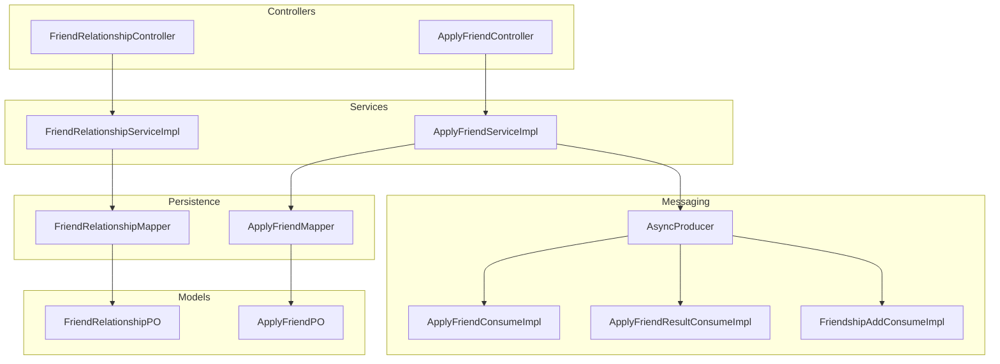
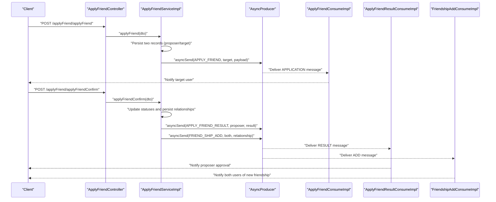
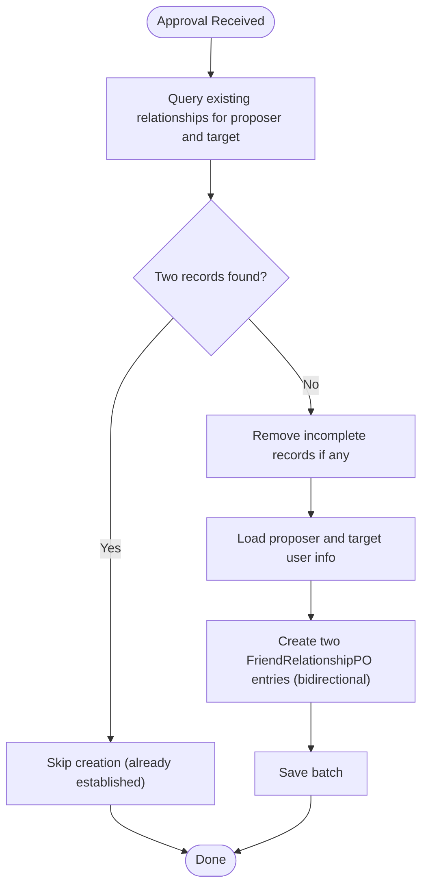
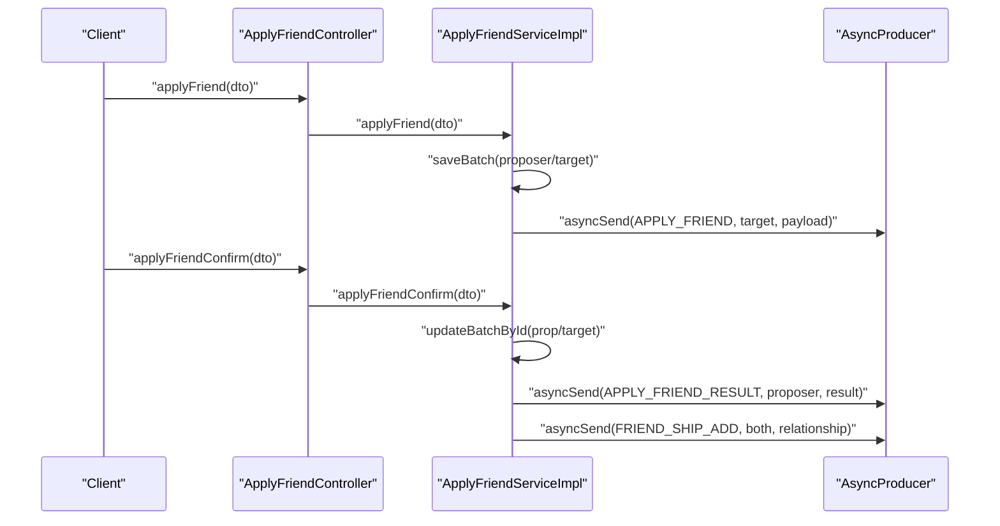
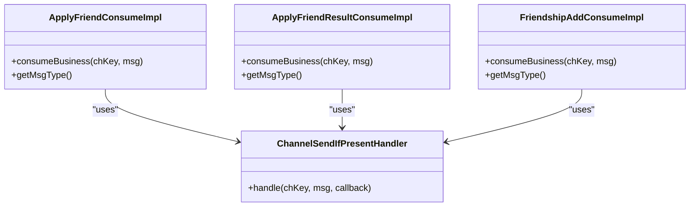
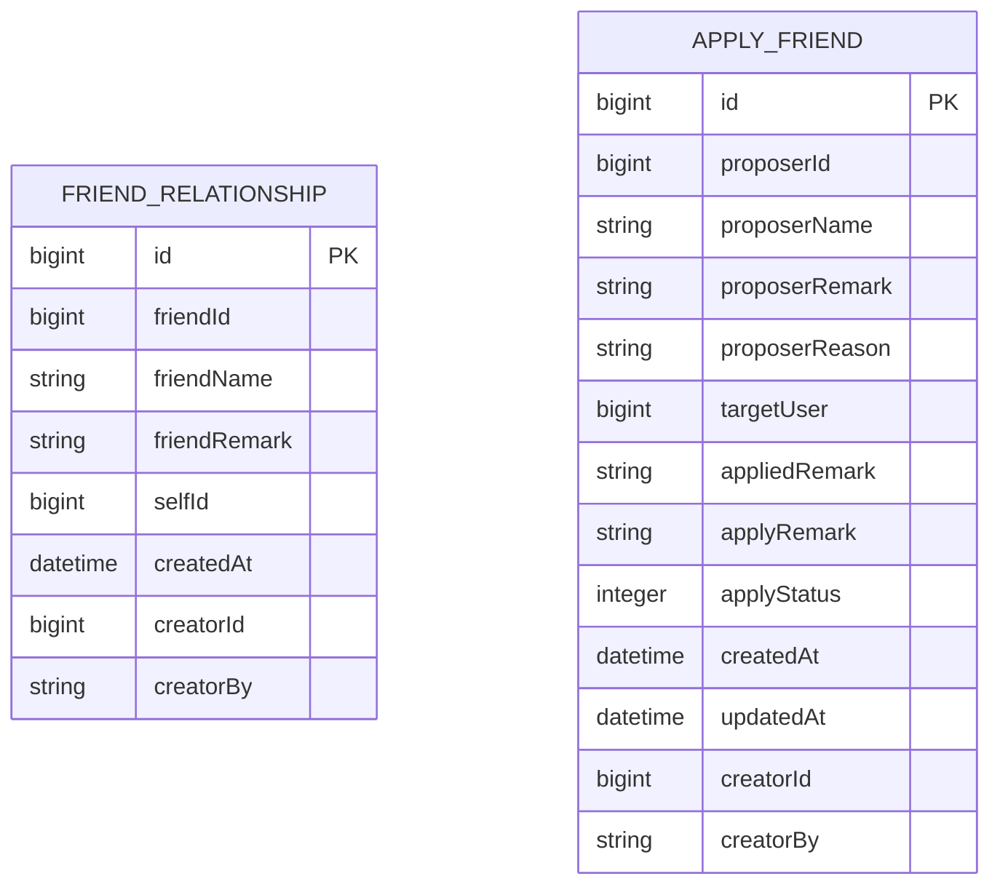
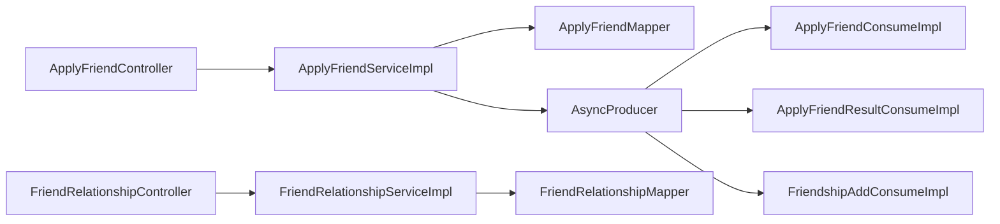

# Friendship Management Service

<cite>
**Referenced Files in This Document**
- [FriendRelationshipServiceImpl.java](file://src/main/java/com/hch/chat_simple/service/impl/FriendRelationshipServiceImpl.java)
- [IFriendRelationshipService.java](file://src/main/java/com/hch/chat_simple/service/IFriendRelationshipService.java)
- [FriendRelationshipController.java](file://src/main/java/com/hch/chat_simple/controller/FriendRelationshipController.java)
- [FriendRelationshipMapper.java](file://src/main/java/com/hch/chat_simple/mapper/FriendRelationshipMapper.java)
- [FriendRelationshipPO.java](file://src/main/java/com/hch/chat_simple/pojo/po/FriendRelationshipPO.java)
- [FriendRelationshipQuery.java](file://src/main/java/com/hch/chat_simple/pojo/query/FriendRelationshipQuery.java)
- [FriendRelationshipVO.java](file://src/main/java/com/hch/chat_simple/pojo/vo/FriendRelationshipVO.java)
- [ApplyFriendServiceImpl.java](file://src/main/java/com/hch/chat_simple/service/impl/ApplyFriendServiceImpl.java)
- [IApplyFriendService.java](file://src/main/java/com/hch/chat_simple/service/IApplyFriendService.java)
- [ApplyFriendController.java](file://src/main/java/com/hch/chat_simple/controller/ApplyFriendController.java)
- [ApplyFriendMapper.java](file://src/main/java/com/hch/chat_simple/mapper/ApplyFriendMapper.java)
- [ApplyFriendDTO.java](file://src/main/java/com/hch/chat_simple/pojo/dto/ApplyFriendDTO.java)
- [ApplyFriendVO.java](file://src/main/java/com/hch/chat_simple/pojo/vo/ApplyFriendVO.java)
- [ApplyResultInfoVO.java](file://src/main/java/com/hch/chat_simple/pojo/vo/ApplyResultInfoVO.java)
- [ApplyStatusEnum.java](file://src/main/java/com/hch/chat_simple/enums/ApplyStatusEnum.java)
- [AsyncProducer.java](file://src/main/java/com/hch/chat_simple/mq/AsyncProducer.java)
- [ApplyFriendConsumeImpl.java](file://src/main/java/com/hch/chat_simple/service/impl/ApplyFriendConsumeImpl.java)
- [ApplyFriendResultConsumeImpl.java](file://src/main/java/com/hch/chat_simple/service/impl/ApplyFriendResultConsumeImpl.java)
- [FriendshipAddConsumeImpl.java](file://src/main/java/com/hch/chat_simple/service/impl/FriendshipAddConsumeImpl.java)
</cite>

## Table of Contents
1. [Introduction](#introduction)
2. [Project Structure](#project-structure)
3. [Core Components](#core-components)
4. [Architecture Overview](#architecture-overview)
5. [Detailed Component Analysis](#detailed-component-analysis)
6. [Dependency Analysis](#dependency-analysis)
7. [Performance Considerations](#performance-considerations)
8. [Troubleshooting Guide](#troubleshooting-guide)
9. [Conclusion](#conclusion)
10. [Appendices](#appendices)

## Introduction
This document describes the friendship management service implementation, focusing on the complete lifecycle of friend requests from submission to establishment, including validation, asynchronous processing via message queues, notifications, and relationship persistence. It also covers friend list retrieval, relationship status checks, and the integration points with consumers for real-time delivery of results and updates.

## Project Structure
The friendship subsystem is organized around:
- Controllers exposing endpoints for applying, confirming, and listing friend requests, and for retrieving friend lists
- Services implementing business logic for applying, confirming, and establishing relationships
- Data transfer objects and value objects for request payloads and responses
- Persistence models and MyBatis mapper interfaces
- Asynchronous messaging producer and consumer implementations for real-time notifications

**Diagram sources**
- [FriendRelationshipController.java:31-41](file://src/main/java/com/hch/chat_simple/controller/FriendRelationshipController.java#L31-L41)
- [ApplyFriendController.java:31-51](file://src/main/java/com/hch/chat_simple/controller/ApplyFriendController.java#L31-L51)
- [FriendRelationshipServiceImpl.java:40-111](file://src/main/java/com/hch/chat_simple/service/impl/FriendRelationshipServiceImpl.java#L40-L111)
- [ApplyFriendServiceImpl.java:46-225](file://src/main/java/com/hch/chat_simple/service/impl/ApplyFriendServiceImpl.java#L46-L225)
- [AsyncProducer.java:17-62](file://src/main/java/com/hch/chat_simple/mq/AsyncProducer.java#L17-L62)
- [ApplyFriendConsumeImpl.java:15-31](file://src/main/java/com/hch/chat_simple/service/impl/ApplyFriendConsumeImpl.java#L15-L31)
- [ApplyFriendResultConsumeImpl.java:22-44](file://src/main/java/com/hch/chat_simple/service/impl/ApplyFriendResultConsumeImpl.java#L22-L44)
- [FriendshipAddConsumeImpl.java:20-40](file://src/main/java/com/hch/chat_simple/service/impl/FriendshipAddConsumeImpl.java#L20-L40)
- [FriendRelationshipMapper.java:17-20](file://src/main/java/com/hch/chat_simple/mapper/FriendRelationshipMapper.java#L17-L20)
- [ApplyFriendMapper.java:16-19](file://src/main/java/com/hch/chat_simple/mapper/ApplyFriendMapper.java#L16-L19)
- [FriendRelationshipPO.java:25-44](file://src/main/java/com/hch/chat_simple/pojo/po/FriendRelationshipPO.java#L25-L44)
- [ApplyFriendPO.java](file://src/main/java/com/hch/chat_simple/pojo/po/ApplyFriendPO.java)

**Section sources**
- [FriendRelationshipController.java:31-41](file://src/main/java/com/hch/chat_simple/controller/FriendRelationshipController.java#L31-L41)
- [ApplyFriendController.java:31-51](file://src/main/java/com/hch/chat_simple/controller/ApplyFriendController.java#L31-L51)

## Core Components
- FriendRelationshipController: Exposes endpoints for retrieving friend lists and initiating friend applications.
- FriendRelationshipServiceImpl: Implements friend list retrieval and establishes bidirectional relationships upon approval.
- ApplyFriendController: Exposes endpoints for applying, confirming, and listing friend requests.
- ApplyFriendServiceImpl: Handles request submission, approval workflows, and asynchronous notifications.
- AsyncProducer: Sends messages to RocketMQ topics for asynchronous processing.
- Consumer implementations: Handle friend application, result, and friendship add notifications.

**Section sources**
- [FriendRelationshipController.java:31-41](file://src/main/java/com/hch/chat_simple/controller/FriendRelationshipController.java#L31-L41)
- [FriendRelationshipServiceImpl.java:40-111](file://src/main/java/com/hch/chat_simple/service/impl/FriendRelationshipServiceImpl.java#L40-L111)
- [ApplyFriendController.java:31-51](file://src/main/java/com/hch/chat_simple/controller/ApplyFriendController.java#L31-L51)
- [ApplyFriendServiceImpl.java:46-225](file://src/main/java/com/hch/chat_simple/service/impl/ApplyFriendServiceImpl.java#L46-L225)
- [AsyncProducer.java:17-62](file://src/main/java/com/hch/chat_simple/mq/AsyncProducer.java#L17-L62)

## Architecture Overview
The friendship lifecycle spans request submission, approval, and relationship establishment, with asynchronous messaging ensuring decoupled, reliable delivery of notifications to involved parties.

**Diagram sources**
- [ApplyFriendController.java:41-51](file://src/main/java/com/hch/chat_simple/controller/ApplyFriendController.java#L41-L51)
- [ApplyFriendServiceImpl.java:58-89](file://src/main/java/com/hch/chat_simple/service/impl/ApplyFriendServiceImpl.java#L58-L89)
- [ApplyFriendConsumeImpl.java:22-24](file://src/main/java/com/hch/chat_simple/service/impl/ApplyFriendConsumeImpl.java#L22-L24)
- [ApplyFriendResultConsumeImpl.java:30-36](file://src/main/java/com/hch/chat_simple/service/impl/ApplyFriendResultConsumeImpl.java#L30-L36)
- [FriendshipAddConsumeImpl.java:27-33](file://src/main/java/com/hch/chat_simple/service/impl/FriendshipAddConsumeImpl.java#L27-L33)
- [AsyncProducer.java:40-59](file://src/main/java/com/hch/chat_simple/mq/AsyncProducer.java#L40-L59)

## Detailed Component Analysis

### Friend Relationship Management
- Retrieval: Filters friend relationships for the current user by name or ID based on search criteria.
- Establishment: On approval, inserts bidirectional entries for both parties, ensuring no duplicate or conflicting relationships exist.

**Diagram sources**
- [FriendRelationshipServiceImpl.java:58-108](file://src/main/java/com/hch/chat_simple/service/impl/FriendRelationshipServiceImpl.java#L58-L108)

**Section sources**
- [FriendRelationshipServiceImpl.java:46-108](file://src/main/java/com/hch/chat_simple/service/impl/FriendRelationshipServiceImpl.java#L46-L108)
- [FriendRelationshipMapper.java:17-20](file://src/main/java/com/hch/chat_simple/mapper/FriendRelationshipMapper.java#L17-L20)
- [FriendRelationshipPO.java:25-44](file://src/main/java/com/hch/chat_simple/pojo/po/FriendRelationshipPO.java#L25-L44)
- [FriendRelationshipQuery.java:8-18](file://src/main/java/com/hch/chat_simple/pojo/query/FriendRelationshipQuery.java#L8-L18)
- [FriendRelationshipVO.java:16-52](file://src/main/java/com/hch/chat_simple/pojo/vo/FriendRelationshipVO.java#L16-L52)

### Friend Request Submission and Approval Workflow
- Submission: Persists two records (one for proposer, one for target) with initial status and timestamps; publishes an application message to the composition topic.
- Approval: Updates statuses for both records, optionally creates bidirectional relationships, and notifies both parties with dedicated messages.

**Diagram sources**
- [ApplyFriendController.java:41-51](file://src/main/java/com/hch/chat_simple/controller/ApplyFriendController.java#L41-L51)
- [ApplyFriendServiceImpl.java:58-174](file://src/main/java/com/hch/chat_simple/service/impl/ApplyFriendServiceImpl.java#L58-L174)
- [AsyncProducer.java:40-59](file://src/main/java/com/hch/chat_simple/mq/AsyncProducer.java#L40-L59)

**Section sources**
- [ApplyFriendServiceImpl.java:58-174](file://src/main/java/com/hch/chat_simple/service/impl/ApplyFriendServiceImpl.java#L58-L174)
- [ApplyFriendDTO.java:11-41](file://src/main/java/com/hch/chat_simple/pojo/dto/ApplyFriendDTO.java#L11-L41)
- [ApplyFriendVO.java:10-50](file://src/main/java/com/hch/chat_simple/pojo/vo/ApplyFriendVO.java#L10-L50)
- [ApplyResultInfoVO.java:8-27](file://src/main/java/com/hch/chat_simple/pojo/vo/ApplyResultInfoVO.java#L8-L27)
- [ApplyStatusEnum.java:6-29](file://src/main/java/com/hch/chat_simple/enums/ApplyStatusEnum.java#L6-L29)

### Message Queue Consumers and Notifications
- Application consumer: Receives application messages and routes them to the target user channel.
- Result consumer: Parses approval results and notifies the proposer.
- Friendship add consumer: Notifies both users when a friendship is established.

**Diagram sources**
- [ApplyFriendConsumeImpl.java:15-31](file://src/main/java/com/hch/chat_simple/service/impl/ApplyFriendConsumeImpl.java#L15-L31)
- [ApplyFriendResultConsumeImpl.java:22-44](file://src/main/java/com/hch/chat_simple/service/impl/ApplyFriendResultConsumeImpl.java#L22-L44)
- [FriendshipAddConsumeImpl.java:20-40](file://src/main/java/com/hch/chat_simple/service/impl/FriendshipAddConsumeImpl.java#L20-L40)

**Section sources**
- [ApplyFriendConsumeImpl.java:22-24](file://src/main/java/com/hch/chat_simple/service/impl/ApplyFriendConsumeImpl.java#L22-L24)
- [ApplyFriendResultConsumeImpl.java:30-36](file://src/main/java/com/hch/chat_simple/service/impl/ApplyFriendResultConsumeImpl.java#L30-L36)
- [FriendshipAddConsumeImpl.java:27-33](file://src/main/java/com/hch/chat_simple/service/impl/FriendshipAddConsumeImpl.java#L27-L33)

### Data Models and Queries
- FriendRelationshipPO: Stores individual friendship entries with identifiers, names, remarks, and audit fields.
- FriendRelationshipQuery: Supports filtering by name or ID for friend list retrieval.
- ApplyFriendPO: Stores application records with proposer/target metadata, remarks, and status.

**Diagram sources**
- [FriendRelationshipPO.java:25-44](file://src/main/java/com/hch/chat_simple/pojo/po/FriendRelationshipPO.java#L25-L44)
- [ApplyFriendPO.java](file://src/main/java/com/hch/chat_simple/pojo/po/ApplyFriendPO.java)

**Section sources**
- [FriendRelationshipPO.java:25-44](file://src/main/java/com/hch/chat_simple/pojo/po/FriendRelationshipPO.java#L25-L44)
- [FriendRelationshipQuery.java:8-18](file://src/main/java/com/hch/chat_simple/pojo/query/FriendRelationshipQuery.java#L8-L18)
- [ApplyFriendMapper.java:16-19](file://src/main/java/com/hch/chat_simple/mapper/ApplyFriendMapper.java#L16-L19)

## Dependency Analysis
- Controllers depend on services for business operations.
- Services depend on mappers for persistence and on AsyncProducer for messaging.
- Consumers depend on ChannelSendIfPresentHandler for delivering messages to connected clients.

**Diagram sources**
- [ApplyFriendController.java:31-51](file://src/main/java/com/hch/chat_simple/controller/ApplyFriendController.java#L31-L51)
- [FriendRelationshipController.java:31-41](file://src/main/java/com/hch/chat_simple/controller/FriendRelationshipController.java#L31-L41)
- [ApplyFriendServiceImpl.java:46-225](file://src/main/java/com/hch/chat_simple/service/impl/ApplyFriendServiceImpl.java#L46-L225)
- [FriendRelationshipServiceImpl.java:40-111](file://src/main/java/com/hch/chat_simple/service/impl/FriendRelationshipServiceImpl.java#L40-L111)
- [ApplyFriendMapper.java:16-19](file://src/main/java/com/hch/chat_simple/mapper/ApplyFriendMapper.java#L16-L19)
- [FriendRelationshipMapper.java:17-20](file://src/main/java/com/hch/chat_simple/mapper/FriendRelationshipMapper.java#L17-L20)
- [AsyncProducer.java:17-62](file://src/main/java/com/hch/chat_simple/mq/AsyncProducer.java#L17-L62)
- [ApplyFriendConsumeImpl.java:15-31](file://src/main/java/com/hch/chat_simple/service/impl/ApplyFriendConsumeImpl.java#L15-L31)
- [ApplyFriendResultConsumeImpl.java:22-44](file://src/main/java/com/hch/chat_simple/service/impl/ApplyFriendResultConsumeImpl.java#L22-L44)
- [FriendshipAddConsumeImpl.java:20-40](file://src/main/java/com/hch/chat_simple/service/impl/FriendshipAddConsumeImpl.java#L20-L40)

**Section sources**
- [ApplyFriendServiceImpl.java:46-225](file://src/main/java/com/hch/chat_simple/service/impl/ApplyFriendServiceImpl.java#L46-L225)
- [FriendRelationshipServiceImpl.java:40-111](file://src/main/java/com/hch/chat_simple/service/impl/FriendRelationshipServiceImpl.java#L40-L111)

## Performance Considerations
- Batch operations: Relationship creation uses batch saves to reduce database round-trips.
- Asynchronous messaging: Offloads notification delivery to RocketMQ, improving request latency.
- Conditional queries: Uses MyBatis-Plus wrappers to filter friend lists efficiently.
- Timestamp-based incremental sync: Apply list supports incremental retrieval using updatedAt to minimize payload size.

[No sources needed since this section provides general guidance]

## Troubleshooting Guide
Common issues and resolutions:
- Duplicate or conflicting relationships: The service removes incomplete records before inserting new ones to avoid duplicates.
- Missing users during approval: Throws a business exception if proposer or target user is not found.
- Asynchronous delivery failures: Producer logs exceptions during send; consumers handle message parsing and routing errors.

**Section sources**
- [FriendRelationshipServiceImpl.java:65-85](file://src/main/java/com/hch/chat_simple/service/impl/FriendRelationshipServiceImpl.java#L65-L85)
- [ApplyFriendServiceImpl.java:156-173](file://src/main/java/com/hch/chat_simple/service/impl/ApplyFriendServiceImpl.java#L156-L173)
- [AsyncProducer.java:44-58](file://src/main/java/com/hch/chat_simple/mq/AsyncProducer.java#L44-L58)

## Conclusion
The friendship management service provides a robust, asynchronous pipeline for friend requests and relationships. It ensures data integrity through careful validation and deduplication, leverages message queues for scalable notifications, and exposes clean APIs for client interactions. The design supports future enhancements such as privacy controls and advanced relationship filters.

[No sources needed since this section summarizes without analyzing specific files]

## Appendices

### API Endpoints Overview
- Friend list retrieval: POST /friendship/friendList
- Friend application: POST /applyFriend/applyFriend
- Application confirmation: POST /applyFriend/applyFriendConfirm
- Application records: POST /applyFriend/applyRecord

**Section sources**
- [FriendRelationshipController.java:37-41](file://src/main/java/com/hch/chat_simple/controller/FriendRelationshipController.java#L37-L41)
- [ApplyFriendController.java:35-51](file://src/main/java/com/hch/chat_simple/controller/ApplyFriendController.java#L35-L51)

### Example Workflows
- Submitting a friend request:
  - Client sends application DTO to /applyFriend/applyFriend
  - Backend persists records and publishes application message
  - Target user receives notification via consumer
- Approving a friend request:
  - Client confirms with approval DTO to /applyFriend/applyFriendConfirm
  - Backend updates statuses, creates bidirectional relationships, and notifies both parties
- Retrieving friend list:
  - Client posts a query DTO to /friendship/friendList with searchType/name/id

**Section sources**
- [ApplyFriendServiceImpl.java:58-89](file://src/main/java/com/hch/chat_simple/service/impl/ApplyFriendServiceImpl.java#L58-L89)
- [FriendRelationshipServiceImpl.java:46-55](file://src/main/java/com/hch/chat_simple/service/impl/FriendRelationshipServiceImpl.java#L46-L55)
- [ApplyFriendController.java:41-51](file://src/main/java/com/hch/chat_simple/controller/ApplyFriendController.java#L41-L51)