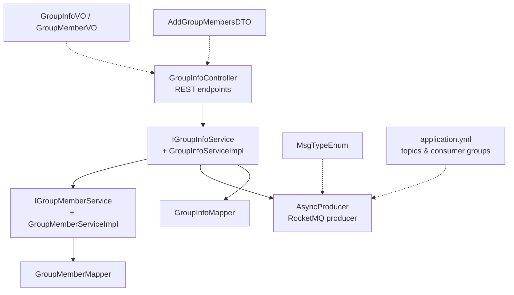
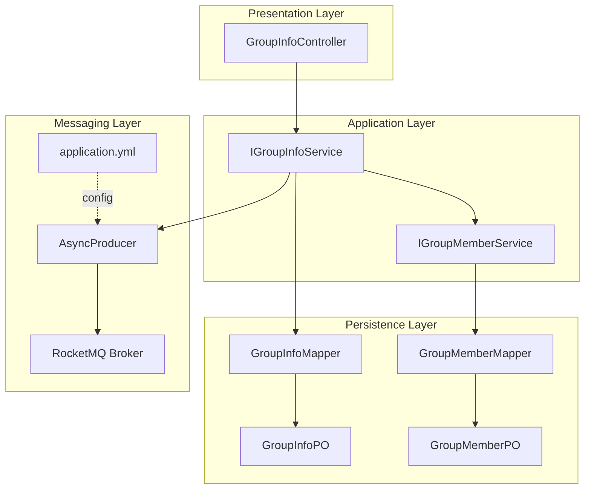
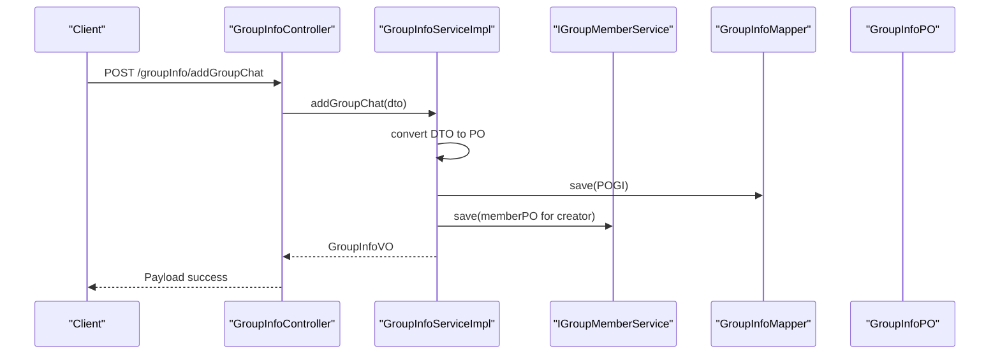
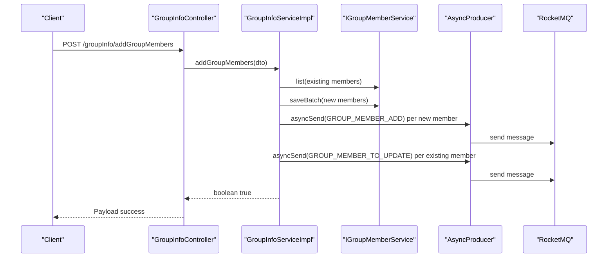
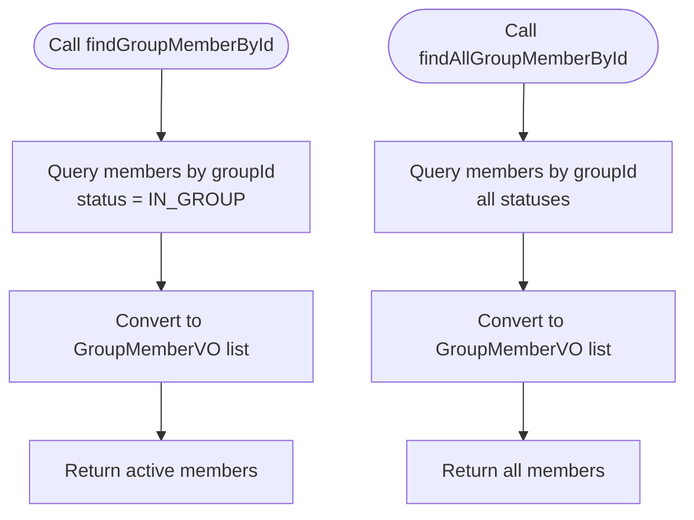
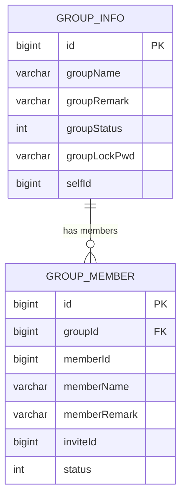
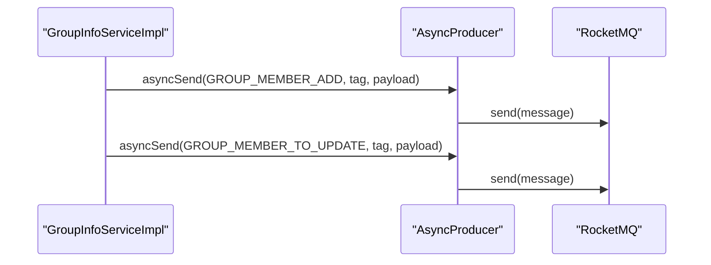
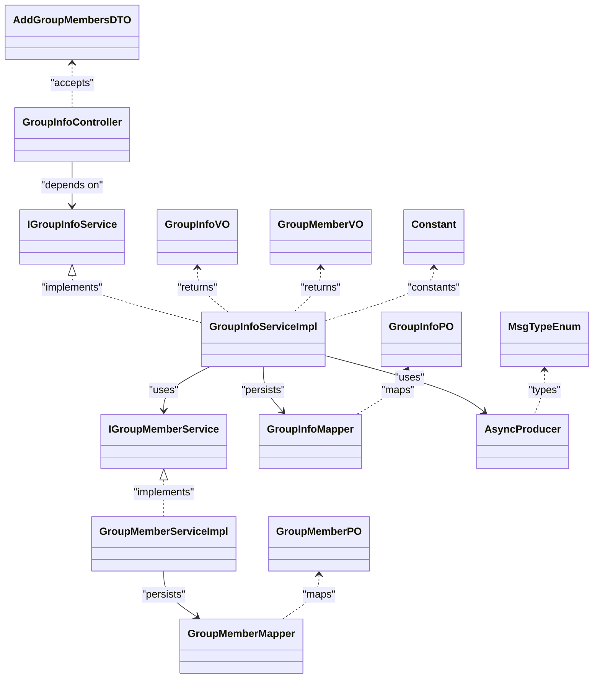

# Group Management Service

<cite>
**Referenced Files in This Document**
- [GroupInfoServiceImpl.java](file://src/main/java/com/hch/chat_simple/service/impl/GroupInfoServiceImpl.java)
- [GroupMemberServiceImpl.java](file://src/main/java/com/hch/chat_simple/service/impl/GroupMemberServiceImpl.java)
- [IGroupInfoService.java](file://src/main/java/com/hch/chat_simple/service/IGroupInfoService.java)
- [IGroupMemberService.java](file://src/main/java/com/hch/chat_simple/service/IGroupMemberService.java)
- [GroupInfoController.java](file://src/main/java/com/hch/chat_simple/controller/GroupInfoController.java)
- [GroupInfoMapper.java](file://src/main/java/com/hch/chat_simple/mapper/GroupInfoMapper.java)
- [GroupMemberMapper.java](file://src/main/java/com/hch/chat_simple/mapper/GroupMemberMapper.java)
- [GroupInfoPO.java](file://src/main/java/com/hch/chat_simple/pojo/po/GroupInfoPO.java)
- [GroupMemberPO.java](file://src/main/java/com/hch/chat_simple/pojo/po/GroupMemberPO.java)
- [GroupInfoVO.java](file://src/main/java/com/hch/chat_simple/pojo/vo/GroupInfoVO.java)
- [GroupMemberVO.java](file://src/main/java/com/hch/chat_simple/pojo/vo/GroupMemberVO.java)
- [AddGroupMembersDTO.java](file://src/main/java/com/hch/chat_simple/pojo/dto/AddGroupMembersDTO.java)
- [MsgTypeEnum.java](file://src/main/java/com/hch/chat_simple/enums/MsgTypeEnum.java)
- [AsyncProducer.java](file://src/main/java/com/hch/chat_simple/mq/AsyncProducer.java)
- [application.yml](file://src/main/resources/application.yml)
- [Constant.java](file://src/main/java/com/hch/chat_simple/util/Constant.java)
</cite>

## Table of Contents
1. [Introduction](#introduction)
2. [Project Structure](#project-structure)
3. [Core Components](#core-components)
4. [Architecture Overview](#architecture-overview)
5. [Detailed Component Analysis](#detailed-component-analysis)
6. [Dependency Analysis](#dependency-analysis)
7. [Performance Considerations](#performance-considerations)
8. [Troubleshooting Guide](#troubleshooting-guide)
9. [Conclusion](#conclusion)

## Introduction
This document explains the group management service implementation, focusing on:
- Group creation, configuration, and management via GroupInfoServiceImpl
- Dynamic member management via GroupMemberServiceImpl
- Asynchronous processing for member updates and role changes
- Business rules, permissions, and access controls
- Search and discovery features with privacy considerations
- Messaging patterns, broadcast mechanisms, and member notifications
- Examples of workflows for group creation, member management, and administration
- Security measures, verification processes, and conflict resolution

## Project Structure
The group management feature spans controllers, services, persistence, DTOs/VOs, enums, and messaging infrastructure. The primary modules involved are:
- Controllers: GroupInfoController exposes endpoints for group operations
- Services: IGroupInfoService and IGroupMemberService define contracts; implementations handle business logic
- Persistence: MyBatis-Plus mappers and POs map to database tables
- Messaging: AsyncProducer integrates with RocketMQ for asynchronous notifications
- Configuration: application.yml defines MQ topics and consumer groups

**Diagram sources**
- [GroupInfoController.java:30-68](file://src/main/java/com/hch/chat_simple/controller/GroupInfoController.java#L30-L68)
- [IGroupInfoService.java:21-31](file://src/main/java/com/hch/chat_simple/service/IGroupInfoService.java#L21-L31)
- [GroupInfoServiceImpl.java:44-143](file://src/main/java/com/hch/chat_simple/service/impl/GroupInfoServiceImpl.java#L44-L143)
- [IGroupMemberService.java:18-21](file://src/main/java/com/hch/chat_simple/service/IGroupMemberService.java#L18-L21)
- [GroupMemberServiceImpl.java:17-21](file://src/main/java/com/hch/chat_simple/service/impl/GroupMemberServiceImpl.java#L17-L21)
- [AsyncProducer.java:17-63](file://src/main/java/com/hch/chat_simple/mq/AsyncProducer.java#L17-L63)
- [GroupInfoMapper.java:17-21](file://src/main/java/com/hch/chat_simple/mapper/GroupInfoMapper.java#L17-L21)
- [GroupMemberMapper.java:17-21](file://src/main/java/com/hch/chat_simple/mapper/GroupMemberMapper.java#L17-L21)
- [application.yml:39-52](file://src/main/resources/application.yml#L39-L52)

**Section sources**
- [GroupInfoController.java:30-68](file://src/main/java/com/hch/chat_simple/controller/GroupInfoController.java#L30-L68)
- [IGroupInfoService.java:21-31](file://src/main/java/com/hch/chat_simple/service/IGroupInfoService.java#L21-L31)
- [IGroupMemberService.java:18-21](file://src/main/java/com/hch/chat_simple/service/IGroupMemberService.java#L18-L21)
- [application.yml:39-52](file://src/main/resources/application.yml#L39-L52)

## Core Components
- GroupInfoController: Exposes endpoints for creating groups, listing members, and adding members
- IGroupInfoService: Defines contract for group operations
- GroupInfoServiceImpl: Implements group creation, member retrieval, and batch member addition with asynchronous notifications
- IGroupMemberService: Defines contract for member persistence
- GroupMemberServiceImpl: Extends MyBatis-Plus service for member operations
- GroupInfoMapper / GroupMemberMapper: MyBatis-Plus mappers for persistence
- PO/VO/DTO: Data transfer and presentation models
- AsyncProducer: Asynchronous messaging via RocketMQ
- MsgTypeEnum: Enumerates message types including group member events
- application.yml: MQ topic and consumer group configuration

**Section sources**
- [GroupInfoController.java:30-68](file://src/main/java/com/hch/chat_simple/controller/GroupInfoController.java#L30-L68)
- [IGroupInfoService.java:21-31](file://src/main/java/com/hch/chat_simple/service/IGroupInfoService.java#L21-L31)
- [GroupInfoServiceImpl.java:44-143](file://src/main/java/com/hch/chat_simple/service/impl/GroupInfoServiceImpl.java#L44-L143)
- [IGroupMemberService.java:18-21](file://src/main/java/com/hch/chat_simple/service/IGroupMemberService.java#L18-L21)
- [GroupMemberServiceImpl.java:17-21](file://src/main/java/com/hch/chat_simple/service/impl/GroupMemberServiceImpl.java#L17-L21)
- [GroupInfoMapper.java:17-21](file://src/main/java/com/hch/chat_simple/mapper/GroupInfoMapper.java#L17-L21)
- [GroupMemberMapper.java:17-21](file://src/main/java/com/hch/chat_simple/mapper/GroupMemberMapper.java#L17-L21)
- [AsyncProducer.java:17-63](file://src/main/java/com/hch/chat_simple/mq/AsyncProducer.java#L17-L63)
- [MsgTypeEnum.java:6-25](file://src/main/java/com/hch/chat_simple/enums/MsgTypeEnum.java#L6-L25)
- [application.yml:39-52](file://src/main/resources/application.yml#L39-L52)

## Architecture Overview
The group management service follows a layered architecture:
- Presentation: REST endpoints in GroupInfoController
- Application: IGroupInfoService and IGroupMemberService orchestrate operations
- Persistence: MyBatis-Plus mappers and POs
- Messaging: AsyncProducer publishes asynchronous events to RocketMQ topics
- Configuration: application.yml centralizes MQ topic names and consumer groups

**Diagram sources**
- [GroupInfoController.java:30-68](file://src/main/java/com/hch/chat_simple/controller/GroupInfoController.java#L30-L68)
- [IGroupInfoService.java:21-31](file://src/main/java/com/hch/chat_simple/service/IGroupInfoService.java#L21-L31)
- [IGroupMemberService.java:18-21](file://src/main/java/com/hch/chat_simple/service/IGroupMemberService.java#L18-L21)
- [GroupInfoMapper.java:17-21](file://src/main/java/com/hch/chat_simple/mapper/GroupInfoMapper.java#L17-L21)
- [GroupMemberMapper.java:17-21](file://src/main/java/com/hch/chat_simple/mapper/GroupMemberMapper.java#L17-L21)
- [GroupInfoPO.java:27-49](file://src/main/java/com/hch/chat_simple/pojo/po/GroupInfoPO.java#L27-L49)
- [GroupMemberPO.java:23-48](file://src/main/java/com/hch/chat_simple/pojo/po/GroupMemberPO.java#L23-L48)
- [AsyncProducer.java:17-63](file://src/main/java/com/hch/chat_simple/mq/AsyncProducer.java#L17-L63)
- [application.yml:39-52](file://src/main/resources/application.yml#L39-L52)

## Detailed Component Analysis

### Group Creation Workflow
Group creation is handled by GroupInfoServiceImpl. It:
- Extracts the current user identity from context
- Converts DTO to PO and persists the group
- Automatically enrolls the creator as the first member
- Returns a VO representation of the created group

**Diagram sources**
- [GroupInfoController.java:39-44](file://src/main/java/com/hch/chat_simple/controller/GroupInfoController.java#L39-L44)
- [GroupInfoServiceImpl.java:61-80](file://src/main/java/com/hch/chat_simple/service/impl/GroupInfoServiceImpl.java#L61-L80)
- [IGroupMemberService.java:18-21](file://src/main/java/com/hch/chat_simple/service/IGroupMemberService.java#L18-L21)
- [GroupInfoMapper.java:17-21](file://src/main/java/com/hch/chat_simple/mapper/GroupInfoMapper.java#L17-L21)

**Section sources**
- [GroupInfoServiceImpl.java:61-80](file://src/main/java/com/hch/chat_simple/service/impl/GroupInfoServiceImpl.java#L61-L80)
- [GroupInfoController.java:39-44](file://src/main/java/com/hch/chat_simple/controller/GroupInfoController.java#L39-L44)

### Member Addition Workflow
Member addition supports batch additions with:
- Validation against existing members (prevents duplicates)
- Automatic notification of new members and existing members
- Asynchronous broadcasting via RocketMQ

**Diagram sources**
- [GroupInfoController.java:54-59](file://src/main/java/com/hch/chat_simple/controller/GroupInfoController.java#L54-L59)
- [GroupInfoServiceImpl.java:102-141](file://src/main/java/com/hch/chat_simple/service/impl/GroupInfoServiceImpl.java#L102-L141)
- [IGroupMemberService.java:18-21](file://src/main/java/com/hch/chat_simple/service/IGroupMemberService.java#L18-L21)
- [AsyncProducer.java:40-59](file://src/main/java/com/hch/chat_simple/mq/AsyncProducer.java#L40-L59)
- [MsgTypeEnum.java:13-14](file://src/main/java/com/hch/chat_simple/enums/MsgTypeEnum.java#L13-L14)
- [application.yml:47-51](file://src/main/resources/application.yml#L47-L51)

**Section sources**
- [GroupInfoServiceImpl.java:102-141](file://src/main/java/com/hch/chat_simple/service/impl/GroupInfoServiceImpl.java#L102-L141)
- [AddGroupMembersDTO.java:10-16](file://src/main/java/com/hch/chat_simple/pojo/dto/AddGroupMembersDTO.java#L10-L16)
- [MsgTypeEnum.java:13-14](file://src/main/java/com/hch/chat_simple/enums/MsgTypeEnum.java#L13-L14)
- [AsyncProducer.java:40-59](file://src/main/java/com/hch/chat_simple/mq/AsyncProducer.java#L40-L59)
- [application.yml:47-51](file://src/main/resources/application.yml#L47-L51)

### Member Retrieval Workflows
- Active members only: findGroupMemberById filters by in-group status
- All members (including left): findAllGroupMemberById returns full history

**Diagram sources**
- [GroupInfoServiceImpl.java:83-99](file://src/main/java/com/hch/chat_simple/service/impl/GroupInfoServiceImpl.java#L83-L99)
- [Constant.java:23-25](file://src/main/java/com/hch/chat_simple/util/Constant.java#L23-L25)

**Section sources**
- [GroupInfoServiceImpl.java:83-99](file://src/main/java/com/hch/chat_simple/service/impl/GroupInfoServiceImpl.java#L83-L99)
- [Constant.java:23-25](file://src/main/java/com/hch/chat_simple/util/Constant.java#L23-L25)

### Data Models

**Diagram sources**
- [GroupInfoPO.java:27-49](file://src/main/java/com/hch/chat_simple/pojo/po/GroupInfoPO.java#L27-L49)
- [GroupMemberPO.java:23-48](file://src/main/java/com/hch/chat_simple/pojo/po/GroupMemberPO.java#L23-L48)

**Section sources**
- [GroupInfoPO.java:27-49](file://src/main/java/com/hch/chat_simple/pojo/po/GroupInfoPO.java#L27-L49)
- [GroupMemberPO.java:23-48](file://src/main/java/com/hch/chat_simple/pojo/po/GroupMemberPO.java#L23-L48)

### Messaging Patterns and Notifications
- New member notification: GROUP_MEMBER_ADD
- Existing member update: GROUP_MEMBER_TO_UPDATE
- Topic configured under mq.topic.composition
- Tagging uses instance mapping for routing

**Diagram sources**
- [GroupInfoServiceImpl.java:124-138](file://src/main/java/com/hch/chat_simple/service/impl/GroupInfoServiceImpl.java#L124-L138)
- [MsgTypeEnum.java:13-14](file://src/main/java/com/hch/chat_simple/enums/MsgTypeEnum.java#L13-L14)
- [AsyncProducer.java:40-59](file://src/main/java/com/hch/chat_simple/mq/AsyncProducer.java#L40-L59)
- [application.yml:47-51](file://src/main/resources/application.yml#L47-L51)

**Section sources**
- [GroupInfoServiceImpl.java:124-138](file://src/main/java/com/hch/chat_simple/service/impl/GroupInfoServiceImpl.java#L124-L138)
- [MsgTypeEnum.java:13-14](file://src/main/java/com/hch/chat_simple/enums/MsgTypeEnum.java#L13-L14)
- [AsyncProducer.java:40-59](file://src/main/java/com/hch/chat_simple/mq/AsyncProducer.java#L40-L59)
- [application.yml:47-51](file://src/main/resources/application.yml#L47-L51)

### Business Rules, Permissions, and Access Controls
- Group status field encodes entry policies (open, invitation-only, owner-only, password-protected)
- Member status distinguishes active vs. left members
- Creator is automatically enrolled as initial member
- Asynchronous notifications are routed per-instance using tag mapping utilities

Note: The current implementation does not enforce role-based permissions or administrative controls beyond the creator enrollment. Additional rules can be introduced in future iterations (e.g., role fields, admin checks, and policy enforcement).

**Section sources**
- [GroupInfoPO.java:40-44](file://src/main/java/com/hch/chat_simple/pojo/po/GroupInfoPO.java#L40-L44)
- [GroupMemberPO.java:45-46](file://src/main/java/com/hch/chat_simple/pojo/po/GroupMemberPO.java#L45-L46)
- [GroupInfoServiceImpl.java:66-78](file://src/main/java/com/hch/chat_simple/service/impl/GroupInfoServiceImpl.java#L66-L78)

### Group Search and Discovery with Privacy
- Current endpoints expose member lists but do not implement explicit search/discovery APIs
- Privacy is implicitly supported by returning only active members by default and allowing retrieval of full history when needed
- To add robust search/discovery, introduce dedicated endpoints and query builders while respecting group status and member visibility

[No sources needed since this section provides conceptual guidance]

### Examples

#### Example 1: Creating a Group
- Endpoint: POST /groupInfo/addGroupChat
- Request body: GroupInfoDTO
- Behavior: Persists group and enrolls the current user as the first member

**Section sources**
- [GroupInfoController.java:39-44](file://src/main/java/com/hch/chat_simple/controller/GroupInfoController.java#L39-L44)
- [GroupInfoServiceImpl.java:61-80](file://src/main/java/com/hch/chat_simple/service/impl/GroupInfoServiceImpl.java#L61-L80)

#### Example 2: Adding Members to a Group
- Endpoint: POST /groupInfo/addGroupMembers
- Request body: AddGroupMembersDTO (groupId, userIds)
- Behavior: Filters out existing members, saves new members, and sends asynchronous notifications

**Section sources**
- [GroupInfoController.java:54-59](file://src/main/java/com/hch/chat_simple/controller/GroupInfoController.java#L54-L59)
- [GroupInfoServiceImpl.java:102-141](file://src/main/java/com/hch/chat_simple/service/impl/GroupInfoServiceImpl.java#L102-L141)
- [AddGroupMembersDTO.java:10-16](file://src/main/java/com/hch/chat_simple/pojo/dto/AddGroupMembersDTO.java#L10-L16)

#### Example 3: Listing Group Members
- Endpoint: GET /groupInfo/findGroupMemberById
  - Returns only active members
- Endpoint: GET /groupInfo/findAllGroupMemberById
  - Returns all members including those who left

**Section sources**
- [GroupInfoController.java:46-66](file://src/main/java/com/hch/chat_simple/controller/GroupInfoController.java#L46-L66)
- [GroupInfoServiceImpl.java:83-99](file://src/main/java/com/hch/chat_simple/service/impl/GroupInfoServiceImpl.java#L83-L99)

### Security Measures and Conflict Resolution
- Security measures:
  - Context-based user identification for creator enrollment
  - Asynchronous notifications avoid blocking synchronous flows
- Conflict resolution:
  - Batch addition filters duplicates before insertion
  - Transactional boundaries around group creation and member enrollment
  - Asynchronous messaging ensures eventual consistency for member updates

**Section sources**
- [GroupInfoServiceImpl.java:61-80](file://src/main/java/com/hch/chat_simple/service/impl/GroupInfoServiceImpl.java#L61-L80)
- [GroupInfoServiceImpl.java:102-141](file://src/main/java/com/hch/chat_simple/service/impl/GroupInfoServiceImpl.java#L102-L141)

## Dependency Analysis

**Diagram sources**
- [GroupInfoController.java:30-68](file://src/main/java/com/hch/chat_simple/controller/GroupInfoController.java#L30-L68)
- [IGroupInfoService.java:21-31](file://src/main/java/com/hch/chat_simple/service/IGroupInfoService.java#L21-L31)
- [GroupInfoServiceImpl.java:44-143](file://src/main/java/com/hch/chat_simple/service/impl/GroupInfoServiceImpl.java#L44-L143)
- [IGroupMemberService.java:18-21](file://src/main/java/com/hch/chat_simple/service/IGroupMemberService.java#L18-L21)
- [GroupMemberServiceImpl.java:17-21](file://src/main/java/com/hch/chat_simple/service/impl/GroupMemberServiceImpl.java#L17-L21)
- [GroupInfoMapper.java:17-21](file://src/main/java/com/hch/chat_simple/mapper/GroupInfoMapper.java#L17-L21)
- [GroupMemberMapper.java:17-21](file://src/main/java/com/hch/chat_simple/mapper/GroupMemberMapper.java#L17-L21)
- [GroupInfoPO.java:27-49](file://src/main/java/com/hch/chat_simple/pojo/po/GroupInfoPO.java#L27-L49)
- [GroupMemberPO.java:23-48](file://src/main/java/com/hch/chat_simple/pojo/po/GroupMemberPO.java#L23-L48)
- [GroupInfoVO.java:8-26](file://src/main/java/com/hch/chat_simple/pojo/vo/GroupInfoVO.java#L8-L26)
- [GroupMemberVO.java:15-39](file://src/main/java/com/hch/chat_simple/pojo/vo/GroupMemberVO.java#L15-L39)
- [AddGroupMembersDTO.java:10-16](file://src/main/java/com/hch/chat_simple/pojo/dto/AddGroupMembersDTO.java#L10-L16)
- [AsyncProducer.java:17-63](file://src/main/java/com/hch/chat_simple/mq/AsyncProducer.java#L17-L63)
- [MsgTypeEnum.java:6-25](file://src/main/java/com/hch/chat_simple/enums/MsgTypeEnum.java#L6-L25)
- [Constant.java:3-33](file://src/main/java/com/hch/chat_simple/util/Constant.java#L3-L33)

**Section sources**
- [GroupInfoServiceImpl.java:44-143](file://src/main/java/com/hch/chat_simple/service/impl/GroupInfoServiceImpl.java#L44-L143)
- [GroupMemberServiceImpl.java:17-21](file://src/main/java/com/hch/chat_simple/service/impl/GroupMemberServiceImpl.java#L17-L21)

## Performance Considerations
- Asynchronous notifications offload immediate response latency and improve throughput
- Batch saving reduces round-trips during member addition
- Consider pagination for member retrieval when groups scale
- Tune RocketMQ producer/consumer settings for high-volume scenarios

[No sources needed since this section provides general guidance]

## Troubleshooting Guide
- If member addition appears inconsistent:
  - Verify asynchronous messages were sent and consumed
  - Confirm group status and member status constants align with expectations
- If notifications fail:
  - Check RocketMQ broker connectivity and topic configuration
  - Review producer callback logs for exceptions

**Section sources**
- [AsyncProducer.java:40-59](file://src/main/java/com/hch/chat_simple/mq/AsyncProducer.java#L40-L59)
- [application.yml:39-52](file://src/main/resources/application.yml#L39-L52)
- [Constant.java:23-25](file://src/main/java/com/hch/chat_simple/util/Constant.java#L23-L25)

## Conclusion
The group management service provides a solid foundation for group creation and dynamic member management with asynchronous notifications. Future enhancements can include:
- Role-based permissions and administrative controls
- Enhanced search and discovery with privacy-aware queries
- Member limit enforcement and entry policy validation
- Comprehensive audit logging and conflict resolution strategies

[No sources needed since this section summarizes without analyzing specific files]