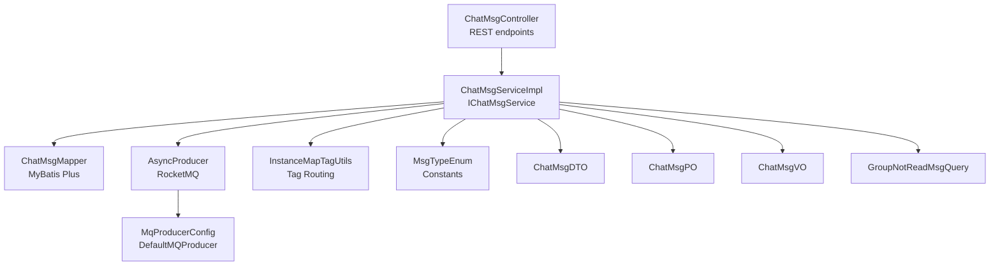
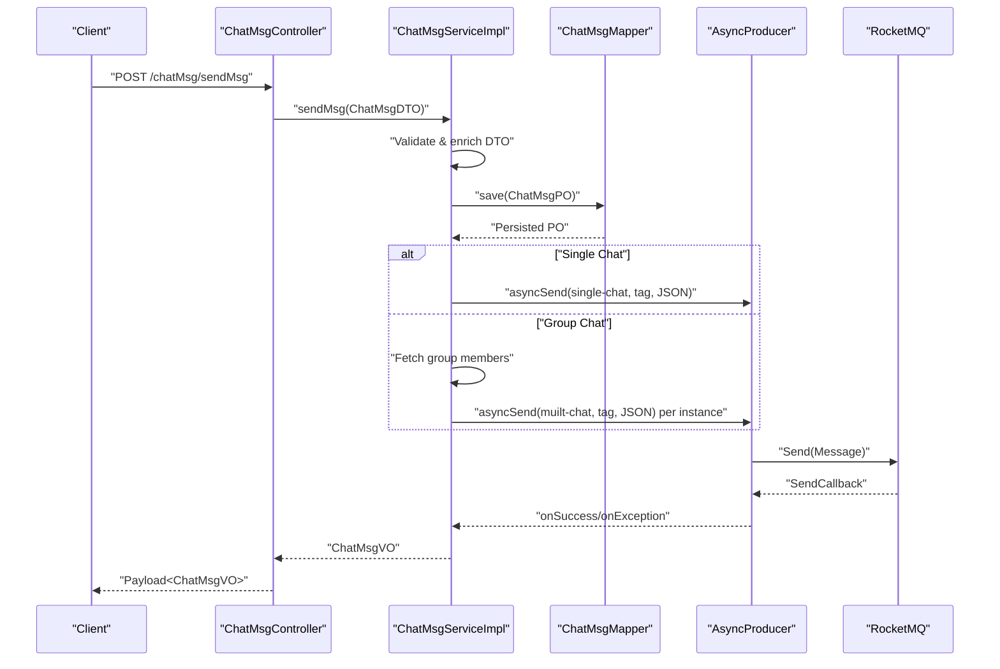
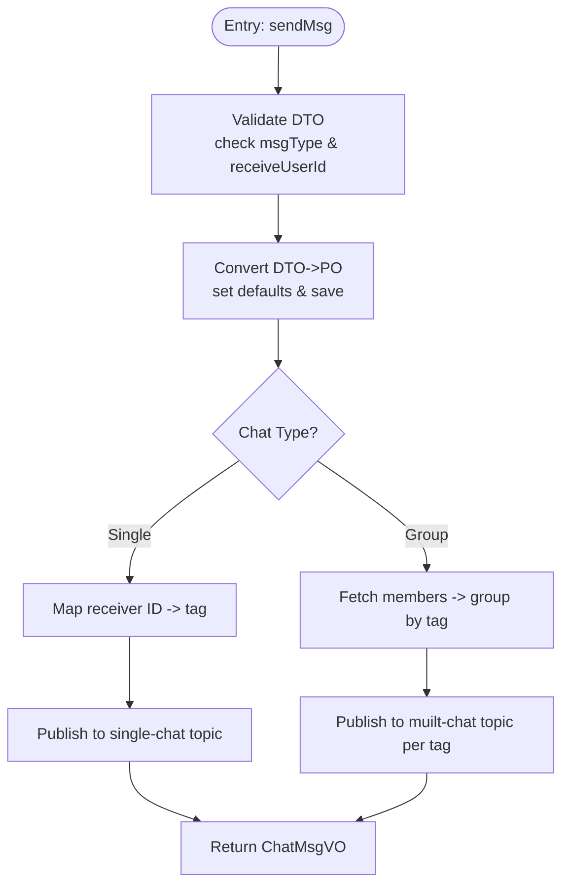
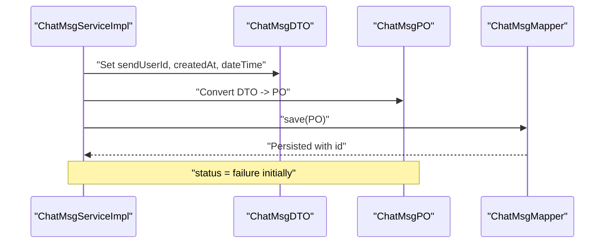
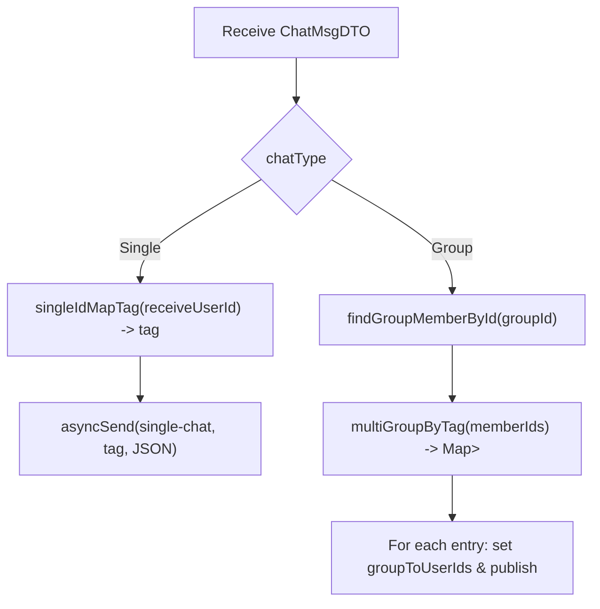
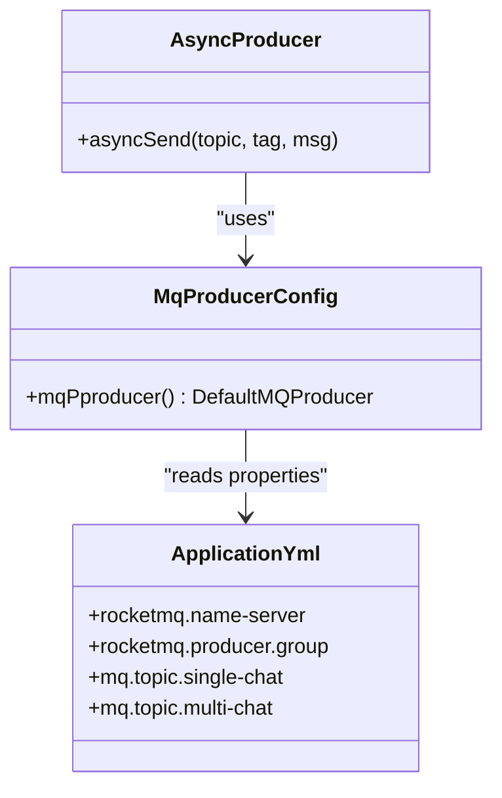
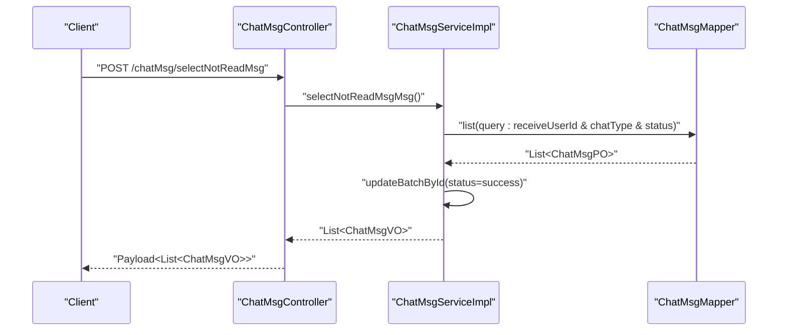
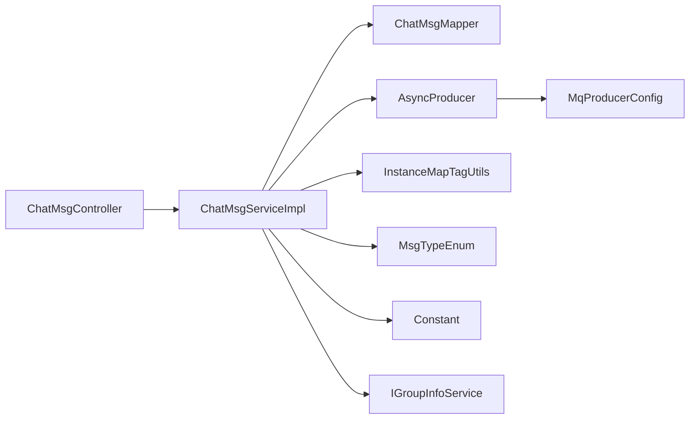
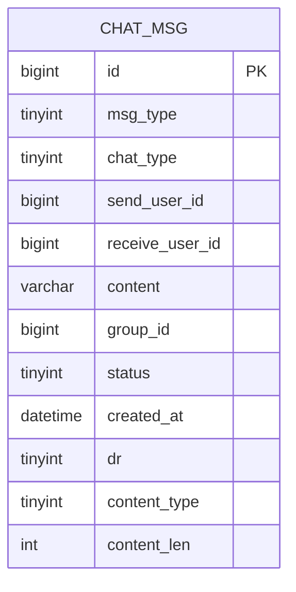

# Message Processing Service

<cite>
**Referenced Files in This Document**
- [ChatMsgServiceImpl.java](file://src/main/java/com/hch/chat_simple/service/impl/ChatMsgServiceImpl.java)
- [IChatMsgService.java](file://src/main/java/com/hch/chat_simple/service/IChatMsgService.java)
- [ChatMsgDTO.java](file://src/main/java/com/hch/chat_simple/pojo/dto/ChatMsgDTO.java)
- [ChatMsgPO.java](file://src/main/java/com/hch/chat_simple/pojo/po/ChatMsgPO.java)
- [ChatMsgMapper.java](file://src/main/java/com/hch/chat_simple/mapper/ChatMsgMapper.java)
- [ChatMsgVO.java](file://src/main/java/com/hch/chat_simple/pojo/vo/ChatMsgVO.java)
- [GroupNotReadMsgQuery.java](file://src/main/java/com/hch/chat_simple/pojo/query/GroupNotReadMsgQuery.java)
- [ChatMsgController.java](file://src/main/java/com/hch/chat_simple/controller/ChatMsgController.java)
- [AsyncProducer.java](file://src/main/java/com/hch/chat_simple/mq/AsyncProducer.java)
- [MqProducerConfig.java](file://src/main/java/com/hch/chat_simple/mq/MqProducerConfig.java)
- [MsgTypeEnum.java](file://src/main/java/com/hch/chat_simple/enums/MsgTypeEnum.java)
- [Constant.java](file://src/main/java/com/hch/chat_simple/util/Constant.java)
- [InstanceMapTagUtils.java](file://src/main/java/com/hch/chat_simple/util/InstanceMapTagUtils.java)
- [application.yml](file://src/main/resources/application.yml)
- [chat.sql](file://db/chat.sql)
</cite>

## Table of Contents
1. [Introduction](#introduction)
2. [Project Structure](#project-structure)
3. [Core Components](#core-components)
4. [Architecture Overview](#architecture-overview)
5. [Detailed Component Analysis](#detailed-component-analysis)
6. [Dependency Analysis](#dependency-analysis)
7. [Performance Considerations](#performance-considerations)
8. [Troubleshooting Guide](#troubleshooting-guide)
9. [Conclusion](#conclusion)
10. [Appendices](#appendices)

## Introduction
This document provides a comprehensive guide to the message processing service implementation, focusing on the ChatMsgServiceImpl core functionality. It covers message sending, validation, persistence, real-time delivery, dual-mode processing for single and group chats, message lifecycle from DTO to persistence, status management, timestamp handling, RocketMQ integration for asynchronous delivery, topic routing and tag-based distribution, retrieval systems for unread messages and group-specific queries, error handling strategies, batch processing for failed message resends, performance optimizations, thread safety, and concurrent processing patterns.

## Project Structure
The message processing service resides within the service layer and integrates with the controller, mapper, enums, utilities, and RocketMQ producer configuration. The primary runtime flow involves:
- Controller receiving requests
- Service validating and persisting messages
- Asynchronous RocketMQ publishing for real-time delivery
- Retrieval APIs for unread and group-specific messages

**Diagram sources**
- [ChatMsgController.java:31-57](file://src/main/java/com/hch/chat_simple/controller/ChatMsgController.java#L31-L57)
- [ChatMsgServiceImpl.java:55-183](file://src/main/java/com/hch/chat_simple/service/impl/ChatMsgServiceImpl.java#L55-L183)
- [ChatMsgMapper.java:17-20](file://src/main/java/com/hch/chat_simple/mapper/ChatMsgMapper.java#L17-L20)
- [AsyncProducer.java:17-62](file://src/main/java/com/hch/chat_simple/mq/AsyncProducer.java#L17-L62)
- [MqProducerConfig.java:13-28](file://src/main/java/com/hch/chat_simple/mq/MqProducerConfig.java#L13-L28)
- [InstanceMapTagUtils.java:14-54](file://src/main/java/com/hch/chat_simple/util/InstanceMapTagUtils.java#L14-L54)
- [MsgTypeEnum.java:6-24](file://src/main/java/com/hch/chat_simple/enums/MsgTypeEnum.java#L6-L24)
- [ChatMsgDTO.java:13-61](file://src/main/java/com/hch/chat_simple/pojo/dto/ChatMsgDTO.java#L13-L61)
- [ChatMsgPO.java:18-53](file://src/main/java/com/hch/chat_simple/pojo/po/ChatMsgPO.java#L18-L53)
- [ChatMsgVO.java:14-61](file://src/main/java/com/hch/chat_simple/pojo/vo/ChatMsgVO.java#L14-L61)
- [GroupNotReadMsgQuery.java:10-26](file://src/main/java/com/hch/chat_simple/pojo/query/GroupNotReadMsgQuery.java#L10-L26)

**Section sources**
- [ChatMsgController.java:31-57](file://src/main/java/com/hch/chat_simple/controller/ChatMsgController.java#L31-L57)
- [ChatMsgServiceImpl.java:55-183](file://src/main/java/com/hch/chat_simple/service/impl/ChatMsgServiceImpl.java#L55-L183)

## Core Components
- ChatMsgServiceImpl: Implements IChatMsgService, orchestrates message sending, persistence, and retrieval.
- IChatMsgService: Defines service contract for message operations.
- ChatMsgDTO/ChatMsgPO/ChatMsgVO: Data transfer and persistence models.
- ChatMsgMapper: MyBatis Plus mapper for ChatMsgPO.
- AsyncProducer: Asynchronous RocketMQ producer wrapper.
- MqProducerConfig: RocketMQ producer bean configuration.
- MsgTypeEnum: Enumerates message types.
- Constant: Centralized constants for statuses, chat types, and zones.
- InstanceMapTagUtils: Tag-based routing for single/group chat instances.
- GroupNotReadMsgQuery: Query model for group-specific unread message retrieval.

**Section sources**
- [IChatMsgService.java:20-27](file://src/main/java/com/hch/chat_simple/service/IChatMsgService.java#L20-L27)
- [ChatMsgServiceImpl.java:55-183](file://src/main/java/com/hch/chat_simple/service/impl/ChatMsgServiceImpl.java#L55-L183)
- [ChatMsgDTO.java:13-61](file://src/main/java/com/hch/chat_simple/pojo/dto/ChatMsgDTO.java#L13-L61)
- [ChatMsgPO.java:18-53](file://src/main/java/com/hch/chat_simple/pojo/po/ChatMsgPO.java#L18-L53)
- [ChatMsgMapper.java:17-20](file://src/main/java/com/hch/chat_simple/mapper/ChatMsgMapper.java#L17-L20)
- [AsyncProducer.java:17-62](file://src/main/java/com/hch/chat_simple/mq/AsyncProducer.java#L17-L62)
- [MqProducerConfig.java:13-28](file://src/main/java/com/hch/chat_simple/mq/MqProducerConfig.java#L13-L28)
- [MsgTypeEnum.java:6-24](file://src/main/java/com/hch/chat_simple/enums/MsgTypeEnum.java#L6-L24)
- [Constant.java:3-32](file://src/main/java/com/hch/chat_simple/util/Constant.java#L3-L32)
- [InstanceMapTagUtils.java:14-54](file://src/main/java/com/hch/chat_simple/util/InstanceMapTagUtils.java#L14-L54)
- [GroupNotReadMsgQuery.java:10-26](file://src/main/java/com/hch/chat_simple/pojo/query/GroupNotReadMsgQuery.java#L10-L26)

## Architecture Overview
The message processing architecture follows a synchronous persistence-first pattern with asynchronous delivery via RocketMQ. The service:
- Validates and enriches ChatMsgDTO
- Persists ChatMsgPO with initial status indicating failure
- Publishes messages to RocketMQ topics with tags for instance routing
- Returns ChatMsgVO to clients
- Provides retrieval endpoints for unread and group-specific messages

**Diagram sources**
- [ChatMsgController.java:45-49](file://src/main/java/com/hch/chat_simple/controller/ChatMsgController.java#L45-L49)
- [ChatMsgServiceImpl.java:98-144](file://src/main/java/com/hch/chat_simple/service/impl/ChatMsgServiceImpl.java#L98-L144)
- [AsyncProducer.java:40-59](file://src/main/java/com/hch/chat_simple/mq/AsyncProducer.java#L40-L59)

## Detailed Component Analysis

### ChatMsgServiceImpl: Core Functionality
- Message Sending
  - Validates ChatMsgDTO and sets sender identity and timestamps.
  - Converts DTO to PO, sets defaults (chat type, status, creator info), persists, and assigns msgId.
  - Routes to single or group chat mode:
    - Single chat: maps receiver ID to tag and publishes to single-chat topic.
    - Group chat: fetches members, groups by instance tag, publishes broadcast messages.
- Validation
  - Checks message type and presence of receiveUserId for single chat.
- Persistence
  - Uses MyBatis Plus base service to save ChatMsgPO with initial status failure.
- Real-time Delivery
  - Asynchronously sends JSON payload to RocketMQ with topic and tag.
- Unread Retrieval
  - Selects failed single-chat messages for current user and updates status atomically.
- Group-specific Queries
  - Supports querying unread messages for multiple groups with last message IDs.

**Diagram sources**
- [ChatMsgServiceImpl.java:98-144](file://src/main/java/com/hch/chat_simple/service/impl/ChatMsgServiceImpl.java#L98-L144)
- [InstanceMapTagUtils.java:32-46](file://src/main/java/com/hch/chat_simple/util/InstanceMapTagUtils.java#L32-L46)

**Section sources**
- [ChatMsgServiceImpl.java:98-144](file://src/main/java/com/hch/chat_simple/service/impl/ChatMsgServiceImpl.java#L98-L144)
- [ChatMsgServiceImpl.java:71-95](file://src/main/java/com/hch/chat_simple/service/impl/ChatMsgServiceImpl.java#L71-L95)
- [ChatMsgServiceImpl.java:146-181](file://src/main/java/com/hch/chat_simple/service/impl/ChatMsgServiceImpl.java#L146-L181)

### Message Lifecycle: DTO to PO Persistence and Status Management
- DTO enrichment: sets sendUserId, createdAt, dateTime, and chatType.
- PO creation: maps DTO fields to PO, sets status to failure initially.
- Persistence: saves PO and obtains msgId.
- Status management:
  - Initial status: failure.
  - Unread retrieval updates status to success after fetching failed messages for the current user.
- Timestamp handling:
  - Stores LocalDateTime createdAt.
  - Converts to epoch milliseconds for VO dateTime field.

**Diagram sources**
- [ChatMsgServiceImpl.java:98-114](file://src/main/java/com/hch/chat_simple/service/impl/ChatMsgServiceImpl.java#L98-L114)
- [ChatMsgPO.java:44-45](file://src/main/java/com/hch/chat_simple/pojo/po/ChatMsgPO.java#L44-L45)

**Section sources**
- [ChatMsgServiceImpl.java:98-114](file://src/main/java/com/hch/chat_simple/service/impl/ChatMsgServiceImpl.java#L98-L114)
- [ChatMsgPO.java:44-45](file://src/main/java/com/hch/chat_simple/pojo/po/ChatMsgPO.java#L44-L45)

### Dual-Mode Message Processing: Single Chat vs Group Chat
- Single Chat
  - Topic: configured single-chat.
  - Tagging: receiver ID mapped to tag via InstanceMapTagUtils.
  - Delivery: targeted to specific instance.
- Group Chat
  - Topic: configured muilt-chat.
  - Member distribution: fetches group members and groups by tag for broadcast.
  - Delivery: publishes once per tag to cover all instances.

**Diagram sources**
- [ChatMsgServiceImpl.java:119-135](file://src/main/java/com/hch/chat_simple/service/impl/ChatMsgServiceImpl.java#L119-L135)
- [InstanceMapTagUtils.java:32-46](file://src/main/java/com/hch/chat_simple/util/InstanceMapTagUtils.java#L32-L46)

**Section sources**
- [ChatMsgServiceImpl.java:119-135](file://src/main/java/com/hch/chat_simple/service/impl/ChatMsgServiceImpl.java#L119-L135)
- [InstanceMapTagUtils.java:32-46](file://src/main/java/com/hch/chat_simple/util/InstanceMapTagUtils.java#L32-L46)

### RocketMQ Integration: Topics, Tags, and Asynchronous Delivery
- Topics
  - single-chat: for single chat messages.
  - muilt-chat: for group chat broadcasts.
- Tags
  - Determined by InstanceMapTagUtils using modulo arithmetic on IDs or member lists.
- Producer
  - AsyncProducer wraps DefaultMQProducer and logs success/exception callbacks.
- Configuration
  - Producer group and name server configured via application.yml.
  - Consumer groups and composition topics configured for downstream consumers.

**Diagram sources**
- [AsyncProducer.java:17-62](file://src/main/java/com/hch/chat_simple/mq/AsyncProducer.java#L17-L62)
- [MqProducerConfig.java:13-28](file://src/main/java/com/hch/chat_simple/mq/MqProducerConfig.java#L13-L28)
- [application.yml:39-51](file://src/main/resources/application.yml#L39-L51)

**Section sources**
- [AsyncProducer.java:40-59](file://src/main/java/com/hch/chat_simple/mq/AsyncProducer.java#L40-L59)
- [MqProducerConfig.java:22-28](file://src/main/java/com/hch/chat_simple/mq/MqProducerConfig.java#L22-L28)
- [application.yml:39-51](file://src/main/resources/application.yml#L39-L51)

### Message Retrieval Systems
- Unread Messages (Single Chat)
  - Fetches failed messages for the current user where chatType equals single chat.
  - Updates status to success in a batch operation to avoid duplicates.
  - Converts to ChatMsgVO with epoch timestamp.
- Group-specific Queries
  - Accepts a list of group parameters with last message IDs.
  - Constructs a query combining multiple group conditions with OR logic.
  - Returns ChatMsgVO list with epoch timestamp.

**Diagram sources**
- [ChatMsgController.java:39-43](file://src/main/java/com/hch/chat_simple/controller/ChatMsgController.java#L39-L43)
- [ChatMsgServiceImpl.java:71-95](file://src/main/java/com/hch/chat_simple/service/impl/ChatMsgServiceImpl.java#L71-L95)

**Section sources**
- [ChatMsgServiceImpl.java:71-95](file://src/main/java/com/hch/chat_simple/service/impl/ChatMsgServiceImpl.java#L71-L95)
- [ChatMsgServiceImpl.java:146-181](file://src/main/java/com/hch/chat_simple/service/impl/ChatMsgServiceImpl.java#L146-L181)

### Practical Examples
- Single Chat Message Sending Workflow
  - Client posts ChatMsgDTO with chatType=1 and receiveUserId.
  - Service persists with status=failed, then publishes to single-chat topic with tag derived from receiveUserId.
  - On success callback, downstream consumers deliver to the target instance.
- Group Broadcasting Mechanism
  - Client posts ChatMsgDTO with chatType=2 and groupId.
  - Service fetches members, groups by tag, publishes once per tag to muilt-chat topic.
  - Consumers on all instances process and deliver to respective users.
- Message Status Tracking
  - After successful MQ delivery, consumers update status to success.
  - Unread retrieval ensures only failed messages are returned and marked success atomically.

[No sources needed since this section provides conceptual examples]

### Thread Safety and Concurrent Processing
- Synchronous Persistence: save() is invoked synchronously; ensure database concurrency controls are effective.
- Asynchronous Delivery: AsyncProducer uses RocketMQ SendCallback; callbacks are asynchronous and safe to log errors without blocking the main thread.
- Batch Updates: updateBatchById() performs batch updates for status transitions during unread retrieval; ensure proper transaction boundaries and idempotency.
- Tag-based Routing: InstanceMapTagUtils uses modulo arithmetic; thread-safe as it operates on immutable sizes and IDs.

**Section sources**
- [ChatMsgServiceImpl.java:84-85](file://src/main/java/com/hch/chat_simple/service/impl/ChatMsgServiceImpl.java#L84-L85)
- [AsyncProducer.java:44-58](file://src/main/java/com/hch/chat_simple/mq/AsyncProducer.java#L44-L58)
- [InstanceMapTagUtils.java:32-46](file://src/main/java/com/hch/chat_simple/util/InstanceMapTagUtils.java#L32-L46)

## Dependency Analysis
- Service depends on:
  - Mapper for persistence
  - AsyncProducer for messaging
  - InstanceMapTagUtils for tag computation
  - IGroupInfoService for group member retrieval
  - Enums and constants for type/status definitions
- Controller depends on IChatMsgService for business operations
- RocketMQ producer bean configured centrally

**Diagram sources**
- [ChatMsgController.java:36-37](file://src/main/java/com/hch/chat_simple/controller/ChatMsgController.java#L36-L37)
- [ChatMsgServiceImpl.java:64-68](file://src/main/java/com/hch/chat_simple/service/impl/ChatMsgServiceImpl.java#L64-L68)
- [AsyncProducer.java:19-20](file://src/main/java/com/hch/chat_simple/mq/AsyncProducer.java#L19-L20)
- [MqProducerConfig.java:22-28](file://src/main/java/com/hch/chat_simple/mq/MqProducerConfig.java#L22-L28)

**Section sources**
- [ChatMsgServiceImpl.java:64-68](file://src/main/java/com/hch/chat_simple/service/impl/ChatMsgServiceImpl.java#L64-L68)
- [ChatMsgController.java:36-37](file://src/main/java/com/hch/chat_simple/controller/ChatMsgController.java#L36-L37)

## Performance Considerations
- Asynchronous Publishing: Offloads network I/O to RocketMQ, reducing latency for sendMsg.
- Tag-based Distribution: Reduces cross-instance traffic by routing messages to specific instances.
- Batch Updates: updateBatchById minimizes round-trips when marking unread messages as processed.
- Query Optimization: GroupNotReadMsgQuery uses OR conditions across multiple groups; consider pagination or limiting results to improve performance.
- Indexing: Ensure database indexes exist on frequently queried columns (receive_user_id, chat_type, status, group_id, id).

[No sources needed since this section provides general guidance]

## Troubleshooting Guide
- RocketMQ Exceptions
  - AsyncProducer logs exceptions in SendCallback; check logs for topic-specific errors.
  - Verify producer group and name server configuration.
- Message Not Delivered
  - Confirm chatType and receiver/group IDs are set correctly.
  - Validate tag mapping and instance configuration.
- Unread Messages Not Appearing
  - Ensure status remains failure until successful delivery.
  - Verify current user context and receiveUserId filtering.
- Group Broadcast Issues
  - Confirm group membership retrieval and tag grouping logic.
  - Check that all instances are subscribed to the muilt-chat topic with appropriate tags.

**Section sources**
- [AsyncProducer.java:44-58](file://src/main/java/com/hch/chat_simple/mq/AsyncProducer.java#L44-L58)
- [application.yml:39-51](file://src/main/resources/application.yml#L39-L51)
- [ChatMsgServiceImpl.java:71-95](file://src/main/java/com/hch/chat_simple/service/impl/ChatMsgServiceImpl.java#L71-L95)
- [ChatMsgServiceImpl.java:125-134](file://src/main/java/com/hch/chat_simple/service/impl/ChatMsgServiceImpl.java#L125-L134)

## Conclusion
The message processing service implements a robust, asynchronous messaging pipeline. It ensures reliable persistence, precise routing via tags, and efficient retrieval of unread messages. The design supports both single and group chat modes, leverages RocketMQ for scalable delivery, and maintains clear status tracking and timestamp handling. With careful attention to query performance and error logging, the system provides a solid foundation for real-time chat functionality.

## Appendices

### Data Model Overview

**Diagram sources**
- [chat.sql:37-54](file://db/chat.sql#L37-L54)

### Configuration Reference
- RocketMQ producer group and name server
- Topics for single-chat and muilt-chat
- Tag list for instance routing

**Section sources**
- [application.yml:39-51](file://src/main/resources/application.yml#L39-L51)
- [application.yml:76-82](file://src/main/resources/application.yml#L76-L82)