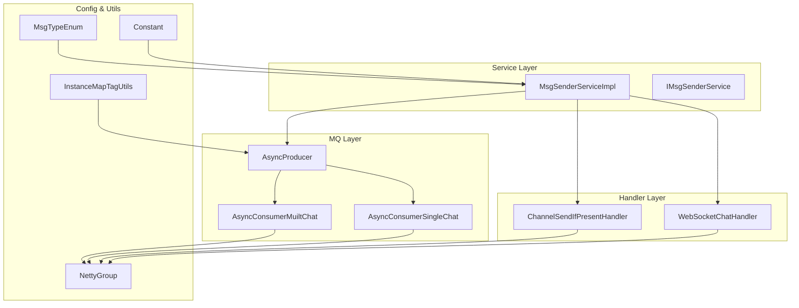
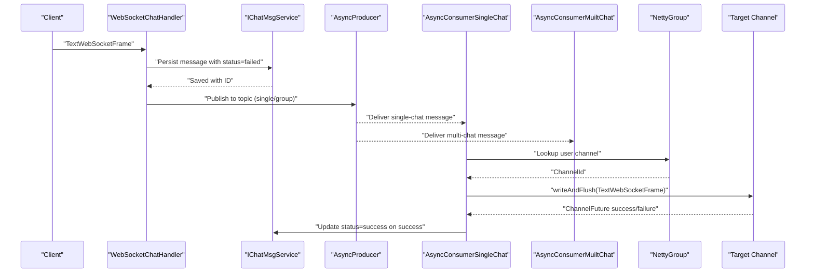
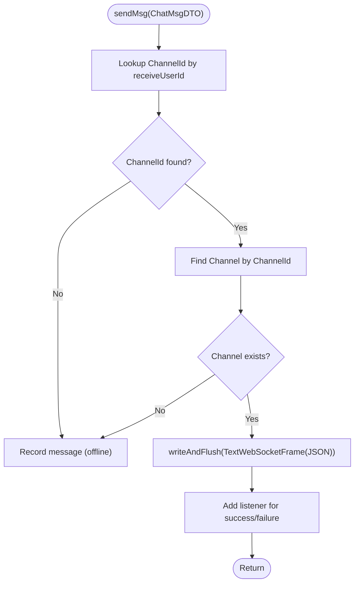
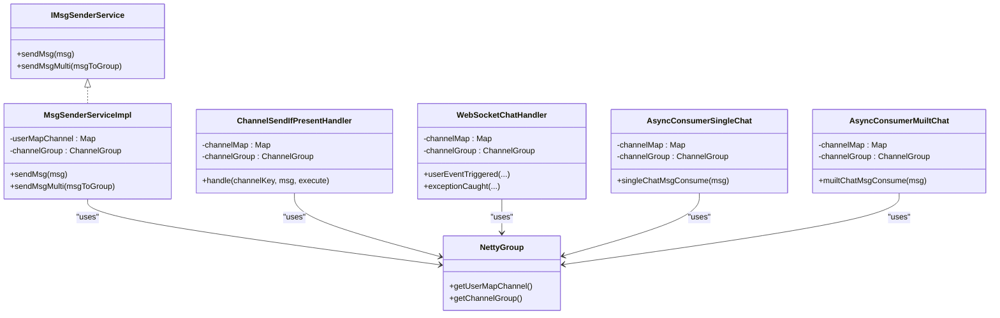

# Message Sender Service

<cite>
**Referenced Files in This Document**
- [MsgSenderServiceImpl.java](file://src/main/java/com/hch/chat_simple/service/impl/MsgSenderServiceImpl.java)
- [IMsgSenderService.java](file://src/main/java/com/hch/chat_simple/service/IMsgSenderService.java)
- [ChannelSendIfPresentHandler.java](file://src/main/java/com/hch/chat_simple/handler/ChannelSendIfPresentHandler.java)
- [WebSocketChatHandler.java](file://src/main/java/com/hch/chat_simple/handler/WebSocketChatHandler.java)
- [NettyGroup.java](file://src/main/java/com/hch/chat_simple/config/NettyGroup.java)
- [ChatMsgDTO.java](file://src/main/java/com/hch/chat_simple/pojo/dto/ChatMsgDTO.java)
- [MsgTypeEnum.java](file://src/main/java/com/hch/chat_simple/enums/MsgTypeEnum.java)
- [AsyncConsumerSingleChat.java](file://src/main/java/com/hch/chat_simple/mq/AsyncConsumerSingleChat.java)
- [AsyncConsumerMuiltChat.java](file://src/main/java/com/hch/chat_simple/mq/AsyncConsumerMuiltChat.java)
- [AsyncProducer.java](file://src/main/java/com/hch/chat_simple/mq/AsyncProducer.java)
- [InstanceMapTagUtils.java](file://src/main/java/com/hch/chat_simple/util/InstanceMapTagUtils.java)
- [application.yml](file://src/main/resources/application.yml)
- [Constant.java](file://src/main/java/com/hch/chat_simple/util/Constant.java)
</cite>

## Table of Contents
1. [Introduction](#introduction)
2. [Project Structure](#project-structure)
3. [Core Components](#core-components)
4. [Architecture Overview](#architecture-overview)
5. [Detailed Component Analysis](#detailed-component-analysis)
6. [Dependency Analysis](#dependency-analysis)
7. [Performance Considerations](#performance-considerations)
8. [Troubleshooting Guide](#troubleshooting-guide)
9. [Conclusion](#conclusion)

## Introduction
This document explains the message sender service implementation responsible for dispatching messages and confirming delivery via WebSocket handlers. It covers the integration with ChannelSendIfPresentHandler for efficient channel management, the end-to-end message delivery pipeline from service layer to WebSocket clients, delivery confirmation mechanisms, retry logic for failed deliveries, connection state management, acknowledgment systems, and error recovery procedures. It also addresses performance considerations for high-volume message delivery and connection pooling optimizations.

## Project Structure
The messaging subsystem spans several layers:
- Service layer: message dispatch and broadcast logic
- Handler layer: WebSocket lifecycle and per-message routing
- MQ layer: asynchronous delivery and acknowledgment updates
- Configuration: Netty channel registry and shared channel group
- Utilities: constants, enums, and tagging for sharding

**Diagram sources**
- [MsgSenderServiceImpl.java:25-79](file://src/main/java/com/hch/chat_simple/service/impl/MsgSenderServiceImpl.java#L25-L79)
- [IMsgSenderService.java:5-10](file://src/main/java/com/hch/chat_simple/service/IMsgSenderService.java#L5-L10)
- [WebSocketChatHandler.java:50-196](file://src/main/java/com/hch/chat_simple/handler/WebSocketChatHandler.java#L50-L196)
- [ChannelSendIfPresentHandler.java:15-34](file://src/main/java/com/hch/chat_simple/handler/ChannelSendIfPresentHandler.java#L15-L34)
- [AsyncProducer.java:17-44](file://src/main/java/com/hch/chat_simple/mq/AsyncProducer.java#L17-L44)
- [AsyncConsumerSingleChat.java:36-84](file://src/main/java/com/hch/chat_simple/mq/AsyncConsumerSingleChat.java#L36-L84)
- [AsyncConsumerMuiltChat.java:31-92](file://src/main/java/com/hch/chat_simple/mq/AsyncConsumerMuiltChat.java#L31-L92)
- [NettyGroup.java:11-30](file://src/main/java/com/hch/chat_simple/config/NettyGroup.java#L11-L30)
- [InstanceMapTagUtils.java:14-55](file://src/main/java/com/hch/chat_simple/util/InstanceMapTagUtils.java#L14-L55)
- [MsgTypeEnum.java:6-25](file://src/main/java/com/hch/chat_simple/enums/MsgTypeEnum.java#L6-L25)
- [Constant.java:3-33](file://src/main/java/com/hch/chat_simple/util/Constant.java#L3-L33)

**Section sources**
- [MsgSenderServiceImpl.java:25-79](file://src/main/java/com/hch/chat_simple/service/impl/MsgSenderServiceImpl.java#L25-L79)
- [WebSocketChatHandler.java:50-196](file://src/main/java/com/hch/chat_simple/handler/WebSocketChatHandler.java#L50-L196)
- [NettyGroup.java:11-30](file://src/main/java/com/hch/chat_simple/config/NettyGroup.java#L11-L30)

## Core Components
- MsgSenderServiceImpl: Implements single and group message dispatch using Netty channels and JSON serialization. It leverages NettyGroup for channel lookup and writes TextWebSocketFrame messages to connected clients. Delivery status is recorded asynchronously via ChannelFuture listeners.
- ChannelSendIfPresentHandler: Provides a reusable pattern to send messages only when a target user’s channel exists, encapsulating channel lookup and write-and-flush logic.
- WebSocketChatHandler: Manages WebSocket handshake, user authentication via token attributes, adds/removes channels on connect/disconnect/idle events, and persists outgoing messages with initial failure status.
- AsyncConsumerSingleChat and AsyncConsumerMuiltChat: Consume RocketMQ messages and deliver them to online recipients via Netty channels, updating message status upon successful delivery.
- AsyncProducer: Asynchronously publishes messages to RocketMQ topics with tags for routing to specific instances.
- NettyGroup: Central registry of user-to-channel mapping and a shared ChannelGroup for efficient broadcast and targeted sends.
- MsgTypeEnum and Constant: Define message types and status constants used across the system.

**Section sources**
- [MsgSenderServiceImpl.java:25-79](file://src/main/java/com/hch/chat_simple/service/impl/MsgSenderServiceImpl.java#L25-L79)
- [ChannelSendIfPresentHandler.java:15-34](file://src/main/java/com/hch/chat_simple/handler/ChannelSendIfPresentHandler.java#L15-L34)
- [WebSocketChatHandler.java:50-196](file://src/main/java/com/hch/chat_simple/handler/WebSocketChatHandler.java#L50-L196)
- [AsyncConsumerSingleChat.java:36-84](file://src/main/java/com/hch/chat_simple/mq/AsyncConsumerSingleChat.java#L36-L84)
- [AsyncConsumerMuiltChat.java:31-92](file://src/main/java/com/hch/chat_simple/mq/AsyncConsumerMuiltChat.java#L31-L92)
- [AsyncProducer.java:17-44](file://src/main/java/com/hch/chat_simple/mq/AsyncProducer.java#L17-L44)
- [NettyGroup.java:11-30](file://src/main/java/com/hch/chat_simple/config/NettyGroup.java#L11-L30)
- [MsgTypeEnum.java:6-25](file://src/main/java/com/hch/chat_simple/enums/MsgTypeEnum.java#L6-L25)
- [Constant.java:3-33](file://src/main/java/com/hch/chat_simple/util/Constant.java#L3-L33)

## Architecture Overview
The message delivery pipeline integrates synchronous and asynchronous paths:
- Synchronous path: WebSocketChatHandler receives client-originated messages, persists them with failure status, and enqueues them to RocketMQ for asynchronous delivery.
- Asynchronous path: RocketMQ consumers locate online recipients via NettyGroup, send TextWebSocketFrame messages, and update message status upon successful delivery.

**Diagram sources**
- [WebSocketChatHandler.java:72-109](file://src/main/java/com/hch/chat_simple/handler/WebSocketChatHandler.java#L72-L109)
- [AsyncProducer.java:40-44](file://src/main/java/com/hch/chat_simple/mq/AsyncProducer.java#L40-L44)
- [AsyncConsumerSingleChat.java:47-73](file://src/main/java/com/hch/chat_simple/mq/AsyncConsumerSingleChat.java#L47-L73)
- [AsyncConsumerMuiltChat.java:57-83](file://src/main/java/com/hch/chat_simple/mq/AsyncConsumerMuiltChat.java#L57-L83)
- [NettyGroup.java:11-30](file://src/main/java/com/hch/chat_simple/config/NettyGroup.java#L11-L30)
- [IChatMsgService.java:20-27](file://src/main/java/com/hch/chat_simple/service/IChatMsgService.java#L20-L27)

## Detailed Component Analysis

### MsgSenderServiceImpl
Responsibilities:
- Single message dispatch: resolves recipient channel via NettyGroup, writes JSON payload as TextWebSocketFrame, and logs delivery status via ChannelFuture listener.
- Group message dispatch: filters out sender from recipients, converts DTO per recipient, and reuses single dispatch logic.

Key behaviors:
- Uses NettyGroup.userMapChannel and ChannelGroup for O(1) channel lookup and broadcast.
- Serializes ChatMsgDTO to JSON and wraps in TextWebSocketFrame for transport.
- Records delivery outcome asynchronously; message persistence and status updates occur elsewhere.

**Diagram sources**
- [MsgSenderServiceImpl.java:34-55](file://src/main/java/com/hch/chat_simple/service/impl/MsgSenderServiceImpl.java#L34-L55)
- [NettyGroup.java:11-30](file://src/main/java/com/hch/chat_simple/config/NettyGroup.java#L11-L30)

**Section sources**
- [MsgSenderServiceImpl.java:25-79](file://src/main/java/com/hch/chat_simple/service/impl/MsgSenderServiceImpl.java#L25-L79)
- [IMsgSenderService.java:5-10](file://src/main/java/com/hch/chat_simple/service/IMsgSenderService.java#L5-L10)
- [ChatMsgDTO.java:13-61](file://src/main/java/com/hch/chat_simple/pojo/dto/ChatMsgDTO.java#L13-L61)

### ChannelSendIfPresentHandler
Responsibilities:
- Encapsulates safe send-if-present logic: checks user channel presence, retrieves channel from ChannelGroup, executes custom action, and writes message frame.

Integration:
- Used by higher-level services to avoid repeated presence checks and channel lookups.

**Section sources**
- [ChannelSendIfPresentHandler.java:15-34](file://src/main/java/com/hch/chat_simple/handler/ChannelSendIfPresentHandler.java#L15-L34)
- [NettyGroup.java:11-30](file://src/main/java/com/hch/chat_simple/config/NettyGroup.java#L11-L30)

### WebSocketChatHandler
Responsibilities:
- Handles WebSocket handshake and user authentication via token attributes stored on the channel.
- Adds/removes channels to NettyGroup on connect/disconnect/idle events.
- Persists outgoing messages with initial failure status and prepares for asynchronous delivery confirmation.

Connection state management:
- On handshake completion, extracts token, validates and enriches channel attributes, stores user-to-channel mapping, and adds channel to ChannelGroup.
- On idle events, removes stale entries from channel registry.

**Section sources**
- [WebSocketChatHandler.java:118-175](file://src/main/java/com/hch/chat_simple/handler/WebSocketChatHandler.java#L118-L175)
- [WebSocketChatHandler.java:72-109](file://src/main/java/com/hch/chat_simple/handler/WebSocketChatHandler.java#L72-L109)
- [NettyGroup.java:11-30](file://src/main/java/com/hch/chat_simple/config/NettyGroup.java#L11-L30)

### AsyncConsumerSingleChat and AsyncConsumerMuiltChat
Responsibilities:
- Consume RocketMQ messages and deliver to online recipients.
- Single-chat consumer updates message status to success upon successful delivery.
- Multi-chat consumer broadcasts to group members excluding the sender.

Delivery confirmation:
- Both consumers rely on ChannelFuture listener callbacks to update message status after successful write-and-flush.

**Section sources**
- [AsyncConsumerSingleChat.java:47-73](file://src/main/java/com/hch/chat_simple/mq/AsyncConsumerSingleChat.java#L47-L73)
- [AsyncConsumerMuiltChat.java:57-83](file://src/main/java/com/hch/chat_simple/mq/AsyncConsumerMuiltChat.java#L57-L83)
- [NettyGroup.java:11-30](file://src/main/java/com/hch/chat_simple/config/NettyGroup.java#L11-L30)

### AsyncProducer
Responsibilities:
- Publishes messages to RocketMQ topics with tags for instance-level routing.
- Uses RocketMQ producer callbacks for asynchronous send results.

Routing:
- Tags are derived from user IDs to distribute load across instances.

**Section sources**
- [AsyncProducer.java:17-44](file://src/main/java/com/hch/chat_simple/mq/AsyncProducer.java#L17-L44)
- [InstanceMapTagUtils.java:32-47](file://src/main/java/com/hch/chat_simple/util/InstanceMapTagUtils.java#L32-L47)

### NettyGroup
Responsibilities:
- Maintains a thread-safe user-to-channel mapping and a shared ChannelGroup for efficient broadcast and targeted sends.

**Section sources**
- [NettyGroup.java:11-30](file://src/main/java/com/hch/chat_simple/config/NettyGroup.java#L11-L30)

### Message Types and Status Constants
- MsgTypeEnum defines standardized message categories (e.g., SEND_MSG).
- Constant defines status values for message delivery (MSG_SEND_FAILED, MSG_SEND_SUCCESSED) and chat types.

**Section sources**
- [MsgTypeEnum.java:6-25](file://src/main/java/com/hch/chat_simple/enums/MsgTypeEnum.java#L6-L25)
- [Constant.java:3-33](file://src/main/java/com/hch/chat_simple/util/Constant.java#L3-L33)

## Dependency Analysis
The message sender service orchestrates interactions among handlers, Netty registries, and MQ components. The following diagram highlights key dependencies and control flows.

**Diagram sources**
- [IMsgSenderService.java:5-10](file://src/main/java/com/hch/chat_simple/service/IMsgSenderService.java#L5-L10)
- [MsgSenderServiceImpl.java:25-79](file://src/main/java/com/hch/chat_simple/service/impl/MsgSenderServiceImpl.java#L25-L79)
- [ChannelSendIfPresentHandler.java:15-34](file://src/main/java/com/hch/chat_simple/handler/ChannelSendIfPresentHandler.java#L15-L34)
- [WebSocketChatHandler.java:50-196](file://src/main/java/com/hch/chat_simple/handler/WebSocketChatHandler.java#L50-L196)
- [AsyncConsumerSingleChat.java:36-84](file://src/main/java/com/hch/chat_simple/mq/AsyncConsumerSingleChat.java#L36-L84)
- [AsyncConsumerMuiltChat.java:31-92](file://src/main/java/com/hch/chat_simple/mq/AsyncConsumerMuiltChat.java#L31-L92)
- [NettyGroup.java:11-30](file://src/main/java/com/hch/chat_simple/config/NettyGroup.java#L11-L30)

**Section sources**
- [MsgSenderServiceImpl.java:25-79](file://src/main/java/com/hch/chat_simple/service/impl/MsgSenderServiceImpl.java#L25-L79)
- [ChannelSendIfPresentHandler.java:15-34](file://src/main/java/com/hch/chat_simple/handler/ChannelSendIfPresentHandler.java#L15-L34)
- [WebSocketChatHandler.java:50-196](file://src/main/java/com/hch/chat_simple/handler/WebSocketChatHandler.java#L50-L196)
- [AsyncConsumerSingleChat.java:36-84](file://src/main/java/com/hch/chat_simple/mq/AsyncConsumerSingleChat.java#L36-L84)
- [AsyncConsumerMuiltChat.java:31-92](file://src/main/java/com/hch/chat_simple/mq/AsyncConsumerMuiltChat.java#L31-L92)
- [NettyGroup.java:11-30](file://src/main/java/com/hch/chat_simple/config/NettyGroup.java#L11-L30)

## Performance Considerations
- Channel lookup and broadcast:
  - NettyGroup maintains a concurrent user-to-channel map and a shared ChannelGroup, enabling O(1) presence checks and efficient broadcast.
- Fixed thread pools:
  - Handlers use fixed-size executors to bound concurrency during message processing.
- Connection pooling:
  - Application configuration includes Redis and RocketMQ settings that influence throughput and latency; tuning these parameters can improve performance under load.
- Sharding and routing:
  - InstanceMapTagUtils computes tags for single-chat messages to distribute workload across instances, reducing hotspots.
- Serialization overhead:
  - JSON serialization of ChatMsgDTO is straightforward; consider compression or binary codecs if bandwidth becomes a bottleneck.
- Backpressure and flow control:
  - Netty’s write-and-flush with futures provides basic backpressure feedback; ensure downstream consumers keep up to prevent accumulation.

[No sources needed since this section provides general guidance]

## Troubleshooting Guide
Common scenarios and remedies:
- Message not delivered:
  - Verify recipient channel presence in NettyGroup; check WebSocketChatHandler userEventTriggered for successful handshake and channel addition.
  - Confirm AsyncConsumer received and processed the message; inspect ChannelFuture listener outcomes.
- Persistent failures:
  - Messages persisted with failure status require explicit retry logic; implement periodic retries or client-side pull for missed messages.
- Idle disconnects:
  - WebSocketChatHandler removes channels on idle events; ensure keepalive and heartbeat configurations are adequate.
- Authentication failures:
  - PermisionWsHandler validates tokens; confirm token presence and validity in channel attributes.
- MQ delivery issues:
  - Review AsyncProducer send callbacks and RocketMQ consumer logs; ensure topic and tag configurations match producers and consumers.

**Section sources**
- [WebSocketChatHandler.java:118-175](file://src/main/java/com/hch/chat_simple/handler/WebSocketChatHandler.java#L118-L175)
- [AsyncConsumerSingleChat.java:47-73](file://src/main/java/com/hch/chat_simple/mq/AsyncConsumerSingleChat.java#L47-L73)
- [application.yml:39-51](file://src/main/resources/application.yml#L39-L51)

## Conclusion
The message sender service integrates Netty-based WebSocket handlers with asynchronous MQ delivery to achieve scalable, real-time messaging. Delivery confirmation occurs when ChannelFuture succeeds, and message status is updated accordingly. Robust connection state management, channel grouping, and sharded routing contribute to reliability and performance. Extending retry logic and monitoring delivery metrics will further strengthen the system for high-volume scenarios.