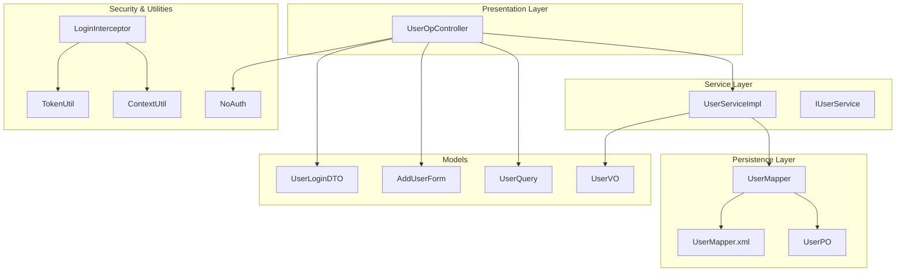
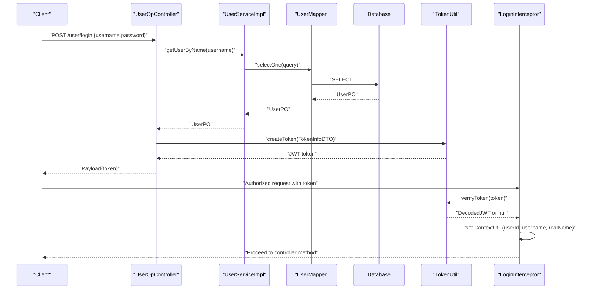
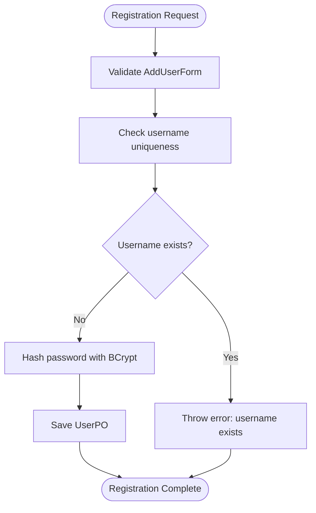
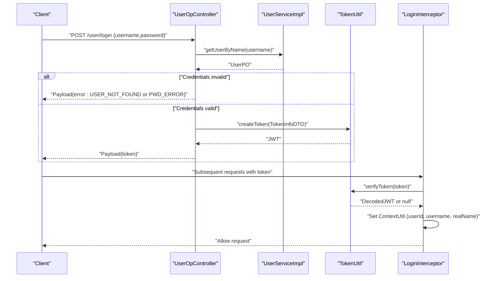
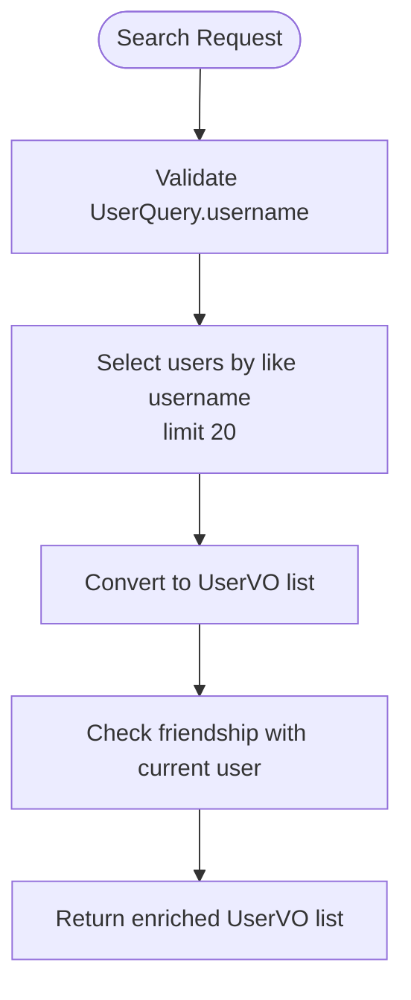
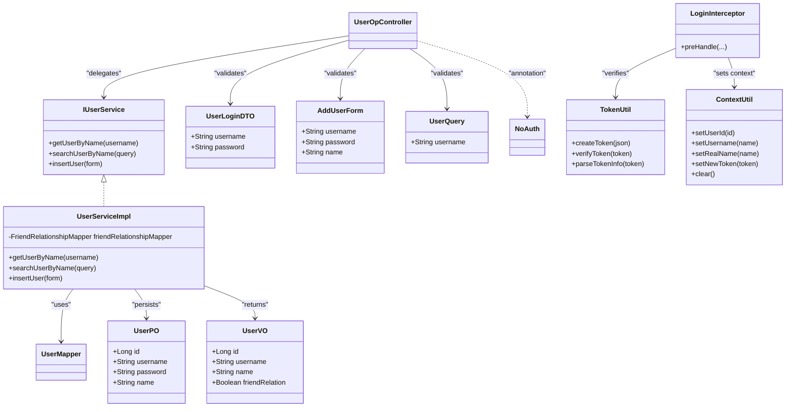

# User Management Service

<cite>
**Referenced Files in This Document**
- [UserServiceImpl.java](file://src/main/java/com/hch/chat_simple/service/impl/UserServiceImpl.java)
- [IUserService.java](file://src/main/java/com/hch/chat_simple/service/IUserService.java)
- [UserMapper.java](file://src/main/java/com/hch/chat_simple/mapper/UserMapper.java)
- [UserMapper.xml](file://src/main/resources/mapper/UserMapper.xml)
- [UserPO.java](file://src/main/java/com/hch/chat_simple/pojo/po/UserPO.java)
- [UserVO.java](file://src/main/java/com/hch/chat_simple/pojo/vo/UserVO.java)
- [UserQuery.java](file://src/main/java/com/hch/chat_simple/pojo/query/UserQuery.java)
- [AddUserForm.java](file://src/main/java/com/hch/chat_simple/pojo/dto/AddUserForm.java)
- [UserLoginDTO.java](file://src/main/java/com/hch/chat_simple/pojo/dto/UserLoginDTO.java)
- [UserOpController.java](file://src/main/java/com/hch/chat_simple/controller/UserOpController.java)
- [TokenUtil.java](file://src/main/java/com/hch/chat_simple/util/TokenUtil.java)
- [LoginInterceptor.java](file://src/main/java/com/hch/chat_simple/config/LoginInterceptor.java)
- [ContextUtil.java](file://src/main/java/com/hch/chat_simple/util/ContextUtil.java)
- [NoAuth.java](file://src/main/java/com/hch/chat_simple/auth/NoAuth.java)
- [BasePO.java](file://src/main/java/com/hch/chat_simple/pojo/po/BasePO.java)
- [BeanConvert.java](file://src/main/java/com/hch/chat_simple/util/BeanConvert.java)
</cite>

## Table of Contents
1. [Introduction](#introduction)
2. [Project Structure](#project-structure)
3. [Core Components](#core-components)
4. [Architecture Overview](#architecture-overview)
5. [Detailed Component Analysis](#detailed-component-analysis)
6. [Dependency Analysis](#dependency-analysis)
7. [Performance Considerations](#performance-considerations)
8. [Troubleshooting Guide](#troubleshooting-guide)
9. [Conclusion](#conclusion)

## Introduction
This document describes the user management service implementation, focusing on registration, authentication, profile retrieval, and user search. It explains the current password security model, token-based authentication lifecycle, and outlines areas for enhancement such as profile updates, account deactivation, and robust privacy controls for user lookups.

## Project Structure
The user management feature spans the controller, service, persistence, DTO/VO models, and security utilities:
- Controller exposes endpoints for login, user info retrieval, user search, and user creation.
- Service encapsulates business logic for user retrieval, search, and insertion with password hashing.
- MyBatis mapper handles database operations for the User entity.
- DTOs and VO define request/response shapes and projection models.
- Security utilities implement token creation/verification and request interception.

**Diagram sources**
- [UserOpController.java:35-114](file://src/main/java/com/hch/chat_simple/controller/UserOpController.java#L35-L114)
- [UserServiceImpl.java:37-99](file://src/main/java/com/hch/chat_simple/service/impl/UserServiceImpl.java#L37-L99)
- [IUserService.java:19-27](file://src/main/java/com/hch/chat_simple/service/IUserService.java#L19-L27)
- [UserMapper.java:18-21](file://src/main/java/com/hch/chat_simple/mapper/UserMapper.java#L18-L21)
- [UserMapper.xml:3-5](file://src/main/resources/mapper/UserMapper.xml#L3-L5)
- [UserPO.java:22-46](file://src/main/java/com/hch/chat_simple/pojo/po/UserPO.java#L22-L46)
- [UserVO.java:24-43](file://src/main/java/com/hch/chat_simple/pojo/vo/UserVO.java#L24-L43)
- [UserQuery.java:7-14](file://src/main/java/com/hch/chat_simple/pojo/query/UserQuery.java#L7-L14)
- [AddUserForm.java:7-22](file://src/main/java/com/hch/chat_simple/pojo/dto/AddUserForm.java#L7-L22)
- [UserLoginDTO.java:9-21](file://src/main/java/com/hch/chat_simple/pojo/dto/UserLoginDTO.java#L9-L21)
- [TokenUtil.java:18-70](file://src/main/java/com/hch/chat_simple/util/TokenUtil.java#L18-L70)
- [LoginInterceptor.java:28-108](file://src/main/java/com/hch/chat_simple/config/LoginInterceptor.java#L28-L108)
- [ContextUtil.java:5-51](file://src/main/java/com/hch/chat_simple/util/ContextUtil.java#L5-L51)
- [NoAuth.java:8-13](file://src/main/java/com/hch/chat_simple/auth/NoAuth.java#L8-L13)

**Section sources**
- [UserOpController.java:35-114](file://src/main/java/com/hch/chat_simple/controller/UserOpController.java#L35-L114)
- [UserServiceImpl.java:37-99](file://src/main/java/com/hch/chat_simple/service/impl/UserServiceImpl.java#L37-L99)
- [IUserService.java:19-27](file://src/main/java/com/hch/chat_simple/service/IUserService.java#L19-L27)
- [UserMapper.java:18-21](file://src/main/java/com/hch/chat_simple/mapper/UserMapper.java#L18-L21)
- [UserMapper.xml:3-5](file://src/main/resources/mapper/UserMapper.xml#L3-L5)
- [UserPO.java:22-46](file://src/main/java/com/hch/chat_simple/pojo/po/UserPO.java#L22-L46)
- [UserVO.java:24-43](file://src/main/java/com/hch/chat_simple/pojo/vo/UserVO.java#L24-L43)
- [UserQuery.java:7-14](file://src/main/java/com/hch/chat_simple/pojo/query/UserQuery.java#L7-L14)
- [AddUserForm.java:7-22](file://src/main/java/com/hch/chat_simple/pojo/dto/AddUserForm.java#L7-L22)
- [UserLoginDTO.java:9-21](file://src/main/java/com/hch/chat_simple/pojo/dto/UserLoginDTO.java#L9-L21)
- [TokenUtil.java:18-70](file://src/main/java/com/hch/chat_simple/util/TokenUtil.java#L18-L70)
- [LoginInterceptor.java:28-108](file://src/main/java/com/hch/chat_simple/config/LoginInterceptor.java#L28-L108)
- [ContextUtil.java:5-51](file://src/main/java/com/hch/chat_simple/util/ContextUtil.java#L5-L51)
- [NoAuth.java:8-13](file://src/main/java/com/hch/chat_simple/auth/NoAuth.java#L8-L13)

## Core Components
- UserOpController: Exposes endpoints for login, user info retrieval, user search, and user creation. It validates DTOs and delegates to the service layer.
- UserServiceImpl: Implements user retrieval by name, user search with friend relationship flagging, and secure user insertion with password hashing.
- UserMapper and UserMapper.xml: Define the persistence contract for UserPO.
- UserPO and UserVO: Persistable and view models for user data.
- DTOs: AddUserForm and UserLoginDTO define validated request shapes.
- TokenUtil: Provides JWT creation, verification, and parsing for authentication.
- LoginInterceptor: Enforces token validation and sets contextual user information.
- ContextUtil: Thread-local holder for current user identity and refreshed token signaling.
- NoAuth: Annotation to bypass authentication for selected endpoints.

**Section sources**
- [UserOpController.java:35-114](file://src/main/java/com/hch/chat_simple/controller/UserOpController.java#L35-L114)
- [UserServiceImpl.java:37-99](file://src/main/java/com/hch/chat_simple/service/impl/UserServiceImpl.java#L37-L99)
- [UserMapper.java:18-21](file://src/main/java/com/hch/chat_simple/mapper/UserMapper.java#L18-L21)
- [UserMapper.xml:3-5](file://src/main/resources/mapper/UserMapper.xml#L3-L5)
- [UserPO.java:22-46](file://src/main/java/com/hch/chat_simple/pojo/po/UserPO.java#L22-L46)
- [UserVO.java:24-43](file://src/main/java/com/hch/chat_simple/pojo/vo/UserVO.java#L24-L43)
- [AddUserForm.java:7-22](file://src/main/java/com/hch/chat_simple/pojo/dto/AddUserForm.java#L7-L22)
- [UserLoginDTO.java:9-21](file://src/main/java/com/hch/chat_simple/pojo/dto/UserLoginDTO.java#L9-L21)
- [TokenUtil.java:18-70](file://src/main/java/com/hch/chat_simple/util/TokenUtil.java#L18-L70)
- [LoginInterceptor.java:28-108](file://src/main/java/com/hch/chat_simple/config/LoginInterceptor.java#L28-L108)
- [ContextUtil.java:5-51](file://src/main/java/com/hch/chat_simple/util/ContextUtil.java#L5-L51)
- [NoAuth.java:8-13](file://src/main/java/com/hch/chat_simple/auth/NoAuth.java#L8-L13)

## Architecture Overview
The user management flow integrates controller, service, persistence, and security layers. Authentication relies on JWT tokens generated during login and verified via an interceptor. User search enriches results with friendship status.

**Diagram sources**
- [UserOpController.java:44-66](file://src/main/java/com/hch/chat_simple/controller/UserOpController.java#L44-L66)
- [UserServiceImpl.java:42-48](file://src/main/java/com/hch/chat_simple/service/impl/UserServiceImpl.java#L42-L48)
- [UserMapper.java:18-21](file://src/main/java/com/hch/chat_simple/mapper/UserMapper.java#L18-L21)
- [TokenUtil.java:23-30](file://src/main/java/com/hch/chat_simple/util/TokenUtil.java#L23-L30)
- [LoginInterceptor.java:44-71](file://src/main/java/com/hch/chat_simple/config/LoginInterceptor.java#L44-L71)

## Detailed Component Analysis

### User Registration Workflow
- Endpoint: POST /user/insertUser (annotated as NoAuth)
- Validation: AddUserForm enforces non-blank username, password, and name.
- Persistence: UserServiceImpl checks uniqueness by username, converts DTO to PO, hashes the password using BCrypt, and saves the record.
- Password Security: Passwords are hashed before storage; the service uses BCryptPasswordEncoder.
- Account Activation: Not implemented in the current code; registration yields an active account.

**Diagram sources**
- [UserOpController.java:106-111](file://src/main/java/com/hch/chat_simple/controller/UserOpController.java#L106-L111)
- [UserServiceImpl.java:82-97](file://src/main/java/com/hch/chat_simple/service/impl/UserServiceImpl.java#L82-L97)
- [AddUserForm.java:7-22](file://src/main/java/com/hch/chat_simple/pojo/dto/AddUserForm.java#L7-L22)

**Section sources**
- [UserOpController.java:106-111](file://src/main/java/com/hch/chat_simple/controller/UserOpController.java#L106-L111)
- [UserServiceImpl.java:82-97](file://src/main/java/com/hch/chat_simple/service/impl/UserServiceImpl.java#L82-L97)
- [AddUserForm.java:7-22](file://src/main/java/com/hch/chat_simple/pojo/dto/AddUserForm.java#L7-L22)

### Authentication Mechanism (JWT)
- Login endpoint: POST /user/login accepts UserLoginDTO and verifies credentials.
- Verification: Retrieves user by username and compares the provided password against the stored hash.
- Token Creation: Builds TokenInfoDTO with username, userId, and realName, serializes to JSON, and signs with HMAC256.
- Token Lifecycle: TokenUtil defines issuer, expiration window, and verification logic. LoginInterceptor reads the Authorization header, verifies the token, and populates ContextUtil with user identity. If expired, it generates a new token and signals renewal to the client.

**Diagram sources**
- [UserOpController.java:44-66](file://src/main/java/com/hch/chat_simple/controller/UserOpController.java#L44-L66)
- [UserServiceImpl.java:42-48](file://src/main/java/com/hch/chat_simple/service/impl/UserServiceImpl.java#L42-L48)
- [TokenUtil.java:23-30](file://src/main/java/com/hch/chat_simple/util/TokenUtil.java#L23-L30)
- [LoginInterceptor.java:44-71](file://src/main/java/com/hch/chat_simple/config/LoginInterceptor.java#L44-L71)

**Section sources**
- [UserOpController.java:44-66](file://src/main/java/com/hch/chat_simple/controller/UserOpController.java#L44-L66)
- [UserServiceImpl.java:42-48](file://src/main/java/com/hch/chat_simple/service/impl/UserServiceImpl.java#L42-L48)
- [TokenUtil.java:18-70](file://src/main/java/com/hch/chat_simple/util/TokenUtil.java#L18-L70)
- [LoginInterceptor.java:28-108](file://src/main/java/com/hch/chat_simple/config/LoginInterceptor.java#L28-L108)

### Profile Management
- Current capabilities:
  - Retrieve user info: POST /user/userInfo returns UserVO for the authenticated user.
  - No dedicated endpoints exist for updating profile fields (name, avatar) or changing passwords.
- Recommendations:
  - Add endpoints for updating personal information and avatar uploads.
  - Implement password change flow with current password verification and BCrypt hashing.
  - Enforce field-level validation and sanitize inputs.

**Section sources**
- [UserOpController.java:74-80](file://src/main/java/com/hch/chat_simple/controller/UserOpController.java#L74-L80)
- [UserVO.java:24-43](file://src/main/java/com/hch/chat_simple/pojo/vo/UserVO.java#L24-L43)

### User Search and Lookup
- Endpoint: POST /user/searchUser with UserQuery (non-blank username).
- Implementation:
  - Searches users by partial username match with a limit.
  - Converts results to UserVO and marks whether the returned users are friends of the current user.
- Privacy considerations:
  - The current implementation returns usernames and names without explicit privacy filtering.
  - Recommendation: Scope results to mutual friends or require explicit permission depending on domain policy.

**Diagram sources**
- [UserOpController.java:100-104](file://src/main/java/com/hch/chat_simple/controller/UserOpController.java#L100-L104)
- [UserServiceImpl.java:50-80](file://src/main/java/com/hch/chat_simple/service/impl/UserServiceImpl.java#L50-L80)
- [UserQuery.java:7-14](file://src/main/java/com/hch/chat_simple/pojo/query/UserQuery.java#L7-L14)

**Section sources**
- [UserOpController.java:100-104](file://src/main/java/com/hch/chat_simple/controller/UserOpController.java#L100-L104)
- [UserServiceImpl.java:50-80](file://src/main/java/com/hch/chat_simple/service/impl/UserServiceImpl.java#L50-L80)
- [UserQuery.java:7-14](file://src/main/java/com/hch/chat_simple/pojo/query/UserQuery.java#L7-L14)

### User Status Management and Security Measures
- Account deactivation: Not implemented in the current codebase.
- Security measures present:
  - Password hashing with BCrypt during registration.
  - JWT-based authentication with issuer verification and expiration handling.
  - Interceptor-based token validation and context propagation.
- Recommended enhancements:
  - Add soft-delete and status flags to UserPO and enforce status checks in service/business logic.
  - Implement rate limiting for login attempts and token refresh.
  - Add audit logs for sensitive operations.

**Section sources**
- [UserServiceImpl.java:92-94](file://src/main/java/com/hch/chat_simple/service/impl/UserServiceImpl.java#L92-L94)
- [TokenUtil.java:48-69](file://src/main/java/com/hch/chat_simple/util/TokenUtil.java#L48-L69)
- [LoginInterceptor.java:44-71](file://src/main/java/com/hch/chat_simple/config/LoginInterceptor.java#L44-L71)

## Dependency Analysis
The service layer depends on the mapper for persistence, while the controller depends on the service and DTOs. Security utilities integrate with the interceptor and context holder.

**Diagram sources**
- [IUserService.java:19-27](file://src/main/java/com/hch/chat_simple/service/IUserService.java#L19-L27)
- [UserServiceImpl.java:37-99](file://src/main/java/com/hch/chat_simple/service/impl/UserServiceImpl.java#L37-L99)
- [UserMapper.java:18-21](file://src/main/java/com/hch/chat_simple/mapper/UserMapper.java#L18-L21)
- [UserPO.java:22-46](file://src/main/java/com/hch/chat_simple/pojo/po/UserPO.java#L22-L46)
- [UserVO.java:24-43](file://src/main/java/com/hch/chat_simple/pojo/vo/UserVO.java#L24-L43)
- [UserLoginDTO.java:9-21](file://src/main/java/com/hch/chat_simple/pojo/dto/UserLoginDTO.java#L9-L21)
- [AddUserForm.java:7-22](file://src/main/java/com/hch/chat_simple/pojo/dto/AddUserForm.java#L7-L22)
- [UserQuery.java:7-14](file://src/main/java/com/hch/chat_simple/pojo/query/UserQuery.java#L7-L14)
- [TokenUtil.java:18-70](file://src/main/java/com/hch/chat_simple/util/TokenUtil.java#L18-L70)
- [LoginInterceptor.java:28-108](file://src/main/java/com/hch/chat_simple/config/LoginInterceptor.java#L28-L108)
- [ContextUtil.java:5-51](file://src/main/java/com/hch/chat_simple/util/ContextUtil.java#L5-L51)
- [NoAuth.java:8-13](file://src/main/java/com/hch/chat_simple/auth/NoAuth.java#L8-L13)

**Section sources**
- [IUserService.java:19-27](file://src/main/java/com/hch/chat_simple/service/IUserService.java#L19-L27)
- [UserServiceImpl.java:37-99](file://src/main/java/com/hch/chat_simple/service/impl/UserServiceImpl.java#L37-L99)
- [UserMapper.java:18-21](file://src/main/java/com/hch/chat_simple/mapper/UserMapper.java#L18-L21)
- [UserPO.java:22-46](file://src/main/java/com/hch/chat_simple/pojo/po/UserPO.java#L22-L46)
- [UserVO.java:24-43](file://src/main/java/com/hch/chat_simple/pojo/vo/UserVO.java#L24-L43)
- [UserLoginDTO.java:9-21](file://src/main/java/com/hch/chat_simple/pojo/dto/UserLoginDTO.java#L9-L21)
- [AddUserForm.java:7-22](file://src/main/java/com/hch/chat_simple/pojo/dto/AddUserForm.java#L7-L22)
- [UserQuery.java:7-14](file://src/main/java/com/hch/chat_simple/pojo/query/UserQuery.java#L7-L14)
- [TokenUtil.java:18-70](file://src/main/java/com/hch/chat_simple/util/TokenUtil.java#L18-L70)
- [LoginInterceptor.java:28-108](file://src/main/java/com/hch/chat_simple/config/LoginInterceptor.java#L28-L108)
- [ContextUtil.java:5-51](file://src/main/java/com/hch/chat_simple/util/ContextUtil.java#L5-L51)
- [NoAuth.java:8-13](file://src/main/java/com/hch/chat_simple/auth/NoAuth.java#L8-L13)

## Performance Considerations
- Token verification occurs per request; caching decoded claims in a short-lived cache could reduce CPU load.
- User search limits results to a small number; ensure index coverage on username for efficient LIKE queries.
- Password hashing is computationally intensive; avoid excessive re-hashing and reuse the encoder instance.

## Troubleshooting Guide
- Login failures:
  - Username not found or password mismatch return specific error codes. Verify credentials and ensure the user exists.
- Token errors:
  - Missing or invalid token leads to an error payload. Confirm the Authorization header and token validity.
  - Expired tokens trigger a renewal flow; ensure clients handle the new token signal from the interceptor.
- User search returns empty:
  - Ensure the username query matches existing records and respects privacy boundaries.

**Section sources**
- [UserOpController.java:44-66](file://src/main/java/com/hch/chat_simple/controller/UserOpController.java#L44-L66)
- [LoginInterceptor.java:72-82](file://src/main/java/com/hch/chat_simple/config/LoginInterceptor.java#L72-L82)
- [TokenUtil.java:48-69](file://src/main/java/com/hch/chat_simple/util/TokenUtil.java#L48-L69)

## Conclusion
The user management service provides a solid foundation for registration and authentication using BCrypt and JWT. Enhancements are recommended for profile updates, password changes, account deactivation, and privacy-aware user search. The current architecture supports straightforward extension to meet advanced user management needs.