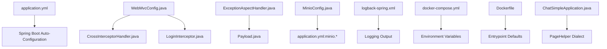
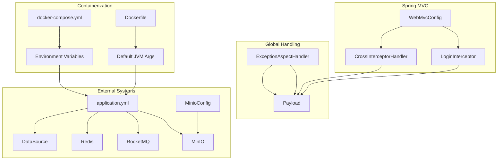
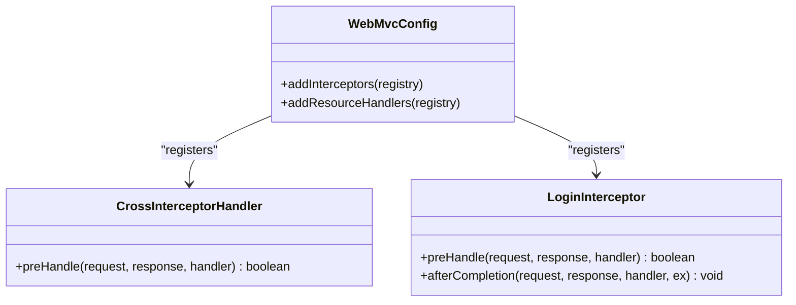
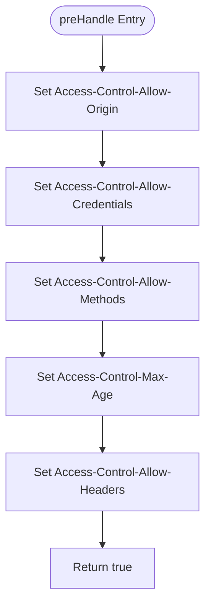
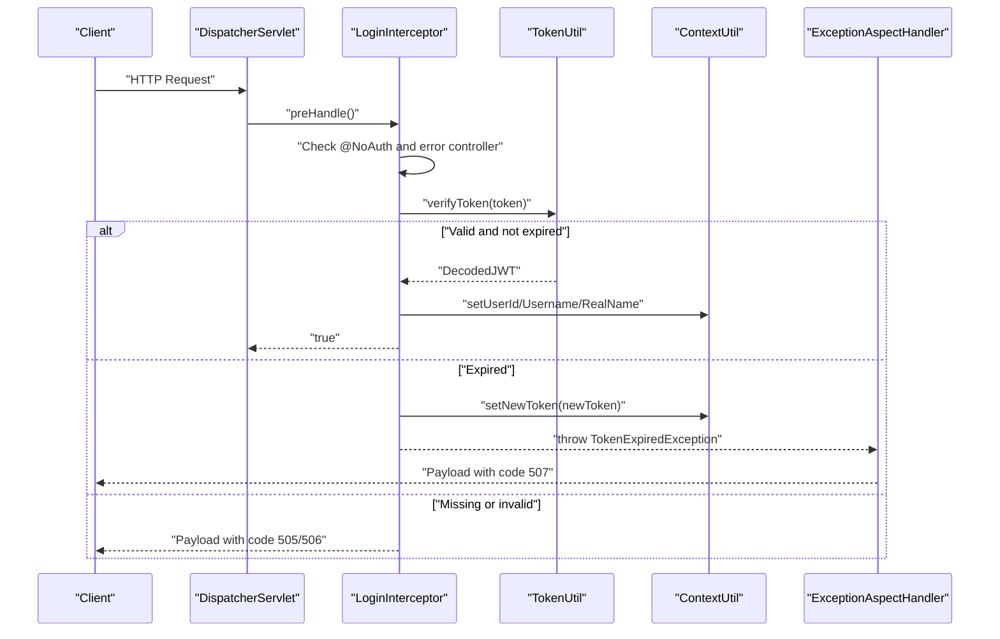
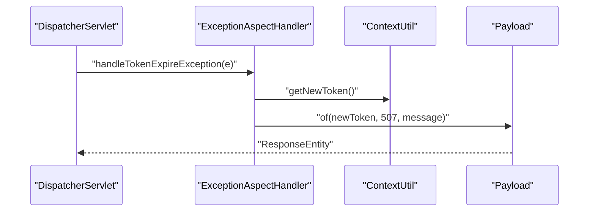
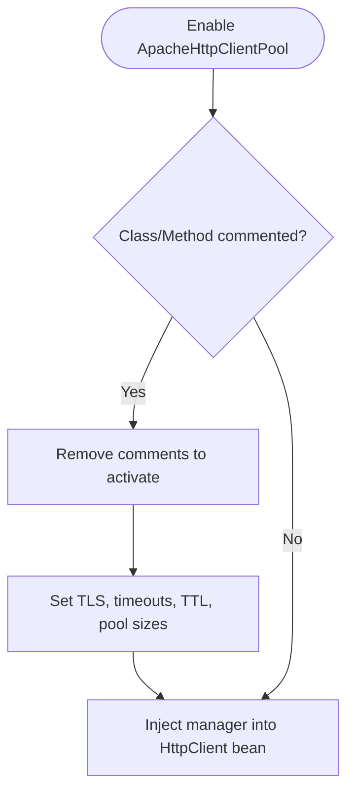
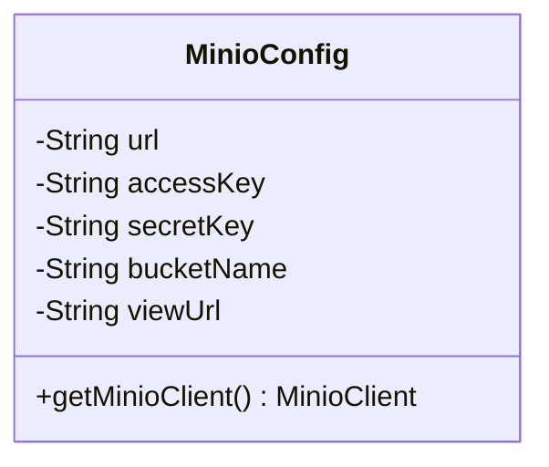
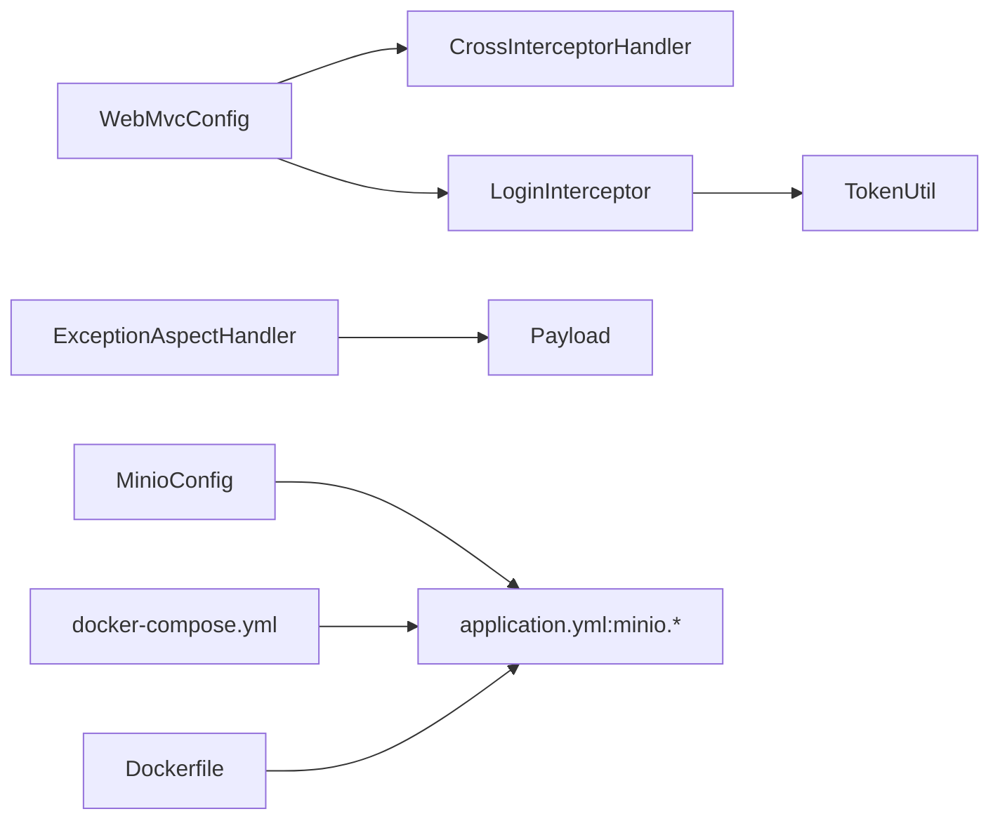

# Configuration and Environment Setup

<cite>
**Referenced Files in This Document**
- [application.yml](file://src/main/resources/application.yml)
- [WebMvcConfig.java](file://src/main/java/com/hch/chat_simple/config/WebMvcConfig.java)
- [CrossInterceptorHandler.java](file://src/main/java/com/hch/chat_simple/config/CrossInterceptorHandler.java)
- [LoginInterceptor.java](file://src/main/java/com/hch/chat_simple/config/LoginInterceptor.java)
- [ExceptionAspectHandler.java](file://src/main/java/com/hch/chat_simple/config/ExceptionAspectHandler.java)
- [ApacheHttpClientPool.java](file://src/main/java/com/hch/chat_simple/config/ApacheHttpClientPool.java)
- [MinioConfig.java](file://src/main/java/com/hch/chat_simple/config/MinioConfig.java)
- [logback-spring.xml](file://src/main/resources/logback-spring.xml)
- [docker-compose.yml](file://docker-compose.yml)
- [Dockerfile](file://Dockerfile)
- [ChatSimpleApplication.java](file://src/main/java/com/hch/chat_simple/ChatSimpleApplication.java)
- [TokenUtil.java](file://src/main/java/com/hch/chat_simple/util/TokenUtil.java)
- [Payload.java](file://src/main/java/com/hch/chat_simple/util/Payload.java)
- [StatusCodeEnum.java](file://src/main/java/com/hch/chat_simple/util/StatusCodeEnum.java)
</cite>

## Table of Contents
1. [Introduction](#introduction)
2. [Project Structure](#project-structure)
3. [Core Components](#core-components)
4. [Architecture Overview](#architecture-overview)
5. [Detailed Component Analysis](#detailed-component-analysis)
6. [Dependency Analysis](#dependency-analysis)
7. [Performance Considerations](#performance-considerations)
8. [Troubleshooting Guide](#troubleshooting-guide)
9. [Conclusion](#conclusion)
10. [Appendices](#appendices)

## Introduction
This document explains how to configure and deploy the application across development, testing, and production environments. It covers:
- application.yml configuration for databases, message queues, cloud storage, and security-related settings
- Spring MVC customization via WebMvcConfig, including interceptors and resource handlers
- Global exception handling with ExceptionAspectHandler
- CORS policy enforcement via CrossInterceptorHandler
- HTTP client management and connection pooling (Apache HttpClient pool)
- Environment-specific configuration via Docker Compose and Dockerfile
- Logging configuration and health checks
- Property override mechanisms and environment variable usage

## Project Structure
The configuration surface spans Spring Boot configuration files, Java-based configuration classes, and container orchestration files. Key areas:
- Centralized configuration: application.yml
- MVC and interceptors: WebMvcConfig, CrossInterceptorHandler, LoginInterceptor
- Global exception handling: ExceptionAspectHandler
- Cloud storage: MinioConfig
- Logging: logback-spring.xml
- Containerization: docker-compose.yml, Dockerfile
- Application bootstrap: ChatSimpleApplication

**Diagram sources**
- [application.yml:1-89](file://src/main/resources/application.yml#L1-L89)
- [WebMvcConfig.java:1-28](file://src/main/java/com/hch/chat_simple/config/WebMvcConfig.java#L1-L28)
- [CrossInterceptorHandler.java:1-28](file://src/main/java/com/hch/chat_simple/config/CrossInterceptorHandler.java#L1-L28)
- [LoginInterceptor.java:1-109](file://src/main/java/com/hch/chat_simple/config/LoginInterceptor.java#L1-L109)
- [ExceptionAspectHandler.java:1-24](file://src/main/java/com/hch/chat_simple/config/ExceptionAspectHandler.java#L1-L24)
- [MinioConfig.java:1-33](file://src/main/java/com/hch/chat_simple/config/MinioConfig.java#L1-L33)
- [logback-spring.xml:1-24](file://src/main/resources/logback-spring.xml#L1-L24)
- [docker-compose.yml:1-132](file://docker-compose.yml#L1-L132)
- [Dockerfile:1-12](file://Dockerfile#L1-L12)
- [ChatSimpleApplication.java:1-25](file://src/main/java/com/hch/chat_simple/ChatSimpleApplication.java#L1-L25)

**Section sources**
- [application.yml:1-89](file://src/main/resources/application.yml#L1-L89)
- [WebMvcConfig.java:1-28](file://src/main/java/com/hch/chat_simple/config/WebMvcConfig.java#L1-L28)
- [CrossInterceptorHandler.java:1-28](file://src/main/java/com/hch/chat_simple/config/CrossInterceptorHandler.java#L1-L28)
- [LoginInterceptor.java:1-109](file://src/main/java/com/hch/chat_simple/config/LoginInterceptor.java#L1-L109)
- [ExceptionAspectHandler.java:1-24](file://src/main/java/com/hch/chat_simple/config/ExceptionAspectHandler.java#L1-L24)
- [MinioConfig.java:1-33](file://src/main/java/com/hch/chat_simple/config/MinioConfig.java#L1-L33)
- [logback-spring.xml:1-24](file://src/main/resources/logback-spring.xml#L1-L24)
- [docker-compose.yml:1-132](file://docker-compose.yml#L1-L132)
- [Dockerfile:1-12](file://Dockerfile#L1-L12)
- [ChatSimpleApplication.java:1-25](file://src/main/java/com/hch/chat_simple/ChatSimpleApplication.java#L1-L25)

## Core Components
- Database and Redis: configured under spring.data and spring.datasource; MyBatis-Plus and PageHelper are enabled.
- Message Queue: RocketMQ name-server, producer/consumer groups, and topics are defined.
- Redisson: cluster-independent single-server configuration bound to Spring Redis properties.
- Cloud Storage: MinIO client bean created from minio.* properties.
- Security and CORS: CrossInterceptorHandler enforces CORS headers; LoginInterceptor validates JWT tokens and sets context.
- Global Exceptions: ExceptionAspectHandler standardizes error responses using Payload.
- Logging: Console appender with debug logs for SQL and mapper packages.
- Containerization: docker-compose orchestrates services and exposes environment variables; Dockerfile sets defaults and timezone.

**Section sources**
- [application.yml:1-89](file://src/main/resources/application.yml#L1-L89)
- [MinioConfig.java:1-33](file://src/main/java/com/hch/chat_simple/config/MinioConfig.java#L1-L33)
- [WebMvcConfig.java:1-28](file://src/main/java/com/hch/chat_simple/config/WebMvcConfig.java#L1-L28)
- [CrossInterceptorHandler.java:1-28](file://src/main/java/com/hch/chat_simple/config/CrossInterceptorHandler.java#L1-L28)
- [LoginInterceptor.java:1-109](file://src/main/java/com/hch/chat_simple/config/LoginInterceptor.java#L1-L109)
- [ExceptionAspectHandler.java:1-24](file://src/main/java/com/hch/chat_simple/config/ExceptionAspectHandler.java#L1-L24)
- [logback-spring.xml:1-24](file://src/main/resources/logback-spring.xml#L1-L24)
- [docker-compose.yml:1-132](file://docker-compose.yml#L1-L132)
- [Dockerfile:1-12](file://Dockerfile#L1-L12)

## Architecture Overview
The configuration architecture integrates Spring Boot auto-configuration with explicit MVC and security beans. Interceptors enforce CORS and authentication; global exception handling ensures consistent error payloads. External systems (MySQL, Redis, RocketMQ, MinIO) are wired via properties and dedicated configuration classes.

**Diagram sources**
- [WebMvcConfig.java:1-28](file://src/main/java/com/hch/chat_simple/config/WebMvcConfig.java#L1-L28)
- [CrossInterceptorHandler.java:1-28](file://src/main/java/com/hch/chat_simple/config/CrossInterceptorHandler.java#L1-L28)
- [LoginInterceptor.java:1-109](file://src/main/java/com/hch/chat_simple/config/LoginInterceptor.java#L1-L109)
- [ExceptionAspectHandler.java:1-24](file://src/main/java/com/hch/chat_simple/config/ExceptionAspectHandler.java#L1-L24)
- [Payload.java:1-30](file://src/main/java/com/hch/chat_simple/util/Payload.java#L1-L30)
- [application.yml:1-89](file://src/main/resources/application.yml#L1-L89)
- [MinioConfig.java:1-33](file://src/main/java/com/hch/chat_simple/config/MinioConfig.java#L1-L33)
- [docker-compose.yml:1-132](file://docker-compose.yml#L1-L132)
- [Dockerfile:1-12](file://Dockerfile#L1-L12)

## Detailed Component Analysis

### application.yml Configuration Reference
- Datasource: JDBC URL, driver, credentials, and MyBatis-Plus logic delete configuration.
- Redis: host, port, database, and Lettuce pool settings; Redisson single-server configuration bound to Spring Redis properties.
- MVC: Path matcher strategy.
- PageHelper: dialect and pagination parameters.
- RocketMQ: Name server, producer/consumer groups, and topic names.
- MinIO: Access keys, bucket, secure flag, and endpoint URL.
- Server: HTTP server port and internal chat server port.
- chat.tags: Tag list, local mode flag, and current tag selection.

Property override and environment variable usage:
- Docker Compose sets environment variables for MySQL URL/password, Redis host, RocketMQ name-server, MinIO URL, and chat tag current value.
- Dockerfile passes default JVM arguments for server and chat server ports.

**Section sources**
- [application.yml:1-89](file://src/main/resources/application.yml#L1-L89)
- [docker-compose.yml:18-24](file://docker-compose.yml#L18-L24)
- [Dockerfile:11-12](file://Dockerfile#L11-L12)

### WebMvcConfig: Spring MVC Customization
- Registers CrossInterceptorHandler for all paths to enforce CORS headers.
- Registers LoginInterceptor for all paths except login, error, and Swagger endpoints.
- Exposes Swagger UI and webjars resource handlers.

**Diagram sources**
- [WebMvcConfig.java:1-28](file://src/main/java/com/hch/chat_simple/config/WebMvcConfig.java#L1-L28)
- [CrossInterceptorHandler.java:1-28](file://src/main/java/com/hch/chat_simple/config/CrossInterceptorHandler.java#L1-L28)
- [LoginInterceptor.java:1-109](file://src/main/java/com/hch/chat_simple/config/LoginInterceptor.java#L1-L109)

**Section sources**
- [WebMvcConfig.java:1-28](file://src/main/java/com/hch/chat_simple/config/WebMvcConfig.java#L1-L28)

### CrossInterceptorHandler: CORS Policy Enforcement
- Sets Access-Control-Allow-Origin to a fixed frontend origin.
- Enables credentials, allows selected HTTP methods, sets preflight cache, and whitelists headers.

**Diagram sources**
- [CrossInterceptorHandler.java:1-28](file://src/main/java/com/hch/chat_simple/config/CrossInterceptorHandler.java#L1-L28)

**Section sources**
- [CrossInterceptorHandler.java:1-28](file://src/main/java/com/hch/chat_simple/config/CrossInterceptorHandler.java#L1-L28)

### LoginInterceptor: Authentication and Context Management
- Skips interception for endpoints annotated with @NoAuth or handled by BasicErrorController.
- Extracts token from request header, verifies JWT, and populates thread-local context.
- On expired token, generates a new token and triggers ExceptionAspectHandler to return standardized error payload.

**Diagram sources**
- [LoginInterceptor.java:1-109](file://src/main/java/com/hch/chat_simple/config/LoginInterceptor.java#L1-L109)
- [TokenUtil.java:1-71](file://src/main/java/com/hch/chat_simple/util/TokenUtil.java#L1-L71)
- [ExceptionAspectHandler.java:1-24](file://src/main/java/com/hch/chat_simple/config/ExceptionAspectHandler.java#L1-L24)

**Section sources**
- [LoginInterceptor.java:1-109](file://src/main/java/com/hch/chat_simple/config/LoginInterceptor.java#L1-L109)
- [TokenUtil.java:1-71](file://src/main/java/com/hch/chat_simple/util/TokenUtil.java#L1-L71)

### ExceptionAspectHandler: Global Exception Handling
- Catches TokenExpiredException and returns a standardized Payload with a refreshed token and error code.

**Diagram sources**
- [ExceptionAspectHandler.java:1-24](file://src/main/java/com/hch/chat_simple/config/ExceptionAspectHandler.java#L1-L24)
- [Payload.java:1-30](file://src/main/java/com/hch/chat_simple/util/Payload.java#L1-L30)

**Section sources**
- [ExceptionAspectHandler.java:1-24](file://src/main/java/com/hch/chat_simple/config/ExceptionAspectHandler.java#L1-L24)
- [Payload.java:1-30](file://src/main/java/com/hch/chat_simple/util/Payload.java#L1-L30)

### ApacheHttpClientPool: HTTP Client Management
- A commented-out configuration demonstrates how to build a PoolingHttpClientConnectionManager with TLS and connection policies.
- To enable, remove comments around the class and method, and wire the manager into an Apache HttpClient bean.

**Diagram sources**
- [ApacheHttpClientPool.java:1-78](file://src/main/java/com/hch/chat_simple/config/ApacheHttpClientPool.java#L1-L78)

**Section sources**
- [ApacheHttpClientPool.java:1-78](file://src/main/java/com/hch/chat_simple/config/ApacheHttpClientPool.java#L1-L78)

### MinioConfig: Cloud Storage Parameters
- Binds to minio.* properties and creates a MinioClient bean for file operations.

**Diagram sources**
- [MinioConfig.java:1-33](file://src/main/java/com/hch/chat_simple/config/MinioConfig.java#L1-L33)
- [application.yml:84-89](file://src/main/resources/application.yml#L84-L89)

**Section sources**
- [MinioConfig.java:1-33](file://src/main/java/com/hch/chat_simple/config/MinioConfig.java#L1-L33)
- [application.yml:84-89](file://src/main/resources/application.yml#L84-L89)

### Logging Configuration
- Console appender pattern includes timestamp, level, logger, and message.
- SQL and mapper logs are set to DEBUG for visibility during development.

**Section sources**
- [logback-spring.xml:1-24](file://src/main/resources/logback-spring.xml#L1-L24)

### Health Checks and Monitoring
- MinIO service defines a healthcheck against the live endpoint.
- ChatSimpleApplication registers a PageHelper dialect alias for MySQL.

**Section sources**
- [docker-compose.yml:110-115](file://docker-compose.yml#L110-L115)
- [ChatSimpleApplication.java:18-22](file://src/main/java/com/hch/chat_simple/ChatSimpleApplication.java#L18-L22)

## Dependency Analysis
- WebMvcConfig depends on CrossInterceptorHandler and LoginInterceptor.
- LoginInterceptor depends on TokenUtil and ContextUtil; it triggers ExceptionAspectHandler on token expiration.
- ExceptionAspectHandler depends on Payload and ContextUtil.
- MinioConfig depends on application.yml minio.* properties.
- Docker Compose and Dockerfile provide environment variable overrides and default JVM arguments.

**Diagram sources**
- [WebMvcConfig.java:1-28](file://src/main/java/com/hch/chat_simple/config/WebMvcConfig.java#L1-L28)
- [CrossInterceptorHandler.java:1-28](file://src/main/java/com/hch/chat_simple/config/CrossInterceptorHandler.java#L1-L28)
- [LoginInterceptor.java:1-109](file://src/main/java/com/hch/chat_simple/config/LoginInterceptor.java#L1-L109)
- [TokenUtil.java:1-71](file://src/main/java/com/hch/chat_simple/util/TokenUtil.java#L1-L71)
- [ExceptionAspectHandler.java:1-24](file://src/main/java/com/hch/chat_simple/config/ExceptionAspectHandler.java#L1-L24)
- [Payload.java:1-30](file://src/main/java/com/hch/chat_simple/util/Payload.java#L1-L30)
- [MinioConfig.java:1-33](file://src/main/java/com/hch/chat_simple/config/MinioConfig.java#L1-L33)
- [application.yml:1-89](file://src/main/resources/application.yml#L1-L89)
- [docker-compose.yml:1-132](file://docker-compose.yml#L1-L132)
- [Dockerfile:1-12](file://Dockerfile#L1-L12)

**Section sources**
- [WebMvcConfig.java:1-28](file://src/main/java/com/hch/chat_simple/config/WebMvcConfig.java#L1-L28)
- [LoginInterceptor.java:1-109](file://src/main/java/com/hch/chat_simple/config/LoginInterceptor.java#L1-L109)
- [ExceptionAspectHandler.java:1-24](file://src/main/java/com/hch/chat_simple/config/ExceptionAspectHandler.java#L1-L24)
- [MinioConfig.java:1-33](file://src/main/java/com/hch/chat_simple/config/MinioConfig.java#L1-L33)
- [application.yml:1-89](file://src/main/resources/application.yml#L1-L89)
- [docker-compose.yml:1-132](file://docker-compose.yml#L1-L132)
- [Dockerfile:1-12](file://Dockerfile#L1-L12)

## Performance Considerations
- Connection pools: Tune Redis Lettuce pool sizes and Redisson pool sizes according to concurrency needs.
- HTTP client: If enabling ApacheHttpClientPool, adjust socket and connection timeouts, TTL, and pool concurrency/reuse policies.
- Pagination: Ensure PageHelper reasonable paging and dialect alignment to avoid heavy queries.
- Logging: Reduce DEBUG levels in production to minimize I/O overhead.

## Troubleshooting Guide
- CORS failures: Verify Access-Control-Allow-Origin and headers match the frontend origin and headers.
- Token errors: Check token expiration window and ensure ContextUtil.newToken is populated on expiration; confirm Payload error codes align with StatusCodeEnum.
- Database connectivity: Confirm JDBC URL, credentials, and MySQL availability; ensure MyBatis-Plus mapper locations are correct.
- MinIO access: Validate endpoint URL, access keys, bucket name, and MinIO healthcheck status.
- Interceptor bypass: Ensure Swagger exclude patterns and @NoAuth annotations are correctly applied.

**Section sources**
- [CrossInterceptorHandler.java:1-28](file://src/main/java/com/hch/chat_simple/config/CrossInterceptorHandler.java#L1-L28)
- [ExceptionAspectHandler.java:1-24](file://src/main/java/com/hch/chat_simple/config/ExceptionAspectHandler.java#L1-L24)
- [Payload.java:1-30](file://src/main/java/com/hch/chat_simple/util/Payload.java#L1-L30)
- [application.yml:1-89](file://src/main/resources/application.yml#L1-L89)
- [docker-compose.yml:110-115](file://docker-compose.yml#L110-L115)

## Conclusion
The application’s configuration is centralized in application.yml with explicit Spring MVC and security beans. Environment-specific settings are managed via Docker Compose and Dockerfile, enabling straightforward deployment across dev, test, and prod. Global exception handling and standardized payloads improve observability and user experience. Adjust pool sizes, timeouts, and logging levels per environment to balance performance and diagnostics.

## Appendices

### Environment-Specific Configuration Examples
- Development
  - Run locally with defaults; enable SQL and mapper logs in logback-spring.xml.
  - Keep CORS origin aligned with your frontend domain.
- Testing
  - Override datasource and Redis settings via environment variables in docker-compose.
  - Use distinct RocketMQ consumer groups per instance.
- Production
  - Disable DEBUG logs; set production-ready pool sizes.
  - Secure MinIO with TLS and non-default credentials; expose healthchecks externally if needed.

### Property Overrides and External Configuration
- Environment variables in docker-compose override application.yml properties.
- JVM arguments in Dockerfile set default server ports.
- Chat tag current value determines MQ routing tag per instance.

**Section sources**
- [docker-compose.yml:18-24](file://docker-compose.yml#L18-L24)
- [Dockerfile:11-12](file://Dockerfile#L11-L12)
- [application.yml:76-82](file://src/main/resources/application.yml#L76-L82)