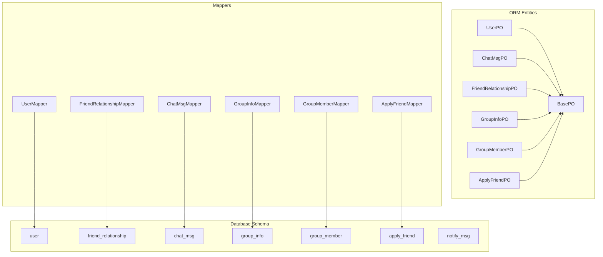
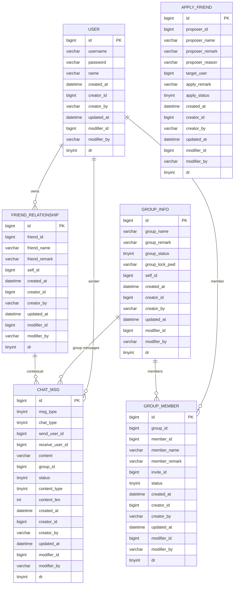
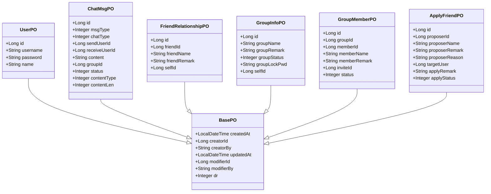
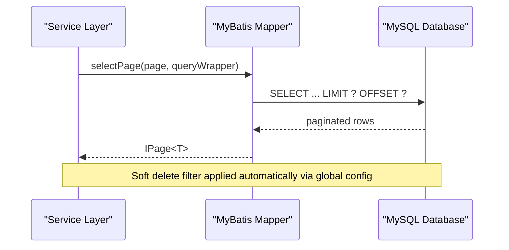
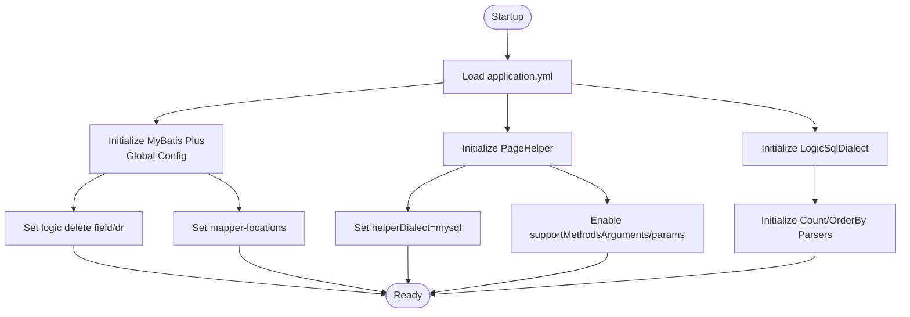

# Data Models and Database Design

<cite>
**Referenced Files in This Document**
- [chat.sql](file://db/chat.sql)
- [BasePO.java](file://src/main/java/com/hch/chat_simple/pojo/po/BasePO.java)
- [UserPO.java](file://src/main/java/com/hch/chat_simple/pojo/po/UserPO.java)
- [ChatMsgPO.java](file://src/main/java/com/hch/chat_simple/pojo/po/ChatMsgPO.java)
- [FriendRelationshipPO.java](file://src/main/java/com/hch/chat_simple/pojo/po/FriendRelationshipPO.java)
- [GroupInfoPO.java](file://src/main/java/com/hch/chat_simple/pojo/po/GroupInfoPO.java)
- [GroupMemberPO.java](file://src/main/java/com/hch/chat_simple/pojo/po/GroupMemberPO.java)
- [ApplyFriendPO.java](file://src/main/java/com/hch/chat_simple/pojo/po/ApplyFriendPO.java)
- [UserMapper.java](file://src/main/java/com/hch/chat_simple/mapper/UserMapper.java)
- [ChatMsgMapper.java](file://src/main/java/com/hch/chat_simple/mapper/ChatMsgMapper.java)
- [FriendRelationshipMapper.java](file://src/main/java/com/hch/chat_simple/mapper/FriendRelationshipMapper.java)
- [GroupInfoMapper.java](file://src/main/java/com/hch/chat_simple/mapper/GroupInfoMapper.java)
- [GroupMemberMapper.java](file://src/main/java/com/hch/chat_simple/mapper/GroupMemberMapper.java)
- [ApplyFriendMapper.java](file://src/main/java/com/hch/chat_simple/mapper/ApplyFriendMapper.java)
- [application.yml](file://src/main/resources/application.yml)
- [LogicSqlDialect.java](file://src/main/java/com/hch/chat_simple/config/LogicSqlDialect.java)
</cite>

## Table of Contents
1. [Introduction](#introduction)
2. [Project Structure](#project-structure)
3. [Core Components](#core-components)
4. [Architecture Overview](#architecture-overview)
5. [Detailed Component Analysis](#detailed-component-analysis)
6. [Dependency Analysis](#dependency-analysis)
7. [Performance Considerations](#performance-considerations)
8. [Troubleshooting Guide](#troubleshooting-guide)
9. [Conclusion](#conclusion)
10. [Appendices](#appendices)

## Introduction
This document provides comprehensive data model documentation for the Chat Simple database schema. It covers entity definitions, relationships, constraints, business rules, MyBatis Plus configurations (including soft delete and logical dialect handling), data access patterns via mapper interfaces, pagination and filtering capabilities, and practical guidance for performance optimization and lifecycle management.

## Project Structure
The Chat Simple project organizes database schema definitions and ORM entities under dedicated packages:
- Database schema: [chat.sql](file://db/chat.sql)
- ORM base and entities: [BasePO.java](file://src/main/java/com/hch/chat_simple/pojo/po/BasePO.java), [UserPO.java](file://src/main/java/com/hch/chat_simple/pojo/po/UserPO.java), [ChatMsgPO.java](file://src/main/java/com/hch/chat_simple/pojo/po/ChatMsgPO.java), [FriendRelationshipPO.java](file://src/main/java/com/hch/chat_simple/pojo/po/FriendRelationshipPO.java), [GroupInfoPO.java](file://src/main/java/com/hch/chat_simple/pojo/po/GroupInfoPO.java), [GroupMemberPO.java](file://src/main/java/com/hch/chat_simple/pojo/po/GroupMemberPO.java), [ApplyFriendPO.java](file://src/main/java/com/hch/chat_simple/pojo/po/ApplyFriendPO.java)
- Mappers: [UserMapper.java](file://src/main/java/com/hch/chat_simple/mapper/UserMapper.java), [ChatMsgMapper.java](file://src/main/java/com/hch/chat_simple/mapper/ChatMsgMapper.java), [FriendRelationshipMapper.java](file://src/main/java/com/hch/chat_simple/mapper/FriendRelationshipMapper.java), [GroupInfoMapper.java](file://src/main/java/com/hch/chat_simple/mapper/GroupInfoMapper.java), [GroupMemberMapper.java](file://src/main/java/com/hch/chat_simple/mapper/GroupMemberMapper.java), [ApplyFriendMapper.java](file://src/main/java/com/hch/chat_simple/mapper/ApplyFriendMapper.java)
- Configuration: [application.yml](file://src/main/resources/application.yml), [LogicSqlDialect.java](file://src/main/java/com/hch/chat_simple/config/LogicSqlDialect.java)

**Diagram sources**
- [chat.sql:5-130](file://db/chat.sql#L5-L130)
- [BasePO.java:14-43](file://src/main/java/com/hch/chat_simple/pojo/po/BasePO.java#L14-L43)
- [UserPO.java:26-46](file://src/main/java/com/hch/chat_simple/pojo/po/UserPO.java#L26-L46)
- [ChatMsgPO.java:18-53](file://src/main/java/com/hch/chat_simple/pojo/po/ChatMsgPO.java#L18-L53)
- [FriendRelationshipPO.java:25-44](file://src/main/java/com/hch/chat_simple/pojo/po/FriendRelationshipPO.java#L25-L44)
- [GroupInfoPO.java:27-49](file://src/main/java/com/hch/chat_simple/pojo/po/GroupInfoPO.java#L27-L49)
- [GroupMemberPO.java:23-48](file://src/main/java/com/hch/chat_simple/pojo/po/GroupMemberPO.java#L23-L48)
- [ApplyFriendPO.java:25-54](file://src/main/java/com/hch/chat_simple/pojo/po/ApplyFriendPO.java#L25-L54)
- [UserMapper.java:18-21](file://src/main/java/com/hch/chat_simple/mapper/UserMapper.java#L18-L21)
- [ChatMsgMapper.java:17-20](file://src/main/java/com/hch/chat_simple/mapper/ChatMsgMapper.java#L17-L20)
- [FriendRelationshipMapper.java:17-20](file://src/main/java/com/hch/chat_simple/mapper/FriendRelationshipMapper.java#L17-L20)
- [GroupInfoMapper.java:17-20](file://src/main/java/com/hch/chat_simple/mapper/GroupInfoMapper.java#L17-L20)
- [GroupMemberMapper.java:17-20](file://src/main/java/com/hch/chat_simple/mapper/GroupMemberMapper.java#L17-L20)
- [ApplyFriendMapper.java:16-19](file://src/main/java/com/hch/chat_simple/mapper/ApplyFriendMapper.java#L16-L19)

**Section sources**
- [chat.sql:1-130](file://db/chat.sql#L1-L130)
- [BasePO.java:1-44](file://src/main/java/com/hch/chat_simple/pojo/po/BasePO.java#L1-L44)
- [UserPO.java:1-47](file://src/main/java/com/hch/chat_simple/pojo/po/UserPO.java#L1-L47)
- [ChatMsgPO.java:1-54](file://src/main/java/com/hch/chat_simple/pojo/po/ChatMsgPO.java#L1-L54)
- [FriendRelationshipPO.java:1-45](file://src/main/java/com/hch/chat_simple/pojo/po/FriendRelationshipPO.java#L1-L45)
- [GroupInfoPO.java:1-50](file://src/main/java/com/hch/chat_simple/pojo/po/GroupInfoPO.java#L1-L50)
- [GroupMemberPO.java:1-49](file://src/main/java/com/hch/chat_simple/pojo/po/GroupMemberPO.java#L1-L49)
- [ApplyFriendPO.java:1-55](file://src/main/java/com/hch/chat_simple/pojo/po/ApplyFriendPO.java#L1-L55)
- [UserMapper.java:1-22](file://src/main/java/com/hch/chat_simple/mapper/UserMapper.java#L1-L22)
- [ChatMsgMapper.java:1-21](file://src/main/java/com/hch/chat_simple/mapper/ChatMsgMapper.java#L1-L21)
- [FriendRelationshipMapper.java:1-21](file://src/main/java/com/hch/chat_simple/mapper/FriendRelationshipMapper.java#L1-L21)
- [GroupInfoMapper.java:1-21](file://src/main/java/com/hch/chat_simple/mapper/GroupInfoMapper.java#L1-L21)
- [GroupMemberMapper.java:1-21](file://src/main/java/com/hch/chat_simple/mapper/GroupMemberMapper.java#L1-L21)
- [ApplyFriendMapper.java:1-20](file://src/main/java/com/hch/chat_simple/mapper/ApplyFriendMapper.java#L1-L20)

## Core Components
This section documents each entity’s fields, data types, primary/foreign keys, and constraints, along with business rules and validation logic embedded in the data models.

- BasePO (common audit/logic fields)
  - Fields: createdAt, creatorId, creatorBy, updatedAt, modifierId, modifierBy, dr (soft delete)
  - Annotations: TableLogic applied to dr; automatic insert/update field filling via TableField with FieldFill
  - Business rules: All entities inherit dr for logical deletion; creation/update timestamps and user metadata are auto-filled

- UserPO
  - Table: user
  - Primary key: id (AUTO_INCREMENT)
  - Fields: username, password, name
  - Inherits: BasePO fields
  - Business rules: Username/password/name are user identity fields; dr enables soft deletion

- ChatMsgPO
  - Table: chat_msg
  - Primary key: id (AUTO_INCREMENT)
  - Fields: msgType, chatType, sendUserId, receiveUserId, content, groupId, status, contentType, contentLen
  - Inherits: BasePO fields
  - Constraints and business rules:
    - chatType distinguishes single/group chat
    - receiveUserId is null for group messages; groupId must be present for group chat
    - contentType indicates textual or voice content; contentLen reflects length
    - status indicates send success/failure

- FriendRelationshipPO
  - Table: friend_relationship
  - Primary key: id (AUTO_INCREMENT)
  - Fields: friendId, friendName, friendRemark, selfId
  - Inherits: BasePO fields
  - Business rules: selfId identifies the owner of the friendship record; friendId is the linked user

- GroupInfoPO
  - Table: group_info
  - Primary key: id (AUTO_INCREMENT)
  - Fields: groupName, groupRemark, groupStatus, groupLockPwd, selfId
  - Inherits: BasePO fields
  - Business rules: groupStatus encodes join policy; selfId is the group owner

- GroupMemberPO
  - Table: group_member
  - Primary key: id (AUTO_INCREMENT)
  - Fields: groupId, memberId, memberName, memberRemark, inviteId, status
  - Inherits: BasePO fields
  - Business rules: status defaults to “in-group”; inviteId tracks who invited the member

- ApplyFriendPO
  - Table: apply_friend
  - Primary key: id (AUTO_INCREMENT)
  - Fields: proposerId, proposerName, proposerRemark, proposerReason, targetUser, applyRemark, applyStatus
  - Inherits: BasePO fields
  - Business rules: applyStatus encodes pending/approved/rejected; applyRemark is stored for later display

**Section sources**
- [BasePO.java:14-43](file://src/main/java/com/hch/chat_simple/pojo/po/BasePO.java#L14-L43)
- [UserPO.java:25-46](file://src/main/java/com/hch/chat_simple/pojo/po/UserPO.java#L25-L46)
- [ChatMsgPO.java:16-53](file://src/main/java/com/hch/chat_simple/pojo/po/ChatMsgPO.java#L16-L53)
- [FriendRelationshipPO.java:23-44](file://src/main/java/com/hch/chat_simple/pojo/po/FriendRelationshipPO.java#L23-L44)
- [GroupInfoPO.java:25-49](file://src/main/java/com/hch/chat_simple/pojo/po/GroupInfoPO.java#L25-L49)
- [GroupMemberPO.java:21-48](file://src/main/java/com/hch/chat_simple/pojo/po/GroupMemberPO.java#L21-L48)
- [ApplyFriendPO.java:23-54](file://src/main/java/com/hch/chat_simple/pojo/po/ApplyFriendPO.java#L23-L54)
- [chat.sql:5-130](file://db/chat.sql#L5-L130)

## Architecture Overview
The data model follows a relational schema with logical deletion enabled via MyBatis Plus. The ORM layer maps Java entities to database tables, while mappers provide CRUD and query operations. Pagination and ordering are supported through PageHelper with a custom MySQL dialect wrapper.

**Diagram sources**
- [chat.sql:5-130](file://db/chat.sql#L5-L130)
- [UserPO.java:25-46](file://src/main/java/com/hch/chat_simple/pojo/po/UserPO.java#L25-L46)
- [ChatMsgPO.java:16-53](file://src/main/java/com/hch/chat_simple/pojo/po/ChatMsgPO.java#L16-L53)
- [FriendRelationshipPO.java:23-44](file://src/main/java/com/hch/chat_simple/pojo/po/FriendRelationshipPO.java#L23-L44)
- [GroupInfoPO.java:25-49](file://src/main/java/com/hch/chat_simple/pojo/po/GroupInfoPO.java#L25-L49)
- [GroupMemberPO.java:21-48](file://src/main/java/com/hch/chat_simple/pojo/po/GroupMemberPO.java#L21-L48)
- [ApplyFriendPO.java:23-54](file://src/main/java/com/hch/chat_simple/pojo/po/ApplyFriendPO.java#L23-L54)

## Detailed Component Analysis

### Entity Relationship and Constraints
- UserPO
  - Primary key: id
  - Soft delete: inherited via BasePO.dr
  - No explicit foreign keys in schema; relationships are enforced by application/business logic

- ChatMsgPO
  - Primary key: id
  - Foreign keys: sendUserId -> User.id, receiveUserId -> User.id (when applicable), groupId -> GroupInfo.id
  - Business constraints:
    - chatType = 0 implies single chat; receiveUserId must be present and groupId null
    - chatType = 1 implies group chat; groupId must be present and receiveUserId null
    - contentType and contentLen provide content metadata

- FriendRelationshipPO
  - Primary key: id
  - Foreign keys: friendId -> User.id, selfId -> User.id
  - Business rule: selfId identifies the user owning the relationship record

- GroupInfoPO
  - Primary key: id
  - Foreign keys: selfId -> User.id
  - Business rule: groupStatus encodes join policy; selfId is the group owner

- GroupMemberPO
  - Primary key: id
  - Foreign keys: groupId -> GroupInfo.id, memberId -> User.id, inviteId -> User.id
  - Business rule: status defaults to “in-group”; inviteId records who invited the member

- ApplyFriendPO
  - Primary key: id
  - Foreign keys: proposerId -> User.id, targetUser -> User.id
  - Business rule: applyStatus encodes pending/approved/rejected; applyRemark is stored for display

**Diagram sources**
- [BasePO.java:14-43](file://src/main/java/com/hch/chat_simple/pojo/po/BasePO.java#L14-L43)
- [UserPO.java:25-46](file://src/main/java/com/hch/chat_simple/pojo/po/UserPO.java#L25-L46)
- [ChatMsgPO.java:16-53](file://src/main/java/com/hch/chat_simple/pojo/po/ChatMsgPO.java#L16-L53)
- [FriendRelationshipPO.java:23-44](file://src/main/java/com/hch/chat_simple/pojo/po/FriendRelationshipPO.java#L23-L44)
- [GroupInfoPO.java:25-49](file://src/main/java/com/hch/chat_simple/pojo/po/GroupInfoPO.java#L25-L49)
- [GroupMemberPO.java:21-48](file://src/main/java/com/hch/chat_simple/pojo/po/GroupMemberPO.java#L21-L48)
- [ApplyFriendPO.java:23-54](file://src/main/java/com/hch/chat_simple/pojo/po/ApplyFriendPO.java#L23-L54)

**Section sources**
- [chat.sql:5-130](file://db/chat.sql#L5-L130)
- [BasePO.java:14-43](file://src/main/java/com/hch/chat_simple/pojo/po/BasePO.java#L14-L43)
- [UserPO.java:25-46](file://src/main/java/com/hch/chat_simple/pojo/po/UserPO.java#L25-L46)
- [ChatMsgPO.java:16-53](file://src/main/java/com/hch/chat_simple/pojo/po/ChatMsgPO.java#L16-L53)
- [FriendRelationshipPO.java:23-44](file://src/main/java/com/hch/chat_simple/pojo/po/FriendRelationshipPO.java#L23-L44)
- [GroupInfoPO.java:25-49](file://src/main/java/com/hch/chat_simple/pojo/po/GroupInfoPO.java#L25-L49)
- [GroupMemberPO.java:21-48](file://src/main/java/com/hch/chat_simple/pojo/po/GroupMemberPO.java#L21-L48)
- [ApplyFriendPO.java:23-54](file://src/main/java/com/hch/chat_simple/pojo/po/ApplyFriendPO.java#L23-L54)

### Business Rules and Validation Logic
- Logical deletion
  - All entities inherit dr (tinyint) from BasePO; MyBatis Plus configuration treats dr as the logic delete field with values 0 (not deleted) and 1 (deleted)
- Audit fields
  - createdAt/updatedAt and creator/modifier metadata are automatically filled on insert/update
- Chat message rules
  - Single vs group chat determined by chatType; mutual exclusivity of receiveUserId and groupId
  - contentType/contentLen provide content metadata for downstream processing
- Group membership
  - Default status “in-group” supports immediate activity upon joining
- Friend application
  - applyStatus encodes lifecycle; applyRemark persists for display after approval

**Section sources**
- [BasePO.java:14-43](file://src/main/java/com/hch/chat_simple/pojo/po/BasePO.java#L14-L43)
- [application.yml:24-32](file://src/main/resources/application.yml#L24-L32)
- [ChatMsgPO.java:23-51](file://src/main/java/com/hch/chat_simple/pojo/po/ChatMsgPO.java#L23-L51)

### Data Access Patterns via Mappers
- Mapper interfaces extend BaseMapper<T>, inheriting standard CRUD and query methods
- Typical usage patterns:
  - Select by id: selectById
  - Insert/update: insert/updateById/update
  - Delete: deleteById (logical delete via dr)
  - Query with conditions: selectList, selectPage, plus custom XML queries
- Pagination and filtering
  - PageHelper configured for MySQL; supportMethodsArguments and params enable page parameter propagation
  - Custom logic dialect wrapper ensures count/order parsing compatibility

**Diagram sources**
- [application.yml:34-38](file://src/main/resources/application.yml#L34-L38)
- [LogicSqlDialect.java:12-19](file://src/main/java/com/hch/chat_simple/config/LogicSqlDialect.java#L12-L19)
- [UserMapper.java:18-21](file://src/main/java/com/hch/chat_simple/mapper/UserMapper.java#L18-L21)

**Section sources**
- [UserMapper.java:18-21](file://src/main/java/com/hch/chat_simple/mapper/UserMapper.java#L18-L21)
- [ChatMsgMapper.java:17-20](file://src/main/java/com/hch/chat_simple/mapper/ChatMsgMapper.java#L17-L20)
- [FriendRelationshipMapper.java:17-20](file://src/main/java/com/hch/chat_simple/mapper/FriendRelationshipMapper.java#L17-L20)
- [GroupInfoMapper.java:17-20](file://src/main/java/com/hch/chat_simple/mapper/GroupInfoMapper.java#L17-L20)
- [GroupMemberMapper.java:17-20](file://src/main/java/com/hch/chat_simple/mapper/GroupMemberMapper.java#L17-L20)
- [ApplyFriendMapper.java:16-19](file://src/main/java/com/hch/chat_simple/mapper/ApplyFriendMapper.java#L16-L19)
- [application.yml:34-38](file://src/main/resources/application.yml#L34-L38)
- [LogicSqlDialect.java:12-19](file://src/main/java/com/hch/chat_simple/config/LogicSqlDialect.java#L12-L19)

### Sample Data Examples and Common Queries
- Sample data examples
  - UserPO: id, username, password, name; dr default 0
  - ChatMsgPO: msgType, chatType, sendUserId, receiveUserId or groupId, content, contentType, contentLen, status
  - FriendRelationshipPO: friendId, friendName, friendRemark, selfId
  - GroupInfoPO: groupName, groupRemark, groupStatus, groupLockPwd, selfId
  - GroupMemberPO: groupId, memberId, memberName, memberRemark, inviteId, status
  - ApplyFriendPO: proposerId, proposerName, proposerRemark, proposerReason, targetUser, applyRemark, applyStatus
- Common query scenarios
  - Paginated chat history per user or group
  - List friends for a user
  - Retrieve pending friend applications
  - Fetch group members with status filters
  - Soft-deleted records are excluded by default via global logic delete configuration

[No sources needed since this section provides general guidance]

## Dependency Analysis
- MyBatis Plus configuration
  - Global logic delete: logic-delete-field dr, logic-delete-value 1, logic-not-delete-value 0
  - Mapper locations: classpath:/mapper/**/*.xml
- PageHelper configuration
  - Dialect: mysql
  - reasonable, supportMethodsArguments, params for page argument propagation
- Custom SQL dialect
  - LogicSqlDialect extends MySqlDialect and initializes parsers via properties

**Diagram sources**
- [application.yml:24-32](file://src/main/resources/application.yml#L24-L32)
- [application.yml:34-38](file://src/main/resources/application.yml#L34-L38)
- [LogicSqlDialect.java:12-19](file://src/main/java/com/hch/chat_simple/config/LogicSqlDialect.java#L12-L19)

**Section sources**
- [application.yml:24-32](file://src/main/resources/application.yml#L24-L32)
- [application.yml:34-38](file://src/main/resources/application.yml#L34-L38)
- [LogicSqlDialect.java:12-19](file://src/main/java/com/hch/chat_simple/config/LogicSqlDialect.java#L12-L19)

## Performance Considerations
- Indexing strategies
  - Primary keys: implicit index on id for all tables
  - Frequently filtered/sorted columns:
    - ChatMsgPO: sendUserId, receiveUserId, groupId, chatType, msgType, created_at
    - GroupMemberPO: memberId, groupId, status
    - FriendRelationshipPO: selfId, friendId
    - ApplyFriendPO: targetUser, proposerId, applyStatus
  - Composite indexes:
    - ChatMsgPO: (sendUserId, created_at), (receiveUserId, created_at), (groupId, created_at)
    - GroupMemberPO: (memberId, status), (groupId, status)
- Query patterns
  - Prefer selective projections to reduce payload
  - Use PageHelper with reasonable limits to avoid large result sets
  - Leverage soft delete filtering transparently via global config
- Data lifecycle
  - Retention policies: define TTL for chat_msg and notify_msg; archive or purge old records periodically
  - Group lifecycle: remove inactive members (status=1) after policy-defined periods

[No sources needed since this section provides general guidance]

## Troubleshooting Guide
- Soft delete behavior
  - Ensure dr is not manually overwritten; rely on MyBatis Plus logic delete updates
  - Verify global configuration for logic-delete-field/value
- Pagination issues
  - Confirm PageHelper parameters and supportMethodsArguments are enabled
  - Validate custom dialect initialization if count/order parsing errors occur
- Audit fields
  - If createdAt/updatedAt appear null, check TableField fill annotations and ensure insert/update operations are performed via MyBatis Plus

**Section sources**
- [application.yml:24-32](file://src/main/resources/application.yml#L24-L32)
- [application.yml:34-38](file://src/main/resources/application.yml#L34-L38)
- [BasePO.java:14-43](file://src/main/java/com/hch/chat_simple/pojo/po/BasePO.java#L14-L43)

## Conclusion
The Chat Simple data model leverages a clean relational schema with logical deletion and robust audit fields. MyBatis Plus simplifies data access with automatic field filling and global logic delete handling. PageHelper and a custom MySQL dialect wrapper support efficient pagination and ordering. Proper indexing and query patterns, combined with clear business rules, ensure maintainable and performant operations across users, chats, groups, and friend relationships.

[No sources needed since this section summarizes without analyzing specific files]

## Appendices

### Database Schema and Indexing Recommendations
- Tables and columns
  - user: id, username, password, name, dr, audit fields
  - friend_relationship: id, friendId, friendName, friendRemark, selfId, dr, audit fields
  - chat_msg: id, msgType, chatType, sendUserId, receiveUserId, content, groupId, status, contentType, contentLen, dr, audit fields
  - group_info: id, groupName, groupRemark, groupStatus, groupLockPwd, selfId, dr, audit fields
  - group_member: id, groupId, memberId, memberName, memberRemark, inviteId, status, dr, audit fields
  - apply_friend: id, proposerId, proposerName, proposerRemark, proposerReason, targetUser, applyRemark, applyStatus, dr, audit fields
- Recommended indexes
  - chat_msg: (sendUserId, created_at), (receiveUserId, created_at), (groupId, created_at), (chatType, created_at)
  - group_member: (memberId, status), (groupId, status)
  - friend_relationship: (selfId, friendId)
  - apply_friend: (targetUser, applyStatus), (proposerId, applyStatus)

**Section sources**
- [chat.sql:5-130](file://db/chat.sql#L5-L130)