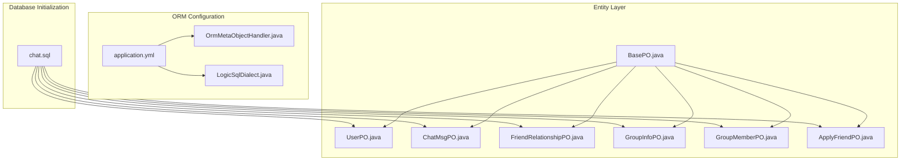
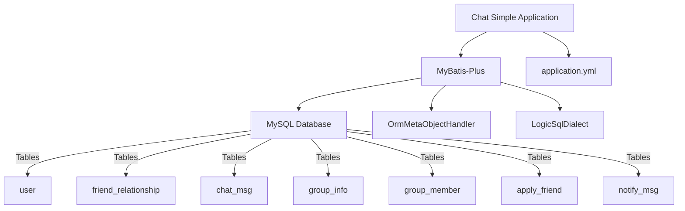
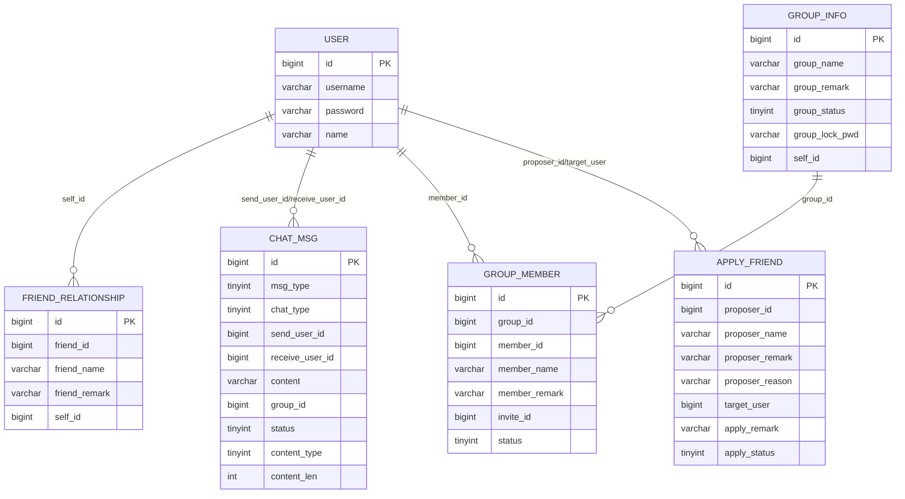
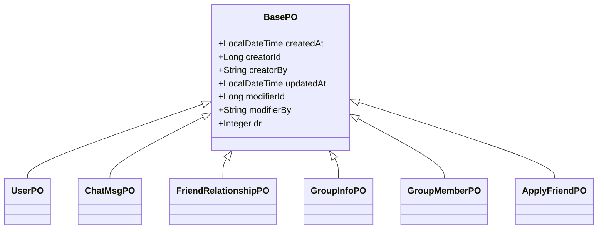
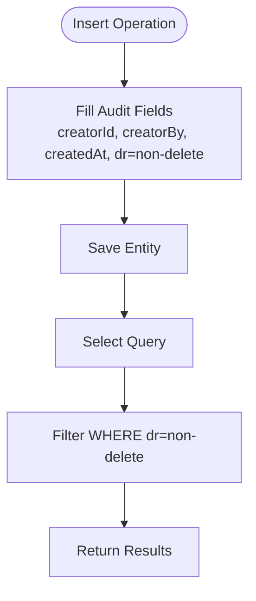
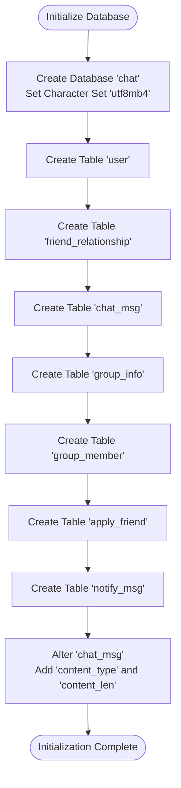
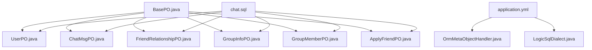

# Database Schema Overview

<cite>
**Referenced Files in This Document**
- [BasePO.java](file://src/main/java/com/hch/chat_simple/pojo/po/BasePO.java)
- [UserPO.java](file://src/main/java/com/hch/chat_simple/pojo/po/UserPO.java)
- [ChatMsgPO.java](file://src/main/java/com/hch/chat_simple/pojo/po/ChatMsgPO.java)
- [FriendRelationshipPO.java](file://src/main/java/com/hch/chat_simple/pojo/po/FriendRelationshipPO.java)
- [GroupInfoPO.java](file://src/main/java/com/hch/chat_simple/pojo/po/GroupInfoPO.java)
- [GroupMemberPO.java](file://src/main/java/com/hch/chat_simple/pojo/po/GroupMemberPO.java)
- [ApplyFriendPO.java](file://src/main/java/com/hch/chat_simple/pojo/po/ApplyFriendPO.java)
- [chat.sql](file://db/chat.sql)
- [application.yml](file://src/main/resources/application.yml)
- [OrmMetaObjectHandler.java](file://src/main/java/com/hch/chat_simple/config/OrmMetaObjectHandler.java)
- [LogicSqlDialect.java](file://src/main/java/com/hch/chat_simple/config/LogicSqlDialect.java)
- [UserMapper.xml](file://src/main/resources/mapper/UserMapper.xml)
- [ChatMsgMapper.xml](file://src/main/resources/mapper/ChatMsgMapper.xml)
- [FriendRelationshipMapper.xml](file://src/main/resources/mapper/FriendRelationshipMapper.xml)
- [GroupInfoMapper.xml](file://src/main/resources/mapper/GroupInfoMapper.xml)
- [GroupMemberMapper.xml](file://src/main/resources/mapper/GroupMemberMapper.xml)
- [ApplyFriendMapper.xml](file://src/main/resources/mapper/ApplyFriendMapper.xml)
</cite>

## Table of Contents
1. [Introduction](#introduction)
2. [Project Structure](#project-structure)
3. [Core Components](#core-components)
4. [Architecture Overview](#architecture-overview)
5. [Detailed Component Analysis](#detailed-component-analysis)
6. [Dependency Analysis](#dependency-analysis)
7. [Performance Considerations](#performance-considerations)
8. [Troubleshooting Guide](#troubleshooting-guide)
9. [Conclusion](#conclusion)
10. [Appendices](#appendices)

## Introduction
This document provides a comprehensive database schema overview for the Chat Simple application. It details the complete database structure, including all tables, their relationships, and the overall system architecture. It also documents the BasePO class inheritance pattern and common fields shared across entities, the database initialization script structure, and the table creation order. Entity relationship diagrams illustrate foreign key relationships and cardinality between tables. Indexing strategies, primary key configurations, and constraint definitions are explained alongside the logical deletion mechanism using the @TableLogic annotation. Migration strategies and schema evolution guidelines are included, along with database performance considerations and best practices.

## Project Structure
The database schema is defined by a MySQL initialization script and is mapped to Java entities via MyBatis-Plus annotations. The application configuration defines the data source and MyBatis-Plus settings for logical deletion and metadata filling.

**Diagram sources**
- [chat.sql:1-130](file://db/chat.sql#L1-L130)
- [application.yml:16-32](file://src/main/resources/application.yml#L16-L32)
- [OrmMetaObjectHandler.java:14-33](file://src/main/java/com/hch/chat_simple/config/OrmMetaObjectHandler.java#L14-L33)
- [LogicSqlDialect.java:12-20](file://src/main/java/com/hch/chat_simple/config/LogicSqlDialect.java#L12-L20)
- [BasePO.java:14-42](file://src/main/java/com/hch/chat_simple/pojo/po/BasePO.java#L14-L42)
- [UserPO.java:22-46](file://src/main/java/com/hch/chat_simple/pojo/po/UserPO.java#L22-L46)
- [ChatMsgPO.java:14-53](file://src/main/java/com/hch/chat_simple/pojo/po/ChatMsgPO.java#L14-L53)
- [FriendRelationshipPO.java:13-44](file://src/main/java/com/hch/chat_simple/pojo/po/FriendRelationshipPO.java#L13-L44)
- [GroupInfoPO.java:14-49](file://src/main/java/com/hch/chat_simple/pojo/po/GroupInfoPO.java#L14-L49)
- [GroupMemberPO.java:12-48](file://src/main/java/com/hch/chat_simple/pojo/po/GroupMemberPO.java#L12-L48)
- [ApplyFriendPO.java:13-54](file://src/main/java/com/hch/chat_simple/pojo/po/ApplyFriendPO.java#L13-L54)

**Section sources**
- [chat.sql:1-130](file://db/chat.sql#L1-L130)
- [application.yml:16-32](file://src/main/resources/application.yml#L16-L32)

## Core Components
This section documents the BasePO class inheritance pattern and the common fields shared across all entities. It also outlines the database initialization script structure and table creation order.

- BasePO class:
  - Provides common audit fields: createdAt, creatorId, creatorBy, updatedAt, modifierId, modifierBy.
  - Includes logical deletion field dr annotated with @TableLogic.
  - These fields are automatically filled during insert and update operations via OrmMetaObjectHandler.

- Entity classes:
  - UserPO, ChatMsgPO, FriendRelationshipPO, GroupInfoPO, GroupMemberPO, ApplyFriendPO inherit from BasePO.
  - Each entity defines its own primary key using @TableId and maps to its corresponding table via @TableName.

- Database initialization script:
  - Creates the chat database and sets the character set to utf8mb4.
  - Defines six tables: user, friend_relationship, chat_msg, group_info, group_member, apply_friend, and notify_msg.
  - Adds two additional columns to chat_msg: content_type and content_len.

- Table creation order:
  - The script creates tables in the following order: user, friend_relationship, chat_msg, group_info, group_member, apply_friend, notify_msg.
  - This order avoids foreign key constraint violations by ensuring referenced tables exist before dependent ones.

**Section sources**
- [BasePO.java:14-42](file://src/main/java/com/hch/chat_simple/pojo/po/BasePO.java#L14-L42)
- [UserPO.java:22-46](file://src/main/java/com/hch/chat_simple/pojo/po/UserPO.java#L22-L46)
- [ChatMsgPO.java:14-53](file://src/main/java/com/hch/chat_simple/pojo/po/ChatMsgPO.java#L14-L53)
- [FriendRelationshipPO.java:13-44](file://src/main/java/com/hch/chat_simple/pojo/po/FriendRelationshipPO.java#L13-L44)
- [GroupInfoPO.java:14-49](file://src/main/java/com/hch/chat_simple/pojo/po/GroupInfoPO.java#L14-L49)
- [GroupMemberPO.java:12-48](file://src/main/java/com/hch/chat_simple/pojo/po/GroupMemberPO.java#L12-L48)
- [ApplyFriendPO.java:13-54](file://src/main/java/com/hch/chat_simple/pojo/po/ApplyFriendPO.java#L13-L54)
- [chat.sql:1-130](file://db/chat.sql#L1-L130)
- [OrmMetaObjectHandler.java:18-31](file://src/main/java/com/hch/chat_simple/config/OrmMetaObjectHandler.java#L18-L31)

## Architecture Overview
The system architecture integrates a MySQL database with MyBatis-Plus ORM. The application configuration defines the data source and enables logical deletion. Metadata handlers automatically populate audit fields. The entity classes map to database tables, inheriting common fields from BasePO.

**Diagram sources**
- [application.yml:16-32](file://src/main/resources/application.yml#L16-L32)
- [OrmMetaObjectHandler.java:14-33](file://src/main/java/com/hch/chat_simple/config/OrmMetaObjectHandler.java#L14-L33)
- [LogicSqlDialect.java:12-20](file://src/main/java/com/hch/chat_simple/config/LogicSqlDialect.java#L12-L20)
- [chat.sql:5-130](file://db/chat.sql#L5-L130)

**Section sources**
- [application.yml:16-32](file://src/main/resources/application.yml#L16-L32)
- [chat.sql:1-130](file://db/chat.sql#L1-L130)

## Detailed Component Analysis

### Entity Relationship Model
The following ER diagram illustrates the relationships among the core entities. Foreign keys represent associations between tables, and cardinalities reflect typical usage patterns.

**Diagram sources**
- [chat.sql:5-130](file://db/chat.sql#L5-L130)
- [UserPO.java:22-46](file://src/main/java/com/hch/chat_simple/pojo/po/UserPO.java#L22-L46)
- [FriendRelationshipPO.java:21-44](file://src/main/java/com/hch/chat_simple/pojo/po/FriendRelationshipPO.java#L21-L44)
- [ChatMsgPO.java:14-53](file://src/main/java/com/hch/chat_simple/pojo/po/ChatMsgPO.java#L14-L53)
- [GroupInfoPO.java:14-49](file://src/main/java/com/hch/chat_simple/pojo/po/GroupInfoPO.java#L14-L49)
- [GroupMemberPO.java:12-48](file://src/main/java/com/hch/chat_simple/pojo/po/GroupMemberPO.java#L12-L48)
- [ApplyFriendPO.java:13-54](file://src/main/java/com/hch/chat_simple/pojo/po/ApplyFriendPO.java#L13-L54)

### BasePO Inheritance Pattern
All persistent entities inherit from BasePO, which centralizes common auditing and lifecycle fields. The inheritance ensures consistency across entities and simplifies maintenance.

**Diagram sources**
- [BasePO.java:14-42](file://src/main/java/com/hch/chat_simple/pojo/po/BasePO.java#L14-L42)
- [UserPO.java:22-46](file://src/main/java/com/hch/chat_simple/pojo/po/UserPO.java#L22-L46)
- [ChatMsgPO.java:14-53](file://src/main/java/com/hch/chat_simple/pojo/po/ChatMsgPO.java#L14-L53)
- [FriendRelationshipPO.java:13-44](file://src/main/java/com/hch/chat_simple/pojo/po/FriendRelationshipPO.java#L13-L44)
- [GroupInfoPO.java:14-49](file://src/main/java/com/hch/chat_simple/pojo/po/GroupInfoPO.java#L14-L49)
- [GroupMemberPO.java:12-48](file://src/main/java/com/hch/chat_simple/pojo/po/GroupMemberPO.java#L12-L48)
- [ApplyFriendPO.java:13-54](file://src/main/java/com/hch/chat_simple/pojo/po/ApplyFriendPO.java#L13-L54)

### Logical Deletion Mechanism
Logical deletion is enabled via the @TableLogic annotation on the dr field in BasePO. MyBatis-Plus configuration specifies the logic delete field, value, and non-delete value. The OrmMetaObjectHandler sets the initial dr value to the configured non-delete value during insert.

**Diagram sources**
- [BasePO.java:39-42](file://src/main/java/com/hch/chat_simple/pojo/po/BasePO.java#L39-L42)
- [application.yml:26-29](file://src/main/resources/application.yml#L26-L29)
- [OrmMetaObjectHandler.java:18-24](file://src/main/java/com/hch/chat_simple/config/OrmMetaObjectHandler.java#L18-L24)

**Section sources**
- [BasePO.java:14-42](file://src/main/java/com/hch/chat_simple/pojo/po/BasePO.java#L14-L42)
- [application.yml:26-29](file://src/main/resources/application.yml#L26-L29)
- [OrmMetaObjectHandler.java:18-31](file://src/main/java/com/hch/chat_simple/config/OrmMetaObjectHandler.java#L18-L31)

### Database Initialization Script Details
The initialization script performs the following actions:
- Creates the chat database with utf8mb4 character set.
- Creates six core tables: user, friend_relationship, chat_msg, group_info, group_member, apply_friend, and notify_msg.
- Adds content_type and content_len columns to chat_msg.

**Diagram sources**
- [chat.sql:1-130](file://db/chat.sql#L1-L130)

**Section sources**
- [chat.sql:1-130](file://db/chat.sql#L1-L130)

## Dependency Analysis
This section analyzes dependencies between components and highlights how entities, configuration, and the database schema interact.

**Diagram sources**
- [BasePO.java:14-42](file://src/main/java/com/hch/chat_simple/pojo/po/BasePO.java#L14-L42)
- [UserPO.java:22-46](file://src/main/java/com/hch/chat_simple/pojo/po/UserPO.java#L22-L46)
- [ChatMsgPO.java:14-53](file://src/main/java/com/hch/chat_simple/pojo/po/ChatMsgPO.java#L14-L53)
- [FriendRelationshipPO.java:13-44](file://src/main/java/com/hch/chat_simple/pojo/po/FriendRelationshipPO.java#L13-L44)
- [GroupInfoPO.java:14-49](file://src/main/java/com/hch/chat_simple/pojo/po/GroupInfoPO.java#L14-L49)
- [GroupMemberPO.java:12-48](file://src/main/java/com/hch/chat_simple/pojo/po/GroupMemberPO.java#L12-L48)
- [ApplyFriendPO.java:13-54](file://src/main/java/com/hch/chat_simple/pojo/po/ApplyFriendPO.java#L13-L54)
- [application.yml:16-32](file://src/main/resources/application.yml#L16-L32)
- [OrmMetaObjectHandler.java:14-33](file://src/main/java/com/hch/chat_simple/config/OrmMetaObjectHandler.java#L14-L33)
- [LogicSqlDialect.java:12-20](file://src/main/java/com/hch/chat_simple/config/LogicSqlDialect.java#L12-L20)
- [chat.sql:1-130](file://db/chat.sql#L1-L130)

**Section sources**
- [application.yml:16-32](file://src/main/resources/application.yml#L16-L32)
- [chat.sql:1-130](file://db/chat.sql#L1-L130)

## Performance Considerations
This section provides general guidance for database performance optimization. Specific recommendations are based on the schema and usage patterns inferred from the codebase.

- Indexing strategies:
  - Primary keys are auto-incremented bigints; ensure appropriate storage engine and charset settings.
  - Consider adding indexes on frequently queried columns:
    - user.username for user lookup.
    - chat_msg.send_user_id and chat_msg.receive_user_id for message retrieval.
    - chat_msg.group_id for group chat filtering.
    - group_member.member_id and group_member.group_id for membership queries.
    - apply_friend.target_user and apply_friend.proposer_id for friendship requests.
    - friend_relationship.self_id for retrieving user relationships.

- Constraint definitions:
  - Ensure foreign key constraints are defined at the database level to maintain referential integrity.
  - Define unique constraints where applicable (e.g., unique usernames).

- Query optimization:
  - Use pagination for large datasets (PageHelper configuration is present).
  - Prefer selective column retrieval over SELECT *.
  - Use EXPLAIN to analyze query plans and optimize slow queries.

- Logical deletion impact:
  - Queries must filter by dr=non-delete to avoid returning deleted records.
  - Ensure indexes cover filtered columns to maintain performance.

[No sources needed since this section provides general guidance]

## Troubleshooting Guide
Common issues and resolutions related to database schema and ORM configuration.

- Logical deletion not applied:
  - Verify MyBatis-Plus configuration for logic delete field, value, and non-delete value.
  - Confirm that BasePO.dr is annotated with @TableLogic and OrmMetaObjectHandler sets dr appropriately.

- Audit fields not populated:
  - Ensure OrmMetaObjectHandler is registered and ContextUtil provides userId and username.
  - Check that insert and update operations trigger MetaObjectHandler callbacks.

- Schema mismatch:
  - Compare entity annotations (@TableName, @TableId) with the initialization script.
  - Validate that table creation order matches dependencies.

- Migration errors:
  - Review ALTER statements for compatibility with existing data.
  - Test migrations in a staging environment before applying to production.

**Section sources**
- [application.yml:26-29](file://src/main/resources/application.yml#L26-L29)
- [BasePO.java:39-42](file://src/main/java/com/hch/chat_simple/pojo/po/BasePO.java#L39-L42)
- [OrmMetaObjectHandler.java:18-31](file://src/main/java/com/hch/chat_simple/config/OrmMetaObjectHandler.java#L18-L31)
- [chat.sql:125-130](file://db/chat.sql#L125-L130)

## Conclusion
The Chat Simple application employs a clean, consistent database schema with logical deletion and centralized audit fields through BasePO. The MyBatis-Plus configuration and metadata handler ensure efficient persistence and maintainability. The initialization script establishes a clear table structure suitable for chat and social features. Following the recommended indexing, constraint, and migration strategies will help maintain performance and reliability as the application evolves.

[No sources needed since this section summarizes without analyzing specific files]

## Appendices

### Database Schema Evolution Guidelines
- Version control schema changes using migration scripts.
- Use ALTER statements carefully; test with sample data.
- Maintain backward compatibility for entity mappings.
- Document breaking changes and deprecation notices.

### Migration Strategies
- Plan incremental migrations with rollback steps.
- Use transactions for multi-table changes.
- Validate data types and constraints after migration.
- Monitor query performance post-migration.

[No sources needed since this section provides general guidance]