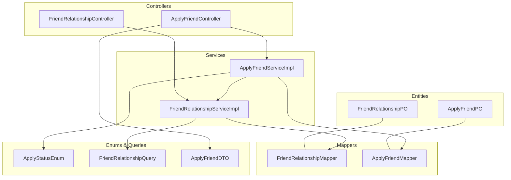
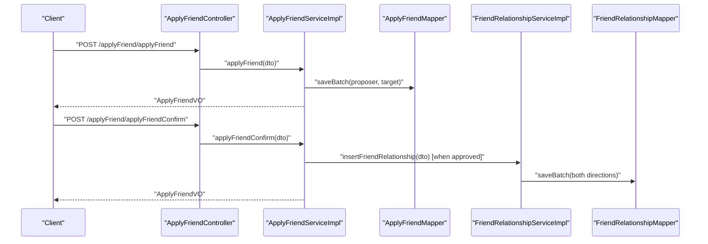
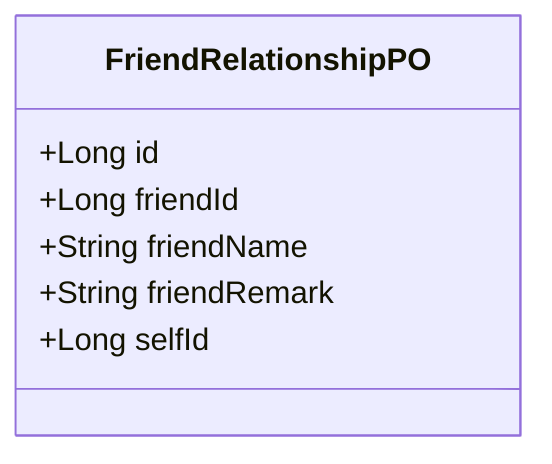
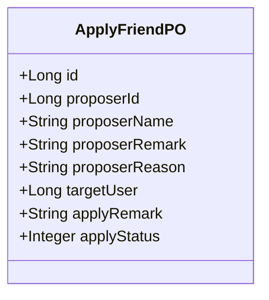
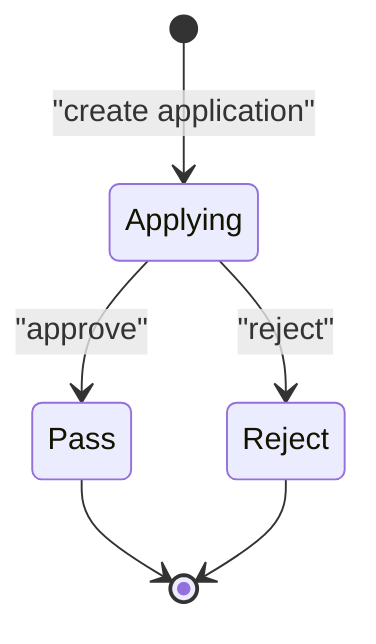
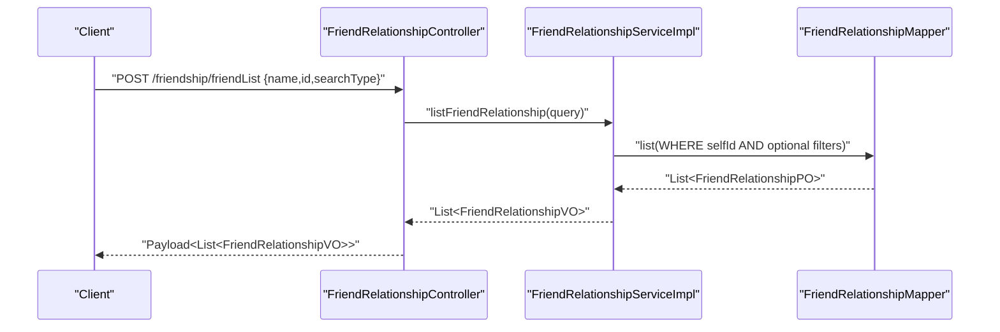
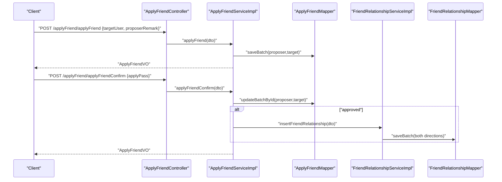
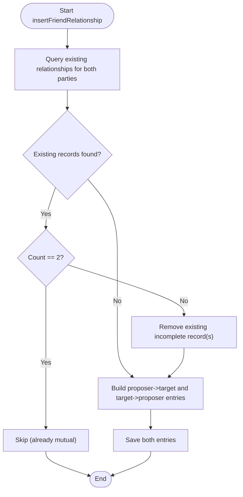
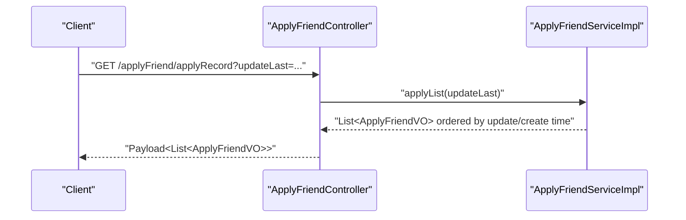
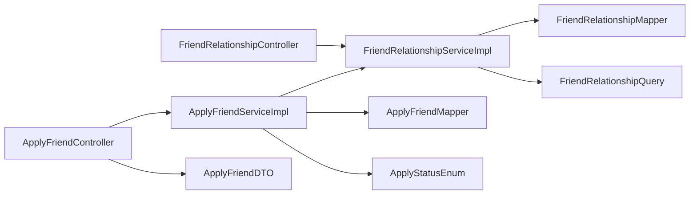

# Friendship Data Model

<cite>
**Referenced Files in This Document**
- [FriendRelationshipPO.java](file://src/main/java/com/hch/chat_simple/pojo/po/FriendRelationshipPO.java)
- [ApplyFriendPO.java](file://src/main/java/com/hch/chat_simple/pojo/po/ApplyFriendPO.java)
- [FriendRelationshipMapper.java](file://src/main/java/com/hch/chat_simple/mapper/FriendRelationshipMapper.java)
- [ApplyFriendMapper.java](file://src/main/java/com/hch/chat_simple/mapper/ApplyFriendMapper.java)
- [FriendRelationshipServiceImpl.java](file://src/main/java/com/hch/chat_simple/service/impl/FriendRelationshipServiceImpl.java)
- [ApplyFriendServiceImpl.java](file://src/main/java/com/hch/chat_simple/service/impl/ApplyFriendServiceImpl.java)
- [IFriendRelationshipService.java](file://src/main/java/com/hch/chat_simple/service/IFriendRelationshipService.java)
- [IApplyFriendService.java](file://src/main/java/com/hch/chat_simple/service/IApplyFriendService.java)
- [FriendRelationshipQuery.java](file://src/main/java/com/hch/chat_simple/pojo/query/FriendRelationshipQuery.java)
- [ApplyFriendDTO.java](file://src/main/java/com/hch/chat_simple/pojo/dto/ApplyFriendDTO.java)
- [FriendRelationshipVO.java](file://src/main/java/com/hch/chat_simple/pojo/vo/FriendRelationshipVO.java)
- [ApplyFriendVO.java](file://src/main/java/com/hch/chat_simple/pojo/vo/ApplyFriendVO.java)
- [ApplyFriendController.java](file://src/main/java/com/hch/chat_simple/controller/ApplyFriendController.java)
- [FriendRelationshipController.java](file://src/main/java/com/hch/chat_simple/controller/FriendRelationshipController.java)
- [ApplyStatusEnum.java](file://src/main/java/com/hch/chat_simple/enums/ApplyStatusEnum.java)
- [FriendRelationshipMapper.xml](file://src/main/resources/mapper/FriendRelationshipMapper.xml)
- [ApplyFriendMapper.xml](file://src/main/resources/mapper/ApplyFriendMapper.xml)
</cite>

## Table of Contents
1. [Introduction](#introduction)
2. [Project Structure](#project-structure)
3. [Core Components](#core-components)
4. [Architecture Overview](#architecture-overview)
5. [Detailed Component Analysis](#detailed-component-analysis)
6. [Dependency Analysis](#dependency-analysis)
7. [Performance Considerations](#performance-considerations)
8. [Troubleshooting Guide](#troubleshooting-guide)
9. [Conclusion](#conclusion)

## Introduction
This document describes the Friendship data model and related workflows in the chat application. It focuses on:
- Entities: FriendRelationshipPO (friendship records) and ApplyFriendPO (friendship applications)
- Relationship states and status management via ApplyFriendPO
- Services and controllers for applying, approving/rejecting, and listing friends
- Search, pagination-like incremental sync, and validation rules
- Examples of common operations and state transitions

## Project Structure
The friendship subsystem spans POJOs, MyBatis mapper interfaces, service implementations, controllers, enums, and query/DTO/VO objects.

**Diagram sources**
- [FriendRelationshipPO.java:25-44](file://src/main/java/com/hch/chat_simple/pojo/po/FriendRelationshipPO.java#L25-L44)
- [ApplyFriendPO.java:25-54](file://src/main/java/com/hch/chat_simple/pojo/po/ApplyFriendPO.java#L25-L54)
- [FriendRelationshipMapper.java:17-18](file://src/main/java/com/hch/chat_simple/mapper/FriendRelationshipMapper.java#L17-L18)
- [ApplyFriendMapper.java:16-17](file://src/main/java/com/hch/chat_simple/mapper/ApplyFriendMapper.java#L16-L17)
- [FriendRelationshipServiceImpl.java:40-111](file://src/main/java/com/hch/chat_simple/service/impl/FriendRelationshipServiceImpl.java#L40-L111)
- [ApplyFriendServiceImpl.java:46-225](file://src/main/java/com/hch/chat_simple/service/impl/ApplyFriendServiceImpl.java#L46-L225)
- [FriendRelationshipController.java:31-48](file://src/main/java/com/hch/chat_simple/controller/FriendRelationshipController.java#L31-L48)
- [ApplyFriendController.java:30-54](file://src/main/java/com/hch/chat_simple/controller/ApplyFriendController.java#L30-L54)
- [ApplyStatusEnum.java:6-9](file://src/main/java/com/hch/chat_simple/enums/ApplyStatusEnum.java#L6-L9)
- [FriendRelationshipQuery.java:8-18](file://src/main/java/com/hch/chat_simple/pojo/query/FriendRelationshipQuery.java#L8-L18)
- [ApplyFriendDTO.java:11-41](file://src/main/java/com/hch/chat_simple/pojo/dto/ApplyFriendDTO.java#L11-L41)

**Section sources**
- [FriendRelationshipPO.java:13-44](file://src/main/java/com/hch/chat_simple/pojo/po/FriendRelationshipPO.java#L13-L44)
- [ApplyFriendPO.java:13-54](file://src/main/java/com/hch/chat_simple/pojo/po/ApplyFriendPO.java#L13-L54)
- [FriendRelationshipMapper.java:9-18](file://src/main/java/com/hch/chat_simple/mapper/FriendRelationshipMapper.java#L9-L18)
- [ApplyFriendMapper.java:8-17](file://src/main/java/com/hch/chat_simple/mapper/ApplyFriendMapper.java#L8-L17)
- [FriendRelationshipServiceImpl.java:31-111](file://src/main/java/com/hch/chat_simple/service/impl/FriendRelationshipServiceImpl.java#L31-L111)
- [ApplyFriendServiceImpl.java:36-225](file://src/main/java/com/hch/chat_simple/service/impl/ApplyFriendServiceImpl.java#L36-L225)
- [FriendRelationshipController.java:20-48](file://src/main/java/com/hch/chat_simple/controller/FriendRelationshipController.java#L20-L48)
- [ApplyFriendController.java:20-54](file://src/main/java/com/hch/chat_simple/controller/ApplyFriendController.java#L20-L54)
- [ApplyStatusEnum.java:6-29](file://src/main/java/com/hch/chat_simple/enums/ApplyStatusEnum.java#L6-L29)
- [FriendRelationshipQuery.java:8-18](file://src/main/java/com/hch/chat_simple/pojo/query/FriendRelationshipQuery.java#L8-L18)
- [ApplyFriendDTO.java:11-41](file://src/main/java/com/hch/chat_simple/pojo/dto/ApplyFriendDTO.java#L11-L41)

## Core Components
- FriendRelationshipPO: Represents a single friendship entry for a user, storing friend identity, display name, and personal remark.
- ApplyFriendPO: Stores a friendship application with proposer/target identities, remarks, reason, and status.
- Enums: ApplyStatusEnum defines the lifecycle states for applications.
- Services: Implement business logic for friend list retrieval, application submission, confirmation, and relationship establishment.
- Controllers: Expose endpoints for friend list, application list, and application actions.

Key responsibilities:
- Friend list search by name or id for the current user
- Application creation and dual-record persistence
- Approval/rejection with bidirectional relationship creation
- Status synchronization and notification via messaging

**Section sources**
- [FriendRelationshipPO.java:25-44](file://src/main/java/com/hch/chat_simple/pojo/po/FriendRelationshipPO.java#L25-L44)
- [ApplyFriendPO.java:25-54](file://src/main/java/com/hch/chat_simple/pojo/po/ApplyFriendPO.java#L25-L54)
- [ApplyStatusEnum.java:6-9](file://src/main/java/com/hch/chat_simple/enums/ApplyStatusEnum.java#L6-L9)
- [IFriendRelationshipService.java:20-25](file://src/main/java/com/hch/chat_simple/service/IFriendRelationshipService.java#L20-L25)
- [IApplyFriendService.java:18-25](file://src/main/java/com/hch/chat_simple/service/IApplyFriendService.java#L18-L25)

## Architecture Overview
The friendship subsystem follows a layered architecture:
- Controllers expose REST endpoints
- Services encapsulate business logic and orchestrate persistence and messaging
- Mappers define data access contracts (XML files currently empty, relying on MyBatis-Plus base methods)
- Entities represent persisted domain objects

**Diagram sources**
- [ApplyFriendController.java:41-51](file://src/main/java/com/hch/chat_simple/controller/ApplyFriendController.java#L41-L51)
- [ApplyFriendServiceImpl.java:58-89](file://src/main/java/com/hch/chat_simple/service/impl/ApplyFriendServiceImpl.java#L58-L89)
- [ApplyFriendServiceImpl.java:92-174](file://src/main/java/com/hch/chat_simple/service/impl/ApplyFriendServiceImpl.java#L92-L174)
- [FriendRelationshipServiceImpl.java:59-108](file://src/main/java/com/hch/chat_simple/service/impl/FriendRelationshipServiceImpl.java#L59-L108)
- [ApplyFriendMapper.java:16-17](file://src/main/java/com/hch/chat_simple/mapper/ApplyFriendMapper.java#L16-L17)
- [FriendRelationshipMapper.java:17-18](file://src/main/java/com/hch/chat_simple/mapper/FriendRelationshipMapper.java#L17-L18)

## Detailed Component Analysis

### Data Model: FriendRelationshipPO
- Purpose: Persist a single direction of a friendship for a user
- Fields:
  - id: primary key
  - friendId, friendName, friendRemark: identifies the friend and per-user remark
  - selfId: the user who owns this friendship entry
- Behavior: Two symmetric entries are created for a mutual friendship (see Relationship Establishment below)

**Diagram sources**
- [FriendRelationshipPO.java:25-44](file://src/main/java/com/hch/chat_simple/pojo/po/FriendRelationshipPO.java#L25-L44)

**Section sources**
- [FriendRelationshipPO.java:25-44](file://src/main/java/com/hch/chat_simple/pojo/po/FriendRelationshipPO.java#L25-L44)

### Data Model: ApplyFriendPO
- Purpose: Track a friendship application with proposer, target, remarks, reason, and status
- Fields:
  - id, proposerId/name, proposerRemark/proposerReason
  - targetUser, applyRemark
  - applyStatus: 0=applying, 1=pass, 2=reject
- Behavior: Two records are saved per application (proposer and target) to support both sides’ views

**Diagram sources**
- [ApplyFriendPO.java:25-54](file://src/main/java/com/hch/chat_simple/pojo/po/ApplyFriendPO.java#L25-L54)

**Section sources**
- [ApplyFriendPO.java:25-54](file://src/main/java/com/hch/chat_simple/pojo/po/ApplyFriendPO.java#L25-L54)
- [ApplyStatusEnum.java:6-9](file://src/main/java/com/hch/chat_simple/enums/ApplyStatusEnum.java#L6-L9)

### Relationship States and Status Management
- States:
  - Applying: 0
  - Pass: 1
  - Reject: 2
- Management:
  - Application creation sets status to Applying
  - Confirmation updates both proposer and target records with the same status
  - Approved applications trigger bidirectional relationship creation

**Diagram sources**
- [ApplyStatusEnum.java:6-9](file://src/main/java/com/hch/chat_simple/enums/ApplyStatusEnum.java#L6-L9)
- [ApplyFriendServiceImpl.java:115-148](file://src/main/java/com/hch/chat_simple/service/impl/ApplyFriendServiceImpl.java#L115-L148)

**Section sources**
- [ApplyStatusEnum.java:6-29](file://src/main/java/com/hch/chat_simple/enums/ApplyStatusEnum.java#L6-L29)
- [ApplyFriendServiceImpl.java:92-174](file://src/main/java/com/hch/chat_simple/service/impl/ApplyFriendServiceImpl.java#L92-L174)

### Friend List Management and Search
- Endpoint: POST /friendship/friendList
- Query parameters: name, id, searchType (1=name, 2=id)
- Logic:
  - Filters by current user’s selfId
  - Applies name/id filter based on searchType
  - Converts to FriendRelationshipVO for response

**Diagram sources**
- [FriendRelationshipController.java:37-41](file://src/main/java/com/hch/chat_simple/controller/FriendRelationshipController.java#L37-L41)
- [FriendRelationshipServiceImpl.java:45-55](file://src/main/java/com/hch/chat_simple/service/impl/FriendRelationshipServiceImpl.java#L45-L55)
- [FriendRelationshipMapper.java:17-18](file://src/main/java/com/hch/chat_simple/mapper/FriendRelationshipMapper.java#L17-L18)

**Section sources**
- [FriendRelationshipController.java:37-41](file://src/main/java/com/hch/chat_simple/controller/FriendRelationshipController.java#L37-L41)
- [FriendRelationshipServiceImpl.java:45-55](file://src/main/java/com/hch/chat_simple/service/impl/FriendRelationshipServiceImpl.java#L45-L55)
- [FriendRelationshipQuery.java:8-18](file://src/main/java/com/hch/chat_simple/pojo/query/FriendRelationshipQuery.java#L8-L18)
- [FriendRelationshipVO.java:15-52](file://src/main/java/com/hch/chat_simple/pojo/vo/FriendRelationshipVO.java#L15-L52)

### Friendship Application Process
- Submission:
  - Endpoint: POST /applyFriend/applyFriend
  - Creates two ApplyFriendPO records (proposer and target)
  - Sets status to Applying and publishes a message for the target
- Confirmation:
  - Endpoint: POST /applyFriend/applyFriendConfirm
  - Validates and updates both records
  - On approval, creates bidirectional FriendRelationshipPO entries
  - Publishes notifications to both parties

**Diagram sources**
- [ApplyFriendController.java:41-51](file://src/main/java/com/hch/chat_simple/controller/ApplyFriendController.java#L41-L51)
- [ApplyFriendServiceImpl.java:58-89](file://src/main/java/com/hch/chat_simple/service/impl/ApplyFriendServiceImpl.java#L58-L89)
- [ApplyFriendServiceImpl.java:92-174](file://src/main/java/com/hch/chat_simple/service/impl/ApplyFriendServiceImpl.java#L92-L174)
- [FriendRelationshipServiceImpl.java:59-108](file://src/main/java/com/hch/chat_simple/service/impl/FriendRelationshipServiceImpl.java#L59-L108)

**Section sources**
- [ApplyFriendController.java:41-51](file://src/main/java/com/hch/chat_simple/controller/ApplyFriendController.java#L41-L51)
- [ApplyFriendServiceImpl.java:58-89](file://src/main/java/com/hch/chat_simple/service/impl/ApplyFriendServiceImpl.java#L58-L89)
- [ApplyFriendServiceImpl.java:92-174](file://src/main/java/com/hch/chat_simple/service/impl/ApplyFriendServiceImpl.java#L92-L174)
- [ApplyFriendDTO.java:11-41](file://src/main/java/com/hch/chat_simple/pojo/dto/ApplyFriendDTO.java#L11-L41)

### Relationship Establishment and Validation Rules
- Bidirectional creation:
  - When approved, two FriendRelationshipPO entries are created:
    - One for proposer with target as friend
    - One for target with proposer as friend
- Duplicate prevention and conflict resolution:
  - Before insertion, existing relationships for both parties are queried
  - If exactly two records exist (mutual), no change is made
  - If only one exists (e.g., unilateral or blocked), it is removed and replaced with mutual entries

**Diagram sources**
- [FriendRelationshipServiceImpl.java:59-108](file://src/main/java/com/hch/chat_simple/service/impl/FriendRelationshipServiceImpl.java#L59-L108)

**Section sources**
- [FriendRelationshipServiceImpl.java:59-108](file://src/main/java/com/hch/chat_simple/service/impl/FriendRelationshipServiceImpl.java#L59-L108)

### Friend Search, Mutual Discovery, and Pagination
- Search:
  - Name-based or id-based filtering for current user’s friend list
- Mutual discovery:
  - Mutual friends are represented by the presence of two symmetric FriendRelationshipPO entries
- Pagination/incremental sync:
  - The apply list supports incremental retrieval via updateLast timestamp
  - Records are ordered by creation/update time for efficient delta fetching

**Diagram sources**
- [ApplyFriendController.java:37-39](file://src/main/java/com/hch/chat_simple/controller/ApplyFriendController.java#L37-L39)
- [ApplyFriendServiceImpl.java:187-223](file://src/main/java/com/hch/chat_simple/service/impl/ApplyFriendServiceImpl.java#L187-L223)

**Section sources**
- [FriendRelationshipServiceImpl.java:45-55](file://src/main/java/com/hch/chat_simple/service/impl/FriendRelationshipServiceImpl.java#L45-L55)
- [ApplyFriendServiceImpl.java:187-223](file://src/main/java/com/hch/chat_simple/service/impl/ApplyFriendServiceImpl.java#L187-L223)

### ApplyFriendPO and ApplyFriendDTO
- ApplyFriendDTO: Request payload for applying; includes proposer/target info, remarks, and optional applyPass for confirmations
- ApplyFriendVO: Response envelope for apply operations; includes timestamps and derived fields

**Section sources**
- [ApplyFriendDTO.java:11-41](file://src/main/java/com/hch/chat_simple/pojo/dto/ApplyFriendDTO.java#L11-L41)
- [ApplyFriendVO.java:10-50](file://src/main/java/com/hch/chat_simple/pojo/vo/ApplyFriendVO.java#L10-L50)

## Dependency Analysis
- Controllers depend on services
- Services depend on mappers and each other for cross-domain operations
- Entities are mapped by MyBatis-Plus base mapper interfaces
- XML mapper files are currently empty and rely on base methods

**Diagram sources**
- [ApplyFriendController.java:30-54](file://src/main/java/com/hch/chat_simple/controller/ApplyFriendController.java#L30-L54)
- [FriendRelationshipController.java:31-36](file://src/main/java/com/hch/chat_simple/controller/FriendRelationshipController.java#L31-L36)
- [ApplyFriendServiceImpl.java:46-55](file://src/main/java/com/hch/chat_simple/service/impl/ApplyFriendServiceImpl.java#L46-L55)
- [FriendRelationshipServiceImpl.java:40-43](file://src/main/java/com/hch/chat_simple/service/impl/FriendRelationshipServiceImpl.java#L40-L43)
- [ApplyFriendMapper.java:16-17](file://src/main/java/com/hch/chat_simple/mapper/ApplyFriendMapper.java#L16-L17)
- [FriendRelationshipMapper.java:17-18](file://src/main/java/com/hch/chat_simple/mapper/FriendRelationshipMapper.java#L17-L18)
- [ApplyStatusEnum.java:6-9](file://src/main/java/com/hch/chat_simple/enums/ApplyStatusEnum.java#L6-L9)
- [FriendRelationshipQuery.java:8-18](file://src/main/java/com/hch/chat_simple/pojo/query/FriendRelationshipQuery.java#L8-L18)
- [ApplyFriendDTO.java:11-41](file://src/main/java/com/hch/chat_simple/pojo/dto/ApplyFriendDTO.java#L11-L41)

**Section sources**
- [FriendRelationshipMapper.xml:1-6](file://src/main/resources/mapper/FriendRelationshipMapper.xml#L1-L6)
- [ApplyFriendMapper.xml:1-6](file://src/main/resources/mapper/ApplyFriendMapper.xml#L1-L6)

## Performance Considerations
- Indexing recommendations:
  - FriendRelationshipPO: index on selfId, (selfId, friendId) composite
  - ApplyFriendPO: indexes on proposerId, targetUser, (proposerId, targetUser), applyStatus
- Query patterns:
  - Friend list filtering should leverage searchType to avoid unnecessary LIKE scans
  - Incremental apply list retrieval reduces payload size by filtering on update timestamps
- Batch operations:
  - saveBatch is used for bidirectional relationship creation to minimize round-trips

## Troubleshooting Guide
- Application not appearing for target user:
  - Verify two ApplyFriendPO records were created (proposer and target)
  - Confirm applyStatus transitions to Applying and that confirmation was invoked
- Relationship not established after approval:
  - Ensure insertFriendRelationship runs and removes any incomplete unilateral records
  - Check for exceptions during batch save
- Friend list empty:
  - Confirm current user context is set and selfId matches the logged-in user
  - Validate searchType and filters

**Section sources**
- [ApplyFriendServiceImpl.java:58-89](file://src/main/java/com/hch/chat_simple/service/impl/ApplyFriendServiceImpl.java#L58-L89)
- [ApplyFriendServiceImpl.java:92-174](file://src/main/java/com/hch/chat_simple/service/impl/ApplyFriendServiceImpl.java#L92-L174)
- [FriendRelationshipServiceImpl.java:59-108](file://src/main/java/com/hch/chat_simple/service/impl/FriendRelationshipServiceImpl.java#L59-L108)
- [FriendRelationshipServiceImpl.java:45-55](file://src/main/java/com/hch/chat_simple/service/impl/FriendRelationshipServiceImpl.java#L45-L55)

## Conclusion
The friendship subsystem provides a robust foundation for friend requests, approvals, and bidirectional relationship maintenance. Entities and services are designed to prevent duplicates and handle conflicts gracefully. Controllers expose straightforward endpoints for listing, applying, and confirming friendships, while enums and query/DTO/VO classes keep the data contracts explicit and consistent.