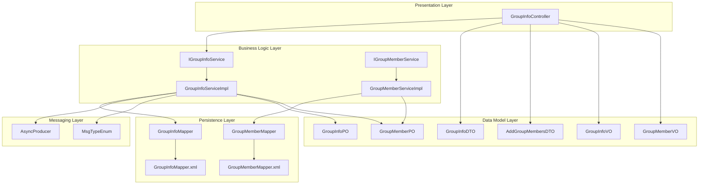
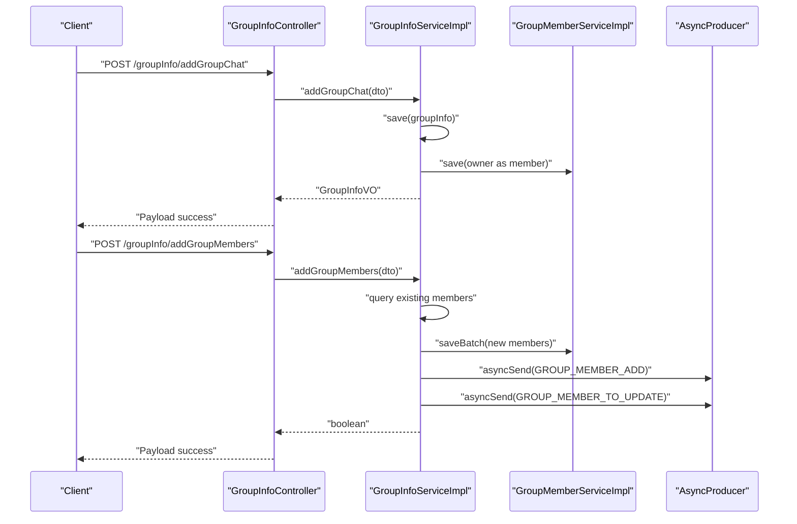
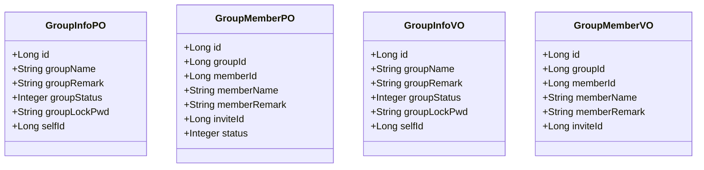
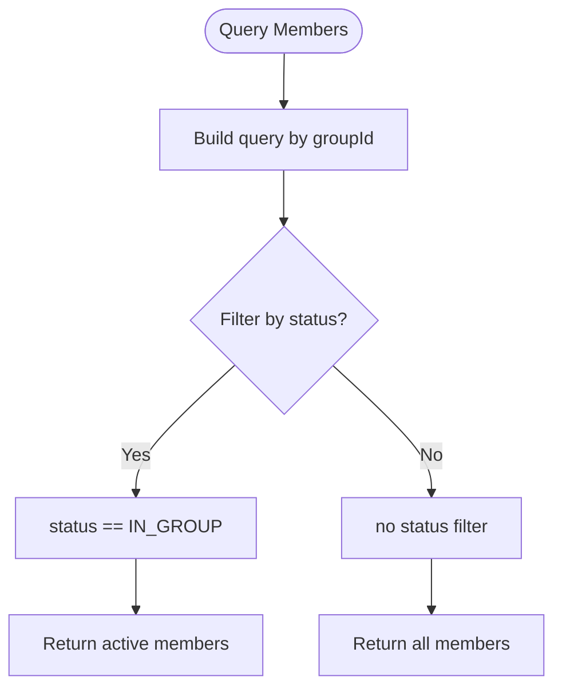
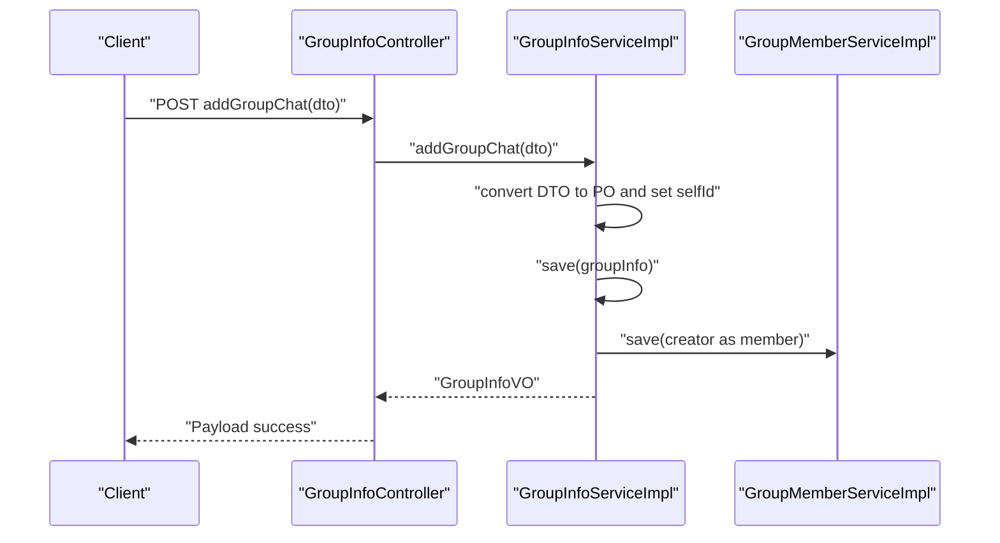
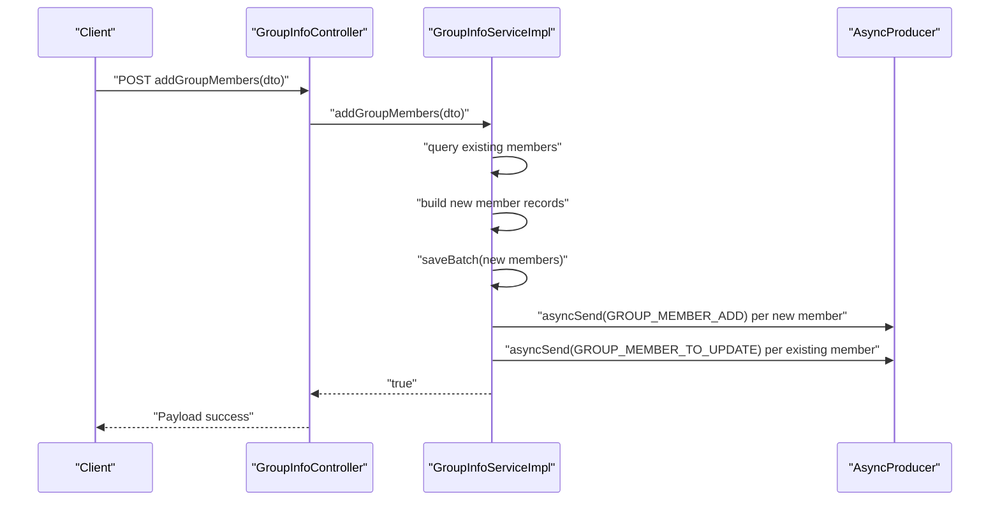
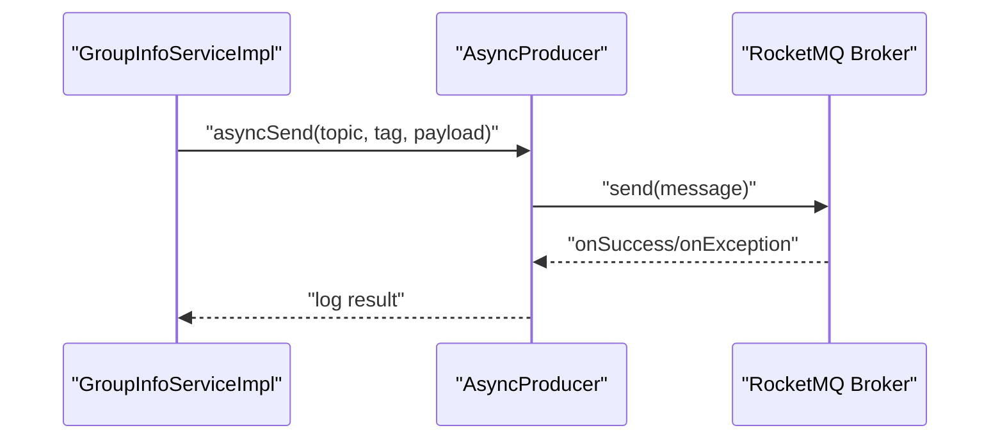
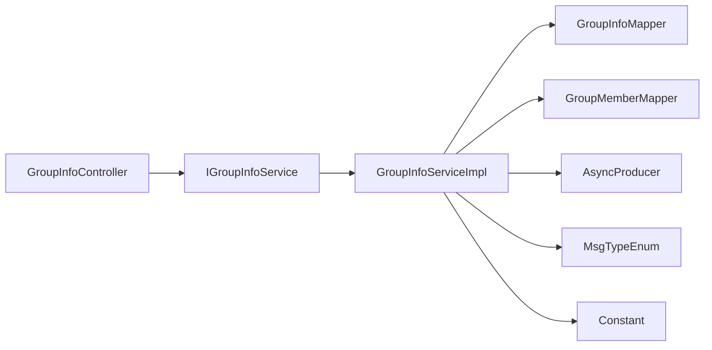

# Group Data Model

<cite>
**Referenced Files in This Document**
- [GroupInfoPO.java](file://src/main/java/com/hch/chat_simple/pojo/po/GroupInfoPO.java)
- [GroupMemberPO.java](file://src/main/java/com/hch/chat_simple/pojo/po/GroupMemberPO.java)
- [GroupInfoMapper.java](file://src/main/java/com/hch/chat_simple/mapper/GroupInfoMapper.java)
- [GroupMemberMapper.java](file://src/main/java/com/hch/chat_simple/mapper/GroupMemberMapper.java)
- [IGroupInfoService.java](file://src/main/java/com/hch/chat_simple/service/IGroupInfoService.java)
- [IGroupMemberService.java](file://src/main/java/com/hch/chat_simple/service/IGroupMemberService.java)
- [GroupInfoServiceImpl.java](file://src/main/java/com/hch/chat_simple/service/impl/GroupInfoServiceImpl.java)
- [GroupMemberServiceImpl.java](file://src/main/java/com/hch/chat_simple/service/impl/GroupMemberServiceImpl.java)
- [GroupInfoController.java](file://src/main/java/com/hch/chat_simple/controller/GroupInfoController.java)
- [GroupInfoDTO.java](file://src/main/java/com/hch/chat_simple/pojo/dto/GroupInfoDTO.java)
- [AddGroupMembersDTO.java](file://src/main/java/com/hch/chat_simple/pojo/dto/AddGroupMembersDTO.java)
- [GroupInfoVO.java](file://src/main/java/com/hch/chat_simple/pojo/vo/GroupInfoVO.java)
- [GroupMemberVO.java](file://src/main/java/com/hch/chat_simple/pojo/vo/GroupMemberVO.java)
- [GroupInfoMapper.xml](file://src/main/resources/mapper/GroupInfoMapper.xml)
- [GroupMemberMapper.xml](file://src/main/resources/mapper/GroupMemberMapper.xml)
- [Constant.java](file://src/main/java/com/hch/chat_simple/util/Constant.java)
- [MsgTypeEnum.java](file://src/main/java/com/hch/chat_simple/enums/MsgTypeEnum.java)
- [AsyncProducer.java](file://src/main/java/com/hch/chat_simple/mq/AsyncProducer.java)
</cite>

## Table of Contents
1. [Introduction](#introduction)
2. [Project Structure](#project-structure)
3. [Core Components](#core-components)
4. [Architecture Overview](#architecture-overview)
5. [Detailed Component Analysis](#detailed-component-analysis)
6. [Dependency Analysis](#dependency-analysis)
7. [Performance Considerations](#performance-considerations)
8. [Troubleshooting Guide](#troubleshooting-guide)
9. [Conclusion](#conclusion)
10. [Appendices](#appendices)

## Introduction
This document provides comprehensive documentation for the Group data model in the chat application. It focuses on the GroupInfoPO and GroupMemberPO entities, group creation workflows, member management, administrative permissions via GroupMemberPO roles, and the GroupInfoMapper methods for group operations and member queries. It also explains group membership workflows (invitation, acceptance, removal, and role assignment), group chat functionality, broadcast mechanisms, and member notification systems. Privacy settings, group lifecycle management, member count tracking, and activity monitoring are covered, along with practical examples of operations and administration tasks.

## Project Structure
The group-related functionality spans POJOs, mappers, services, controllers, DTOs/VOs, constants, message types, and messaging infrastructure. The structure follows a layered pattern:
- Data model layer: POs define the persistent entities.
- Persistence layer: MyBatis-Plus mappers and XML files.
- Business logic layer: Services and implementations.
- Presentation layer: Controllers exposing REST endpoints.
- Messaging layer: Asynchronous producer for broadcasting updates.

**Diagram sources**
- [GroupInfoController.java:1-68](file://src/main/java/com/hch/chat_simple/controller/GroupInfoController.java#L1-L68)
- [GroupInfoServiceImpl.java:1-143](file://src/main/java/com/hch/chat_simple/service/impl/GroupInfoServiceImpl.java#L1-L143)
- [GroupMemberServiceImpl.java:1-21](file://src/main/java/com/hch/chat_simple/service/impl/GroupMemberServiceImpl.java#L1-L21)
- [IGroupInfoService.java:1-31](file://src/main/java/com/hch/chat_simple/service/IGroupInfoService.java#L1-L31)
- [IGroupMemberService.java:1-21](file://src/main/java/com/hch/chat_simple/service/IGroupMemberService.java#L1-L21)
- [GroupInfoMapper.java:1-21](file://src/main/java/com/hch/chat_simple/mapper/GroupInfoMapper.java#L1-L21)
- [GroupMemberMapper.java:1-21](file://src/main/java/com/hch/chat_simple/mapper/GroupMemberMapper.java#L1-L21)
- [GroupInfoMapper.xml:1-6](file://src/main/resources/mapper/GroupInfoMapper.xml#L1-L6)
- [GroupMemberMapper.xml:1-6](file://src/main/resources/mapper/GroupMemberMapper.xml#L1-L6)
- [GroupInfoPO.java:1-50](file://src/main/java/com/hch/chat_simple/pojo/po/GroupInfoPO.java#L1-L50)
- [GroupMemberPO.java:1-49](file://src/main/java/com/hch/chat_simple/pojo/po/GroupMemberPO.java#L1-L49)
- [GroupInfoVO.java:1-27](file://src/main/java/com/hch/chat_simple/pojo/vo/GroupInfoVO.java#L1-L27)
- [GroupMemberVO.java:1-40](file://src/main/java/com/hch/chat_simple/pojo/vo/GroupMemberVO.java#L1-L40)
- [GroupInfoDTO.java:1-26](file://src/main/java/com/hch/chat_simple/pojo/dto/GroupInfoDTO.java#L1-L26)
- [AddGroupMembersDTO.java:1-16](file://src/main/java/com/hch/chat_simple/pojo/dto/AddGroupMembersDTO.java#L1-L16)
- [AsyncProducer.java:1-63](file://src/main/java/com/hch/chat_simple/mq/AsyncProducer.java#L1-L63)
- [MsgTypeEnum.java:1-25](file://src/main/java/com/hch/chat_simple/enums/MsgTypeEnum.java#L1-L25)

**Section sources**
- [GroupInfoController.java:1-68](file://src/main/java/com/hch/chat_simple/controller/GroupInfoController.java#L1-L68)
- [GroupInfoServiceImpl.java:1-143](file://src/main/java/com/hch/chat_simple/service/impl/GroupInfoServiceImpl.java#L1-L143)
- [GroupMemberServiceImpl.java:1-21](file://src/main/java/com/hch/chat_simple/service/impl/GroupMemberServiceImpl.java#L1-L21)
- [IGroupInfoService.java:1-31](file://src/main/java/com/hch/chat_simple/service/IGroupInfoService.java#L1-L31)
- [IGroupMemberService.java:1-21](file://src/main/java/com/hch/chat_simple/service/IGroupMemberService.java#L1-L21)
- [GroupInfoMapper.java:1-21](file://src/main/java/com/hch/chat_simple/mapper/GroupInfoMapper.java#L1-L21)
- [GroupMemberMapper.java:1-21](file://src/main/java/com/hch/chat_simple/mapper/GroupMemberMapper.java#L1-L21)
- [GroupInfoMapper.xml:1-6](file://src/main/resources/mapper/GroupInfoMapper.xml#L1-L6)
- [GroupMemberMapper.xml:1-6](file://src/main/resources/mapper/GroupMemberMapper.xml#L1-L6)
- [GroupInfoPO.java:1-50](file://src/main/java/com/hch/chat_simple/pojo/po/GroupInfoPO.java#L1-L50)
- [GroupMemberPO.java:1-49](file://src/main/java/com/hch/chat_simple/pojo/po/GroupMemberPO.java#L1-L49)
- [GroupInfoVO.java:1-27](file://src/main/java/com/hch/chat_simple/pojo/vo/GroupInfoVO.java#L1-L27)
- [GroupMemberVO.java:1-40](file://src/main/java/com/hch/chat_simple/pojo/vo/GroupMemberVO.java#L1-L40)
- [GroupInfoDTO.java:1-26](file://src/main/java/com/hch/chat_simple/pojo/dto/GroupInfoDTO.java#L1-L26)
- [AddGroupMembersDTO.java:1-16](file://src/main/java/com/hch/chat_simple/pojo/dto/AddGroupMembersDTO.java#L1-L16)
- [AsyncProducer.java:1-63](file://src/main/java/com/hch/chat_simple/mq/AsyncProducer.java#L1-L63)
- [MsgTypeEnum.java:1-25](file://src/main/java/com/hch/chat_simple/enums/MsgTypeEnum.java#L1-L25)

## Core Components
- GroupInfoPO: Represents a group’s metadata stored in the group_info table, including name, remark, status, password, and owner ID.
- GroupMemberPO: Represents a member’s record in the group_member table, including groupId, memberId, memberName, memberRemark, inviteId, and status.
- GroupInfoMapper and GroupMemberMapper: MyBatis-Plus mappers extending BaseMapper for CRUD operations.
- IGroupInfoService and IGroupMemberService: Service interfaces defining group operations and member operations.
- GroupInfoServiceImpl and GroupMemberServiceImpl: Implementations handling business logic, transactions, and notifications.
- GroupInfoController: Exposes REST endpoints for group creation, member queries, and adding members.
- DTOs and VOs: GroupInfoDTO, AddGroupMembersDTO, GroupInfoVO, GroupMemberVO for request/response modeling.
- Constants and enums: IN_GROUP/LEAVE_GROUP status and message types for group member events.
- AsyncProducer and MsgTypeEnum: Asynchronous messaging for broadcasting member addition and updates.

**Section sources**
- [GroupInfoPO.java:1-50](file://src/main/java/com/hch/chat_simple/pojo/po/GroupInfoPO.java#L1-L50)
- [GroupMemberPO.java:1-49](file://src/main/java/com/hch/chat_simple/pojo/po/GroupMemberPO.java#L1-L49)
- [GroupInfoMapper.java:1-21](file://src/main/java/com/hch/chat_simple/mapper/GroupInfoMapper.java#L1-L21)
- [GroupMemberMapper.java:1-21](file://src/main/java/com/hch/chat_simple/mapper/GroupMemberMapper.java#L1-L21)
- [IGroupInfoService.java:1-31](file://src/main/java/com/hch/chat_simple/service/IGroupInfoService.java#L1-L31)
- [IGroupMemberService.java:1-21](file://src/main/java/com/hch/chat_simple/service/IGroupMemberService.java#L1-L21)
- [GroupInfoServiceImpl.java:1-143](file://src/main/java/com/hch/chat_simple/service/impl/GroupInfoServiceImpl.java#L1-L143)
- [GroupMemberServiceImpl.java:1-21](file://src/main/java/com/hch/chat_simple/service/impl/GroupMemberServiceImpl.java#L1-L21)
- [GroupInfoController.java:1-68](file://src/main/java/com/hch/chat_simple/controller/GroupInfoController.java#L1-L68)
- [GroupInfoDTO.java:1-26](file://src/main/java/com/hch/chat_simple/pojo/dto/GroupInfoDTO.java#L1-L26)
- [AddGroupMembersDTO.java:1-16](file://src/main/java/com/hch/chat_simple/pojo/dto/AddGroupMembersDTO.java#L1-L16)
- [GroupInfoVO.java:1-27](file://src/main/java/com/hch/chat_simple/pojo/vo/GroupInfoVO.java#L1-L27)
- [GroupMemberVO.java:1-40](file://src/main/java/com/hch/chat_simple/pojo/vo/GroupMemberVO.java#L1-L40)
- [Constant.java:1-33](file://src/main/java/com/hch/chat_simple/util/Constant.java#L1-L33)
- [MsgTypeEnum.java:1-25](file://src/main/java/com/hch/chat_simple/enums/MsgTypeEnum.java#L1-L25)
- [AsyncProducer.java:1-63](file://src/main/java/com/hch/chat_simple/mq/AsyncProducer.java#L1-L63)

## Architecture Overview
The group module follows a clean architecture with clear separation of concerns:
- Controllers handle HTTP requests and responses.
- Services encapsulate business logic, manage transactions, and coordinate persistence and messaging.
- Mappers leverage MyBatis-Plus for database operations.
- POs/VOs/DTOs define data contracts.
- Messaging broadcasts updates to clients for real-time notifications.

**Diagram sources**
- [GroupInfoController.java:1-68](file://src/main/java/com/hch/chat_simple/controller/GroupInfoController.java#L1-L68)
- [GroupInfoServiceImpl.java:1-143](file://src/main/java/com/hch/chat_simple/service/impl/GroupInfoServiceImpl.java#L1-L143)
- [GroupMemberServiceImpl.java:1-21](file://src/main/java/com/hch/chat_simple/service/impl/GroupMemberServiceImpl.java#L1-L21)
- [AsyncProducer.java:1-63](file://src/main/java/com/hch/chat_simple/mq/AsyncProducer.java#L1-L63)
- [MsgTypeEnum.java:1-25](file://src/main/java/com/hch/chat_simple/enums/MsgTypeEnum.java#L1-L25)

## Detailed Component Analysis

### GroupInfoPO and GroupMemberPO Entities
- GroupInfoPO
  - Fields: id, groupName, groupRemark, groupStatus, groupLockPwd, selfId.
  - Annotations: @TableName("group_info"), @TableId, serializable base class inherited via BasePO.
  - Purpose: Stores group metadata and ownership.
- GroupMemberPO
  - Fields: id, groupId, memberId, memberName, memberRemark, inviteId, status.
  - Annotations: @TableName("group_member"), @TableId.
  - Purpose: Tracks membership, invitations, and member status within a group.

**Diagram sources**
- [GroupInfoPO.java:1-50](file://src/main/java/com/hch/chat_simple/pojo/po/GroupInfoPO.java#L1-L50)
- [GroupMemberPO.java:1-49](file://src/main/java/com/hch/chat_simple/pojo/po/GroupMemberPO.java#L1-L49)
- [GroupInfoVO.java:1-27](file://src/main/java/com/hch/chat_simple/pojo/vo/GroupInfoVO.java#L1-L27)
- [GroupMemberVO.java:1-40](file://src/main/java/com/hch/chat_simple/pojo/vo/GroupMemberVO.java#L1-L40)

**Section sources**
- [GroupInfoPO.java:1-50](file://src/main/java/com/hch/chat_simple/pojo/po/GroupInfoPO.java#L1-L50)
- [GroupMemberPO.java:1-49](file://src/main/java/com/hch/chat_simple/pojo/po/GroupMemberPO.java#L1-L49)
- [GroupInfoVO.java:1-27](file://src/main/java/com/hch/chat_simple/pojo/vo/GroupInfoVO.java#L1-L27)
- [GroupMemberVO.java:1-40](file://src/main/java/com/hch/chat_simple/pojo/vo/GroupMemberVO.java#L1-L40)

### GroupInfoMapper Methods and Member Queries
- GroupInfoMapper
  - Extends BaseMapper<GroupInfoPO>, inheriting standard CRUD operations.
  - XML file currently empty; operations rely on MyBatis-Plus conventions.
- GroupMemberMapper
  - Extends BaseMapper<GroupMemberPO>, inheriting standard CRUD operations.
  - XML file currently empty; operations rely on MyBatis-Plus conventions.
- Member Queries
  - findGroupMemberById(groupId): Returns only members with status "IN_GROUP".
  - findAllGroupMemberById(groupId): Returns all members including those who left ("LEAVE_GROUP").

**Diagram sources**
- [GroupInfoServiceImpl.java:82-99](file://src/main/java/com/hch/chat_simple/service/impl/GroupInfoServiceImpl.java#L82-L99)
- [Constant.java:23-25](file://src/main/java/com/hch/chat_simple/util/Constant.java#L23-L25)

**Section sources**
- [GroupInfoMapper.java:1-21](file://src/main/java/com/hch/chat_simple/mapper/GroupInfoMapper.java#L1-L21)
- [GroupMemberMapper.java:1-21](file://src/main/java/com/hch/chat_simple/mapper/GroupMemberMapper.java#L1-L21)
- [GroupInfoMapper.xml:1-6](file://src/main/resources/mapper/GroupInfoMapper.xml#L1-L6)
- [GroupMemberMapper.xml:1-6](file://src/main/resources/mapper/GroupMemberMapper.xml#L1-L6)
- [GroupInfoServiceImpl.java:82-99](file://src/main/java/com/hch/chat_simple/service/impl/GroupInfoServiceImpl.java#L82-L99)
- [Constant.java:23-25](file://src/main/java/com/hch/chat_simple/util/Constant.java#L23-L25)

### Group Creation Workflow
- Endpoint: POST /groupInfo/addGroupChat
- Steps:
  - Extract current user info from context.
  - Convert DTO to GroupInfoPO and set selfId.
  - Save group info.
  - Automatically add the creator as the first member with inviteId set to creator.
  - Return GroupInfoVO.

**Diagram sources**
- [GroupInfoController.java:39-44](file://src/main/java/com/hch/chat_simple/controller/GroupInfoController.java#L39-L44)
- [GroupInfoServiceImpl.java:59-80](file://src/main/java/com/hch/chat_simple/service/impl/GroupInfoServiceImpl.java#L59-L80)
- [GroupMemberServiceImpl.java:1-21](file://src/main/java/com/hch/chat_simple/service/impl/GroupMemberServiceImpl.java#L1-L21)

**Section sources**
- [GroupInfoController.java:39-44](file://src/main/java/com/hch/chat_simple/controller/GroupInfoController.java#L39-L44)
- [GroupInfoServiceImpl.java:59-80](file://src/main/java/com/hch/chat_simple/service/impl/GroupInfoServiceImpl.java#L59-L80)

### Member Management and Administrative Permissions
- Roles and Permissions
  - GroupMemberPO stores inviteId, indicating who invited a member.
  - Status field distinguishes active members (IN_GROUP) from those who left (LEAVE_GROUP).
  - Administrative actions (removal, role assignment) are not explicitly modeled in the current code; they would require additional fields or separate role entities.
- Adding Members
  - Endpoint: POST /groupInfo/addGroupMembers
  - Steps:
    - Fetch target users and build GroupMemberPO entries.
    - Filter out existing members.
    - Persist new members.
    - Broadcast notifications:
      - To newly added members: GROUP_MEMBER_ADD
      - To existing members: GROUP_MEMBER_TO_UPDATE

**Diagram sources**
- [GroupInfoController.java:54-59](file://src/main/java/com/hch/chat_simple/controller/GroupInfoController.java#L54-L59)
- [GroupInfoServiceImpl.java:101-141](file://src/main/java/com/hch/chat_simple/service/impl/GroupInfoServiceImpl.java#L101-L141)
- [AsyncProducer.java:40-59](file://src/main/java/com/hch/chat_simple/mq/AsyncProducer.java#L40-L59)
- [MsgTypeEnum.java:13-14](file://src/main/java/com/hch/chat_simple/enums/MsgTypeEnum.java#L13-L14)

**Section sources**
- [GroupInfoController.java:54-59](file://src/main/java/com/hch/chat_simple/controller/GroupInfoController.java#L54-L59)
- [GroupInfoServiceImpl.java:101-141](file://src/main/java/com/hch/chat_simple/service/impl/GroupInfoServiceImpl.java#L101-L141)
- [MsgTypeEnum.java:13-14](file://src/main/java/com/hch/chat_simple/enums/MsgTypeEnum.java#L13-L14)

### Group Chat Functionality, Broadcast Mechanisms, and Notifications
- Broadcast Topic
  - compositionTopicName configured via property.
  - Messages tagged per user instance for targeted delivery.
- Notification Types
  - GROUP_MEMBER_ADD: Sent to newly added members upon joining.
  - GROUP_MEMBER_TO_UPDATE: Sent to existing members to refresh group info/member list.
- Delivery
  - AsyncProducer sends messages asynchronously and logs success/exception.

**Diagram sources**
- [GroupInfoServiceImpl.java:123-138](file://src/main/java/com/hch/chat_simple/service/impl/GroupInfoServiceImpl.java#L123-L138)
- [AsyncProducer.java:40-59](file://src/main/java/com/hch/chat_simple/mq/AsyncProducer.java#L40-L59)
- [MsgTypeEnum.java:13-14](file://src/main/java/com/hch/chat_simple/enums/MsgTypeEnum.java#L13-L14)

**Section sources**
- [GroupInfoServiceImpl.java:123-138](file://src/main/java/com/hch/chat_simple/service/impl/GroupInfoServiceImpl.java#L123-L138)
- [AsyncProducer.java:40-59](file://src/main/java/com/hch/chat_simple/mq/AsyncProducer.java#L40-L59)
- [MsgTypeEnum.java:13-14](file://src/main/java/com/hch/chat_simple/enums/MsgTypeEnum.java#L13-L14)

### Group Search, Discovery, and Privacy Settings
- Privacy Settings
  - groupStatus indicates join policy: open, invitation-only, owner-invite-only, or password-protected.
  - groupLockPwd stores the password for password-enter groups.
- Search and Discovery
  - Current implementation does not expose explicit search endpoints in the controller.
  - Discovery could be supported by querying groups by name or status, but no dedicated endpoint exists yet.

Recommendations:
- Add endpoints for group search by name and status filtering.
- Enforce privacy checks during join attempts based on groupStatus and groupLockPwd.

**Section sources**
- [GroupInfoPO.java:40-44](file://src/main/java/com/hch/chat_simple/pojo/po/GroupInfoPO.java#L40-L44)
- [GroupInfoDTO.java:17-21](file://src/main/java/com/hch/chat_simple/pojo/dto/GroupInfoDTO.java#L17-L21)
- [GroupInfoController.java:1-68](file://src/main/java/com/hch/chat_simple/controller/GroupInfoController.java#L1-L68)

### Group Lifecycle Management, Member Count Tracking, and Activity Monitoring
- Lifecycle
  - Creation: Owner creates group and becomes first member.
  - Membership changes: Add/remove/update members.
  - Deactivation: Not modeled; status could be extended to mark inactive groups.
- Member Count Tracking
  - Use findGroupMemberById to count active members.
  - Use findAllGroupMemberById to include leavers for historical records.
- Activity Monitoring
  - Broadcast updates on member additions and updates.
  - Future enhancements: Track last activity timestamps per member and group.

**Section sources**
- [GroupInfoServiceImpl.java:82-99](file://src/main/java/com/hch/chat_simple/service/impl/GroupInfoServiceImpl.java#L82-L99)
- [Constant.java:23-25](file://src/main/java/com/hch/chat_simple/util/Constant.java#L23-L25)

### Examples of Operations and Administration Tasks
- Create a group
  - Endpoint: POST /groupInfo/addGroupChat
  - Request body: GroupInfoDTO with groupName, groupRemark, groupStatus, groupLockPwd, selfId.
  - Response: GroupInfoVO with group metadata.
- Query active members
  - Endpoint: GET /groupInfo/findGroupMemberById?groupId={id}
  - Response: List<GroupMemberVO> containing only active members.
- Query all members (including leavers)
  - Endpoint: GET /groupInfo/findAllGroupMemberById?groupId={id}
  - Response: List<GroupMemberVO> including inactive members.
- Add members to a group
  - Endpoint: POST /groupInfo/addGroupMembers
  - Request body: AddGroupMembersDTO with groupId and userIds.
  - Behavior: Filters duplicates, persists new members, and broadcasts notifications.

**Section sources**
- [GroupInfoController.java:39-66](file://src/main/java/com/hch/chat_simple/controller/GroupInfoController.java#L39-L66)
- [GroupInfoDTO.java:1-26](file://src/main/java/com/hch/chat_simple/pojo/dto/GroupInfoDTO.java#L1-L26)
- [AddGroupMembersDTO.java:1-16](file://src/main/java/com/hch/chat_simple/pojo/dto/AddGroupMembersDTO.java#L1-L16)
- [GroupInfoServiceImpl.java:59-80](file://src/main/java/com/hch/chat_simple/service/impl/GroupInfoServiceImpl.java#L59-L80)
- [GroupInfoServiceImpl.java:82-99](file://src/main/java/com/hch/chat_simple/service/impl/GroupInfoServiceImpl.java#L82-L99)
- [GroupInfoServiceImpl.java:101-141](file://src/main/java/com/hch/chat_simple/service/impl/GroupInfoServiceImpl.java#L101-L141)

## Dependency Analysis
- Controllers depend on service interfaces.
- Services depend on mappers and utilities (context, conversion, constants).
- Mappers depend on MyBatis-Plus BaseMapper and XML configurations.
- Messaging depends on RocketMQ producer configuration and message types.

**Diagram sources**
- [GroupInfoController.java:1-68](file://src/main/java/com/hch/chat_simple/controller/GroupInfoController.java#L1-L68)
- [IGroupInfoService.java:1-31](file://src/main/java/com/hch/chat_simple/service/IGroupInfoService.java#L1-L31)
- [GroupInfoServiceImpl.java:1-143](file://src/main/java/com/hch/chat_simple/service/impl/GroupInfoServiceImpl.java#L1-L143)
- [GroupInfoMapper.java:1-21](file://src/main/java/com/hch/chat_simple/mapper/GroupInfoMapper.java#L1-L21)
- [GroupMemberMapper.java:1-21](file://src/main/java/com/hch/chat_simple/mapper/GroupMemberMapper.java#L1-L21)
- [AsyncProducer.java:1-63](file://src/main/java/com/hch/chat_simple/mq/AsyncProducer.java#L1-L63)
- [MsgTypeEnum.java:1-25](file://src/main/java/com/hch/chat_simple/enums/MsgTypeEnum.java#L1-L25)
- [Constant.java:1-33](file://src/main/java/com/hch/chat_simple/util/Constant.java#L1-L33)

**Section sources**
- [GroupInfoController.java:1-68](file://src/main/java/com/hch/chat_simple/controller/GroupInfoController.java#L1-L68)
- [IGroupInfoService.java:1-31](file://src/main/java/com/hch/chat_simple/service/IGroupInfoService.java#L1-L31)
- [GroupInfoServiceImpl.java:1-143](file://src/main/java/com/hch/chat_simple/service/impl/GroupInfoServiceImpl.java#L1-L143)
- [GroupInfoMapper.java:1-21](file://src/main/java/com/hch/chat_simple/mapper/GroupInfoMapper.java#L1-L21)
- [GroupMemberMapper.java:1-21](file://src/main/java/com/hch/chat_simple/mapper/GroupMemberMapper.java#L1-L21)
- [AsyncProducer.java:1-63](file://src/main/java/com/hch/chat_simple/mq/AsyncProducer.java#L1-L63)
- [MsgTypeEnum.java:1-25](file://src/main/java/com/hch/chat_simple/enums/MsgTypeEnum.java#L1-L25)
- [Constant.java:1-33](file://src/main/java/com/hch/chat_simple/util/Constant.java#L1-L33)

## Performance Considerations
- Transaction boundaries: Group creation and member addition are transactional to maintain consistency.
- Batch operations: saveBatch is used for adding multiple members efficiently.
- Filtering: Pre-filter existing members to avoid duplicates and reduce writes.
- Messaging overhead: Broadcasting per member increases load; consider batching or fan-out strategies if scale grows.

## Troubleshooting Guide
- Group creation fails
  - Verify DTO mapping and selfId population.
  - Check transaction rollback conditions.
- Member addition does not notify
  - Confirm AsyncProducer configuration and topic/group properties.
  - Inspect message type constants and tags.
- Query returns unexpected results
  - Distinguish between active members and all members using appropriate endpoints.
  - Validate status filters in queries.

**Section sources**
- [GroupInfoServiceImpl.java:59-80](file://src/main/java/com/hch/chat_simple/service/impl/GroupInfoServiceImpl.java#L59-L80)
- [GroupInfoServiceImpl.java:101-141](file://src/main/java/com/hch/chat_simple/service/impl/GroupInfoServiceImpl.java#L101-L141)
- [AsyncProducer.java:40-59](file://src/main/java/com/hch/chat_simple/mq/AsyncProducer.java#L40-L59)
- [MsgTypeEnum.java:13-14](file://src/main/java/com/hch/chat_simple/enums/MsgTypeEnum.java#L13-L14)
- [GroupInfoServiceImpl.java:82-99](file://src/main/java/com/hch/chat_simple/service/impl/GroupInfoServiceImpl.java#L82-L99)

## Conclusion
The group module provides a solid foundation for group creation, member management, and real-time notifications. The current design supports privacy settings via groupStatus and groupLockPwd, active member tracking, and asynchronous broadcasting. Future enhancements can include explicit member role assignments, administrative controls, and richer search/discovery capabilities.

## Appendices
- Privacy settings summary
  - groupStatus: 0=open, 1=invitation-only, 2=owner-invite-only, 3=password-protected.
  - groupLockPwd: password for password-protected groups.
- Status constants
  - IN_GROUP: 1, LEAVE_GROUP: 0.

**Section sources**
- [GroupInfoPO.java:40-44](file://src/main/java/com/hch/chat_simple/pojo/po/GroupInfoPO.java#L40-L44)
- [GroupInfoDTO.java:17-21](file://src/main/java/com/hch/chat_simple/pojo/dto/GroupInfoDTO.java#L17-L21)
- [Constant.java:23-25](file://src/main/java/com/hch/chat_simple/util/Constant.java#L23-L25)