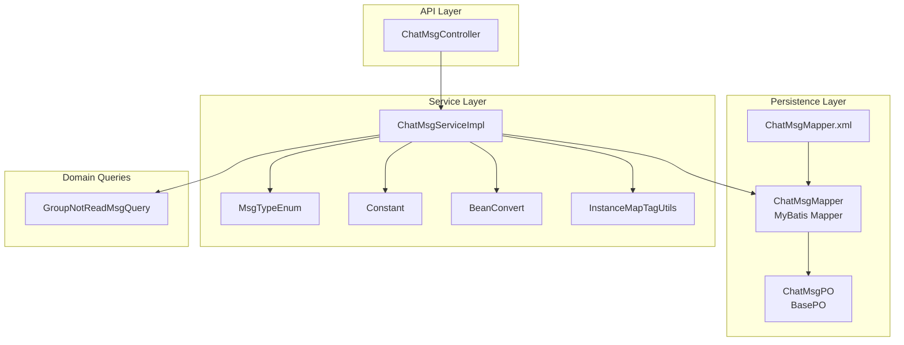
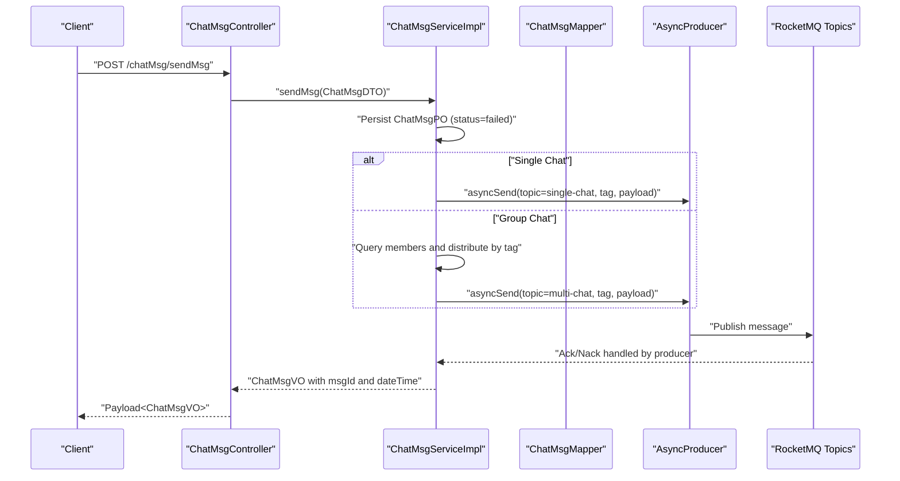
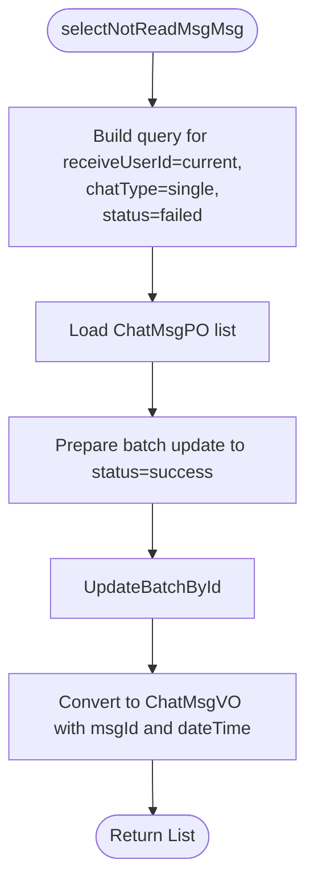
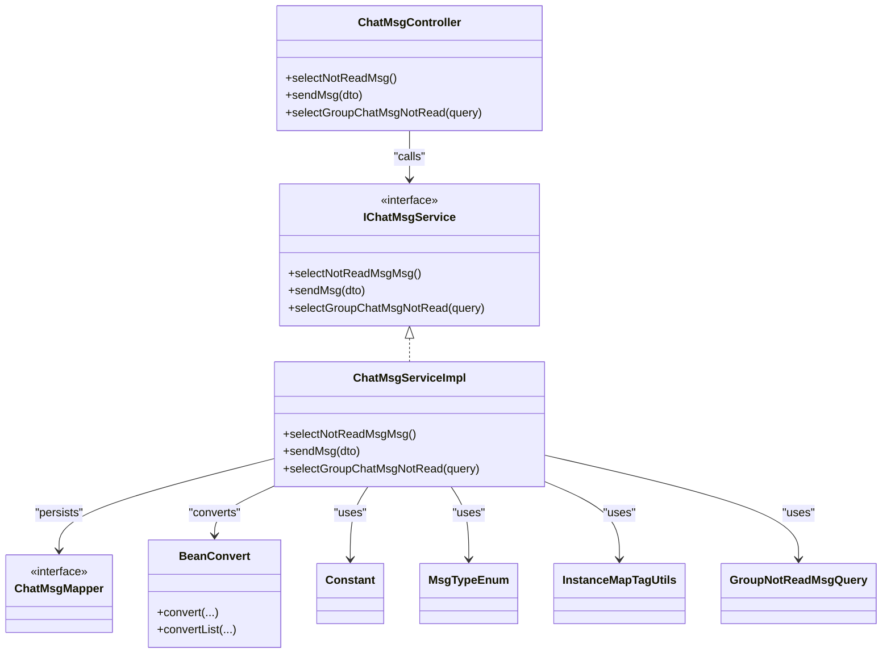

# Message Data Model

<cite>
**Referenced Files in This Document**
- [ChatMsgPO.java](file://src/main/java/com/hch/chat_simple/pojo/po/ChatMsgPO.java)
- [ChatMsgDTO.java](file://src/main/java/com/hch/chat_simple/pojo/dto/ChatMsgDTO.java)
- [ChatMsgVO.java](file://src/main/java/com/hch/chat_simple/pojo/vo/ChatMsgVO.java)
- [ChatMsgMapper.java](file://src/main/java/com/hch/chat_simple/mapper/ChatMsgMapper.java)
- [ChatMsgMapper.xml](file://src/main/resources/mapper/ChatMsgMapper.xml)
- [IChatMsgService.java](file://src/main/java/com/hch/chat_simple/service/IChatMsgService.java)
- [ChatMsgServiceImpl.java](file://src/main/java/com/hch/chat_simple/service/impl/ChatMsgServiceImpl.java)
- [ChatMsgController.java](file://src/main/java/com/hch/chat_simple/controller/ChatMsgController.java)
- [MsgTypeEnum.java](file://src/main/java/com/hch/chat_simple/enums/MsgTypeEnum.java)
- [GroupNotReadMsgQuery.java](file://src/main/java/com/hch/chat_simple/pojo/query/GroupNotReadMsgQuery.java)
- [BeanConvert.java](file://src/main/java/com/hch/chat_simple/util/BeanConvert.java)
- [Constant.java](file://src/main/java/com/hch/chat_simple/util/Constant.java)
- [InstanceMapTagUtils.java](file://src/main/java/com/hch/chat_simple/util/InstanceMapTagUtils.java)
- [BasePO.java](file://src/main/java/com/hch/chat_simple/pojo/po/BasePO.java)
- [chat.sql](file://db/chat.sql)
</cite>

## Table of Contents
1. [Introduction](#introduction)
2. [Project Structure](#project-structure)
3. [Core Components](#core-components)
4. [Architecture Overview](#architecture-overview)
5. [Detailed Component Analysis](#detailed-component-analysis)
6. [Dependency Analysis](#dependency-analysis)
7. [Performance Considerations](#performance-considerations)
8. [Troubleshooting Guide](#troubleshooting-guide)
9. [Conclusion](#conclusion)
10. [Appendices](#appendices)

## Introduction
This document describes the Message data model centered around the ChatMsgPO entity and its transformations to DTOs and VOs. It covers message types (single vs group chat), content types (text vs voice), message status tracking, lifecycle management, read/unread status, and message history queries. It also documents the ChatMsgMapper interface methods for retrieval, pagination, and filtering, along with practical examples of CRUD and complex query scenarios such as message threading and conversation history.

## Project Structure
The messaging subsystem is organized by layers:
- Persistence: PO entity and MyBatis mapper
- Service: business logic for sending, querying, and status updates
- API: REST endpoints for client interaction
- Utilities: conversion helpers, constants, and instance tagging for distribution

**Diagram sources**
- [ChatMsgPO.java:18-53](file://src/main/java/com/hch/chat_simple/pojo/po/ChatMsgPO.java#L18-L53)
- [ChatMsgMapper.java:17-20](file://src/main/java/com/hch/chat_simple/mapper/ChatMsgMapper.java#L17-L20)
- [ChatMsgMapper.xml:3-5](file://src/main/resources/mapper/ChatMsgMapper.xml#L3-L5)
- [ChatMsgServiceImpl.java:55-183](file://src/main/java/com/hch/chat_simple/service/impl/ChatMsgServiceImpl.java#L55-L183)
- [ChatMsgController.java:34-57](file://src/main/java/com/hch/chat_simple/controller/ChatMsgController.java#L34-L57)
- [MsgTypeEnum.java:6-24](file://src/main/java/com/hch/chat_simple/enums/MsgTypeEnum.java#L6-L24)
- [Constant.java:3-32](file://src/main/java/com/hch/chat_simple/util/Constant.java#L3-L32)
- [BeanConvert.java:14-69](file://src/main/java/com/hch/chat_simple/util/BeanConvert.java#L14-L69)
- [InstanceMapTagUtils.java:14-54](file://src/main/java/com/hch/chat_simple/util/InstanceMapTagUtils.java#L14-L54)
- [GroupNotReadMsgQuery.java:9-26](file://src/main/java/com/hch/chat_simple/pojo/query/GroupNotReadMsgQuery.java#L9-L26)

**Section sources**
- [ChatMsgPO.java:18-53](file://src/main/java/com/hch/chat_simple/pojo/po/ChatMsgPO.java#L18-L53)
- [ChatMsgMapper.java:17-20](file://src/main/java/com/hch/chat_simple/mapper/ChatMsgMapper.java#L17-L20)
- [ChatMsgMapper.xml:3-5](file://src/main/resources/mapper/ChatMsgMapper.xml#L3-L5)
- [ChatMsgServiceImpl.java:55-183](file://src/main/java/com/hch/chat_simple/service/impl/ChatMsgServiceImpl.java#L55-L183)
- [ChatMsgController.java:34-57](file://src/main/java/com/hch/chat_simple/controller/ChatMsgController.java#L34-L57)
- [MsgTypeEnum.java:6-24](file://src/main/java/com/hch/chat_simple/enums/MsgTypeEnum.java#L6-L24)
- [Constant.java:3-32](file://src/main/java/com/hch/chat_simple/util/Constant.java#L3-L32)
- [BeanConvert.java:14-69](file://src/main/java/com/hch/chat_simple/util/BeanConvert.java#L14-L69)
- [InstanceMapTagUtils.java:14-54](file://src/main/java/com/hch/chat_simple/util/InstanceMapTagUtils.java#L14-L54)
- [GroupNotReadMsgQuery.java:9-26](file://src/main/java/com/hch/chat_simple/pojo/query/GroupNotReadMsgQuery.java#L9-L26)

## Core Components
- ChatMsgPO: Persistent entity representing a chat message with fields for type, chat mode, sender/receiver/group, content, status, content type, and content length. Extends BasePO for audit fields and soft deletion.
- ChatMsgDTO: Transfer object for inbound/outbound message payloads, including timestamps, content metadata, and optional group recipient lists.
- ChatMsgVO: View object tailored for presentation, including derived fields like msgId and dateTime, and status indicators.
- ChatMsgMapper: MyBatis mapper extending BaseMapper to inherit common CRUD and query capabilities.
- IChatMsgService and ChatMsgServiceImpl: Business service implementing message sending, read/unread retrieval, and group chat unread queries.
- ChatMsgController: REST endpoints exposing message operations to clients.
- Supporting utilities: MsgTypeEnum, Constant, BeanConvert, InstanceMapTagUtils, GroupNotReadMsgQuery.

**Section sources**
- [ChatMsgPO.java:18-53](file://src/main/java/com/hch/chat_simple/pojo/po/ChatMsgPO.java#L18-L53)
- [ChatMsgDTO.java:13-61](file://src/main/java/com/hch/chat_simple/pojo/dto/ChatMsgDTO.java#L13-L61)
- [ChatMsgVO.java:14-61](file://src/main/java/com/hch/chat_simple/pojo/vo/ChatMsgVO.java#L14-L61)
- [ChatMsgMapper.java:17-20](file://src/main/java/com/hch/chat_simple/mapper/ChatMsgMapper.java#L17-L20)
- [IChatMsgService.java:20-27](file://src/main/java/com/hch/chat_simple/service/IChatMsgService.java#L20-L27)
- [ChatMsgServiceImpl.java:55-183](file://src/main/java/com/hch/chat_simple/service/impl/ChatMsgServiceImpl.java#L55-L183)
- [ChatMsgController.java:34-57](file://src/main/java/com/hch/chat_simple/controller/ChatMsgController.java#L34-L57)
- [MsgTypeEnum.java:6-24](file://src/main/java/com/hch/chat_simple/enums/MsgTypeEnum.java#L6-L24)
- [Constant.java:3-32](file://src/main/java/com/hch/chat_simple/util/Constant.java#L3-L32)
- [BeanConvert.java:14-69](file://src/main/java/com/hch/chat_simple/util/BeanConvert.java#L14-L69)
- [InstanceMapTagUtils.java:14-54](file://src/main/java/com/hch/chat_simple/util/InstanceMapTagUtils.java#L14-L54)
- [GroupNotReadMsgQuery.java:9-26](file://src/main/java/com/hch/chat_simple/pojo/query/GroupNotReadMsgQuery.java#L9-L26)

## Architecture Overview
The message lifecycle spans API requests, service operations, persistence, and asynchronous messaging. The service persists messages, sets initial status, and dispatches them via RocketMQ topics depending on chat type. Consumers update status asynchronously and deliver messages to connected clients.

**Diagram sources**
- [ChatMsgController.java:45-49](file://src/main/java/com/hch/chat_simple/controller/ChatMsgController.java#L45-L49)
- [ChatMsgServiceImpl.java:98-144](file://src/main/java/com/hch/chat_simple/service/impl/ChatMsgServiceImpl.java#L98-L144)
- [ChatMsgMapper.java:17-20](file://src/main/java/com/hch/chat_simple/mapper/ChatMsgMapper.java#L17-L20)

## Detailed Component Analysis

### Data Model: ChatMsgPO
- Fields:
  - Identity and audit: id, BasePO fields (createdAt, creatorId, creatorBy, updatedAt, modifierId, modifierBy, dr)
  - Type and mode: msgType (links to MsgTypeEnum), chatType (single/group)
  - Participants: sendUserId, receiveUserId (null for group), groupId
  - Content: content, contentLen, contentType (text/voice)
  - Status: status (sent failed/success)
- Notes:
  - Uses soft delete via BasePO.dr
  - Inherits creation/update metadata automatically

**Section sources**
- [ChatMsgPO.java:18-53](file://src/main/java/com/hch/chat_simple/pojo/po/ChatMsgPO.java#L18-L53)
- [BasePO.java:14-43](file://src/main/java/com/hch/chat_simple/pojo/po/BasePO.java#L14-L43)
- [MsgTypeEnum.java:6-24](file://src/main/java/com/hch/chat_simple/enums/MsgTypeEnum.java#L6-L24)
- [chat.sql:37-54](file://db/chat.sql#L37-L54)

### DTO: ChatMsgDTO
- Purpose: API payload for sending messages and carrying auxiliary fields for frontend grouping and timestamp handling.
- Notable fields: chatType, sendUserId, receiveUserId, content, groupId, createdAt, dateTime, msgId, friendId, groupToUserIds, contentType, contentLen.

**Section sources**
- [ChatMsgDTO.java:13-61](file://src/main/java/com/hch/chat_simple/pojo/dto/ChatMsgDTO.java#L13-L61)

### VO: ChatMsgVO
- Purpose: Presentation model for clients, including derived fields like msgId and dateTime, and status indicators.
- Notable fields: msgId, msgType, chatType, sendUserId, receiveUserId, content, groupId, status, dr, createdAt, creatorId, dateTime, contentType, contentLen.

**Section sources**
- [ChatMsgVO.java:14-61](file://src/main/java/com/hch/chat_simple/pojo/vo/ChatMsgVO.java#L14-L61)

### Mapper: ChatMsgMapper
- Extends MyBatis-Plus BaseMapper, inheriting standard CRUD and query methods.
- XML is currently empty; custom SQL can be added as needed.

**Section sources**
- [ChatMsgMapper.java:17-20](file://src/main/java/com/hch/chat_simple/mapper/ChatMsgMapper.java#L17-L20)
- [ChatMsgMapper.xml:3-5](file://src/main/resources/mapper/ChatMsgMapper.xml#L3-L5)

### Service: IChatMsgService and ChatMsgServiceImpl
- Methods:
  - selectNotReadMsgMsg(): Fetches single-chat messages for the current user that failed to send, marks them as sent, and returns VO list.
  - sendMsg(ChatMsgDTO): Persists message, sets defaults, selects topic/tag, publishes to MQ, and returns VO.
  - selectGroupChatMsgNotRead(GroupNotReadMsgQuery): Returns unread group messages after a given msgId per group.
- Implementation highlights:
  - Uses BeanConvert for type-safe PO/DTO/VO conversions.
  - Uses Constant for numeric semantics (single/group, success/failure, delete flags).
  - Uses InstanceMapTagUtils to distribute messages across instances/tags for single/group chat.
  - Uses MsgTypeEnum to classify SEND_MSG operations.

**Diagram sources**
- [ChatMsgServiceImpl.java:71-95](file://src/main/java/com/hch/chat_simple/service/impl/ChatMsgServiceImpl.java#L71-L95)

**Section sources**
- [IChatMsgService.java:20-27](file://src/main/java/com/hch/chat_simple/service/IChatMsgService.java#L20-L27)
- [ChatMsgServiceImpl.java:71-95](file://src/main/java/com/hch/chat_simple/service/impl/ChatMsgServiceImpl.java#L71-L95)
- [ChatMsgServiceImpl.java:98-144](file://src/main/java/com/hch/chat_simple/service/impl/ChatMsgServiceImpl.java#L98-L144)
- [ChatMsgServiceImpl.java:146-181](file://src/main/java/com/hch/chat_simple/service/impl/ChatMsgServiceImpl.java#L146-L181)
- [BeanConvert.java:14-69](file://src/main/java/com/hch/chat_simple/util/BeanConvert.java#L14-L69)
- [Constant.java:3-32](file://src/main/java/com/hch/chat_simple/util/Constant.java#L3-L32)
- [InstanceMapTagUtils.java:14-54](file://src/main/java/com/hch/chat_simple/util/InstanceMapTagUtils.java#L14-L54)
- [MsgTypeEnum.java:6-24](file://src/main/java/com/hch/chat_simple/enums/MsgTypeEnum.java#L6-L24)

### Controller: ChatMsgController
- Endpoints:
  - POST /chatMsg/selectNotReadMsg: Returns unacknowledged single-chat messages for the current user.
  - POST /chatMsg/sendMsg: Sends a message (single or group) and returns the persisted VO.
  - POST /chatMsg/selectGroupChatMsgNotRead: Returns unread group messages after given msgIds per group.

**Section sources**
- [ChatMsgController.java:39-55](file://src/main/java/com/hch/chat_simple/controller/ChatMsgController.java#L39-L55)

### Message Types and Content Types
- Message types (msgType):
  - Defined by MsgTypeEnum with values including SEND_MSG for chat messages.
- Chat types (chatType):
  - Single chat and group chat constants.
- Content types (contentType):
  - Text and voice, persisted and exposed in both PO and VO.

**Section sources**
- [MsgTypeEnum.java:6-24](file://src/main/java/com/hch/chat_simple/enums/MsgTypeEnum.java#L6-L24)
- [Constant.java:19-21](file://src/main/java/com/hch/chat_simple/util/Constant.java#L19-L21)
- [ChatMsgPO.java:47-48](file://src/main/java/com/hch/chat_simple/pojo/po/ChatMsgPO.java#L47-L48)
- [ChatMsgVO.java:55-59](file://src/main/java/com/hch/chat_simple/pojo/vo/ChatMsgVO.java#L55-L59)

### Message Lifecycle Management and Status Tracking
- Lifecycle stages:
  - Creation: PO persisted with status=failed and dr=not deleted.
  - Dispatch: Published to MQ with topic and tag selection.
  - Ack/Nack: Producer handles outcomes; service marks success on subsequent reads.
  - Presentation: VO exposes status and dateTime for UI.
- Read/unread:
  - Unread retrieval filters by receiveUserId, chatType=single, and status=failed.
  - After retrieval, status is updated to success to avoid duplicates.

**Section sources**
- [ChatMsgServiceImpl.java:106-114](file://src/main/java/com/hch/chat_simple/service/impl/ChatMsgServiceImpl.java#L106-L114)
- [ChatMsgServiceImpl.java:71-95](file://src/main/java/com/hch/chat_simple/service/impl/ChatMsgServiceImpl.java#L71-L95)
- [ChatMsgPO.java:44-45](file://src/main/java/com/hch/chat_simple/pojo/po/ChatMsgPO.java#L44-L45)
- [ChatMsgVO.java:39-40](file://src/main/java/com/hch/chat_simple/pojo/vo/ChatMsgVO.java#L39-L40)

### Message History Queries and Threading
- Single-chat history:
  - Use standard MyBatis-Plus queries on ChatMsgPO filtered by participants and chatType.
- Group-chat threading:
  - selectGroupChatMsgNotRead accepts a list of groups with last msgId per group, enabling incremental unread retrieval per thread.
- Pagination:
  - BaseMapper supports pagination; BeanConvert preserves Page metadata during conversion.

**Section sources**
- [ChatMsgServiceImpl.java:146-181](file://src/main/java/com/hch/chat_simple/service/impl/ChatMsgServiceImpl.java#L146-L181)
- [GroupNotReadMsgQuery.java:9-26](file://src/main/java/com/hch/chat_simple/pojo/query/GroupNotReadMsgQuery.java#L9-L26)
- [BeanConvert.java:38-57](file://src/main/java/com/hch/chat_simple/util/BeanConvert.java#L38-L57)

### Message Content Validation, Length Restrictions, and Type Safety
- Database constraints:
  - content length capped at 1000; content_type and content_len columns added to enforce content metadata.
- Type safety:
  - Strongly typed enums and constants for msgType, chatType, contentType, and status.
  - BeanConvert ensures safe PO/DTO/VO transformations with optional transformers for derived fields.

**Section sources**
- [chat.sql:44-46](file://db/chat.sql#L44-L46)
- [chat.sql:127-130](file://db/chat.sql#L127-L130)
- [MsgTypeEnum.java:6-24](file://src/main/java/com/hch/chat_simple/enums/MsgTypeEnum.java#L6-L24)
- [Constant.java:3-32](file://src/main/java/com/hch/chat_simple/util/Constant.java#L3-L32)
- [BeanConvert.java:17-27](file://src/main/java/com/hch/chat_simple/util/BeanConvert.java#L17-L27)

### Examples: CRUD and Complex Queries

- Send a single-chat message:
  - Endpoint: POST /chatMsg/sendMsg
  - Input: ChatMsgDTO with chatType=1, sendUserId, receiveUserId, content, contentType
  - Behavior: Persist PO, publish to single-chat topic, return ChatMsgVO with msgId and dateTime

- Send a group-chat message:
  - Endpoint: POST /chatMsg/sendMsg
  - Input: ChatMsgDTO with chatType=2, groupId, content, contentType
  - Behavior: Persist PO, query group members, distribute by tag, publish to multi-chat topic, return ChatMsgVO

- Retrieve unread single-chat messages:
  - Endpoint: POST /chatMsg/selectNotReadMsg
  - Behavior: Load failed-sent messages for current user, mark as success, return VO list

- Query unread group messages per thread:
  - Endpoint: POST /chatMsg/selectGroupChatMsgNotRead
  - Input: GroupNotReadMsgQuery with groupList entries containing groupId and last msgId
  - Behavior: Return messages newer than provided msgId per group

**Section sources**
- [ChatMsgController.java:45-55](file://src/main/java/com/hch/chat_simple/controller/ChatMsgController.java#L45-L55)
- [ChatMsgServiceImpl.java:98-144](file://src/main/java/com/hch/chat_simple/service/impl/ChatMsgServiceImpl.java#L98-L144)
- [ChatMsgServiceImpl.java:71-95](file://src/main/java/com/hch/chat_simple/service/impl/ChatMsgServiceImpl.java#L71-L95)
- [ChatMsgServiceImpl.java:146-181](file://src/main/java/com/hch/chat_simple/service/impl/ChatMsgServiceImpl.java#L146-L181)
- [GroupNotReadMsgQuery.java:9-26](file://src/main/java/com/hch/chat_simple/pojo/query/GroupNotReadMsgQuery.java#L9-L26)

## Dependency Analysis
- ChatMsgServiceImpl depends on:
  - ChatMsgMapper for persistence
  - BeanConvert for type conversions
  - Constant for semantic values
  - MsgTypeEnum for message classification
  - InstanceMapTagUtils for instance distribution
  - IGroupInfoService for group member resolution (group chat)
- ChatMsgController depends on IChatMsgService for orchestration.

**Diagram sources**
- [ChatMsgController.java:34-57](file://src/main/java/com/hch/chat_simple/controller/ChatMsgController.java#L34-L57)
- [IChatMsgService.java:20-27](file://src/main/java/com/hch/chat_simple/service/IChatMsgService.java#L20-L27)
- [ChatMsgServiceImpl.java:55-183](file://src/main/java/com/hch/chat_simple/service/impl/ChatMsgServiceImpl.java#L55-L183)
- [ChatMsgMapper.java:17-20](file://src/main/java/com/hch/chat_simple/mapper/ChatMsgMapper.java#L17-L20)
- [BeanConvert.java:14-69](file://src/main/java/com/hch/chat_simple/util/BeanConvert.java#L14-L69)
- [Constant.java:3-32](file://src/main/java/com/hch/chat_simple/util/Constant.java#L3-L32)
- [MsgTypeEnum.java:6-24](file://src/main/java/com/hch/chat_simple/enums/MsgTypeEnum.java#L6-L24)
- [InstanceMapTagUtils.java:14-54](file://src/main/java/com/hch/chat_simple/util/InstanceMapTagUtils.java#L14-L54)
- [GroupNotReadMsgQuery.java:9-26](file://src/main/java/com/hch/chat_simple/pojo/query/GroupNotReadMsgQuery.java#L9-L26)

**Section sources**
- [ChatMsgController.java:34-57](file://src/main/java/com/hch/chat_simple/controller/ChatMsgController.java#L34-L57)
- [IChatMsgService.java:20-27](file://src/main/java/com/hch/chat_simple/service/IChatMsgService.java#L20-L27)
- [ChatMsgServiceImpl.java:55-183](file://src/main/java/com/hch/chat_simple/service/impl/ChatMsgServiceImpl.java#L55-L183)
- [ChatMsgMapper.java:17-20](file://src/main/java/com/hch/chat_simple/mapper/ChatMsgMapper.java#L17-L20)
- [BeanConvert.java:14-69](file://src/main/java/com/hch/chat_simple/util/BeanConvert.java#L14-L69)
- [Constant.java:3-32](file://src/main/java/com/hch/chat_simple/util/Constant.java#L3-L32)
- [MsgTypeEnum.java:6-24](file://src/main/java/com/hch/chat_simple/enums/MsgTypeEnum.java#L6-L24)
- [InstanceMapTagUtils.java:14-54](file://src/main/java/com/hch/chat_simple/util/InstanceMapTagUtils.java#L14-L54)
- [GroupNotReadMsgQuery.java:9-26](file://src/main/java/com/hch/chat_simple/pojo/query/GroupNotReadMsgQuery.java#L9-L26)

## Performance Considerations
- Tag-based distribution: InstanceMapTagUtils distributes messages across instances to scale out message delivery.
- Batch updates: selectNotReadMsgMsg performs batch updates to avoid repeated polling of failed messages.
- Incremental group queries: selectGroupChatMsgNotRead uses per-group msgId thresholds to minimize result sets.
- Pagination support: BeanConvert preserves Page metadata to enable efficient paging.

[No sources needed since this section provides general guidance]

## Troubleshooting Guide
- Messages remain marked as failed:
  - Verify MQ publishing succeeded and consumers updated status. Check producer logs and topic configurations.
- Duplicate unread messages:
  - selectNotReadMsgMsg marks messages as successful upon retrieval; ensure the batch update succeeds.
- Group messages not delivered:
  - Confirm group member resolution and tag distribution logic. Validate chat.tag.list configuration used by InstanceMapTagUtils.
- VO fields missing derived values:
  - BeanConvert transformer populates msgId and dateTime; ensure conversion is invoked with the transformer.

**Section sources**
- [ChatMsgServiceImpl.java:71-95](file://src/main/java/com/hch/chat_simple/service/impl/ChatMsgServiceImpl.java#L71-L95)
- [ChatMsgServiceImpl.java:118-135](file://src/main/java/com/hch/chat_simple/service/impl/ChatMsgServiceImpl.java#L118-L135)
- [InstanceMapTagUtils.java:32-46](file://src/main/java/com/hch/chat_simple/util/InstanceMapTagUtils.java#L32-L46)
- [BeanConvert.java:17-27](file://src/main/java/com/hch/chat_simple/util/BeanConvert.java#L17-L27)

## Conclusion
The message data model cleanly separates persistence (ChatMsgPO), transport (ChatMsgDTO), and presentation (ChatMsgVO). The service layer enforces type safety, manages lifecycle states, and scales delivery via tag-based distribution. Queries support both single-chat and group-chat scenarios, with incremental unread retrieval for threading and conversation history.

[No sources needed since this section summarizes without analyzing specific files]

## Appendices

### Message Schema Reference
- chat_msg table columns include msg_type, chat_type, send_user_id, receive_user_id, content, group_id, status, content_type, content_len, and audit fields with dr for soft deletion.

**Section sources**
- [chat.sql:37-54](file://db/chat.sql#L37-L54)