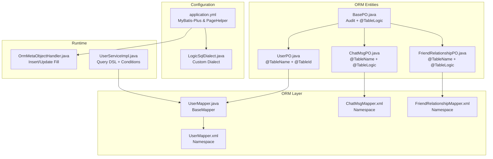
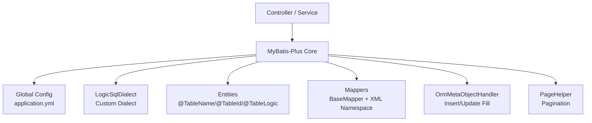
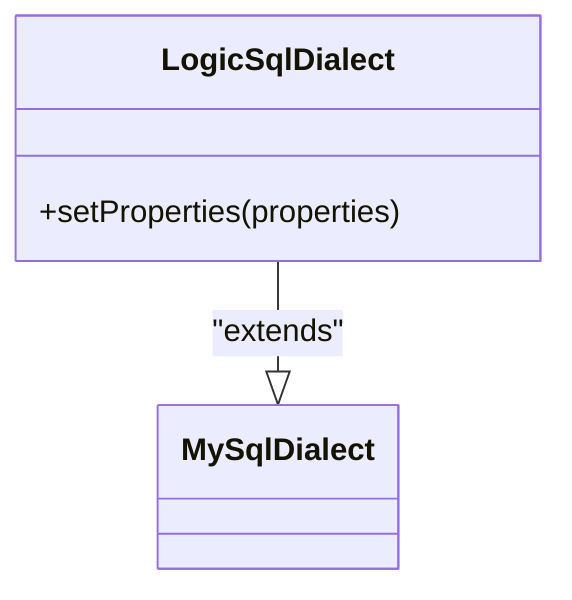
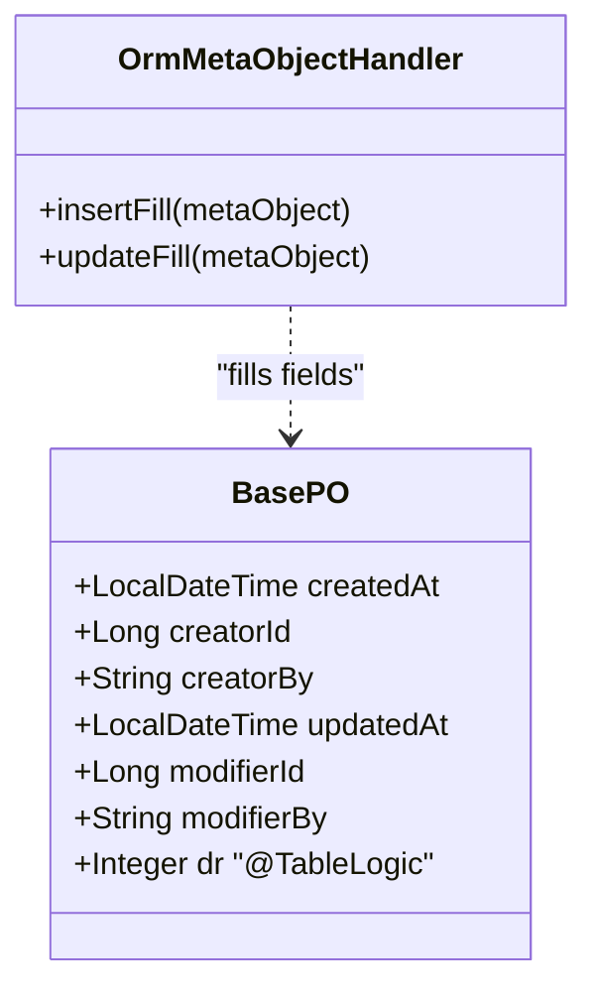
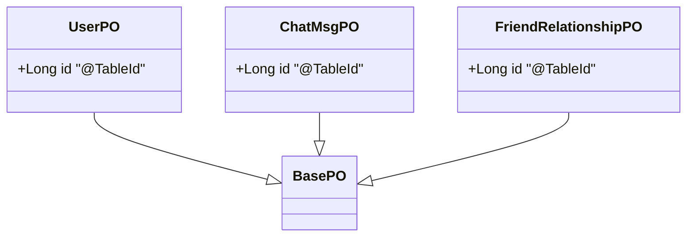
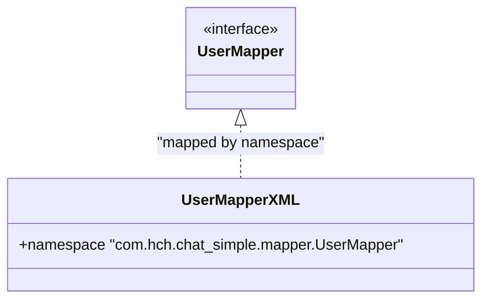
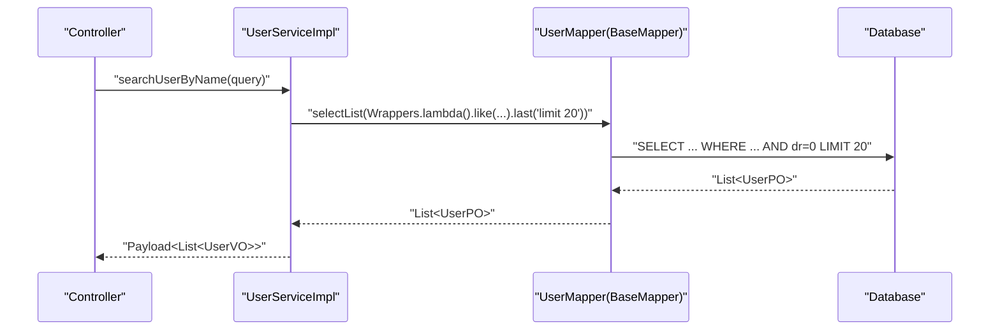
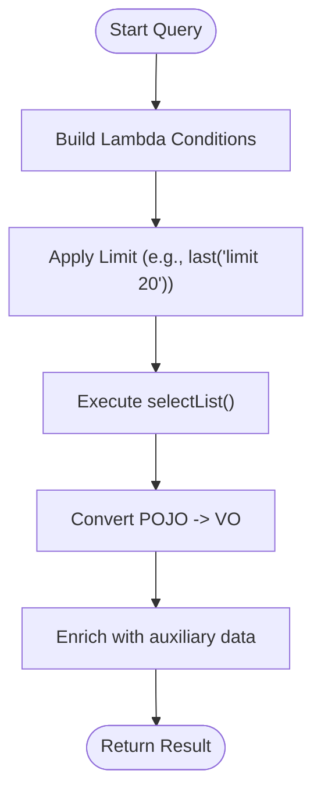
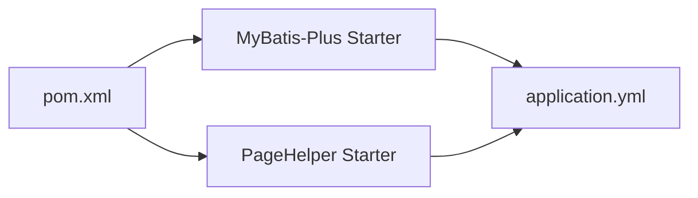

# MyBatis Plus Configuration

<cite>
**Referenced Files in This Document**
- [LogicSqlDialect.java](file://src/main/java/com/hch/chat_simple/config/LogicSqlDialect.java)
- [application.yml](file://src/main/resources/application.yml)
- [pom.xml](file://pom.xml)
- [BasePO.java](file://src/main/java/com/hch/chat_simple/pojo/po/BasePO.java)
- [OrmMetaObjectHandler.java](file://src/main/java/com/hch/chat_simple/config/OrmMetaObjectHandler.java)
- [UserPO.java](file://src/main/java/com/hch/chat_simple/pojo/po/UserPO.java)
- [ChatMsgPO.java](file://src/main/java/com/hch/chat_simple/pojo/po/ChatMsgPO.java)
- [FriendRelationshipPO.java](file://src/main/java/com/hch/chat_simple/pojo/po/FriendRelationshipPO.java)
- [UserMapper.java](file://src/main/java/com/hch/chat_simple/mapper/UserMapper.java)
- [UserMapper.xml](file://src/main/resources/mapper/UserMapper.xml)
- [ChatMsgMapper.xml](file://src/main/resources/mapper/ChatMsgMapper.xml)
- [FriendRelationshipMapper.xml](file://src/main/resources/mapper/FriendRelationshipMapper.xml)
- [UserServiceImpl.java](file://src/main/java/com/hch/chat_simple/service/impl/UserServiceImpl.java)
- [PageBean.java](file://src/main/java/com/hch/chat_simple/util/PageBean.java)
- [UserQuery.java](file://src/main/java/com/hch/chat_simple/pojo/query/UserQuery.java)
- [WebMvcConfig.java](file://src/main/java/com/hch/chat_simple/config/WebMvcConfig.java)
</cite>

## Table of Contents
1. [Introduction](#introduction)
2. [Project Structure](#project-structure)
3. [Core Components](#core-components)
4. [Architecture Overview](#architecture-overview)
5. [Detailed Component Analysis](#detailed-component-analysis)
6. [Dependency Analysis](#dependency-analysis)
7. [Performance Considerations](#performance-considerations)
8. [Troubleshooting Guide](#troubleshooting-guide)
9. [Conclusion](#conclusion)

## Introduction
This document explains the MyBatis Plus configuration and implementation details for the Chat Simple application. It focuses on logical deletion handling via a custom dialect, XML mapper configurations, annotation-driven mapping, query patterns, pagination integration, and performance optimization techniques. The goal is to help developers understand how the ORM layer is configured and how to extend or maintain it effectively.

## Project Structure
The MyBatis Plus configuration spans several areas:
- Global configuration via application.yml
- Custom dialect for logical deletion and count/order parsing
- Base entity with common audit/logic-delete fields
- Meta-object handler for automatic field filling
- POJO entities annotated for table mapping and logical deletion
- Mapper interfaces extending BaseMapper with XML namespaces
- Service layer leveraging MyBatis Plus query DSL and conditions

**Diagram sources**
- [application.yml:24-39](file://src/main/resources/application.yml#L24-L39)
- [LogicSqlDialect.java:12-20](file://src/main/java/com/hch/chat_simple/config/LogicSqlDialect.java#L12-L20)
- [BasePO.java:14-43](file://src/main/java/com/hch/chat_simple/pojo/po/BasePO.java#L14-L43)
- [UserPO.java:25-32](file://src/main/java/com/hch/chat_simple/pojo/po/UserPO.java#L25-L32)
- [ChatMsgPO.java:16-22](file://src/main/java/com/hch/chat_simple/pojo/po/ChatMsgPO.java#L16-L22)
- [FriendRelationshipPO.java:23-30](file://src/main/java/com/hch/chat_simple/pojo/po/FriendRelationshipPO.java#L23-L30)
- [UserMapper.java:18-21](file://src/main/java/com/hch/chat_simple/mapper/UserMapper.java#L18-L21)
- [UserMapper.xml:3](file://src/main/resources/mapper/UserMapper.xml#L3)
- [ChatMsgMapper.xml:3](file://src/main/resources/mapper/ChatMsgMapper.xml#L3)
- [FriendRelationshipMapper.xml:3](file://src/main/resources/mapper/FriendRelationshipMapper.xml#L3)
- [OrmMetaObjectHandler.java:16-33](file://src/main/java/com/hch/chat_simple/config/OrmMetaObjectHandler.java#L16-L33)
- [UserServiceImpl.java:43-48](file://src/main/java/com/hch/chat_simple/service/impl/UserServiceImpl.java#L43-L48)

**Section sources**
- [application.yml:24-39](file://src/main/resources/application.yml#L24-L39)
- [LogicSqlDialect.java:12-20](file://src/main/java/com/hch/chat_simple/config/LogicSqlDialect.java#L12-L20)
- [BasePO.java:14-43](file://src/main/java/com/hch/chat_simple/pojo/po/BasePO.java#L14-L43)
- [UserPO.java:25-32](file://src/main/java/com/hch/chat_simple/pojo/po/UserPO.java#L25-L32)
- [ChatMsgPO.java:16-22](file://src/main/java/com/hch/chat_simple/pojo/po/ChatMsgPO.java#L16-L22)
- [FriendRelationshipPO.java:23-30](file://src/main/java/com/hch/chat_simple/pojo/po/FriendRelationshipPO.java#L23-L30)
- [UserMapper.java:18-21](file://src/main/java/com/hch/chat_simple/mapper/UserMapper.java#L18-L21)
- [UserMapper.xml:3](file://src/main/resources/mapper/UserMapper.xml#L3)
- [ChatMsgMapper.xml:3](file://src/main/resources/mapper/ChatMsgMapper.xml#L3)
- [FriendRelationshipMapper.xml:3](file://src/main/resources/mapper/FriendRelationshipMapper.xml#L3)
- [OrmMetaObjectHandler.java:16-33](file://src/main/java/com/hch/chat_simple/config/OrmMetaObjectHandler.java#L16-L33)
- [UserServiceImpl.java:43-48](file://src/main/java/com/hch/chat_simple/service/impl/UserServiceImpl.java#L43-L48)

## Core Components
- Global MyBatis-Plus configuration:
  - Logical deletion field and values are configured globally.
  - Mapper XML locations are scanned recursively.
- Custom dialect:
  - A custom dialect extends the MySQL dialect and wires count/order parsers.
- Base entity and meta-object handler:
  - BasePO defines audit fields and a logic-delete field.
  - OrmMetaObjectHandler auto-fills insert/update fields using runtime context.
- POJO annotations:
  - @TableName maps entities to tables.
  - @TableId defines primary keys with ID generation strategy.
  - @TableLogic marks the logic-delete field for automatic filtering and updates.
- Mapper interfaces and XML:
  - Interfaces extend BaseMapper to inherit CRUD and query methods.
  - XML namespaces define mapper namespaces; empty XML files currently rely on annotations and global settings.
- Query patterns:
  - Services use MyBatis-Plus query DSL and wrappers for conditions and limits.

**Section sources**
- [application.yml:24-30](file://src/main/resources/application.yml#L24-L30)
- [LogicSqlDialect.java:12-20](file://src/main/java/com/hch/chat_simple/config/LogicSqlDialect.java#L12-L20)
- [BasePO.java:14-43](file://src/main/java/com/hch/chat_simple/pojo/po/BasePO.java#L14-L43)
- [OrmMetaObjectHandler.java:16-33](file://src/main/java/com/hch/chat_simple/config/OrmMetaObjectHandler.java#L16-L33)
- [UserPO.java:25-32](file://src/main/java/com/hch/chat_simple/pojo/po/UserPO.java#L25-L32)
- [ChatMsgPO.java:16-22](file://src/main/java/com/hch/chat_simple/pojo/po/ChatMsgPO.java#L16-L22)
- [FriendRelationshipPO.java:23-30](file://src/main/java/com/hch/chat_simple/pojo/po/FriendRelationshipPO.java#L23-L30)
- [UserMapper.java:18-21](file://src/main/java/com/hch/chat_simple/mapper/UserMapper.java#L18-L21)
- [UserMapper.xml:3](file://src/main/resources/mapper/UserMapper.xml#L3)
- [ChatMsgMapper.xml:3](file://src/main/resources/mapper/ChatMsgMapper.xml#L3)
- [FriendRelationshipMapper.xml:3](file://src/main/resources/mapper/FriendRelationshipMapper.xml#L3)
- [UserServiceImpl.java:43-48](file://src/main/java/com/hch/chat_simple/service/impl/UserServiceImpl.java#L43-L48)

## Architecture Overview
The ORM architecture integrates Spring Boot, MyBatis Plus, and PageHelper. The custom dialect ensures logical deletion-aware count and order parsing. The base entity pattern centralizes auditing and soft-deletion semantics. Services compose queries using lambda conditions and wrappers.

**Diagram sources**
- [application.yml:24-39](file://src/main/resources/application.yml#L24-L39)
- [LogicSqlDialect.java:12-20](file://src/main/java/com/hch/chat_simple/config/LogicSqlDialect.java#L12-L20)
- [BasePO.java:14-43](file://src/main/java/com/hch/chat_simple/pojo/po/BasePO.java#L14-L43)
- [UserMapper.java:18-21](file://src/main/java/com/hch/chat_simple/mapper/UserMapper.java#L18-L21)
- [OrmMetaObjectHandler.java:16-33](file://src/main/java/com/hch/chat_simple/config/OrmMetaObjectHandler.java#L16-L33)

## Detailed Component Analysis

### Global Configuration and Dependencies
- MyBatis-Plus starter and version alignment are declared in the build file.
- PageHelper starter is included for pagination.
- application.yml configures:
  - MyBatis-Plus global DB config for logical delete (field, delete/not-delete values)
  - Mapper XML location scanning
  - PageHelper dialect and arguments support

**Section sources**
- [pom.xml:176-194](file://pom.xml#L176-L194)
- [pom.xml:155-173](file://pom.xml#L155-L173)
- [application.yml:24-39](file://src/main/resources/application.yml#L24-L39)

### Custom LogicSqlDialect for Logical Deletion and Query Optimization
- Purpose:
  - Extends the MySQL dialect used by PageHelper.
  - Overrides property initialization to wire count and order SQL parsers.
- Impact:
  - Ensures count queries and ORDER BY clauses respect logical deletion semantics during pagination.
  - Improves correctness of total counts and sorted results when soft-deleted records exist.

**Diagram sources**
- [LogicSqlDialect.java:12-20](file://src/main/java/com/hch/chat_simple/config/LogicSqlDialect.java#L12-L20)

**Section sources**
- [LogicSqlDialect.java:12-20](file://src/main/java/com/hch/chat_simple/config/LogicSqlDialect.java#L12-L20)

### Base Entity and Automatic Field Filling
- BasePO defines:
  - Audit fields filled on insert/update
  - A logic-delete field annotated with @TableLogic
- OrmMetaObjectHandler:
  - Inserts creator/modifier info and timestamps
  - Sets initial logic-delete value on create
  - Updates modifier info and timestamps on update

**Diagram sources**
- [BasePO.java:14-43](file://src/main/java/com/hch/chat_simple/pojo/po/BasePO.java#L14-L43)
- [OrmMetaObjectHandler.java:16-33](file://src/main/java/com/hch/chat_simple/config/OrmMetaObjectHandler.java#L16-L33)

**Section sources**
- [BasePO.java:14-43](file://src/main/java/com/hch/chat_simple/pojo/po/BasePO.java#L14-L43)
- [OrmMetaObjectHandler.java:16-33](file://src/main/java/com/hch/chat_simple/config/OrmMetaObjectHandler.java#L16-L33)

### POJO Annotations and Field Mapping Strategies
- @TableName: Maps entities to database tables.
- @TableId: Declares primary keys and generation strategy.
- @TableLogic: Marks the soft-delete field for automatic filtering and updates.
- Inheritance: UserPO, ChatMsgPO, and FriendRelationshipPO extend BasePO to inherit audit and soft-delete fields.

**Diagram sources**
- [UserPO.java:25-32](file://src/main/java/com/hch/chat_simple/pojo/po/UserPO.java#L25-L32)
- [ChatMsgPO.java:16-22](file://src/main/java/com/hch/chat_simple/pojo/po/ChatMsgPO.java#L16-L22)
- [FriendRelationshipPO.java:23-30](file://src/main/java/com/hch/chat_simple/pojo/po/FriendRelationshipPO.java#L23-L30)
- [BasePO.java:14-43](file://src/main/java/com/hch/chat_simple/pojo/po/BasePO.java#L14-L43)

**Section sources**
- [UserPO.java:25-32](file://src/main/java/com/hch/chat_simple/pojo/po/UserPO.java#L25-L32)
- [ChatMsgPO.java:16-22](file://src/main/java/com/hch/chat_simple/pojo/po/ChatMsgPO.java#L16-L22)
- [FriendRelationshipPO.java:23-30](file://src/main/java/com/hch/chat_simple/pojo/po/FriendRelationshipPO.java#L23-L30)
- [BasePO.java:14-43](file://src/main/java/com/hch/chat_simple/pojo/po/BasePO.java#L14-L43)

### XML Mapper Configuration
- Mapper interfaces extend BaseMapper to inherit generic CRUD and query methods.
- XML files declare namespaces for each mapper; current files are minimal and rely on annotations and global settings.
- Typical usage:
  - Define custom SQL statements in XML when needed.
  - Use result maps and parameter handling aligned with POJO field names.

**Diagram sources**
- [UserMapper.java:18-21](file://src/main/java/com/hch/chat_simple/mapper/UserMapper.java#L18-L21)
- [UserMapper.xml:3](file://src/main/resources/mapper/UserMapper.xml#L3)
- [ChatMsgMapper.xml:3](file://src/main/resources/mapper/ChatMsgMapper.xml#L3)
- [FriendRelationshipMapper.xml:3](file://src/main/resources/mapper/FriendRelationshipMapper.xml#L3)

**Section sources**
- [UserMapper.java:18-21](file://src/main/java/com/hch/chat_simple/mapper/UserMapper.java#L18-L21)
- [UserMapper.xml:3](file://src/main/resources/mapper/UserMapper.xml#L3)
- [ChatMsgMapper.xml:3](file://src/main/resources/mapper/ChatMsgMapper.xml#L3)
- [FriendRelationshipMapper.xml:3](file://src/main/resources/mapper/FriendRelationshipMapper.xml#L3)

### Pagination Implementation and Query Method Patterns
- PageHelper integration:
  - Dialect configured to MySQL.
  - Arguments support enabled for method signatures.
- Query patterns in services:
  - Use lambda conditions and wrappers for filtering and ordering.
  - Append limit clauses for top-N queries when appropriate.
- Pagination model:
  - PageBean encapsulates page, size, and list fields for response envelopes.

**Diagram sources**
- [UserServiceImpl.java:51-80](file://src/main/java/com/hch/chat_simple/service/impl/UserServiceImpl.java#L51-L80)
- [UserQuery.java:9-14](file://src/main/java/com/hch/chat_simple/pojo/query/UserQuery.java#L9-L14)
- [PageBean.java:9-20](file://src/main/java/com/hch/chat_simple/util/PageBean.java#L9-L20)

**Section sources**
- [application.yml:34-38](file://src/main/resources/application.yml#L34-L38)
- [UserServiceImpl.java:51-80](file://src/main/java/com/hch/chat_simple/service/impl/UserServiceImpl.java#L51-L80)
- [UserQuery.java:9-14](file://src/main/java/com/hch/chat_simple/pojo/query/UserQuery.java#L9-L14)
- [PageBean.java:9-20](file://src/main/java/com/hch/chat_simple/util/PageBean.java#L9-L20)

### Batch Operations, Optimistic Locking, and Performance Optimization
- Batch operations:
  - JDBC rewriteBatchedStatements enabled in datasource URL to improve batch performance.
  - MyBatis Plus supports batch inserts/updates via chained operations; ensure consistent primary key generation and transaction boundaries.
- Optimistic locking:
  - Not configured in the current codebase. To enable, add a version field with @Version and configure global strategy in MyBatis-Plus if desired.
- Performance tips:
  - Prefer lambda conditions and select only required fields.
  - Use last(limit ...) judiciously for top-N queries.
  - Leverage PageHelper for pagination to avoid loading large result sets.
  - Keep XML minimal and rely on annotations for mapping to reduce maintenance overhead.

**Section sources**
- [application.yml:18](file://src/main/resources/application.yml#L18)
- [UserServiceImpl.java:52-55](file://src/main/java/com/hch/chat_simple/service/impl/UserServiceImpl.java#L52-L55)

### Complex Queries, Dynamic SQL, and Custom Result Handling
- Complex queries:
  - Combine multiple conditions using lambda wrappers.
  - Use in(...) and other predicates for related-entity filtering.
- Dynamic SQL:
  - Current XML files are minimal; define custom statements in XML when needed.
  - Use trim, where, choose, when, otherwise, foreach, and bind for dynamic constructs.
- Custom result handling:
  - Convert POJO lists to VO lists after retrieval.
  - Enrich results with auxiliary data (e.g., friend relationship flags) post-query.

**Diagram sources**
- [UserServiceImpl.java:51-80](file://src/main/java/com/hch/chat_simple/service/impl/UserServiceImpl.java#L51-L80)

**Section sources**
- [UserServiceImpl.java:51-80](file://src/main/java/com/hch/chat_simple/service/impl/UserServiceImpl.java#L51-L80)
- [UserMapper.xml:3](file://src/main/resources/mapper/UserMapper.xml#L3)
- [ChatMsgMapper.xml:3](file://src/main/resources/mapper/ChatMsgMapper.xml#L3)
- [FriendRelationshipMapper.xml:3](file://src/main/resources/mapper/FriendRelationshipMapper.xml#L3)

## Dependency Analysis
- MyBatis-Plus starter and PageHelper starter are declared in the build file.
- PageHelper starter excludes transitive mybatis/mybatis-spring to align versions.
- application.yml configures MyBatis-Plus and PageHelper properties.

**Diagram sources**
- [pom.xml:176-194](file://pom.xml#L176-L194)
- [pom.xml:155-173](file://pom.xml#L155-L173)
- [application.yml:24-39](file://src/main/resources/application.yml#L24-L39)

**Section sources**
- [pom.xml:176-194](file://pom.xml#L176-L194)
- [pom.xml:155-173](file://pom.xml#L155-L173)
- [application.yml:24-39](file://src/main/resources/application.yml#L24-L39)

## Performance Considerations
- Logical deletion:
  - Ensure dr column exists and is indexed for efficient filtering.
  - Use the custom dialect to keep count and sort accurate under soft deletes.
- Pagination:
  - Enable reasonable pagination and argument support to avoid unbounded queries.
- Batch writes:
  - JDBC rewriteBatchedStatements improves batch performance; verify batch sizes and transactions.
- Query patterns:
  - Prefer selective field retrieval and limit clauses for large datasets.
  - Avoid N+1 queries by batching related lookups.

[No sources needed since this section provides general guidance]

## Troubleshooting Guide
- Logical deletion not applied:
  - Verify global configuration for logic-delete field and values.
  - Confirm @TableLogic is present on the field in the entity.
- Count or sort incorrect with soft deletes:
  - Ensure the custom dialect is recognized by PageHelper and configured in application.yml.
- Auto-fill not working:
  - Confirm OrmMetaObjectHandler bean is registered and ContextUtil provides expected values.
- XML mapper not found:
  - Ensure mapper-locations scan classpath and XML namespace matches the interface package.

**Section sources**
- [application.yml:24-30](file://src/main/resources/application.yml#L24-L30)
- [LogicSqlDialect.java:12-20](file://src/main/java/com/hch/chat_simple/config/LogicSqlDialect.java#L12-L20)
- [BasePO.java:14-43](file://src/main/java/com/hch/chat_simple/pojo/po/BasePO.java#L14-L43)
- [OrmMetaObjectHandler.java:16-33](file://src/main/java/com/hch/chat_simple/config/OrmMetaObjectHandler.java#L16-L33)
- [UserMapper.xml:3](file://src/main/resources/mapper/UserMapper.xml#L3)

## Conclusion
The Chat Simple application leverages MyBatis Plus with a custom dialect for robust logical deletion handling and integrates PageHelper for pagination. A base entity pattern and meta-object handler streamline audit and soft-delete semantics. Mapper interfaces and XML namespaces provide a clean separation of concerns, while service-layer query patterns demonstrate practical usage of lambda conditions and result conversion. With careful attention to indexing, query design, and configuration, the ORM layer delivers both correctness and performance.