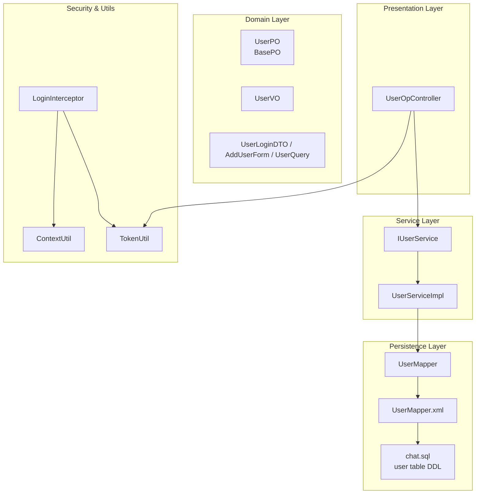
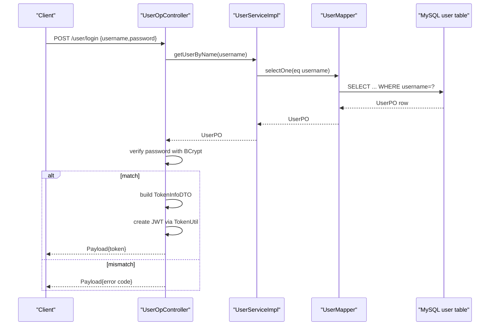
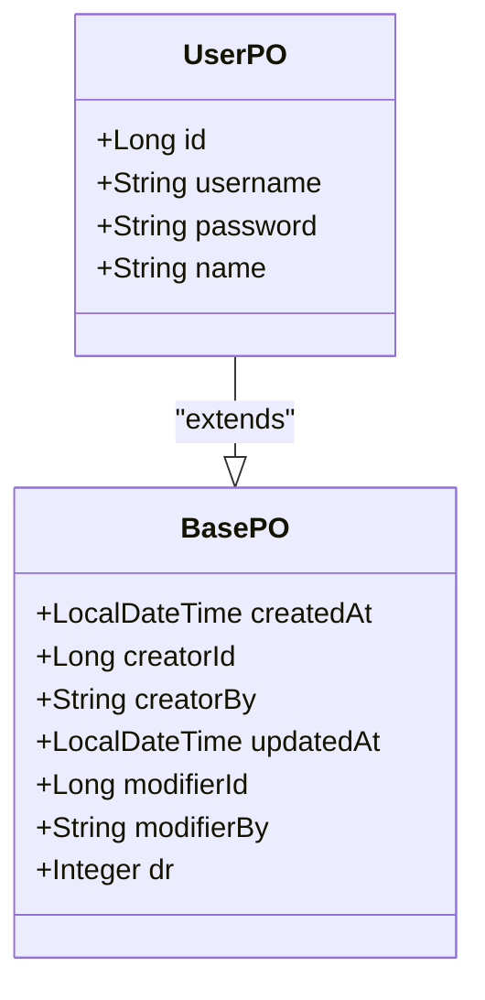
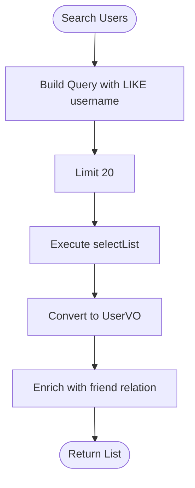
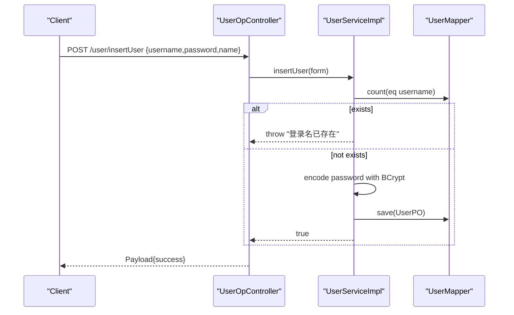
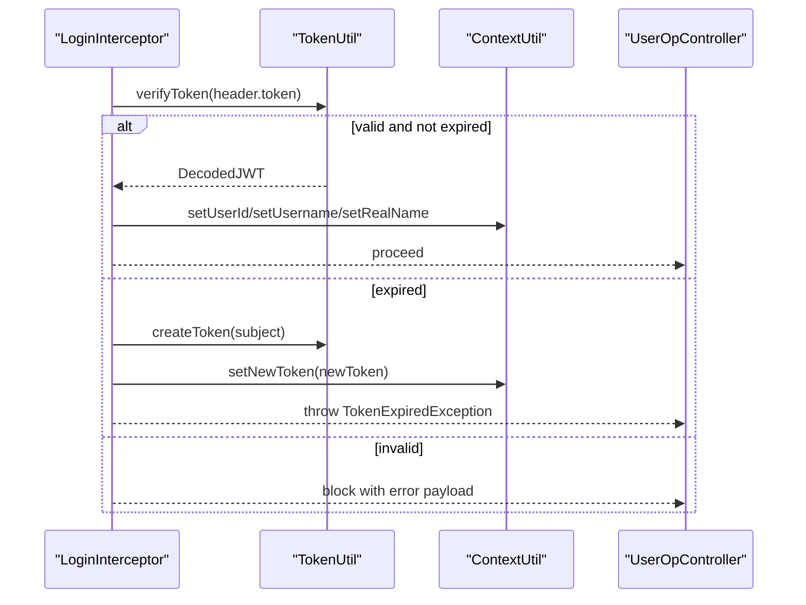
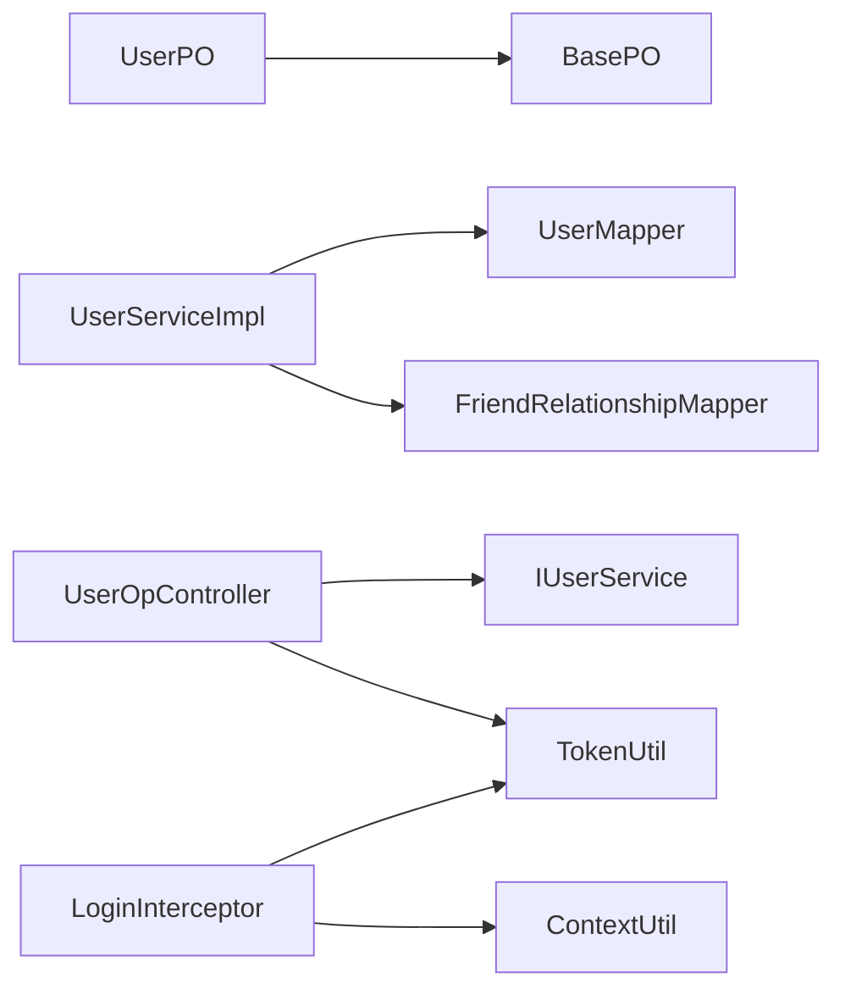

# User Data Model

<cite>
**Referenced Files in This Document**
- [UserPO.java](file://src/main/java/com/hch/chat_simple/pojo/po/UserPO.java)
- [BasePO.java](file://src/main/java/com/hch/chat_simple/pojo/po/BasePO.java)
- [UserMapper.java](file://src/main/java/com/hch/chat_simple/mapper/UserMapper.java)
- [UserMapper.xml](file://src/main/resources/mapper/UserMapper.xml)
- [UserQuery.java](file://src/main/java/com/hch/chat_simple/pojo/query/UserQuery.java)
- [AddUserForm.java](file://src/main/java/com/hch/chat_simple/pojo/dto/AddUserForm.java)
- [UserLoginDTO.java](file://src/main/java/com/hch/chat_simple/pojo/dto/UserLoginDTO.java)
- [UserVO.java](file://src/main/java/com/hch/chat_simple/pojo/vo/UserVO.java)
- [IUserService.java](file://src/main/java/com/hch/chat_simple/service/IUserService.java)
- [UserServiceImpl.java](file://src/main/java/com/hch/chat_simple/service/impl/UserServiceImpl.java)
- [UserOpController.java](file://src/main/java/com/hch/chat_simple/controller/UserOpController.java)
- [chat.sql](file://db/chat.sql)
- [TokenUtil.java](file://src/main/java/com/hch/chat_simple/util/TokenUtil.java)
- [LoginInterceptor.java](file://src/main/java/com/hch/chat_simple/config/LoginInterceptor.java)
- [ContextUtil.java](file://src/main/java/com/hch/chat_simple/util/ContextUtil.java)
</cite>

## Table of Contents
1. [Introduction](#introduction)
2. [Project Structure](#project-structure)
3. [Core Components](#core-components)
4. [Architecture Overview](#architecture-overview)
5. [Detailed Component Analysis](#detailed-component-analysis)
6. [Dependency Analysis](#dependency-analysis)
7. [Performance Considerations](#performance-considerations)
8. [Troubleshooting Guide](#troubleshooting-guide)
9. [Conclusion](#conclusion)

## Introduction
This document provides comprehensive documentation for the User data model and related database schema in the chat application. It covers the UserPO entity structure, field definitions, validation rules, authentication and password handling, profile management attributes, and the data access patterns used for user operations. It also documents the UserMapper interface, query criteria, and the workflows for user registration, login, and profile retrieval. Business rules, validation constraints, common query examples, and security/privacy considerations are included to ensure safe and reliable usage of user data.

## Project Structure
The user domain spans POJOs, MyBatis mapper interface and XML, service layer, controller, DTOs/VOs, and supporting utilities for tokenization and security.

**Diagram sources**
- [UserPO.java:26](file://src/main/java/com/hch/chat_simple/pojo/po/UserPO.java#L26)
- [BasePO.java:14](file://src/main/java/com/hch/chat_simple/pojo/po/BasePO.java#L14)
- [UserMapper.java:19](file://src/main/java/com/hch/chat_simple/mapper/UserMapper.java#L19)
- [UserMapper.xml:3](file://src/main/resources/mapper/UserMapper.xml#L3)
- [chat.sql:5-18](file://db/chat.sql#L5-L18)
- [IUserService.java:19](file://src/main/java/com/hch/chat_simple/service/IUserService.java#L19)
- [UserServiceImpl.java:38](file://src/main/java/com/hch/chat_simple/service/impl/UserServiceImpl.java#L38)
- [UserOpController.java:39](file://src/main/java/com/hch/chat_simple/controller/UserOpController.java#L39)
- [LoginInterceptor.java:28](file://src/main/java/com/hch/chat_simple/config/LoginInterceptor.java#L28)
- [TokenUtil.java:18](file://src/main/java/com/hch/chat_simple/util/TokenUtil.java#L18)
- [ContextUtil.java:5](file://src/main/java/com/hch/chat_simple/util/ContextUtil.java#L5)

**Section sources**
- [UserPO.java:14-47](file://src/main/java/com/hch/chat_simple/pojo/po/UserPO.java#L14-L47)
- [BasePO.java:12-44](file://src/main/java/com/hch/chat_simple/pojo/po/BasePO.java#L12-L44)
- [UserMapper.java:10-22](file://src/main/java/com/hch/chat_simple/mapper/UserMapper.java#L10-L22)
- [UserMapper.xml:1-6](file://src/main/resources/mapper/UserMapper.xml#L1-L6)
- [chat.sql:1-130](file://db/chat.sql#L1-L130)

## Core Components
- UserPO: The persistent entity representing a user record mapped to the user table. It extends BasePO to inherit audit fields and soft-deletion support.
- BasePO: Provides common audit fields (createdAt, creatorId, creatorBy, updatedAt, modifierId, modifierBy) and logical deletion marker (dr).
- UserMapper: MyBatis mapper interface extending BaseMapper for generic CRUD operations on UserPO.
- UserMapper.xml: Empty namespace; MyBatis relies on annotations and automatic SQL generation via MyBatis-Plus.
- UserQuery: Validation-enabled query criteria for user search by username.
- AddUserForm: Validation-enabled form for user registration with username, password, and name.
- UserLoginDTO: Validation-enabled DTO for login credentials.
- UserVO: View object returned to clients, including friend relationship flag.
- IUserService and UserServiceImpl: Service contract and implementation for user operations including retrieval, search, and registration.
- UserOpController: REST endpoints for login, user info retrieval, user search, and user registration.
- Security utilities: TokenUtil for JWT creation/verification and LoginInterceptor for token validation and context population.

**Section sources**
- [UserPO.java:22-47](file://src/main/java/com/hch/chat_simple/pojo/po/UserPO.java#L22-L47)
- [BasePO.java:12-44](file://src/main/java/com/hch/chat_simple/pojo/po/BasePO.java#L12-L44)
- [UserMapper.java:18-22](file://src/main/java/com/hch/chat_simple/mapper/UserMapper.java#L18-L22)
- [UserMapper.xml:3](file://src/main/resources/mapper/UserMapper.xml#L3)
- [UserQuery.java:9-15](file://src/main/java/com/hch/chat_simple/pojo/query/UserQuery.java#L9-L15)
- [AddUserForm.java:9-23](file://src/main/java/com/hch/chat_simple/pojo/dto/AddUserForm.java#L9-L23)
- [UserLoginDTO.java:9-22](file://src/main/java/com/hch/chat_simple/pojo/dto/UserLoginDTO.java#L9-L22)
- [UserVO.java:24-44](file://src/main/java/com/hch/chat_simple/pojo/vo/UserVO.java#L24-L44)
- [IUserService.java:19-28](file://src/main/java/com/hch/chat_simple/service/IUserService.java#L19-L28)
- [UserServiceImpl.java:38-100](file://src/main/java/com/hch/chat_simple/service/impl/UserServiceImpl.java#L38-L100)
- [UserOpController.java:39-114](file://src/main/java/com/hch/chat_simple/controller/UserOpController.java#L39-L114)

## Architecture Overview
The user domain follows a layered architecture:
- Presentation: UserOpController exposes endpoints for login, user info, search, and registration.
- Service: UserServiceImpl encapsulates business logic, including password hashing, duplicate checks, and friend relationship enrichment.
- Persistence: MyBatis-Plus handles SQL generation and mapping for UserPO.
- Security: LoginInterceptor validates tokens and populates ContextUtil; TokenUtil manages JWT lifecycle.

**Diagram sources**
- [UserOpController.java:47-66](file://src/main/java/com/hch/chat_simple/controller/UserOpController.java#L47-L66)
- [UserServiceImpl.java:43-48](file://src/main/java/com/hch/chat_simple/service/impl/UserServiceImpl.java#L43-L48)
- [UserMapper.java:19](file://src/main/java/com/hch/chat_simple/mapper/UserMapper.java#L19)
- [TokenUtil.java:23-30](file://src/main/java/com/hch/chat_simple/util/TokenUtil.java#L23-L30)

## Detailed Component Analysis

### UserPO Entity
- Purpose: Represents a persisted user with identity, credentials, and profile attributes.
- Fields:
  - id: Auto-incremented primary key.
  - username: Unique identifier for login.
  - password: Hashed credential stored after registration.
  - name: Real name of the user.
  - Extends BasePO for audit fields and logical delete.
- Mapping: Annotated with @TableName("user") and @TableId for MyBatis-Plus.

Validation and constraints:
- Username and password are validated at the DTO level during registration and login.
- Name is validated during registration.

**Diagram sources**
- [BasePO.java:14-44](file://src/main/java/com/hch/chat_simple/pojo/po/BasePO.java#L14-L44)
- [UserPO.java:26-47](file://src/main/java/com/hch/chat_simple/pojo/po/UserPO.java#L26-L47)

**Section sources**
- [UserPO.java:22-47](file://src/main/java/com/hch/chat_simple/pojo/po/UserPO.java#L22-L47)
- [BasePO.java:12-44](file://src/main/java/com/hch/chat_simple/pojo/po/BasePO.java#L12-L44)

### Database Schema (user table)
- Columns:
  - id (PK, auto-increment)
  - username, password, name
  - created_at, creator_id, creator_by
  - updated_at, modifier_id, modifier_by
  - dr (logical delete)
- Notes:
  - All audit fields are present to align with BasePO.
  - Logical deletion via dr supports soft-delete semantics.

**Section sources**
- [chat.sql:5-18](file://db/chat.sql#L5-L18)

### UserMapper and Query Patterns
- Interface: Extends BaseMapper<UserPO>, inheriting standard CRUD and query methods.
- XML: Namespace declared but empty; MyBatis-Plus generates SQL from annotations and lambda conditions.
- Typical queries:
  - Select by username: Used in login and duplicate check.
  - Select with LIKE on username and limit: Used for search suggestions.
  - Save: Used for registration after hashing.

**Diagram sources**
- [UserServiceImpl.java:51-80](file://src/main/java/com/hch/chat_simple/service/impl/UserServiceImpl.java#L51-L80)

**Section sources**
- [UserMapper.java:18-22](file://src/main/java/com/hch/chat_simple/mapper/UserMapper.java#L18-L22)
- [UserMapper.xml:3](file://src/main/resources/mapper/UserMapper.xml#L3)
- [UserServiceImpl.java:51-80](file://src/main/java/com/hch/chat_simple/service/impl/UserServiceImpl.java#L51-L80)

### UserQuery Criteria
- Purpose: Encapsulates search criteria for user lookup.
- Field: username with NotBlank validation.
- Usage: Passed to searchUserByName to filter by partial username match.

**Section sources**
- [UserQuery.java:9-15](file://src/main/java/com/hch/chat_simple/pojo/query/UserQuery.java#L9-L15)

### DTOs and Validation
- AddUserForm:
  - username: NotBlank
  - password: NotBlank
  - name: NotBlank
- UserLoginDTO:
  - username: NotBlank
  - password: NotBlank
- Validation ensures non-empty credentials before persistence or authentication.

**Section sources**
- [AddUserForm.java:9-23](file://src/main/java/com/hch/chat_simple/pojo/dto/AddUserForm.java#L9-L23)
- [UserLoginDTO.java:9-22](file://src/main/java/com/hch/chat_simple/pojo/dto/UserLoginDTO.java#L9-L22)

### UserVO Profile Management
- Fields:
  - id, username, name, friendRelation
- Used for returning user information to clients and enriching with friend relationship status.

**Section sources**
- [UserVO.java:24-44](file://src/main/java/com/hch/chat_simple/pojo/vo/UserVO.java#L24-L44)

### Service Layer: User Operations
- getUserByName: Retrieves a user by username for login verification.
- searchUserByName: Performs a LIKE search on username with a limit and enriches with friend relationship status.
- insertUser: Validates uniqueness, hashes password, and persists the user.

**Diagram sources**
- [UserOpController.java:109-111](file://src/main/java/com/hch/chat_simple/controller/UserOpController.java#L109-L111)
- [UserServiceImpl.java:82-97](file://src/main/java/com/hch/chat_simple/service/impl/UserServiceImpl.java#L82-L97)

**Section sources**
- [IUserService.java:19-28](file://src/main/java/com/hch/chat_simple/service/IUserService.java#L19-L28)
- [UserServiceImpl.java:42-97](file://src/main/java/com/hch/chat_simple/service/impl/UserServiceImpl.java#L42-L97)

### Controller Workflows
- Login:
  - Validates credentials via UserLoginDTO.
  - Retrieves user by username and verifies password hash.
  - Issues JWT token via TokenUtil.
- User Info Retrieval:
  - Uses ContextUtil.getUserId() populated by LoginInterceptor.
- Search:
  - Calls service to search users by username pattern.
- Registration:
  - Calls service to register a new user after DTO validation.

**Section sources**
- [UserOpController.java:47-66](file://src/main/java/com/hch/chat_simple/controller/UserOpController.java#L47-L66)
- [UserOpController.java:76-80](file://src/main/java/com/hch/chat_simple/controller/UserOpController.java#L76-L80)
- [UserOpController.java:100-104](file://src/main/java/com/hch/chat_simple/controller/UserOpController.java#L100-L104)
- [UserOpController.java:109-111](file://src/main/java/com/hch/chat_simple/controller/UserOpController.java#L109-L111)

### Authentication and Security
- Password Handling:
  - Registration: Password hashed using BCrypt before storage.
  - Login: Plain-text password compared against stored hash using BCrypt matches.
- Token Management:
  - TokenUtil creates and verifies JWT with issuer and expiration.
  - LoginInterceptor validates token, populates ContextUtil, and refreshes token on expiration.
- Context Util:
  - ThreadLocal-based holder for userId, username, realName, and newToken.

**Diagram sources**
- [LoginInterceptor.java:44-72](file://src/main/java/com/hch/chat_simple/config/LoginInterceptor.java#L44-L72)
- [TokenUtil.java:48-69](file://src/main/java/com/hch/chat_simple/util/TokenUtil.java#L48-L69)
- [ContextUtil.java:12-49](file://src/main/java/com/hch/chat_simple/util/ContextUtil.java#L12-L49)

**Section sources**
- [UserServiceImpl.java:92-94](file://src/main/java/com/hch/chat_simple/service/impl/UserServiceImpl.java#L92-L94)
- [UserOpController.java:50-55](file://src/main/java/com/hch/chat_simple/controller/UserOpController.java#L50-L55)
- [TokenUtil.java:18-71](file://src/main/java/com/hch/chat_simple/util/TokenUtil.java#L18-L71)
- [LoginInterceptor.java:28-109](file://src/main/java/com/hch/chat_simple/config/LoginInterceptor.java#L28-L109)
- [ContextUtil.java:5-52](file://src/main/java/com/hch/chat_simple/util/ContextUtil.java#L5-L52)

## Dependency Analysis
- UserPO depends on BasePO for audit and soft-delete fields.
- UserServiceImpl depends on UserMapper for persistence and FriendRelationshipMapper for friend enrichment.
- UserOpController depends on IUserService and security utilities for endpoint handling.
- MyBatis-Plus maps UserMapper to the user table via annotations and XML namespace.

**Diagram sources**
- [UserPO.java:26](file://src/main/java/com/hch/chat_simple/pojo/po/UserPO.java#L26)
- [BasePO.java:14](file://src/main/java/com/hch/chat_simple/pojo/po/BasePO.java#L14)
- [UserServiceImpl.java:4-16](file://src/main/java/com/hch/chat_simple/service/impl/UserServiceImpl.java#L4-L16)
- [UserOpController.java:41](file://src/main/java/com/hch/chat_simple/controller/UserOpController.java#L41)
- [LoginInterceptor.java:28](file://src/main/java/com/hch/chat_simple/config/LoginInterceptor.java#L28)

**Section sources**
- [UserServiceImpl.java:4-27](file://src/main/java/com/hch/chat_simple/service/impl/UserServiceImpl.java#L4-L27)
- [UserOpController.java:41](file://src/main/java/com/hch/chat_simple/controller/UserOpController.java#L41)
- [LoginInterceptor.java:28-109](file://src/main/java/com/hch/chat_simple/config/LoginInterceptor.java#L28-L109)

## Performance Considerations
- Indexing: Consider adding an index on username for efficient login and duplicate checks.
- Pagination: The search operation limits results to 20; ensure this cap remains appropriate for UX and performance.
- Password hashing cost: BCrypt defaults are suitable; avoid lowering work factor for security.
- Token TTL: Short-lived tokens reduce risk; refresh mechanism is handled by the interceptor.

## Troubleshooting Guide
- Duplicate username on registration:
  - Symptom: Exception indicating login name already exists.
  - Cause: Duplicate check prior to save.
  - Resolution: Use a different username.
- Invalid or expired token:
  - Symptom: Token verification failure or expiration leading to new token issuance.
  - Cause: TokenUtil verification or expiration logic.
  - Resolution: Re-authenticate or accept new token from interceptor.
- User not found during login:
  - Symptom: Error payload indicating user not found.
  - Cause: Username does not exist.
  - Resolution: Verify username or register a new account.
- Password mismatch:
  - Symptom: Error payload indicating password error.
  - Cause: Plain-text password does not match stored hash.
  - Resolution: Re-enter correct password.

**Section sources**
- [UserServiceImpl.java:84-90](file://src/main/java/com/hch/chat_simple/service/impl/UserServiceImpl.java#L84-L90)
- [UserOpController.java:51-55](file://src/main/java/com/hch/chat_simple/controller/UserOpController.java#L51-L55)
- [LoginInterceptor.java:48-72](file://src/main/java/com/hch/chat_simple/config/LoginInterceptor.java#L48-L72)

## Conclusion
The User domain is designed with clear separation of concerns, robust validation, secure password handling via BCrypt, and JWT-based authentication with token refresh. The MyBatis-Plus framework simplifies persistence while the service layer enforces business rules such as duplicate prevention and friend relationship enrichment. The schema supports audit fields and logical deletion, enabling traceability and safe data lifecycle management. Adhering to the documented workflows and validation rules ensures secure and reliable user operations.