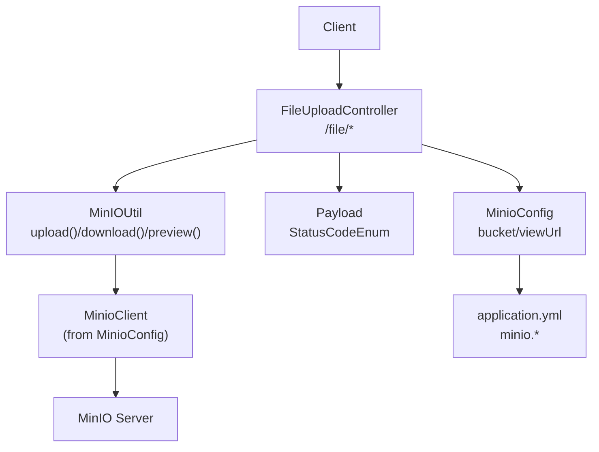
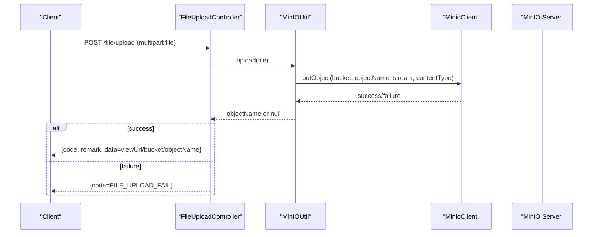
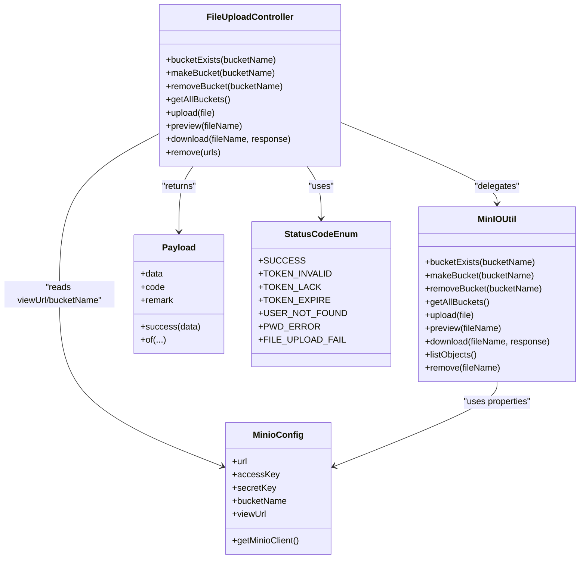

# File Upload and Cloud Storage

<cite>
**Referenced Files in This Document**
- [FileUploadController.java](file://src/main/java/com/hch/chat_simple/controller/FileUploadController.java)
- [MinioConfig.java](file://src/main/java/com/hch/chat_simple/config/MinioConfig.java)
- [MinIOUtil.java](file://src/main/java/com/hch/chat_simple/util/MinIOUtil.java)
- [application.yml](file://src/main/resources/application.yml)
- [Payload.java](file://src/main/java/com/hch/chat_simple/util/Payload.java)
- [StatusCodeEnum.java](file://src/main/java/com/hch/chat_simple/util/StatusCodeEnum.java)
- [WebMvcConfig.java](file://src/main/java/com/hch/chat_simple/config/WebMvcConfig.java)
- [LoginInterceptor.java](file://src/main/java/com/hch/chat_simple/config/LoginInterceptor.java)
- [CrossInterceptorHandler.java](file://src/main/java/com/hch/chat_simple/config/CrossInterceptorHandler.java)
</cite>

## Table of Contents
1. [Introduction](#introduction)
2. [Project Structure](#project-structure)
3. [Core Components](#core-components)
4. [Architecture Overview](#architecture-overview)
5. [Detailed Component Analysis](#detailed-component-analysis)
6. [Dependency Analysis](#dependency-analysis)
7. [Performance Considerations](#performance-considerations)
8. [Troubleshooting Guide](#troubleshooting-guide)
9. [Conclusion](#conclusion)
10. [Appendices](#appendices)

## Introduction
This document explains the file upload and cloud storage integration using MinIO within the application. It covers the controller implementation for multipart file uploads, MinIO configuration, helper utilities for file operations, and the end-to-end upload workflow. It also documents download mechanisms, access control, URL generation, and practical guidance for validation, security, and performance.

## Project Structure
The file upload feature spans a small set of focused components:
- Controller: exposes endpoints for upload, preview, download, and bucket management
- Configuration: MinIO client and bucket settings
- Utilities: MinIO helper functions for upload, download, presigned URLs, and object listing/removal
- Application configuration: MinIO connection properties
- Interceptors: cross-origin and authentication controls

**Diagram sources**
- [FileUploadController.java:22-81](file://src/main/java/com/hch/chat_simple/controller/FileUploadController.java#L22-L81)
- [MinIOUtil.java:46-197](file://src/main/java/com/hch/chat_simple/util/MinIOUtil.java#L46-L197)
- [MinioConfig.java:10-32](file://src/main/java/com/hch/chat_simple/config/MinioConfig.java#L10-L32)
- [application.yml:84-89](file://src/main/resources/application.yml#L84-L89)
- [Payload.java:5-30](file://src/main/java/com/hch/chat_simple/util/Payload.java#L5-L30)
- [StatusCodeEnum.java:5-22](file://src/main/java/com/hch/chat_simple/util/StatusCodeEnum.java#L5-L22)

**Section sources**
- [FileUploadController.java:22-81](file://src/main/java/com/hch/chat_simple/controller/FileUploadController.java#L22-L81)
- [MinioConfig.java:10-32](file://src/main/java/com/hch/chat_simple/config/MinioConfig.java#L10-L32)
- [MinIOUtil.java:46-197](file://src/main/java/com/hch/chat_simple/util/MinIOUtil.java#L46-L197)
- [application.yml:84-89](file://src/main/resources/application.yml#L84-L89)

## Core Components
- FileUploadController: Exposes endpoints for upload, preview, download, and bucket management. It delegates actual MinIO operations to MinIOUtil and uses MinioConfig for view URL and bucket name.
- MinIOUtil: Encapsulates MinIO operations including upload, download, presigned URL generation, bucket existence checks, and object listing/removal.
- MinioConfig: Provides MinIO client bean and configuration properties (URL, credentials, bucket name, external view URL).
- Payload and StatusCodeEnum: Standardized response envelope and error codes used across the app.

**Section sources**
- [FileUploadController.java:22-81](file://src/main/java/com/hch/chat_simple/controller/FileUploadController.java#L22-L81)
- [MinIOUtil.java:46-197](file://src/main/java/com/hch/chat_simple/util/MinIOUtil.java#L46-L197)
- [MinioConfig.java:10-32](file://src/main/java/com/hch/chat_simple/config/MinioConfig.java#L10-L32)
- [Payload.java:5-30](file://src/main/java/com/hch/chat_simple/util/Payload.java#L5-L30)
- [StatusCodeEnum.java:5-22](file://src/main/java/com/hch/chat_simple/util/StatusCodeEnum.java#L5-L22)

## Architecture Overview
The upload pipeline integrates Spring MVC with MinIO via a dedicated utility class. The controller validates inputs and orchestrates operations, while MinIOUtil handles streaming uploads and downloads, and generates presigned URLs for temporary access.

**Diagram sources**
- [FileUploadController.java:50-57](file://src/main/java/com/hch/chat_simple/controller/FileUploadController.java#L50-L57)
- [MinIOUtil.java:98-122](file://src/main/java/com/hch/chat_simple/util/MinIOUtil.java#L98-L122)
- [MinioConfig.java:28-31](file://src/main/java/com/hch/chat_simple/config/MinioConfig.java#L28-L31)
- [Payload.java:18-28](file://src/main/java/com/hch/chat_simple/util/Payload.java#L18-L28)
- [StatusCodeEnum.java](file://src/main/java/com/hch/chat_simple/util/StatusCodeEnum.java#L13)

## Detailed Component Analysis

### FileUploadController
Responsibilities:
- Bucket management: exists, create, delete, list buckets
- File operations: upload, preview (presigned URL), download, remove
- Delegates MinIO operations to MinIOUtil
- Uses MinioConfig for view URL and bucket name
- Returns standardized responses via Payload

Endpoints:
- GET /file/bucketExists?bucketName
- GET /file/makeBucket?bucketName
- GET /file/removeBucket?bucketName
- GET /file/getAllBuckets
- POST /file/upload (multipart file)
- GET /file/preview?fileName
- GET /file/download?fileName
- GET /file/remove (body: array of URLs)

Notes:
- Upload endpoint returns a view URL constructed from configured viewUrl, bucketName, and returned objectName.
- Remove endpoint expects URLs containing the bucket name and extracts objectName accordingly.

**Section sources**
- [FileUploadController.java:30-77](file://src/main/java/com/hch/chat_simple/controller/FileUploadController.java#L30-L77)

### MinioConfig
Responsibilities:
- Binds application.yml minio.* properties
- Creates a MinioClient bean using endpoint, accessKey, and secretKey
- Exposes bucketName and viewUrl for downstream components

Configuration keys:
- url, accessKey, secretKey, bucketName, viewUrl

**Section sources**
- [MinioConfig.java:10-32](file://src/main/java/com/hch/chat_simple/config/MinioConfig.java#L10-L32)
- [application.yml:84-89](file://src/main/resources/application.yml#L84-L89)

### MinIOUtil
Responsibilities:
- Bucket operations: exists, create, delete, list
- Upload: streams file to MinIO with generated objectName under date-based path
- Download: streams object content to HTTP response
- Preview: generates presigned URL for temporary access
- Listing and removal of objects

Upload flow highlights:
- Validates original filename presence
- Generates UUID-based filename preserving extension
- Builds date-based objectName (yyyy/MM/dd/)
- Streams file content with detected content type

Download flow highlights:
- Retrieves object stream and writes to HTTP response
- Sets UTF-8 encoding and Content-Disposition header

Preview flow highlights:
- Generates a presigned GET URL for the object

Removal flow highlights:
- Removes object by objectName

**Section sources**
- [MinIOUtil.java:56-194](file://src/main/java/com/hch/chat_simple/util/MinIOUtil.java#L56-L194)

### Access Control and CORS
- Cross-origin handling: CrossInterceptorHandler sets CORS headers for allowed origins, methods, headers, and credentials.
- Authentication: LoginInterceptor enforces token verification for protected endpoints and injects user context; unauthenticated requests receive standardized error payloads.

These interceptors ensure that file endpoints are properly secured and accessible from allowed clients.

**Section sources**
- [CrossInterceptorHandler.java:8-28](file://src/main/java/com/hch/chat_simple/config/CrossInterceptorHandler.java#L8-L28)
- [LoginInterceptor.java:28-109](file://src/main/java/com/hch/chat_simple/config/LoginInterceptor.java#L28-L109)
- [WebMvcConfig.java:9-27](file://src/main/java/com/hch/chat_simple/config/WebMvcConfig.java#L9-L27)

## Dependency Analysis
High-level dependencies:
- FileUploadController depends on MinIOUtil and MinioConfig
- MinIOUtil depends on MinioClient (created by MinioConfig) and configuration properties
- Payload and StatusCodeEnum provide response semantics
- Interceptors depend on WebMvcConfig

**Diagram sources**
- [FileUploadController.java:22-81](file://src/main/java/com/hch/chat_simple/controller/FileUploadController.java#L22-L81)
- [MinIOUtil.java:46-197](file://src/main/java/com/hch/chat_simple/util/MinIOUtil.java#L46-L197)
- [MinioConfig.java:10-32](file://src/main/java/com/hch/chat_simple/config/MinioConfig.java#L10-L32)
- [Payload.java:5-30](file://src/main/java/com/hch/chat_simple/util/Payload.java#L5-L30)
- [StatusCodeEnum.java:5-22](file://src/main/java/com/hch/chat_simple/util/StatusCodeEnum.java#L5-L22)

## Performance Considerations
- Streaming uploads: MinIOUtil streams file content directly to MinIO, avoiding unnecessary in-memory copies beyond the minimal buffering used during transfer.
- Presigned URLs: Use preview to offload downloads to MinIO, reducing server bandwidth and latency.
- Object naming: Date-based prefixes improve listing performance and enable lifecycle management.
- Batch operations: The remove endpoint accepts multiple URLs; consider batching removals to reduce round-trips.
- Interceptors: Keep CORS and authentication interceptors efficient; avoid heavy computation in preHandle.

[No sources needed since this section provides general guidance]

## Troubleshooting Guide
Common issues and resolutions:
- Upload failures:
  - Verify bucket exists and is writable; use bucketExists and makeBucket endpoints.
  - Confirm MinioConfig credentials and endpoint are correct in application.yml.
  - Check logs for upload exceptions; ensure file is present and not empty.
- Download errors:
  - Ensure objectName is correct and file exists in the configured bucket.
  - Confirm response headers are set; review download method behavior.
- Presigned URL failures:
  - Validate viewUrl configuration and that the object exists.
  - Check MinIO server availability and network connectivity.
- CORS or authentication errors:
  - Ensure allowed origin matches the frontend domain.
  - Verify token presence and validity; inspect LoginInterceptor behavior.

**Section sources**
- [MinIOUtil.java:98-122](file://src/main/java/com/hch/chat_simple/util/MinIOUtil.java#L98-L122)
- [MinIOUtil.java:141-163](file://src/main/java/com/hch/chat_simple/util/MinIOUtil.java#L141-L163)
- [MinIOUtil.java:124-139](file://src/main/java/com/hch/chat_simple/util/MinIOUtil.java#L124-L139)
- [CrossInterceptorHandler.java:8-28](file://src/main/java/com/hch/chat_simple/config/CrossInterceptorHandler.java#L8-L28)
- [LoginInterceptor.java:28-109](file://src/main/java/com/hch/chat_simple/config/LoginInterceptor.java#L28-L109)

## Conclusion
The application provides a concise and effective MinIO integration for file uploads and downloads. The controller delegates operations to a focused utility class, which streams data to MinIO and supports presigned URLs for secure, time-limited access. Configuration is centralized in MinioConfig and application.yml. Security is enforced via interceptors, and responses are standardized through Payload and StatusCodeEnum.

[No sources needed since this section summarizes without analyzing specific files]

## Appendices

### API Reference

- POST /file/upload
  - Request: multipart/form-data with field file
  - Response: Payload with success code and data as a view URL string
  - Failure code: FILE_UPLOAD_FAIL

- GET /file/preview?fileName={objectName}
  - Response: Payload with presigned URL string

- GET /file/download?fileName={objectName}
  - Response: Direct file download via HTTP response

- GET /file/bucketExists?bucketName={name}
- GET /file/makeBucket?bucketName={name}
- GET /file/removeBucket?bucketName={name}
- GET /file/getAllBuckets
  - Response: Payload with boolean or list depending on endpoint

- GET /file/remove
  - Request body: array of URLs
  - Response: Payload with success message

Security headers and tokens:
- Access-Control-Allow-* headers are set by CrossInterceptorHandler
- Authentication enforced by LoginInterceptor; unauthorized responses use standardized Payload format

**Section sources**
- [FileUploadController.java:30-77](file://src/main/java/com/hch/chat_simple/controller/FileUploadController.java#L30-L77)
- [Payload.java:18-28](file://src/main/java/com/hch/chat_simple/util/Payload.java#L18-L28)
- [StatusCodeEnum.java](file://src/main/java/com/hch/chat_simple/util/StatusCodeEnum.java#L13)
- [CrossInterceptorHandler.java:8-28](file://src/main/java/com/hch/chat_simple/config/CrossInterceptorHandler.java#L8-L28)
- [LoginInterceptor.java:28-109](file://src/main/java/com/hch/chat_simple/config/LoginInterceptor.java#L28-L109)

### Validation and Security Notes
- Filename validation: The upload method checks for a non-blank original filename and generates a UUID-based object name with preserved extension.
- Content type: The uploaded file’s content type is passed to MinIO.
- Size limits: There is no explicit size limit enforcement in the provided code; consider adding size checks at the controller level if needed.
- Security scanning: No virus scanning integration is implemented in the provided code; integrate an external scanner if required.
- URL expiration: Presigned URLs are generated without an explicit expiration; configure MinIO server-side policies or adjust client-side URL generation to enforce time limits.

**Section sources**
- [MinIOUtil.java:98-122](file://src/main/java/com/hch/chat_simple/util/MinIOUtil.java#L98-L122)
- [MinIOUtil.java:124-139](file://src/main/java/com/hch/chat_simple/util/MinIOUtil.java#L124-L139)

### Storage Optimization Tips
- Use date-based prefixes for objects to simplify lifecycle policies and listing.
- Enable server-side compression or tiered storage on MinIO for cost reduction.
- Implement retention and lifecycle policies to automatically archive or delete old objects.
- Prefer presigned URLs for downloads to reduce server bandwidth.

[No sources needed since this section provides general guidance]