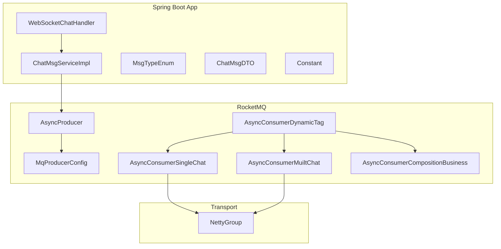
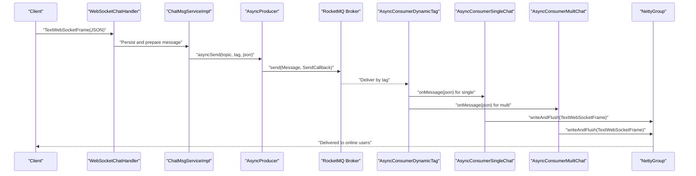
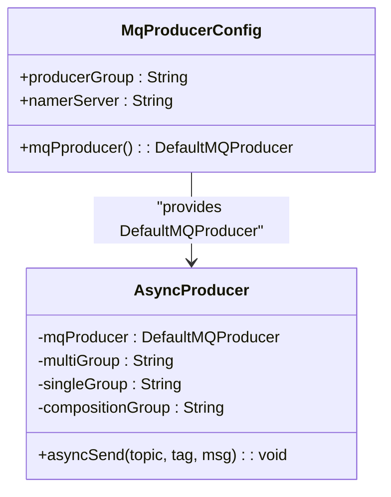
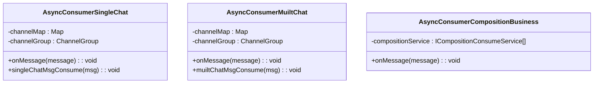
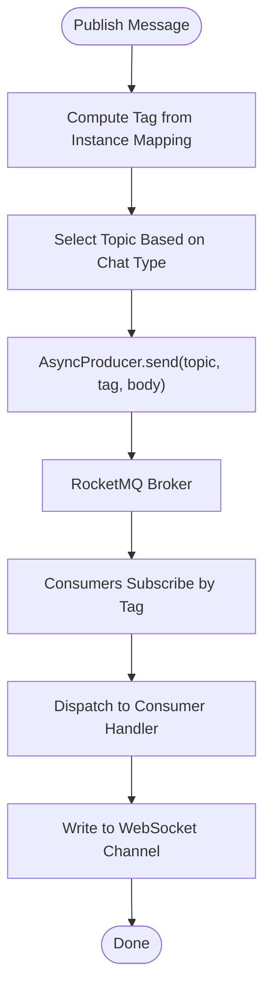
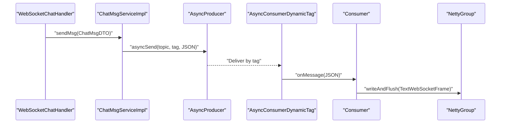
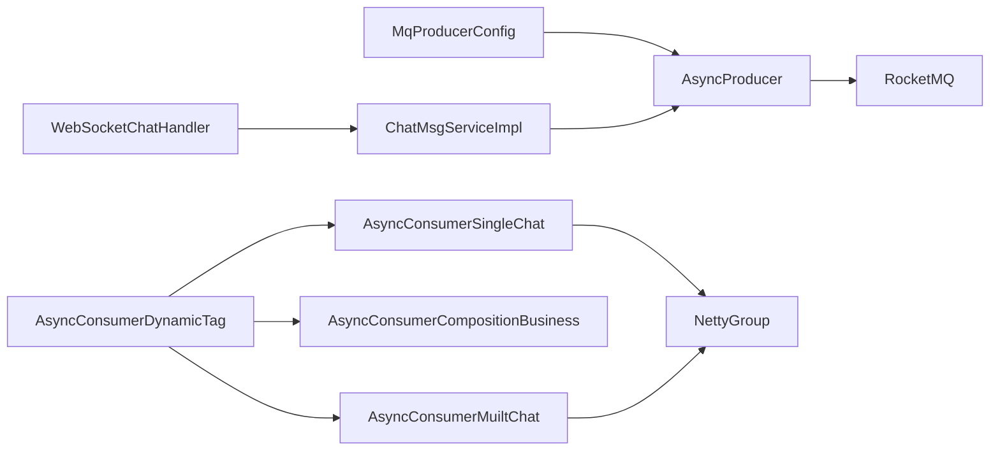

# Message Queue System (RocketMQ)

<cite>
**Referenced Files in This Document**
- [AsyncProducer.java](file://src/main/java/com/hch/chat_simple/mq/AsyncProducer.java)
- [MqProducerConfig.java](file://src/main/java/com/hch/chat_simple/mq/MqProducerConfig.java)
- [AsyncConsumerMuiltChat.java](file://src/main/java/com/hch/chat_simple/mq/AsyncConsumerMuiltChat.java)
- [AsyncConsumerSingleChat.java](file://src/main/java/com/hch/chat_simple/mq/AsyncConsumerSingleChat.java)
- [AsyncConsumerCompositionBusiness.java](file://src/main/java/com/hch/chat_simple/mq/AsyncConsumerCompositionBusiness.java)
- [AsyncConsumerDynamicTag.java](file://src/main/java/com/hch/chat_simple/mq/AsyncConsumerDynamicTag.java)
- [application.yml](file://src/main/resources/application.yml)
- [WebSocketChatHandler.java](file://src/main/java/com/hch/chat_simple/handler/WebSocketChatHandler.java)
- [ChatMsgServiceImpl.java](file://src/main/java/com/hch/chat_simple/service/impl/ChatMsgServiceImpl.java)
- [IChatMsgService.java](file://src/main/java/com/hch/chat_simple/service/IChatMsgService.java)
- [MsgTypeEnum.java](file://src/main/java/com/hch/chat_simple/enums/MsgTypeEnum.java)
- [Constant.java](file://src/main/java/com/hch/chat_simple/util/Constant.java)
- [ChatMsgDTO.java](file://src/main/java/com/hch/chat_simple/pojo/dto/ChatMsgDTO.java)
- [NettyGroup.java](file://src/main/java/com/hch/chat_simple/config/NettyGroup.java)
</cite>

## Table of Contents
1. [Introduction](#introduction)
2. [Project Structure](#project-structure)
3. [Core Components](#core-components)
4. [Architecture Overview](#architecture-overview)
5. [Detailed Component Analysis](#detailed-component-analysis)
6. [Dependency Analysis](#dependency-analysis)
7. [Performance Considerations](#performance-considerations)
8. [Troubleshooting Guide](#troubleshooting-guide)
9. [Conclusion](#conclusion)
10. [Appendices](#appendices)

## Introduction
This document describes the RocketMQ-based asynchronous messaging system integrated into the chat application. It covers the producer-consumer architecture, message serialization, topic routing, delivery guarantees, and consumer configurations for different message types. It also documents message tagging via dynamic tag routing, message flow from the service layer through the queue to WebSocket handlers, and provides examples of publishing/consuming patterns and error handling strategies. Finally, it outlines performance tuning, ordering considerations, and reliability practices for production deployments.

## Project Structure
The messaging subsystem resides under the mq package and integrates with Spring Boot autoconfiguration and RocketMQ Spring Boot Starter. Key elements:
- Producer configuration and producer bean
- Consumers for single chat, multi chat, and composite business scenarios
- Dynamic tag routing for horizontal scaling
- Application configuration for RocketMQ and topics
- Service layer orchestration and DTOs
- WebSocket handler and Netty channel management

**Diagram sources**
- [WebSocketChatHandler.java:50-110](file://src/main/java/com/hch/chat_simple/handler/WebSocketChatHandler.java#L50-L110)
- [ChatMsgServiceImpl.java:55-144](file://src/main/java/com/hch/chat_simple/service/impl/ChatMsgServiceImpl.java#L55-L144)
- [MqProducerConfig.java:13-28](file://src/main/java/com/hch/chat_simple/mq/MqProducerConfig.java#L13-L28)
- [AsyncProducer.java:17-59](file://src/main/java/com/hch/chat_simple/mq/AsyncProducer.java#L17-L59)
- [AsyncConsumerDynamicTag.java:33-199](file://src/main/java/com/hch/chat_simple/mq/AsyncConsumerDynamicTag.java#L33-L199)
- [AsyncConsumerSingleChat.java:36-83](file://src/main/java/com/hch/chat_simple/mq/AsyncConsumerSingleChat.java#L36-L83)
- [AsyncConsumerMuiltChat.java:38-91](file://src/main/java/com/hch/chat_simple/mq/AsyncConsumerMuiltChat.java#L38-L91)
- [AsyncConsumerCompositionBusiness.java:20-51](file://src/main/java/com/hch/chat_simple/mq/AsyncConsumerCompositionBusiness.java#L20-L51)
- [NettyGroup.java:11-26](file://src/main/java/com/hch/chat_simple/config/NettyGroup.java#L11-L26)

**Section sources**
- [application.yml:39-83](file://src/main/resources/application.yml#L39-L83)
- [WebSocketChatHandler.java:50-110](file://src/main/java/com/hch/chat_simple/handler/WebSocketChatHandler.java#L50-L110)
- [ChatMsgServiceImpl.java:55-144](file://src/main/java/com/hch/chat_simple/service/impl/ChatMsgServiceImpl.java#L55-L144)

## Core Components
- Producer configuration: Creates a DefaultMQProducer with name server and producer group from application.yml.
- AsyncProducer: Sends messages asynchronously with callbacks and logs outcomes.
- Consumers:
  - AsyncConsumerSingleChat: Handles direct (single) chat messages and updates sent status upon successful delivery.
  - AsyncConsumerMuiltChat: Handles broadcast-style multi-chat messages and routes per recipient.
  - AsyncConsumerCompositionBusiness: Parses composite messages and dispatches to registered business handlers by message type.
- Dynamic Tag Routing: Subscribes consumers to topics with tags derived from instance mapping to achieve horizontal scaling and partitioned consumption.
- Application configuration: Defines RocketMQ name server, producer group, consumer groups, and topic names.
- Service orchestration: ChatMsgServiceImpl persists messages, computes routing tags, and publishes to appropriate topics.
- WebSocket integration: WebSocketChatHandler manages sessions and delegates message sending to services.

**Section sources**
- [MqProducerConfig.java:13-28](file://src/main/java/com/hch/chat_simple/mq/MqProducerConfig.java#L13-L28)
- [AsyncProducer.java:17-59](file://src/main/java/com/hch/chat_simple/mq/AsyncProducer.java#L17-L59)
- [AsyncConsumerSingleChat.java:36-83](file://src/main/java/com/hch/chat_simple/mq/AsyncConsumerSingleChat.java#L36-L83)
- [AsyncConsumerMuiltChat.java:38-91](file://src/main/java/com/hch/chat_simple/mq/AsyncConsumerMuiltChat.java#L38-L91)
- [AsyncConsumerCompositionBusiness.java:20-51](file://src/main/java/com/hch/chat_simple/mq/AsyncConsumerCompositionBusiness.java#L20-L51)
- [AsyncConsumerDynamicTag.java:33-199](file://src/main/java/com/hch/chat_simple/mq/AsyncConsumerDynamicTag.java#L33-L199)
- [application.yml:39-83](file://src/main/resources/application.yml#L39-L83)
- [ChatMsgServiceImpl.java:55-144](file://src/main/java/com/hch/chat_simple/service/impl/ChatMsgServiceImpl.java#L55-L144)
- [WebSocketChatHandler.java:50-110](file://src/main/java/com/hch/chat_simple/handler/WebSocketChatHandler.java#L50-L110)

## Architecture Overview
The system uses RocketMQ for asynchronous messaging between the service layer and WebSocket handlers. Messages are serialized to JSON and published to topics with tags for routing. Consumers subscribe to topics with tags and deliver messages to online users via Netty channels.

**Diagram sources**
- [WebSocketChatHandler.java:73-109](file://src/main/java/com/hch/chat_simple/handler/WebSocketChatHandler.java#L73-L109)
- [ChatMsgServiceImpl.java:98-144](file://src/main/java/com/hch/chat_simple/service/impl/ChatMsgServiceImpl.java#L98-L144)
- [AsyncProducer.java:40-59](file://src/main/java/com/hch/chat_simple/mq/AsyncProducer.java#L40-L59)
- [AsyncConsumerDynamicTag.java:82-199](file://src/main/java/com/hch/chat_simple/mq/AsyncConsumerDynamicTag.java#L82-L199)
- [AsyncConsumerSingleChat.java:47-73](file://src/main/java/com/hch/chat_simple/mq/AsyncConsumerSingleChat.java#L47-L73)
- [AsyncConsumerMuiltChat.java:57-83](file://src/main/java/com/hch/chat_simple/mq/AsyncConsumerMuiltChat.java#L57-L83)
- [NettyGroup.java:11-26](file://src/main/java/com/hch/chat_simple/config/NettyGroup.java#L11-L26)

## Detailed Component Analysis

### Producer Configuration and Delivery Guarantees
- Producer bean is configured with name server and producer group from application.yml.
- AsyncProducer sends messages asynchronously with SendCallback for success/error logging.
- Delivery guarantees:
  - At-least-once delivery due to asynchronous send and manual status updates.
  - Idempotency can be achieved by checking message ID or deduplication keys in consumers.

**Diagram sources**
- [MqProducerConfig.java:13-28](file://src/main/java/com/hch/chat_simple/mq/MqProducerConfig.java#L13-L28)
- [AsyncProducer.java:17-59](file://src/main/java/com/hch/chat_simple/mq/AsyncProducer.java#L17-L59)

**Section sources**
- [MqProducerConfig.java:13-28](file://src/main/java/com/hch/chat_simple/mq/MqProducerConfig.java#L13-L28)
- [AsyncProducer.java:17-59](file://src/main/java/com/hch/chat_simple/mq/AsyncProducer.java#L17-L59)
- [application.yml:39-46](file://src/main/resources/application.yml#L39-L46)

### Consumer Configurations and Message Types
- Single Chat Consumer:
  - Parses JSON payload, identifies target user, resolves channel, writes WebSocket frame, and updates message status upon success.
- Multi Chat Consumer:
  - Parses JSON payload, filters recipients excluding sender, resolves channels, and writes frames.
- Composition Business Consumer:
  - Parses composite message format, extracts message type and channel key, and dispatches to registered business handlers.

**Diagram sources**
- [AsyncConsumerSingleChat.java:36-83](file://src/main/java/com/hch/chat_simple/mq/AsyncConsumerSingleChat.java#L36-L83)
- [AsyncConsumerMuiltChat.java:38-91](file://src/main/java/com/hch/chat_simple/mq/AsyncConsumerMuiltChat.java#L38-L91)
- [AsyncConsumerCompositionBusiness.java:20-51](file://src/main/java/com/hch/chat_simple/mq/AsyncConsumerCompositionBusiness.java#L20-L51)

**Section sources**
- [AsyncConsumerSingleChat.java:36-83](file://src/main/java/com/hch/chat_simple/mq/AsyncConsumerSingleChat.java#L36-L83)
- [AsyncConsumerMuiltChat.java:38-91](file://src/main/java/com/hch/chat_simple/mq/AsyncConsumerMuiltChat.java#L38-L91)
- [AsyncConsumerCompositionBusiness.java:20-51](file://src/main/java/com/hch/chat_simple/mq/AsyncConsumerCompositionBusiness.java#L20-L51)

### Message Tagging and Topic Management
- Topics are defined in application.yml for multi-chat, single-chat, and composition.
- Dynamic tag routing:
  - Consumers subscribe to topics with tags computed from instance mapping.
  - Tag list and current tag are configured; tag index determines subscription tag.
  - Message model is set to CLUSTERING to ensure balanced consumption.

**Diagram sources**
- [application.yml:47-83](file://src/main/resources/application.yml#L47-L83)
- [AsyncConsumerDynamicTag.java:82-199](file://src/main/java/com/hch/chat_simple/mq/AsyncConsumerDynamicTag.java#L82-L199)
- [AsyncProducer.java:40-59](file://src/main/java/com/hch/chat_simple/mq/AsyncProducer.java#L40-L59)

**Section sources**
- [application.yml:47-83](file://src/main/resources/application.yml#L47-L83)
- [AsyncConsumerDynamicTag.java:33-199](file://src/main/java/com/hch/chat_simple/mq/AsyncConsumerDynamicTag.java#L33-L199)

### Message Flow: Service Layer Through Queue to WebSocket Handlers
- WebSocketChatHandler receives messages, authenticates users, persists messages, and prepares DTOs.
- ChatMsgServiceImpl saves messages, computes tags, and publishes to topics.
- AsyncConsumerDynamicTag subscribes consumers by tag; consumers resolve channels and write frames.

**Diagram sources**
- [WebSocketChatHandler.java:73-109](file://src/main/java/com/hch/chat_simple/handler/WebSocketChatHandler.java#L73-L109)
- [ChatMsgServiceImpl.java:98-144](file://src/main/java/com/hch/chat_simple/service/impl/ChatMsgServiceImpl.java#L98-L144)
- [AsyncProducer.java:40-59](file://src/main/java/com/hch/chat_simple/mq/AsyncProducer.java#L40-L59)
- [AsyncConsumerDynamicTag.java:82-199](file://src/main/java/com/hch/chat_simple/mq/AsyncConsumerDynamicTag.java#L82-L199)
- [NettyGroup.java:11-26](file://src/main/java/com/hch/chat_simple/config/NettyGroup.java#L11-L26)

**Section sources**
- [WebSocketChatHandler.java:73-109](file://src/main/java/com/hch/chat_simple/handler/WebSocketChatHandler.java#L73-L109)
- [ChatMsgServiceImpl.java:98-144](file://src/main/java/com/hch/chat_simple/service/impl/ChatMsgServiceImpl.java#L98-L144)

### Examples: Publishing, Consumption Patterns, and Error Handling
- Publishing:
  - Single chat: compute tag based on receiver ID; publish to single-chat topic with tag.
  - Multi chat: compute tags per recipient group; publish to multi-chat topic with tag.
- Consumption:
  - Single chat: resolve channel by receiver ID; send WebSocket frame; update status on success.
  - Multi chat: iterate recipients; resolve channels; send frames.
  - Composition: parse composite header; route to business handler by message type.
- Error handling:
  - Producer callback logs exceptions during send.
  - Consumer wraps processing in try/catch and throws runtime exceptions on failure.
  - Consumers rely on CLUSTERING model to avoid duplicate processing.

**Section sources**
- [ChatMsgServiceImpl.java:119-135](file://src/main/java/com/hch/chat_simple/service/impl/ChatMsgServiceImpl.java#L119-L135)
- [AsyncProducer.java:40-59](file://src/main/java/com/hch/chat_simple/mq/AsyncProducer.java#L40-L59)
- [AsyncConsumerSingleChat.java:47-83](file://src/main/java/com/hch/chat_simple/mq/AsyncConsumerSingleChat.java#L47-L83)
- [AsyncConsumerMuiltChat.java:57-83](file://src/main/java/com/hch/chat_simple/mq/AsyncConsumerMuiltChat.java#L57-L83)
- [AsyncConsumerCompositionBusiness.java:26-49](file://src/main/java/com/hch/chat_simple/mq/AsyncConsumerCompositionBusiness.java#L26-L49)

## Dependency Analysis
- Producer depends on DefaultMQProducer bean configured in MqProducerConfig.
- Consumers depend on AsyncConsumerDynamicTag for tag-based subscription.
- Service layer depends on AsyncProducer and DTOs/enums/constants for message construction.
- Consumers depend on NettyGroup for channel resolution.

**Diagram sources**
- [MqProducerConfig.java:13-28](file://src/main/java/com/hch/chat_simple/mq/MqProducerConfig.java#L13-L28)
- [AsyncProducer.java:17-59](file://src/main/java/com/hch/chat_simple/mq/AsyncProducer.java#L17-L59)
- [AsyncConsumerDynamicTag.java:33-199](file://src/main/java/com/hch/chat_simple/mq/AsyncConsumerDynamicTag.java#L33-L199)
- [AsyncConsumerSingleChat.java:36-83](file://src/main/java/com/hch/chat_simple/mq/AsyncConsumerSingleChat.java#L36-L83)
- [AsyncConsumerMuiltChat.java:38-91](file://src/main/java/com/hch/chat_simple/mq/AsyncConsumerMuiltChat.java#L38-L91)
- [AsyncConsumerCompositionBusiness.java:20-51](file://src/main/java/com/hch/chat_simple/mq/AsyncConsumerCompositionBusiness.java#L20-L51)
- [ChatMsgServiceImpl.java:55-144](file://src/main/java/com/hch/chat_simple/service/impl/ChatMsgServiceImpl.java#L55-L144)
- [WebSocketChatHandler.java:50-110](file://src/main/java/com/hch/chat_simple/handler/WebSocketChatHandler.java#L50-L110)
- [NettyGroup.java:11-26](file://src/main/java/com/hch/chat_simple/config/NettyGroup.java#L11-L26)

**Section sources**
- [MqProducerConfig.java:13-28](file://src/main/java/com/hch/chat_simple/mq/MqProducerConfig.java#L13-L28)
- [AsyncConsumerDynamicTag.java:33-199](file://src/main/java/com/hch/chat_simple/mq/AsyncConsumerDynamicTag.java#L33-L199)
- [ChatMsgServiceImpl.java:55-144](file://src/main/java/com/hch/chat_simple/service/impl/ChatMsgServiceImpl.java#L55-L144)

## Performance Considerations
- Throughput and latency:
  - Use asynchronous send with callbacks to avoid blocking the main thread.
  - Tune producer/consumer thread pools and executor sizes as needed.
- Horizontal scaling:
  - Dynamic tag routing distributes load across instances; ensure tag list matches deployment scale.
- Serialization:
  - Keep message bodies compact; avoid unnecessary fields.
- Backpressure:
  - Consumers should avoid heavy synchronous work; offload to executors if needed.
- Reliability:
  - Persist message state before/after delivery; reconcile failed deliveries via periodic scans.

[No sources needed since this section provides general guidance]

## Troubleshooting Guide
- Producer errors:
  - Verify name server address and producer group in application.yml.
  - Check SendCallback logs for exceptions during send.
- Consumer failures:
  - Confirm consumer groups and topic/tag subscriptions align with producer routing.
  - Ensure Netty channel mapping is present for target users.
- Message ordering:
  - Ordering is not guaranteed by default; use single-tag per user or partition key for strict ordering if required.
- Duplicate processing:
  - Consumers rely on CLUSTERING model; ensure idempotent handling.

**Section sources**
- [application.yml:39-83](file://src/main/resources/application.yml#L39-L83)
- [AsyncProducer.java:40-59](file://src/main/java/com/hch/chat_simple/mq/AsyncProducer.java#L40-L59)
- [AsyncConsumerDynamicTag.java:82-199](file://src/main/java/com/hch/chat_simple/mq/AsyncConsumerDynamicTag.java#L82-L199)
- [NettyGroup.java:11-26](file://src/main/java/com/hch/chat_simple/config/NettyGroup.java#L11-L26)

## Conclusion
The RocketMQ integration provides a scalable, asynchronous messaging backbone for the chat application. Producers publish structured JSON messages to tagged topics; dynamic tag routing ensures horizontal scalability; consumers deliver messages to online users via Netty. With proper configuration, idempotent handling, and monitoring, the system achieves reliable, low-latency messaging suitable for production.

[No sources needed since this section summarizes without analyzing specific files]

## Appendices

### Configuration Reference
- RocketMQ name server and producer/consumer groups
- Topic names for multi-chat, single-chat, and composition
- Tag list and current tag for dynamic routing

**Section sources**
- [application.yml:39-83](file://src/main/resources/application.yml#L39-L83)

### Data Model Reference
- Message type enumeration and constants
- Chat message DTO structure

**Section sources**
- [MsgTypeEnum.java:6-24](file://src/main/java/com/hch/chat_simple/enums/MsgTypeEnum.java#L6-L24)
- [Constant.java:19-32](file://src/main/java/com/hch/chat_simple/util/Constant.java#L19-L32)
- [ChatMsgDTO.java:13-61](file://src/main/java/com/hch/chat_simple/pojo/dto/ChatMsgDTO.java#L13-L61)