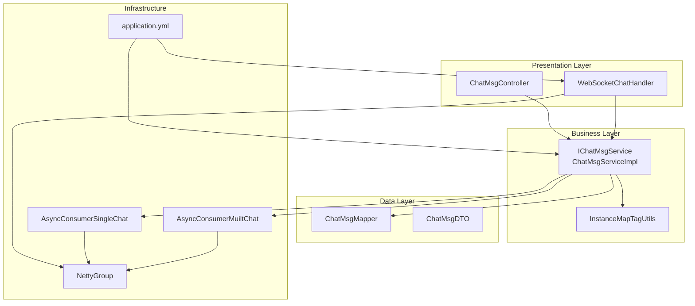
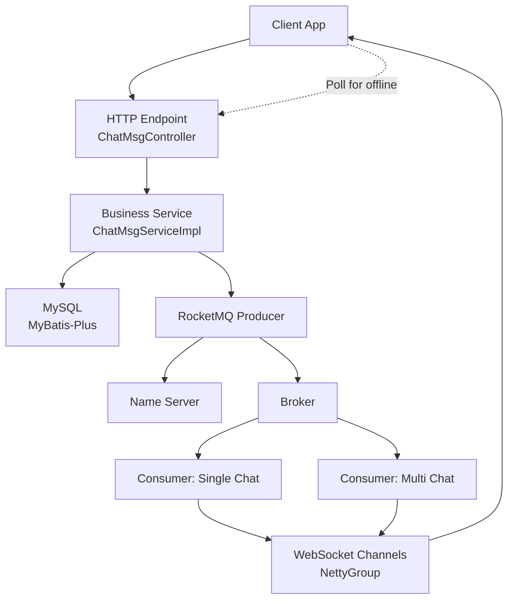
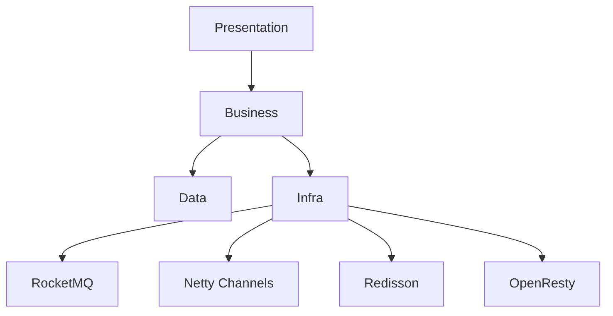
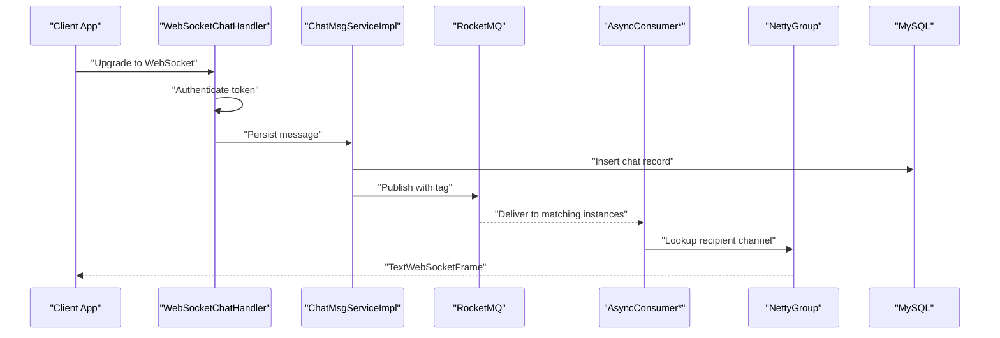
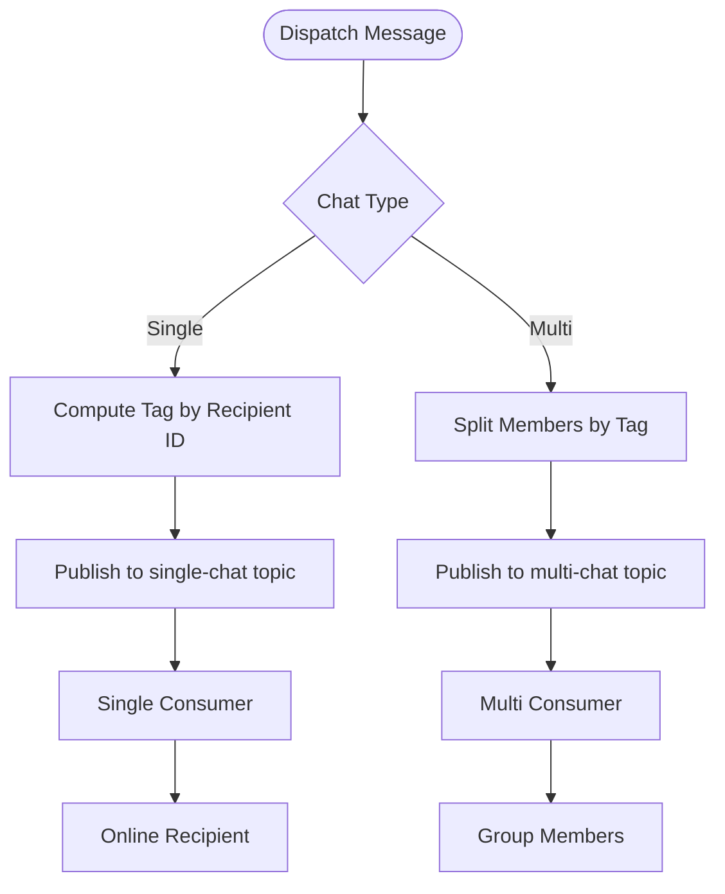
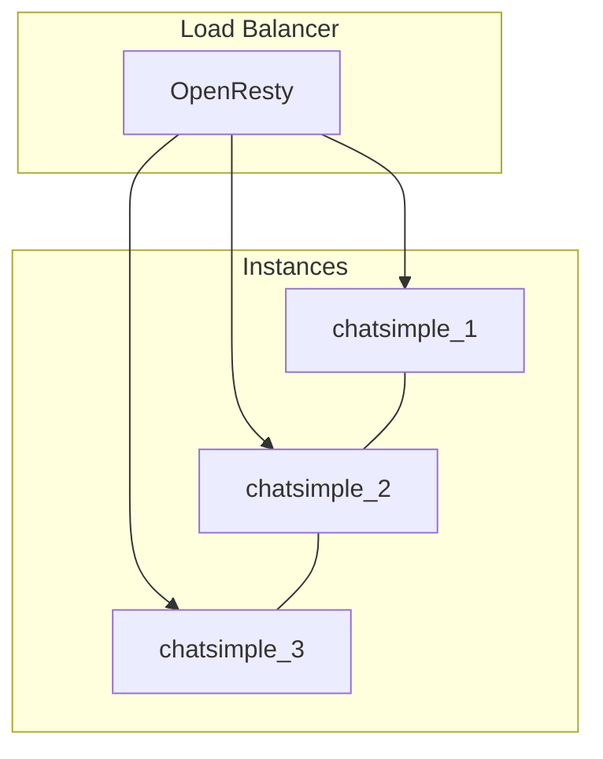
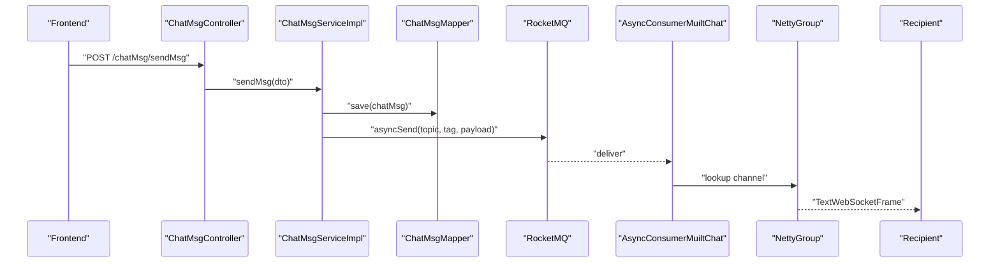
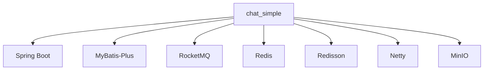
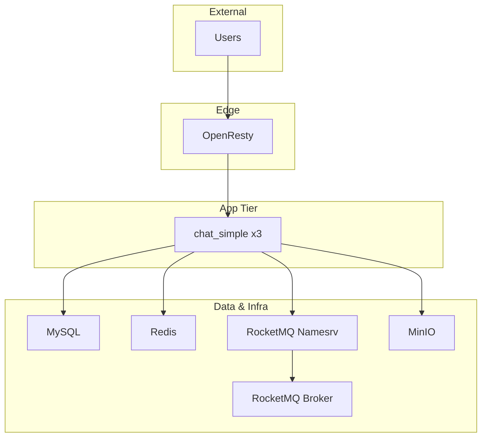

# Architecture Overview

<cite>
**Referenced Files in This Document**
- [ChatSimpleApplication.java](file://src/main/java/com/hch/chat_simple/ChatSimpleApplication.java)
- [application.yml](file://src/main/resources/application.yml)
- [pom.xml](file://pom.xml)
- [docker-compose.yml](file://docker-compose.yml)
- [Dockerfile](file://Dockerfile)
- [WebSocketChatHandler.java](file://src/main/java/com/hch/chat_simple/handler/WebSocketChatHandler.java)
- [NettyGroup.java](file://src/main/java/com/hch/chat_simple/config/NettyGroup.java)
- [AsyncConsumerSingleChat.java](file://src/main/java/com/hch/chat_simple/mq/AsyncConsumerSingleChat.java)
- [AsyncConsumerMuiltChat.java](file://src/main/java/com/hch/chat_simple/mq/AsyncConsumerMuiltChat.java)
- [ChatMsgServiceImpl.java](file://src/main/java/com/hch/chat_simple/service/impl/ChatMsgServiceImpl.java)
- [ChatMsgController.java](file://src/main/java/com/hch/chat_simple/controller/ChatMsgController.java)
- [InstanceMapTagUtils.java](file://src/main/java/com/hch/chat_simple/util/InstanceMapTagUtils.java)
- [ChatMsgDTO.java](file://src/main/java/com/hch/chat_simple/pojo/dto/ChatMsgDTO.java)
- [ChatMsgMapper.java](file://src/main/java/com/hch/chat_simple/mapper/ChatMsgMapper.java)
- [IChatMsgService.java](file://src/main/java/com/hch/chat_simple/service/IChatMsgService.java)
</cite>

## Table of Contents
1. [Introduction](#introduction)
2. [Project Structure](#project-structure)
3. [Core Components](#core-components)
4. [Architecture Overview](#architecture-overview)
5. [Detailed Component Analysis](#detailed-component-analysis)
6. [Dependency Analysis](#dependency-analysis)
7. [Performance Considerations](#performance-considerations)
8. [Troubleshooting Guide](#troubleshooting-guide)
9. [Conclusion](#conclusion)
10. [Appendices](#appendices)

## Introduction
This document presents a comprehensive architecture overview of the Chat Simple project. It describes the layered architecture separating presentation, business, and data concerns, and explains the high-level system design with emphasis on real-time communication via WebSocket, asynchronous messaging using RocketMQ, and operational patterns supporting horizontal scaling and microservices-style distribution. Cross-cutting concerns such as security, monitoring, and performance optimization are addressed alongside deployment topology and system boundaries.

## Project Structure
The project follows a conventional Spring Boot monolith with clear package-based separation:
- Presentation layer: REST controllers and WebSocket handlers
- Business layer: service interfaces and implementations
- Data layer: MyBatis-Plus mappers and PO/VO/DTO models
- Infrastructure: configuration, MQ producers/consumers, utilities, and integrations

**Diagram sources**
- [ChatMsgController.java:1-58](file://src/main/java/com/hch/chat_simple/controller/ChatMsgController.java#L1-L58)
- [WebSocketChatHandler.java:1-196](file://src/main/java/com/hch/chat_simple/handler/WebSocketChatHandler.java#L1-L196)
- [IChatMsgService.java:1-28](file://src/main/java/com/hch/chat_simple/service/IChatMsgService.java#L1-L28)
- [ChatMsgServiceImpl.java:1-184](file://src/main/java/com/hch/chat_simple/service/impl/ChatMsgServiceImpl.java#L1-L184)
- [InstanceMapTagUtils.java:1-55](file://src/main/java/com/hch/chat_simple/util/InstanceMapTagUtils.java#L1-L55)
- [ChatMsgMapper.java:1-21](file://src/main/java/com/hch/chat_simple/mapper/ChatMsgMapper.java#L1-L21)
- [ChatMsgDTO.java:1-62](file://src/main/java/com/hch/chat_simple/pojo/dto/ChatMsgDTO.java#L1-L62)
- [AsyncConsumerSingleChat.java:1-84](file://src/main/java/com/hch/chat_simple/mq/AsyncConsumerSingleChat.java#L1-L84)
- [AsyncConsumerMuiltChat.java:1-92](file://src/main/java/com/hch/chat_simple/mq/AsyncConsumerMuiltChat.java#L1-L92)
- [NettyGroup.java:1-30](file://src/main/java/com/hch/chat_simple/config/NettyGroup.java#L1-L30)
- [application.yml:1-89](file://src/main/resources/application.yml#L1-L89)

**Section sources**
- [ChatSimpleApplication.java:1-25](file://src/main/java/com/hch/chat_simple/ChatSimpleApplication.java#L1-L25)
- [application.yml:1-89](file://src/main/resources/application.yml#L1-L89)
- [pom.xml:1-346](file://pom.xml#L1-L346)

## Core Components
- Application bootstrap and dialect configuration
- REST controllers for chat operations
- WebSocket handler for real-time messaging and session management
- Service layer orchestrating persistence, tagging, and MQ dispatch
- RocketMQ consumers for single and multi-chat delivery
- Netty-based in-memory channel registry for live sessions
- Tagging utilities for instance distribution and MQ routing

Key responsibilities:
- Presentation: expose HTTP endpoints and WebSocket protocol upgrade
- Business: validate requests, persist messages, compute routing tags, publish MQ events
- Data: MyBatis-Plus CRUD and queries for chat records
- MQ: asynchronous fan-out to instances and channels
- Transport: Netty-managed WebSocket channels per user

**Section sources**
- [ChatMsgController.java:1-58](file://src/main/java/com/hch/chat_simple/controller/ChatMsgController.java#L1-L58)
- [WebSocketChatHandler.java:1-196](file://src/main/java/com/hch/chat_simple/handler/WebSocketChatHandler.java#L1-L196)
- [ChatMsgServiceImpl.java:1-184](file://src/main/java/com/hch/chat_simple/service/impl/ChatMsgServiceImpl.java#L1-L184)
- [AsyncConsumerSingleChat.java:1-84](file://src/main/java/com/hch/chat_simple/mq/AsyncConsumerSingleChat.java#L1-L84)
- [AsyncConsumerMuiltChat.java:1-92](file://src/main/java/com/hch/chat_simple/mq/AsyncConsumerMuiltChat.java#L1-L92)
- [NettyGroup.java:1-30](file://src/main/java/com/hch/chat_simple/config/NettyGroup.java#L1-L30)
- [InstanceMapTagUtils.java:1-55](file://src/main/java/com/hch/chat_simple/util/InstanceMapTagUtils.java#L1-L55)

## Architecture Overview
The system employs a hybrid synchronous/asynchronous design:
- HTTP endpoints accept chat requests and delegate to the service layer
- Services persist messages and publish RocketMQ events with routing tags
- Consumers deliver messages to live WebSocket channels via Netty
- Offline users rely on HTTP polling to fetch pending messages

**Diagram sources**
- [ChatMsgController.java:1-58](file://src/main/java/com/hch/chat_simple/controller/ChatMsgController.java#L1-L58)
- [ChatMsgServiceImpl.java:1-184](file://src/main/java/com/hch/chat_simple/service/impl/ChatMsgServiceImpl.java#L1-L184)
- [application.yml:39-52](file://src/main/resources/application.yml#L39-L52)
- [AsyncConsumerSingleChat.java:1-84](file://src/main/java/com/hch/chat_simple/mq/AsyncConsumerSingleChat.java#L1-L84)
- [AsyncConsumerMuiltChat.java:1-92](file://src/main/java/com/hch/chat_simple/mq/AsyncConsumerMuiltChat.java#L1-L92)
- [NettyGroup.java:1-30](file://src/main/java/com/hch/chat_simple/config/NettyGroup.java#L1-L30)

## Detailed Component Analysis

### Layered Architecture
- Presentation: REST endpoints and WebSocket handler
- Business: service orchestration, persistence, MQ publishing, tagging
- Data: MyBatis-Plus mappers and PO/VO/DTO models
- Infrastructure: RocketMQ, Netty, Redisson, OpenResty

**Diagram sources**
- [ChatMsgController.java:1-58](file://src/main/java/com/hch/chat_simple/controller/ChatMsgController.java#L1-L58)
- [WebSocketChatHandler.java:1-196](file://src/main/java/com/hch/chat_simple/handler/WebSocketChatHandler.java#L1-L196)
- [ChatMsgServiceImpl.java:1-184](file://src/main/java/com/hch/chat_simple/service/impl/ChatMsgServiceImpl.java#L1-L184)
- [application.yml:39-89](file://src/main/resources/application.yml#L39-L89)

### Real-Time Communication with WebSocket
WebSocketChatHandler manages:
- Session establishment and token verification
- Channel registration and idle disconnect cleanup
- Delegation to service layer for persistence and MQ publishing
- Delivery to recipient channels via Netty

**Diagram sources**
- [WebSocketChatHandler.java:118-163](file://src/main/java/com/hch/chat_simple/handler/WebSocketChatHandler.java#L118-L163)
- [ChatMsgServiceImpl.java:97-144](file://src/main/java/com/hch/chat_simple/service/impl/ChatMsgServiceImpl.java#L97-L144)
- [AsyncConsumerSingleChat.java:47-73](file://src/main/java/com/hch/chat_simple/mq/AsyncConsumerSingleChat.java#L47-L73)
- [AsyncConsumerMuiltChat.java:49-83](file://src/main/java/com/hch/chat_simple/mq/AsyncConsumerMuiltChat.java#L49-L83)
- [NettyGroup.java:11-26](file://src/main/java/com/hch/chat_simple/config/NettyGroup.java#L11-L26)

**Section sources**
- [WebSocketChatHandler.java:1-196](file://src/main/java/com/hch/chat_simple/handler/WebSocketChatHandler.java#L1-L196)
- [NettyGroup.java:1-30](file://src/main/java/com/hch/chat_simple/config/NettyGroup.java#L1-L30)

### Message Queue Architecture with RocketMQ
- Topics: single-chat, multi-chat, composition
- Producer group and consumer groups configured
- Tag-based routing to distribute load across instances
- Consumers broadcast to WebSocket channels for online recipients

**Diagram sources**
- [application.yml:47-52](file://src/main/resources/application.yml#L47-L52)
- [ChatMsgServiceImpl.java:119-135](file://src/main/java/com/hch/chat_simple/service/impl/ChatMsgServiceImpl.java#L119-L135)
- [InstanceMapTagUtils.java:32-47](file://src/main/java/com/hch/chat_simple/util/InstanceMapTagUtils.java#L32-L47)
- [AsyncConsumerSingleChat.java:47-73](file://src/main/java/com/hch/chat_simple/mq/AsyncConsumerSingleChat.java#L47-L73)
- [AsyncConsumerMuiltChat.java:57-83](file://src/main/java/com/hch/chat_simple/mq/AsyncConsumerMuiltChat.java#L57-L83)

**Section sources**
- [application.yml:39-52](file://src/main/resources/application.yml#L39-L52)
- [InstanceMapTagUtils.java:1-55](file://src/main/java/com/hch/chat_simple/util/InstanceMapTagUtils.java#L1-L55)
- [ChatMsgServiceImpl.java:1-184](file://src/main/java/com/hch/chat_simple/service/impl/ChatMsgServiceImpl.java#L1-L184)

### Distributed System Patterns and Microservices Considerations
- Horizontal scaling: multiple instances behind OpenResty
- Tag-based partitioning: routing by recipient/group ensures predictable delivery
- Loose coupling: HTTP and MQ decouple clients from each other
- Instance tagging: chat.tag.list and current tag selection enable controlled distribution

**Diagram sources**
- [docker-compose.yml:3-63](file://docker-compose.yml#L3-L63)
- [application.yml:76-82](file://src/main/resources/application.yml#L76-L82)
- [Dockerfile:11-12](file://Dockerfile#L11-L12)

**Section sources**
- [docker-compose.yml:1-132](file://docker-compose.yml#L1-L132)
- [application.yml:76-82](file://src/main/resources/application.yml#L76-L82)
- [Dockerfile:1-12](file://Dockerfile#L1-L12)

### Component Interactions and Data Flows
- HTTP send flow: controller → service → DB → MQ → consumers → Netty → client
- Offline retrieval: controller → service → DB → client
- Group member resolution: service queries group membership for multi-chat fan-out

**Diagram sources**
- [ChatMsgController.java:45-49](file://src/main/java/com/hch/chat_simple/controller/ChatMsgController.java#L45-L49)
- [ChatMsgServiceImpl.java:97-144](file://src/main/java/com/hch/chat_simple/service/impl/ChatMsgServiceImpl.java#L97-L144)
- [ChatMsgMapper.java:1-21](file://src/main/java/com/hch/chat_simple/mapper/ChatMsgMapper.java#L1-L21)
- [AsyncConsumerMuiltChat.java:57-83](file://src/main/java/com/hch/chat_simple/mq/AsyncConsumerMuiltChat.java#L57-L83)
- [NettyGroup.java:11-26](file://src/main/java/com/hch/chat_simple/config/NettyGroup.java#L11-L26)

**Section sources**
- [ChatMsgController.java:1-58](file://src/main/java/com/hch/chat_simple/controller/ChatMsgController.java#L1-L58)
- [ChatMsgServiceImpl.java:1-184](file://src/main/java/com/hch/chat_simple/service/impl/ChatMsgServiceImpl.java#L1-L184)
- [ChatMsgMapper.java:1-21](file://src/main/java/com/hch/chat_simple/mapper/ChatMsgMapper.java#L1-L21)
- [AsyncConsumerMuiltChat.java:1-92](file://src/main/java/com/hch/chat_simple/mq/AsyncConsumerMuiltChat.java#L1-L92)
- [NettyGroup.java:1-30](file://src/main/java/com/hch/chat_simple/config/NettyGroup.java#L1-L30)

### Security, Monitoring, and Performance
- Security: JWT token parsing during WebSocket handshake; HTTP endpoints can integrate interceptors for authorization
- Monitoring: RocketMQ metrics, Netty channel counts, DB query performance, and application logs
- Performance: fixed thread pools for async tasks, tag-based partitioning to reduce contention, Netty for efficient real-time delivery

[No sources needed since this section provides general guidance]

## Dependency Analysis
External dependencies and their roles:
- Spring Boot starters for web, validation, Redis, and RocketMQ
- MyBatis-Plus for ORM and pagination
- Netty for WebSocket transport
- Redisson for distributed primitives and pub/sub
- MinIO for object storage

**Diagram sources**
- [pom.xml:54-315](file://pom.xml#L54-L315)
- [application.yml:3-89](file://src/main/resources/application.yml#L3-L89)

**Section sources**
- [pom.xml:1-346](file://pom.xml#L1-L346)
- [application.yml:1-89](file://src/main/resources/application.yml#L1-L89)

## Performance Considerations
- Asynchronous delivery: RocketMQ decouples senders from receivers, improving throughput
- Tag-based routing: reduces cross-instance traffic and improves locality
- Fixed-size executors: bounded concurrency for async tasks
- Netty: efficient, non-blocking IO for WebSocket frames
- Pagination and selective queries: minimize DB load for unread message retrieval

[No sources needed since this section provides general guidance]

## Troubleshooting Guide
Common areas to check:
- WebSocket handshake failures: verify token parsing and attribute binding
- MQ delivery issues: confirm topic names, consumer groups, and tag computation
- Channel lookup failures: ensure user-to-channel mapping is intact after idle disconnects
- Offline message retrieval: validate query conditions and status updates

**Section sources**
- [WebSocketChatHandler.java:118-163](file://src/main/java/com/hch/chat_simple/handler/WebSocketChatHandler.java#L118-L163)
- [AsyncConsumerSingleChat.java:47-73](file://src/main/java/com/hch/chat_simple/mq/AsyncConsumerSingleChat.java#L47-L73)
- [AsyncConsumerMuiltChat.java:49-83](file://src/main/java/com/hch/chat_simple/mq/AsyncConsumerMuiltChat.java#L49-L83)
- [ChatMsgServiceImpl.java:71-95](file://src/main/java/com/hch/chat_simple/service/impl/ChatMsgServiceImpl.java#L71-L95)

## Conclusion
Chat Simple adopts a layered architecture with clear separation of concerns, leveraging HTTP and WebSocket for real-time communication, RocketMQ for asynchronous messaging, and Netty for efficient transport. Tag-based distribution and horizontal scaling enable practical growth, while MyBatis-Plus and Redisson provide robust persistence and coordination. The design balances simplicity with scalability, suitable for iterative evolution toward microservices if needed.

## Appendices

### System Boundaries and Deployment Topology
- Internal: application, database, Redis, RocketMQ NameServer/Broker
- External: clients via HTTP and WebSocket
- Load balancing: OpenResty distributing traffic across instances

**Diagram sources**
- [docker-compose.yml:1-132](file://docker-compose.yml#L1-L132)
- [application.yml:3-89](file://src/main/resources/application.yml#L3-L89)