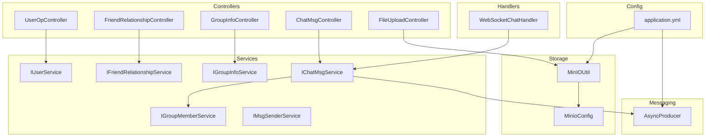
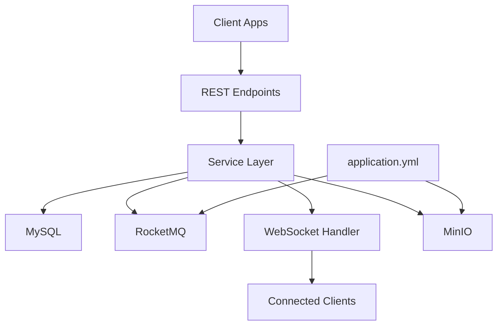
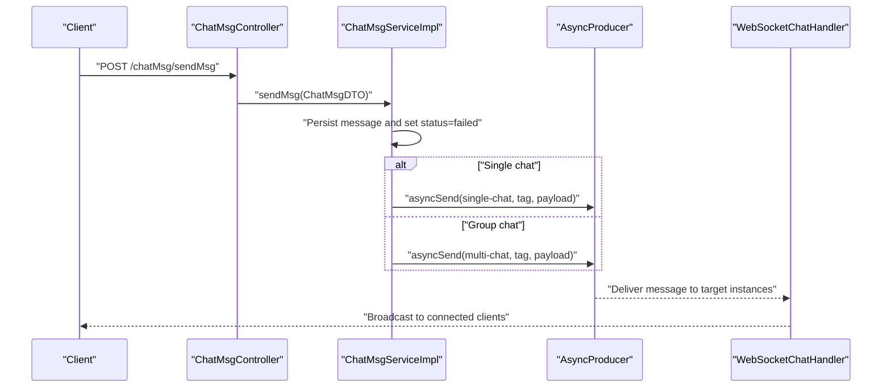
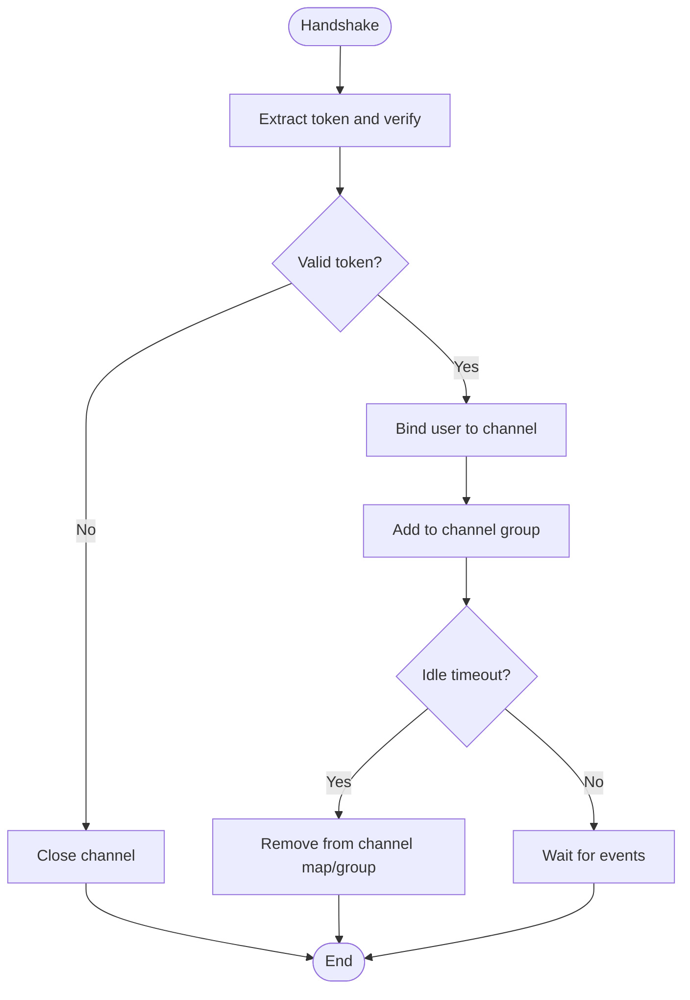
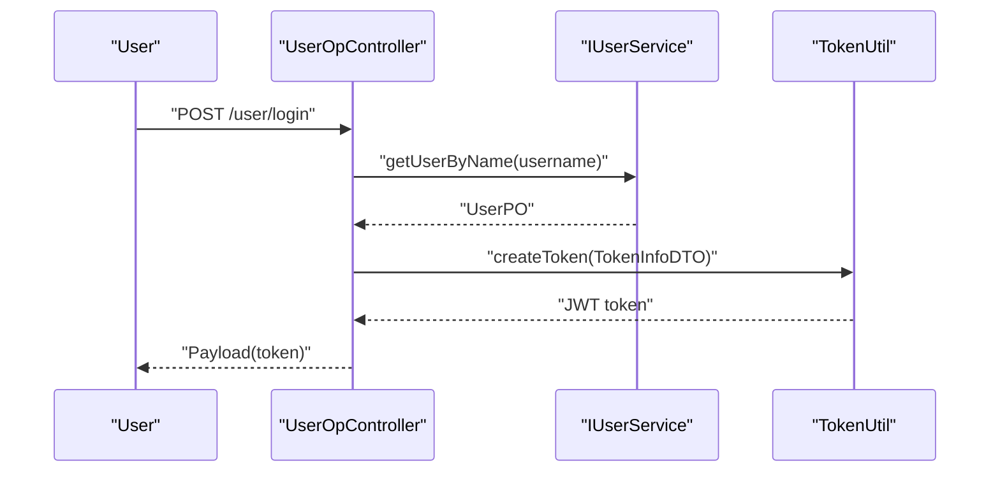
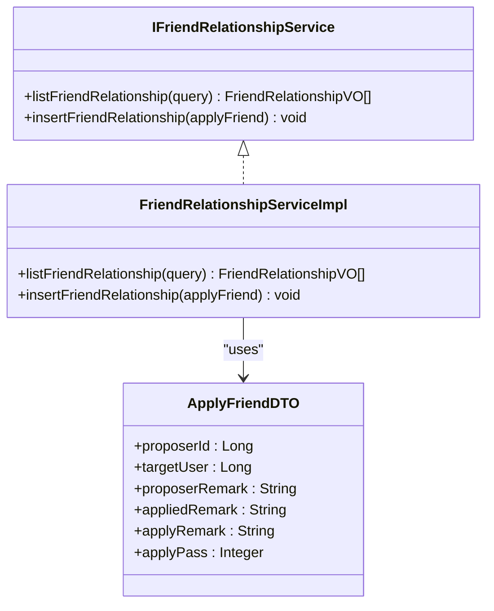
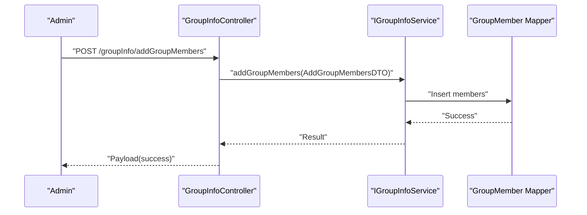
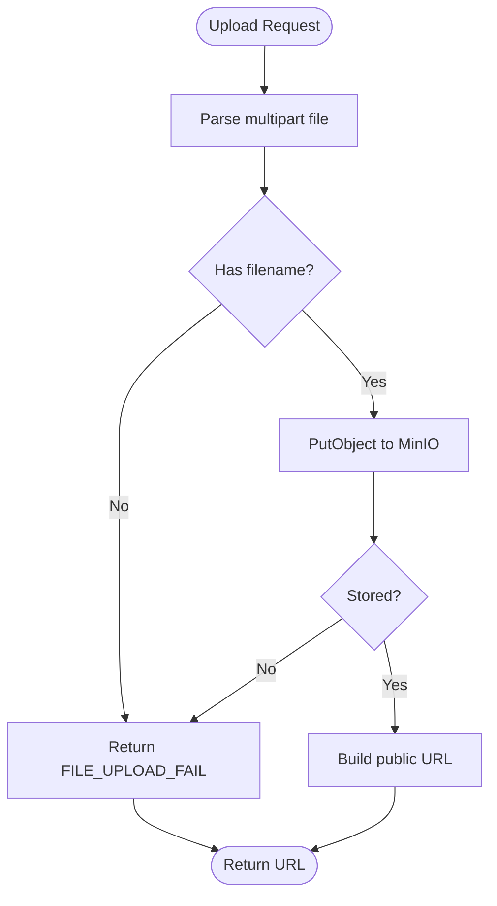
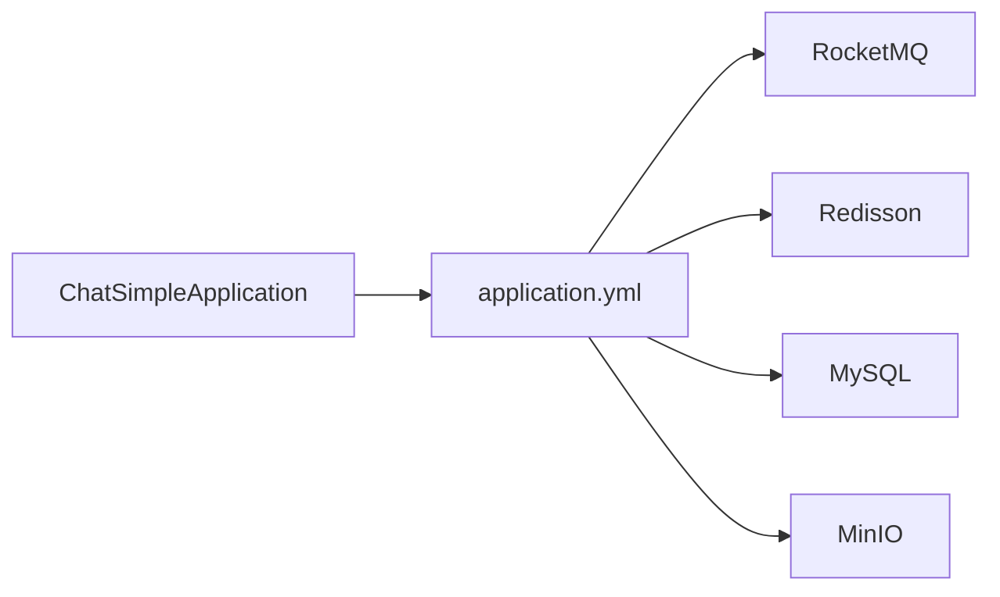

# Feature Highlights

<cite>
**Referenced Files in This Document**
- [ChatSimpleApplication.java](file://src/main/java/com/hch/chat_simple/ChatSimpleApplication.java)
- [application.yml](file://src/main/resources/application.yml)
- [chat.sql](file://db/chat.sql)
- [UserOpController.java](file://src/main/java/com/hch/chat_simple/controller/UserOpController.java)
- [TokenUtil.java](file://src/main/java/com/hch/chat_simple/util/TokenUtil.java)
- [UserPO.java](file://src/main/java/com/hch/chat_simple/pojo/po/UserPO.java)
- [FriendRelationshipController.java](file://src/main/java/com/hch/chat_simple/controller/FriendRelationshipController.java)
- [IFriendRelationshipService.java](file://src/main/java/com/hch/chat_simple/service/IFriendRelationshipService.java)
- [FriendRelationshipServiceImpl.java](file://src/main/java/com/hch/chat_simple/service/impl/FriendRelationshipServiceImpl.java)
- [ApplyFriendDTO.java](file://src/main/java/com/hch/chat_simple/pojo/dto/ApplyFriendDTO.java)
- [GroupInfoController.java](file://src/main/java/com/hch/chat_simple/controller/GroupInfoController.java)
- [ChatMsgController.java](file://src/main/java/com/hch/chat_simple/controller/ChatMsgController.java)
- [IChatMsgService.java](file://src/main/java/com/hch/chat_simple/service/IChatMsgService.java)
- [ChatMsgServiceImpl.java](file://src/main/java/com/hch/chat_simple/service/impl/ChatMsgServiceImpl.java)
- [WebSocketChatHandler.java](file://src/main/java/com/hch/chat_simple/handler/WebSocketChatHandler.java)
- [AsyncProducer.java](file://src/main/java/com/hch/chat_simple/mq/AsyncProducer.java)
- [MsgTypeEnum.java](file://src/main/java/com/hch/chat_simple/enums/MsgTypeEnum.java)
- [FileUploadController.java](file://src/main/java/com/hch/chat_simple/controller/FileUploadController.java)
- [MinIOUtil.java](file://src/main/java/com/hch/chat_simple/util/MinIOUtil.java)
- [MinioConfig.java](file://src/main/java/com/hch/chat_simple/config/MinioConfig.java)
</cite>

## Table of Contents
1. [Introduction](#introduction)
2. [Project Structure](#project-structure)
3. [Core Components](#core-components)
4. [Architecture Overview](#architecture-overview)
5. [Detailed Component Analysis](#detailed-component-analysis)
6. [Dependency Analysis](#dependency-analysis)
7. [Performance Considerations](#performance-considerations)
8. [Troubleshooting Guide](#troubleshooting-guide)
9. [Conclusion](#conclusion)

## Introduction
This document presents the feature highlights of the Chat Simple application, focusing on its real-time messaging platform capabilities. It covers:
- Real-time messaging: single chat peer-to-peer messaging, group chat multi-user broadcast, and WebSocket-based live communication
- User management: registration, authentication with JWT tokens, and profile management
- Friend relationship management: friend requests, approvals, and relationship maintenance
- Group chat functionality: member management and permissions
- File sharing: cloud storage integration via MinIO, upload/download, and content validation

The goal is to help both technical and non-technical users understand how the application works and how to use its features effectively.

## Project Structure
The application is a Spring Boot service with layered architecture:
- Controllers expose REST endpoints for user operations, messaging, groups, and file uploads
- Services encapsulate business logic and orchestrate persistence and messaging
- Handlers manage WebSocket connections and real-time events
- Utilities and configurations integrate external systems (RocketMQ, Redisson, MinIO)
- Database schema defines core entities: users, friendships, chat messages, groups, and members

**Diagram sources**
- [UserOpController.java:35-114](file://src/main/java/com/hch/chat_simple/controller/UserOpController.java#L35-L114)
- [FriendRelationshipController.java:28-49](file://src/main/java/com/hch/chat_simple/controller/FriendRelationshipController.java#L28-L49)
- [GroupInfoController.java:30-68](file://src/main/java/com/hch/chat_simple/controller/GroupInfoController.java#L30-L68)
- [ChatMsgController.java:31-58](file://src/main/java/com/hch/chat_simple/controller/ChatMsgController.java#L31-L58)
- [FileUploadController.java:22-82](file://src/main/java/com/hch/chat_simple/controller/FileUploadController.java#L22-L82)
- [IChatMsgService.java:20-28](file://src/main/java/com/hch/chat_simple/service/IChatMsgService.java#L20-L28)
- [ChatMsgServiceImpl.java:53-184](file://src/main/java/com/hch/chat_simple/service/impl/ChatMsgServiceImpl.java#L53-L184)
- [WebSocketChatHandler.java:50-196](file://src/main/java/com/hch/chat_simple/handler/WebSocketChatHandler.java#L50-L196)
- [AsyncProducer.java:17-63](file://src/main/java/com/hch/chat_simple/mq/AsyncProducer.java#L17-L63)
- [MinIOUtil.java:48-198](file://src/main/java/com/hch/chat_simple/util/MinIOUtil.java#L48-L198)
- [MinioConfig.java:10-33](file://src/main/java/com/hch/chat_simple/config/MinioConfig.java#L10-L33)
- [application.yml:1-89](file://src/main/resources/application.yml#L1-L89)

**Section sources**
- [ChatSimpleApplication.java:16-24](file://src/main/java/com/hch/chat_simple/ChatSimpleApplication.java#L16-L24)
- [application.yml:1-89](file://src/main/resources/application.yml#L1-L89)

## Core Components
- Real-time messaging engine: WebSocket handler and asynchronous message sender
- Messaging pipeline: RocketMQ topics for single and group chats
- User and friendship management: login, JWT token generation, friend lists, and approvals
- Group chat management: creation, member addition, and member queries
- File sharing: MinIO integration for upload, download, and preview

**Section sources**
- [WebSocketChatHandler.java:50-196](file://src/main/java/com/hch/chat_simple/handler/WebSocketChatHandler.java#L50-L196)
- [AsyncProducer.java:17-63](file://src/main/java/com/hch/chat_simple/mq/AsyncProducer.java#L17-L63)
- [UserOpController.java:35-114](file://src/main/java/com/hch/chat_simple/controller/UserOpController.java#L35-L114)
- [TokenUtil.java:18-71](file://src/main/java/com/hch/chat_simple/util/TokenUtil.java#L18-L71)
- [FriendRelationshipServiceImpl.java:40-112](file://src/main/java/com/hch/chat_simple/service/impl/FriendRelationshipServiceImpl.java#L40-L112)
- [GroupInfoController.java:30-68](file://src/main/java/com/hch/chat_simple/controller/GroupInfoController.java#L30-L68)
- [ChatMsgServiceImpl.java:53-184](file://src/main/java/com/hch/chat_simple/service/impl/ChatMsgServiceImpl.java#L53-L184)
- [FileUploadController.java:22-82](file://src/main/java/com/hch/chat_simple/controller/FileUploadController.java#L22-L82)
- [MinIOUtil.java:48-198](file://src/main/java/com/hch/chat_simple/util/MinIOUtil.java#L48-L198)

## Architecture Overview
The system combines REST APIs, WebSocket channels, and asynchronous messaging to deliver a responsive, scalable chat platform.

**Diagram sources**
- [application.yml:39-89](file://src/main/resources/application.yml#L39-L89)
- [WebSocketChatHandler.java:50-196](file://src/main/java/com/hch/chat_simple/handler/WebSocketChatHandler.java#L50-L196)
- [AsyncProducer.java:17-63](file://src/main/java/com/hch/chat_simple/mq/AsyncProducer.java#L17-L63)
- [FileUploadController.java:22-82](file://src/main/java/com/hch/chat_simple/controller/FileUploadController.java#L22-L82)

## Detailed Component Analysis

### Real-Time Messaging: Single Chat and Group Chat Broadcast
- Single chat: Messages are persisted, tagged by receiver ID, and sent asynchronously to the target instance via RocketMQ topic for single-chat.
- Group chat: Member IDs are grouped by instance tags, and messages are broadcast to all relevant instances for delivery.
- WebSocket live communication: On handshake, clients attach JWT-derived identity to channels; online users receive messages delivered by the messaging pipeline.

**Diagram sources**
- [ChatMsgController.java:31-58](file://src/main/java/com/hch/chat_simple/controller/ChatMsgController.java#L31-L58)
- [ChatMsgServiceImpl.java:97-144](file://src/main/java/com/hch/chat_simple/service/impl/ChatMsgServiceImpl.java#L97-L144)
- [AsyncProducer.java:40-59](file://src/main/java/com/hch/chat_simple/mq/AsyncProducer.java#L40-L59)
- [WebSocketChatHandler.java:72-109](file://src/main/java/com/hch/chat_simple/handler/WebSocketChatHandler.java#L72-L109)

**Section sources**
- [ChatMsgServiceImpl.java:53-184](file://src/main/java/com/hch/chat_simple/service/impl/ChatMsgServiceImpl.java#L53-L184)
- [AsyncProducer.java:17-63](file://src/main/java/com/hch/chat_simple/mq/AsyncProducer.java#L17-L63)
- [WebSocketChatHandler.java:50-196](file://src/main/java/com/hch/chat_simple/handler/WebSocketChatHandler.java#L50-L196)
- [MsgTypeEnum.java:6-24](file://src/main/java/com/hch/chat_simple/enums/MsgTypeEnum.java#L6-L24)

### WebSocket-Based Live Communication
- Authentication: On handshake, the handler extracts token attributes and binds user identity to the channel.
- Session management: Online users are tracked in a channel map; idle disconnects trigger cleanup.
- Message lifecycle: Messages are stored before asynchronous delivery; status updates occur after successful delivery.

**Diagram sources**
- [WebSocketChatHandler.java:118-163](file://src/main/java/com/hch/chat_simple/handler/WebSocketChatHandler.java#L118-L163)
- [TokenUtil.java:48-69](file://src/main/java/com/hch/chat_simple/util/TokenUtil.java#L48-L69)

**Section sources**
- [WebSocketChatHandler.java:50-196](file://src/main/java/com/hch/chat_simple/handler/WebSocketChatHandler.java#L50-L196)
- [TokenUtil.java:18-71](file://src/main/java/com/hch/chat_simple/util/TokenUtil.java#L18-L71)

### User Management: Registration, Authentication, and Profile
- Registration: Endpoint supports adding users with validated forms.
- Authentication: Login validates credentials and issues a JWT token containing user identity.
- Profile: Retrieve current user profile using authenticated context.

**Diagram sources**
- [UserOpController.java:44-66](file://src/main/java/com/hch/chat_simple/controller/UserOpController.java#L44-L66)
- [TokenUtil.java:23-30](file://src/main/java/com/hch/chat_simple/util/TokenUtil.java#L23-L30)

**Section sources**
- [UserOpController.java:35-114](file://src/main/java/com/hch/chat_simple/controller/UserOpController.java#L35-L114)
- [TokenUtil.java:18-71](file://src/main/java/com/hch/chat_simple/util/TokenUtil.java#L18-L71)
- [UserPO.java:22-47](file://src/main/java/com/hch/chat_simple/pojo/po/UserPO.java#L22-L47)

### Friend Relationship Management: Requests, Approvals, and Maintenance
- Friend list: Query friends filtered by current user context.
- Apply and approve: DTO carries proposer/target details and remarks; service inserts bidirectional relationships upon approval.

**Diagram sources**
- [IFriendRelationshipService.java:20-26](file://src/main/java/com/hch/chat_simple/service/IFriendRelationshipService.java#L20-L26)
- [FriendRelationshipServiceImpl.java:40-112](file://src/main/java/com/hch/chat_simple/service/impl/FriendRelationshipServiceImpl.java#L40-L112)
- [ApplyFriendDTO.java:11-42](file://src/main/java/com/hch/chat_simple/pojo/dto/ApplyFriendDTO.java#L11-L42)

**Section sources**
- [FriendRelationshipController.java:28-49](file://src/main/java/com/hch/chat_simple/controller/FriendRelationshipController.java#L28-L49)
- [FriendRelationshipServiceImpl.java:40-112](file://src/main/java/com/hch/chat_simple/service/impl/FriendRelationshipServiceImpl.java#L40-L112)
- [ApplyFriendDTO.java:11-42](file://src/main/java/com/hch/chat_simple/pojo/dto/ApplyFriendDTO.java#L11-L42)

### Group Chat Functionality: Member Management and Permissions
- Create group: Controller delegates to group info service.
- Manage members: Add members via DTO; query members by group ID; include left members for historical chat display.
- Permissions: Group status and lock password fields define join policies; service retrieves members for message routing.

**Diagram sources**
- [GroupInfoController.java:54-59](file://src/main/java/com/hch/chat_simple/controller/GroupInfoController.java#L54-L59)

**Section sources**
- [GroupInfoController.java:30-68](file://src/main/java/com/hch/chat_simple/controller/GroupInfoController.java#L30-L68)
- [chat.sql:56-89](file://db/chat.sql#L56-L89)

### File Sharing with MinIO: Upload, Download, Preview, and Validation
- Upload: Accepts multipart file, generates unique object name under date-prefixed path, stores in configured bucket.
- Download: Streams object content to HTTP response.
- Preview: Generates presigned URL for temporary access.
- Bucket operations: Existence checks, creation, listing, and removal.

**Diagram sources**
- [FileUploadController.java:50-57](file://src/main/java/com/hch/chat_simple/controller/FileUploadController.java#L50-L57)
- [MinIOUtil.java:98-122](file://src/main/java/com/hch/chat_simple/util/MinIOUtil.java#L98-L122)

**Section sources**
- [FileUploadController.java:22-82](file://src/main/java/com/hch/chat_simple/controller/FileUploadController.java#L22-L82)
- [MinIOUtil.java:48-198](file://src/main/java/com/hch/chat_simple/util/MinIOUtil.java#L48-L198)
- [MinioConfig.java:10-33](file://src/main/java/com/hch/chat_simple/config/MinioConfig.java#L10-L33)

## Dependency Analysis
External integrations and their roles:
- RocketMQ: Asynchronous delivery for single and group chats
- Redisson: Distributed coordination and pub/sub (configured via YAML)
- MinIO: Cloud storage for file sharing
- MySQL: Relational persistence for users, friendships, messages, groups, and members

**Diagram sources**
- [application.yml:39-89](file://src/main/resources/application.yml#L39-L89)
- [ChatSimpleApplication.java:16-24](file://src/main/java/com/hch/chat_simple/ChatSimpleApplication.java#L16-L24)

**Section sources**
- [application.yml:1-89](file://src/main/resources/application.yml#L1-L89)
- [chat.sql:1-130](file://db/chat.sql#L1-L130)

## Performance Considerations
- Asynchronous messaging: Single and group messages are produced asynchronously to RocketMQ, reducing latency and improving throughput.
- Tag-based routing: Instance tagging ensures targeted delivery across multiple application instances.
- Batch updates: Unread message status updates are batched to minimize DB overhead.
- WebSocket pooling: Fixed thread pool for message handling reduces contention.
- MinIO streaming: Streaming downloads avoid loading entire files into memory.

[No sources needed since this section provides general guidance]

## Troubleshooting Guide
- Authentication failures: Verify JWT token issuer and expiration; ensure token parsing succeeds.
- WebSocket disconnects: Check idle state handling and re-authentication on reconnect.
- Message delivery issues: Confirm RocketMQ producer configuration and topic/tag correctness.
- File upload errors: Validate bucket existence and MinIO endpoint configuration; check content type and size constraints.
- Friend approval anomalies: Ensure bidirectional relationship insertion and existing incomplete relations are handled.

**Section sources**
- [TokenUtil.java:48-69](file://src/main/java/com/hch/chat_simple/util/TokenUtil.java#L48-L69)
- [WebSocketChatHandler.java:118-163](file://src/main/java/com/hch/chat_simple/handler/WebSocketChatHandler.java#L118-L163)
- [AsyncProducer.java:40-59](file://src/main/java/com/hch/chat_simple/mq/AsyncProducer.java#L40-L59)
- [MinIOUtil.java:98-122](file://src/main/java/com/hch/chat_simple/util/MinIOUtil.java#L98-L122)
- [FriendRelationshipServiceImpl.java:58-108](file://src/main/java/com/hch/chat_simple/service/impl/FriendRelationshipServiceImpl.java#L58-L108)

## Conclusion
Chat Simple delivers a comprehensive real-time messaging platform with robust user management, friend relationships, group chat, and integrated file sharing. Its architecture leverages asynchronous messaging, WebSocket channels, and cloud storage to provide scalable, reliable communication features suitable for modern applications.