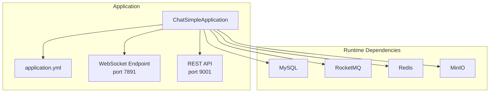
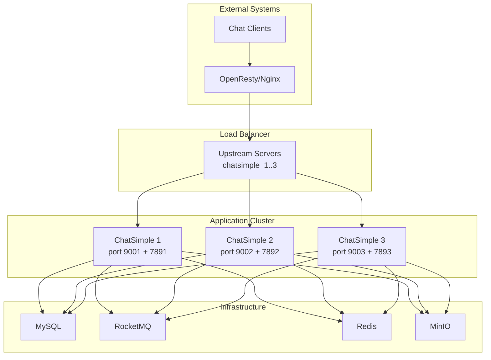
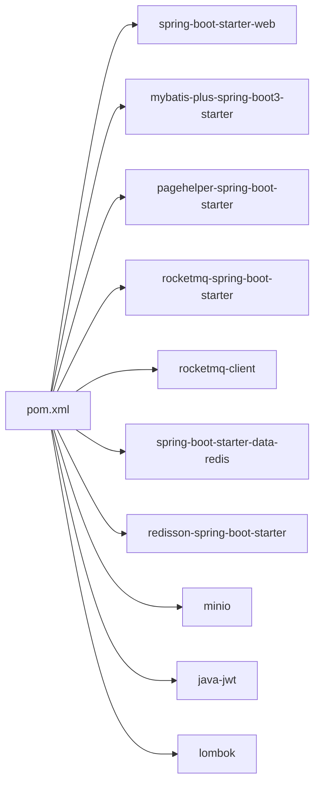

# Getting Started

<cite>
**Referenced Files in This Document**
- [pom.xml](file://pom.xml)
- [application.yml](file://src/main/resources/application.yml)
- [chat.sql](file://db/chat.sql)
- [docker-compose.yml](file://docker-compose.yml)
- [Dockerfile](file://Dockerfile)
- [nginx.conf](file://openresty_nginx_conf/nginx.conf)
- [ChatSimpleApplication.java](file://src/main/java/com/hch/chat_simple/ChatSimpleApplication.java)
- [MqProducerConfig.java](file://src/main/java/com/hch/chat_simple/mq/MqProducerConfig.java)
- [MinioConfig.java](file://src/main/java/com/hch/chat_simple/config/MinioConfig.java)
- [MinIOUtil.java](file://src/main/java/com/hch/chat_simple/util/MinIOUtil.java)
- [RedisUtil.java](file://src/main/java/com/hch/chat_simple/util/RedisUtil.java)
- [RedissonUtil.java](file://src/main/java/com/hch/chat_simple/util/RedissonUtil.java)
- [mvnw.cmd](file://mvnw.cmd)
- [maven-wrapper.properties](file://.mvn/wrapper/maven-wrapper.properties)
- [logback-spring.xml](file://src/main/resources/logback-spring.xml)
</cite>

## Table of Contents
1. [Introduction](#introduction)
2. [Project Structure](#project-structure)
3. [Core Components](#core-components)
4. [Architecture Overview](#architecture-overview)
5. [Detailed Component Analysis](#detailed-component-analysis)
6. [Dependency Analysis](#dependency-analysis)
7. [Performance Considerations](#performance-considerations)
8. [Troubleshooting Guide](#troubleshooting-guide)
9. [Conclusion](#conclusion)
10. [Appendices](#appendices)

## Introduction
This guide helps you install, configure, and run the Chat Simple project locally and in production. It covers prerequisites, environment setup, database initialization, configuration files, Docker deployment, and verification steps to ensure everything works as expected.

## Project Structure
The project is a Spring Boot application with integrated messaging, storage, caching, and real-time communication capabilities. Key runtime dependencies include MySQL, RocketMQ, Redis, and MinIO. The application exposes REST endpoints and a WebSocket endpoint for real-time chat.

**Diagram sources**
- [ChatSimpleApplication.java:18-22](file://src/main/java/com/hch/chat_simple/ChatSimpleApplication.java#L18-L22)
- [application.yml:16-20](file://src/main/resources/application.yml#L16-L20)
- [application.yml:39-44](file://src/main/resources/application.yml#L39-L44)
- [application.yml:4-6](file://src/main/resources/application.yml#L4-L6)
- [application.yml:84-89](file://src/main/resources/application.yml#L84-L89)
- [application.yml:74-75](file://src/main/resources/application.yml#L74-L75)
- [application.yml:77-78](file://src/main/resources/application.yml#L77-L78)

**Section sources**
- [ChatSimpleApplication.java:1-25](file://src/main/java/com/hch/chat_simple/ChatSimpleApplication.java#L1-L25)
- [application.yml:1-89](file://src/main/resources/application.yml#L1-L89)

## Core Components
- Application bootstrap and dialect registration
- Database connectivity and MyBatis-Plus configuration
- PageHelper dialect customization
- RocketMQ producer configuration
- Redis and Redisson integration
- MinIO client configuration and utilities
- Logging configuration for SQL and mapper packages

**Section sources**
- [ChatSimpleApplication.java:18-22](file://src/main/java/com/hch/chat_simple/ChatSimpleApplication.java#L18-L22)
- [application.yml:24-32](file://src/main/resources/application.yml#L24-L32)
- [application.yml:34-38](file://src/main/resources/application.yml#L34-L38)
- [MqProducerConfig.java:16-28](file://src/main/java/com/hch/chat_simple/mq/MqProducerConfig.java#L16-L28)
- [application.yml:4-6](file://src/main/resources/application.yml#L4-L6)
- [application.yml:54-69](file://src/main/resources/application.yml#L54-L69)
- [MinioConfig.java:12-31](file://src/main/java/com/hch/chat_simple/config/MinioConfig.java#L12-L31)
- [MinIOUtil.java:48-197](file://src/main/java/com/hch/chat_simple/util/MinIOUtil.java#L48-L197)
- [logback-spring.xml:12-18](file://src/main/resources/logback-spring.xml#L12-L18)

## Architecture Overview
The system integrates multiple subsystems:
- Database: MySQL with chat schema
- Messaging: RocketMQ for asynchronous message processing
- Caching: Redis for session and coordination
- Storage: MinIO for file uploads
- Web: Spring MVC REST API and WebSocket for real-time chat
- Load balancing: OpenResty/Nginx routing WebSocket connections

**Diagram sources**
- [docker-compose.yml:3-63](file://docker-compose.yml#L3-L63)
- [docker-compose.yml:64-132](file://docker-compose.yml#L64-L132)
- [nginx.conf:35-81](file://openresty_nginx_conf/nginx.conf#L35-L81)
- [application.yml:74-78](file://src/main/resources/application.yml#L74-L78)

## Detailed Component Analysis

### System Requirements
- Java: 17
- Build Tool: Maven (wrapper included)
- Database: MySQL 5.7
- Messaging: RocketMQ 5.x
- Caching: Redis
- Storage: MinIO
- Optional: OpenResty/Nginx for production load balancing

**Section sources**
- [pom.xml:30](file://pom.xml#L30)
- [maven-wrapper.properties:17-19](file://.mvn/wrapper/maven-wrapper.properties#L17-L19)
- [docker-compose.yml:64-96](file://docker-compose.yml#L64-L96)
- [docker-compose.yml:81-96](file://docker-compose.yml#L81-L96)
- [docker-compose.yml:73-80](file://docker-compose.yml#L73-L80)
- [docker-compose.yml:97-109](file://docker-compose.yml#L97-L109)

### Step-by-Step Installation

#### Local Development Setup
1. Prerequisites
   - Install Java 17
   - Install Maven
   - Install MySQL 5.7
   - Install Redis
   - Install RocketMQ 5.x
   - Install MinIO

2. Clone and build
   - Use the Maven wrapper to build the project:
     - Windows: [mvnw.cmd:1-150](file://mvnw.cmd#L1-L150)
     - Linux/macOS: use `./mvnw` after ensuring executable permission

3. Initialize the database
   - Run the schema script to create the chat database and tables:
     - [chat.sql:1-130](file://db/chat.sql#L1-L130)

4. Configure application.yml
   - Update database credentials and endpoints:
     - [application.yml:16-20](file://src/main/resources/application.yml#L16-L20)
   - Update Redis connection:
     - [application.yml:4-6](file://src/main/resources/application.yml#L4-L6)
   - Update RocketMQ name server:
     - [application.yml:39-44](file://src/main/resources/application.yml#L39-L44)
   - Update MinIO endpoint and credentials:
     - [application.yml:84-89](file://src/main/resources/application.yml#L84-L89)

5. Start dependencies
   - Launch MySQL, Redis, RocketMQ, and MinIO locally.

6. Run the application
   - Start the Spring Boot application:
     - [ChatSimpleApplication.java:18-22](file://src/main/java/com/hch/chat_simple/ChatSimpleApplication.java#L18-L22)
   - Default ports:
     - REST API: [application.yml:74-75](file://src/main/resources/application.yml#L74-L75)
     - WebSocket: [application.yml:77-78](file://src/main/resources/application.yml#L77-L78)

7. Verify
   - Access the API documentation via Knife4j (enabled in the application):
     - [ChatSimpleApplication.java:13](file://src/main/java/com/hch/chat_simple/ChatSimpleApplication.java#L13)
   - Confirm logging output for SQL and mapper activity:
     - [logback-spring.xml:12-18](file://src/main/resources/logback-spring.xml#L12-L18)

**Section sources**
- [mvnw.cmd:1-150](file://mvnw.cmd#L1-L150)
- [chat.sql:1-130](file://db/chat.sql#L1-L130)
- [application.yml:16-20](file://src/main/resources/application.yml#L16-L20)
- [application.yml:4-6](file://src/main/resources/application.yml#L4-L6)
- [application.yml:39-44](file://src/main/resources/application.yml#L39-L44)
- [application.yml:84-89](file://src/main/resources/application.yml#L84-L89)
- [application.yml:74-75](file://src/main/resources/application.yml#L74-L75)
- [application.yml:77-78](file://src/main/resources/application.yml#L77-L78)
- [ChatSimpleApplication.java:13-22](file://src/main/java/com/hch/chat_simple/ChatSimpleApplication.java#L13-L22)
- [logback-spring.xml:12-18](file://src/main/resources/logback-spring.xml#L12-L18)

### Docker Deployment

#### Single Node (Development)
- Build the application JAR using Maven wrapper
- Build the Docker image:
  - [Dockerfile:1-12](file://Dockerfile#L1-L12)
- Start all services with Docker Compose:
  - [docker-compose.yml:1-132](file://docker-compose.yml#L1-L132)

#### Multi-Node (Production)
- The compose file defines three ChatSimple instances behind OpenResty/Nginx:
  - [docker-compose.yml:3-63](file://docker-compose.yml#L3-L63)
- OpenResty routes WebSocket requests to the correct instance based on a hash of a user route header:
  - [nginx.conf:58-78](file://openresty_nginx_conf/nginx.conf#L58-L78)

#### Environment Variables
- Database connection:
  - [docker-compose.yml:19-20](file://docker-compose.yml#L19-L20)
- Redis host:
  - [docker-compose.yml:21](file://docker-compose.yml#L21)
- RocketMQ name server:
  - [docker-compose.yml:24](file://docker-compose.yml#L24)
- MinIO URL:
  - [docker-compose.yml:23](file://docker-compose.yml#L23)
- Tag selection per instance:
  - [docker-compose.yml:22](file://docker-compose.yml#L22)
  - [docker-compose.yml:39](file://docker-compose.yml#L39)
  - [docker-compose.yml:56](file://docker-compose.yml#L56)

**Section sources**
- [Dockerfile:1-12](file://Dockerfile#L1-L12)
- [docker-compose.yml:1-132](file://docker-compose.yml#L1-L132)
- [nginx.conf:58-78](file://openresty_nginx_conf/nginx.conf#L58-L78)

### Environment Configuration Using application.yml
Key configuration areas:
- Datasource (MySQL):
  - [application.yml:16-20](file://src/main/resources/application.yml#L16-L20)
- Redis:
  - [application.yml:4-6](file://src/main/resources/application.yml#L4-L6)
  - [application.yml:54-69](file://src/main/resources/application.yml#L54-L69)
- RocketMQ:
  - [application.yml:39-44](file://src/main/resources/application.yml#L39-L44)
  - Topics:
    - [application.yml:47-51](file://src/main/resources/application.yml#L47-L51)
- MinIO:
  - [application.yml:84-89](file://src/main/resources/application.yml#L84-L89)
- Server ports:
  - REST: [application.yml:74-75](file://src/main/resources/application.yml#L74-L75)
  - WebSocket: [application.yml:77-78](file://src/main/resources/application.yml#L77-L78)
- Tags for MQ routing:
  - [application.yml:79-82](file://src/main/resources/application.yml#L79-L82)

**Section sources**
- [application.yml:16-20](file://src/main/resources/application.yml#L16-L20)
- [application.yml:4-6](file://src/main/resources/application.yml#L4-L6)
- [application.yml:54-69](file://src/main/resources/application.yml#L54-L69)
- [application.yml:39-44](file://src/main/resources/application.yml#L39-L44)
- [application.yml:47-51](file://src/main/resources/application.yml#L47-L51)
- [application.yml:84-89](file://src/main/resources/application.yml#L84-L89)
- [application.yml:74-75](file://src/main/resources/application.yml#L74-L75)
- [application.yml:77-78](file://src/main/resources/application.yml#L77-L78)
- [application.yml:79-82](file://src/main/resources/application.yml#L79-L82)

### Initial Project Run Instructions
- Local run:
  - Start dependencies (MySQL, Redis, RocketMQ, MinIO)
  - Run the Spring Boot application:
    - [ChatSimpleApplication.java:18-22](file://src/main/java/com/hch/chat_simple/ChatSimpleApplication.java#L18-L22)
- Docker run:
  - Build image and start services:
    - [Dockerfile:1-12](file://Dockerfile#L1-L12)
    - [docker-compose.yml:1-132](file://docker-compose.yml#L1-L132)

**Section sources**
- [ChatSimpleApplication.java:18-22](file://src/main/java/com/hch/chat_simple/ChatSimpleApplication.java#L18-L22)
- [Dockerfile:1-12](file://Dockerfile#L1-L12)
- [docker-compose.yml:1-132](file://docker-compose.yml#L1-L132)

### Verification Steps
- REST API reachable:
  - Default port: [application.yml:74-75](file://src/main/resources/application.yml#L74-L75)
- WebSocket endpoint:
  - Port: [application.yml:77-78](file://src/main/resources/application.yml#L77-L78)
- Database connectivity:
  - Credentials and URL: [application.yml:16-20](file://src/main/resources/application.yml#L16-L20)
  - Schema: [chat.sql:1-130](file://db/chat.sql#L1-L130)
- RocketMQ producer:
  - Name server and groups configured in:
    - [application.yml:39-44](file://src/main/resources/application.yml#L39-L44)
    - [MqProducerConfig.java:16-28](file://src/main/java/com/hch/chat_simple/mq/MqProducerConfig.java#L16-L28)
- Redis operations:
  - Basic operations available via:
    - [RedisUtil.java:29-81](file://src/main/java/com/hch/chat_simple/util/RedisUtil.java#L29-L81)
    - [RedissonUtil.java:23-52](file://src/main/java/com/hch/chat_simple/util/RedissonUtil.java#L23-L52)
- MinIO file operations:
  - Upload, preview, download, list, remove:
    - [MinIOUtil.java:98-194](file://src/main/java/com/hch/chat_simple/util/MinIOUtil.java#L98-L194)
  - Client bean:
    - [MinioConfig.java:28-31](file://src/main/java/com/hch/chat_simple/config/MinioConfig.java#L28-L31)

**Section sources**
- [application.yml:74-75](file://src/main/resources/application.yml#L74-L75)
- [application.yml:77-78](file://src/main/resources/application.yml#L77-L78)
- [application.yml:16-20](file://src/main/resources/application.yml#L16-L20)
- [chat.sql:1-130](file://db/chat.sql#L1-L130)
- [application.yml:39-44](file://src/main/resources/application.yml#L39-L44)
- [MqProducerConfig.java:16-28](file://src/main/java/com/hch/chat_simple/mq/MqProducerConfig.java#L16-L28)
- [RedisUtil.java:29-81](file://src/main/java/com/hch/chat_simple/util/RedisUtil.java#L29-L81)
- [RedissonUtil.java:23-52](file://src/main/java/com/hch/chat_simple/util/RedissonUtil.java#L23-L52)
- [MinIOUtil.java:98-194](file://src/main/java/com/hch/chat_simple/util/MinIOUtil.java#L98-L194)
- [MinioConfig.java:28-31](file://src/main/java/com/hch/chat_simple/config/MinioConfig.java#L28-L31)

## Dependency Analysis
The application relies on Spring Boot starters and third-party libraries for persistence, messaging, caching, and file storage. The POM defines Java 17 and RocketMQ 5.x dependencies.

**Diagram sources**
- [pom.xml:54-315](file://pom.xml#L54-L315)

**Section sources**
- [pom.xml:29-315](file://pom.xml#L29-L315)

## Performance Considerations
- Enable SQL logging during development for debugging:
  - [logback-spring.xml:12-18](file://src/main/resources/logback-spring.xml#L12-L18)
- Tune Redis connection pool sizes and timeouts:
  - [application.yml:54-69](file://src/main/resources/application.yml#L54-L69)
- Use PageHelper for pagination:
  - [application.yml:34-38](file://src/main/resources/application.yml#L34-L38)
- RocketMQ producer and consumer groups should match configuration:
  - [application.yml:41-44](file://src/main/resources/application.yml#L41-L44)
  - [MqProducerConfig.java:16-28](file://src/main/java/com/hch/chat_simple/mq/MqProducerConfig.java#L16-L28)

[No sources needed since this section provides general guidance]

## Troubleshooting Guide
- Java version mismatch
  - Ensure Java 17 is installed and used by Maven:
    - [pom.xml:30](file://pom.xml#L30)
    - [maven-wrapper.properties:17-19](file://.mvn/wrapper/maven-wrapper.properties#L17-L19)
- Database connection fails
  - Verify MySQL credentials and URL:
    - [application.yml:16-20](file://src/main/resources/application.yml#L16-L20)
  - Confirm schema exists:
    - [chat.sql:1-130](file://db/chat.sql#L1-L130)
- RocketMQ not reachable
  - Check name server address:
    - [application.yml:39-44](file://src/main/resources/application.yml#L39-L44)
  - Producer bean creation:
    - [MqProducerConfig.java:22-28](file://src/main/java/com/hch/chat_simple/mq/MqProducerConfig.java#L22-L28)
- Redis connectivity issues
  - Validate host/port and pool settings:
    - [application.yml:4-6](file://src/main/resources/application.yml#L4-L6)
    - [application.yml:54-69](file://src/main/resources/application.yml#L54-L69)
- MinIO errors
  - Confirm endpoint and credentials:
    - [application.yml:84-89](file://src/main/resources/application.yml#L84-L89)
  - Use MinIOUtil for operations:
    - [MinIOUtil.java:98-194](file://src/main/java/com/hch/chat_simple/util/MinIOUtil.java#L98-L194)
- WebSocket routing in production
  - Ensure OpenResty routes WebSocket upgrades:
    - [nginx.conf:53-81](file://openresty_nginx_conf/nginx.conf#L53-L81)

**Section sources**
- [pom.xml:30](file://pom.xml#L30)
- [maven-wrapper.properties:17-19](file://.mvn/wrapper/maven-wrapper.properties#L17-L19)
- [application.yml:16-20](file://src/main/resources/application.yml#L16-L20)
- [chat.sql:1-130](file://db/chat.sql#L1-L130)
- [application.yml:39-44](file://src/main/resources/application.yml#L39-L44)
- [MqProducerConfig.java:22-28](file://src/main/java/com/hch/chat_simple/mq/MqProducerConfig.java#L22-L28)
- [application.yml:4-6](file://src/main/resources/application.yml#L4-L6)
- [application.yml:54-69](file://src/main/resources/application.yml#L54-L69)
- [application.yml:84-89](file://src/main/resources/application.yml#L84-L89)
- [MinIOUtil.java:98-194](file://src/main/java/com/hch/chat_simple/util/MinIOUtil.java#L98-L194)
- [nginx.conf:53-81](file://openresty_nginx_conf/nginx.conf#L53-L81)

## Conclusion
You now have the essentials to install, configure, and run Chat Simple locally and in production. Start with the prerequisites, initialize the database, adjust application.yml, and bring up dependencies. Use Docker Compose for multi-node deployments and OpenResty for WebSocket routing. Verify connectivity and functionality using the ports and endpoints documented above.

[No sources needed since this section summarizes without analyzing specific files]

## Appendices

### Appendix A: Ports and Endpoints
- REST API: [application.yml:74-75](file://src/main/resources/application.yml#L74-L75)
- WebSocket: [application.yml:77-78](file://src/main/resources/application.yml#L77-L78)
- RocketMQ name server: [application.yml:39-44](file://src/main/resources/application.yml#L39-L44)
- MinIO: [application.yml:84-89](file://src/main/resources/application.yml#L84-L89)
- Redis: [application.yml:4-6](file://src/main/resources/application.yml#L4-L6)

**Section sources**
- [application.yml:74-75](file://src/main/resources/application.yml#L74-L75)
- [application.yml:77-78](file://src/main/resources/application.yml#L77-L78)
- [application.yml:39-44](file://src/main/resources/application.yml#L39-L44)
- [application.yml:84-89](file://src/main/resources/application.yml#L84-L89)
- [application.yml:4-6](file://src/main/resources/application.yml#L4-L6)