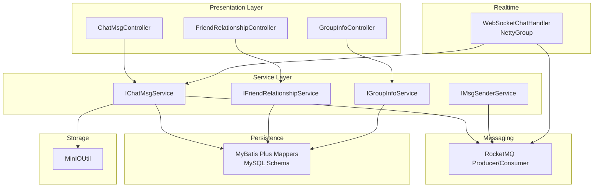
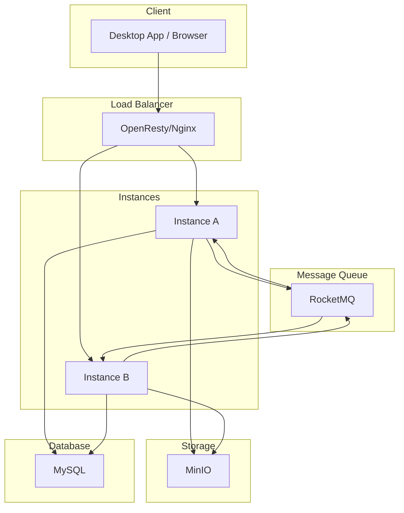
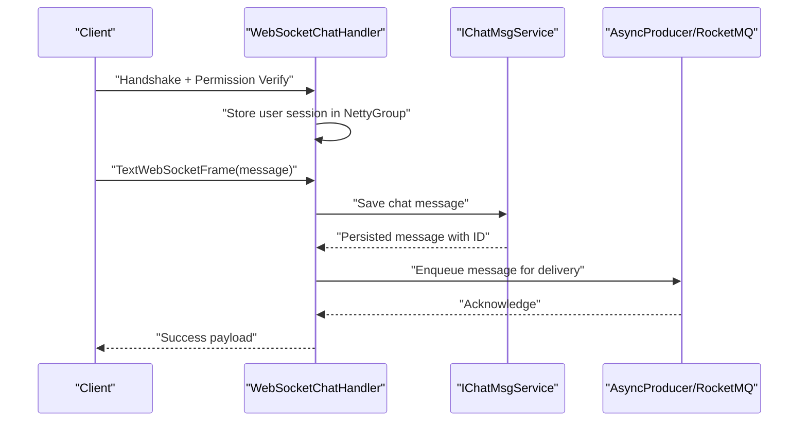
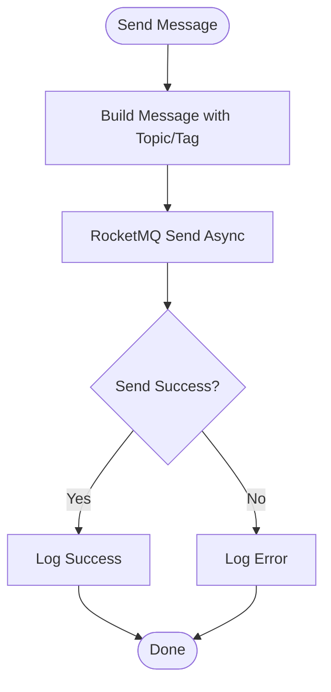
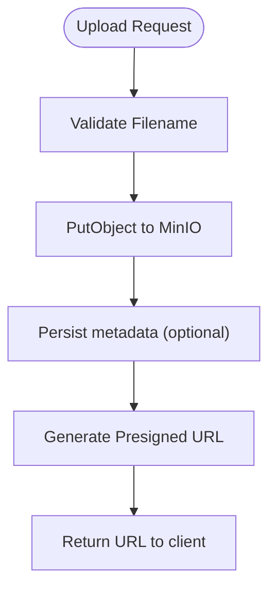
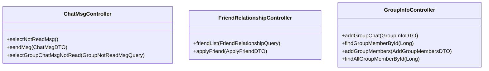
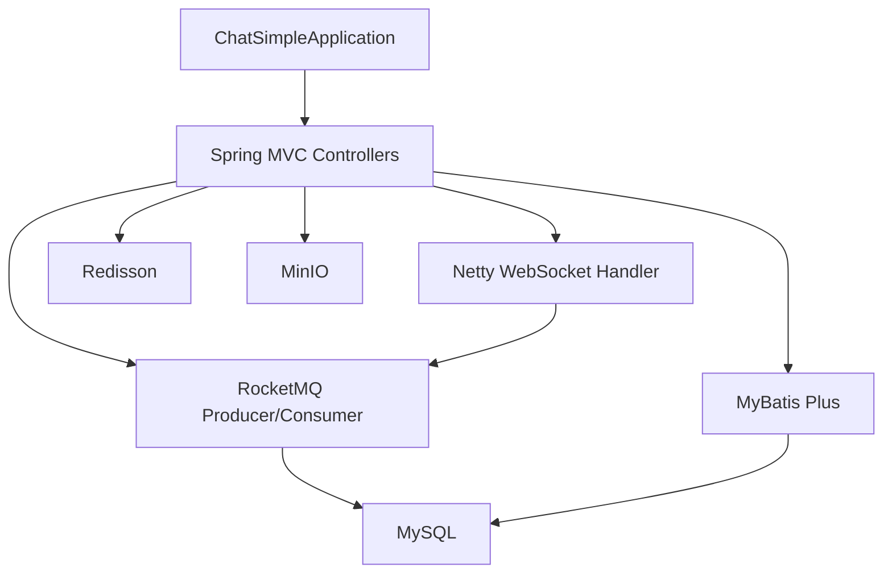

# Project Overview

<cite>
**Referenced Files in This Document**
- [ChatSimpleApplication.java](file://src/main/java/com/hch/chat_simple/ChatSimpleApplication.java)
- [pom.xml](file://pom.xml)
- [application.yml](file://src/main/resources/application.yml)
- [chat.sql](file://db/chat.sql)
- [README.md](file://README.md)
- [WebSocketChatHandler.java](file://src/main/java/com/hch/chat_simple/handler/WebSocketChatHandler.java)
- [NettyGroup.java](file://src/main/java/com/hch/chat_simple/config/NettyGroup.java)
- [AsyncProducer.java](file://src/main/java/com/hch/chat_simple/mq/AsyncProducer.java)
- [MinIOUtil.java](file://src/main/java/com/hch/chat_simple/util/MinIOUtil.java)
- [ChatMsgController.java](file://src/main/java/com/hch/chat_simple/controller/ChatMsgController.java)
- [FriendRelationshipController.java](file://src/main/java/com/hch/chat_simple/controller/FriendRelationshipController.java)
- [GroupInfoController.java](file://src/main/java/com/hch/chat_simple/controller/GroupInfoController.java)
- [MsgTypeEnum.java](file://src/main/java/com/hch/chat_simple/enums/MsgTypeEnum.java)
- [ApplyStatusEnum.java](file://src/main/java/com/hch/chat_simple/enums/ApplyStatusEnum.java)
</cite>

## Table of Contents
1. [Introduction](#introduction)
2. [Project Structure](#project-structure)
3. [Core Components](#core-components)
4. [Architecture Overview](#architecture-overview)
5. [Detailed Component Analysis](#detailed-component-analysis)
6. [Dependency Analysis](#dependency-analysis)
7. [Performance Considerations](#performance-considerations)
8. [Troubleshooting Guide](#troubleshooting-guide)
9. [Conclusion](#conclusion)
10. [Appendices](#appendices)

## Introduction
Chat Simple is a real-time messaging application designed for single chat, group chat, friend management, and file sharing. Built with Spring Boot 3.3.6 and Java 17, it leverages Netty for WebSocket-based real-time communication, RocketMQ for asynchronous message processing, MyBatis Plus for data persistence, Redisson for distributed coordination, and MinIO for object storage. The system supports horizontal scaling across multiple instances, routing messages precisely to target users via a combination of session affinity and message queue tagging.

Key capabilities demonstrated by the codebase:
- Real-time messaging via WebSocket using Netty
- Single chat and group chat with message persistence and retrieval
- Friend relationship management and friend application workflows
- File upload, preview, and download through MinIO
- Asynchronous message delivery and consumption using RocketMQ
- Distributed deployment considerations with instance tagging and message routing

Practical examples of capabilities:
- Sending a chat message triggers message persistence and asynchronous dispatch to the recipient’s instance
- Adding a group chat and inviting members persists membership and enables broadcast messaging
- Uploading a file stores it in MinIO and returns a presigned URL for immediate access
- Pulling unread messages after login retrieves pending single and group chat notifications

**Section sources**
- [README.md:1-87](file://README.md#L1-L87)
- [pom.xml:29-346](file://pom.xml#L29-L346)
- [application.yml:1-89](file://application.yml#L1-L89)

## Project Structure
The project follows a layered architecture:
- Application bootstrap and configuration
- Controllers exposing REST endpoints for chat, friends, groups, and uploads
- Handlers for WebSocket communication and session management
- Services implementing business logic for chat, friends, groups, and message sending
- Message queue producers/consumers for asynchronous processing
- Utilities for MinIO, Redisson, JWT, and ID generation
- Data access via MyBatis Plus mappers and XML mappings
- Database schema for users, friendships, chat messages, groups, and members

**Diagram sources**
- [ChatMsgController.java:31-57](file://src/main/java/com/hch/chat_simple/controller/ChatMsgController.java#L31-L57)
- [FriendRelationshipController.java:28-48](file://src/main/java/com/hch/chat_simple/controller/FriendRelationshipController.java#L28-L48)
- [GroupInfoController.java:30-67](file://src/main/java/com/hch/chat_simple/controller/GroupInfoController.java#L30-L67)
- [WebSocketChatHandler.java:50-196](file://src/main/java/com/hch/chat_simple/handler/WebSocketChatHandler.java#L50-L196)
- [NettyGroup.java:11-29](file://src/main/java/com/hch/chat_simple/config/NettyGroup.java#L11-L29)
- [AsyncProducer.java:17-62](file://src/main/java/com/hch/chat_simple/mq/AsyncProducer.java#L17-L62)
- [MinIOUtil.java:48-198](file://src/main/java/com/hch/chat_simple/util/MinIOUtil.java#L48-L198)
- [chat.sql:5-130](file://db/chat.sql#L5-L130)

**Section sources**
- [ChatSimpleApplication.java:16-24](file://src/main/java/com/hch/chat_simple/ChatSimpleApplication.java#L16-L24)
- [pom.xml:34-326](file://pom.xml#L34-L326)
- [application.yml:1-89](file://application.yml#L1-L89)

## Core Components
- WebSocket and session management: Handles handshake, permission verification, user session registration, idle detection, and cleanup
- Message persistence and sending: Saves chat messages, assigns IDs, and enqueues asynchronous delivery via RocketMQ
- Friend management: Provides endpoints for friend lists and friend application workflows
- Group management: Supports creation, member addition, and member listing for groups
- File storage: Integrates MinIO for bucket operations, uploads, previews, downloads, and listing
- Configuration: Centralized application settings for databases, RocketMQ, Redisson, MinIO, and server ports

Example capabilities:
- Single chat sends a message, persists it, and enqueues RocketMQ for targeted delivery
- Group chat broadcasts messages across instances using RocketMQ tags
- File upload returns a presigned URL for immediate access

**Section sources**
- [WebSocketChatHandler.java:72-109](file://src/main/java/com/hch/chat_simple/handler/WebSocketChatHandler.java#L72-L109)
- [ChatMsgController.java:39-55](file://src/main/java/com/hch/chat_simple/controller/ChatMsgController.java#L39-L55)
- [FriendRelationshipController.java:37-47](file://src/main/java/com/hch/chat_simple/controller/FriendRelationshipController.java#L37-L47)
- [GroupInfoController.java:39-66](file://src/main/java/com/hch/chat_simple/controller/GroupInfoController.java#L39-L66)
- [MinIOUtil.java:98-140](file://src/main/java/com/hch/chat_simple/util/MinIOUtil.java#L98-L140)

## Architecture Overview
The system employs a layered architecture with clear separation of concerns:
- Presentation: REST controllers expose chat, friend, group, and file operations
- Service: Business logic orchestrates persistence, message routing, and external integrations
- Messaging: RocketMQ decouples real-time delivery from immediate processing
- Realtime: Netty manages WebSocket sessions and routes messages to connected clients
- Persistence: MySQL stores user, friendship, chat, group, and member data
- Storage: MinIO handles file objects and provides presigned URLs

Scalability and distribution:
- Horizontal scaling across multiple instances is supported
- Session affinity ensures a user connects to the same instance consistently
- RocketMQ tags route messages to the correct instance based on the receiver’s instance assignment
- Consumers subscribe per tag to ensure precise delivery

**Diagram sources**
- [README.md:23-43](file://README.md#L23-L43)
- [application.yml:40-51](file://application.yml#L40-L51)
- [application.yml:84-89](file://application.yml#L84-L89)
- [application.yml:16-20](file://application.yml#L16-L20)

## Detailed Component Analysis

### WebSocket Communication
WebSocketChatHandler manages:
- Handshake completion and permission verification using tokens
- Registration of user channels for targeted delivery
- Idle state detection and cleanup of stale sessions
- Message parsing, persistence, and asynchronous dispatch

**Diagram sources**
- [WebSocketChatHandler.java:119-163](file://src/main/java/com/hch/chat_simple/handler/WebSocketChatHandler.java#L119-L163)
- [WebSocketChatHandler.java:88-105](file://src/main/java/com/hch/chat_simple/handler/WebSocketChatHandler.java#L88-L105)
- [AsyncProducer.java:40-59](file://src/main/java/com/hch/chat_simple/mq/AsyncProducer.java#L40-L59)

**Section sources**
- [WebSocketChatHandler.java:50-196](file://src/main/java/com/hch/chat_simple/handler/WebSocketChatHandler.java#L50-L196)
- [NettyGroup.java:11-29](file://src/main/java/com/hch/chat_simple/config/NettyGroup.java#L11-L29)

### Message Queue Processing
AsyncProducer encapsulates RocketMQ producer operations:
- Sends messages with topic and tag for precise routing
- Uses callbacks for success/error logging
- Supports single-chat and multi-chat topics configured in application settings

**Diagram sources**
- [AsyncProducer.java:40-59](file://src/main/java/com/hch/chat_simple/mq/AsyncProducer.java#L40-L59)
- [application.yml:48-51](file://application.yml#L48-L51)

**Section sources**
- [AsyncProducer.java:17-62](file://src/main/java/com/hch/chat_simple/mq/AsyncProducer.java#L17-L62)
- [application.yml:39-51](file://application.yml#L39-L51)

### File Sharing with MinIO
MinIOUtil provides:
- Bucket existence checks and creation
- File upload with date-based folder structure
- Presigned URL generation for preview/download
- Listing and removal of objects

**Diagram sources**
- [MinIOUtil.java:98-140](file://src/main/java/com/hch/chat_simple/util/MinIOUtil.java#L98-L140)
- [application.yml:84-89](file://application.yml#L84-L89)

**Section sources**
- [MinIOUtil.java:48-198](file://src/main/java/com/hch/chat_simple/util/MinIOUtil.java#L48-L198)
- [application.yml:84-89](file://application.yml#L84-L89)

### API Capabilities
Controllers expose the following capabilities:
- Chat message operations: send, pull unread single chat, pull unread group chat
- Friend management: list friends, apply for friendship
- Group management: create group, add members, list members

**Diagram sources**
- [ChatMsgController.java:31-57](file://src/main/java/com/hch/chat_simple/controller/ChatMsgController.java#L31-L57)
- [FriendRelationshipController.java:28-48](file://src/main/java/com/hch/chat_simple/controller/FriendRelationshipController.java#L28-L48)
- [GroupInfoController.java:30-67](file://src/main/java/com/hch/chat_simple/controller/GroupInfoController.java#L30-L67)

**Section sources**
- [ChatMsgController.java:39-55](file://src/main/java/com/hch/chat_simple/controller/ChatMsgController.java#L39-L55)
- [FriendRelationshipController.java:37-47](file://src/main/java/com/hch/chat_simple/controller/FriendRelationshipController.java#L37-L47)
- [GroupInfoController.java:39-66](file://src/main/java/com/hch/chat_simple/controller/GroupInfoController.java#L39-L66)

## Dependency Analysis
Technology stack and module relationships:
- Spring Boot 3.3.6 provides the application framework and web MVC
- Netty powers WebSocket transport and session management
- RocketMQ handles asynchronous messaging and inter-instance routing
- MyBatis Plus manages database access and SQL mapping
- Redisson integrates with Redis for distributed coordination
- MinIO provides object storage for file sharing
- MySQL stores application data

**Diagram sources**
- [ChatSimpleApplication.java:16-24](file://src/main/java/com/hch/chat_simple/ChatSimpleApplication.java#L16-L24)
- [WebSocketChatHandler.java:50-196](file://src/main/java/com/hch/chat_simple/handler/WebSocketChatHandler.java#L50-L196)
- [AsyncProducer.java:17-62](file://src/main/java/com/hch/chat_simple/mq/AsyncProducer.java#L17-L62)
- [MinIOUtil.java:48-198](file://src/main/java/com/hch/chat_simple/util/MinIOUtil.java#L48-L198)
- [application.yml:16-20](file://application.yml#L16-L20)
- [application.yml:54-69](file://application.yml#L54-L69)
- [application.yml:84-89](file://application.yml#L84-L89)

**Section sources**
- [pom.xml:34-326](file://pom.xml#L34-L326)
- [application.yml:1-89](file://application.yml#L1-L89)

## Performance Considerations
- WebSocket scaling: Netty’s ChannelGroup and user-to-channel mapping enable efficient broadcasting and targeted delivery
- Asynchronous processing: RocketMQ decouples message production from consumption, improving throughput and resilience
- Database efficiency: MyBatis Plus with logical delete and paginated queries reduces overhead
- Storage performance: MinIO’s presigned URLs offload bandwidth from the application server
- Horizontal scaling: Instance tagging and RocketMQ topic/tag routing ensure predictable message delivery across nodes

[No sources needed since this section provides general guidance]

## Troubleshooting Guide
Common areas to check:
- WebSocket handshake failures: Verify token validity and session attributes stored during handshake
- Message delivery issues: Confirm RocketMQ topic and tag configuration match consumer subscriptions
- File upload errors: Ensure MinIO bucket exists and credentials are correct; validate presigned URL generation
- Database connectivity: Confirm JDBC URL, credentials, and driver settings in application configuration
- Redisson configuration: Validate connection pool sizes and timeouts for distributed locks and pub/sub

**Section sources**
- [WebSocketChatHandler.java:120-136](file://src/main/java/com/hch/chat_simple/handler/WebSocketChatHandler.java#L120-L136)
- [AsyncProducer.java:44-58](file://src/main/java/com/hch/chat_simple/mq/AsyncProducer.java#L44-L58)
- [MinIOUtil.java:56-67](file://src/main/java/com/hch/chat_simple/util/MinIOUtil.java#L56-L67)
- [application.yml:16-20](file://application.yml#L16-L20)
- [application.yml:54-69](file://application.yml#L54-L69)
- [application.yml:84-89](file://application.yml#L84-L89)

## Conclusion
Chat Simple delivers a robust, scalable real-time messaging platform with clear separation of concerns and modern infrastructure choices. Its layered design, combined with Netty for real-time communication, RocketMQ for asynchronous processing, and MinIO for file storage, provides a solid foundation for single chat, group chat, friend management, and file sharing. The documented deployment and routing strategies support horizontal scaling and precise message delivery across multiple instances.

[No sources needed since this section summarizes without analyzing specific files]

## Appendices

### System Requirements and Prerequisites
- Java 17 and Maven for building
- MySQL for relational data
- Redis for caching and distributed coordination
- RocketMQ for asynchronous messaging
- MinIO for object storage
- OpenResty/Nginx for load balancing and WebSocket proxying

Deployment steps:
- Build the project and container image
- Configure OpenResty/Nginx for WebSocket proxying
- Start services with docker-compose
- Initialize the database schema

**Section sources**
- [README.md:55-64](file://README.md#L55-L64)
- [application.yml:16-20](file://application.yml#L16-L20)
- [application.yml:54-69](file://application.yml#L54-L69)
- [application.yml:84-89](file://application.yml#L84-L89)

### Database Schema Highlights
- Users, friendships, chat messages, groups, and group members are modeled with clear relationships
- Logical delete fields and timestamps support auditability and soft-deletion semantics
- Message types and content types enable extensibility for future enhancements

**Section sources**
- [chat.sql:5-130](file://db/chat.sql#L5-L130)