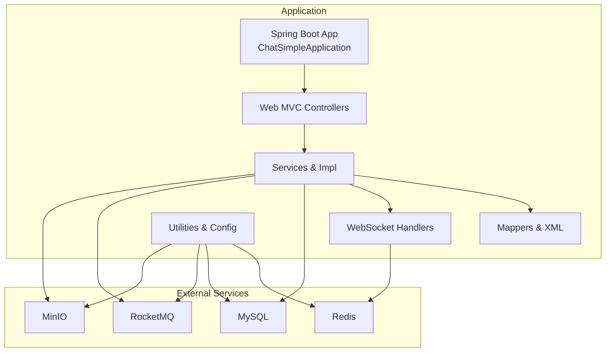
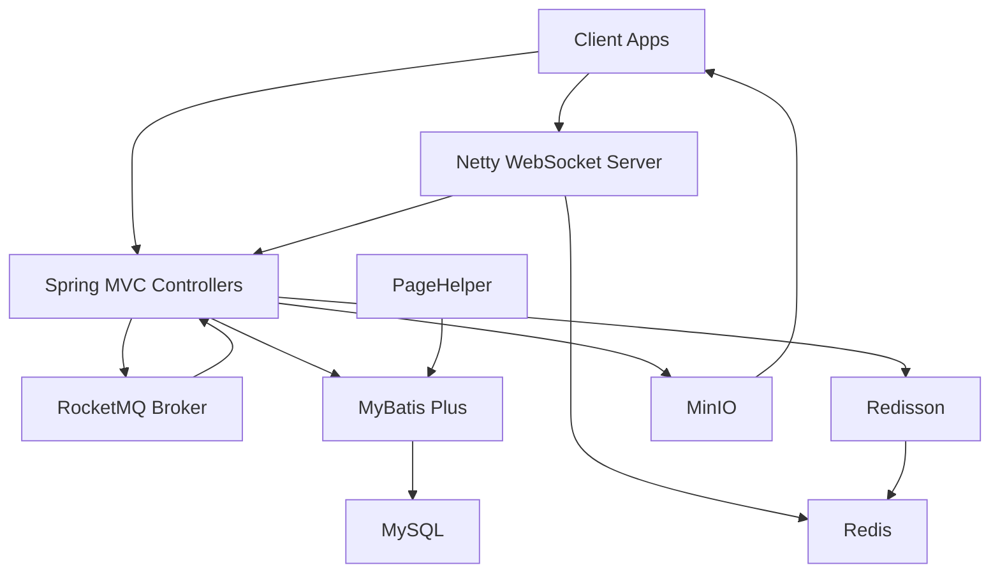
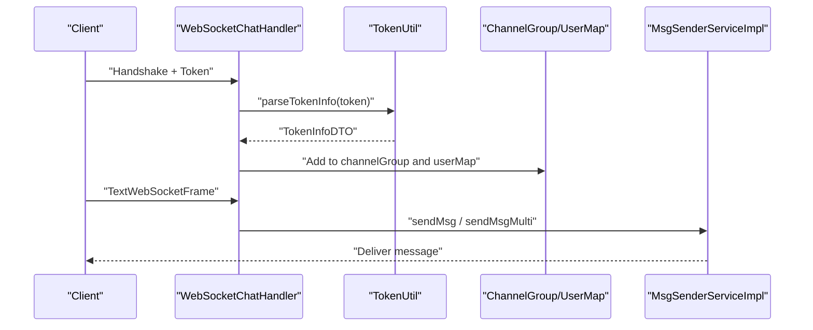
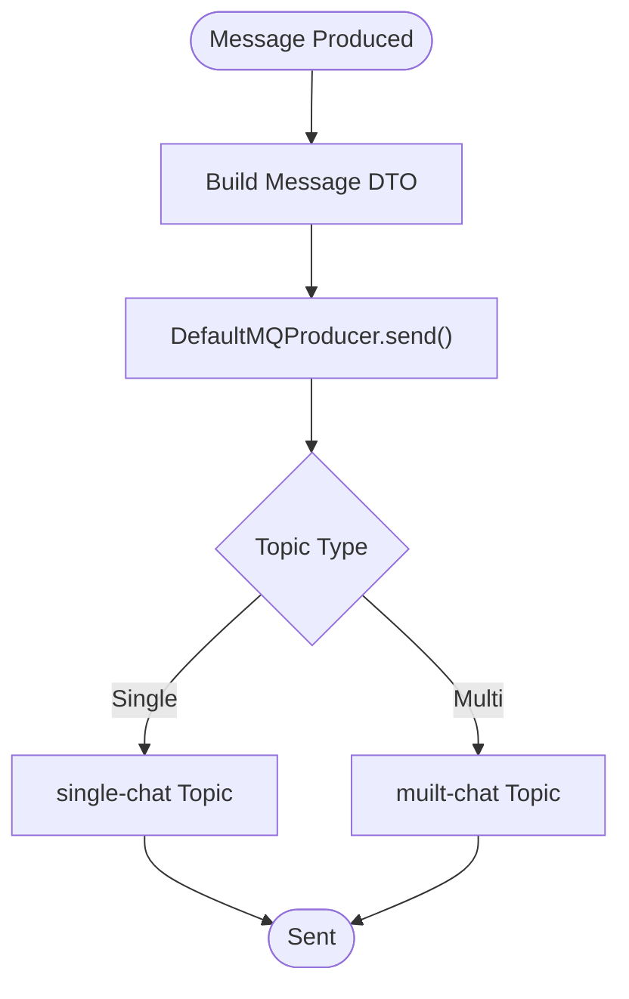
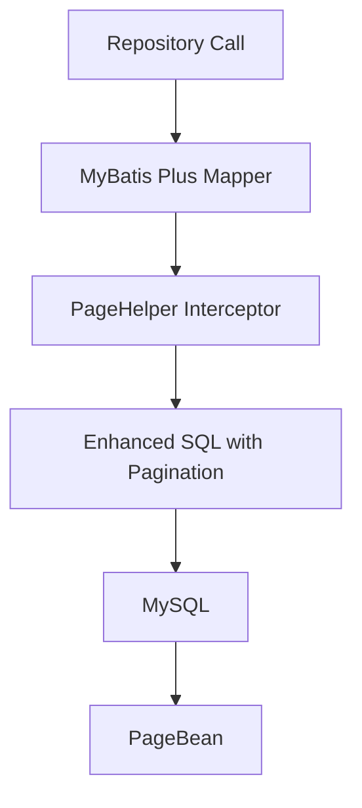
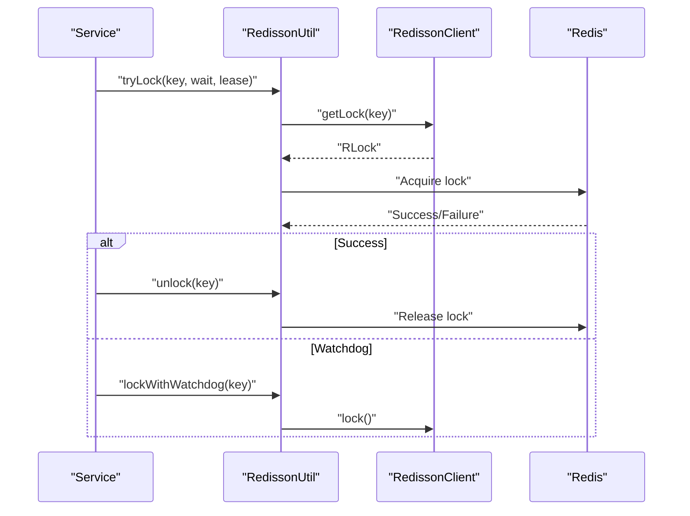
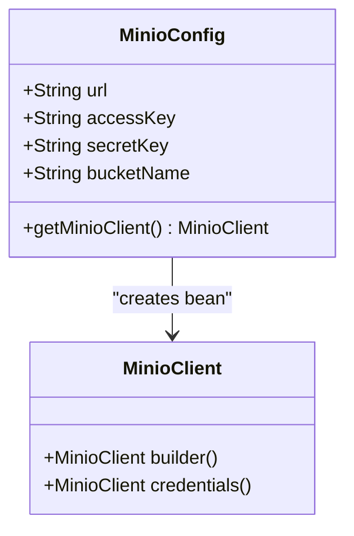
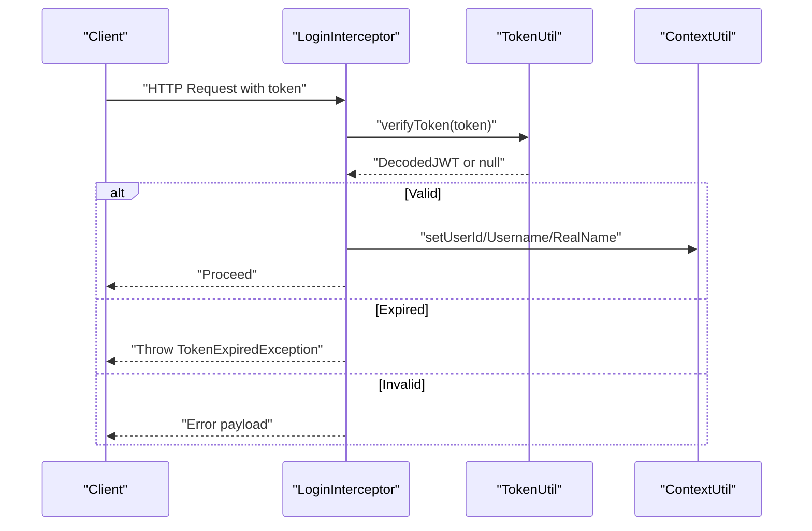
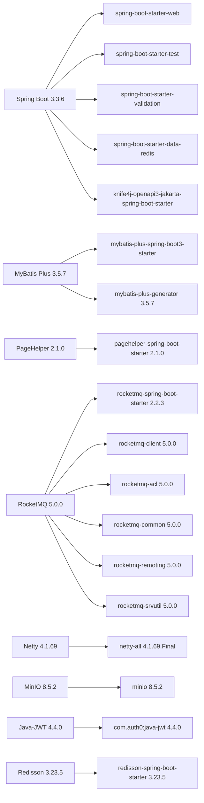

# Technology Stack

<cite>
**Referenced Files in This Document**
- [pom.xml](file://pom.xml)
- [application.yml](file://src/main/resources/application.yml)
- [ChatSimpleApplication.java](file://src/main/java/com/hch/chat_simple/ChatSimpleApplication.java)
- [docker-compose.yml](file://docker-compose.yml)
- [Dockerfile](file://Dockerfile)
- [NettyGroup.java](file://src/main/java/com/hch/chat_simple/config/NettyGroup.java)
- [MinioConfig.java](file://src/main/java/com/hch/chat_simple/config/MinioConfig.java)
- [RedissonUtil.java](file://src/main/java/com/hch/chat_simple/util/RedissonUtil.java)
- [TokenUtil.java](file://src/main/java/com/hch/chat_simple/util/TokenUtil.java)
- [MqProducerConfig.java](file://src/main/java/com/hch/chat_simple/mq/MqProducerConfig.java)
- [PageBean.java](file://src/main/java/com/hch/chat_simple/util/PageBean.java)
- [WebSocketChatHandler.java](file://src/main/java/com/hch/chat_simple/handler/WebSocketChatHandler.java)
- [MsgSenderServiceImpl.java](file://src/main/java/com/hch/chat_simple/service/impl/MsgSenderServiceImpl.java)
- [LoginInterceptor.java](file://src/main/java/com/hch/chat_simple/config/LoginInterceptor.java)
</cite>

## Table of Contents
1. [Introduction](#introduction)
2. [Project Structure](#project-structure)
3. [Core Components](#core-components)
4. [Architecture Overview](#architecture-overview)
5. [Detailed Component Analysis](#detailed-component-analysis)
6. [Dependency Analysis](#dependency-analysis)
7. [Performance Considerations](#performance-considerations)
8. [Troubleshooting Guide](#troubleshooting-guide)
9. [Conclusion](#conclusion)

## Introduction
This document provides a comprehensive technology stack overview for the Chat Simple project. It explains the selected frameworks and libraries, their roles, version choices, compatibility requirements, and integration patterns. The stack centers around Spring Boot 3.3.6 for application foundation, Netty 4.1.69 for high-performance WebSocket server, RocketMQ 5.0.0 for asynchronous messaging, MyBatis Plus 3.5.7 for ORM enhancements, Redisson 3.23.5 for distributed coordination, PageHelper 2.1.0 for pagination, MinIO 8.5.2 for object storage, and Java-JWT 4.4.0 for authentication. External service requirements are also documented, along with deployment via Docker Compose.

## Project Structure
The project follows a conventional Spring Boot layout with layered packages for configuration, controllers, services, mappers, handlers, utilities, and MQ components. Dependencies are managed via Maven, and runtime configuration is driven by application YAML. Docker Compose orchestrates the application and its external dependencies (MySQL, Redis, RocketMQ, MinIO).

**Diagram sources**
- [ChatSimpleApplication.java:16-22](file://src/main/java/com/hch/chat_simple/ChatSimpleApplication.java#L16-L22)
- [application.yml:16-20](file://src/main/resources/application.yml#L16-L20)
- [application.yml:4,5,6,7,8,9,10,11,12,13:4-13](file://src/main/resources/application.yml#L4-L13)
- [docker-compose.yml:64-72](file://docker-compose.yml#L64-L72)
- [docker-compose.yml:73-80](file://docker-compose.yml#L73-L80)
- [docker-compose.yml:81-96](file://docker-compose.yml#L81-L96)
- [docker-compose.yml:97-115](file://docker-compose.yml#L97-L115)

**Section sources**
- [ChatSimpleApplication.java:16-22](file://src/main/java/com/hch/chat_simple/ChatSimpleApplication.java#L16-L22)
- [application.yml:1-89](file://src/main/resources/application.yml#L1-L89)
- [docker-compose.yml:1-132](file://docker-compose.yml#L1-L132)

## Core Components
- Spring Boot 3.3.6: Application foundation and auto-configuration.
- Netty 4.1.69: WebSocket server for real-time messaging.
- RocketMQ 5.0.0: Asynchronous messaging and decoupling.
- MyBatis Plus 3.5.7: Enhanced ORM with code generation and logical deletion.
- Redisson 3.23.5: Distributed primitives and coordination atop Redis.
- PageHelper 2.1.0: Pagination support for MyBatis.
- MinIO 8.5.2: S3-compatible object storage for media.
- JWT (Java-JWT 4.4.0): Authentication and authorization via signed tokens.

**Section sources**
- [pom.xml:54-125](file://pom.xml#L54-L125)
- [pom.xml:127-153](file://pom.xml#L127-L153)
- [pom.xml:155-173](file://pom.xml#L155-L173)
- [pom.xml:294-297](file://pom.xml#L294-L297)
- [pom.xml:312-315](file://pom.xml#L312-L315)
- [application.yml:34-38](file://src/main/resources/application.yml#L34-L38)
- [application.yml:4-13](file://src/main/resources/application.yml#L4-L13)
- [application.yml:49-52](file://src/main/resources/application.yml#L49-L52)
- [application.yml:84-89](file://src/main/resources/application.yml#L84-L89)

## Architecture Overview
The system integrates REST APIs, WebSocket messaging, asynchronous messaging, persistence, caching/distributed coordination, and object storage. Spring MVC handles HTTP requests, while Netty manages WebSocket connections. RocketMQ decouples long-running tasks. Redisson provides distributed locks. MyBatis Plus and PageHelper handle persistence and pagination. MinIO stores files. JWT secures HTTP endpoints.

**Diagram sources**
- [WebSocketChatHandler.java:50-196](file://src/main/java/com/hch/chat_simple/handler/WebSocketChatHandler.java#L50-L196)
- [MqProducerConfig.java:22-28](file://src/main/java/com/hch/chat_simple/mq/MqProducerConfig.java#L22-L28)
- [RedissonUtil.java:11-52](file://src/main/java/com/hch/chat_simple/util/RedissonUtil.java#L11-L52)
- [MinioConfig.java:28-31](file://src/main/java/com/hch/chat_simple/config/MinioConfig.java#L28-L31)
- [application.yml:16-20](file://src/main/resources/application.yml#L16-L20)
- [application.yml:4-L13](://src/main/resources/application.yml#L4-L13)

## Detailed Component Analysis

### Spring Boot Foundation and Auto-Configuration
- Spring Boot 3.3.6 provides the application base, including web starters, validation, devtools, and test support.
- Knife4j OpenAPI integration is enabled for API documentation.
- MyBatis auto-dialect registration is performed programmatically during application startup.

**Section sources**
- [pom.xml:54-72](file://pom.xml#L54-L72)
- [ChatSimpleApplication.java:9-22](file://src/main/java/com/hch/chat_simple/ChatSimpleApplication.java#L9-L22)

### Netty WebSocket Server
- Netty 4.1.69 powers the WebSocket server for real-time messaging.
- A shared channel group and user-to-channel mapping are maintained globally.
- WebSocketChatHandler authenticates sessions via JWT and manages online presence.
- MsgSenderServiceImpl broadcasts messages to connected clients.

**Diagram sources**
- [WebSocketChatHandler.java:119-163](file://src/main/java/com/hch/chat_simple/handler/WebSocketChatHandler.java#L119-L163)
- [TokenUtil.java:61-69](file://src/main/java/com/hch/chat_simple/util/TokenUtil.java#L61-L69)
- [NettyGroup.java:11-26](file://src/main/java/com/hch/chat_simple/config/NettyGroup.java#L11-L26)
- [MsgSenderServiceImpl.java:25-79](file://src/main/java/com/hch/chat_simple/service/impl/MsgSenderServiceImpl.java#L25-L79)

**Section sources**
- [pom.xml:294-297](file://pom.xml#L294-L297)
- [NettyGroup.java:11-26](file://src/main/java/com/hch/chat_simple/config/NettyGroup.java#L11-L26)
- [WebSocketChatHandler.java:50-196](file://src/main/java/com/hch/chat_simple/handler/WebSocketChatHandler.java#L50-L196)
- [MsgSenderServiceImpl.java:25-79](file://src/main/java/com/hch/chat_simple/service/impl/MsgSenderServiceImpl.java#L25-L79)

### RocketMQ Messaging
- RocketMQ 5.0.0 is integrated via rocketmq-spring-boot-starter and explicit client/acl/common/remoting/srvutil dependencies.
- Producer bean is configured with name server and producer group from application YAML.
- Topics for single and multi-chat are defined in configuration.

**Diagram sources**
- [MqProducerConfig.java:22-28](file://src/main/java/com/hch/chat_simple/mq/MqProducerConfig.java#L22-L28)
- [application.yml:49-51](file://src/main/resources/application.yml#L49-L51)

**Section sources**
- [pom.xml:74-125](file://pom.xml#L74-L125)
- [MqProducerConfig.java:1-31](file://src/main/java/com/hch/chat_simple/mq/MqProducerConfig.java#L1-L31)
- [application.yml:39-52](file://src/main/resources/application.yml#L39-L52)

### MyBatis Plus and Pagination
- MyBatis Plus 3.5.7 enhances ORM with automatic SQL generation, logical deletion, and code generation.
- PageHelper 2.1.0 provides pagination with MySQL dialect configuration.
- Application registers a custom SQL dialect alias for MyBatis.

**Diagram sources**
- [ChatSimpleApplication.java:20-20](file://src/main/java/com/hch/chat_simple/ChatSimpleApplication.java#L20-L20)
- [application.yml:24-38](file://src/main/resources/application.yml#L24-L38)
- [PageBean.java:8-20](file://src/main/java/com/hch/chat_simple/util/PageBean.java#L8-L20)

**Section sources**
- [pom.xml:176-204](file://pom.xml#L176-L204)
- [pom.xml:155-173](file://pom.xml#L155-L173)
- [ChatSimpleApplication.java:20-20](file://src/main/java/com/hch/chat_simple/ChatSimpleApplication.java#L20-L20)
- [application.yml:24-38](file://src/main/resources/application.yml#L24-L38)
- [PageBean.java:8-20](file://src/main/java/com/hch/chat_simple/util/PageBean.java#L8-L20)

### Redisson and Distributed Coordination
- Redisson 3.23.5 provides distributed primitives (locks, etc.) on top of Redis.
- RedissonUtil encapsulates lock acquisition, release, and watchdog-based renewal.

**Diagram sources**
- [RedissonUtil.java:23-51](file://src/main/java/com/hch/chat_simple/util/RedissonUtil.java#L23-L51)
- [application.yml:54-69](file://src/main/resources/application.yml#L54-L69)

**Section sources**
- [pom.xml:142-153](file://pom.xml#L142-L153)
- [RedissonUtil.java:11-52](file://src/main/java/com/hch/chat_simple/util/RedissonUtil.java#L11-L52)
- [application.yml:54-69](file://src/main/resources/application.yml#L54-L69)

### MinIO Object Storage
- MinIO 8.5.2 is configured via MinioConfig, exposing a MinioClient bean.
- Bucket and endpoint are provided via application YAML.

**Diagram sources**
- [MinioConfig.java:10-31](file://src/main/java/com/hch/chat_simple/config/MinioConfig.java#L10-L31)
- [application.yml:84-89](file://src/main/resources/application.yml#L84-L89)

**Section sources**
- [pom.xml:312-315](file://pom.xml#L312-L315)
- [MinioConfig.java:1-33](file://src/main/java/com/hch/chat_simple/config/MinioConfig.java#L1-L33)
- [application.yml:84-89](file://src/main/resources/application.yml#L84-L89)

### JWT Authentication
- Java-JWT 4.4.0 is used for token creation and verification.
- LoginInterceptor validates tokens on HTTP requests and sets contextual user info.
- TokenUtil parses token claims and supports token renewal logic.

**Diagram sources**
- [LoginInterceptor.java:30-90](file://src/main/java/com/hch/chat_simple/config/LoginInterceptor.java#L30-L90)
- [TokenUtil.java:48-69](file://src/main/java/com/hch/chat_simple/util/TokenUtil.java#L48-L69)

**Section sources**
- [pom.xml:213-216](file://pom.xml#L213-L216)
- [LoginInterceptor.java:28-109](file://src/main/java/com/hch/chat_simple/config/LoginInterceptor.java#L28-L109)
- [TokenUtil.java:18-70](file://src/main/java/com/hch/chat_simple/util/TokenUtil.java#L18-L70)

## Dependency Analysis
The following diagram outlines primary dependencies among core technologies and their versions.

**Diagram sources**
- [pom.xml:54-125](file://pom.xml#L54-L125)
- [pom.xml:127-153](file://pom.xml#L127-L153)
- [pom.xml:155-204](file://pom.xml#L155-L204)
- [pom.xml:294-297](file://pom.xml#L294-L297)
- [pom.xml:312-315](file://pom.xml#L312-L315)
- [pom.xml:213-216](file://pom.xml#L213-L216)

**Section sources**
- [pom.xml:29-33](file://pom.xml#L29-L33)
- [pom.xml:54-125](file://pom.xml#L54-L125)
- [pom.xml:127-153](file://pom.xml#L127-L153)
- [pom.xml:155-204](file://pom.xml#L155-L204)
- [pom.xml:294-297](file://pom.xml#L294-L297)
- [pom.xml:312-315](file://pom.xml#L312-L315)
- [pom.xml:213-216](file://pom.xml#L213-L216)

## Performance Considerations
- Netty’s non-blocking IO and thread pools enable efficient WebSocket handling; ensure executor sizing matches traffic patterns.
- Redisson’s lock watch-dog prevents premature lock loss under load; tune lease/wait times per workload.
- RocketMQ batching and async sends reduce latency for chat events; configure producer groups and topics appropriately.
- MyBatis Plus with PageHelper reduces over-fetching; combine with proper index coverage for large tables.
- MinIO performance benefits from tuned endpoint URLs and concurrent uploads; consider CDN for public assets.

## Troubleshooting Guide
- WebSocket authentication failures: Verify token presence and validity in the Netty handshake event and ensure TokenUtil parsing succeeds.
- RocketMQ connectivity: Confirm name server address and producer group in application YAML; check broker availability.
- Redisson lock contention: Review lock keys and lease durations; ensure watchdog renewal is active.
- Pagination issues: Validate PageHelper dialect and parameters; confirm MyBatis mapper locations and logical delete configuration.
- MinIO errors: Check endpoint URL, credentials, and bucket existence; ensure MinIO health checks pass.

**Section sources**
- [WebSocketChatHandler.java:119-163](file://src/main/java/com/hch/chat_simple/handler/WebSocketChatHandler.java#L119-L163)
- [TokenUtil.java:48-69](file://src/main/java/com/hch/chat_simple/util/TokenUtil.java#L48-L69)
- [MqProducerConfig.java:22-28](file://src/main/java/com/hch/chat_simple/mq/MqProducerConfig.java#L22-L28)
- [application.yml:39-52](file://src/main/resources/application.yml#L39-L52)
- [RedissonUtil.java:23-51](file://src/main/java/com/hch/chat_simple/util/RedissonUtil.java#L23-L51)
- [application.yml:54-69](file://src/main/resources/application.yml#L54-L69)
- [application.yml:34-38](file://src/main/resources/application.yml#L34-L38)
- [application.yml:24-30](file://src/main/resources/application.yml#L24-L30)
- [MinioConfig.java:28-31](file://src/main/java/com/hch/chat_simple/config/MinioConfig.java#L28-L31)
- [application.yml:84-89](file://src/main/resources/application.yml#L84-L89)

## Conclusion
The Chat Simple project leverages a modern, cohesive stack: Spring Boot for application orchestration, Netty for real-time communication, RocketMQ for asynchronous messaging, MyBatis Plus for robust persistence, Redisson for distributed coordination, PageHelper for pagination, MinIO for object storage, and JWT for authentication. The stack emphasizes scalability, maintainability, and clear separation of concerns, with Docker Compose enabling straightforward deployment and testing of the entire system.