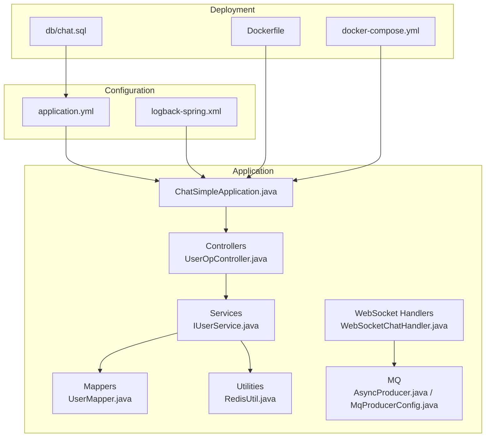
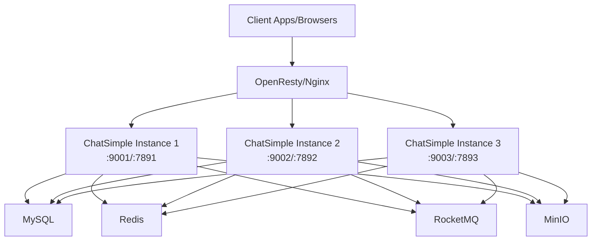
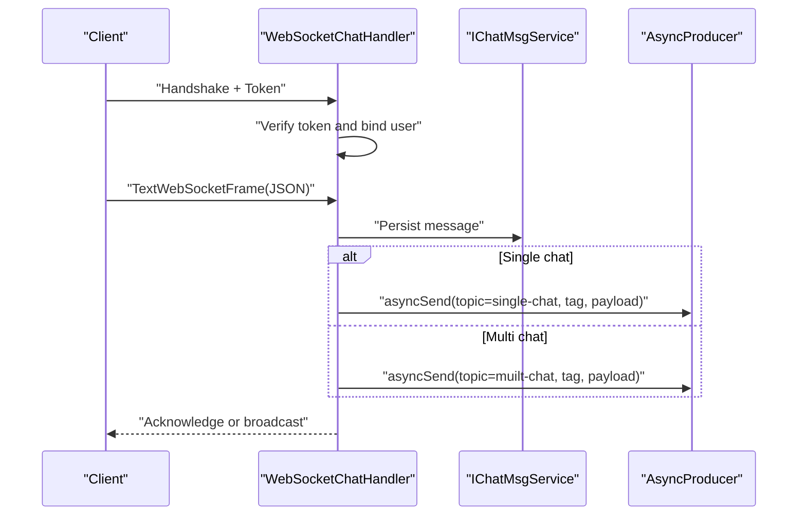
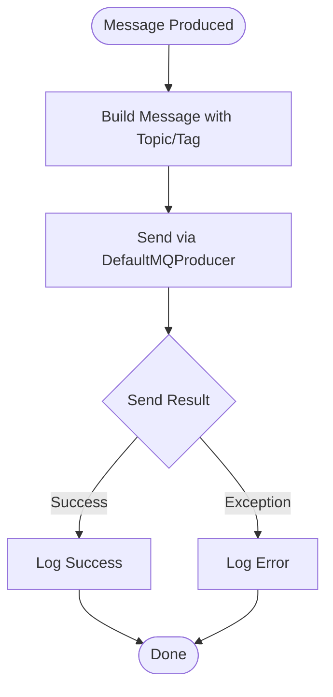
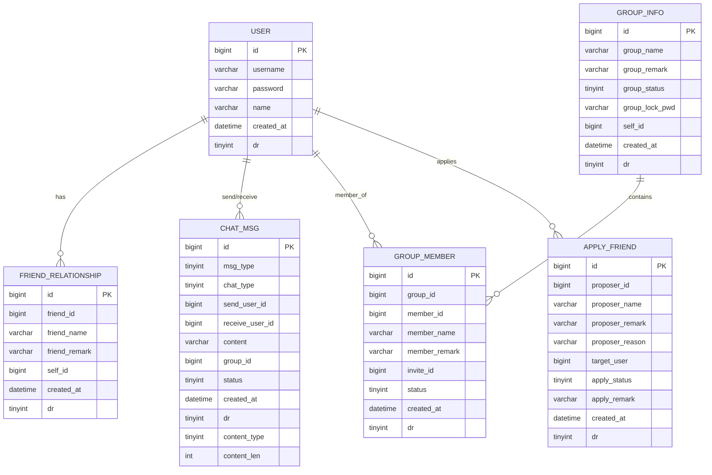
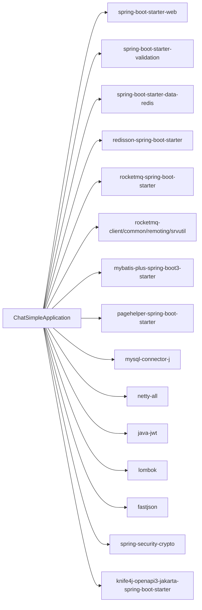

# Testing and Deployment

<cite>
**Referenced Files in This Document**
- [pom.xml](file://pom.xml)
- [Dockerfile](file://Dockerfile)
- [docker-compose.yml](file://docker-compose.yml)
- [application.yml](file://src/main/resources/application.yml)
- [logback-spring.xml](file://src/main/resources/logback-spring.xml)
- [ChatSimpleApplication.java](file://src/main/java/com/hch/chat_simple/ChatSimpleApplication.java)
- [ChatSimpleApplicationTests.java](file://src/test/java/com/hch/chat_simple/ChatSimpleApplicationTests.java)
- [UserOpController.java](file://src/main/java/com/hch/chat_simple/controller/UserOpController.java)
- [IUserService.java](file://src/main/java/com/hch/chat_simple/service/IUserService.java)
- [UserMapper.java](file://src/main/java/com/hch/chat_simple/mapper/UserMapper.java)
- [RedisUtil.java](file://src/main/java/com/hch/chat_simple/util/RedisUtil.java)
- [WebSocketChatHandler.java](file://src/main/java/com/hch/chat_simple/handler/WebSocketChatHandler.java)
- [AsyncProducer.java](file://src/main/java/com/hch/chat_simple/mq/AsyncProducer.java)
- [MqProducerConfig.java](file://src/main/java/com/hch/chat_simple/mq/MqProducerConfig.java)
- [chat.sql](file://db/chat.sql)
</cite>

## Table of Contents
1. [Introduction](#introduction)
2. [Project Structure](#project-structure)
3. [Core Components](#core-components)
4. [Architecture Overview](#architecture-overview)
5. [Detailed Component Analysis](#detailed-component-analysis)
6. [Dependency Analysis](#dependency-analysis)
7. [Performance Considerations](#performance-considerations)
8. [Troubleshooting Guide](#troubleshooting-guide)
9. [Conclusion](#conclusion)
10. [Appendices](#appendices)

## Introduction
This document provides comprehensive testing and deployment guidance for the Chat Simple application. It covers unit and integration testing strategies for services and controllers, WebSocket communication, message queue processing, and database operations. It also documents test data setup, mock configurations, and environment preparation. Containerized deployment is explained via Docker and docker-compose, including multi-stage build considerations and orchestration of MySQL, RocketMQ, Redis, and MinIO. Production deployment topics include scaling, load balancing, horizontal partitioning, monitoring and logging, performance and load testing, and rollback and disaster recovery procedures.

## Project Structure
The project follows a Spring Boot application layout with layered architecture:
- Application entry point and auto-configuration
- Controllers exposing REST endpoints
- Services implementing business logic
- Mappers for MyBatis-Plus data access
- Utilities for Redis, JWT, and other helpers
- MQ producers/consumers for asynchronous messaging
- WebSocket handlers for real-time communication
- Configuration files for application, logging, and Docker

**Diagram sources**
- [ChatSimpleApplication.java:1-25](file://src/main/java/com/hch/chat_simple/ChatSimpleApplication.java#L1-L25)
- [UserOpController.java:1-114](file://src/main/java/com/hch/chat_simple/controller/UserOpController.java#L1-L114)
- [IUserService.java:1-28](file://src/main/java/com/hch/chat_simple/service/IUserService.java#L1-L28)
- [UserMapper.java:1-22](file://src/main/java/com/hch/chat_simple/mapper/UserMapper.java#L1-L22)
- [RedisUtil.java:1-123](file://src/main/java/com/hch/chat_simple/util/RedisUtil.java#L1-L123)
- [WebSocketChatHandler.java:1-196](file://src/main/java/com/hch/chat_simple/handler/WebSocketChatHandler.java#L1-L196)
- [AsyncProducer.java:1-63](file://src/main/java/com/hch/chat_simple/mq/AsyncProducer.java#L1-L63)
- [MqProducerConfig.java:1-31](file://src/main/java/com/hch/chat_simple/mq/MqProducerConfig.java#L1-L31)
- [application.yml:1-89](file://src/main/resources/application.yml#L1-L89)
- [logback-spring.xml:1-24](file://src/main/resources/logback-spring.xml#L1-L24)
- [Dockerfile:1-12](file://Dockerfile#L1-L12)
- [docker-compose.yml:1-132](file://docker-compose.yml#L1-L132)
- [chat.sql:1-130](file://db/chat.sql#L1-L130)

**Section sources**
- [ChatSimpleApplication.java:1-25](file://src/main/java/com/hch/chat_simple/ChatSimpleApplication.java#L1-L25)
- [application.yml:1-89](file://src/main/resources/application.yml#L1-L89)
- [logback-spring.xml:1-24](file://src/main/resources/logback-spring.xml#L1-L24)
- [Dockerfile:1-12](file://Dockerfile#L1-L12)
- [docker-compose.yml:1-132](file://docker-compose.yml#L1-L132)
- [chat.sql:1-130](file://db/chat.sql#L1-L130)

## Core Components
- Application bootstrap and pagehelper dialect registration
- REST controllers for user operations
- Service interfaces and implementations
- MyBatis-Plus mappers for persistence
- Redis utilities for caching operations
- WebSocket handler for real-time chat
- RocketMQ producer and configuration
- Logging configuration via logback-spring.xml
- Containerization and orchestration via Docker and docker-compose

**Section sources**
- [ChatSimpleApplication.java:1-25](file://src/main/java/com/hch/chat_simple/ChatSimpleApplication.java#L1-L25)
- [UserOpController.java:1-114](file://src/main/java/com/hch/chat_simple/controller/UserOpController.java#L1-L114)
- [IUserService.java:1-28](file://src/main/java/com/hch/chat_simple/service/IUserService.java#L1-L28)
- [UserMapper.java:1-22](file://src/main/java/com/hch/chat_simple/mapper/UserMapper.java#L1-L22)
- [RedisUtil.java:1-123](file://src/main/java/com/hch/chat_simple/util/RedisUtil.java#L1-L123)
- [WebSocketChatHandler.java:1-196](file://src/main/java/com/hch/chat_simple/handler/WebSocketChatHandler.java#L1-L196)
- [AsyncProducer.java:1-63](file://src/main/java/com/hch/chat_simple/mq/AsyncProducer.java#L1-L63)
- [MqProducerConfig.java:1-31](file://src/main/java/com/hch/chat_simple/mq/MqProducerConfig.java#L1-L31)
- [logback-spring.xml:1-24](file://src/main/resources/logback-spring.xml#L1-L24)

## Architecture Overview
The system integrates REST APIs, WebSocket real-time messaging, asynchronous message processing via RocketMQ, and persistent storage with MySQL. Redis is used for caching and distributed primitives. The application is containerized and orchestrated with docker-compose to run multiple instances behind OpenResty/Nginx.

**Diagram sources**
- [docker-compose.yml:1-132](file://docker-compose.yml#L1-L132)
- [application.yml:1-89](file://src/main/resources/application.yml#L1-L89)

## Detailed Component Analysis

### Unit Testing Approach
- Use Spring Boot Test and JUnit to validate service and controller behavior.
- Recommended scopes: spring-boot-starter-test for test dependencies.
- Example test class exists for context loading verification.

Testing strategy outline:
- Service tests: Mock repository/mapper dependencies, assert business logic correctness, and exception handling.
- Controller tests: Use @WebMvcTest or @SpringBootTest to validate endpoint behavior, request validation, and response payloads.
- Utility tests: Validate Redis operations, token parsing, and conversion utilities.

**Section sources**
- [pom.xml:66-68](file://pom.xml#L66-L68)
- [ChatSimpleApplicationTests.java:1-14](file://src/test/java/com/hch/chat_simple/ChatSimpleApplicationTests.java#L1-L14)

### Integration Testing Strategies

#### WebSocket Communication
- Validate handshake, permission verification, message routing, and idle disconnect behavior.
- Use embedded Netty or a lightweight test harness to simulate WebSocket frames.
- Verify channel grouping and per-user channel mapping.

**Diagram sources**
- [WebSocketChatHandler.java:72-109](file://src/main/java/com/hch/chat_simple/handler/WebSocketChatHandler.java#L72-L109)
- [AsyncProducer.java:40-59](file://src/main/java/com/hch/chat_simple/mq/AsyncProducer.java#L40-L59)

**Section sources**
- [WebSocketChatHandler.java:1-196](file://src/main/java/com/hch/chat_simple/handler/WebSocketChatHandler.java#L1-L196)
- [AsyncProducer.java:1-63](file://src/main/java/com/hch/chat_simple/mq/AsyncProducer.java#L1-L63)

#### Message Queue Processing
- Validate producer sends messages to correct topics with appropriate tags.
- Ensure RocketMQ configuration is loaded from application.yml.
- Confirm producer bean initialization and lifecycle.

**Diagram sources**
- [MqProducerConfig.java:22-28](file://src/main/java/com/hch/chat_simple/mq/MqProducerConfig.java#L22-L28)
- [AsyncProducer.java:40-59](file://src/main/java/com/hch/chat_simple/mq/AsyncProducer.java#L40-L59)

**Section sources**
- [MqProducerConfig.java:1-31](file://src/main/java/com/hch/chat_simple/mq/MqProducerConfig.java#L1-L31)
- [AsyncProducer.java:1-63](file://src/main/java/com/hch/chat_simple/mq/AsyncProducer.java#L1-L63)
- [application.yml:39-52](file://src/main/resources/application.yml#L39-L52)

#### Database Operations
- Validate MyBatis-Plus mapper operations and logic delete configuration.
- Use test containers or an in-memory database for integration tests.
- Ensure transaction boundaries and rollback semantics during tests.

**Diagram sources**
- [chat.sql:5-130](file://db/chat.sql#L5-L130)

**Section sources**
- [UserMapper.java:1-22](file://src/main/java/com/hch/chat_simple/mapper/UserMapper.java#L1-L22)
- [application.yml:24-32](file://src/main/resources/application.yml#L24-L32)
- [chat.sql:1-130](file://db/chat.sql#L1-L130)

### Test Data Setup and Mock Configurations
- Test data: Initialize schema and seed data using the provided SQL script.
- Mock configurations: Use @MockBean/@SpyBean for repositories/services; configure Redis template and RocketMQ producer stubs for isolation.
- Environment preparation: Use test profiles to override datasource, Redis, and MQ settings.

**Section sources**
- [chat.sql:1-130](file://db/chat.sql#L1-L130)
- [application.yml:1-89](file://src/main/resources/application.yml#L1-L89)

### Controller Testing Example
- Endpoint coverage: Validate login, user info retrieval, user search, and user creation.
- Request validation: Assert DTO binding and constraint violations.
- Response payloads: Verify Payload wrapper and status codes.

**Section sources**
- [UserOpController.java:1-114](file://src/main/java/com/hch/chat_simple/controller/UserOpController.java#L1-L114)
- [IUserService.java:1-28](file://src/main/java/com/hch/chat_simple/service/IUserService.java#L1-L28)

### Service Layer Testing Example
- Business logic: Validate user search, insertion, and token generation.
- Persistence: Mock mapper behavior and assert save/update operations.

**Section sources**
- [IUserService.java:1-28](file://src/main/java/com/hch/chat_simple/service/IUserService.java#L1-L28)
- [UserMapper.java:1-22](file://src/main/java/com/hch/chat_simple/mapper/UserMapper.java#L1-L22)

## Dependency Analysis
External libraries and their roles:
- Spring Web, Validation, DevTools
- MyBatis-Plus, PageHelper, MySQL Connector
- RocketMQ Spring Boot Starter and client libraries
- Spring Data Redis, Redisson
- Netty for WebSocket
- Knife4j for OpenAPI
- Lombok, Fastjson, Guava, BCrypt

**Diagram sources**
- [pom.xml:34-326](file://pom.xml#L34-L326)

**Section sources**
- [pom.xml:1-346](file://pom.xml#L1-L346)

## Performance Considerations
- Asynchronous messaging: Offload heavy tasks to RocketMQ to reduce latency.
- Caching: Use Redis for hot data and counters; tune pool sizes and timeouts.
- Database: Enable batched statements and pagination; monitor slow queries.
- WebSocket: Limit concurrent executor threads and handle idle connections.
- Load testing: Simulate concurrent users, message bursts, and peak traffic scenarios.
- Capacity planning: Scale horizontally by adding instances behind a load balancer.

[No sources needed since this section provides general guidance]

## Troubleshooting Guide
- Logging: Configure console logging and enable SQL logs for mapper packages.
- Health checks: Ensure MinIO health check is active and RocketMQ name server/broker are reachable.
- Network: Verify port mappings and inter-service DNS resolution in docker-compose.
- Redis connectivity: Confirm host/port and credentials; check pool configuration.
- MQ connectivity: Validate name server address and producer group settings.

**Section sources**
- [logback-spring.xml:1-24](file://src/main/resources/logback-spring.xml#L1-L24)
- [docker-compose.yml:81-115](file://docker-compose.yml#L81-L115)
- [application.yml:39-52](file://src/main/resources/application.yml#L39-L52)

## Conclusion
This guide outlines a robust testing and deployment strategy for Chat Simple, covering unit and integration testing, WebSocket and MQ integration, database operations, and containerized deployment. By following the outlined practices—mocking, test data setup, environment isolation, and observability—you can achieve reliable CI/CD pipelines and scalable production deployments.

[No sources needed since this section summarizes without analyzing specific files]

## Appendices

### Docker Configuration and Multi-Stage Builds
- Current Dockerfile: Single-stage build copying the packaged JAR into a JDK slim image, setting timezone, and default JVM/HTTP ports.
- Recommendations:
  - Multi-stage build: Use a Maven builder stage and a minimal runtime stage to reduce image size.
  - Security: Run as a non-root user; drop unnecessary capabilities.
  - JVM tuning: Pass JVM options for heap and GC tuning via JAVA_TOOL_OPTIONS.
  - Entrypoint: Externalize port configuration via environment variables.

**Section sources**
- [Dockerfile:1-12](file://Dockerfile#L1-L12)

### docker-compose Orchestration
- Services: OpenResty/Nginx, three Chat Simple instances, MySQL, Redis, RocketMQ NameServer/Broker, MinIO, and MinIO Client.
- Networking: Use default bridge network; ensure service discovery via service names.
- Persistence: Bind Redis volume and initialize MySQL with schema.
- Health checks: MinIO health probe configured.

**Section sources**
- [docker-compose.yml:1-132](file://docker-compose.yml#L1-L132)

### Production Deployment Considerations
- Scaling: Horizontal scaling by adding instances; ensure shared state via Redis and externalized MQ/DB.
- Load balancing: Use OpenResty/Nginx upstream configuration; sticky sessions optional depending on session requirements.
- Horizontal partitioning: Distribute users/messages across instances using tags or sharding keys.
- Secrets: Externalize secrets via environment variables or secret managers.
- Backup: Regular MySQL dumps and MinIO snapshots; maintain retention policies.
- Disaster recovery: Multi-region deployment with cross-region replication for Redis/MQ/DB.

[No sources needed since this section provides general guidance]

### Monitoring and Logging
- Logging: Console appender with mapper and SQL debug logs enabled.
- Metrics: Expose actuator endpoints and integrate with Prometheus/Grafana.
- Tracing: Zipkin/Sleuth for distributed tracing across services.

**Section sources**
- [logback-spring.xml:1-24](file://src/main/resources/logback-spring.xml#L1-L24)

### Performance and Load Testing
- Tools: JMeter, Gatling, k6, or Locust for API and WebSocket load tests.
- Scenarios: Concurrent login, message sending, user search, file uploads, and idle disconnects.
- Metrics: RPS, latency percentiles, error rates, and resource utilization.

[No sources needed since this section provides general guidance]

### Rollback and Disaster Recovery
- Rollback: Immutable container images; use blue/green or rolling updates; keep previous image tag.
- Backups: Automated MySQL dump and MinIO snapshot schedules.
- DR: Geo-replicated buckets, MQ clusters, and DB replicas; test failover procedures.

[No sources needed since this section provides general guidance]