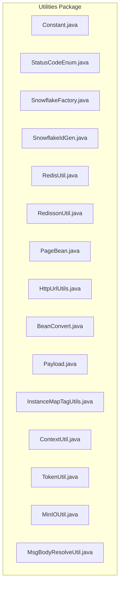
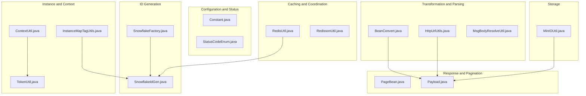
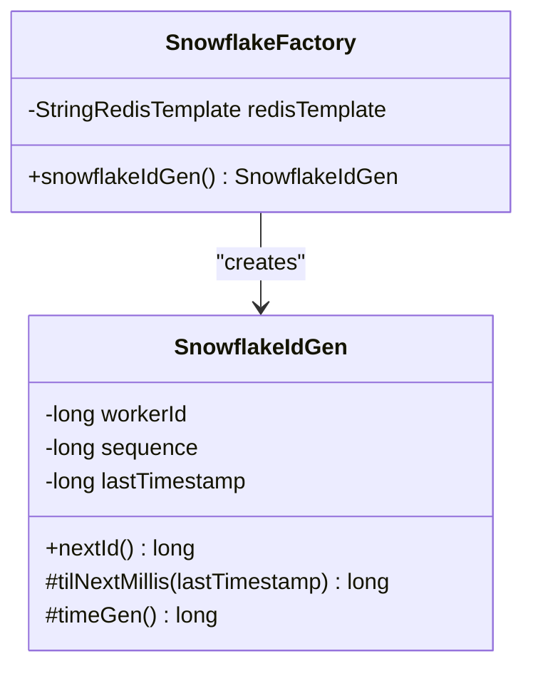
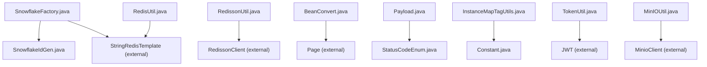

# Utility Classes and Helper Functions

<cite>
**Referenced Files in This Document**
- [Constant.java](file://src/main/java/com/hch/chat_simple/util/Constant.java)
- [StatusCodeEnum.java](file://src/main/java/com/hch/chat_simple/util/StatusCodeEnum.java)
- [SnowflakeFactory.java](file://src/main/java/com/hch/chat_simple/util/SnowflakeFactory.java)
- [SnowflakeIdGen.java](file://src/main/java/com/hch/chat_simple/util/SnowflakeIdGen.java)
- [RedisUtil.java](file://src/main/java/com/hch/chat_simple/util/RedisUtil.java)
- [RedissonUtil.java](file://src/main/java/com/hch/chat_simple/util/RedissonUtil.java)
- [PageBean.java](file://src/main/java/com/hch/chat_simple/util/PageBean.java)
- [HttpUrlUtils.java](file://src/main/java/com/hch/chat_simple/util/HttpUrlUtils.java)
- [BeanConvert.java](file://src/main/java/com/hch/chat_simple/util/BeanConvert.java)
- [Payload.java](file://src/main/java/com/hch/chat_simple/util/Payload.java)
- [InstanceMapTagUtils.java](file://src/main/java/com/hch/chat_simple/util/InstanceMapTagUtils.java)
- [ContextUtil.java](file://src/main/java/com/hch/chat_simple/util/ContextUtil.java)
- [TokenUtil.java](file://src/main/java/com/hch/chat_simple/util/TokenUtil.java)
- [MinIOUtil.java](file://src/main/java/com/hch/chat_simple/util/MinIOUtil.java)
- [MsgBodyResolveUtil.java](file://src/main/java/com/hch/chat_simple/util/MsgBodyResolveUtil.java)
</cite>

## Table of Contents
1. [Introduction](#introduction)
2. [Project Structure](#project-structure)
3. [Core Components](#core-components)
4. [Architecture Overview](#architecture-overview)
5. [Detailed Component Analysis](#detailed-component-analysis)
6. [Dependency Analysis](#dependency-analysis)
7. [Performance Considerations](#performance-considerations)
8. [Troubleshooting Guide](#troubleshooting-guide)
9. [Conclusion](#conclusion)
10. [Appendices](#appendices)

## Introduction
This document provides comprehensive documentation for the utility classes and helper functions used across the application. It focuses on:
- Shared constants and configuration values
- Standardized status codes and error handling
- Distributed ID generation using Twitter’s Snowflake algorithm
- Redis operations including caching and coordination primitives
- Pagination support and query result handling
- URL manipulation and validation
- Object mapping and transformation utilities
- Message payload handling and serialization
- Instance management and tag-based operations
- Thread safety considerations and performance implications

Each utility is explained with its purpose, usage patterns, and integration examples.

## Project Structure
The utilities reside under the package com.hch.chat_simple.util and are organized by functional domain. They integrate with Spring Boot, Spring Data Redis, Redisson, and other third-party libraries.

**Diagram sources**
- [Constant.java](file://src/main/java/com/hch/chat_simple/util/Constant.java)
- [StatusCodeEnum.java](file://src/main/java/com/hch/chat_simple/util/StatusCodeEnum.java)
- [SnowflakeFactory.java](file://src/main/java/com/hch/chat_simple/util/SnowflakeFactory.java)
- [SnowflakeIdGen.java](file://src/main/java/com/hch/chat_simple/util/SnowflakeIdGen.java)
- [RedisUtil.java](file://src/main/java/com/hch/chat_simple/util/RedisUtil.java)
- [RedissonUtil.java](file://src/main/java/com/hch/chat_simple/util/RedissonUtil.java)
- [PageBean.java](file://src/main/java/com/hch/chat_simple/util/PageBean.java)
- [HttpUrlUtils.java](file://src/main/java/com/hch/chat_simple/util/HttpUrlUtils.java)
- [BeanConvert.java](file://src/main/java/com/hch/chat_simple/util/BeanConvert.java)
- [Payload.java](file://src/main/java/com/hch/chat_simple/util/Payload.java)
- [InstanceMapTagUtils.java](file://src/main/java/com/hch/chat_simple/util/InstanceMapTagUtils.java)
- [ContextUtil.java](file://src/main/java/com/hch/chat_simple/util/ContextUtil.java)
- [TokenUtil.java](file://src/main/java/com/hch/chat_simple/util/TokenUtil.java)
- [MinIOUtil.java](file://src/main/java/com/hch/chat_simple/util/MinIOUtil.java)
- [MsgBodyResolveUtil.java](file://src/main/java/com/hch/chat_simple/util/MsgBodyResolveUtil.java)

**Section sources**
- [Constant.java:1-33](file://src/main/java/com/hch/chat_simple/util/Constant.java#L1-L33)
- [StatusCodeEnum.java:1-22](file://src/main/java/com/hch/chat_simple/util/StatusCodeEnum.java#L1-L22)
- [SnowflakeFactory.java:1-24](file://src/main/java/com/hch/chat_simple/util/SnowflakeFactory.java#L1-L24)
- [SnowflakeIdGen.java:1-118](file://src/main/java/com/hch/chat_simple/util/SnowflakeIdGen.java#L1-L118)
- [RedisUtil.java:1-123](file://src/main/java/com/hch/chat_simple/util/RedisUtil.java#L1-L123)
- [RedissonUtil.java:1-53](file://src/main/java/com/hch/chat_simple/util/RedissonUtil.java#L1-L53)
- [PageBean.java:1-21](file://src/main/java/com/hch/chat_simple/util/PageBean.java#L1-L21)
- [HttpUrlUtils.java:1-16](file://src/main/java/com/hch/chat_simple/util/HttpUrlUtils.java#L1-L16)
- [BeanConvert.java:1-70](file://src/main/java/com/hch/chat_simple/util/BeanConvert.java#L1-L70)
- [Payload.java:1-30](file://src/main/java/com/hch/chat_simple/util/Payload.java#L1-L30)
- [InstanceMapTagUtils.java:1-55](file://src/main/java/com/hch/chat_simple/util/InstanceMapTagUtils.java#L1-L55)
- [ContextUtil.java:1-52](file://src/main/java/com/hch/chat_simple/util/ContextUtil.java#L1-L52)
- [TokenUtil.java:1-71](file://src/main/java/com/hch/chat_simple/util/TokenUtil.java#L1-L71)
- [MinIOUtil.java:1-198](file://src/main/java/com/hch/chat_simple/util/MinIOUtil.java#L1-L198)
- [MsgBodyResolveUtil.java:1-74](file://src/main/java/com/hch/chat_simple/util/MsgBodyResolveUtil.java#L1-L74)

## Core Components
This section summarizes the primary utility categories and their responsibilities.

- Constant: Centralized shared constants for messaging, deletion flags, group membership, timezone, and Redis keys.
- StatusCodeEnum: Enumerated HTTP-like status codes and descriptions for consistent error handling.
- SnowflakeFactory and SnowflakeIdGen: Distributed ID generation using Twitter’s Snowflake algorithm with Redis-backed worker ID allocation.
- RedisUtil: Static facade for common Redis operations including string, hash, and atomic increment/decrement.
- RedissonUtil: Distributed locking primitives via Redisson with watchdog-based auto-extension.
- PageBean: Generic pagination container for API responses.
- HttpUrlUtils: Extracts URI query parameters from a URL string.
- BeanConvert: Converts POJOs to DTOs with optional transformer customization and PageHelper-aware list conversion.
- Payload: Standardized response envelope with data, code, and remark fields.
- InstanceMapTagUtils: Tag-based distribution of instances for sharding by user/group IDs.
- ContextUtil: Thread-local storage for request-scoped context (user identity, tokens).
- TokenUtil: JWT creation, verification, and parsing helpers.
- MinIOUtil: File upload, download, listing, and bucket management for MinIO.
- MsgBodyResolveUtil: Delimiter-based splitting and regex validation for structured message bodies.

**Section sources**
- [Constant.java:1-33](file://src/main/java/com/hch/chat_simple/util/Constant.java#L1-L33)
- [StatusCodeEnum.java:1-22](file://src/main/java/com/hch/chat_simple/util/StatusCodeEnum.java#L1-L22)
- [SnowflakeFactory.java:1-24](file://src/main/java/com/hch/chat_simple/util/SnowflakeFactory.java#L1-L24)
- [SnowflakeIdGen.java:1-118](file://src/main/java/com/hch/chat_simple/util/SnowflakeIdGen.java#L1-L118)
- [RedisUtil.java:1-123](file://src/main/java/com/hch/chat_simple/util/RedisUtil.java#L1-L123)
- [RedissonUtil.java:1-53](file://src/main/java/com/hch/chat_simple/util/RedissonUtil.java#L1-L53)
- [PageBean.java:1-21](file://src/main/java/com/hch/chat_simple/util/PageBean.java#L1-L21)
- [HttpUrlUtils.java:1-16](file://src/main/java/com/hch/chat_simple/util/HttpUrlUtils.java#L1-L16)
- [BeanConvert.java:1-70](file://src/main/java/com/hch/chat_simple/util/BeanConvert.java#L1-L70)
- [Payload.java:1-30](file://src/main/java/com/hch/chat_simple/util/Payload.java#L1-L30)
- [InstanceMapTagUtils.java:1-55](file://src/main/java/com/hch/chat_simple/util/InstanceMapTagUtils.java#L1-L55)
- [ContextUtil.java:1-52](file://src/main/java/com/hch/chat_simple/util/ContextUtil.java#L1-L52)
- [TokenUtil.java:1-71](file://src/main/java/com/hch/chat_simple/util/TokenUtil.java#L1-L71)
- [MinIOUtil.java:1-198](file://src/main/java/com/hch/chat_simple/util/MinIOUtil.java#L1-L198)
- [MsgBodyResolveUtil.java:1-74](file://src/main/java/com/hch/chat_simple/util/MsgBodyResolveUtil.java#L1-L74)

## Architecture Overview
The utilities form a cohesive toolkit enabling:
- Consistent configuration and status handling
- Scalable ID generation across instances
- Robust caching and distributed synchronization
- Structured pagination and payload envelopes
- Safe object mapping and message parsing
- Sharding and tagging for instance distribution
- Request-scoped context propagation and token lifecycle management

**Diagram sources**
- [Constant.java:1-33](file://src/main/java/com/hch/chat_simple/util/Constant.java#L1-L33)
- [StatusCodeEnum.java:1-22](file://src/main/java/com/hch/chat_simple/util/StatusCodeEnum.java#L1-L22)
- [SnowflakeFactory.java:1-24](file://src/main/java/com/hch/chat_simple/util/SnowflakeFactory.java#L1-L24)
- [SnowflakeIdGen.java:1-118](file://src/main/java/com/hch/chat_simple/util/SnowflakeIdGen.java#L1-L118)
- [RedisUtil.java:1-123](file://src/main/java/com/hch/chat_simple/util/RedisUtil.java#L1-L123)
- [RedissonUtil.java:1-53](file://src/main/java/com/hch/chat_simple/util/RedissonUtil.java#L1-L53)
- [PageBean.java:1-21](file://src/main/java/com/hch/chat_simple/util/PageBean.java#L1-L21)
- [Payload.java:1-30](file://src/main/java/com/hch/chat_simple/util/Payload.java#L1-L30)
- [BeanConvert.java:1-70](file://src/main/java/com/hch/chat_simple/util/BeanConvert.java#L1-L70)
- [HttpUrlUtils.java:1-16](file://src/main/java/com/hch/chat_simple/util/HttpUrlUtils.java#L1-L16)
- [MsgBodyResolveUtil.java:1-74](file://src/main/java/com/hch/chat_simple/util/MsgBodyResolveUtil.java#L1-L74)
- [InstanceMapTagUtils.java:1-55](file://src/main/java/com/hch/chat_simple/util/InstanceMapTagUtils.java#L1-L55)
- [ContextUtil.java:1-52](file://src/main/java/com/hch/chat_simple/util/ContextUtil.java#L1-L52)
- [TokenUtil.java:1-71](file://src/main/java/com/hch/chat_simple/util/TokenUtil.java#L1-L71)
- [MinIOUtil.java:1-198](file://src/main/java/com/hch/chat_simple/util/MinIOUtil.java#L1-L198)

## Detailed Component Analysis

### Constant
Purpose:
- Centralizes shared constants such as message send status, deletion flags, group membership, timezone, chat types, and Redis keys for instance counts and mappings.

Usage examples:
- Use constants for consistent checks across services and controllers.
- Reference Redis keys for instance metadata stored in Redis.

Thread safety:
- Constants are immutable static fields; safe for concurrent access.

Performance:
- Zero overhead—constants are resolved at compile-time.

**Section sources**
- [Constant.java:1-33](file://src/main/java/com/hch/chat_simple/util/Constant.java#L1-L33)

### StatusCodeEnum
Purpose:
- Provides standardized status codes and descriptions for consistent API responses and error reporting.

Usage examples:
- Build response envelopes using Payload.of(...) with a StatusCodeEnum.
- Map business exceptions to predefined status codes.

Thread safety:
- Immutable enum; inherently thread-safe.

Performance:
- Lightweight lookup and minimal memory footprint.

**Section sources**
- [StatusCodeEnum.java:1-22](file://src/main/java/com/hch/chat_simple/util/StatusCodeEnum.java#L1-L22)

### SnowflakeFactory and SnowflakeIdGen
Purpose:
- Generates globally unique IDs using Twitter’s Snowflake algorithm.
- SnowflakeFactory allocates a worker ID per instance using Redis increment.
- SnowflakeIdGen encapsulates the ID generation logic with synchronized nextId().

Key behaviors:
- Worker ID validation against maximum allowed value.
- Sequence number overflow handling with millisecond blocking.
- Timestamp drift protection with exception on backward clock movement.

Integration pattern:
- Configure Spring beans to initialize SnowflakeFactory and inject SnowflakeIdGen where IDs are needed.

**Diagram sources**
- [SnowflakeFactory.java:1-24](file://src/main/java/com/hch/chat_simple/util/SnowflakeFactory.java#L1-L24)
- [SnowflakeIdGen.java:1-118](file://src/main/java/com/hch/chat_simple/util/SnowflakeIdGen.java#L1-L118)

**Section sources**
- [SnowflakeFactory.java:1-24](file://src/main/java/com/hch/chat_simple/util/SnowflakeFactory.java#L1-L24)
- [SnowflakeIdGen.java:1-118](file://src/main/java/com/hch/chat_simple/util/SnowflakeIdGen.java#L1-L118)

### RedisUtil
Purpose:
- Static facade for common Redis operations using StringRedisTemplate.
- Supports key existence checks, expiration, atomic increments/decrements, string and hash operations.

Usage examples:
- Cache short-lived data with expire(timeout, unit).
- Maintain counters with incr()/decrease()/incrBy().
- Store structured data in Redis hashes with mapPut()/mapGet()/mapGetAll()/mapPop().

Thread safety:
- Uses a static injected template; ensure thread-safe access to shared template instance.
- Methods are stateless with respect to the template; avoid mutating shared state.

Performance:
- Efficient for hot-path operations; consider connection pooling and pipeline batching for bulk operations.

**Section sources**
- [RedisUtil.java:1-123](file://src/main/java/com/hch/chat_simple/util/RedisUtil.java#L1-L123)

### RedissonUtil
Purpose:
- Distributed locking via Redisson with watchdog auto-extension and interrupt-safe acquisition.

Usage examples:
- Acquire a lock with tryLock(lockKey, waitTimeSeconds, leaseTimeSeconds).
- Release a lock with unlock(lockKey) ensuring current thread holds the lock.
- Use lockWithWatchdog for long-running tasks requiring automatic extension.

Thread safety:
- Lock APIs are designed to be thread-safe; unlock guards against releasing locks held by other threads.

Performance:
- Watchdog adds periodic renewals; choose appropriate leaseTime to balance safety and overhead.

**Section sources**
- [RedissonUtil.java:1-53](file://src/main/java/com/hch/chat_simple/util/RedissonUtil.java#L1-L53)

### PageBean
Purpose:
- Generic pagination container carrying page number, size, and list of results.

Usage examples:
- Wrap paginated queries returned by MyBatis/MyBatis Plus or PageHelper.
- Return PageBean<T> from controllers for standardized pagination responses.

Thread safety:
- Immutable fields; safe for concurrent reads after construction.

Performance:
- Minimal overhead; suitable for large result sets.

**Section sources**
- [PageBean.java:1-21](file://src/main/java/com/hch/chat_simple/util/PageBean.java#L1-L21)

### HttpUrlUtils
Purpose:
- Parses a URI string and extracts query parameters as MultiValueMap.

Usage examples:
- Validate and extract query parameters from incoming requests.
- Use with Spring’s UriComponentsBuilder for robust URL parsing.

Thread safety:
- Stateless utility; safe for concurrent use.

Performance:
- Lightweight parsing; negligible overhead.

**Section sources**
- [HttpUrlUtils.java:1-16](file://src/main/java/com/hch/chat_simple/util/HttpUrlUtils.java#L1-L16)

### BeanConvert
Purpose:
- Converts between object types with optional transformer customization.
- Handles both raw lists and PageHelper Page instances preserving pagination metadata.

Usage examples:
- Convert POJOs to DTOs with extra field mapping via BiConsumer.
- Use convertList(...) to transform paginated collections.

Thread safety:
- Stateless utility; safe for concurrent use.

Performance:
- Stream-based transformations; consider avoiding deep conversions in tight loops.

**Section sources**
- [BeanConvert.java:1-70](file://src/main/java/com/hch/chat_simple/util/BeanConvert.java#L1-L70)

### Payload
Purpose:
- Standardized response envelope with data, code, and remark fields.
- Provides convenience constructors and factory methods using StatusCodeEnum.

Usage examples:
- Build success responses with Payload.success(data).
- Return error responses with Payload.of(data, StatusCodeEnum.TOKEN_INVALID).

Thread safety:
- Immutable fields; safe for concurrent reads.

Performance:
- Minimal overhead; suitable for high-frequency API responses.

**Section sources**
- [Payload.java:1-30](file://src/main/java/com/hch/chat_simple/util/Payload.java#L1-L30)

### InstanceMapTagUtils
Purpose:
- Distributes IDs across tagged instances using modulo arithmetic.
- Supports single ID mapping and grouping multiple IDs by their target tag.

Usage examples:
- Shard user/group IDs across instances based on configured tag list.
- Group IDs for batch operations per instance.

Thread safety:
- Uses a static inner class to cache instance count; ensure thread-safe initialization during startup.

Performance:
- O(n) grouping/streaming; efficient for moderate batch sizes.

**Section sources**
- [InstanceMapTagUtils.java:1-55](file://src/main/java/com/hch/chat_simple/util/InstanceMapTagUtils.java#L1-L55)

### ContextUtil
Purpose:
- Stores request-scoped context using TransmittableThreadLocal for cross-thread propagation.
- Holds user identity, username, real name, and new token.

Usage examples:
- Set context in interceptors or filters; clear after request completion.
- Access context in services for audit/logging.

Thread safety:
- TransmittableThreadLocal ensures cross-thread propagation; clear() prevents leaks.

Performance:
- Minimal overhead; avoid storing large objects.

**Section sources**
- [ContextUtil.java:1-52](file://src/main/java/com/hch/chat_simple/util/ContextUtil.java#L1-L52)

### TokenUtil
Purpose:
- JWT creation, verification, and parsing helpers.
- Configurable issuer, expiration, and signing key.

Usage examples:
- Generate tokens for authenticated sessions.
- Verify tokens and parse claims into TokenInfoDTO.

Thread safety:
- Stateless utility; safe for concurrent use.

Performance:
- Signing/verification cost is low; consider token caching for repeated validations.

**Section sources**
- [TokenUtil.java:1-71](file://src/main/java/com/hch/chat_simple/util/TokenUtil.java#L1-L71)

### MinIOUtil
Purpose:
- File upload, download, listing, and bucket management for MinIO-compatible storage.

Usage examples:
- Upload multipart files with generated object names.
- Generate pre-signed URLs for secure downloads.
- List objects and remove files.

Thread safety:
- Stateless utility; ensure thread-safe access to MinioClient and configuration.

Performance:
- Network-bound operations; tune timeouts and buffer sizes as needed.

**Section sources**
- [MinIOUtil.java:1-198](file://src/main/java/com/hch/chat_simple/util/MinIOUtil.java#L1-L198)

### MsgBodyResolveUtil
Purpose:
- Splits structured messages by delimiters and validates parts using regex patterns.
- Validates format correctness and throws business exceptions on mismatch.

Usage examples:
- Parse command-style messages with fixed-size parts.
- Validate and split CSV-like payloads.

Thread safety:
- Stateless utility; safe for concurrent use.

Performance:
- Linear-time splitting and matching; keep regex patterns efficient.

**Section sources**
- [MsgBodyResolveUtil.java:1-74](file://src/main/java/com/hch/chat_simple/util/MsgBodyResolveUtil.java#L1-L74)

## Dependency Analysis
This section maps dependencies among utilities and external systems.

**Diagram sources**
- [SnowflakeFactory.java:1-24](file://src/main/java/com/hch/chat_simple/util/SnowflakeFactory.java#L1-L24)
- [SnowflakeIdGen.java:1-118](file://src/main/java/com/hch/chat_simple/util/SnowflakeIdGen.java#L1-L118)
- [RedisUtil.java:1-123](file://src/main/java/com/hch/chat_simple/util/RedisUtil.java#L1-L123)
- [RedissonUtil.java:1-53](file://src/main/java/com/hch/chat_simple/util/RedissonUtil.java#L1-L53)
- [BeanConvert.java:1-70](file://src/main/java/com/hch/chat_simple/util/BeanConvert.java#L1-L70)
- [Payload.java:1-30](file://src/main/java/com/hch/chat_simple/util/Payload.java#L1-L30)
- [StatusCodeEnum.java:1-22](file://src/main/java/com/hch/chat_simple/util/StatusCodeEnum.java#L1-L22)
- [InstanceMapTagUtils.java:1-55](file://src/main/java/com/hch/chat_simple/util/InstanceMapTagUtils.java#L1-L55)
- [Constant.java:1-33](file://src/main/java/com/hch/chat_simple/util/Constant.java#L1-L33)
- [TokenUtil.java:1-71](file://src/main/java/com/hch/chat_simple/util/TokenUtil.java#L1-L71)
- [MinIOUtil.java:1-198](file://src/main/java/com/hch/chat_simple/util/MinIOUtil.java#L1-L198)

**Section sources**
- [SnowflakeFactory.java:1-24](file://src/main/java/com/hch/chat_simple/util/SnowflakeFactory.java#L1-L24)
- [SnowflakeIdGen.java:1-118](file://src/main/java/com/hch/chat_simple/util/SnowflakeIdGen.java#L1-L118)
- [RedisUtil.java:1-123](file://src/main/java/com/hch/chat_simple/util/RedisUtil.java#L1-L123)
- [RedissonUtil.java:1-53](file://src/main/java/com/hch/chat_simple/util/RedissonUtil.java#L1-L53)
- [BeanConvert.java:1-70](file://src/main/java/com/hch/chat_simple/util/BeanConvert.java#L1-L70)
- [Payload.java:1-30](file://src/main/java/com/hch/chat_simple/util/Payload.java#L1-L30)
- [StatusCodeEnum.java:1-22](file://src/main/java/com/hch/chat_simple/util/StatusCodeEnum.java#L1-L22)
- [InstanceMapTagUtils.java:1-55](file://src/main/java/com/hch/chat_simple/util/InstanceMapTagUtils.java#L1-L55)
- [Constant.java:1-33](file://src/main/java/com/hch/chat_simple/util/Constant.java#L1-L33)
- [TokenUtil.java:1-71](file://src/main/java/com/hch/chat_simple/util/TokenUtil.java#L1-L71)
- [MinIOUtil.java:1-198](file://src/main/java/com/hch/chat_simple/util/MinIOUtil.java#L1-L198)

## Performance Considerations
- SnowflakeIdGen.nextId() is synchronized; consider batching ID generation or using multiple workers to reduce contention.
- RedisUtil and RedissonUtil operations are network-bound; minimize round-trips and use pipelining for bulk updates.
- BeanConvert.convertList(...) preserves Page metadata; avoid unnecessary conversions in hot paths.
- Payload and StatusCodeEnum are lightweight; use them consistently to reduce branching logic.
- InstanceMapTagUtils performs modulo operations; ensure tag list length remains reasonable for predictable distribution.
- ContextUtil uses TransmittableThreadLocal; clear context after request to prevent memory leaks.
- TokenUtil verification is CPU-light; cache verified tokens if frequent re-validation occurs.
- MinIOUtil operations are I/O-bound; configure timeouts and buffer sizes appropriately.

[No sources needed since this section provides general guidance]

## Troubleshooting Guide
Common issues and resolutions:
- Snowflake timestamp backward movement: The generator throws an exception when the clock moves backwards. Ensure NTP synchronization across instances.
- Redis operation result null: RedisUtil throws runtime exceptions when Redis returns null; verify Redis connectivity and key validity.
- Redisson lock release: Unlock only if the lock is currently held by the current thread; otherwise, ignore or log a warning.
- BeanConvert instantiation failures: If destination class lacks a no-arg constructor, conversion fails silently; ensure proper constructors.
- Payload misuse: Always pass a valid StatusCodeEnum or explicit code/desc; otherwise, clients may misinterpret responses.
- InstanceMapTagUtils tag size: Ensure the configured tag list matches deployed instances; otherwise, distribution skew may occur.
- Token verification errors: Log and return appropriate StatusCodeEnum for client handling; refresh tokens as needed.

**Section sources**
- [SnowflakeIdGen.java:60-72](file://src/main/java/com/hch/chat_simple/util/SnowflakeIdGen.java#L60-L72)
- [RedisUtil.java:31-33](file://src/main/java/com/hch/chat_simple/util/RedisUtil.java#L31-L33)
- [RedissonUtil.java:37-41](file://src/main/java/com/hch/chat_simple/util/RedissonUtil.java#L37-L41)
- [BeanConvert.java:19-26](file://src/main/java/com/hch/chat_simple/util/BeanConvert.java#L19-L26)
- [Payload.java:18-28](file://src/main/java/com/hch/chat_simple/util/Payload.java#L18-L28)
- [InstanceMapTagUtils.java:24-26](file://src/main/java/com/hch/chat_simple/util/InstanceMapTagUtils.java#L24-L26)
- [TokenUtil.java:48-59](file://src/main/java/com/hch/chat_simple/util/TokenUtil.java#L48-L59)

## Conclusion
These utilities provide a robust foundation for configuration, ID generation, caching, coordination, pagination, transformation, and response modeling. By adhering to the documented patterns and considering thread safety and performance implications, teams can maintain consistency and scalability across the application.

[No sources needed since this section summarizes without analyzing specific files]

## Appendices
- Usage examples by category:
  - ID generation: Initialize SnowflakeFactory and call SnowflakeIdGen.nextId() in services requiring unique identifiers.
  - Caching: Use RedisUtil for counters and short-lived caches; apply TTL carefully.
  - Locking: Use RedissonUtil.tryLock(...) for critical sections; ensure unlock in finally blocks.
  - Pagination: Wrap DAO results with PageBean<T> for consistent API responses.
  - Transformation: Use BeanConvert.convert(...) and convertList(...) to map POJOs to DTOs.
  - Payloads: Build responses with Payload.of(...) or Payload.success(...).
  - Sharding: Use InstanceMapTagUtils.singleIdMapTag(...) and multiGroupByTag(...) for instance distribution.
  - Context: Set and clear ContextUtil values in interceptors; access in services.
  - Tokens: Generate and verify tokens with TokenUtil; parse claims into DTOs.
  - Storage: Use MinIOUtil for uploads/downloads/listing; handle exceptions gracefully.
  - Parsing: Use MsgBodyResolveUtil for structured message splitting and validation.

[No sources needed since this section provides general guidance]