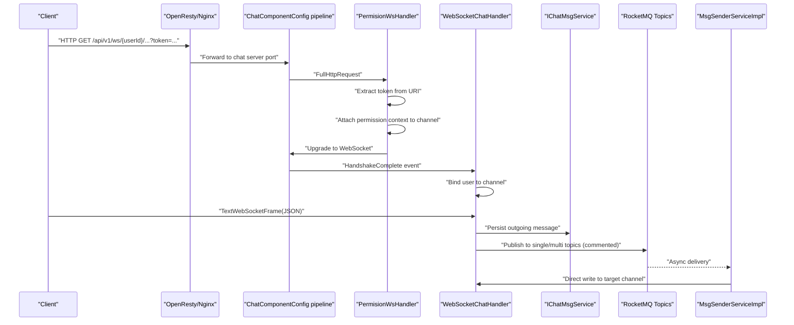
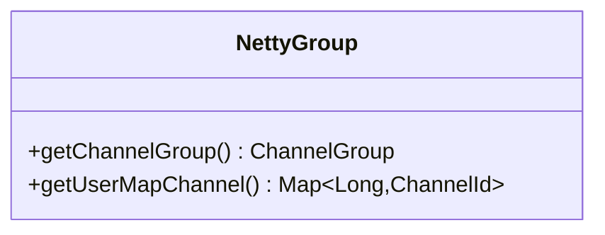
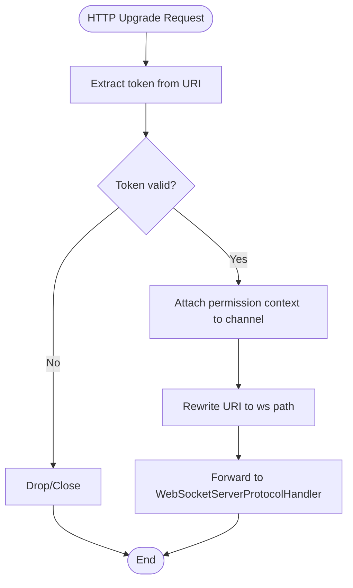
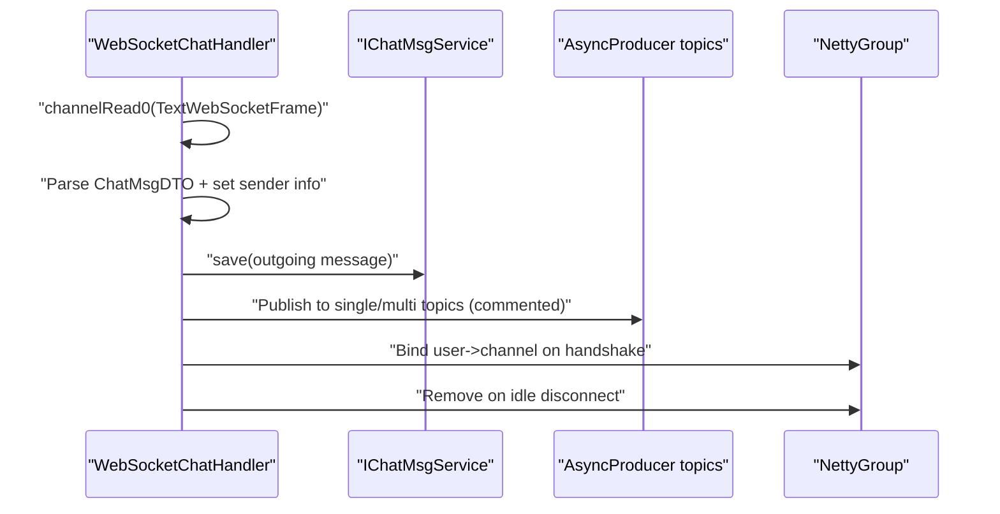
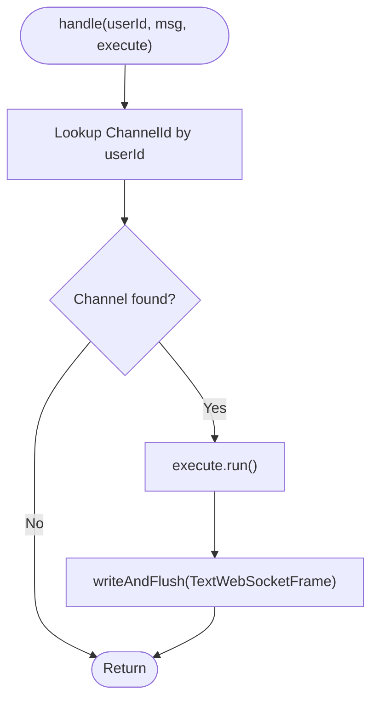
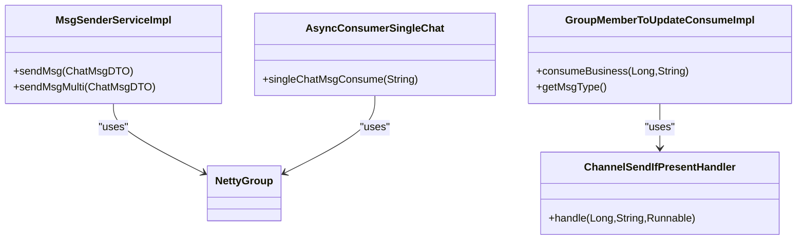
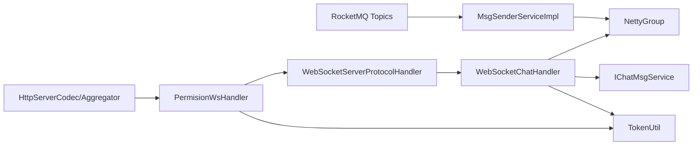

# WebSocket Communication System

<cite>
**Referenced Files in This Document**
- [ChatComponentConfig.java](file://src/main/java/com/hch/chat_simple/config/ChatComponentConfig.java)
- [NettyGroup.java](file://src/main/java/com/hch/chat_simple/config/NettyGroup.java)
- [WebSocketChatHandler.java](file://src/main/java/com/hch/chat_simple/handler/WebSocketChatHandler.java)
- [PermisionWsHandler.java](file://src/main/java/com/hch/chat_simple/handler/PermisionWsHandler.java)
- [ChannelSendIfPresentHandler.java](file://src/main/java/com/hch/chat_simple/handler/ChannelSendIfPresentHandler.java)
- [MsgSenderServiceImpl.java](file://src/main/java/com/hch/chat_simple/service/impl/MsgSenderServiceImpl.java)
- [AsyncConsumerSingleChat.java](file://src/main/java/com/hch/chat_simple/mq/AsyncConsumerSingleChat.java)
- [GroupMemberToUpdateConsumeImpl.java](file://src/main/java/com/hch/chat_simple/service/impl/GroupMemberToUpdateConsumeImpl.java)
- [Constant.java](file://src/main/java/com/hch/chat_simple/util/Constant.java)
- [TokenUtil.java](file://src/main/java/com/hch/chat_simple/util/TokenUtil.java)
- [HttpUrlUtils.java](file://src/main/java/com/hch/chat_simple/util/HttpUrlUtils.java)
- [WebSocketPerssionVerify.java](file://src/main/java/com/hch/chat_simple/pojo/dto/WebSocketPerssionVerify.java)
- [ChatMsgDTO.java](file://src/main/java/com/hch/chat_simple/pojo/dto/ChatMsgDTO.java)
- [application.yml](file://src/main/resources/application.yml)
- [nginx.conf](file://openresty_nginx_conf/nginx.conf)
</cite>

## Table of Contents
1. [Introduction](#introduction)
2. [Project Structure](#project-structure)
3. [Core Components](#core-components)
4. [Architecture Overview](#architecture-overview)
5. [Detailed Component Analysis](#detailed-component-analysis)
6. [Dependency Analysis](#dependency-analysis)
7. [Performance Considerations](#performance-considerations)
8. [Troubleshooting Guide](#troubleshooting-guide)
9. [Conclusion](#conclusion)
10. [Appendices](#appendices)

## Introduction
This document describes a high-performance WebSocket communication system built on Netty 4.1.69 for real-time messaging. It covers connection lifecycle management via NettyGroup, permission verification through PermisionWsHandler, message routing and delivery via WebSocketChatHandler and ChannelSendIfPresentHandler, and event-driven patterns for broadcasting and offline handling. It also documents the WebSocket protocol implementation, message formats, and operational guidance for client integration, scaling, and error handling.

## Project Structure
The WebSocket subsystem is organized around a Netty-based pipeline configured in a Spring-managed component. Handlers are layered to process HTTP upgrade requests, enforce permissions, manage sessions, and deliver messages. Supporting utilities provide token parsing, constant definitions, and HTTP parameter extraction.

```mermaid
graph TB
subgraph "Spring Config"
Cfg["ChatComponentConfig<br/>Netty pipeline setup"]
end
subgraph "Handlers"
Perm["PermisionWsHandler<br/>HTTP upgrade + token extract"]
Ws["WebSocketChatHandler<br/>session join + message routing"]
SendIf["ChannelSendIfPresentHandler<br/>targeted delivery"]
end
subgraph "Runtime State"
NG["NettyGroup<br/>ChannelGroup + user->channel map"]
end
subgraph "Messaging"
MQ["AsyncProducer topics<br/>single/multi-chat"]
Sender["MsgSenderServiceImpl<br/>direct channel writes"]
end
subgraph "Utilities"
Tok["TokenUtil<br/>JWT parse"]
Const["Constant<br/>keys & flags"]
Url["HttpUrlUtils<br/>URI params"]
end
Cfg --> Perm --> Ws --> SendIf
NG <- --> Ws
NG <- --> SendIf
MQ -.-> Sender -.-> NG
Tok --- Perm
Tok --- Ws
Const --- Ws
Url --- Perm
```

**Diagram sources**
- [ChatComponentConfig.java:74-89](file://src/main/java/com/hch/chat_simple/config/ChatComponentConfig.java#L74-L89)
- [PermisionWsHandler.java:26-81](file://src/main/java/com/hch/chat_simple/handler/PermisionWsHandler.java#L26-L81)
- [WebSocketChatHandler.java:50-196](file://src/main/java/com/hch/chat_simple/handler/WebSocketChatHandler.java#L50-L196)
- [ChannelSendIfPresentHandler.java:14-34](file://src/main/java/com/hch/chat_simple/handler/ChannelSendIfPresentHandler.java#L14-L34)
- [NettyGroup.java:11-30](file://src/main/java/com/hch/chat_simple/config/NettyGroup.java#L11-L30)
- [TokenUtil.java:18-71](file://src/main/java/com/hch/chat_simple/util/TokenUtil.java#L18-L71)
- [Constant.java:3-33](file://src/main/java/com/hch/chat_simple/util/Constant.java#L3-L33)
- [HttpUrlUtils.java:8-16](file://src/main/java/com/hch/chat_simple/util/HttpUrlUtils.java#L8-L16)

**Section sources**
- [ChatComponentConfig.java:31-103](file://src/main/java/com/hch/chat_simple/config/ChatComponentConfig.java#L31-L103)
- [application.yml:74-83](file://src/main/resources/application.yml#L74-L83)

## Core Components
- NettyGroup: Provides a global ChannelGroup for managing connected channels and a concurrent user-to-channel map for targeted delivery.
- PermisionWsHandler: Intercepts HTTP upgrade requests, extracts tokens from URI query parameters, validates them, and attaches permission context to the channel attributes.
- WebSocketChatHandler: Handles WebSocket frames after handshake, performs identity binding, persists outgoing messages, and prepares for asynchronous delivery.
- ChannelSendIfPresentHandler: Efficiently sends messages to a target user only if they are currently connected.
- Message Senders: MsgSenderServiceImpl performs direct channel writes; AsyncConsumerSingleChat handles offloaded single-chat delivery; GroupMemberToUpdateConsumeImpl demonstrates targeted updates via ChannelSendIfPresentHandler.

**Section sources**
- [NettyGroup.java:11-30](file://src/main/java/com/hch/chat_simple/config/NettyGroup.java#L11-L30)
- [PermisionWsHandler.java:26-81](file://src/main/java/com/hch/chat_simple/handler/PermisionWsHandler.java#L26-L81)
- [WebSocketChatHandler.java:50-196](file://src/main/java/com/hch/chat_simple/handler/WebSocketChatHandler.java#L50-L196)
- [ChannelSendIfPresentHandler.java:14-34](file://src/main/java/com/hch/chat_simple/handler/ChannelSendIfPresentHandler.java#L14-L34)
- [MsgSenderServiceImpl.java:24-78](file://src/main/java/com/hch/chat_simple/service/impl/MsgSenderServiceImpl.java#L24-L78)
- [AsyncConsumerSingleChat.java:36-60](file://src/main/java/com/hch/chat_simple/mq/AsyncConsumerSingleChat.java#L36-L60)
- [GroupMemberToUpdateConsumeImpl.java:16-33](file://src/main/java/com/hch/chat_simple/service/impl/GroupMemberToUpdateConsumeImpl.java#L16-L33)

## Architecture Overview
The system uses a Netty pipeline to accept HTTP requests, perform WebSocket upgrade, validate tokens, and establish persistent sessions. Messages can arrive via WebSocket frames or asynchronously through RocketMQ topics. Delivery targets either a specific channel (direct) or all relevant channels (broadcast-like via consumers).



**Diagram sources**
- [ChatComponentConfig.java:74-89](file://src/main/java/com/hch/chat_simple/config/ChatComponentConfig.java#L74-L89)
- [PermisionWsHandler.java:32-66](file://src/main/java/com/hch/chat_simple/handler/PermisionWsHandler.java#L32-L66)
- [WebSocketChatHandler.java:118-163](file://src/main/java/com/hch/chat_simple/handler/WebSocketChatHandler.java#L118-L163)
- [MsgSenderServiceImpl.java:34-55](file://src/main/java/com/hch/chat_simple/service/impl/MsgSenderServiceImpl.java#L34-L55)
- [application.yml:39-51](file://src/main/resources/application.yml#L39-L51)

## Detailed Component Analysis

### NettyGroup: Connection Management and Session Registry
- Maintains a global ChannelGroup for broadcast-like operations.
- Maintains a concurrent user-to-channel map keyed by user ID for targeted delivery.
- Provides static accessors for handlers to register/unregister sessions and resolve channels.



**Diagram sources**
- [NettyGroup.java:11-30](file://src/main/java/com/hch/chat_simple/config/NettyGroup.java#L11-L30)

**Section sources**
- [NettyGroup.java:11-30](file://src/main/java/com/hch/chat_simple/config/NettyGroup.java#L11-L30)

### PermisionWsHandler: Permission Verification and Token Validation
- Intercepts FullHttpRequest during upgrade.
- Extracts token from URI query parameters using HttpUrlUtils.
- Validates token via TokenUtil and attaches a WebSocketPerssionVerify object to channel attributes.
- Rewrites request URI to the configured WebSocket path and forwards to the next handler.



**Diagram sources**
- [PermisionWsHandler.java:32-66](file://src/main/java/com/hch/chat_simple/handler/PermisionWsHandler.java#L32-L66)
- [HttpUrlUtils.java:10-14](file://src/main/java/com/hch/chat_simple/util/HttpUrlUtils.java#L10-L14)
- [TokenUtil.java:61-69](file://src/main/java/com/hch/chat_simple/util/TokenUtil.java#L61-L69)

**Section sources**
- [PermisionWsHandler.java:26-81](file://src/main/java/com/hch/chat_simple/handler/PermisionWsHandler.java#L26-L81)
- [HttpUrlUtils.java:8-16](file://src/main/java/com/hch/chat_simple/util/HttpUrlUtils.java#L8-L16)
- [TokenUtil.java:18-71](file://src/main/java/com/hch/chat_simple/util/TokenUtil.java#L18-L71)
- [WebSocketPerssionVerify.java:6-22](file://src/main/java/com/hch/chat_simple/pojo/dto/WebSocketPerssionVerify.java#L6-L22)

### WebSocketChatHandler: Message Routing and Real-Time Delivery
- Receives TextWebSocketFrame messages after handshake.
- Extracts ChatMsgDTO from JSON payload and enriches with sender info and timestamps.
- Persists outgoing messages and prepares asynchronous delivery pathways.
- On handshake completion, binds user ID to channel and adds to ChannelGroup.
- Implements idle detection to remove stale channels.



**Diagram sources**
- [WebSocketChatHandler.java:72-109](file://src/main/java/com/hch/chat_simple/handler/WebSocketChatHandler.java#L72-L109)
- [WebSocketChatHandler.java:118-175](file://src/main/java/com/hch/chat_simple/handler/WebSocketChatHandler.java#L118-L175)
- [ChatMsgDTO.java:12-62](file://src/main/java/com/hch/chat_simple/pojo/dto/ChatMsgDTO.java#L12-L62)

**Section sources**
- [WebSocketChatHandler.java:50-196](file://src/main/java/com/hch/chat_simple/handler/WebSocketChatHandler.java#L50-L196)
- [ChatMsgDTO.java:12-62](file://src/main/java/com/hch/chat_simple/pojo/dto/ChatMsgDTO.java#L12-L62)

### ChannelSendIfPresentHandler: Efficient Targeted Delivery
- Uses NettyGroup’s user-to-channel map to locate a connected user.
- Writes and flushes a TextWebSocketFrame only if the channel exists.
- Supports optional pre-execution hook for logging or metrics.



**Diagram sources**
- [ChannelSendIfPresentHandler.java:21-32](file://src/main/java/com/hch/chat_simple/handler/ChannelSendIfPresentHandler.java#L21-L32)
- [NettyGroup.java:22-26](file://src/main/java/com/hch/chat_simple/config/NettyGroup.java#L22-L26)

**Section sources**
- [ChannelSendIfPresentHandler.java:14-34](file://src/main/java/com/hch/chat_simple/handler/ChannelSendIfPresentHandler.java#L14-L34)

### Message Senders: Direct and Asynchronous Delivery
- MsgSenderServiceImpl: Performs direct writes to a resolved channel and records delivery outcome.
- AsyncConsumerSingleChat: Consumes RocketMQ single-chat events and delivers to online recipients.
- GroupMemberToUpdateConsumeImpl: Demonstrates targeted updates using ChannelSendIfPresentHandler.



**Diagram sources**
- [MsgSenderServiceImpl.java:24-78](file://src/main/java/com/hch/chat_simple/service/impl/MsgSenderServiceImpl.java#L24-L78)
- [ChannelSendIfPresentHandler.java:14-34](file://src/main/java/com/hch/chat_simple/handler/ChannelSendIfPresentHandler.java#L14-L34)
- [AsyncConsumerSingleChat.java:36-60](file://src/main/java/com/hch/chat_simple/mq/AsyncConsumerSingleChat.java#L36-L60)
- [GroupMemberToUpdateConsumeImpl.java:16-33](file://src/main/java/com/hch/chat_simple/service/impl/GroupMemberToUpdateConsumeImpl.java#L16-L33)

**Section sources**
- [MsgSenderServiceImpl.java:24-78](file://src/main/java/com/hch/chat_simple/service/impl/MsgSenderServiceImpl.java#L24-L78)
- [AsyncConsumerSingleChat.java:36-60](file://src/main/java/com/hch/chat_simple/mq/AsyncConsumerSingleChat.java#L36-L60)
- [GroupMemberToUpdateConsumeImpl.java:16-33](file://src/main/java/com/hch/chat_simple/service/impl/GroupMemberToUpdateConsumeImpl.java#L16-L33)

## Dependency Analysis
- Pipeline order: HTTP codec → aggregator → PermisionWsHandler → WebSocketServerProtocolHandler → WebSocketChatHandler.
- Runtime state: NettyGroup shared across handlers for channel registry and targeted delivery.
- Token validation: TokenUtil parses JWT and populates WebSocketPerssionVerify attached to channel attributes.
- Message persistence: WebSocketChatHandler persists outgoing messages; MsgSenderServiceImpl and AsyncConsumerSingleChat handle delivery outcomes.



**Diagram sources**
- [ChatComponentConfig.java:74-89](file://src/main/java/com/hch/chat_simple/config/ChatComponentConfig.java#L74-L89)
- [PermisionWsHandler.java:32-66](file://src/main/java/com/hch/chat_simple/handler/PermisionWsHandler.java#L32-L66)
- [WebSocketChatHandler.java:118-163](file://src/main/java/com/hch/chat_simple/handler/WebSocketChatHandler.java#L118-L163)
- [TokenUtil.java:61-69](file://src/main/java/com/hch/chat_simple/util/TokenUtil.java#L61-L69)
- [application.yml:39-51](file://src/main/resources/application.yml#L39-L51)

**Section sources**
- [ChatComponentConfig.java:74-89](file://src/main/java/com/hch/chat_simple/config/ChatComponentConfig.java#L74-L89)
- [TokenUtil.java:18-71](file://src/main/java/com/hch/chat_simple/util/TokenUtil.java#L18-L71)

## Performance Considerations
- Event loop sizing: Configure boss and worker threads appropriately for expected concurrency; adjust SO_BACKLOG and keepalive options.
- Connection pooling: Tune Netty ChannelOption settings and keep-alive timeouts for long-lived connections.
- Message throughput: Offload heavy work to thread pools or asynchronous producers/consumers; avoid blocking operations in the pipeline.
- Memory management: Prefer pooled buffers and chunked writes; minimize allocations in hot paths.
- Scaling: Use Nginx/OpenResty upstream balancing to distribute WebSocket connections across instances; leverage Redis/Redisson for cross-instance coordination if needed.
- Idle handling: Implement idle state detection to reclaim resources from disconnected clients.

[No sources needed since this section provides general guidance]

## Troubleshooting Guide
- Authentication failures: Verify token presence and validity; check TokenUtil parsing and issuer configuration.
- Handshake errors: Confirm URI rewriting and WebSocket path alignment; ensure proper HTTP upgrade headers.
- Delivery failures: Inspect channel existence via NettyGroup; validate user binding on handshake; review write-and-flush futures.
- Idle disconnects: Adjust idle state thresholds and ensure periodic heartbeat frames from clients.
- Logging: Enable debug logs for Netty pipeline stages and handler exceptions.

**Section sources**
- [PermisionWsHandler.java:68-72](file://src/main/java/com/hch/chat_simple/handler/PermisionWsHandler.java#L68-L72)
- [WebSocketChatHandler.java:112-116](file://src/main/java/com/hch/chat_simple/handler/WebSocketChatHandler.java#L112-L116)
- [WebSocketChatHandler.java:155-162](file://src/main/java/com/hch/chat_simple/handler/WebSocketChatHandler.java#L155-L162)

## Conclusion
This WebSocket system leverages Netty for high-throughput, low-latency real-time messaging with robust session management and permission enforcement. By combining direct channel writes, asynchronous delivery, and targeted broadcasting, it supports both single-user and group scenarios. Proper configuration of the pipeline, token validation, and connection lifecycle management ensures reliable operation under load.

[No sources needed since this section summarizes without analyzing specific files]

## Appendices

### WebSocket Protocol Implementation
- Upgrade path: HTTP GET with token query parameter; rewritten to configured WebSocket path.
- Frame type: TextWebSocketFrame carrying JSON-encoded ChatMsgDTO.
- Event handling: HandshakeComplete binds user to channel; IdleState triggers cleanup.

**Section sources**
- [ChatComponentConfig.java:82-86](file://src/main/java/com/hch/chat_simple/config/ChatComponentConfig.java#L82-L86)
- [PermisionWsHandler.java:29-61](file://src/main/java/com/hch/chat_simple/handler/PermisionWsHandler.java#L29-L61)
- [WebSocketChatHandler.java:118-163](file://src/main/java/com/hch/chat_simple/handler/WebSocketChatHandler.java#L118-L163)

### Message Formats
- ChatMsgDTO fields include message type, chat type, sender/receiver identifiers, content, timestamps, and optional group metadata.

**Section sources**
- [ChatMsgDTO.java:12-62](file://src/main/java/com/hch/chat_simple/pojo/dto/ChatMsgDTO.java#L12-L62)

### Client Integration Examples
- Connection establishment:
  - Open a WebSocket to the configured path with a token query parameter.
  - Ensure the URI is rewritten to the ws path by the proxy/load balancer.
- Message exchange:
  - Send a JSON payload conforming to ChatMsgDTO.
  - Expect targeted TextWebSocketFrame responses for single-chat or group updates.

**Section sources**
- [nginx.conf:53-58](file://openresty_nginx_conf/nginx.conf#L53-L58)
- [application.yml:76-78](file://src/main/resources/application.yml#L76-L78)