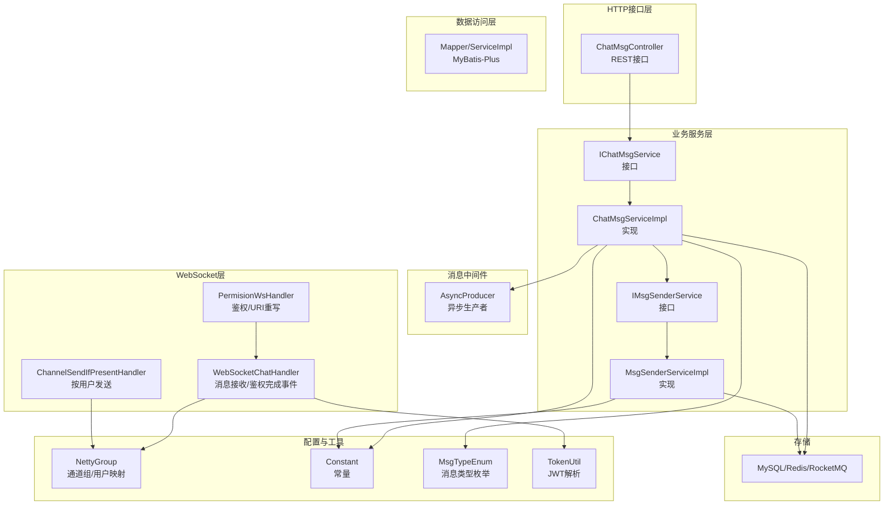
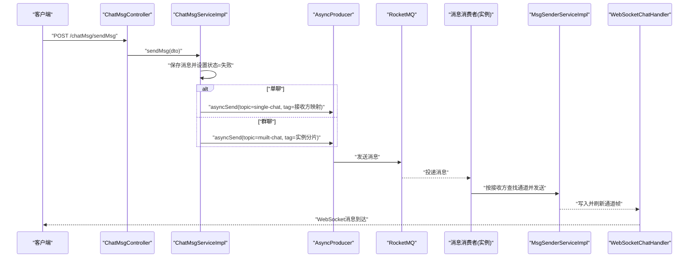
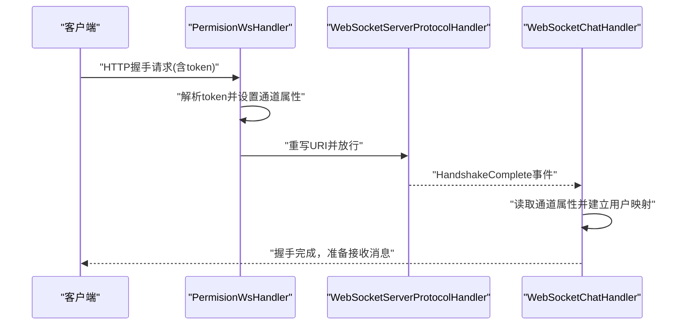
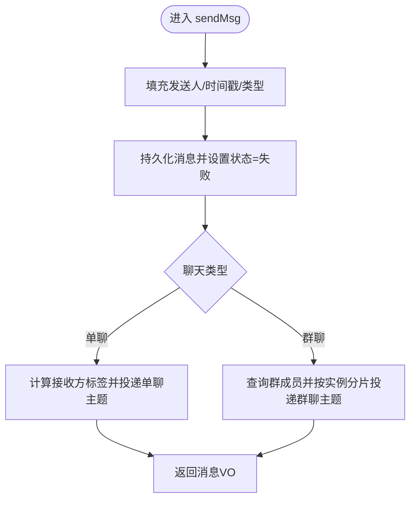
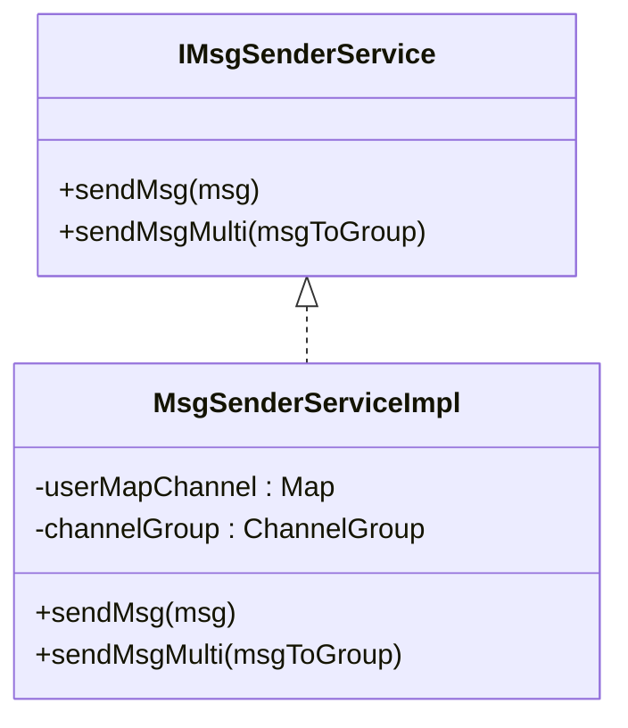
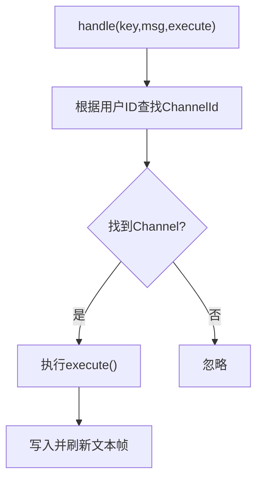
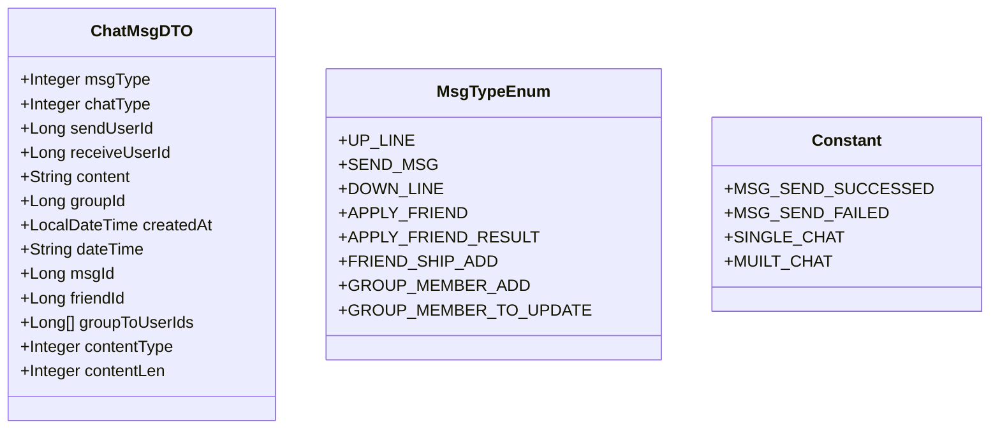
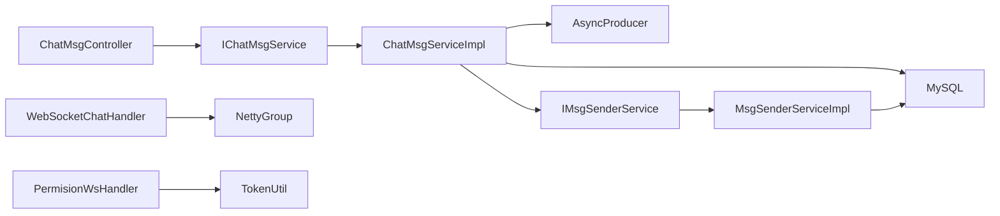

# API集成与消息发送

<cite>
**本文引用的文件**
- [ChannelSendIfPresentHandler.java](file://src/main/java/com/hch/chat_simple/handler/ChannelSendIfPresentHandler.java)
- [WebSocketChatHandler.java](file://src/main/java/com/hch/chat_simple/handler/WebSocketChatHandler.java)
- [PermisionWsHandler.java](file://src/main/java/com/hch/chat_simple/handler/PermisionWsHandler.java)
- [MsgSenderServiceImpl.java](file://src/main/java/com/hch/chat_simple/service/impl/MsgSenderServiceImpl.java)
- [IMsgSenderService.java](file://src/main/java/com/hch/chat_simple/service/IMsgSenderService.java)
- [ChatMsgController.java](file://src/main/java/com/hch/chat_simple/controller/ChatMsgController.java)
- [AsyncProducer.java](file://src/main/java/com/hch/chat_simple/mq/AsyncProducer.java)
- [NettyGroup.java](file://src/main/java/com/hch/chat_simple/config/NettyGroup.java)
- [ChatMsgDTO.java](file://src/main/java/com/hch/chat_simple/pojo/dto/ChatMsgDTO.java)
- [IChatMsgService.java](file://src/main/java/com/hch/chat_simple/service/IChatMsgService.java)
- [ChatMsgServiceImpl.java](file://src/main/java/com/hch/chat_simple/service/impl/ChatMsgServiceImpl.java)
- [application.yml](file://src/main/resources/application.yml)
- [TokenUtil.java](file://src/main/java/com/hch/chat_simple/util/TokenUtil.java)
- [Constant.java](file://src/main/java/com/hch/chat_simple/util/Constant.java)
- [MsgTypeEnum.java](file://src/main/java/com/hch/chat_simple/enums/MsgTypeEnum.java)
- [chat.sql](file://db/chat.sql)
</cite>

## 目录
1. [引言](#引言)
2. [项目结构](#项目结构)
3. [核心组件](#核心组件)
4. [架构总览](#架构总览)
5. [详细组件分析](#详细组件分析)
6. [依赖分析](#依赖分析)
7. [性能考虑](#性能考虑)
8. [故障排查指南](#故障排查指南)
9. [结论](#结论)
10. [附录](#附录)

## 引言
本文件面向WebSocket与HTTP API集成场景，聚焦消息发送机制与可靠性保障，涵盖以下主题：
- WebSocket与HTTP API的集成方式：鉴权链路、握手处理、通道管理
- 消息格式转换与API调用封装：DTO模型、JSON序列化、RocketMQ异步发送
- 异步处理与消息分发：单播、广播、群组消息推送
- 可靠性保障：发送确认、失败重试、离线消息持久化与拉取
- 性能优化：批量发送、连接复用、标签路由、实例分片
- 使用示例：客户端连接、消息发送、事件监听、错误处理
- 最佳实践与故障排查

## 项目结构
系统采用Spring Boot + Netty WebSocket + RocketMQ异步消息的架构。核心模块如下：
- 控制器层：对外提供HTTP接口，封装消息发送入口
- 业务层：消息持久化、消息分发策略、群组成员查询
- 配置层：Netty通道组与用户映射、MQ生产者配置
- 处理器层：WebSocket鉴权与握手、消息接收与转发
- 数据模型：消息DTO/PO/VO、枚举与常量
- 数据库：聊天记录、群组、成员、通知等表

图表来源
- [ChatMsgController.java:31-57](file://src/main/java/com/hch/chat_simple/controller/ChatMsgController.java#L31-L57)
- [ChatMsgServiceImpl.java:53-183](file://src/main/java/com/hch/chat_simple/service/impl/ChatMsgServiceImpl.java#L53-L183)
- [IMsgSenderService.java:5-10](file://src/main/java/com/hch/chat_simple/service/IMsgSenderService.java#L5-L10)
- [MsgSenderServiceImpl.java:25-78](file://src/main/java/com/hch/chat_simple/service/impl/MsgSenderServiceImpl.java#L25-L78)
- [AsyncProducer.java:17-62](file://src/main/java/com/hch/chat_simple/mq/AsyncProducer.java#L17-L62)
- [PermisionWsHandler.java:26-80](file://src/main/java/com/hch/chat_simple/handler/PermisionWsHandler.java#L26-L80)
- [WebSocketChatHandler.java:50-195](file://src/main/java/com/hch/chat_simple/handler/WebSocketChatHandler.java#L50-L195)
- [ChannelSendIfPresentHandler.java:14-33](file://src/main/java/com/hch/chat_simple/handler/ChannelSendIfPresentHandler.java#L14-L33)
- [NettyGroup.java:11-29](file://src/main/java/com/hch/chat_simple/config/NettyGroup.java#L11-L29)
- [TokenUtil.java:18-70](file://src/main/java/com/hch/chat_simple/util/TokenUtil.java#L18-L70)
- [Constant.java:3-32](file://src/main/java/com/hch/chat_simple/util/Constant.java#L3-L32)
- [MsgTypeEnum.java:6-24](file://src/main/java/com/hch/chat_simple/enums/MsgTypeEnum.java#L6-L24)

章节来源
- [application.yml:1-89](file://src/main/resources/application.yml#L1-L89)

## 核心组件
- WebSocket鉴权与握手处理器：负责从请求头提取令牌、解析用户信息、设置通道属性、完成握手
- WebSocket消息处理器：处理握手完成后的心跳/空闲事件、用户上下线、消息落库与异步分发
- HTTP消息控制器：对外暴露消息发送接口，封装消息DTO并调用业务服务
- 消息发送服务：提供单发与群发能力，基于Netty通道组与用户映射进行直连发送
- 异步生产者：将消息投递至RocketMQ，按实例分片与标签路由实现高效分发
- 通道管理：集中维护用户到ChannelId的映射以及全局ChannelGroup，支持快速查找与广播

章节来源
- [PermisionWsHandler.java:26-80](file://src/main/java/com/hch/chat_simple/handler/PermisionWsHandler.java#L26-L80)
- [WebSocketChatHandler.java:50-195](file://src/main/java/com/hch/chat_simple/handler/WebSocketChatHandler.java#L50-L195)
- [ChatMsgController.java:31-57](file://src/main/java/com/hch/chat_simple/controller/ChatMsgController.java#L31-L57)
- [MsgSenderServiceImpl.java:25-78](file://src/main/java/com/hch/chat_simple/service/impl/MsgSenderServiceImpl.java#L25-L78)
- [AsyncProducer.java:17-62](file://src/main/java/com/hch/chat_simple/mq/AsyncProducer.java#L17-L62)
- [NettyGroup.java:11-29](file://src/main/java/com/hch/chat_simple/config/NettyGroup.java#L11-L29)

## 架构总览
系统通过HTTP接口接收消息请求，先持久化消息并生成消息ID，随后根据聊天类型选择异步分发路径：
- 单聊：按接收方用户ID映射到目标实例，投递RocketMQ指定标签
- 群聊：按群成员集合分片映射到多个实例，投递RocketMQ广播标签

消费端收到消息后，优先尝试直连发送；若用户不在线，则将消息标记为未送达并允许后续拉取。

图表来源
- [ChatMsgController.java:45-49](file://src/main/java/com/hch/chat_simple/controller/ChatMsgController.java#L45-L49)
- [ChatMsgServiceImpl.java:97-144](file://src/main/java/com/hch/chat_simple/service/impl/ChatMsgServiceImpl.java#L97-L144)
- [AsyncProducer.java:40-59](file://src/main/java/com/hch/chat_simple/mq/AsyncProducer.java#L40-L59)
- [MsgSenderServiceImpl.java:34-55](file://src/main/java/com/hch/chat_simple/service/impl/MsgSenderServiceImpl.java#L34-L55)
- [WebSocketChatHandler.java:72-109](file://src/main/java/com/hch/chat_simple/handler/WebSocketChatHandler.java#L72-L109)

## 详细组件分析

### 组件A：WebSocket鉴权与握手链路
- 功能要点
  - 解析URI参数中的令牌，解析用户信息并注入通道属性
  - 将原始URI重写为固定路径，交由后续协议处理器完成握手
  - 握手完成后，从通道属性中读取用户信息，建立用户到ChannelId的映射
  - 空闲事件触发时清理用户映射，避免内存泄漏

图表来源
- [PermisionWsHandler.java:32-66](file://src/main/java/com/hch/chat_simple/handler/PermisionWsHandler.java#L32-L66)
- [WebSocketChatHandler.java:118-163](file://src/main/java/com/hch/chat_simple/handler/WebSocketChatHandler.java#L118-L163)
- [TokenUtil.java:61-69](file://src/main/java/com/hch/chat_simple/util/TokenUtil.java#L61-L69)

章节来源
- [PermisionWsHandler.java:26-80](file://src/main/java/com/hch/chat_simple/handler/PermisionWsHandler.java#L26-L80)
- [WebSocketChatHandler.java:118-163](file://src/main/java/com/hch/chat_simple/handler/WebSocketChatHandler.java#L118-L163)
- [TokenUtil.java:18-70](file://src/main/java/com/hch/chat_simple/util/TokenUtil.java#L18-L70)

### 组件B：HTTP消息发送与持久化
- 功能要点
  - 接收消息DTO，填充发送人、时间戳、消息类型
  - 先持久化消息并设置状态为“发送失败”，确保可重试
  - 单聊：按接收方用户ID映射到目标实例标签，投递RocketMQ
  - 群聊：查询群成员并按实例分片映射，投递RocketMQ广播标签
  - 返回消息VO，包含消息ID与时间戳

图表来源
- [ChatMsgServiceImpl.java:97-144](file://src/main/java/com/hch/chat_simple/service/impl/ChatMsgServiceImpl.java#L97-L144)

章节来源
- [ChatMsgController.java:45-49](file://src/main/java/com/hch/chat_simple/controller/ChatMsgController.java#L45-L49)
- [ChatMsgServiceImpl.java:97-144](file://src/main/java/com/hch/chat_simple/service/impl/ChatMsgServiceImpl.java#L97-L144)

### 组件C：消息发送服务（单播/群发）
- 单播发送
  - 通过用户映射获取目标ChannelId，定位ChannelGroup中的Channel
  - 写入并刷新文本帧，注册发送结果监听以记录接收状态
- 群发发送
  - 校验发送人是否在群内，过滤自身后逐个单发
  - 支持扩展为批量发送（见优化建议）

图表来源
- [IMsgSenderService.java:5-10](file://src/main/java/com/hch/chat_simple/service/IMsgSenderService.java#L5-L10)
- [MsgSenderServiceImpl.java:25-78](file://src/main/java/com/hch/chat_simple/service/impl/MsgSenderServiceImpl.java#L25-L78)

章节来源
- [MsgSenderServiceImpl.java:34-77](file://src/main/java/com/hch/chat_simple/service/impl/MsgSenderServiceImpl.java#L34-L77)

### 组件D：按用户发送处理器
- 提供“存在即发送”的便捷方法：当用户在线时才执行发送逻辑
- 通过通道组查找Channel并写入文本帧，避免空引用

图表来源
- [ChannelSendIfPresentHandler.java:21-32](file://src/main/java/com/hch/chat_simple/handler/ChannelSendIfPresentHandler.java#L21-L32)

章节来源
- [ChannelSendIfPresentHandler.java:14-33](file://src/main/java/com/hch/chat_simple/handler/ChannelSendIfPresentHandler.java#L14-L33)

### 组件E：消息格式与类型
- DTO定义了消息类型、聊天类型、发送/接收人、内容、时间戳等字段
- 枚举定义消息类型（如上线、聊天消息、下线、好友申请等）
- 常量定义消息状态、聊天类型、时区等

图表来源
- [ChatMsgDTO.java:13-61](file://src/main/java/com/hch/chat_simple/pojo/dto/ChatMsgDTO.java#L13-L61)
- [MsgTypeEnum.java:6-24](file://src/main/java/com/hch/chat_simple/enums/MsgTypeEnum.java#L6-L24)
- [Constant.java:3-32](file://src/main/java/com/hch/chat_simple/util/Constant.java#L3-L32)

章节来源
- [ChatMsgDTO.java:13-61](file://src/main/java/com/hch/chat_simple/pojo/dto/ChatMsgDTO.java#L13-L61)
- [MsgTypeEnum.java:6-24](file://src/main/java/com/hch/chat_simple/enums/MsgTypeEnum.java#L6-L24)
- [Constant.java:3-32](file://src/main/java/com/hch/chat_simple/util/Constant.java#L3-L32)

## 依赖分析
- 组件耦合
  - ChatMsgController依赖IChatMsgService，职责清晰
  - ChatMsgServiceImpl依赖AsyncProducer与群组服务，承担消息持久化与分发
  - MsgSenderServiceImpl依赖NettyGroup与通道组，负责直连发送
  - WebSocketChatHandler依赖NettyGroup与TokenUtil，负责鉴权与通道管理
- 外部依赖
  - RocketMQ：异步消息分发
  - MySQL：消息持久化
  - Redis：实例数量与映射键（配置中存在，具体使用视实现而定）

图表来源
- [ChatMsgController.java:36-49](file://src/main/java/com/hch/chat_simple/controller/ChatMsgController.java#L36-L49)
- [ChatMsgServiceImpl.java:64-65](file://src/main/java/com/hch/chat_simple/service/impl/ChatMsgServiceImpl.java#L64-L65)
- [MsgSenderServiceImpl.java:27-28](file://src/main/java/com/hch/chat_simple/service/impl/MsgSenderServiceImpl.java#L27-L28)
- [WebSocketChatHandler.java:53-54](file://src/main/java/com/hch/chat_simple/handler/WebSocketChatHandler.java#L53-L54)
- [PermisionWsHandler.java:49-56](file://src/main/java/com/hch/chat_simple/handler/PermisionWsHandler.java#L49-L56)

章节来源
- [application.yml:39-51](file://src/main/resources/application.yml#L39-L51)

## 性能考虑
- 批量发送
  - 现状：逐个单发
  - 建议：聚合待发送消息，合并为单次writeAndFlush，减少系统调用次数
- 连接复用
  - 现状：ChannelGroup统一管理，按用户映射查找
  - 建议：复用ChannelFuture，避免重复查找与对象创建
- 标签路由与实例分片
  - 现状：单聊按接收方映射标签，群聊按成员分片映射标签
  - 建议：结合实例数量与负载均衡策略动态调整标签分布
- 压缩传输
  - 建议：对大消息体启用压缩，降低网络带宽占用
- 异步与并发
  - 现状：WebSocket消息处理使用固定线程池
  - 建议：根据业务峰值调整线程池大小，避免阻塞

## 故障排查指南
- WebSocket无法握手
  - 检查URI参数中token是否正确传递
  - 校验TokenUtil解析是否成功
  - 查看PermisionWsHandler日志输出
- 消息未送达
  - 确认用户是否在线：检查NettyGroup中的用户映射
  - 查看消息状态是否仍为“发送失败”
  - 核对RocketMQ投递标签与实例分片映射
- 消息重复或丢失
  - 核对消息持久化与状态更新逻辑
  - 检查MQ回调日志，确认发送成功/异常
- 数据库异常
  - 检查MySQL连接配置与SQL执行日志
  - 关注逻辑删除字段与时间戳字段

章节来源
- [PermisionWsHandler.java:32-66](file://src/main/java/com/hch/chat_simple/handler/PermisionWsHandler.java#L32-L66)
- [WebSocketChatHandler.java:118-163](file://src/main/java/com/hch/chat_simple/handler/WebSocketChatHandler.java#L118-L163)
- [NettyGroup.java:11-29](file://src/main/java/com/hch/chat_simple/config/NettyGroup.java#L11-L29)
- [AsyncProducer.java:44-58](file://src/main/java/com/hch/chat_simple/mq/AsyncProducer.java#L44-L58)
- [chat.sql:37-54](file://db/chat.sql#L37-L54)

## 结论
本系统通过HTTP接口与WebSocket双通道协同，实现了高可靠、可扩展的消息发送体系：
- HTTP接口负责消息持久化与异步分发
- WebSocket负责在线用户的实时直连发送
- RocketMQ实现跨实例的高效广播与路由
- 通过状态标记与离线拉取机制，确保消息可达性
建议在现有基础上引入批量发送、压缩传输与更细粒度的重试策略，进一步提升吞吐与稳定性。

## 附录

### API使用示例（客户端侧）
- 连接WebSocket
  - 使用含token的URI发起握手，例如携带token参数
  - 握手完成后，服务器将用户信息注入通道属性
- 发送消息（HTTP）
  - POST /chatMsg/sendMsg
  - 请求体为消息DTO，包含聊天类型、接收人、内容等
  - 返回消息VO，包含消息ID与时间戳
- 事件监听（WebSocket）
  - 监听服务器推送的文本帧消息
  - 处理空闲事件，确保连接健康
- 错误处理
  - token无效或过期：握手失败或鉴权失败
  - 用户不在线：消息持久化但状态为“发送失败”，后续可拉取

章节来源
- [PermisionWsHandler.java:32-66](file://src/main/java/com/hch/chat_simple/handler/PermisionWsHandler.java#L32-L66)
- [ChatMsgController.java:45-49](file://src/main/java/com/hch/chat_simple/controller/ChatMsgController.java#L45-L49)
- [WebSocketChatHandler.java:118-163](file://src/main/java/com/hch/chat_simple/handler/WebSocketChatHandler.java#L118-L163)

### 数据模型与表结构
- 聊天记录表：包含消息类型、聊天类型、发送/接收人、内容、状态、时间戳等
- 群组信息与成员：支撑群聊成员查询与分片路由
- 通知消息表：用于系统通知类消息

章节来源
- [chat.sql:37-130](file://db/chat.sql#L37-L130)