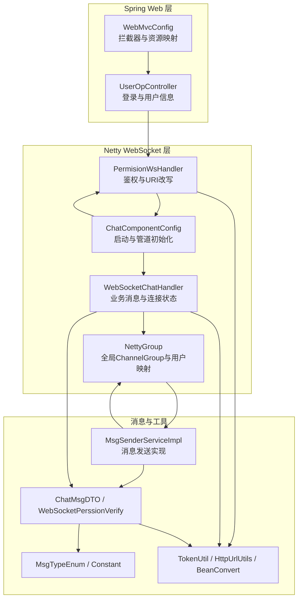
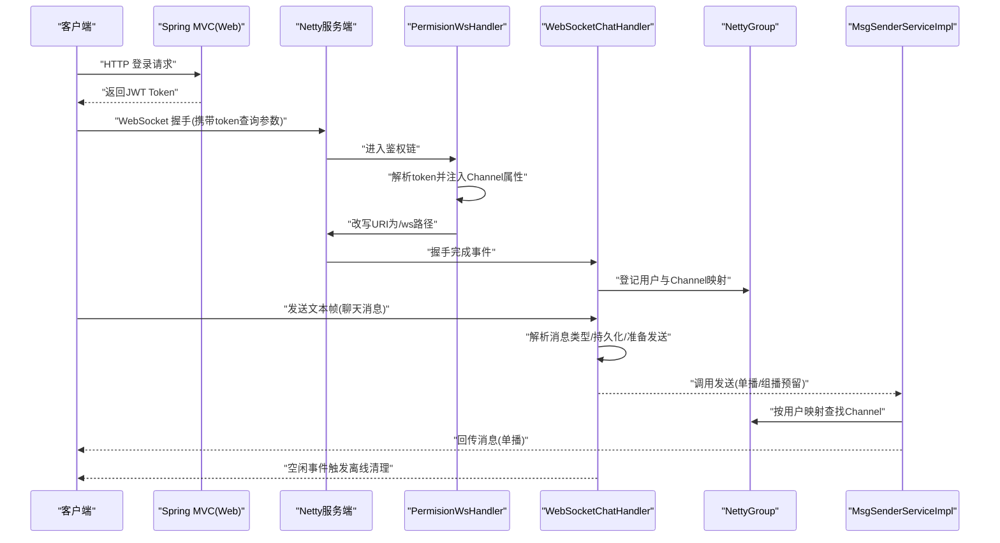
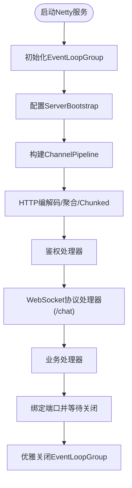
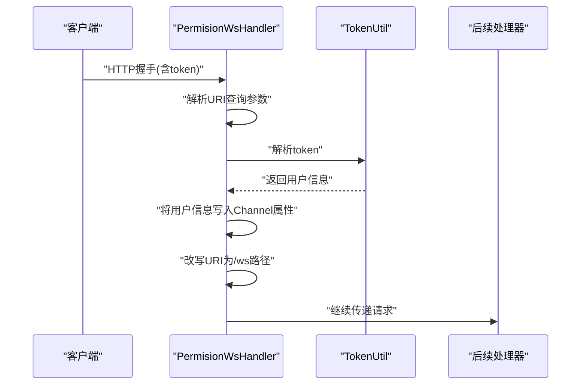
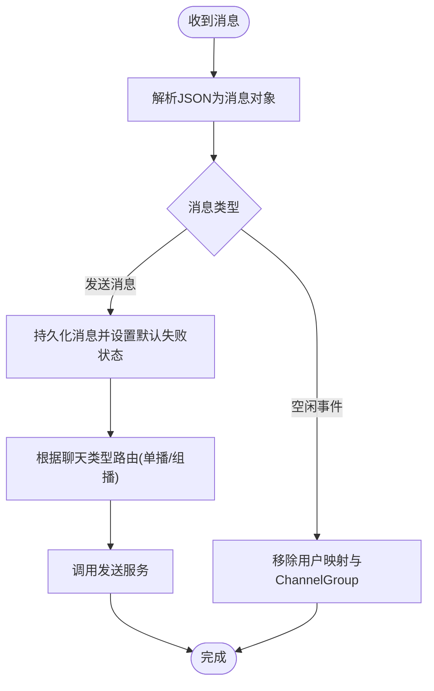
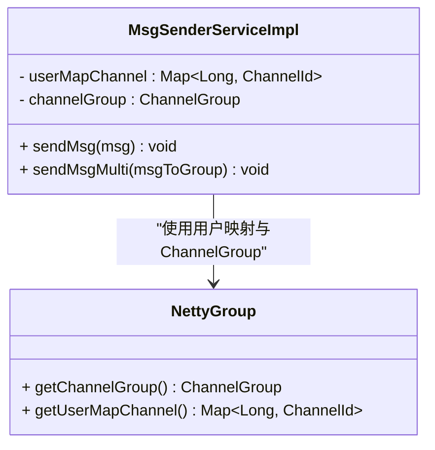
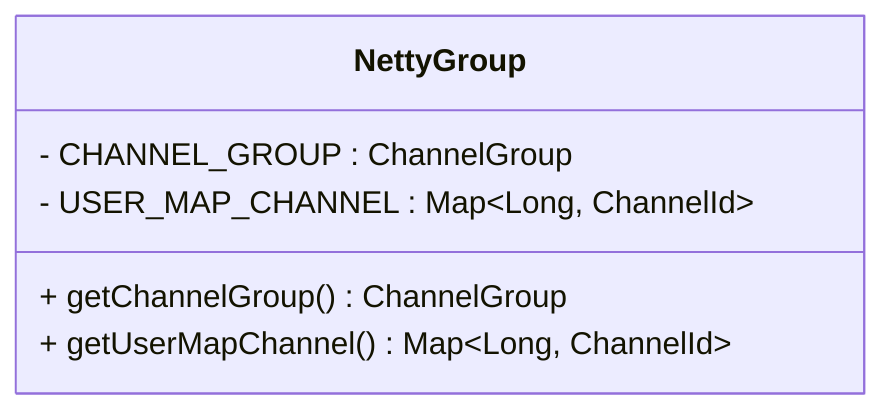
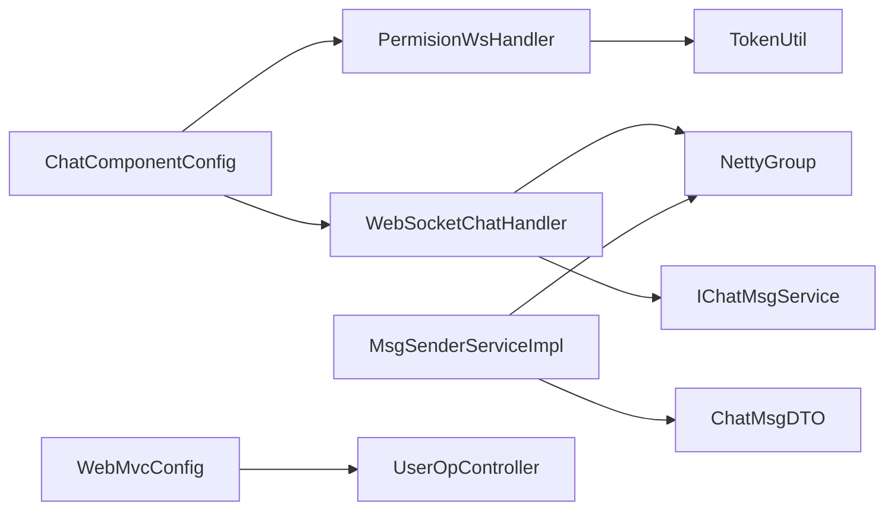

# WebSocket实时通信

<cite>
**本文引用的文件**
- [NettyGroup.java](file://src/main/java/com/hch/chat_simple/config/NettyGroup.java)
- [WebSocketChatHandler.java](file://src/main/java/com/hch/chat_simple/handler/WebSocketChatHandler.java)
- [PermisionWsHandler.java](file://src/main/java/com/hch/chat_simple/handler/PermisionWsHandler.java)
- [ChatComponentConfig.java](file://src/main/java/com/hch/chat_simple/config/ChatComponentConfig.java)
- [MsgSenderServiceImpl.java](file://src/main/java/com/hch/chat_simple/service/impl/MsgSenderServiceImpl.java)
- [TokenUtil.java](file://src/main/java/com/hch/chat_simple/util/TokenUtil.java)
- [HttpUrlUtils.java](file://src/main/java/com/hch/chat_simple/util/HttpUrlUtils.java)
- [WebSocketPerssionVerify.java](file://src/main/java/com/hch/chat_simple/pojo/dto/WebSocketPerssionVerify.java)
- [MsgTypeEnum.java](file://src/main/java/com/hch/chat_simple/enums/MsgTypeEnum.java)
- [application.yml](file://src/main/resources/application.yml)
- [WebMvcConfig.java](file://src/main/java/com/hch/chat_simple/config/WebMvcConfig.java)
- [UserOpController.java](file://src/main/java/com/hch/chat_simple/controller/UserOpController.java)
- [IChatMsgService.java](file://src/main/java/com/hch/chat_simple/service/IChatMsgService.java)
- [BeanConvert.java](file://src/main/java/com/hch/chat_simple/util/BeanConvert.java)
- [ChatMsgDTO.java](file://src/main/java/com/hch/chat_simple/pojo/dto/ChatMsgDTO.java)
- [Constant.java](file://src/main/java/com/hch/chat_simple/util/Constant.java)
</cite>

## 目录
1. [引言](#引言)
2. [项目结构](#项目结构)
3. [核心组件](#核心组件)
4. [架构总览](#架构总览)
5. [详细组件分析](#详细组件分析)
6. [依赖分析](#依赖分析)
7. [性能考虑](#性能考虑)
8. [故障排查指南](#故障排查指南)
9. [结论](#结论)
10. [附录](#附录)

## 引言
本文件面向WebSocket实时通信系统的技术实现与运维实践，围绕连接建立、握手协议、连接状态管理、消息处理器工作机制、连接池与生命周期管理、消息发送（单播/广播/组播）、API使用示例与最佳实践、性能优化与故障排查等方面进行系统化说明。读者无需具备深厚的网络编程背景，即可基于本文快速理解并部署、扩展该WebSocket子系统。

## 项目结构
该WebSocket子系统采用Spring Boot + Netty的组合方案：
- Spring Boot负责HTTP层拦截、跨域与登录拦截等Web层功能
- Netty负责WebSocket协议栈、连接管理、消息编解码与业务处理
- 通过自定义ChannelHandler链路完成鉴权、握手、业务消息处理与连接清理

图表来源
- [ChatComponentConfig.java:74-89](file://src/main/java/com/hch/chat_simple/config/ChatComponentConfig.java#L74-L89)
- [PermisionWsHandler.java:32-66](file://src/main/java/com/hch/chat_simple/handler/PermisionWsHandler.java#L32-L66)
- [WebSocketChatHandler.java:118-163](file://src/main/java/com/hch/chat_simple/handler/WebSocketChatHandler.java#L118-L163)
- [NettyGroup.java:11-29](file://src/main/java/com/hch/chat_simple/config/NettyGroup.java#L11-L29)
- [MsgSenderServiceImpl.java:25-79](file://src/main/java/com/hch/chat_simple/service/impl/MsgSenderServiceImpl.java#L25-L79)

章节来源
- [WebMvcConfig.java:9-27](file://src/main/java/com/hch/chat_simple/config/WebMvcConfig.java#L9-L27)
- [ChatComponentConfig.java:31-103](file://src/main/java/com/hch/chat_simple/config/ChatComponentConfig.java#L31-L103)

## 核心组件
- 连接与通道管理
  - NettyGroup：全局ChannelGroup与用户到ChannelId的映射，支撑单播查找与广播/组播遍历
- 鉴权与握手
  - PermisionWsHandler：从查询参数提取token，解析用户信息，注入到Channel属性，改写URI至WebSocket路径
  - ChatComponentConfig：构建Netty服务端，装配HTTP编解码、聚合器、WebSocket协议处理器与业务处理器
- 业务消息处理
  - WebSocketChatHandler：在握手完成后进行鉴权与上线登记；处理消息类型、持久化与发送；空闲事件触发离线清理
  - MsgSenderServiceImpl：根据用户映射定位目标Channel，执行单播；组播/广播逻辑预留
- 工具与模型
  - TokenUtil：JWT生成与校验，支持过期宽限窗口
  - HttpUrlUtils：解析URI查询参数
  - BeanConvert：对象/列表转换
  - WebSocketPerssionVerify：通道上下文中的用户信息载体
  - MsgTypeEnum、Constant：消息类型与通用常量

章节来源
- [NettyGroup.java:11-29](file://src/main/java/com/hch/chat_simple/config/NettyGroup.java#L11-L29)
- [PermisionWsHandler.java:26-81](file://src/main/java/com/hch/chat_simple/handler/PermisionWsHandler.java#L26-L81)
- [ChatComponentConfig.java:31-103](file://src/main/java/com/hch/chat_simple/config/ChatComponentConfig.java#L31-L103)
- [WebSocketChatHandler.java:50-196](file://src/main/java/com/hch/chat_simple/handler/WebSocketChatHandler.java#L50-L196)
- [MsgSenderServiceImpl.java:25-79](file://src/main/java/com/hch/chat_simple/service/impl/MsgSenderServiceImpl.java#L25-L79)
- [TokenUtil.java:18-71](file://src/main/java/com/hch/chat_simple/util/TokenUtil.java#L18-L71)
- [HttpUrlUtils.java:8-16](file://src/main/java/com/hch/chat_simple/util/HttpUrlUtils.java#L8-L16)
- [BeanConvert.java:14-70](file://src/main/java/com/hch/chat_simple/util/BeanConvert.java#L14-L70)
- [WebSocketPerssionVerify.java:7-22](file://src/main/java/com/hch/chat_simple/pojo/dto/WebSocketPerssionVerify.java#L7-L22)
- [MsgTypeEnum.java:6-25](file://src/main/java/com/hch/chat_simple/enums/MsgTypeEnum.java#L6-L25)
- [Constant.java:3-33](file://src/main/java/com/hch/chat_simple/util/Constant.java#L3-L33)

## 架构总览
WebSocket子系统由“Web层 + Netty层 + 消息层”构成，整体交互如下：

图表来源
- [PermisionWsHandler.java:32-66](file://src/main/java/com/hch/chat_simple/handler/PermisionWsHandler.java#L32-L66)
- [ChatComponentConfig.java:74-89](file://src/main/java/com/hch/chat_simple/config/ChatComponentConfig.java#L74-L89)
- [WebSocketChatHandler.java:118-163](file://src/main/java/com/hch/chat_simple/handler/WebSocketChatHandler.java#L118-L163)
- [NettyGroup.java:11-29](file://src/main/java/com/hch/chat_simple/config/NettyGroup.java#L11-L29)
- [MsgSenderServiceImpl.java:34-55](file://src/main/java/com/hch/chat_simple/service/impl/MsgSenderServiceImpl.java#L34-L55)

## 详细组件分析

### 组件A：连接与握手（ChatComponentConfig）
- 功能要点
  - 启动Netty服务端，绑定端口
  - 初始化ChannelPipeline：HTTP编解码、聚合、Chunked写入
  - 注册鉴权处理器与WebSocket协议处理器，最后接入业务处理器
  - 提供优雅关闭，释放EventLoopGroup
- 关键点
  - WebSocketServerProtocolHandler配置了路径、协议名称与最大帧大小
  - 使用CompletableFuture异步阻塞等待关闭，避免主线程阻塞

图表来源
- [ChatComponentConfig.java:48-89](file://src/main/java/com/hch/chat_simple/config/ChatComponentConfig.java#L48-L89)

章节来源
- [ChatComponentConfig.java:31-103](file://src/main/java/com/hch/chat_simple/config/ChatComponentConfig.java#L31-L103)

### 组件B：鉴权与握手（PermisionWsHandler）
- 功能要点
  - 从握手URI查询参数提取token
  - 解析token为用户信息，填充到Channel属性
  - 将请求URI改写为固定WebSocket路径，交由后续处理器
- 错误处理
  - 异常捕获并关闭Channel，防止资源泄漏

图表来源
- [PermisionWsHandler.java:32-66](file://src/main/java/com/hch/chat_simple/handler/PermisionWsHandler.java#L32-L66)
- [TokenUtil.java:61-69](file://src/main/java/com/hch/chat_simple/util/TokenUtil.java#L61-L69)

章节来源
- [PermisionWsHandler.java:26-81](file://src/main/java/com/hch/chat_simple/handler/PermisionWsHandler.java#L26-L81)
- [TokenUtil.java:18-71](file://src/main/java/com/hch/chat_simple/util/TokenUtil.java#L18-L71)

### 组件C：业务消息与连接状态（WebSocketChatHandler）
- 功能要点
  - 在握手完成后进行鉴权与上线登记，维护用户映射与ChannelGroup
  - 解析消息JSON，构造消息对象，持久化消息记录，设置默认发送状态
  - 根据消息类型选择单播/组播（当前注释掉MQ发送，直接本地处理）
  - 空闲事件触发离线清理，移除用户映射与ChannelGroup条目
- 错误处理
  - 捕获异常并关闭Channel

图表来源
- [WebSocketChatHandler.java:73-109](file://src/main/java/com/hch/chat_simple/handler/WebSocketChatHandler.java#L73-L109)
- [WebSocketChatHandler.java:118-163](file://src/main/java/com/hch/chat_simple/handler/WebSocketChatHandler.java#L118-L163)

章节来源
- [WebSocketChatHandler.java:50-196](file://src/main/java/com/hch/chat_simple/handler/WebSocketChatHandler.java#L50-L196)

### 组件D：消息发送（MsgSenderServiceImpl）
- 功能要点
  - 单播：根据用户ID查找到ChannelId，再在ChannelGroup中定位Channel并发送
  - 组播/广播：预留过滤当前用户、逐个转发的流程
- 异步回调
  - 写入与刷新后监听发送结果，便于记录状态与后续重试

图表来源
- [MsgSenderServiceImpl.java:25-79](file://src/main/java/com/hch/chat_simple/service/impl/MsgSenderServiceImpl.java#L25-L79)
- [NettyGroup.java:11-29](file://src/main/java/com/hch/chat_simple/config/NettyGroup.java#L11-L29)

章节来源
- [MsgSenderServiceImpl.java:25-79](file://src/main/java/com/hch/chat_simple/service/impl/MsgSenderServiceImpl.java#L25-L79)
- [NettyGroup.java:11-29](file://src/main/java/com/hch/chat_simple/config/NettyGroup.java#L11-L29)

### 组件E：连接池与生命周期（NettyGroup）
- 功能要点
  - 全局ChannelGroup：统一管理所有活跃WebSocket连接
  - 用户到ChannelId映射：基于用户ID快速定位目标连接
- 生命周期
  - 上线：握手完成时登记
  - 下线：空闲事件或异常时移除

图表来源
- [NettyGroup.java:11-29](file://src/main/java/com/hch/chat_simple/config/NettyGroup.java#L11-L29)

章节来源
- [NettyGroup.java:11-29](file://src/main/java/com/hch/chat_simple/config/NettyGroup.java#L11-L29)

### 组件F：消息模型与枚举
- ChatMsgDTO：封装消息字段（类型、内容、时间、群组ID等）
- MsgTypeEnum：消息类型枚举（上线、发送消息、下线、好友相关、群组相关等）
- WebSocketPerssionVerify：通道上下文中的用户信息载体
- Constant：消息状态、聊天类型、时区、群组状态等常量

章节来源
- [ChatMsgDTO.java:11-62](file://src/main/java/com/hch/chat_simple/pojo/dto/ChatMsgDTO.java#L11-L62)
- [MsgTypeEnum.java:6-25](file://src/main/java/com/hch/chat_simple/enums/MsgTypeEnum.java#L6-L25)
- [WebSocketPerssionVerify.java:7-22](file://src/main/java/com/hch/chat_simple/pojo/dto/WebSocketPerssionVerify.java#L7-L22)
- [Constant.java:3-33](file://src/main/java/com/hch/chat_simple/util/Constant.java#L3-L33)

## 依赖分析
- 组件耦合
  - ChatComponentConfig依赖PermisionWsHandler与WebSocketChatHandler，形成清晰的职责边界
  - WebSocketChatHandler依赖NettyGroup、TokenUtil、消息服务接口与MQ配置（当前注释）
  - MsgSenderServiceImpl依赖NettyGroup与消息DTO
- 外部依赖
  - Spring Web：拦截器、Swagger资源映射
  - RocketMQ：消息队列（当前消息发送逻辑注释，保留配置）
  - Redis/Redisson：应用配置（非WebSocket直连）

图表来源
- [ChatComponentConfig.java:38-41](file://src/main/java/com/hch/chat_simple/config/ChatComponentConfig.java#L38-L41)
- [PermisionWsHandler.java:49-56](file://src/main/java/com/hch/chat_simple/handler/PermisionWsHandler.java#L49-L56)
- [WebSocketChatHandler.java:63-64](file://src/main/java/com/hch/chat_simple/handler/WebSocketChatHandler.java#L63-L64)
- [MsgSenderServiceImpl.java:27-28](file://src/main/java/com/hch/chat_simple/service/impl/MsgSenderServiceImpl.java#L27-L28)
- [WebMvcConfig.java:12-16](file://src/main/java/com/hch/chat_simple/config/WebMvcConfig.java#L12-L16)
- [UserOpController.java:44-66](file://src/main/java/com/hch/chat_simple/controller/UserOpController.java#L44-L66)

章节来源
- [application.yml:39-51](file://src/main/resources/application.yml#L39-L51)
- [WebMvcConfig.java:9-27](file://src/main/java/com/hch/chat_simple/config/WebMvcConfig.java#L9-L27)
- [UserOpController.java:35-114](file://src/main/java/com/hch/chat_simple/controller/UserOpController.java#L35-L114)

## 性能考虑
- 连接池与线程
  - 使用NioEventLoopGroup分离主从线程，合理设置工作线程数以匹配CPU核数
  - ChannelGroup为并发安全容器，适合高并发场景下的广播/组播
- 消息发送
  - 单播通过用户映射快速定位Channel，避免全量遍历
  - 发送后监听结果，便于失败重试与状态回写
- 资源回收
  - 空闲事件触发离线清理，降低内存占用
  - 优雅关闭EventLoopGroup，避免资源泄漏
- 可选优化
  - 引入Redis作为用户映射的分布式缓存，支持多实例共享
  - 对消息发送增加背压与限流策略
  - 结合Netty IdleStateHandler配置读/写/全部空闲阈值

[本节为通用指导，不直接分析具体文件]

## 故障排查指南
- 握手失败
  - 检查WebSocketServerProtocolHandler路径与协议配置是否一致
  - 确认PermisionWsHandler是否正确解析token并改写URI
- 认证失败
  - 核对TokenUtil的签名算法、issuer与过期宽限配置
  - 检查Channel属性中WebSocketPerssionVerify是否注入成功
- 消息未送达
  - 确认用户是否在线（用户映射是否存在）
  - 检查ChannelGroup中是否存在对应Channel
  - 查看发送回调日志，定位发送失败原因
- 连接异常断开
  - 观察空闲事件是否被触发，确认清理逻辑是否正确执行
  - 检查异常捕获与Channel关闭流程

章节来源
- [PermisionWsHandler.java:68-72](file://src/main/java/com/hch/chat_simple/handler/PermisionWsHandler.java#L68-L72)
- [WebSocketChatHandler.java:112-116](file://src/main/java/com/hch/chat_simple/handler/WebSocketChatHandler.java#L112-L116)
- [WebSocketChatHandler.java:165-175](file://src/main/java/com/hch/chat_simple/handler/WebSocketChatHandler.java#L165-L175)

## 结论
该WebSocket子系统通过Spring Boot与Netty的协作，实现了从鉴权、握手到消息处理与连接管理的完整闭环。其核心优势在于：
- 清晰的职责划分与可扩展的处理器链
- 基于ChannelGroup与用户映射的消息路由
- 完备的连接生命周期管理与异常恢复
建议在生产环境中结合Redis实现用户映射的分布式化，并引入背压与限流策略以进一步提升稳定性与吞吐能力。

[本节为总结性内容，不直接分析具体文件]

## 附录

### WebSocket API使用示例与最佳实践
- 连接建立
  - 使用浏览器或SDK发起WebSocket握手，URL携带token查询参数
  - 服务端将自动解析token并完成鉴权与上线登记
- 心跳检测
  - 建议客户端定期发送ping帧，服务端可通过IdleStateHandler检测空闲并清理
- 错误处理
  - 客户端应监听连接异常与断开事件，实现指数退避重连
- 权限验证
  - 服务端在握手完成后校验token有效性，无效则拒绝登记
- 消息发送模式
  - 单播：通过用户映射直接发送
  - 组播/广播：遍历用户映射并逐个发送（当前实现预留）

章节来源
- [PermisionWsHandler.java:32-66](file://src/main/java/com/hch/chat_simple/handler/PermisionWsHandler.java#L32-L66)
- [WebSocketChatHandler.java:118-163](file://src/main/java/com/hch/chat_simple/handler/WebSocketChatHandler.java#L118-L163)
- [MsgSenderServiceImpl.java:34-77](file://src/main/java/com/hch/chat_simple/service/impl/MsgSenderServiceImpl.java#L34-L77)

### 配置参考
- Netty服务端口：chat.server.port
- RocketMQ主题：mq.topic.single-chat、mq.topic.multi-chat
- Redisson连接参数：连接池大小、最小空闲连接数等

章节来源
- [application.yml:39-89](file://src/main/resources/application.yml#L39-L89)