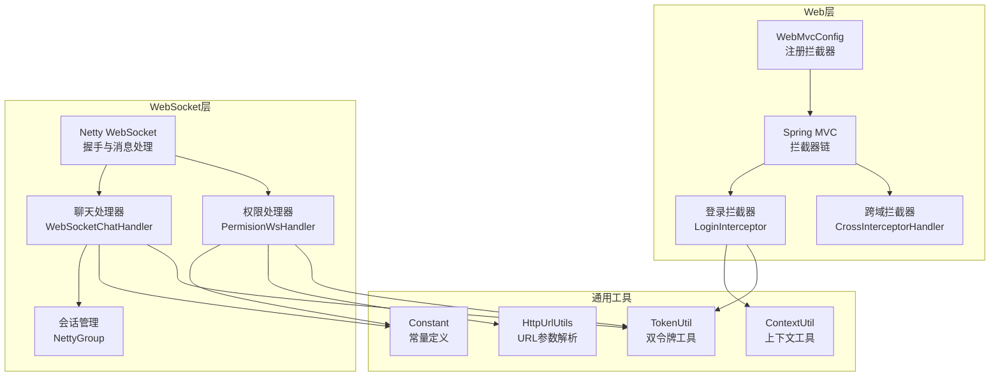
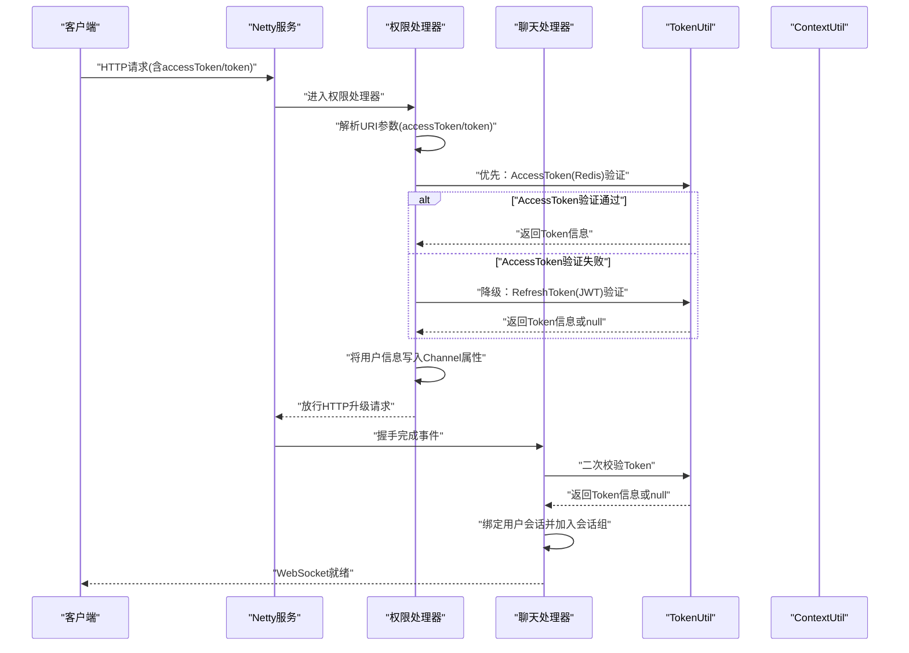
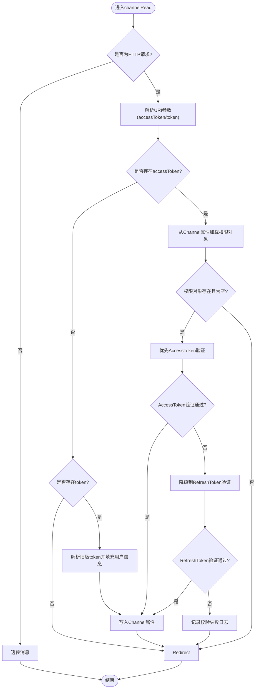
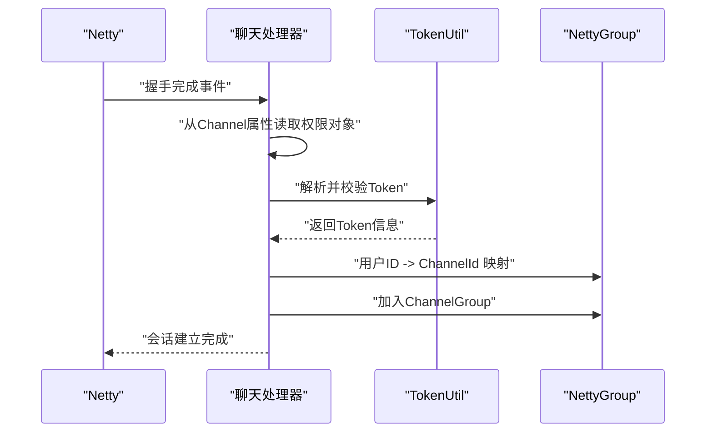
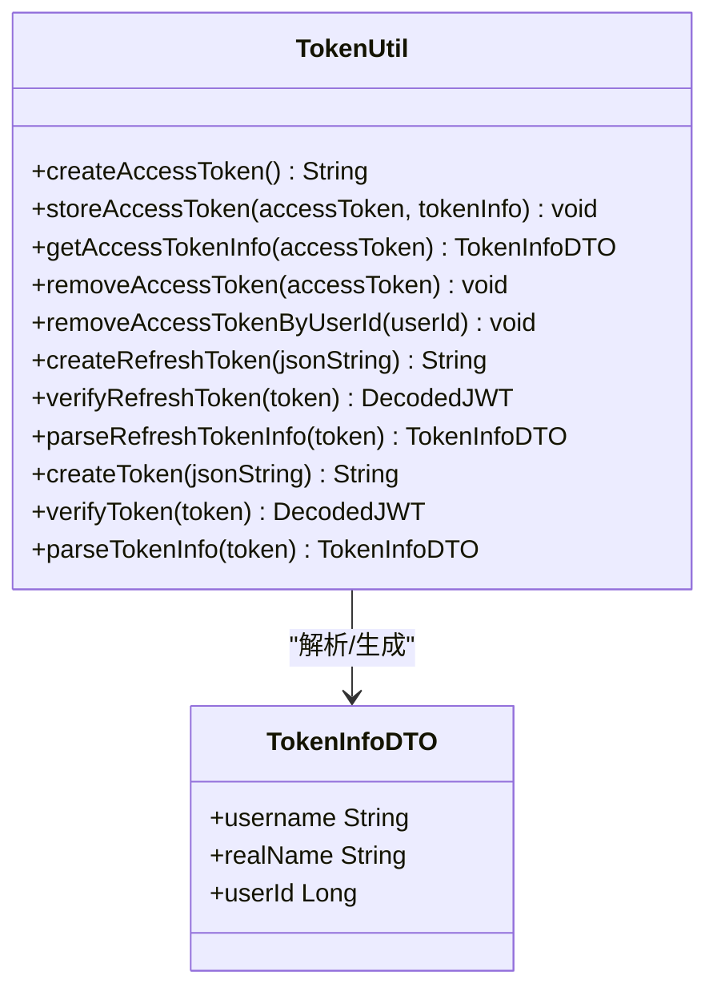
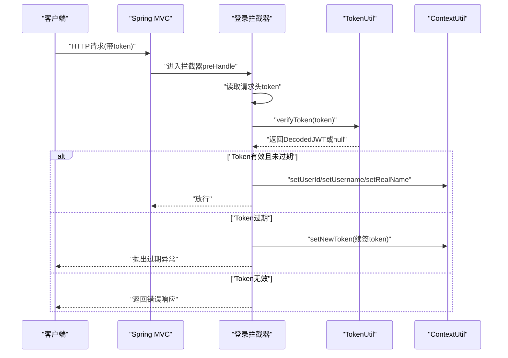
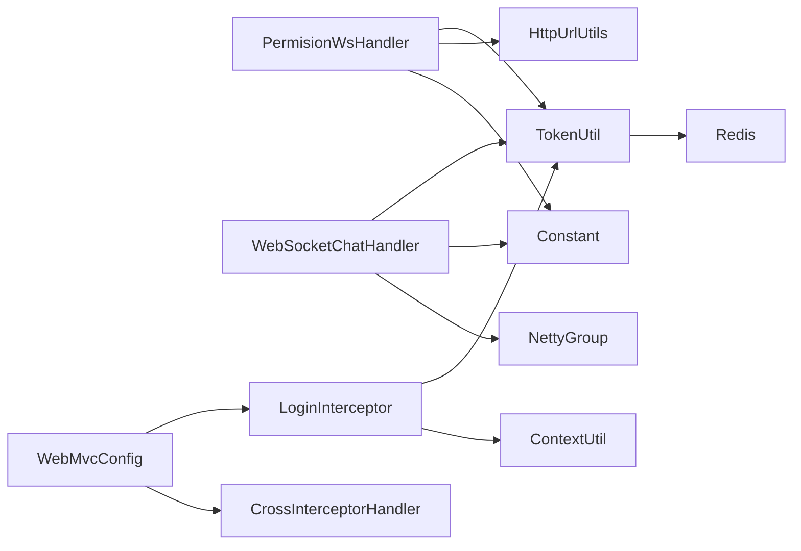

# 权限验证与安全

<cite>
**本文引用的文件**
- [WebSocket权限验证模型（WebSocketPerssionVerify）](file://src/main/java/com/hch/chat_simple/pojo/dto/WebSocketPerssionVerify.java)
- [WebSocket权限处理器（PermisionWsHandler）](file://src/main/java/com/hch/chat_simple/handler/PermisionWsHandler.java)
- [WebSocket聊天处理器（WebSocketChatHandler）](file://src/main/java/com/hch/chat_simple/handler/WebSocketChatHandler.java)
- [令牌工具（TokenUtil）](file://src/main/java/com/hch/chat_simple/util/TokenUtil.java)
- [上下文工具（ContextUtil）](file://src/main/java/com/hch/chat_simple/util/ContextUtil.java)
- [常量定义（Constant）](file://src/main/java/com/hch/chat_simple/util/Constant.java)
- [HTTP参数解析工具（HttpUrlUtils）](file://src/main/java/com/hch/chat_simple/util/HttpUrlUtils.java)
- [Web MVC配置（WebMvcConfig）](file://src/main/java/com/hch/chat_simple/config/WebMvcConfig.java)
- [跨域拦截器（CrossInterceptorHandler）](file://src/main/java/com/hch/chat_simple/config/CrossInterceptorHandler.java)
- [登录拦截器（LoginInterceptor）](file://src/main/java/com/hch/chat_simple/config/LoginInterceptor.java)
- [Netty会话管理（NettyGroup）](file://src/main/java/com/hch/chat_simple/config/NettyGroup.java)
- [应用配置（application.yml）](file://src/main/resources/application.yml)
- [用户操作控制器（UserOpController）](file://src/main/java/com/hch/chat_simple/controller/UserOpController.java)
</cite>

## 更新摘要
**变更内容**
- 更新WebSocket权限处理器实现，新增双令牌验证优先级机制
- 优化权限验证流程，优先使用AccessToken（Redis）进行校验，降级到RefreshToken（JWT）
- 增强与HTTP接口的一致性，确保WebSocket与REST接口使用相同的令牌验证策略
- 完善令牌工具类，支持AccessToken和RefreshToken的分离管理

## 目录
1. [引言](#引言)
2. [项目结构](#项目结构)
3. [核心组件](#核心组件)
4. [架构总览](#架构总览)
5. [详细组件分析](#详细组件分析)
6. [依赖分析](#依赖分析)
7. [性能考虑](#性能考虑)
8. [故障排查指南](#故障排查指南)
9. [结论](#结论)
10. [附录](#附录)

## 引言
本文件聚焦于WebSocket握手阶段的权限验证与安全机制，系统性阐述从双令牌验证、用户身份确认、权限校验到会话状态维护的完整流程。重点覆盖以下方面：
- WebSocket握手阶段的双令牌验证流程与实现细节
- 权限处理器（WebSocketPerssionVerify）的创建、管理与生命周期
- 双令牌机制：AccessToken（Redis短期有效）与RefreshToken（JWT长期有效）的协同工作
- JWT Token在WebSocket中的传递、过期与续签策略
- 安全防护措施：非法连接拦截、重复登录处理、会话劫持防范
- 最佳实践：Token安全存储、传输加密、权限最小化
- 安全监控与审计方法，以及常见安全问题的预防与处置

## 项目结构
本项目采用Spring Boot + Netty的混合架构，围绕WebSocket聊天功能构建。权限验证涉及Web层拦截器与Netty通道处理器两部分：
- Web层：基于Spring MVC的拦截器链，负责HTTP接口的双令牌校验与上下文注入
- WebSocket层：基于Netty的握手与消息处理，负责WebSocket连接的双令牌验证与会话管理

**图表来源**
- [WebMvcConfig.java:12-16](file://src/main/java/com/hch/chat_simple/config/WebMvcConfig.java#L12-L16)
- [CrossInterceptorHandler.java:8-25](file://src/main/java/com/hch/chat_simple/config/CrossInterceptorHandler.java#L8-L25)
- [LoginInterceptor.java:28-90](file://src/main/java/com/hch/chat_simple/config/LoginInterceptor.java#L28-L90)
- [PermisionWsHandler.java:26-80](file://src/main/java/com/hch/chat_simple/handler/PermisionWsHandler.java#L26-L80)
- [WebSocketChatHandler.java:50-195](file://src/main/java/com/hch/chat_simple/handler/WebSocketChatHandler.java#L50-L195)
- [TokenUtil.java:18-70](file://src/main/java/com/hch/chat_simple/util/TokenUtil.java#L18-L70)
- [ContextUtil.java:5-51](file://src/main/java/com/hch/chat_simple/util/ContextUtil.java#L5-L51)
- [HttpUrlUtils.java:8-15](file://src/main/java/com/hch/chat_simple/util/HttpUrlUtils.java#L8-L15)
- [Constant.java:3-32](file://src/main/java/com/hch/chat_simple/util/Constant.java#L3-L32)
- [NettyGroup.java:11-29](file://src/main/java/com/hch/chat_simple/config/NettyGroup.java#L11-L29)

**章节来源**
- [WebMvcConfig.java:8-27](file://src/main/java/com/hch/chat_simple/config/WebMvcConfig.java#L8-L27)
- [application.yml:1-89](file://src/main/resources/application.yml#L1-L89)

## 核心组件
- WebSocket权限验证模型（WebSocketPerssionVerify）
  - 作用：承载WebSocket握手阶段解析出的用户信息（Token、用户ID、登录名、真实名）
  - 关键字段：token、userId、username、realName
- 权限处理器（PermisionWsHandler）
  - 作用：在HTTP升级阶段解析URI中的accessToken和token参数，完成双令牌验证，并将用户信息绑定到Netty Channel属性
  - **更新**：新增双令牌验证优先级，优先使用AccessToken（Redis）验证，降级到RefreshToken（JWT）
- 聊天处理器（WebSocketChatHandler）
  - 作用：在握手完成后进行二次校验与会话绑定，维护用户到Channel的映射，处理消息发送与离线逻辑
- 令牌工具（TokenUtil）
  - 作用：生成与验证JWT Token，解析Token中的用户信息，支持双令牌机制
  - **更新**：新增AccessToken（Redis短期有效）和RefreshToken（JWT长期有效）的分离管理
- 上下文工具（ContextUtil）
  - 作用：在线程上下文中保存用户标识，供Web层业务使用
- 常量定义（Constant）
  - 作用：统一管理Netty通道属性键名等常量
- HTTP参数解析工具（HttpUrlUtils）
  - 作用：从URI中提取查询参数（如accessToken、token）

**章节来源**
- [WebSocketPerssionVerify.java:7-21](file://src/main/java/com/hch/chat_simple/pojo/dto/WebSocketPerssionVerify.java#L7-L21)
- [PermisionWsHandler.java:26-80](file://src/main/java/com/hch/chat_simple/handler/PermisionWsHandler.java#L26-L80)
- [WebSocketChatHandler.java:50-195](file://src/main/java/com/hch/chat_simple/handler/WebSocketChatHandler.java#L50-L195)
- [TokenUtil.java:18-70](file://src/main/java/com/hch/chat_simple/util/TokenUtil.java#L18-L70)
- [ContextUtil.java:5-51](file://src/main/java/com/hch/chat_simple/util/ContextUtil.java#L5-L51)
- [Constant.java:3-32](file://src/main/java/com/hch/chat_simple/util/Constant.java#L3-L32)
- [HttpUrlUtils.java:8-15](file://src/main/java/com/hch/chat_simple/util/HttpUrlUtils.java#L8-L15)

## 架构总览
WebSocket权限验证与安全的整体流程如下：
- 客户端发起HTTP请求并携带accessToken或token参数
- Netty权限处理器在HTTP升级前解析双令牌，优先使用AccessToken验证，失败时降级到RefreshToken
- 握手完成后，聊天处理器再次校验token，绑定用户会话，加入全局会话组
- Web层拦截器负责REST接口的双令牌校验与上下文注入
- 应用配置文件提供Redis、RocketMQ、MinIO等基础设施支持

**图表来源**
- [PermisionWsHandler.java:32-66](file://src/main/java/com/hch/chat_simple/handler/PermisionWsHandler.java#L32-L66)
- [WebSocketChatHandler.java:119-162](file://src/main/java/com/hch/chat_simple/handler/WebSocketChatHandler.java#L119-L162)
- [TokenUtil.java:48-69](file://src/main/java/com/hch/chat_simple/util/TokenUtil.java#L48-L69)
- [HttpUrlUtils.java:10-14](file://src/main/java/com/hch/chat_simple/util/HttpUrlUtils.java#L10-L14)

## 详细组件分析

### 权限处理器（PermisionWsHandler）分析
- 功能职责
  - 在HTTP升级阶段从URI参数中提取accessToken和token参数
  - **更新**：实现双令牌验证优先级，优先使用AccessToken（Redis）验证，失败时降级到RefreshToken（JWT）
  - 调用TokenUtil解析并校验token，填充用户信息
  - 将WebSocketPerssionVerify对象写入Channel属性，供后续握手完成事件使用
  - 将请求URI重定向至配置的WebSocket路径，确保后续协议处理一致
- 关键实现点
  - URI参数解析：使用HttpUrlUtils从URI中提取accessToken和token参数
  - **更新**：双令牌验证优先级实现，先尝试AccessToken验证，再降级到RefreshToken
  - Token解析：调用TokenUtil.getAccessTokenInfo()和TokenUtil.parseTokenInfo()分别处理Redis和JWT令牌
  - 属性绑定：通过AttributeKey将权限对象写入Channel，避免重复解析
  - 异常处理：捕获异常并关闭通道，防止非法连接

**图表来源**
- [PermisionWsHandler.java:32-66](file://src/main/java/com/hch/chat_simple/handler/PermisionWsHandler.java#L32-L66)
- [HttpUrlUtils.java:10-14](file://src/main/java/com/hch/chat_simple/util/HttpUrlUtils.java#L10-L14)
- [TokenUtil.java:61-69](file://src/main/java/com/hch/chat_simple/util/TokenUtil.java#L61-L69)
- [Constant.java](file://src/main/java/com/hch/chat_simple/util/Constant.java#L6)

**章节来源**
- [PermisionWsHandler.java:26-80](file://src/main/java/com/hch/chat_simple/handler/PermisionWsHandler.java#L26-L80)

### 聊天处理器（WebSocketChatHandler）分析
- 功能职责
  - 在握手完成后进行二次Token校验，确保连接有效性
  - 绑定用户会话：将用户ID与ChannelId映射，加入ChannelGroup
  - 处理消息发送：解析消息内容，填充发送者信息，持久化消息并异步推送
  - 会话清理：检测空闲事件，移除失效会话
- 关键实现点
  - 握手完成事件：userEventTriggered中进行二次校验与会话绑定
  - 会话管理：通过NettyGroup维护全局ChannelGroup与用户映射
  - 消息处理：channelRead0中解析消息并调用服务层持久化

**图表来源**
- [WebSocketChatHandler.java:119-162](file://src/main/java/com/hch/chat_simple/handler/WebSocketChatHandler.java#L119-L162)
- [TokenUtil.java:61-69](file://src/main/java/com/hch/chat_simple/util/TokenUtil.java#L61-L69)
- [NettyGroup.java:11-29](file://src/main/java/com/hch/chat_simple/config/NettyGroup.java#L11-L29)

**章节来源**
- [WebSocketChatHandler.java:50-195](file://src/main/java/com/hch/chat_simple/handler/WebSocketChatHandler.java#L50-L195)
- [NettyGroup.java:11-29](file://src/main/java/com/hch/chat_simple/config/NettyGroup.java#L11-L29)

### 令牌工具（TokenUtil）分析
- 功能职责
  - **更新**：支持双令牌机制，分离管理AccessToken和RefreshToken
  - AccessToken管理：创建、存储、获取、删除Redis中的短期访问令牌
  - RefreshToken管理：创建、验证、解析JWT格式的长期刷新令牌
  - 生成JWT Token：以JSON字符串作为subject，设置签发方、过期时间与签名算法
  - 验证JWT Token：构建JWTVerifier，校验签发方与过期时间
  - 解析Token信息：从Token的subject中反序列化为TokenInfoDTO
- 关键实现点
  - **更新**：AccessToken使用Redis存储，30分钟有效期，支持按用户维度失效
  - **更新**：RefreshToken使用JWT格式，7天有效期，存储在浏览器端
  - 密钥与过期时间：使用固定密钥与分钟级过期时间
  - 过期宽限：verifyToken支持一定范围内的过期宽限，用于换取新Token
  - 签发方校验：严格校验issuer，防止伪造

**图表来源**
- [TokenUtil.java:18-70](file://src/main/java/com/hch/chat_simple/util/TokenUtil.java#L18-L70)
- [TokenInfoDTO.java:14-19](file://src/main/java/com/hch/chat_simple/pojo/dto/TokenInfoDTO.java#L14-L19)

**章节来源**
- [TokenUtil.java:18-70](file://src/main/java/com/hch/chat_simple/util/TokenUtil.java#L18-L70)
- [TokenInfoDTO.java:14-19](file://src/main/java/com/hch/chat_simple/pojo/dto/TokenInfoDTO.java#L14-L19)

### Web层拦截器与上下文（LoginInterceptor、ContextUtil）
- 登录拦截器（LoginInterceptor）
  - 从请求头读取token，调用TokenUtil验证
  - 对过期场景生成新token并通过ContextUtil.setNewToken传递
  - 将用户信息写入ContextUtil，供业务方法使用
- 上下文工具（ContextUtil）
  - 使用TransmittableThreadLocal在多线程场景下传递用户上下文
  - 提供清理方法，在afterCompletion中清空上下文

**图表来源**
- [LoginInterceptor.java:30-90](file://src/main/java/com/hch/chat_simple/config/LoginInterceptor.java#L30-L90)
- [TokenUtil.java:48-69](file://src/main/java/com/hch/chat_simple/util/TokenUtil.java#L48-L69)
- [ContextUtil.java:12-49](file://src/main/java/com/hch/chat_simple/util/ContextUtil.java#L12-L49)

**章节来源**
- [LoginInterceptor.java:28-109](file://src/main/java/com/hch/chat_simple/config/LoginInterceptor.java#L28-L109)
- [ContextUtil.java:5-51](file://src/main/java/com/hch/chat_simple/util/ContextUtil.java#L5-L51)

### 跨域与配置（CrossInterceptorHandler、application.yml）
- 跨域拦截器（CrossInterceptorHandler）
  - 设置Access-Control-Allow-Origin、Credentials、Methods、Headers等响应头
  - 支持预检请求缓存时间配置
- 应用配置（application.yml）
  - 提供Redis、MyBatis-Plus、RocketMQ、MinIO等基础设施配置
  - 可配置WebSocket路径（ws.netty.path），默认值为/chat

**章节来源**
- [CrossInterceptorHandler.java:8-27](file://src/main/java/com/hch/chat_simple/config/CrossInterceptorHandler.java#L8-L27)
- [application.yml:1-89](file://src/main/resources/application.yml#L1-L89)

### 用户操作控制器（UserOpController）分析
- **更新**：新增双令牌登录接口，支持AccessToken和RefreshToken的生成
- 登录接口：返回双Token对，包括短期AccessToken和长期RefreshToken
- 刷新接口：根据RefreshToken生成新的AccessToken
- 登出接口：删除Redis中的AccessToken，实现按用户维度的令牌失效

**章节来源**
- [UserOpController.java:49-81](file://src/main/java/com/hch/chat_simple/controller/UserOpController.java#L49-L81)
- [UserOpController.java:89-118](file://src/main/java/com/hch/chat_simple/controller/UserOpController.java#L89-L118)
- [UserOpController.java:123-131](file://src/main/java/com/hch/chat_simple/controller/UserOpController.java#L123-L131)

## 依赖分析
- 组件耦合
  - PermisionWsHandler依赖TokenUtil与HttpUrlUtils，负责握手阶段的双令牌验证
  - WebSocketChatHandler依赖TokenUtil与NettyGroup，负责握手后的会话管理
  - LoginInterceptor依赖TokenUtil与ContextUtil，负责Web层的权限校验与上下文注入
- 外部依赖
  - JWT库：用于Token生成与验证
  - Netty：用于WebSocket协议处理与会话管理
  - Spring MVC：用于HTTP接口与拦截器链
  - Redis：用于AccessToken的存储与管理

**图表来源**
- [PermisionWsHandler.java:8-21](file://src/main/java/com/hch/chat_simple/handler/PermisionWsHandler.java#L8-L21)
- [WebSocketChatHandler.java:14-26](file://src/main/java/com/hch/chat_simple/handler/WebSocketChatHandler.java#L14-L26)
- [LoginInterceptor.java:17-20](file://src/main/java/com/hch/chat_simple/config/LoginInterceptor.java#L17-L20)
- [WebMvcConfig.java:12-16](file://src/main/java/com/hch/chat_simple/config/WebMvcConfig.java#L12-L16)
- [CrossInterceptorHandler.java:8-25](file://src/main/java/com/hch/chat_simple/config/CrossInterceptorHandler.java#L8-L25)

**章节来源**
- [WebMvcConfig.java:8-27](file://src/main/java/com/hch/chat_simple/config/WebMvcConfig.java#L8-L27)

## 性能考虑
- 会话存储
  - 当前使用内存Map与ChannelGroup存储会话映射，适合单实例部署；生产环境建议迁移到Redis等分布式缓存，以支持多实例水平扩展
- **更新**：Redis令牌存储优化
  - AccessToken使用Redis存储，支持快速验证和按用户维度失效
  - Redis连接池配置，支持高并发场景下的令牌验证
- 并发处理
  - WebSocketChatHandler使用固定线程池处理消息，需根据QPS调整线程池大小
- Token过期与续签
  - AccessToken（30分钟）和RefreshToken（7天）的分离设计，平衡安全性与用户体验
  - 过期宽限与续签策略应结合业务场景权衡，避免频繁续签导致的性能损耗
- 空闲检测
  - IdleStateEvent用于清理长时间空闲的会话，降低资源占用

## 故障排查指南
- WebSocket握手失败
  - 检查URI中是否包含accessToken或token参数，确认PermisionWsHandler是否正确解析
  - **更新**：确认双令牌验证流程，优先检查AccessToken，再检查RefreshToken
  - 查看TokenUtil的getAccessTokenInfo和verifyToken结果，确认签发方与过期时间
- 会话未绑定
  - 确认握手完成事件是否触发userEventTriggered
  - 检查WebSocketChatHandler中是否正确读取Channel属性并写入NettyGroup
- Web层Token校验失败
  - 检查请求头是否包含token，确认LoginInterceptor是否正确执行
  - 若出现Token过期，确认ContextUtil是否设置了新token并返回给前端
- 跨域问题
  - 检查CrossInterceptorHandler的响应头配置，确保Origin与Credentials匹配
- **新增**：双令牌验证问题
  - 检查Redis中AccessToken是否有效，确认Redis连接配置
  - 验证RefreshToken格式和签发方，确保JWT签名正确
  - 查看权限处理器的日志输出，确认令牌验证优先级执行情况

**章节来源**
- [PermisionWsHandler.java:32-80](file://src/main/java/com/hch/chat_simple/handler/PermisionWsHandler.java#L32-L80)
- [WebSocketChatHandler.java:119-162](file://src/main/java/com/hch/chat_simple/handler/WebSocketChatHandler.java#L119-L162)
- [LoginInterceptor.java:30-90](file://src/main/java/com/hch/chat_simple/config/LoginInterceptor.java#L30-L90)
- [CrossInterceptorHandler.java:8-27](file://src/main/java/com/hch/chat_simple/config/CrossInterceptorHandler.java#L8-L27)

## 结论
本系统在WebSocket握手阶段实现了基于双令牌的权限验证与会话管理，结合Web层拦截器形成完整的安全控制闭环。通过Channel属性与上下文工具的配合，实现了用户信息在不同层级间的传递与校验。**更新**：新增的双令牌验证优先级机制，优先使用AccessToken（Redis）进行验证，降级到RefreshToken（JWT），确保了与HTTP接口的一致性和更高的安全性。建议在生产环境中引入分布式缓存与更严格的Token安全策略，持续优化性能与安全性。

## 附录
- 最佳实践
  - **更新**：双令牌安全策略
    - AccessToken（Redis短期有效）：30分钟有效期，支持按用户维度失效
    - RefreshToken（JWT长期有效）：7天有效期，存储在浏览器端
    - 优先使用AccessToken进行验证，失败时降级到RefreshToken
  - Token安全存储：前端仅在内存中持有短期Token，避免本地持久化
  - 传输加密：强制使用WSS（WebSocket Secure）与HTTPS，防止中间人攻击
  - 权限最小化：按业务维度下发最小权限的Token，定期轮换密钥
  - 会话管理：多实例部署时使用Redis存储会话映射，避免会话漂移
- 安全监控与审计
  - 记录Token解析与校验日志，设置告警阈值
  - 审计用户上线/下线、消息发送与异常事件
  - 定期审查跨域配置与CORS策略
  - **新增**：监控双令牌验证成功率和降级触发频率