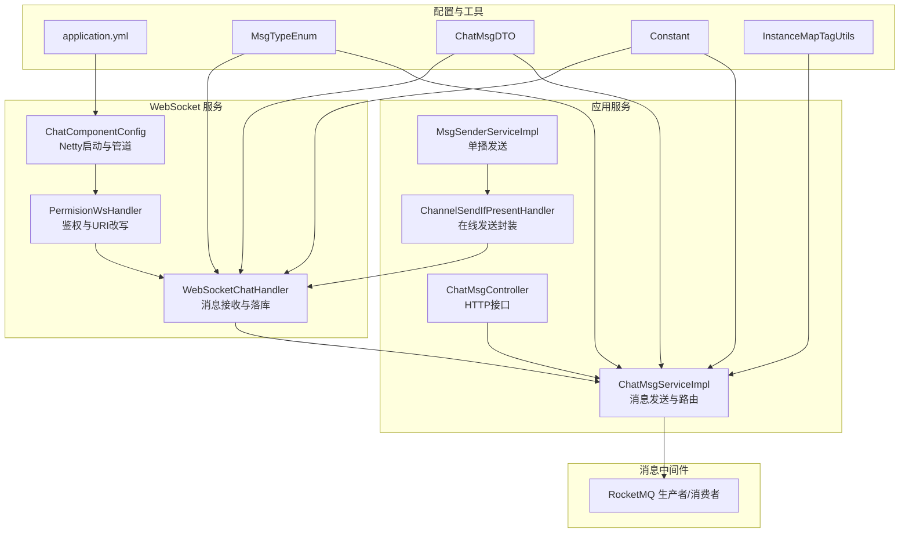
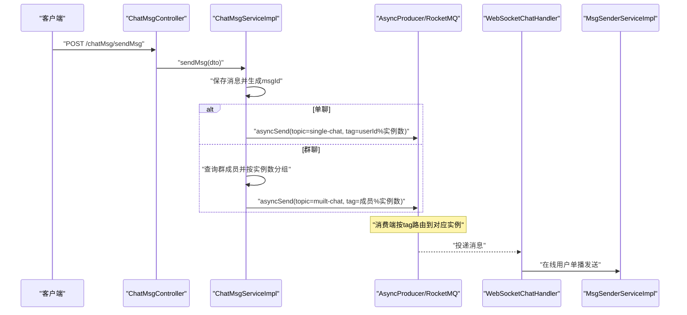
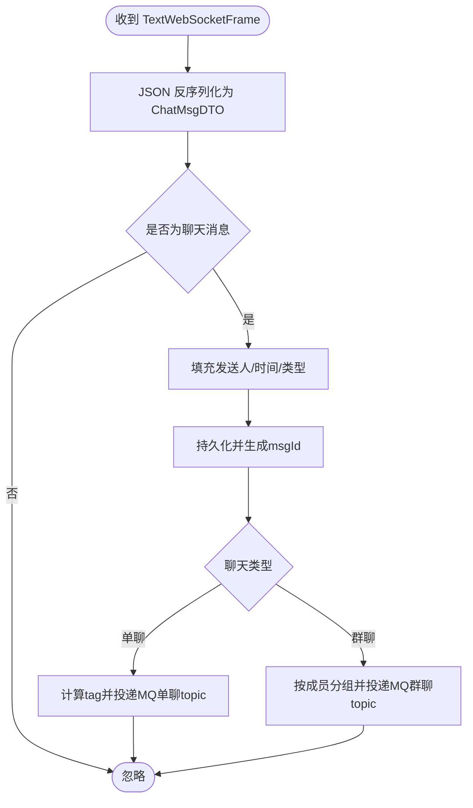
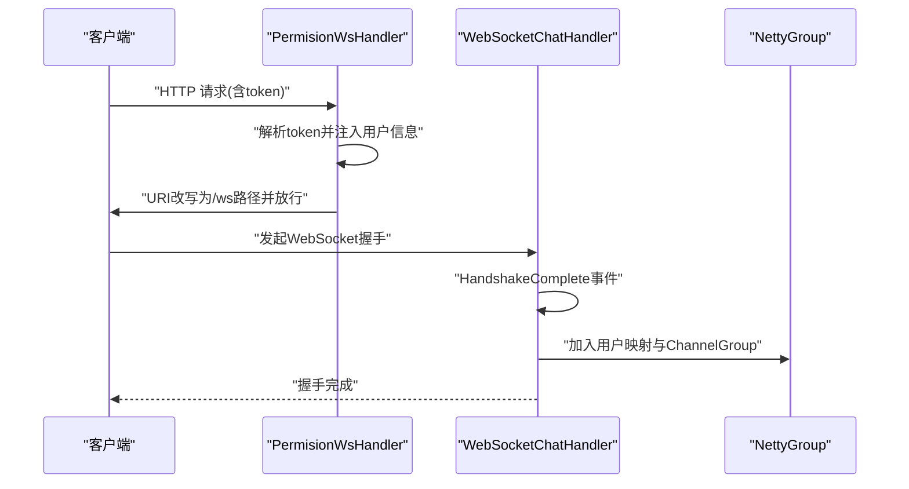
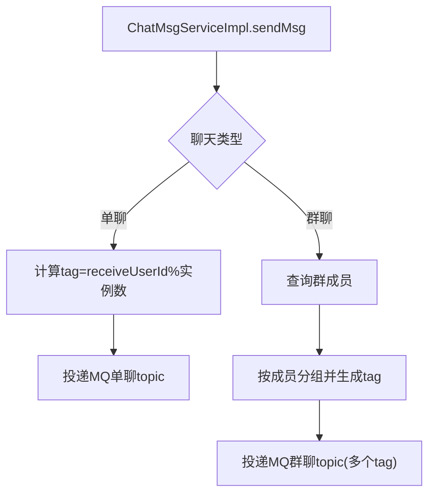
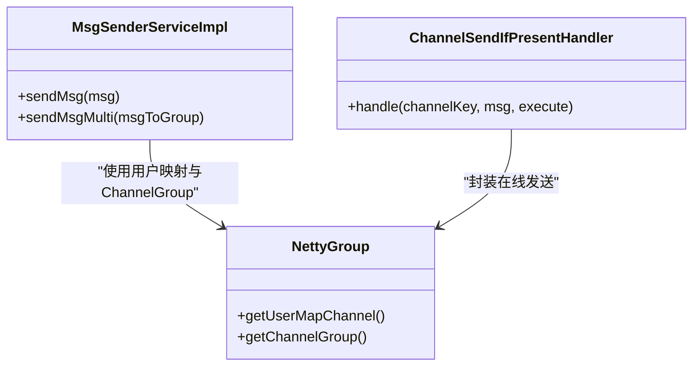
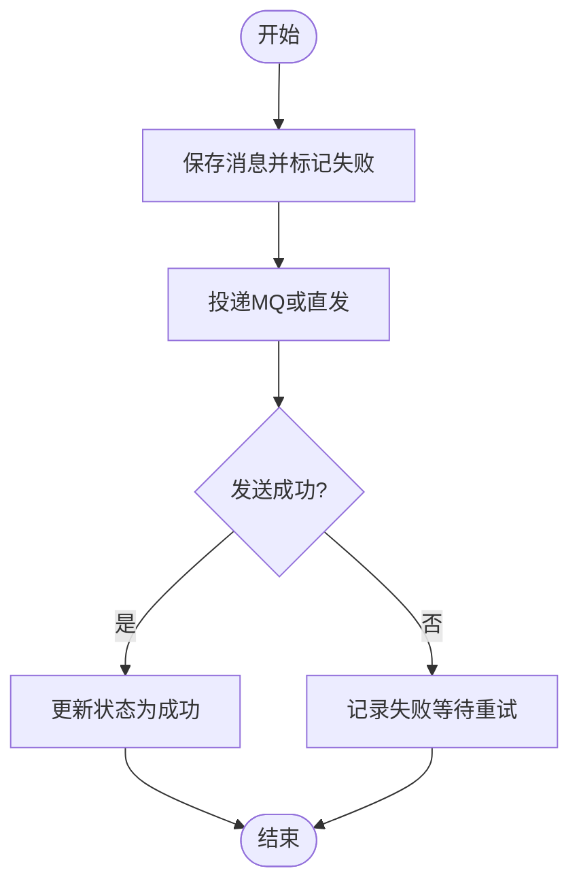
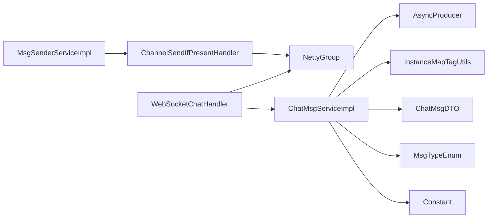

# 消息处理与路由

<cite>
**本文引用的文件**
- [WebSocketChatHandler.java](file://src/main/java/com/hch/chat_simple/handler/WebSocketChatHandler.java)
- [PermisionWsHandler.java](file://src/main/java/com/hch/chat_simple/handler/PermisionWsHandler.java)
- [ChannelSendIfPresentHandler.java](file://src/main/java/com/hch/chat_simple/handler/ChannelSendIfPresentHandler.java)
- [MsgSenderServiceImpl.java](file://src/main/java/com/hch/chat_simple/service/impl/MsgSenderServiceImpl.java)
- [NettyGroup.java](file://src/main/java/com/hch/chat_simple/config/NettyGroup.java)
- [ChatComponentConfig.java](file://src/main/java/com/hch/chat_simple/config/ChatComponentConfig.java)
- [MsgTypeEnum.java](file://src/main/java/com/hch/chat_simple/enums/MsgTypeEnum.java)
- [ChatMsgDTO.java](file://src/main/java/com/hch/chat_simple/pojo/dto/ChatMsgDTO.java)
- [AsyncProducer.java](file://src/main/java/com/hch/chat_simple/mq/AsyncProducer.java)
- [ChatMsgServiceImpl.java](file://src/main/java/com/hch/chat_simple/service/impl/ChatMsgServiceImpl.java)
- [IChatMsgService.java](file://src/main/java/com/hch/chat_simple/service/IChatMsgService.java)
- [ChatMsgController.java](file://src/main/java/com/hch/chat_simple/controller/ChatMsgController.java)
- [application.yml](file://src/main/resources/application.yml)
- [Constant.java](file://src/main/java/com/hch/chat_simple/util/Constant.java)
- [InstanceMapTagUtils.java](file://src/main/java/com/hch/chat_simple/util/InstanceMapTagUtils.java)
- [MsgBodyResolveUtil.java](file://src/main/java/com/hch/chat_simple/util/MsgBodyResolveUtil.java)
</cite>

## 目录
1. [简介](#简介)
2. [项目结构](#项目结构)
3. [核心组件](#核心组件)
4. [架构总览](#架构总览)
5. [详细组件分析](#详细组件分析)
6. [依赖分析](#依赖分析)
7. [性能考虑](#性能考虑)
8. [故障排查指南](#故障排查指南)
9. [结论](#结论)
10. [附录](#附录)

## 简介
本文件围绕 WebSocket 消息处理与路由展开，系统采用 Netty 提供 WebSocket 服务，结合 RocketMQ 实现消息的异步路由与持久化，覆盖以下主题：
- 消息接收与解析：TextWebSocketFrame 的文本解析、JSON 结构、消息类型识别
- 消息路由策略：单播（按用户 ID）、广播（群组消息）、组播（多用户）
- 线程池与并发：固定大小线程池、任务队列、并发控制与拒绝策略
- 消息状态管理：创建、状态更新、发送确认、失败重试
- 性能优化：批量处理、异步处理、内存与连接管理
- 监控与调试：日志、异常处理、常见问题定位

## 项目结构
系统采用前后端分离与微服务化的消息处理架构：
- Netty WebSocket 服务：负责握手、鉴权、连接生命周期管理
- RocketMQ：负责消息的异步投递与跨实例广播
- Spring MVC 控制器：提供 HTTP 接口，兼容旧版直连 WebSocket 的场景
- 业务服务：消息持久化、路由与发送、状态管理

图表来源
- [ChatComponentConfig.java:48-89](file://src/main/java/com/hch/chat_simple/config/ChatComponentConfig.java#L48-L89)
- [PermisionWsHandler.java:26-77](file://src/main/java/com/hch/chat_simple/handler/PermisionWsHandler.java#L26-L77)
- [WebSocketChatHandler.java:50-116](file://src/main/java/com/hch/chat_simple/handler/WebSocketChatHandler.java#L50-L116)
- [ChatMsgController.java:31-57](file://src/main/java/com/hch/chat_simple/controller/ChatMsgController.java#L31-L57)
- [ChatMsgServiceImpl.java:53-144](file://src/main/java/com/hch/chat_simple/service/impl/ChatMsgServiceImpl.java#L53-L144)
- [MsgSenderServiceImpl.java:24-79](file://src/main/java/com/hch/chat_simple/service/impl/MsgSenderServiceImpl.java#L24-L79)
- [ChannelSendIfPresentHandler.java:14-34](file://src/main/java/com/hch/chat_simple/handler/ChannelSendIfPresentHandler.java#L14-L34)
- [application.yml:39-51](file://src/main/resources/application.yml#L39-L51)
- [MsgTypeEnum.java:6-21](file://src/main/java/com/hch/chat_simple/enums/MsgTypeEnum.java#L6-L21)
- [ChatMsgDTO.java:11-61](file://src/main/java/com/hch/chat_simple/pojo/dto/ChatMsgDTO.java#L11-L61)
- [Constant.java:3-32](file://src/main/java/com/hch/chat_simple/util/Constant.java#L3-L32)
- [InstanceMapTagUtils.java:13-54](file://src/main/java/com/hch/chat_simple/util/InstanceMapTagUtils.java#L13-L54)

章节来源
- [ChatComponentConfig.java:31-103](file://src/main/java/com/hch/chat_simple/config/ChatComponentConfig.java#L31-L103)
- [application.yml:1-89](file://src/main/resources/application.yml#L1-L89)

## 核心组件
- WebSocketChatHandler：接收 TextWebSocketFrame，解析 JSON，构建 ChatMsgDTO，保存消息并触发异步路由（当前注释掉 WS 直发，改为 MQ 路由）
- PermisionWsHandler：鉴权与 URI 改写，注入用户上下文属性
- ChatMsgServiceImpl：HTTP 入口的消息发送逻辑，根据聊天类型选择单播/群播，计算路由标签，投递 MQ
- MsgSenderServiceImpl：基于在线用户映射进行单播发送
- ChannelSendIfPresentHandler：封装在线发送逻辑，避免空引用
- NettyGroup：全局 ChannelGroup 与用户-Channel 映射
- ChatComponentConfig：Netty 启动与管道装配
- AsyncProducer：RocketMQ 异步生产者
- MsgTypeEnum/ChatMsgDTO/Constant：消息类型、数据模型与常量定义
- InstanceMapTagUtils：按实例数取模进行路由标签分配

章节来源
- [WebSocketChatHandler.java:50-196](file://src/main/java/com/hch/chat_simple/handler/WebSocketChatHandler.java#L50-L196)
- [PermisionWsHandler.java:26-81](file://src/main/java/com/hch/chat_simple/handler/PermisionWsHandler.java#L26-L81)
- [ChatMsgServiceImpl.java:53-184](file://src/main/java/com/hch/chat_simple/service/impl/ChatMsgServiceImpl.java#L53-L184)
- [MsgSenderServiceImpl.java:24-79](file://src/main/java/com/hch/chat_simple/service/impl/MsgSenderServiceImpl.java#L24-L79)
- [ChannelSendIfPresentHandler.java:14-34](file://src/main/java/com/hch/chat_simple/handler/ChannelSendIfPresentHandler.java#L14-L34)
- [NettyGroup.java:11-30](file://src/main/java/com/hch/chat_simple/config/NettyGroup.java#L11-L30)
- [ChatComponentConfig.java:31-103](file://src/main/java/com/hch/chat_simple/config/ChatComponentConfig.java#L31-L103)
- [AsyncProducer.java:15-63](file://src/main/java/com/hch/chat_simple/mq/AsyncProducer.java#L15-L63)
- [MsgTypeEnum.java:6-25](file://src/main/java/com/hch/chat_simple/enums/MsgTypeEnum.java#L6-L25)
- [ChatMsgDTO.java:11-61](file://src/main/java/com/hch/chat_simple/pojo/dto/ChatMsgDTO.java#L11-L61)
- [Constant.java:3-32](file://src/main/java/com/hch/chat_simple/util/Constant.java#L3-L32)
- [InstanceMapTagUtils.java:13-54](file://src/main/java/com/hch/chat_simple/util/InstanceMapTagUtils.java#L13-L54)

## 架构总览
WebSocket 与 HTTP 双通道协同：
- HTTP：ChatMsgController -> ChatMsgServiceImpl -> AsyncProducer（MQ）
- WebSocket：PermisionWsHandler -> WebSocketChatHandler -> ChatMsgServiceImpl（可选直发，当前以 MQ 为主）

图表来源
- [ChatMsgController.java:39-49](file://src/main/java/com/hch/chat_simple/controller/ChatMsgController.java#L39-L49)
- [ChatMsgServiceImpl.java:97-144](file://src/main/java/com/hch/chat_simple/service/impl/ChatMsgServiceImpl.java#L97-L144)
- [AsyncProducer.java:40-59](file://src/main/java/com/hch/chat_simple/mq/AsyncProducer.java#L40-L59)
- [WebSocketChatHandler.java:72-109](file://src/main/java/com/hch/chat_simple/handler/WebSocketChatHandler.java#L72-L109)
- [MsgSenderServiceImpl.java:34-55](file://src/main/java/com/hch/chat_simple/service/impl/MsgSenderServiceImpl.java#L34-L55)

## 详细组件分析

### WebSocket 消息接收与解析
- 解析流程：收到 TextWebSocketFrame 文本 -> JSON 反序列化为 ChatMsgDTO -> 鉴权与填充发送人信息 -> 落库并生成消息ID
- 消息类型识别：通过 MsgTypeEnum.SEND_MSG 判断是否为聊天消息
- 时间戳与本地化：createdAt 转换为 Asia/Shanghai 时间戳字符串
- 当前策略：单聊/群聊均通过 MQ 路由，WebSocket 侧暂不直发

图表来源
- [WebSocketChatHandler.java:72-109](file://src/main/java/com/hch/chat_simple/handler/WebSocketChatHandler.java#L72-L109)
- [ChatMsgServiceImpl.java:97-144](file://src/main/java/com/hch/chat_simple/service/impl/ChatMsgServiceImpl.java#L97-L144)
- [MsgTypeEnum.java:6-21](file://src/main/java/com/hch/chat_simple/enums/MsgTypeEnum.java#L6-L21)
- [Constant.java:19-26](file://src/main/java/com/hch/chat_simple/util/Constant.java#L19-L26)

章节来源
- [WebSocketChatHandler.java:72-109](file://src/main/java/com/hch/chat_simple/handler/WebSocketChatHandler.java#L72-L109)
- [ChatMsgDTO.java:11-61](file://src/main/java/com/hch/chat_simple/pojo/dto/ChatMsgDTO.java#L11-L61)
- [MsgTypeEnum.java:6-21](file://src/main/java/com/hch/chat_simple/enums/MsgTypeEnum.java#L6-L21)
- [Constant.java:17-26](file://src/main/java/com/hch/chat_simple/util/Constant.java#L17-L26)

### 权限与握手处理
- PermisionWsHandler：从请求头/URI 中提取 token，解析用户信息，注入到 Channel 属性，随后将 URI 改写为 /chat 并放行
- WebSocketChatHandler.userEventTriggered：握手完成后读取 Channel 属性，完成用户绑定与 ChannelGroup 注册；空闲事件触发时移除

图表来源
- [PermisionWsHandler.java:32-66](file://src/main/java/com/hch/chat_simple/handler/PermisionWsHandler.java#L32-L66)
- [WebSocketChatHandler.java:118-163](file://src/main/java/com/hch/chat_simple/handler/WebSocketChatHandler.java#L118-L163)
- [NettyGroup.java:11-29](file://src/main/java/com/hch/chat_simple/config/NettyGroup.java#L11-L29)

章节来源
- [PermisionWsHandler.java:26-81](file://src/main/java/com/hch/chat_simple/handler/PermisionWsHandler.java#L26-L81)
- [WebSocketChatHandler.java:118-163](file://src/main/java/com/hch/chat_simple/handler/WebSocketChatHandler.java#L118-L163)
- [NettyGroup.java:11-29](file://src/main/java/com/hch/chat_simple/config/NettyGroup.java#L11-L29)

### 消息路由机制
- 单播路由：根据接收人 ID 计算路由标签（取模实例数），投递到单聊 topic，消费端按 tag 路由到目标实例
- 群播路由：查询群成员，按实例数分组，每个子集生成一个 tag，投递到群聊 topic，消费端按 tag 广播至各实例
- 组播路由：通过 MQ 的 tag 机制实现“多实例组播”，无需在应用层手动遍历

图表来源
- [ChatMsgServiceImpl.java:118-135](file://src/main/java/com/hch/chat_simple/service/impl/ChatMsgServiceImpl.java#L118-L135)
- [InstanceMapTagUtils.java:32-47](file://src/main/java/com/hch/chat_simple/util/InstanceMapTagUtils.java#L32-L47)
- [application.yml:47-51](file://src/main/resources/application.yml#L47-L51)

章节来源
- [ChatMsgServiceImpl.java:97-144](file://src/main/java/com/hch/chat_simple/service/impl/ChatMsgServiceImpl.java#L97-L144)
- [InstanceMapTagUtils.java:13-54](file://src/main/java/com/hch/chat_simple/util/InstanceMapTagUtils.java#L13-L54)
- [application.yml:39-51](file://src/main/resources/application.yml#L39-L51)

### 在线单播发送
- MsgSenderServiceImpl：根据接收人 ID 查找 ChannelId，定位 ChannelGroup 中的 Channel，发送 TextWebSocketFrame
- ChannelSendIfPresentHandler：封装 computeIfPresent 逻辑，确保 Channel 存在才发送，避免空引用
- 发送结果监听：通过 ChannelFuture 监听发送成功/失败，用于状态记录与重试

图表来源
- [MsgSenderServiceImpl.java:24-79](file://src/main/java/com/hch/chat_simple/service/impl/MsgSenderServiceImpl.java#L24-L79)
- [ChannelSendIfPresentHandler.java:14-34](file://src/main/java/com/hch/chat_simple/handler/ChannelSendIfPresentHandler.java#L14-L34)
- [NettyGroup.java:11-29](file://src/main/java/com/hch/chat_simple/config/NettyGroup.java#L11-L29)

章节来源
- [MsgSenderServiceImpl.java:34-77](file://src/main/java/com/hch/chat_simple/service/impl/MsgSenderServiceImpl.java#L34-L77)
- [ChannelSendIfPresentHandler.java:21-32](file://src/main/java/com/hch/chat_simple/handler/ChannelSendIfPresentHandler.java#L21-L32)
- [NettyGroup.java:11-29](file://src/main/java/com/hch/chat_simple/config/NettyGroup.java#L11-L29)

### 消息状态管理
- 创建：发送前先持久化，设置状态为“发送失败”，记录 msgId
- 状态更新：发送成功后异步修改状态为“发送成功”
- 发送确认：通过 ChannelFuture 监听发送结果
- 失败重试：客户端上线后拉取未读消息（状态为失败），重新发送

图表来源
- [WebSocketChatHandler.java:92-95](file://src/main/java/com/hch/chat_simple/handler/WebSocketChatHandler.java#L92-L95)
- [ChatMsgServiceImpl.java:111-114](file://src/main/java/com/hch/chat_simple/service/impl/ChatMsgServiceImpl.java#L111-L114)
- [Constant.java:8-11](file://src/main/java/com/hch/chat_simple/util/Constant.java#L8-L11)

章节来源
- [WebSocketChatHandler.java:92-95](file://src/main/java/com/hch/chat_simple/handler/WebSocketChatHandler.java#L92-L95)
- [ChatMsgServiceImpl.java:71-95](file://src/main/java/com/hch/chat_simple/service/impl/ChatMsgServiceImpl.java#L71-L95)
- [Constant.java:8-11](file://src/main/java/com/hch/chat_simple/util/Constant.java#L8-L11)

### 线程池与并发控制
- 固定大小线程池：WebSocketChatHandler 与 AsyncConsumerMuiltChat 中均使用固定大小线程池（16 线程）处理消息
- 任务队列：线程池默认队列容量取决于具体实现；如需扩展，建议显式指定队列参数
- 并发控制：通过 Netty EventLoop 与线程池配合，保证 IO 与业务处理解耦
- 拒绝策略：当前未自定义拒绝策略，建议在高负载场景下使用 CallerRunsPolicy 或增加线程池容量

章节来源
- [WebSocketChatHandler.java](file://src/main/java/com/hch/chat_simple/handler/WebSocketChatHandler.java#L55)
- [AsyncProducer.java:15-63](file://src/main/java/com/hch/chat_simple/mq/AsyncProducer.java#L15-L63)

### HTTP 入口与消息处理
- ChatMsgController：提供未读消息拉取、发送消息、群聊未读查询等接口
- ChatMsgServiceImpl：HTTP 入口的消息发送逻辑，与 WebSocket 入口共享同一套路由与持久化流程

章节来源
- [ChatMsgController.java:31-57](file://src/main/java/com/hch/chat_simple/controller/ChatMsgController.java#L31-L57)
- [ChatMsgServiceImpl.java:97-144](file://src/main/java/com/hch/chat_simple/service/impl/ChatMsgServiceImpl.java#L97-L144)

## 依赖分析
- 组件内聚与耦合
  - WebSocketChatHandler 与 NettyGroup 高内聚，依赖较少
  - ChatMsgServiceImpl 与 AsyncProducer、InstanceMapTagUtils、Group 服务耦合度较高，但职责清晰
  - MsgSenderServiceImpl 与 ChannelSendIfPresentHandler 低耦合，便于复用
- 外部依赖
  - Netty：WebSocket 服务与连接管理
  - RocketMQ：消息路由与跨实例广播
  - MyBatis-Plus：消息持久化
  - Redis/Redisson：实例数与实例映射（配置存在，具体使用视实现而定）

图表来源
- [WebSocketChatHandler.java:50-196](file://src/main/java/com/hch/chat_simple/handler/WebSocketChatHandler.java#L50-L196)
- [ChatMsgServiceImpl.java:53-184](file://src/main/java/com/hch/chat_simple/service/impl/ChatMsgServiceImpl.java#L53-L184)
- [MsgSenderServiceImpl.java:24-79](file://src/main/java/com/hch/chat_simple/service/impl/MsgSenderServiceImpl.java#L24-L79)
- [ChannelSendIfPresentHandler.java:14-34](file://src/main/java/com/hch/chat_simple/handler/ChannelSendIfPresentHandler.java#L14-L34)
- [NettyGroup.java:11-29](file://src/main/java/com/hch/chat_simple/config/NettyGroup.java#L11-L29)
- [AsyncProducer.java:15-63](file://src/main/java/com/hch/chat_simple/mq/AsyncProducer.java#L15-L63)
- [InstanceMapTagUtils.java:13-54](file://src/main/java/com/hch/chat_simple/util/InstanceMapTagUtils.java#L13-L54)
- [ChatMsgDTO.java:11-61](file://src/main/java/com/hch/chat_simple/pojo/dto/ChatMsgDTO.java#L11-L61)
- [MsgTypeEnum.java:6-25](file://src/main/java/com/hch/chat_simple/enums/MsgTypeEnum.java#L6-L25)
- [Constant.java:3-32](file://src/main/java/com/hch/chat_simple/util/Constant.java#L3-L32)

## 性能考虑
- 批量处理
  - 群聊消息按成员分组投递，减少 MQ 消息条数与网络往返
  - 建议在消费端聚合批量发送，降低 Channel 写入次数
- 异步处理
  - WebSocket 入口与 HTTP 入口均通过 MQ 异步路由，避免阻塞主流程
  - 发送结果监听用于状态回写，避免同步等待
- 内存与连接管理
  - NettyGroup 使用并发 Map 与 ChannelGroup，注意空闲连接清理（已实现空闲移除）
  - 线程池大小固定为 16，建议根据 CPU 核心数与 QPS 调整
- 路由标签
  - 使用取模方式均匀分布，建议结合实例数动态配置，避免热点

章节来源
- [ChatMsgServiceImpl.java:125-135](file://src/main/java/com/hch/chat_simple/service/impl/ChatMsgServiceImpl.java#L125-L135)
- [InstanceMapTagUtils.java:32-47](file://src/main/java/com/hch/chat_simple/util/InstanceMapTagUtils.java#L32-L47)
- [WebSocketChatHandler.java](file://src/main/java/com/hch/chat_simple/handler/WebSocketChatHandler.java#L55)
- [application.yml:74-89](file://src/main/resources/application.yml#L74-L89)

## 故障排查指南
- WebSocket 握手失败
  - 检查 PermisionWsHandler 是否正确注入 token 与用户信息
  - 确认 URI 改写为 /chat 并放行
- 消息未送达
  - 核对 ChatMsgServiceImpl 是否成功投递 MQ
  - 检查 RocketMQ 消费端是否正常运行
  - 确认 MsgSenderServiceImpl 能找到接收人 Channel
- 状态不一致
  - 核对发送前状态是否为“发送失败”，发送后是否更新为“发送成功”
  - 客户端上线后检查未读消息拉取逻辑
- 性能问题
  - 观察线程池饱和情况，必要时扩大线程池或队列
  - 检查 Netty 空闲连接清理是否生效

章节来源
- [PermisionWsHandler.java:32-66](file://src/main/java/com/hch/chat_simple/handler/PermisionWsHandler.java#L32-L66)
- [WebSocketChatHandler.java:118-163](file://src/main/java/com/hch/chat_simple/handler/WebSocketChatHandler.java#L118-L163)
- [ChatMsgServiceImpl.java:71-95](file://src/main/java/com/hch/chat_simple/service/impl/ChatMsgServiceImpl.java#L71-L95)
- [MsgSenderServiceImpl.java:34-55](file://src/main/java/com/hch/chat_simple/service/impl/MsgSenderServiceImpl.java#L34-L55)
- [Constant.java:8-11](file://src/main/java/com/hch/chat_simple/util/Constant.java#L8-L11)

## 结论
本系统通过 Netty + RocketMQ 实现了高可用、可扩展的消息处理与路由能力。WebSocket 入口负责连接与鉴权，HTTP 入口提供兼容性支持；消息通过 MQ 异步路由至目标实例，再由在线发送组件直发给用户。建议在高并发场景下进一步优化线程池与队列配置，并完善失败重试与监控告警体系。

## 附录
- 关键配置项
  - RocketMQ 名称服务器、生产者/消费者组、topic
  - WebSocket 服务端口、路径
  - 实例标签列表与当前实例标识

章节来源
- [application.yml:39-89](file://src/main/resources/application.yml#L39-L89)