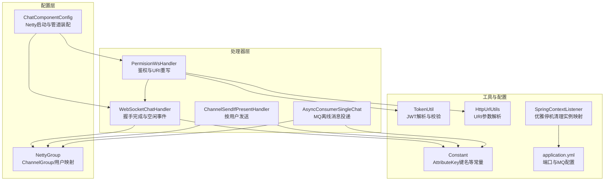
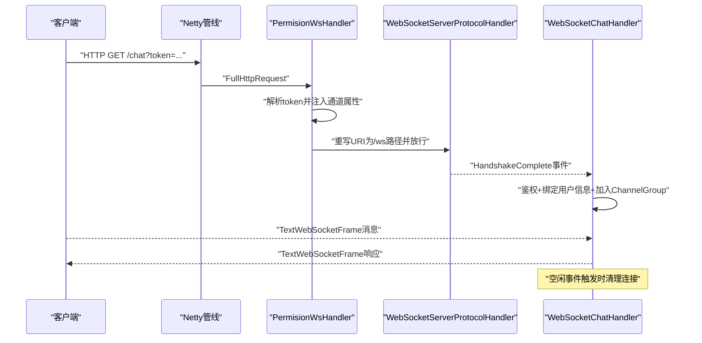
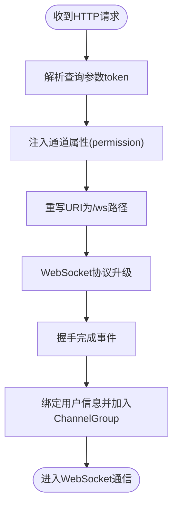
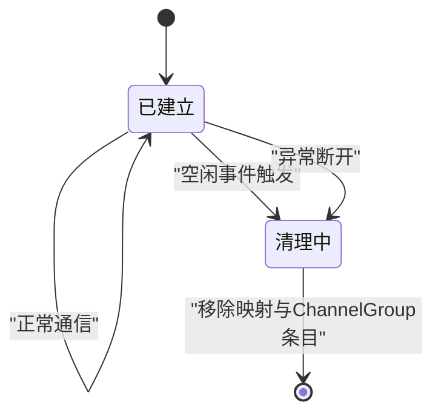
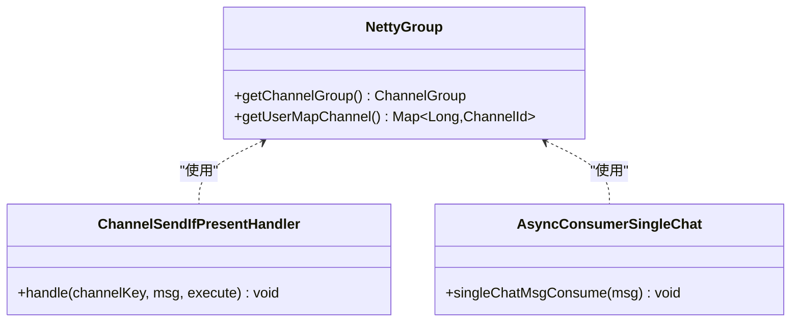
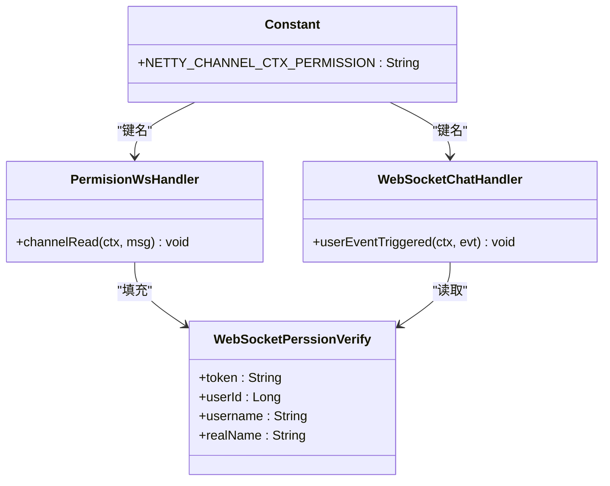
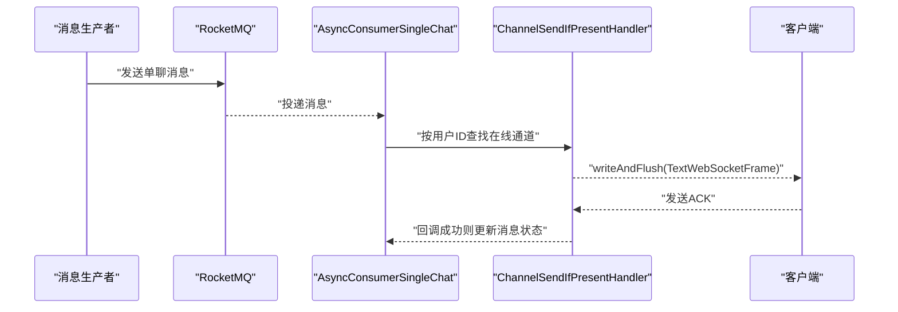
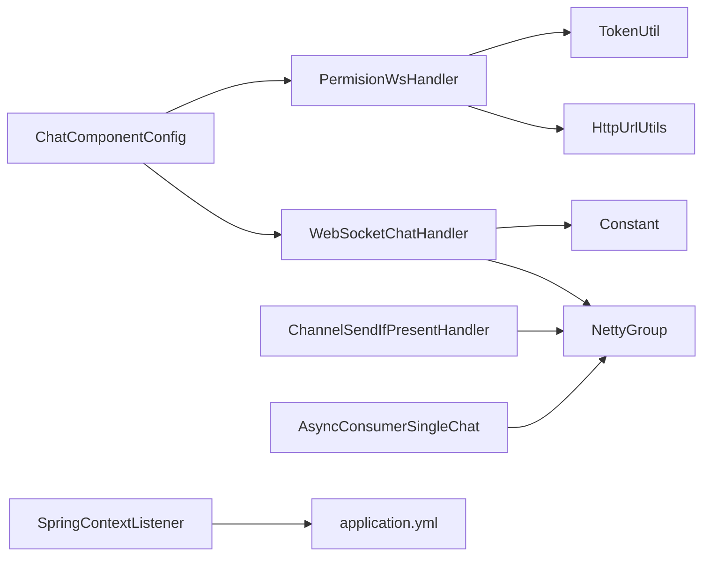

# 连接管理与生命周期

<cite>
**本文引用的文件**
- [NettyGroup.java](file://src/main/java/com/hch/chat_simple/config/NettyGroup.java)
- [ChatComponentConfig.java](file://src/main/java/com/hch/chat_simple/config/ChatComponentConfig.java)
- [WebSocketChatHandler.java](file://src/main/java/com/hch/chat_simple/handler/WebSocketChatHandler.java)
- [PermisionWsHandler.java](file://src/main/java/com/hch/chat_simple/handler/PermisionWsHandler.java)
- [ChannelSendIfPresentHandler.java](file://src/main/java/com/hch/chat_simple/handler/ChannelSendIfPresentHandler.java)
- [AsyncConsumerSingleChat.java](file://src/main/java/com/hch/chat_simple/mq/AsyncConsumerSingleChat.java)
- [Constant.java](file://src/main/java/com/hch/chat_simple/util/Constant.java)
- [TokenUtil.java](file://src/main/java/com/hch/chat_simple/util/TokenUtil.java)
- [HttpUrlUtils.java](file://src/main/java/com/hch/chat_simple/util/HttpUrlUtils.java)
- [application.yml](file://src/main/resources/application.yml)
- [SpringContextListener.java](file://src/main/java/com/hch/chat_simple/listener/SpringContextListener.java)
</cite>

## 目录
1. [引言](#引言)
2. [项目结构](#项目结构)
3. [核心组件](#核心组件)
4. [架构总览](#架构总览)
5. [详细组件分析](#详细组件分析)
6. [依赖分析](#依赖分析)
7. [性能考虑](#性能考虑)
8. [故障排查指南](#故障排查指南)
9. [结论](#结论)
10. [附录](#附录)

## 引言
本文件聚焦于WebSocket连接的建立、升级与生命周期管理，以及基于Netty的连接池与属性绑定机制。内容涵盖：
- HTTP握手与协议升级流程
- 连接建立、保持、空闲检测、异常断开、主动关闭的状态转换
- NettyGroup中的ChannelMap与ChannelGroup管理、超时与内存清理
- 连接属性管理（AttributeKey、用户信息绑定、权限上下文）
- 连接状态监控与诊断（连接数、活跃度、异常清理）
- 连接优化策略与故障排查

## 项目结构
该项目采用Spring Boot + Netty实现WebSocket服务端，核心位于config与handler包中，配合工具类与配置文件完成连接管理与消息分发。

图表来源
- [ChatComponentConfig.java:74-89](file://src/main/java/com/hch/chat_simple/config/ChatComponentConfig.java#L74-L89)
- [PermisionWsHandler.java:32-66](file://src/main/java/com/hch/chat_simple/handler/PermisionWsHandler.java#L32-L66)
- [WebSocketChatHandler.java:118-163](file://src/main/java/com/hch/chat_simple/handler/WebSocketChatHandler.java#L118-L163)
- [NettyGroup.java:11-29](file://src/main/java/com/hch/chat_simple/config/NettyGroup.java#L11-L29)
- [ChannelSendIfPresentHandler.java:14-33](file://src/main/java/com/hch/chat_simple/handler/ChannelSendIfPresentHandler.java#L14-L33)
- [AsyncConsumerSingleChat.java:29-84](file://src/main/java/com/hch/chat_simple/mq/AsyncConsumerSingleChat.java#L29-L84)
- [Constant.java:3-33](file://src/main/java/com/hch/chat_simple/util/Constant.java#L3-L33)
- [TokenUtil.java:48-69](file://src/main/java/com/hch/chat_simple/util/TokenUtil.java#L48-L69)
- [HttpUrlUtils.java:8-16](file://src/main/java/com/hch/chat_simple/util/HttpUrlUtils.java#L8-L16)
- [application.yml:34-51](file://src/main/resources/application.yml#L34-L51)
- [SpringContextListener.java:20-52](file://src/main/java/com/hch/chat_simple/listener/SpringContextListener.java#L20-L52)

章节来源
- [ChatComponentConfig.java:31-103](file://src/main/java/com/hch/chat_simple/config/ChatComponentConfig.java#L31-L103)
- [application.yml:74-89](file://src/main/resources/application.yml#L74-L89)

## 核心组件
- NettyGroup：提供全局ChannelGroup与用户到ChannelId的映射表，作为连接池与路由中心。
- ChatComponentConfig：负责Netty服务端启动、HTTP编解码、WebSocket协议升级、业务处理器装配。
- PermisionWsHandler：在HTTP阶段完成鉴权与URI重写，将原始token注入通道属性。
- WebSocketChatHandler：在握手完成后绑定用户信息、加入全局连接池；处理空闲事件以清理异常/空闲连接。
- ChannelSendIfPresentHandler：基于用户ID查找在线通道并发送消息。
- AsyncConsumerSingleChat：MQ消费离线消息，命中在线用户则通过Netty发送并更新消息状态。
- 工具类：Constant（AttributeKey键名）、TokenUtil（JWT解析）、HttpUrlUtils（URI参数解析）。
- SpringContextListener：应用关闭时清理实例映射，避免脏数据。

章节来源
- [NettyGroup.java:11-29](file://src/main/java/com/hch/chat_simple/config/NettyGroup.java#L11-L29)
- [ChatComponentConfig.java:74-89](file://src/main/java/com/hch/chat_simple/config/ChatComponentConfig.java#L74-L89)
- [PermisionWsHandler.java:26-81](file://src/main/java/com/hch/chat_simple/handler/PermisionWsHandler.java#L26-L81)
- [WebSocketChatHandler.java:50-196](file://src/main/java/com/hch/chat_simple/handler/WebSocketChatHandler.java#L50-L196)
- [ChannelSendIfPresentHandler.java:14-33](file://src/main/java/com/hch/chat_simple/handler/ChannelSendIfPresentHandler.java#L14-L33)
- [AsyncConsumerSingleChat.java:29-84](file://src/main/java/com/hch/chat_simple/mq/AsyncConsumerSingleChat.java#L29-L84)
- [Constant.java:3-33](file://src/main/java/com/hch/chat_simple/util/Constant.java#L3-L33)
- [TokenUtil.java:48-69](file://src/main/java/com/hch/chat_simple/util/TokenUtil.java#L48-L69)
- [HttpUrlUtils.java:8-16](file://src/main/java/com/hch/chat_simple/util/HttpUrlUtils.java#L8-L16)
- [SpringContextListener.java:20-52](file://src/main/java/com/hch/chat_simple/listener/SpringContextListener.java#L20-L52)

## 架构总览
WebSocket服务端由Netty提供传输层，Spring管理业务处理器与配置。握手阶段完成鉴权与URI重写，随后进入WebSocket协议升级；业务阶段通过ChannelGroup与用户映射实现消息路由与状态维护。

图表来源
- [ChatComponentConfig.java:74-89](file://src/main/java/com/hch/chat_simple/config/ChatComponentConfig.java#L74-L89)
- [PermisionWsHandler.java:32-66](file://src/main/java/com/hch/chat_simple/handler/PermisionWsHandler.java#L32-L66)
- [WebSocketChatHandler.java:118-163](file://src/main/java/com/hch/chat_simple/handler/WebSocketChatHandler.java#L118-L163)

## 详细组件分析

### 组件A：连接建立与协议升级
- HTTP握手：通过HttpServerCodec、ChunkedWriteHandler、HttpObjectAggregator完成请求编解码与聚合。
- 鉴权与URI重写：PermisionWsHandler从查询参数提取token，解析用户信息并注入通道属性，同时将URI重写为/ws路径以便后续协议升级。
- 协议升级：WebSocketServerProtocolHandler执行Upgrade握手，支持指定子协议与最大帧大小。
- 握手完成事件：WebSocketChatHandler监听HandshakeComplete事件，完成用户信息绑定与加入ChannelGroup。

图表来源
- [PermisionWsHandler.java:32-66](file://src/main/java/com/hch/chat_simple/handler/PermisionWsHandler.java#L32-L66)
- [ChatComponentConfig.java:74-89](file://src/main/java/com/hch/chat_simple/config/ChatComponentConfig.java#L74-L89)
- [WebSocketChatHandler.java:118-149](file://src/main/java/com/hch/chat_simple/handler/WebSocketChatHandler.java#L118-L149)

章节来源
- [ChatComponentConfig.java:74-89](file://src/main/java/com/hch/chat_simple/config/ChatComponentConfig.java#L74-L89)
- [PermisionWsHandler.java:26-81](file://src/main/java/com/hch/chat_simple/handler/PermisionWsHandler.java#L26-L81)
- [WebSocketChatHandler.java:118-149](file://src/main/java/com/hch/chat_simple/handler/WebSocketChatHandler.java#L118-L149)

### 组件B：连接生命周期管理
- 建立：握手完成后，将ChannelId与用户ID绑定至用户映射表，并将Channel加入全局ChannelGroup。
- 保持：业务消息通过ChannelGroup或用户映射定向发送。
- 空闲检测：捕获IdleStateEvent（ALL_IDLE），触发清理逻辑。
- 异常断开：异常Caught回调中关闭Channel。
- 主动关闭：调用removeChannelId清理用户映射与ChannelGroup条目。

图表来源
- [WebSocketChatHandler.java:155-163](file://src/main/java/com/hch/chat_simple/handler/WebSocketChatHandler.java#L155-L163)
- [WebSocketChatHandler.java:165-175](file://src/main/java/com/hch/chat_simple/handler/WebSocketChatHandler.java#L165-L175)

章节来源
- [WebSocketChatHandler.java:118-175](file://src/main/java/com/hch/chat_simple/handler/WebSocketChatHandler.java#L118-L175)

### 组件C：NettyGroup连接池与路由
- ChannelGroup：全局连接集合，便于广播或批量操作。
- 用户映射：Map<Long, ChannelId>将用户ID映射到ChannelId，用于点对点路由。
- 清理策略：removeChannelId在空闲或异常时移除映射与ChannelGroup条目，避免悬挂引用。

图表来源
- [NettyGroup.java:11-29](file://src/main/java/com/hch/chat_simple/config/NettyGroup.java#L11-L29)
- [ChannelSendIfPresentHandler.java:14-33](file://src/main/java/com/hch/chat_simple/handler/ChannelSendIfPresentHandler.java#L14-L33)
- [AsyncConsumerSingleChat.java:29-84](file://src/main/java/com/hch/chat_simple/mq/AsyncConsumerSingleChat.java#L29-L84)

章节来源
- [NettyGroup.java:11-29](file://src/main/java/com/hch/chat_simple/config/NettyGroup.java#L11-L29)
- [ChannelSendIfPresentHandler.java:14-33](file://src/main/java/com/hch/chat_simple/handler/ChannelSendIfPresentHandler.java#L14-L33)
- [AsyncConsumerSingleChat.java:29-84](file://src/main/java/com/hch/chat_simple/mq/AsyncConsumerSingleChat.java#L29-L84)

### 组件D：连接属性管理与权限上下文
- AttributeKey：使用Constant中定义的键名，将WebSocketPerssionVerify对象绑定到Channel属性中，贯穿握手与业务阶段。
- 权限验证：PermisionWsHandler与WebSocketChatHandler共同完成token解析与用户信息填充。
- 用户信息绑定：将userId、username等信息写入属性，供后续路由与日志使用。

图表来源
- [Constant.java:3-33](file://src/main/java/com/hch/chat_simple/util/Constant.java#L3-L33)
- [WebSocketPerssionVerify.java:1-22](file://src/main/java/com/hch/chat_simple/pojo/dto/WebSocketPerssionVerify.java#L1-L22)
- [PermisionWsHandler.java:32-66](file://src/main/java/com/hch/chat_simple/handler/PermisionWsHandler.java#L32-L66)
- [WebSocketChatHandler.java:118-136](file://src/main/java/com/hch/chat_simple/handler/WebSocketChatHandler.java#L118-L136)

章节来源
- [Constant.java:3-33](file://src/main/java/com/hch/chat_simple/util/Constant.java#L3-L33)
- [WebSocketPerssionVerify.java:1-22](file://src/main/java/com/hch/chat_simple/pojo/dto/WebSocketPerssionVerify.java#L1-L22)
- [PermisionWsHandler.java:26-81](file://src/main/java/com/hch/chat_simple/handler/PermisionWsHandler.java#L26-L81)
- [WebSocketChatHandler.java:118-136](file://src/main/java/com/hch/chat_simple/handler/WebSocketChatHandler.java#L118-L136)

### 组件E：消息发送与离线投递
- 点对点发送：ChannelSendIfPresentHandler根据用户ID查找Channel并发送消息。
- MQ离线投递：AsyncConsumerSingleChat消费MQ消息，命中在线用户则通过Netty发送并异步更新消息状态。

图表来源
- [AsyncConsumerSingleChat.java:47-73](file://src/main/java/com/hch/chat_simple/mq/AsyncConsumerSingleChat.java#L47-L73)
- [ChannelSendIfPresentHandler.java:21-32](file://src/main/java/com/hch/chat_simple/handler/ChannelSendIfPresentHandler.java#L21-L32)

章节来源
- [AsyncConsumerSingleChat.java:29-84](file://src/main/java/com/hch/chat_simple/mq/AsyncConsumerSingleChat.java#L29-L84)
- [ChannelSendIfPresentHandler.java:14-33](file://src/main/java/com/hch/chat_simple/handler/ChannelSendIfPresentHandler.java#L14-L33)

## 依赖分析
- 启动与管线装配：ChatComponentConfig负责NIO事件循环组、ChannelInitializer与WebSocketServerProtocolHandler的装配。
- 处理器依赖：PermisionWsHandler与WebSocketChatHandler分别承担HTTP阶段鉴权与WebSocket阶段业务。
- 连接池依赖：NettyGroup被多个组件共享，形成统一的连接路由中心。
- 配置依赖：application.yml提供端口与MQ主题配置，影响服务暴露与消息投递。

图表来源
- [ChatComponentConfig.java:38-89](file://src/main/java/com/hch/chat_simple/config/ChatComponentConfig.java#L38-L89)
- [PermisionWsHandler.java:26-81](file://src/main/java/com/hch/chat_simple/handler/PermisionWsHandler.java#L26-L81)
- [WebSocketChatHandler.java:50-196](file://src/main/java/com/hch/chat_simple/handler/WebSocketChatHandler.java#L50-L196)
- [NettyGroup.java:11-29](file://src/main/java/com/hch/chat_simple/config/NettyGroup.java#L11-L29)
- [ChannelSendIfPresentHandler.java:14-33](file://src/main/java/com/hch/chat_simple/handler/ChannelSendIfPresentHandler.java#L14-L33)
- [AsyncConsumerSingleChat.java:29-84](file://src/main/java/com/hch/chat_simple/mq/AsyncConsumerSingleChat.java#L29-L84)
- [SpringContextListener.java:20-52](file://src/main/java/com/hch/chat_simple/listener/SpringContextListener.java#L20-L52)
- [application.yml:34-51](file://src/main/resources/application.yml#L34-L51)

章节来源
- [ChatComponentConfig.java:38-89](file://src/main/java/com/hch/chat_simple/config/ChatComponentConfig.java#L38-L89)
- [application.yml:34-51](file://src/main/resources/application.yml#L34-L51)

## 性能考虑
- 连接池规模：NioEventLoopGroup的线程数与ChannelGroup的并发写入需与CPU核数匹配，避免过度竞争。
- 消息发送：使用writeAndFlush异步发送，结合ChannelFuture回调减少阻塞。
- 空闲检测：合理设置IdleState事件阈值，避免频繁清理导致抖动。
- 内存清理：空闲/异常事件及时移除映射与ChannelGroup条目，防止内存泄漏。
- MQ解耦：离线消息通过MQ异步投递，降低主链路压力。

## 故障排查指南
- 握手失败
  - 检查PermisionWsHandler是否正确解析token与URI重写。
  - 确认WebSocketServerProtocolHandler的子协议与路径一致。
- 无法发送消息
  - 核对用户映射表是否存在目标用户ID。
  - 检查ChannelGroup中是否存在对应Channel。
- 连接未清理
  - 观察IdleStateEvent是否触发，确认removeChannelId逻辑执行。
  - 检查异常Caught回调是否关闭Channel。
- 实例下线残留
  - 应用优雅停机时，SpringContextListener应减少实例计数并清理映射。
- 配置问题
  - 确认chat.server.port与application.yml配置一致。
  - RocketMQ主题名称与application.yml一致。

章节来源
- [PermisionWsHandler.java:32-66](file://src/main/java/com/hch/chat_simple/handler/PermisionWsHandler.java#L32-L66)
- [WebSocketChatHandler.java:155-175](file://src/main/java/com/hch/chat_simple/handler/WebSocketChatHandler.java#L155-L175)
- [SpringContextListener.java:30-41](file://src/main/java/com/hch/chat_simple/listener/SpringContextListener.java#L30-L41)
- [application.yml:74-89](file://src/main/resources/application.yml#L74-L89)

## 结论
该WebSocket实现以Netty为核心，结合Spring管理业务处理器，通过握手鉴权与URI重写完成协议升级，利用ChannelGroup与用户映射实现高效路由。空闲检测与异常处理保障连接健康，MQ离线投递提升系统可靠性。建议在生产环境中进一步完善超时配置、连接数统计与告警机制，持续优化性能与稳定性。

## 附录
- 关键配置项
  - chat.server.port：WebSocket服务端口
  - mq.topic.single-chat/mq.topic.multi-chat：单聊/群聊主题
- 常用工具
  - TokenUtil：JWT解析与校验
  - HttpUrlUtils：URI参数解析
  - Constant：AttributeKey键名等常量

章节来源
- [application.yml:34-51](file://src/main/resources/application.yml#L34-L51)
- [TokenUtil.java:48-69](file://src/main/java/com/hch/chat_simple/util/TokenUtil.java#L48-L69)
- [HttpUrlUtils.java:8-16](file://src/main/java/com/hch/chat_simple/util/HttpUrlUtils.java#L8-L16)
- [Constant.java:3-33](file://src/main/java/com/hch/chat_simple/util/Constant.java#L3-L33)