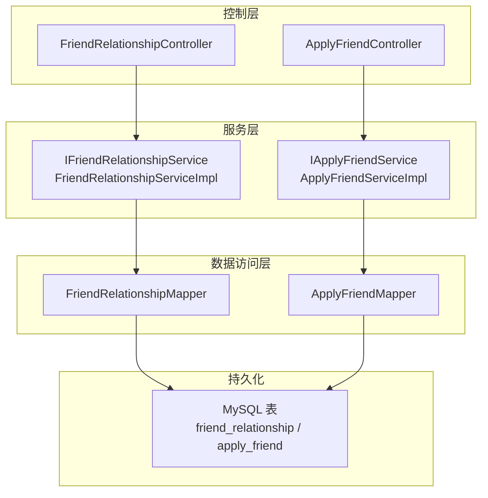
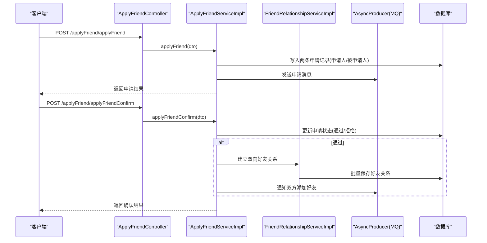
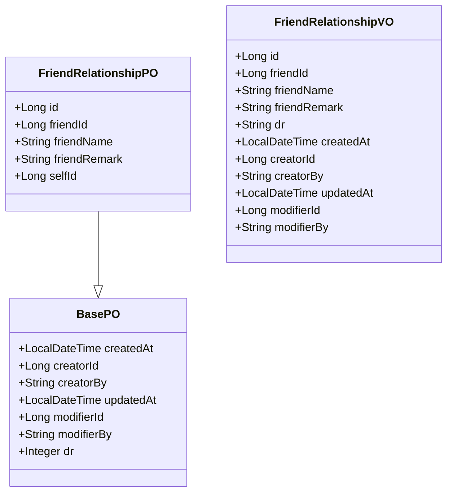
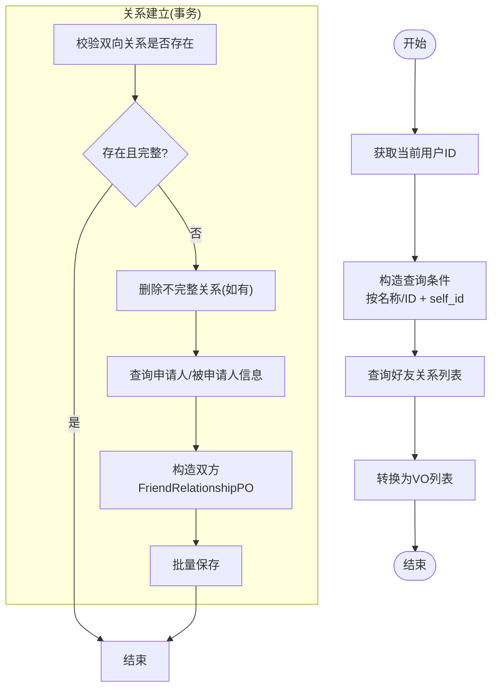
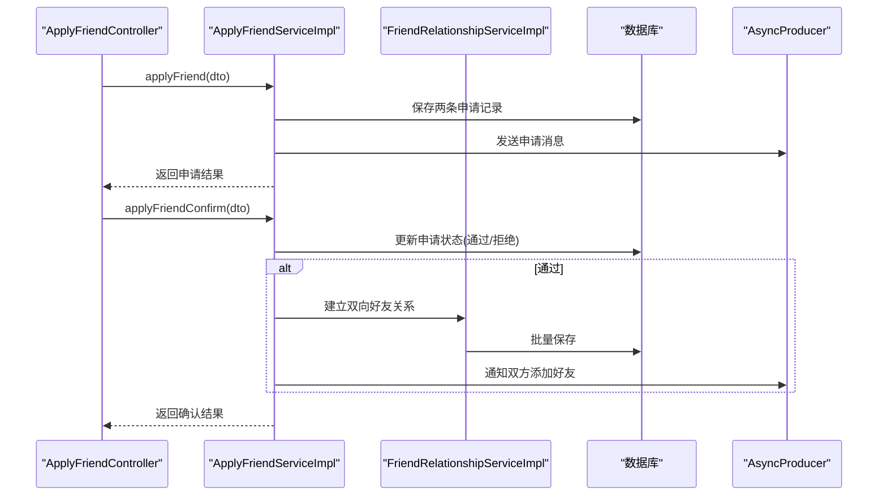
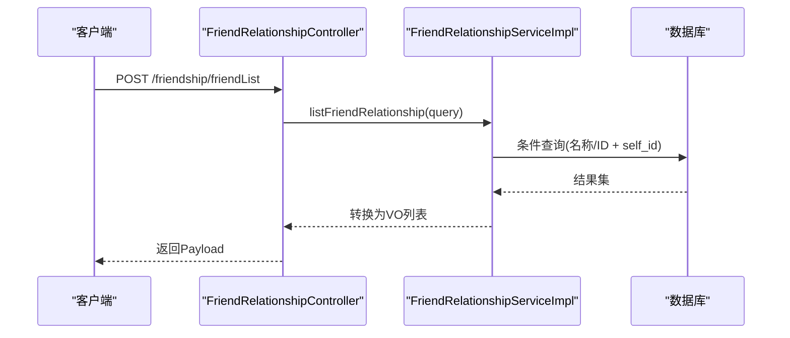
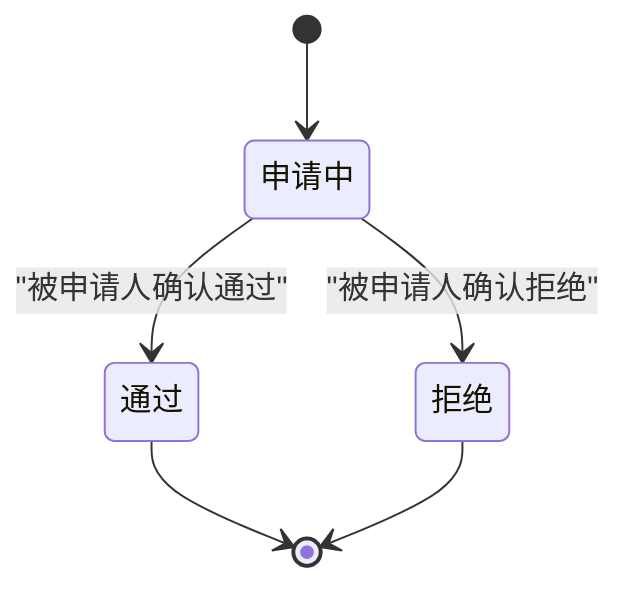
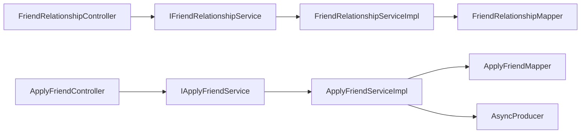

# 好友关系系统

<cite>
**本文引用的文件**
- [FriendRelationshipPO.java](file://src/main/java/com/hch/chat_simple/pojo/po/FriendRelationshipPO.java)
- [FriendRelationshipQuery.java](file://src/main/java/com/hch/chat_simple/pojo/query/FriendRelationshipQuery.java)
- [FriendRelationshipVO.java](file://src/main/java/com/hch/chat_simple/pojo/vo/FriendRelationshipVO.java)
- [BasePO.java](file://src/main/java/com/hch/chat_simple/pojo/po/BasePO.java)
- [FriendRelationshipController.java](file://src/main/java/com/hch/chat_simple/controller/FriendRelationshipController.java)
- [IFriendRelationshipService.java](file://src/main/java/com/hch/chat_simple/service/IFriendRelationshipService.java)
- [FriendRelationshipServiceImpl.java](file://src/main/java/com/hch/chat_simple/service/impl/FriendRelationshipServiceImpl.java)
- [FriendRelationshipMapper.java](file://src/main/java/com/hch/chat_simple/mapper/FriendRelationshipMapper.java)
- [FriendRelationshipMapper.xml](file://src/main/resources/mapper/FriendRelationshipMapper.xml)
- [ApplyFriendDTO.java](file://src/main/java/com/hch/chat_simple/pojo/dto/ApplyFriendDTO.java)
- [ApplyStatusEnum.java](file://src/main/java/com/hch/chat_simple/enums/ApplyStatusEnum.java)
- [ApplyFriendController.java](file://src/main/java/com/hch/chat_simple/controller/ApplyFriendController.java)
- [IApplyFriendService.java](file://src/main/java/com/hch/chat_simple/service/IApplyFriendService.java)
- [ApplyFriendServiceImpl.java](file://src/main/java/com/hch/chat_simple/service/impl/ApplyFriendServiceImpl.java)
- [chat.sql](file://db/chat.sql)
</cite>

## 目录
1. [简介](#简介)
2. [项目结构](#项目结构)
3. [核心组件](#核心组件)
4. [架构总览](#架构总览)
5. [详细组件分析](#详细组件分析)
6. [依赖分析](#依赖分析)
7. [性能考虑](#性能考虑)
8. [故障排查指南](#故障排查指南)
9. [结论](#结论)
10. [附录](#附录)

## 简介
本文件为“好友关系系统”的完整技术文档，覆盖好友申请、关系维护与状态管理等核心功能。系统采用前后端分离架构，后端基于 Spring Boot + MyBatis-Plus，数据库使用 MySQL，消息通过 MQ 异步推送。本文重点说明以下方面：
- 好友关系实体模型设计（FriendRelationshipPO 的字段与继承自 BasePO 的通用字段）
- 服务层业务逻辑（申请处理、关系建立、状态同步）
- 控制器 API 设计（RESTful 规范与参数说明）
- 好友申请状态流转（申请中、通过、拒绝）
- 好友列表查询与过滤（按名称/ID、分页思路）
- 数据一致性与并发控制策略

## 项目结构
后端采用标准分层架构：
- controller 层：对外暴露 REST API
- service 层：业务逻辑编排与事务控制
- mapper 层：MyBatis-Plus 映射接口
- pojo 层：PO/VO/DTO/Query 统一数据载体
- db：数据库初始化脚本

图表来源
- [FriendRelationshipController.java:28-48](file://src/main/java/com/hch/chat_simple/controller/FriendRelationshipController.java#L28-L48)
- [ApplyFriendController.java:28-54](file://src/main/java/com/hch/chat_simple/controller/ApplyFriendController.java#L28-L54)
- [FriendRelationshipServiceImpl.java:40-111](file://src/main/java/com/hch/chat_simple/service/impl/FriendRelationshipServiceImpl.java#L40-L111)
- [ApplyFriendServiceImpl.java:44-225](file://src/main/java/com/hch/chat_simple/service/impl/ApplyFriendServiceImpl.java#L44-L225)
- [FriendRelationshipMapper.java:17-20](file://src/main/java/com/hch/chat_simple/mapper/FriendRelationshipMapper.java#L17-L20)
- [chat.sql:20-34](file://db/chat.sql#L20-L34)
- [chat.sql:92-108](file://db/chat.sql#L92-L108)

章节来源
- [FriendRelationshipController.java:28-48](file://src/main/java/com/hch/chat_simple/controller/FriendRelationshipController.java#L28-L48)
- [ApplyFriendController.java:28-54](file://src/main/java/com/hch/chat_simple/controller/ApplyFriendController.java#L28-L54)
- [FriendRelationshipServiceImpl.java:40-111](file://src/main/java/com/hch/chat_simple/service/impl/FriendRelationshipServiceImpl.java#L40-L111)
- [ApplyFriendServiceImpl.java:44-225](file://src/main/java/com/hch/chat_simple/service/impl/ApplyFriendServiceImpl.java#L44-L225)
- [chat.sql:20-34](file://db/chat.sql#L20-L34)
- [chat.sql:92-108](file://db/chat.sql#L92-L108)

## 核心组件
- 实体模型：FriendRelationshipPO 继承 BasePO，包含基础审计字段与好友关系字段；ApplyFriendPO 存储申请记录与状态。
- 查询模型：FriendRelationshipQuery 支持按名称模糊或 ID 精确查询。
- 视图模型：FriendRelationshipVO 用于返回前端展示，包含创建/修改信息与删除标记。
- 枚举：ApplyStatusEnum 定义申请状态（申请中、通过、拒绝）。

章节来源
- [FriendRelationshipPO.java:25-44](file://src/main/java/com/hch/chat_simple/pojo/po/FriendRelationshipPO.java#L25-L44)
- [BasePO.java:14-43](file://src/main/java/com/hch/chat_simple/pojo/po/BasePO.java#L14-L43)
- [FriendRelationshipQuery.java:8-18](file://src/main/java/com/hch/chat_simple/pojo/query/FriendRelationshipQuery.java#L8-L18)
- [FriendRelationshipVO.java:16-52](file://src/main/java/com/hch/chat_simple/pojo/vo/FriendRelationshipVO.java#L16-L52)
- [ApplyStatusEnum.java:6-29](file://src/main/java/com/hch/chat_simple/enums/ApplyStatusEnum.java#L6-L29)

## 架构总览
系统围绕“好友关系”与“好友申请”两条主线展开：
- 好友关系：由 FriendRelationshipController 提供好友列表查询；FriendRelationshipServiceImpl 负责构建双向好友关系并落库。
- 好友申请：ApplyFriendController 提供申请、列表、确认接口；ApplyFriendServiceImpl 负责写入申请记录、异步通知、状态变更与关系建立。

图表来源
- [ApplyFriendController.java:41-51](file://src/main/java/com/hch/chat_simple/controller/ApplyFriendController.java#L41-L51)
- [ApplyFriendServiceImpl.java:57-174](file://src/main/java/com/hch/chat_simple/service/impl/ApplyFriendServiceImpl.java#L57-L174)
- [FriendRelationshipServiceImpl.java:57-108](file://src/main/java/com/hch/chat_simple/service/impl/FriendRelationshipServiceImpl.java#L57-L108)

## 详细组件分析

### 实体模型与数据结构
FriendRelationshipPO 继承 BasePO，具备统一的审计字段（创建/修改时间、创建者/修改者、删除标记）。其核心字段包括：
- friendId：朋友的用户标识
- friendName：朋友的名称
- friendRemark：朋友备注
- selfId：该关系所属用户标识

FriendRelationshipVO 用于对外展示，包含 DR、创建/修改时间与人员信息。

图表来源
- [FriendRelationshipPO.java:25-44](file://src/main/java/com/hch/chat_simple/pojo/po/FriendRelationshipPO.java#L25-L44)
- [BasePO.java:14-43](file://src/main/java/com/hch/chat_simple/pojo/po/BasePO.java#L14-L43)
- [FriendRelationshipVO.java:16-52](file://src/main/java/com/hch/chat_simple/pojo/vo/FriendRelationshipVO.java#L16-L52)

章节来源
- [FriendRelationshipPO.java:25-44](file://src/main/java/com/hch/chat_simple/pojo/po/FriendRelationshipPO.java#L25-L44)
- [BasePO.java:14-43](file://src/main/java/com/hch/chat_simple/pojo/po/BasePO.java#L14-L43)
- [FriendRelationshipVO.java:16-52](file://src/main/java/com/hch/chat_simple/pojo/vo/FriendRelationshipVO.java#L16-L52)

### 好友关系服务层逻辑
- 列表查询：根据当前登录用户 ID 过滤 self_id，并支持按名称模糊或 ID 精确查询，最终转换为 VO 返回。
- 关系建立：在事务中执行，先检查是否存在双向完整关系，若不完整则清理旧关系，再批量插入双方的好友关系记录。

图表来源
- [FriendRelationshipServiceImpl.java:46-55](file://src/main/java/com/hch/chat_simple/service/impl/FriendRelationshipServiceImpl.java#L46-L55)
- [FriendRelationshipServiceImpl.java:57-108](file://src/main/java/com/hch/chat_simple/service/impl/FriendRelationshipServiceImpl.java#L57-L108)

章节来源
- [FriendRelationshipServiceImpl.java:46-55](file://src/main/java/com/hch/chat_simple/service/impl/FriendRelationshipServiceImpl.java#L46-L55)
- [FriendRelationshipServiceImpl.java:57-108](file://src/main/java/com/hch/chat_simple/service/impl/FriendRelationshipServiceImpl.java#L57-L108)

### 好友申请控制器与服务层
- 控制器 API：
  - POST /applyFriend/applyRecord：获取申请记录列表（支持按更新时间增量拉取）
  - POST /applyFriend/applyFriend：提交好友申请
  - POST /applyFriend/applyFriendConfirm：确认申请（通过/拒绝）
- 服务层逻辑：
  - 申请：写入两条记录（申请人视角与被申请人视角），设置初始状态为“申请中”，并异步推送消息。
  - 确认：根据状态更新记录，若通过则建立双向好友关系并通知双方，同时向双方推送“添加好友”消息。
  - 列表：按当前用户 creator_id 查询，支持按更新时间增量拉取。

图表来源
- [ApplyFriendController.java:35-51](file://src/main/java/com/hch/chat_simple/controller/ApplyFriendController.java#L35-L51)
- [ApplyFriendServiceImpl.java:57-174](file://src/main/java/com/hch/chat_simple/service/impl/ApplyFriendServiceImpl.java#L57-L174)
- [FriendRelationshipServiceImpl.java:57-108](file://src/main/java/com/hch/chat_simple/service/impl/FriendRelationshipServiceImpl.java#L57-L108)

章节来源
- [ApplyFriendController.java:35-51](file://src/main/java/com/hch/chat_simple/controller/ApplyFriendController.java#L35-L51)
- [ApplyFriendServiceImpl.java:57-174](file://src/main/java/com/hch/chat_simple/service/impl/ApplyFriendServiceImpl.java#L57-L174)

### 好友关系控制器与查询
- 控制器 API：
  - POST /friendship/friendList：根据查询条件获取好友列表
- 查询模型：
  - 支持按名称模糊（searchType=1）或 ID 精确（searchType=2）查询
  - 默认按 self_id=当前用户过滤

图表来源
- [FriendRelationshipController.java:37-41](file://src/main/java/com/hch/chat_simple/controller/FriendRelationshipController.java#L37-L41)
- [FriendRelationshipServiceImpl.java:46-55](file://src/main/java/com/hch/chat_simple/service/impl/FriendRelationshipServiceImpl.java#L46-L55)

章节来源
- [FriendRelationshipController.java:37-41](file://src/main/java/com/hch/chat_simple/controller/FriendRelationshipController.java#L37-L41)
- [FriendRelationshipServiceImpl.java:46-55](file://src/main/java/com/hch/chat_simple/service/impl/FriendRelationshipServiceImpl.java#L46-L55)

### 好友申请状态流转
- 状态枚举：申请中、通过、拒绝
- 流程：
  - 申请提交后状态为“申请中”
  - 被申请人确认后更新为“通过”或“拒绝”
  - 若通过，自动建立双向好友关系并通知双方

图表来源
- [ApplyStatusEnum.java:6-29](file://src/main/java/com/hch/chat_simple/enums/ApplyStatusEnum.java#L6-L29)
- [ApplyFriendServiceImpl.java:115-148](file://src/main/java/com/hch/chat_simple/service/impl/ApplyFriendServiceImpl.java#L115-L148)

章节来源
- [ApplyStatusEnum.java:6-29](file://src/main/java/com/hch/chat_simple/enums/ApplyStatusEnum.java#L6-L29)
- [ApplyFriendServiceImpl.java:115-148](file://src/main/java/com/hch/chat_simple/service/impl/ApplyFriendServiceImpl.java#L115-L148)

### 好友列表查询与过滤
- 支持两种查询方式：
  - 名称模糊：searchType=1，配合 name 参数
  - ID 精确：searchType=2，配合 id 参数
- 默认过滤：self_id=当前用户
- 返回：FriendRelationshipVO 列表，包含创建/修改信息与删除标记

章节来源
- [FriendRelationshipQuery.java:8-18](file://src/main/java/com/hch/chat_simple/pojo/query/FriendRelationshipQuery.java#L8-L18)
- [FriendRelationshipServiceImpl.java:46-55](file://src/main/java/com/hch/chat_simple/service/impl/FriendRelationshipServiceImpl.java#L46-L55)
- [FriendRelationshipVO.java:16-52](file://src/main/java/com/hch/chat_simple/pojo/vo/FriendRelationshipVO.java#L16-L52)

### 数据一致性与并发控制
- 事务控制：FriendRelationshipServiceImpl.insertFriendRelationship 使用 @Transactional，确保双向关系建立的原子性。
- 并发冲突处理：
  - 在建立关系前检查是否存在双向完整关系，若不完整则删除旧关系，避免脏数据。
  - 通过批量保存减少多次往返数据库带来的竞争风险。
- 审计字段：BasePO 统一填充创建/修改时间与人员信息，便于追踪与审计。

章节来源
- [FriendRelationshipServiceImpl.java:57-108](file://src/main/java/com/hch/chat_simple/service/impl/FriendRelationshipServiceImpl.java#L57-L108)
- [BasePO.java:14-43](file://src/main/java/com/hch/chat_simple/pojo/po/BasePO.java#L14-L43)

## 依赖分析
- 控制器依赖服务接口，服务实现依赖 Mapper 与工具类。
- ApplyFriendServiceImpl 依赖 AsyncProducer 进行消息异步推送。
- FriendRelationshipMapper 与 FriendRelationshipMapper.xml 对应 MyBatis-Plus 映射。

图表来源
- [FriendRelationshipController.java:33-35](file://src/main/java/com/hch/chat_simple/controller/FriendRelationshipController.java#L33-L35)
- [FriendRelationshipServiceImpl.java:40-40](file://src/main/java/com/hch/chat_simple/service/impl/FriendRelationshipServiceImpl.java#L40-L40)
- [ApplyFriendController.java:31-32](file://src/main/java/com/hch/chat_simple/controller/ApplyFriendController.java#L31-L32)
- [ApplyFriendServiceImpl.java:44-44](file://src/main/java/com/hch/chat_simple/service/impl/ApplyFriendServiceImpl.java#L44-L44)

章节来源
- [FriendRelationshipController.java:33-35](file://src/main/java/com/hch/chat_simple/controller/FriendRelationshipController.java#L33-L35)
- [ApplyFriendController.java:31-32](file://src/main/java/com/hch/chat_simple/controller/ApplyFriendController.java#L31-L32)
- [FriendRelationshipServiceImpl.java:40-40](file://src/main/java/com/hch/chat_simple/service/impl/FriendRelationshipServiceImpl.java#L40-L40)
- [ApplyFriendServiceImpl.java:44-44](file://src/main/java/com/hch/chat_simple/service/impl/ApplyFriendServiceImpl.java#L44-L44)

## 性能考虑
- 查询优化：
  - 好友列表查询默认按 self_id 过滤，建议在该列建立索引以提升过滤效率。
  - 模糊查询 name 建议配合分页（当前实现未显式分页，可结合 PageBean 扩展）。
- 批量操作：
  - 双向关系建立使用批量保存，减少网络往返与锁竞争。
- 异步通知：
  - 申请与结果通过 MQ 异步推送，降低请求链路阻塞。

## 故障排查指南
- 申请记录缺失：
  - 确认 ApplyFriendServiceImpl.applyFriend 是否正确写入两条记录（申请人/被申请人视角）。
  - 检查 AsyncProducer 是否正常工作，以及 MQ 主题配置。
- 关系未建立：
  - 检查 FriendRelationshipServiceImpl.insertFriendRelationship 的事务是否生效。
  - 核对双向关系检查逻辑与批量保存调用。
- 列表查询异常：
  - 确认 FriendRelationshipQuery 的 searchType 与参数传递是否正确。
  - 核对当前用户上下文是否正确注入。

章节来源
- [ApplyFriendServiceImpl.java:57-89](file://src/main/java/com/hch/chat_simple/service/impl/ApplyFriendServiceImpl.java#L57-L89)
- [FriendRelationshipServiceImpl.java:57-108](file://src/main/java/com/hch/chat_simple/service/impl/FriendRelationshipServiceImpl.java#L57-L108)
- [FriendRelationshipServiceImpl.java:46-55](file://src/main/java/com/hch/chat_simple/service/impl/FriendRelationshipServiceImpl.java#L46-L55)

## 结论
本系统围绕“好友关系”与“好友申请”两条主线，提供了完整的申请、确认、关系建立与查询能力。通过统一的实体模型与审计字段、事务化的服务层逻辑、以及异步消息推送，实现了较好的扩展性与可靠性。后续可在查询分页、在线状态联动、以及更细粒度的并发控制上进一步增强。

## 附录
- 数据库表结构参考：
  - friend_relationship：存储双向好友关系
  - apply_friend：存储申请记录与状态
- 建议补充：
  - 在 friend_relationship.self_id、apply_friend.target_user 等常用查询字段建立索引
  - 在 FriendRelationshipController 中增加分页查询能力
  - 在 FriendRelationshipServiceImpl 中增加在线状态字段映射（如需）

章节来源
- [chat.sql:20-34](file://db/chat.sql#L20-L34)
- [chat.sql:92-108](file://db/chat.sql#L92-L108)