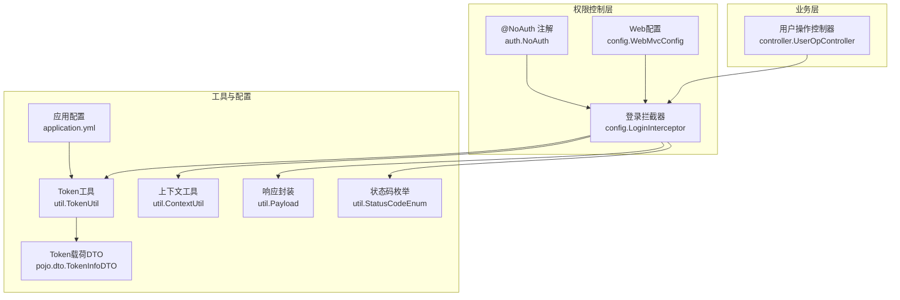
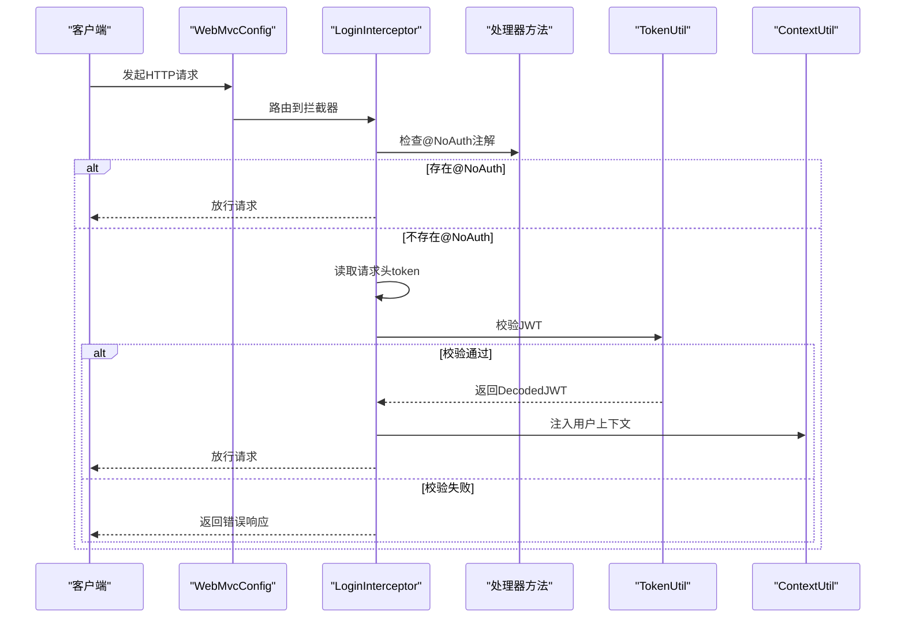
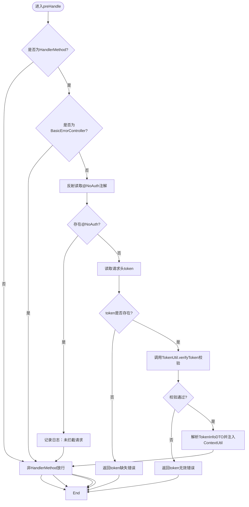
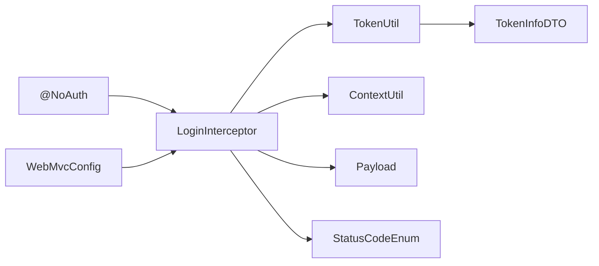

# @NoAuth注解

<cite>
**本文引用的文件列表**
- [NoAuth.java](file://src/main/java/com/hch/chat_simple/auth/NoAuth.java)
- [LoginInterceptor.java](file://src/main/java/com/hch/chat_simple/config/LoginInterceptor.java)
- [WebMvcConfig.java](file://src/main/java/com/hch/chat_simple/config/WebMvcConfig.java)
- [UserOpController.java](file://src/main/java/com/hch/chat_simple/controller/UserOpController.java)
- [TokenUtil.java](file://src/main/java/com/hch/chat_simple/util/TokenUtil.java)
- [ContextUtil.java](file://src/main/java/com/hch/chat_simple/util/ContextUtil.java)
- [Payload.java](file://src/main/java/com/hch/chat_simple/util/Payload.java)
- [StatusCodeEnum.java](file://src/main/java/com/hch/chat_simple/util/StatusCodeEnum.java)
- [TokenInfoDTO.java](file://src/main/java/com/hch/chat_simple/pojo/dto/TokenInfoDTO.java)
- [application.yml](file://src/main/resources/application.yml)
</cite>

## 目录
1. [简介](#简介)
2. [项目结构](#项目结构)
3. [核心组件](#核心组件)
4. [架构总览](#架构总览)
5. [详细组件分析](#详细组件分析)
6. [依赖关系分析](#依赖关系分析)
7. [性能考量](#性能考量)
8. [故障排查指南](#故障排查指南)
9. [结论](#结论)
10. [附录](#附录)

## 简介
本文件围绕@NoAuth注解展开，系统化阐述其在权限控制体系中的作用与实现机制。@NoAuth作为“开放接口”标记，用于声明某些接口无需认证即可访问，从而绕过统一登录拦截器的校验流程。本文将从设计理念、使用场景、拦截器识别与处理逻辑、参数配置、典型用法、与拦截器协作流程、最佳实践与安全注意事项等方面进行全面解析。

## 项目结构
该工程采用Spring Boot标准目录结构，权限控制相关的核心代码集中在以下模块：
- 注解定义：auth包下的NoAuth.java
- 拦截器：config包下的LoginInterceptor.java
- Web配置：config包下的WebMvcConfig.java
- 控制器示例：controller包下的UserOpController.java等
- 工具类：util包下的TokenUtil.java、ContextUtil.java、Payload.java、StatusCodeEnum.java、TokenInfoDTO.java
- 应用配置：resources/application.yml

图表来源
- [NoAuth.java:1-14](file://src/main/java/com/hch/chat_simple/auth/NoAuth.java#L1-L14)
- [LoginInterceptor.java:1-109](file://src/main/java/com/hch/chat_simple/config/LoginInterceptor.java#L1-L109)
- [WebMvcConfig.java:1-28](file://src/main/java/com/hch/chat_simple/config/WebMvcConfig.java#L1-L28)
- [UserOpController.java:1-114](file://src/main/java/com/hch/chat_simple/controller/UserOpController.java#L1-L114)
- [TokenUtil.java:1-71](file://src/main/java/com/hch/chat_simple/util/TokenUtil.java#L1-L71)
- [ContextUtil.java:1-52](file://src/main/java/com/hch/chat_simple/util/ContextUtil.java#L1-L52)
- [Payload.java:1-30](file://src/main/java/com/hch/chat_simple/util/Payload.java#L1-L30)
- [StatusCodeEnum.java:1-22](file://src/main/java/com/hch/chat_simple/util/StatusCodeEnum.java#L1-L22)
- [TokenInfoDTO.java:1-20](file://src/main/java/com/hch/chat_simple/pojo/dto/TokenInfoDTO.java#L1-L20)
- [application.yml:1-89](file://src/main/resources/application.yml#L1-L89)

章节来源
- [NoAuth.java:1-14](file://src/main/java/com/hch/chat_simple/auth/NoAuth.java#L1-L14)
- [LoginInterceptor.java:1-109](file://src/main/java/com/hch/chat_simple/config/LoginInterceptor.java#L1-L109)
- [WebMvcConfig.java:1-28](file://src/main/java/com/hch/chat_simple/config/WebMvcConfig.java#L1-L28)
- [UserOpController.java:1-114](file://src/main/java/com/hch/chat_simple/controller/UserOpController.java#L1-L114)
- [TokenUtil.java:1-71](file://src/main/java/com/hch/chat_simple/util/TokenUtil.java#L1-L71)
- [ContextUtil.java:1-52](file://src/main/java/com/hch/chat_simple/util/ContextUtil.java#L1-L52)
- [Payload.java:1-30](file://src/main/java/com/hch/chat_simple/util/Payload.java#L1-L30)
- [StatusCodeEnum.java:1-22](file://src/main/java/com/hch/chat_simple/util/StatusCodeEnum.java#L1-L22)
- [TokenInfoDTO.java:1-20](file://src/main/java/com/hch/chat_simple/pojo/dto/TokenInfoDTO.java#L1-L20)
- [application.yml:1-89](file://src/main/resources/application.yml#L1-L89)

## 核心组件
- @NoAuth注解：通过元注解声明其目标类型为方法与类型，并在运行时生效，提供description属性用于描述该开放接口用途。
- LoginInterceptor拦截器：在preHandle阶段对请求进行拦截，优先检查是否带有@NoAuth注解；若存在则直接放行；否则执行token校验与上下文注入。
- WebMvcConfig：注册拦截器并对路径模式进行匹配与排除，确保开放接口不受拦截器影响。
- TokenUtil：负责JWT令牌的生成、验证与解析，支持过期续签策略。
- ContextUtil：线程本地存储当前请求的用户上下文信息，便于后续业务处理。
- Payload/StatusCodeEnum：统一封装响应数据与状态码，便于错误提示与前端处理。
- TokenInfoDTO：承载JWT载荷中的用户标识信息。

章节来源
- [NoAuth.java:8-13](file://src/main/java/com/hch/chat_simple/auth/NoAuth.java#L8-L13)
- [LoginInterceptor.java:30-90](file://src/main/java/com/hch/chat_simple/config/LoginInterceptor.java#L30-L90)
- [WebMvcConfig.java:12-16](file://src/main/java/com/hch/chat_simple/config/WebMvcConfig.java#L12-L16)
- [TokenUtil.java:23-59](file://src/main/java/com/hch/chat_simple/util/TokenUtil.java#L23-L59)
- [ContextUtil.java:12-49](file://src/main/java/com/hch/chat_simple/util/ContextUtil.java#L12-L49)
- [Payload.java:18-28](file://src/main/java/com/hch/chat_simple/util/Payload.java#L18-L28)
- [StatusCodeEnum.java:6-13](file://src/main/java/com/hch/chat_simple/util/StatusCodeEnum.java#L6-L13)
- [TokenInfoDTO.java:16-18](file://src/main/java/com/hch/chat_simple/pojo/dto/TokenInfoDTO.java#L16-L18)

## 架构总览
@NoAuth注解与拦截器协同工作，形成“开放接口白名单 + 统一认证”的权限控制架构。其关键流程如下：
- WebMvcConfig注册拦截器并配置排除路径；
- 请求进入LoginInterceptor.preHandle；
- 若目标方法或类型标注@NoAuth，则直接放行；
- 否则读取请求头token并进行JWT校验；
- 校验通过则注入用户上下文，继续后续业务；
- 校验失败则返回标准化错误响应。

图表来源
- [WebMvcConfig.java:12-16](file://src/main/java/com/hch/chat_simple/config/WebMvcConfig.java#L12-L16)
- [LoginInterceptor.java:30-90](file://src/main/java/com/hch/chat_simple/config/LoginInterceptor.java#L30-L90)
- [TokenUtil.java:48-59](file://src/main/java/com/hch/chat_simple/util/TokenUtil.java#L48-L59)
- [ContextUtil.java:12-49](file://src/main/java/com/hch/chat_simple/util/ContextUtil.java#L12-L49)

## 详细组件分析

### @NoAuth注解设计与参数
- 设计理念
  - 通过注解声明式地标识“开放接口”，降低硬编码判断的复杂度；
  - 仅在运行时生效，结合拦截器反射读取，实现零侵入的权限控制；
  - 支持方法级与类型级标注，便于批量开放接口。
- 参数配置
  - description：字符串，默认为空，用于记录该开放接口的用途说明，便于审计与文档生成。
- 扩展性设计
  - 当前仅包含description属性，具备良好的向后兼容性；
  - 可在未来扩展如白名单IP、来源域、时间窗口等策略，但需同步更新拦截器逻辑。

章节来源
- [NoAuth.java:8-13](file://src/main/java/com/hch/chat_simple/auth/NoAuth.java#L8-L13)

### 拦截器识别与处理逻辑
- 反射机制
  - 通过HandlerMethod.getMethod().getAnnotation(NoAuth.class)读取注解；
  - 判断注解是否存在决定是否放行。
- 注解扫描
  - 仅对HandlerMethod类型的处理器进行注解扫描；
  - 对BasicErrorController实例直接放行，避免错误页面被拦截。
- 访问控制决策
  - 存在@NoAuth：直接返回true放行；
  - 不存在@NoAuth：读取请求头token，调用TokenUtil.verifyToken进行校验；
  - 校验通过：解析TokenInfoDTO并注入ContextUtil上下文；
  - 校验失败：构造Payload并输出标准化错误响应；
  - 过期续签：当expiresAt小于当前时间时，生成新token并通过异常机制触发后续处理返回给客户端。

图表来源
- [LoginInterceptor.java:30-90](file://src/main/java/com/hch/chat_simple/config/LoginInterceptor.java#L30-L90)
- [TokenUtil.java:48-59](file://src/main/java/com/hch/chat_simple/util/TokenUtil.java#L48-L59)
- [ContextUtil.java:12-49](file://src/main/java/com/hch/chat_simple/util/ContextUtil.java#L12-L49)

章节来源
- [LoginInterceptor.java:30-90](file://src/main/java/com/hch/chat_simple/config/LoginInterceptor.java#L30-L90)

### 与拦截器协作的完整流程
- 请求拦截：WebMvcConfig注册LoginInterceptor并对/**路径生效，同时排除/login、/error/**、Swagger相关路径；
- 注解检查：拦截器读取目标方法的@NoAuth注解；
- 放行处理：若存在@NoAuth或token有效且未过期，则放行；
- 异常与续签：token过期时抛出TokenExpiredException，由上层切面或异常处理器捕获并返回新token；
- 上下文清理：afterCompletion中清空线程本地存储，防止内存泄漏。

章节来源
- [WebMvcConfig.java:12-16](file://src/main/java/com/hch/chat_simple/config/WebMvcConfig.java#L12-L16)
- [LoginInterceptor.java:92-97](file://src/main/java/com/hch/chat_simple/config/LoginInterceptor.java#L92-L97)

### 常见使用场景与示例
- 用户注册/新增用户
  - 在新增用户的POST接口上标注@NoAuth，允许匿名提交注册表单；
  - 示例参考：UserOpController中对/saveUser或/insertUser接口的标注。
- 用户登录
  - 登录接口需要@NoAuth，以便客户端在未持有token时完成身份认证；
  - 示例参考：UserOpController中@PostMapping("/login")处的@NoAuth(description="登录")。
- 验证码/公开信息
  - 可在获取验证码、公开信息查询等接口上标注@NoAuth，便于前端直接调用；
  - 注意：仅暴露必要且无敏感信息的接口，避免泄露内部数据。
- 文件上传/预览
  - 文件上传接口通常不需要认证，可在FileUploadController中对/upload等接口标注@NoAuth；
  - 注意：结合后端安全策略限制文件类型与大小，避免滥用。

章节来源
- [UserOpController.java:44-66](file://src/main/java/com/hch/chat_simple/controller/UserOpController.java#L44-L66)
- [UserOpController.java:105-111](file://src/main/java/com/hch/chat_simple/controller/UserOpController.java#L105-L111)

### 参数配置与扩展性
- description属性
  - 用于记录开放接口的用途，便于审计与文档生成；
  - 建议每个@NoAuth(description="...")均提供清晰描述。
- 扩展性设计
  - 可在未来增加策略字段（如白名单IP、来源域、时间窗口）；
  - 需同步修改拦截器的反射读取与决策逻辑，确保向后兼容。

章节来源
- [NoAuth.java:12](file://src/main/java/com/hch/chat_simple/auth/NoAuth.java#L12)

### 与JWT与上下文的集成
- JWT生成与校验
  - TokenUtil负责创建与验证JWT，设置issuer、过期时间与签名算法；
  - 支持过期宽限期，便于续签新token。
- 上下文注入
  - 校验通过后，从JWT载荷中解析TokenInfoDTO并注入ContextUtil；
  - 业务层可通过ContextUtil获取当前用户信息，实现无侵入的用户态管理。

章节来源
- [TokenUtil.java:23-59](file://src/main/java/com/hch/chat_simple/util/TokenUtil.java#L23-L59)
- [ContextUtil.java:12-49](file://src/main/java/com/hch/chat_simple/util/ContextUtil.java#L12-L49)
- [TokenInfoDTO.java:16-18](file://src/main/java/com/hch/chat_simple/pojo/dto/TokenInfoDTO.java#L16-L18)

## 依赖关系分析
- 注解与拦截器
  - LoginInterceptor依赖NoAuth注解进行开放接口识别；
  - 通过反射读取注解并据此放行。
- 拦截器与工具类
  - LoginInterceptor依赖TokenUtil进行JWT校验；
  - 依赖ContextUtil注入用户上下文；
  - 依赖Payload与StatusCodeEnum进行标准化响应。
- Web配置与拦截器
  - WebMvcConfig注册拦截器并对路径进行匹配与排除；
  - 排除/login、/error/**、Swagger相关路径，避免开放接口被拦截。

图表来源
- [NoAuth.java:8-13](file://src/main/java/com/hch/chat_simple/auth/NoAuth.java#L8-L13)
- [LoginInterceptor.java:30-90](file://src/main/java/com/hch/chat_simple/config/LoginInterceptor.java#L30-L90)
- [WebMvcConfig.java:12-16](file://src/main/java/com/hch/chat_simple/config/WebMvcConfig.java#L12-L16)
- [TokenUtil.java:48-59](file://src/main/java/com/hch/chat_simple/util/TokenUtil.java#L48-L59)
- [ContextUtil.java:12-49](file://src/main/java/com/hch/chat_simple/util/ContextUtil.java#L12-L49)
- [Payload.java:18-28](file://src/main/java/com/hch/chat_simple/util/Payload.java#L18-L28)
- [StatusCodeEnum.java:6-13](file://src/main/java/com/hch/chat_simple/util/StatusCodeEnum.java#L6-L13)
- [TokenInfoDTO.java:16-18](file://src/main/java/com/hch/chat_simple/pojo/dto/TokenInfoDTO.java#L16-L18)

章节来源
- [NoAuth.java:8-13](file://src/main/java/com/hch/chat_simple/auth/NoAuth.java#L8-L13)
- [LoginInterceptor.java:30-90](file://src/main/java/com/hch/chat_simple/config/LoginInterceptor.java#L30-L90)
- [WebMvcConfig.java:12-16](file://src/main/java/com/hch/chat_simple/config/WebMvcConfig.java#L12-L16)
- [TokenUtil.java:48-59](file://src/main/java/com/hch/chat_simple/util/TokenUtil.java#L48-L59)
- [ContextUtil.java:12-49](file://src/main/java/com/hch/chat_simple/util/ContextUtil.java#L12-L49)
- [Payload.java:18-28](file://src/main/java/com/hch/chat_simple/util/Payload.java#L18-L28)
- [StatusCodeEnum.java:6-13](file://src/main/java/com/hch/chat_simple/util/StatusCodeEnum.java#L6-L13)
- [TokenInfoDTO.java:16-18](file://src/main/java/com/hch/chat_simple/pojo/dto/TokenInfoDTO.java#L16-L18)

## 性能考量
- 反射开销
  - 每次请求都会进行一次反射读取@NoAuth注解，建议在高频接口上谨慎使用大量注解；
  - 可考虑在业务层引入轻量级缓存或策略模式减少重复反射。
- JWT校验
  - TokenUtil.verifyToken为O(1)操作，性能开销极低；
  - 过期续签逻辑仅在过期时触发，正常情况下不会产生额外开销。
- 线程本地存储
  - ContextUtil使用TransmittableThreadLocal，适合多线程与异步场景，避免上下文丢失；
  - afterCompletion中及时清理，避免内存泄漏。

[本节为通用性能讨论，不直接分析具体文件]

## 故障排查指南
- 现象：开放接口仍被拦截
  - 检查WebMvcConfig是否正确排除了对应路径；
  - 确认@NoAuth注解是否标注在正确的处理器方法上；
  - 查看拦截器日志，确认是否命中@NoAuth分支。
- 现象：登录接口无法访问
  - 确认登录接口已标注@NoAuth；
  - 检查请求头是否携带token（登录接口通常不需要token）。
- 现象：token校验失败
  - 检查TokenUtil签名密钥、issuer与过期时间配置；
  - 确认客户端传递的token格式正确且未被篡改。
- 现象：上下文未注入
  - 确认TokenUtil.verifyToken返回的DecodedJWT有效；
  - 检查ContextUtil.setUserId/Username/RealName是否被正确调用；
  - 确认afterCompletion是否被调用并清理上下文。

章节来源
- [WebMvcConfig.java:12-16](file://src/main/java/com/hch/chat_simple/config/WebMvcConfig.java#L12-L16)
- [LoginInterceptor.java:30-90](file://src/main/java/com/hch/chat_simple/config/LoginInterceptor.java#L30-L90)
- [TokenUtil.java:48-59](file://src/main/java/com/hch/chat_simple/util/TokenUtil.java#L48-L59)
- [ContextUtil.java:92-97](file://src/main/java/com/hch/chat_simple/config/LoginInterceptor.java#L92-L97)

## 结论
@NoAuth注解通过声明式方式简化了开放接口的权限控制，配合LoginInterceptor实现了“开放接口白名单 + 统一认证”的灵活架构。其设计简洁、扩展性强，适用于多种匿名访问场景。在实际使用中，应严格遵循最小暴露原则，仅开放必要的接口，并结合完善的日志与监控，确保系统安全与稳定。

[本节为总结性内容，不直接分析具体文件]

## 附录

### 最佳实践与注意事项
- 仅开放必要接口
  - 将登录、注册、验证码等必需的匿名接口标注@NoAuth；
  - 避免将敏感数据查询或写操作暴露为开放接口。
- 明确描述与审计
  - 为每个@NoAuth(description="...")提供清晰用途说明；
  - 定期审计开放接口清单，移除不再需要的开放接口。
- 安全加固
  - 对开放接口实施限流与频率控制；
  - 结合IP白名单、来源域校验等策略；
  - 使用HTTPS传输，防止中间人攻击。
- 日志与监控
  - 记录@NoAuth接口的访问日志；
  - 监控异常与错误响应，及时发现潜在风险。
- 版本演进
  - 保持@NoAuth的向后兼容性；
  - 新增策略字段时，确保拦截器逻辑兼容旧版本注解。

[本节为通用指导，不直接分析具体文件]