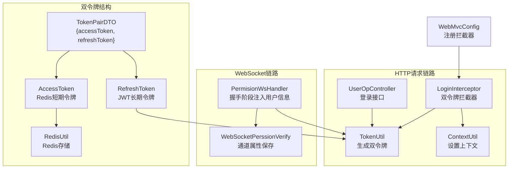
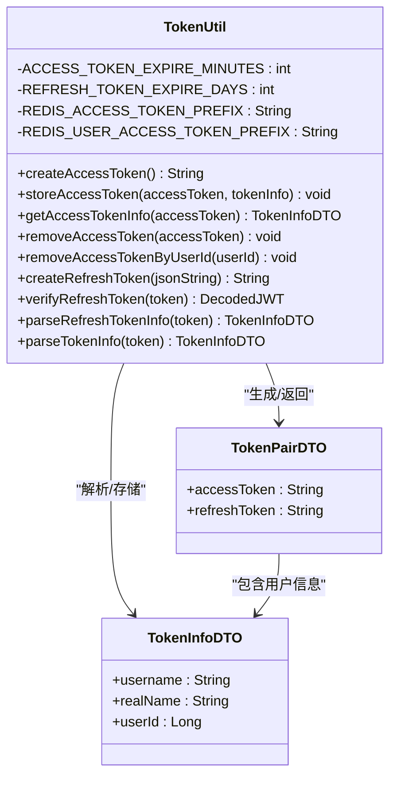
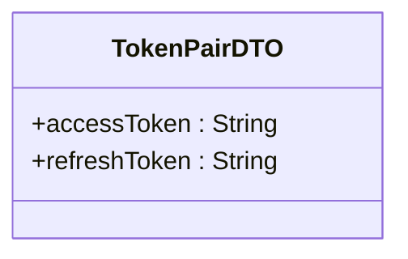
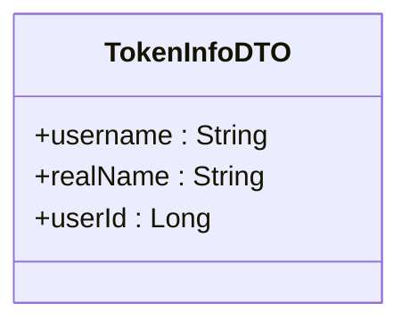
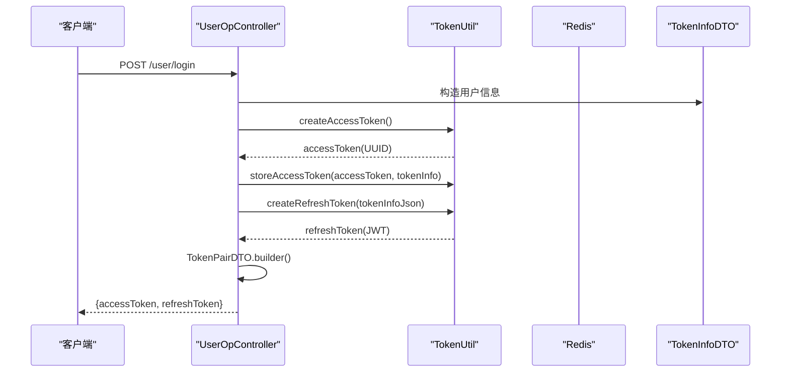
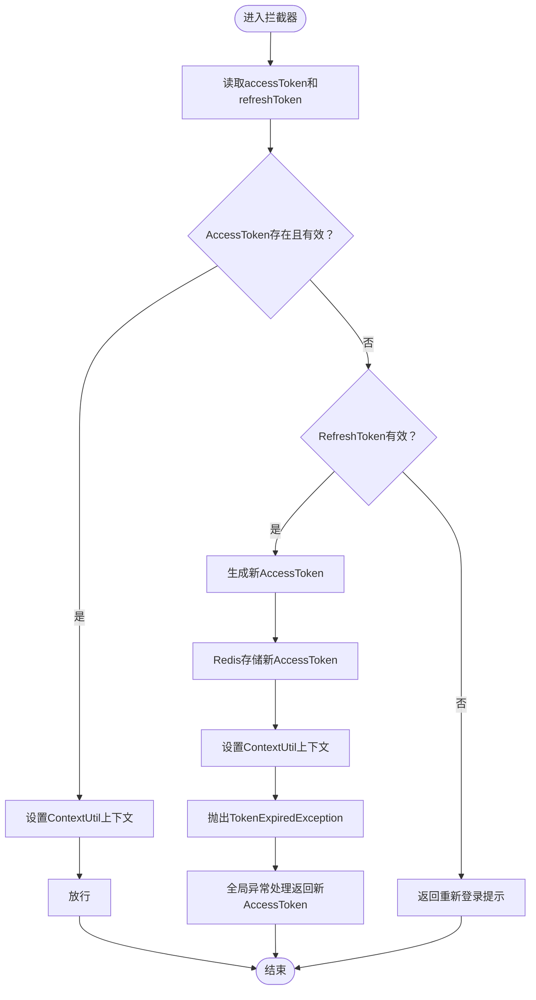
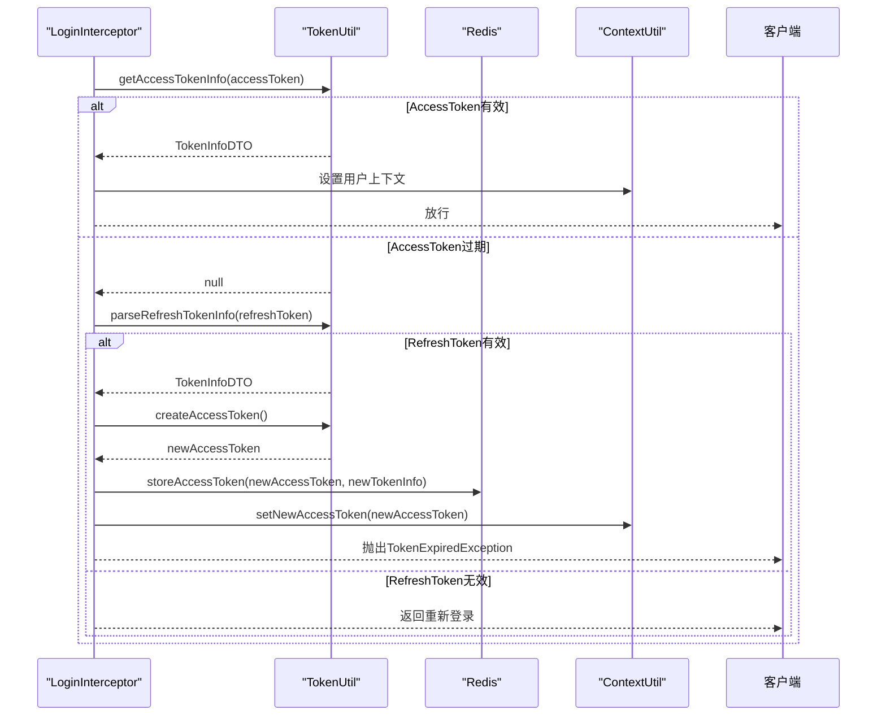
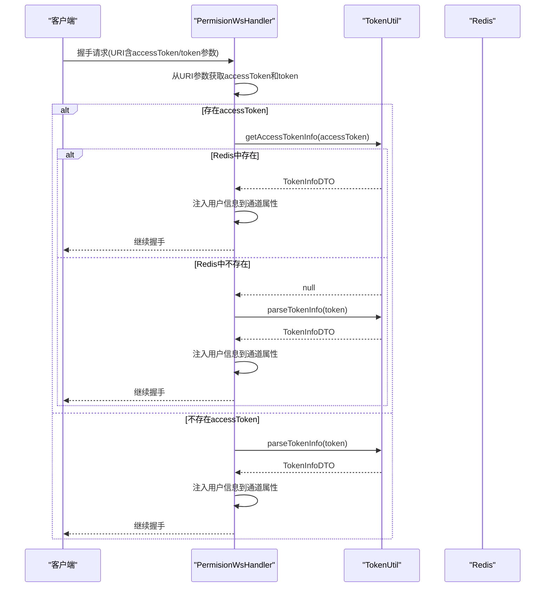
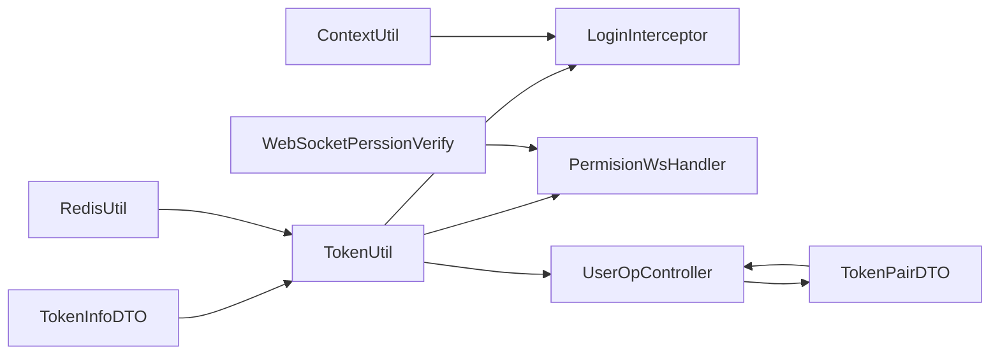

# JWT认证机制

<cite>
**本文引用的文件**
- [TokenUtil.java](file://src/main/java/com/hch/chat_simple/util/TokenUtil.java)
- [TokenInfoDTO.java](file://src/main/java/com/hch/chat_simple/pojo/dto/TokenInfoDTO.java)
- [TokenPairDTO.java](file://src/main/java/com/hch/chat_simple/pojo/dto/TokenPairDTO.java)
- [LoginInterceptor.java](file://src/main/java/com/hch/chat_simple/config/LoginInterceptor.java)
- [UserOpController.java](file://src/main/java/com/hch/chat_simple/controller/UserOpController.java)
- [ContextUtil.java](file://src/main/java/com/hch/chat_simple/util/ContextUtil.java)
- [PermisionWsHandler.java](file://src/main/java/com/hch/chat_simple/handler/PermisionWsHandler.java)
- [WebSocketChatHandler.java](file://src/main/java/com/hch/chat_simple/handler/WebSocketChatHandler.java)
- [RedisUtil.java](file://src/main/java/com/hch/chat_simple/util/RedisUtil.java)
- [application.yml](file://src/main/resources/application.yml)
</cite>

## 更新摘要
**变更内容**
- 从单令牌机制升级为双令牌认证机制
- 新增TokenPairDTO数据传输对象
- 实现AccessToken（Redis短期令牌）和RefreshToken（JWT长期令牌）分离
- 更新拦截器支持双令牌认证和自动刷新
- 保持WebSocket兼容性支持

## 目录
1. [简介](#简介)
2. [项目结构](#项目结构)
3. [核心组件](#核心组件)
4. [架构总览](#架构总览)
5. [详细组件分析](#详细组件分析)
6. [依赖分析](#依赖分析)
7. [性能考虑](#性能考虑)
8. [故障排查指南](#故障排查指南)
9. [结论](#结论)
10. [附录](#附录)

## 简介
本文件系统性梳理该聊天应用的JWT认证机制，围绕双令牌认证体系实现令牌生成、验证与刷新，覆盖以下主题：
- TokenUtil工具类：双令牌生成与管理、Redis集成、JWT验证
- TokenPairDTO数据传输对象：双令牌组合封装
- TokenInfoDTO数据传输对象：用户信息封装
- 双令牌认证流程：AccessToken（Redis短期）+ RefreshToken（JWT长期）
- 令牌验证机制：双令牌优先级、自动刷新策略
- WebSocket连接中的令牌兼容处理
- JWT配置最佳实践与安全注意事项

## 项目结构
围绕双令牌认证的关键模块分布如下：
- 工具层：TokenUtil（双令牌生成/验证/管理）、ContextUtil（线程本地上下文）
- DTO层：TokenPairDTO（双令牌载体）、TokenInfoDTO（用户信息载体）
- 控制器层：UserOpController（登录接口，生成双令牌）
- 拦截与配置：LoginInterceptor（HTTP拦截，双令牌认证）
- WebSocket层：PermisionWsHandler（握手阶段校验与注入用户信息）



**图表来源**
- [UserOpController.java:49-81](file://src/main/java/com/hch/chat_simple/controller/UserOpController.java#L49-L81)
- [TokenUtil.java:39-152](file://src/main/java/com/hch/chat_simple/util/TokenUtil.java#L39-L152)
- [TokenPairDTO.java:17-24](file://src/main/java/com/hch/chat_simple/pojo/dto/TokenPairDTO.java#L17-L24)
- [LoginInterceptor.java:47-89](file://src/main/java/com/hch/chat_simple/config/LoginInterceptor.java#L47-L89)
- [ContextUtil.java:49-51](file://src/main/java/com/hch/chat_simple/util/ContextUtil.java#L49-L51)
- [PermisionWsHandler.java:47-78](file://src/main/java/com/hch/chat_simple/handler/PermisionWsHandler.java#L47-L78)

**章节来源**
- [UserOpController.java:49-81](file://src/main/java/com/hch/chat_simple/controller/UserOpController.java#L49-L81)
- [TokenUtil.java:39-152](file://src/main/java/com/hch/chat_simple/util/TokenUtil.java#L39-L152)
- [TokenPairDTO.java:17-24](file://src/main/java/com/hch/chat_simple/pojo/dto/TokenPairDTO.java#L17-L24)
- [LoginInterceptor.java:47-89](file://src/main/java/com/hch/chat_simple/config/LoginInterceptor.java#L47-L89)
- [ContextUtil.java:49-51](file://src/main/java/com/hch/chat_simple/util/ContextUtil.java#L49-L51)
- [PermisionWsHandler.java:47-78](file://src/main/java/com/hch/chat_simple/handler/PermisionWsHandler.java#L47-L78)

## 核心组件
- **TokenUtil**：双令牌管理核心，支持AccessToken（Redis短期）和RefreshToken（JWT长期）的生成、验证、存储与刷新
- **TokenPairDTO**：承载双令牌的数据传输对象，包含accessToken和refreshToken字段
- **TokenInfoDTO**：承载用户标识信息（用户名、真实名、用户ID），作为令牌的载荷内容
- **LoginInterceptor**：双令牌认证拦截器，优先验证AccessToken，失败时使用RefreshToken自动刷新
- **ContextUtil**：线程本地变量，保存当前用户上下文（用户ID、用户名、真实名、新AccessToken）
- **WebSocket相关**：PermisionWsHandler在握手阶段支持双令牌兼容处理

**章节来源**
- [TokenUtil.java:39-152](file://src/main/java/com/hch/chat_simple/util/TokenUtil.java#L39-L152)
- [TokenPairDTO.java:17-24](file://src/main/java/com/hch/chat_simple/pojo/dto/TokenPairDTO.java#L17-L24)
- [TokenInfoDTO.java:16-19](file://src/main/java/com/hch/chat_simple/pojo/dto/TokenInfoDTO.java#L16-L19)
- [LoginInterceptor.java:25-28](file://src/main/java/com/hch/chat_simple/config/LoginInterceptor.java#L25-L28)
- [ContextUtil.java:49-51](file://src/main/java/com/hch/chat_simple/util/ContextUtil.java#L49-L51)
- [PermisionWsHandler.java:24-26](file://src/main/java/com/hch/chat_simple/handler/PermisionWsHandler.java#L24-L26)

## 架构总览
下图展示双令牌认证机制的完整交互流程：

```mermaid
sequenceDiagram
participant Client as "客户端"
participant Ctrl as "UserOpController"
participant TU as "TokenUtil"
participant LI as "LoginInterceptor"
participant Ctx as "ContextUtil"
participant WS_P as "PermisionWsHandler"
rect rgb(255,255,255)
Note over Client,Ctrl : 双令牌登录流程
Client->>Ctrl : POST /user/login
Ctrl->>TU : createAccessToken()
TU-->>Ctrl : accessToken(UUID)
Ctrl->>TU : storeAccessToken(accessToken, tokenInfo)
Ctrl->>TU : createRefreshToken(tokenInfoJson)
TU-->>Ctrl : refreshToken(JWT)
Ctrl->>Ctrl : TokenPairDTO.builder()
Ctrl-->>Client : {accessToken, refreshToken}
end
rect rgb(255,255,255)
Note over Client,LI : 双令牌认证流程
Client->>LI : 带accessToken访问受保护资源
LI->>TU : getAccessTokenInfo(accessToken)
alt AccessToken有效
TU-->>LI : TokenInfoDTO
LI->>Ctx : 设置用户上下文
LI-->>Client : 放行
else AccessToken过期
TU-->>LI : null
LI->>TU : parseRefreshTokenInfo(refreshToken)
alt RefreshToken有效
TU-->>LI : TokenInfoDTO
LI->>TU : createAccessToken()
LI->>TU : storeAccessToken(newAccessToken, newTokenInfo)
LI->>Ctx : setNewAccessToken(newAccessToken)
LI-->>Client : 抛出TokenExpiredException
else RefreshToken无效
LI-->>Client : 返回重新登录
end
end
rect rgb(255,255,255)
Note over Client,WS_P : WebSocket双令牌兼容
Client->>WS_P : 握手请求(URI含accessToken/token参数)
WS_P->>TU : getAccessTokenInfo(accessToken)
alt Redis中存在
TU-->>WS_P : TokenInfoDTO
WS_P->>WS_P : 注入用户信息到通道属性
WS_P-->>Client : 继续握手
else Redis中不存在
TU-->>WS_P : null
WS_P->>TU : parseTokenInfo(token)
TU-->>WS_P : TokenInfoDTO
WS_P->>WS_P : 注入用户信息到通道属性
WS_P-->>Client : 继续握手
end
end
```

**图表来源**
- [UserOpController.java:67-81](file://src/main/java/com/hch/chat_simple/controller/UserOpController.java#L67-L81)
- [TokenUtil.java:48-152](file://src/main/java/com/hch/chat_simple/util/TokenUtil.java#L48-L152)
- [LoginInterceptor.java:47-129](file://src/main/java/com/hch/chat_simple/config/LoginInterceptor.java#L47-L129)
- [ContextUtil.java:49-51](file://src/main/java/com/hch/chat_simple/util/ContextUtil.java#L49-L51)
- [PermisionWsHandler.java:47-78](file://src/main/java/com/hch/chat_simple/handler/PermisionWsHandler.java#L47-L78)

## 详细组件分析

### TokenUtil工具类（双令牌机制）
- **AccessToken管理**：UUID生成、Redis存储、过期时间控制、用户映射维护
- **RefreshToken管理**：JWT生成、7天有效期、严格过期校验、载荷解析
- **双令牌集成**：支持AccessToken过期时自动使用RefreshToken刷新
- **兼容性支持**：保留旧版单令牌方法用于WebSocket等场景



**图表来源**
- [TokenUtil.java:39-152](file://src/main/java/com/hch/chat_simple/util/TokenUtil.java#L39-L152)
- [TokenPairDTO.java:17-24](file://src/main/java/com/hch/chat_simple/pojo/dto/TokenPairDTO.java#L17-L24)
- [TokenInfoDTO.java:16-19](file://src/main/java/com/hch/chat_simple/pojo/dto/TokenInfoDTO.java#L16-L19)

**章节来源**
- [TokenUtil.java:39-152](file://src/main/java/com/hch/chat_simple/util/TokenUtil.java#L39-L152)
- [TokenPairDTO.java:17-24](file://src/main/java/com/hch/chat_simple/pojo/dto/TokenPairDTO.java#L17-L24)
- [TokenInfoDTO.java:16-19](file://src/main/java/com/hch/chat_simple/pojo/dto/TokenInfoDTO.java#L16-L19)

### TokenPairDTO数据传输对象
- **字段设计**：accessToken（短期令牌，UUID格式）、refreshToken（长期令牌，JWT格式）
- **用途**：作为登录接口的统一响应载体，包含双令牌组合
- **有效期**：accessToken 30分钟，refreshToken 7天



**图表来源**
- [TokenPairDTO.java:17-24](file://src/main/java/com/hch/chat_simple/pojo/dto/TokenPairDTO.java#L17-L24)

**章节来源**
- [TokenPairDTO.java:17-24](file://src/main/java/com/hch/chat_simple/pojo/dto/TokenPairDTO.java#L17-L24)

### TokenInfoDTO数据传输对象
- **字段设计**：username、realName、userId，用于承载用户身份信息
- **序列化机制**：通过FastJSON在Redis和JWT中与TokenPairDTO互转
- **用途**：作为令牌的subject内容，便于服务端快速解析用户上下文



**图表来源**
- [TokenInfoDTO.java:16-19](file://src/main/java/com/hch/chat_simple/pojo/dto/TokenInfoDTO.java#L16-L19)

**章节来源**
- [TokenInfoDTO.java:16-19](file://src/main/java/com/hch/chat_simple/pojo/dto/TokenInfoDTO.java#L16-L19)

### 双令牌生成流程（登录）
- **用户凭据验证**：服务端校验用户存在与密码正确
- **AccessToken生成**：UUID随机字符串，存储在Redis中，30分钟有效期
- **RefreshToken生成**：JWT格式，7天有效期，返回给客户端
- **TokenPair封装**：将双令牌组合返回给客户端



**图表来源**
- [UserOpController.java:67-81](file://src/main/java/com/hch/chat_simple/controller/UserOpController.java#L67-L81)
- [TokenUtil.java:39-71](file://src/main/java/com/hch/chat_simple/util/TokenUtil.java#L39-L71)

**章节来源**
- [UserOpController.java:67-81](file://src/main/java/com/hch/chat_simple/controller/UserOpController.java#L67-L81)
- [TokenUtil.java:39-71](file://src/main/java/com/hch/chat_simple/util/TokenUtil.java#L39-L71)

### 双令牌认证机制（HTTP）
- **优先级策略**：优先验证AccessToken（Redis），失败时使用RefreshToken
- **AccessToken验证**：从Redis查询，存在则设置上下文用户信息
- **RefreshToken刷新**：验证通过后生成新AccessToken并存储，设置上下文
- **异常处理**：RefreshToken无效时返回重新登录提示



**图表来源**
- [LoginInterceptor.java:47-129](file://src/main/java/com/hch/chat_simple/config/LoginInterceptor.java#L47-L129)
- [ContextUtil.java:49-51](file://src/main/java/com/hch/chat_simple/util/ContextUtil.java#L49-L51)

**章节来源**
- [LoginInterceptor.java:47-129](file://src/main/java/com/hch/chat_simple/config/LoginInterceptor.java#L47-L129)
- [ContextUtil.java:49-51](file://src/main/java/com/hch/chat_simple/util/ContextUtil.java#L49-L51)

### 令牌刷新策略
- **自动刷新**：AccessToken过期时自动使用RefreshToken刷新
- **Redis存储**：新AccessToken存储在Redis中，30分钟有效期
- **用户映射**：维护userId到accessToken的映射，支持按用户维度使令牌失效
- **统一返回**：通过全局异常处理器返回包含新AccessToken的响应



**图表来源**
- [LoginInterceptor.java:98-129](file://src/main/java/com/hch/chat_simple/config/LoginInterceptor.java#L98-L129)
- [TokenUtil.java:48-110](file://src/main/java/com/hch/chat_simple/util/TokenUtil.java#L48-L110)
- [ContextUtil.java:49-51](file://src/main/java/com/hch/chat_simple/util/ContextUtil.java#L49-L51)

**章节来源**
- [LoginInterceptor.java:98-129](file://src/main/java/com/hch/chat_simple/config/LoginInterceptor.java#L98-L129)
- [TokenUtil.java:48-110](file://src/main/java/com/hch/chat_simple/util/TokenUtil.java#L48-L110)
- [ContextUtil.java:49-51](file://src/main/java/com/hch/chat_simple/util/ContextUtil.java#L49-L51)

### 令牌在WebSocket连接中的兼容处理
- **双令牌支持**：优先使用accessToken参数，兼容旧版token参数
- **Redis查询**：优先从Redis获取用户信息，失败时使用旧版token解析
- **通道属性**：将用户信息注入到WebSocketPerssionVerify通道属性中



**图表来源**
- [PermisionWsHandler.java:47-78](file://src/main/java/com/hch/chat_simple/handler/PermisionWsHandler.java#L47-L78)
- [TokenUtil.java:62-197](file://src/main/java/com/hch/chat_simple/util/TokenUtil.java#L62-L197)

**章节来源**
- [PermisionWsHandler.java:47-78](file://src/main/java/com/hch/chat_simple/handler/PermisionWsHandler.java#L47-L78)
- [TokenUtil.java:62-197](file://src/main/java/com/hch/chat_simple/util/TokenUtil.java#L62-L197)

## 依赖分析
- **组件耦合**
  - UserOpController依赖TokenUtil生成双令牌，返回TokenPairDTO
  - LoginInterceptor依赖TokenUtil进行双令牌认证，依赖ContextUtil设置上下文
  - WebSocket链路依赖TokenUtil的Redis查询和旧版令牌解析
  - RedisUtil提供Redis存储支持，TokenUtil依赖其进行AccessToken存储
- **外部依赖**
  - Auth0 JWT库：RefreshToken生成与验证
  - FastJSON：JSON序列化与反序列化
  - Spring MVC：拦截器与全局异常处理
  - Netty：WebSocket握手与事件驱动
  - Redis：AccessToken存储与过期管理



**图表来源**
- [TokenUtil.java:39-152](file://src/main/java/com/hch/chat_simple/util/TokenUtil.java#L39-L152)
- [LoginInterceptor.java:47-129](file://src/main/java/com/hch/chat_simple/config/LoginInterceptor.java#L47-L129)
- [PermisionWsHandler.java:47-78](file://src/main/java/com/hch/chat_simple/handler/PermisionWsHandler.java#L47-L78)
- [UserOpController.java:67-81](file://src/main/java/com/hch/chat_simple/controller/UserOpController.java#L67-L81)
- [ContextUtil.java:49-51](file://src/main/java/com/hch/chat_simple/util/ContextUtil.java#L49-L51)
- [RedisUtil.java:21-79](file://src/main/java/com/hch/chat_simple/util/RedisUtil.java#L21-L79)

**章节来源**
- [UserOpController.java:49-81](file://src/main/java/com/hch/chat_simple/controller/UserOpController.java#L49-L81)
- [LoginInterceptor.java:25-28](file://src/main/java/com/hch/chat_simple/config/LoginInterceptor.java#L25-L28)
- [TokenUtil.java:39-152](file://src/main/java/com/hch/chat_simple/util/TokenUtil.java#L39-L152)
- [RedisUtil.java:21-79](file://src/main/java/com/hch/chat_simple/util/RedisUtil.java#L21-L79)

## 性能考虑
- **Redis优化**：AccessToken存储在Redis中，支持快速查询和过期管理
- **令牌分离**：AccessToken短期有效减少Redis压力，RefreshToken长期有效降低刷新频率
- **用户映射**：维护userId到accessToken的映射，支持按用户维度快速使令牌失效
- **内存计算**：RefreshToken验证为内存计算，开销极低
- **WebSocket兼容**：保持对旧版令牌的支持，避免重构成本

## 故障排查指南
- **双令牌登录失败**
  - 检查UserOpController是否正确生成TokenPairDTO
  - 确认Redis连接是否正常，AccessToken是否正确存储
  - 验证RefreshToken是否正确返回给客户端
- **AccessToken验证失败**
  - 检查Redis中是否存在对应key
  - 确认AccessToken是否过期
  - 验证Redis连接配置
- **RefreshToken刷新失败**
  - 检查RefreshToken是否过期
  - 确认密钥和issuer配置一致
  - 验证JWT库版本兼容性
- **WebSocket鉴权失败**
  - 确认握手URI中是否包含accessToken或token参数
  - 检查PermisionWsHandler的双令牌处理逻辑
  - 验证通道属性是否正确注入

**章节来源**
- [UserOpController.java:67-81](file://src/main/java/com/hch/chat_simple/controller/UserOpController.java#L67-L81)
- [TokenUtil.java:48-152](file://src/main/java/com/hch/chat_simple/util/TokenUtil.java#L48-L152)
- [LoginInterceptor.java:47-129](file://src/main/java/com/hch/chat_simple/config/LoginInterceptor.java#L47-L129)
- [PermisionWsHandler.java:47-78](file://src/main/java/com/hch/chat_simple/handler/PermisionWsHandler.java#L47-L78)

## 结论
该双令牌认证机制以Redis和JWT相结合的方式，实现了短期令牌（AccessToken）和长期令牌（RefreshToken）的有效分离。通过LoginInterceptor的双令牌认证和自动刷新机制，确保了系统的安全性与用户体验。同时保持了对WebSocket等场景的兼容支持，整体架构具备良好的扩展性与可维护性。

## 附录

### JWT配置最佳实践与安全注意事项
- **密钥管理**
  - 使用强随机密钥，避免硬编码，建议通过环境变量或配置中心加载
  - 定期轮换密钥，配合双key平滑切换
- **令牌有效期设置**
  - AccessToken：30分钟短期有效，适合频繁访问的接口
  - RefreshToken：7天长期有效，适合刷新AccessToken
  - 根据业务风险调整过期时间，建议短期令牌+刷新令牌策略
- **Redis配置优化**
  - 合理设置Redis连接池大小
  - 配置合适的过期时间与内存淘汰策略
  - 监控Redis性能指标
- **传输安全**
  - 强制HTTPS传输，防止中间人攻击
  - RefreshToken存储在浏览器端，AccessToken存储在Redis中
  - 避免在URL中暴露令牌，优先使用Header或URI参数
- **异常处理**
  - 对AccessToken过期与RefreshToken过期进行明确区分
  - 统一返回格式，包含必要的错误码和描述
  - 记录审计日志，便于追踪与分析
- **性能优化**
  - 合理设置Redis过期时间，避免频繁续期
  - 对高频鉴权接口进行缓存与限流
  - 监控Redis命中率和响应时间
- **安全加固**
  - 实现用户维度的令牌失效机制
  - 考虑添加令牌撤销列表（Token Blacklist）
  - 实施IP绑定或设备绑定等额外安全措施