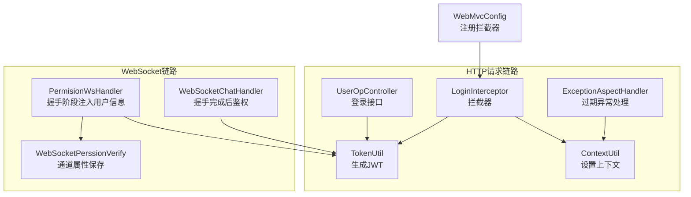
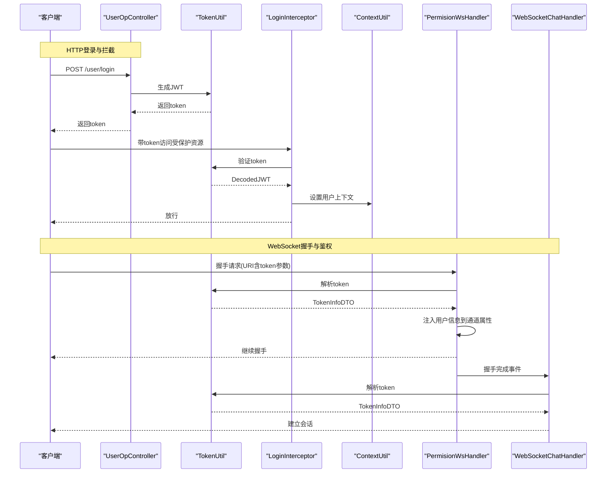
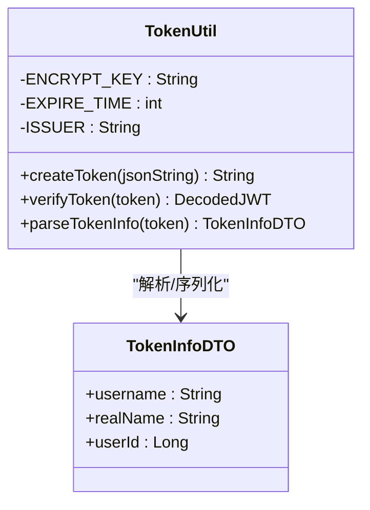
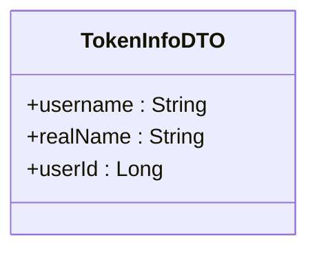
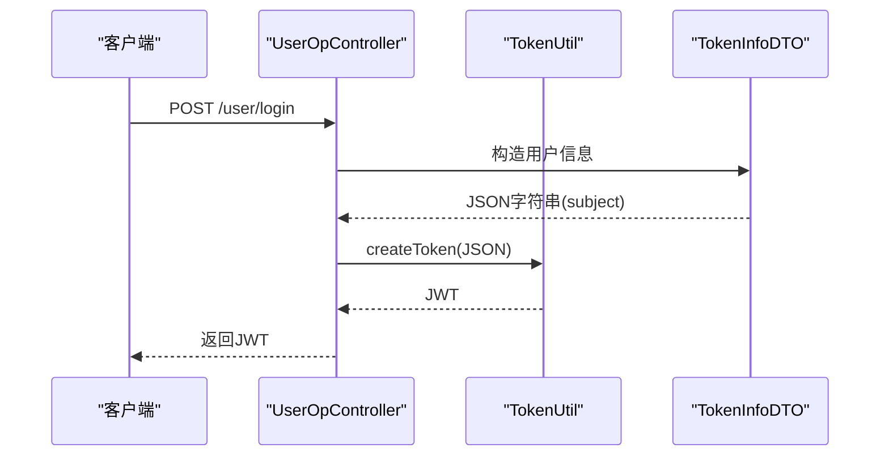
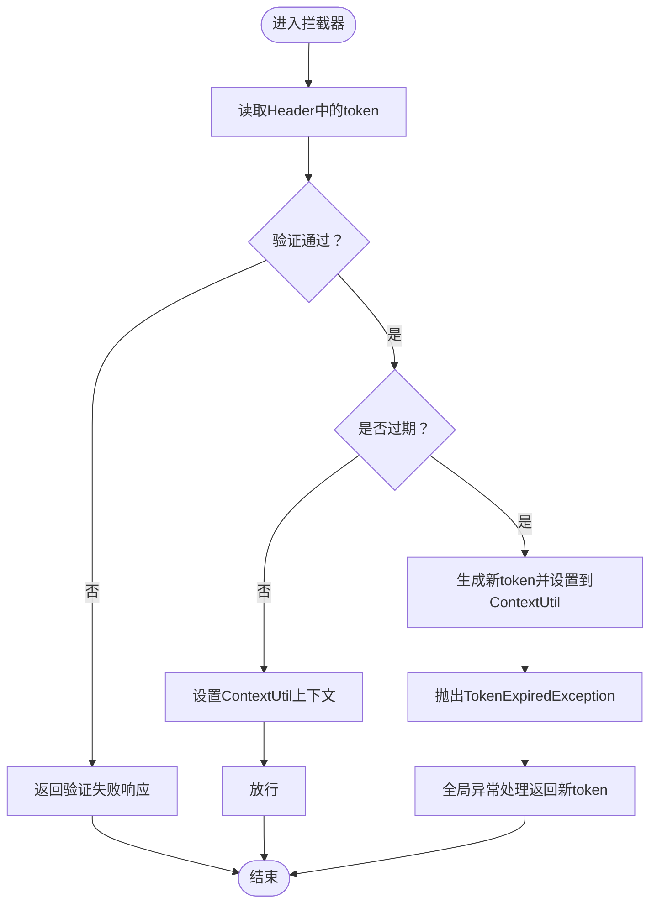
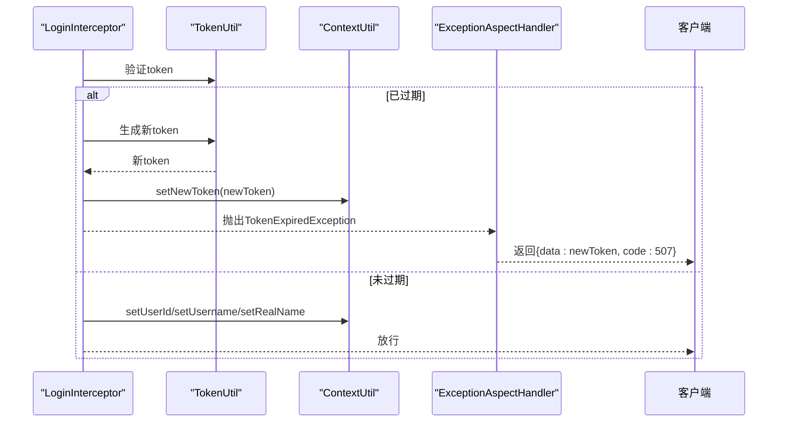
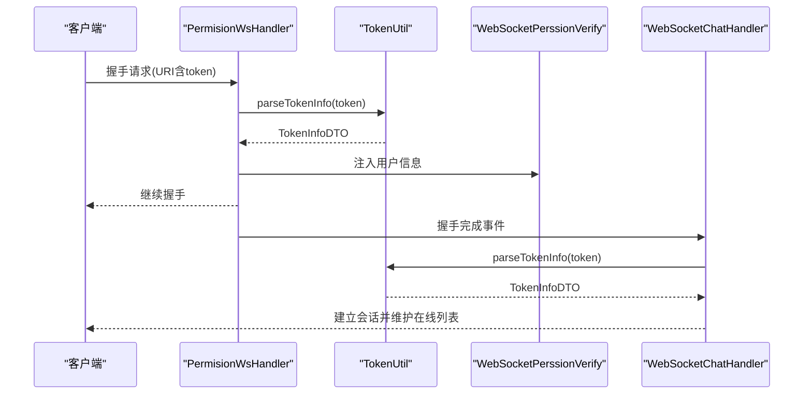
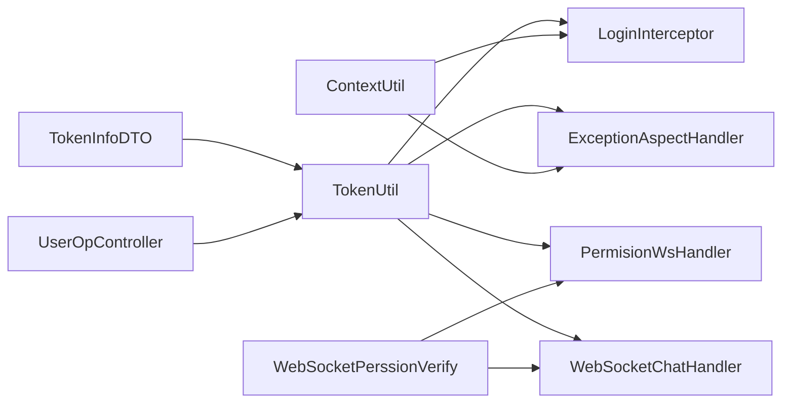

# JWT认证机制

<cite>
**本文引用的文件**
- [TokenUtil.java](file://src/main/java/com/hch/chat_simple/util/TokenUtil.java)
- [TokenInfoDTO.java](file://src/main/java/com/hch/chat_simple/pojo/dto/TokenInfoDTO.java)
- [LoginInterceptor.java](file://src/main/java/com/hch/chat_simple/config/LoginInterceptor.java)
- [WebMvcConfig.java](file://src/main/java/com/hch/chat_simple/config/WebMvcConfig.java)
- [UserOpController.java](file://src/main/java/com/hch/chat_simple/controller/UserOpController.java)
- [ExceptionAspectHandler.java](file://src/main/java/com/hch/chat_simple/config/ExceptionAspectHandler.java)
- [ContextUtil.java](file://src/main/java/com/hch/chat_simple/util/ContextUtil.java)
- [WebSocketPerssionVerify.java](file://src/main/java/com/hch/chat_simple/pojo/dto/WebSocketPerssionVerify.java)
- [PermisionWsHandler.java](file://src/main/java/com/hch/chat_simple/handler/PermisionWsHandler.java)
- [WebSocketChatHandler.java](file://src/main/java/com/hch/chat_simple/handler/WebSocketChatHandler.java)
- [NoAuth.java](file://src/main/java/com/hch/chat_simple/auth/NoAuth.java)
- [application.yml](file://src/main/resources/application.yml)
</cite>

## 目录
1. [简介](#简介)
2. [项目结构](#项目结构)
3. [核心组件](#核心组件)
4. [架构总览](#架构总览)
5. [详细组件分析](#详细组件分析)
6. [依赖分析](#依赖分析)
7. [性能考虑](#性能考虑)
8. [故障排查指南](#故障排查指南)
9. [结论](#结论)
10. [附录](#附录)

## 简介
本文件系统性梳理该聊天应用的JWT认证机制，围绕Auth0 JWT库实现令牌生成与验证，覆盖以下主题：
- TokenUtil工具类：令牌签名算法、有效期设置、密钥管理、解析与续签策略
- TokenInfoDTO数据传输对象：用户信息封装与序列化机制
- 令牌生成流程：身份验证、载荷构建、签名过程
- 令牌验证机制：签名验证、过期检查、有效性判断
- 令牌刷新策略：自动续期、上下文用户信息设置
- WebSocket连接中的传递与验证机制
- JWT配置最佳实践与安全注意事项

## 项目结构
围绕JWT认证的关键模块分布如下：
- 工具层：TokenUtil（令牌生成/验证/解析）、ContextUtil（线程本地上下文）
- DTO层：TokenInfoDTO（用户信息载体）、WebSocketPerssionVerify（WS权限上下文）
- 控制器层：UserOpController（登录接口，生成JWT）
- 拦截与配置：LoginInterceptor（HTTP拦截）、WebMvcConfig（注册拦截器）、ExceptionAspectHandler（过期异常统一处理）
- WebSocket层：PermisionWsHandler（握手阶段校验与注入用户信息）、WebSocketChatHandler（握手完成后的鉴权与会话维护）

图表来源
- [UserOpController.java:44-66](file://src/main/java/com/hch/chat_simple/controller/UserOpController.java#L44-L66)
- [TokenUtil.java:23-30](file://src/main/java/com/hch/chat_simple/util/TokenUtil.java#L23-L30)
- [LoginInterceptor.java:44-72](file://src/main/java/com/hch/chat_simple/config/LoginInterceptor.java#L44-L72)
- [ContextUtil.java:12-42](file://src/main/java/com/hch/chat_simple/util/ContextUtil.java#L12-L42)
- [ExceptionAspectHandler.java:16-20](file://src/main/java/com/hch/chat_simple/config/ExceptionAspectHandler.java#L16-L20)
- [PermisionWsHandler.java:42-61](file://src/main/java/com/hch/chat_simple/handler/PermisionWsHandler.java#L42-L61)
- [WebSocketChatHandler.java:120-153](file://src/main/java/com/hch/chat_simple/handler/WebSocketChatHandler.java#L120-L153)
- [WebMvcConfig.java:12-16](file://src/main/java/com/hch/chat_simple/config/WebMvcConfig.java#L12-L16)

章节来源
- [WebMvcConfig.java:12-16](file://src/main/java/com/hch/chat_simple/config/WebMvcConfig.java#L12-L16)
- [UserOpController.java:44-66](file://src/main/java/com/hch/chat_simple/controller/UserOpController.java#L44-L66)
- [LoginInterceptor.java:44-72](file://src/main/java/com/hch/chat_simple/config/LoginInterceptor.java#L44-L72)
- [ExceptionAspectHandler.java:16-20](file://src/main/java/com/hch/chat_simple/config/ExceptionAspectHandler.java#L16-L20)
- [PermisionWsHandler.java:42-61](file://src/main/java/com/hch/chat_simple/handler/PermisionWsHandler.java#L42-L61)
- [WebSocketChatHandler.java:120-153](file://src/main/java/com/hch/chat_simple/handler/WebSocketChatHandler.java#L120-L153)

## 核心组件
- TokenUtil：基于Auth0 JWT库，使用对称加密算法HMAC256生成JWT；内置固定密钥、签发方、过期时间；提供令牌验证、载荷解析、过期续签能力
- TokenInfoDTO：承载用户标识信息（用户名、真实名、用户ID），作为JWT的subject内容
- LoginInterceptor：拦截HTTP请求，从Header读取token，调用TokenUtil验证并设置ContextUtil上下文；过期时生成新token并通过全局异常处理返回
- ExceptionAspectHandler：捕获TokenExpiredException，返回携带新token的响应体
- ContextUtil：线程本地变量，保存当前用户上下文（用户ID、用户名、真实名、新token）
- WebSocket相关：PermisionWsHandler在握手阶段解析token并注入用户信息；WebSocketChatHandler在握手完成后进行鉴权并维护会话

章节来源
- [TokenUtil.java:19-30](file://src/main/java/com/hch/chat_simple/util/TokenUtil.java#L19-L30)
- [TokenInfoDTO.java:14-19](file://src/main/java/com/hch/chat_simple/pojo/dto/TokenInfoDTO.java#L14-L19)
- [LoginInterceptor.java:44-72](file://src/main/java/com/hch/chat_simple/config/LoginInterceptor.java#L44-L72)
- [ExceptionAspectHandler.java:16-20](file://src/main/java/com/hch/chat_simple/config/ExceptionAspectHandler.java#L16-L20)
- [ContextUtil.java:12-42](file://src/main/java/com/hch/chat_simple/util/ContextUtil.java#L12-L42)
- [PermisionWsHandler.java:42-61](file://src/main/java/com/hch/chat_simple/handler/PermisionWsHandler.java#L42-L61)
- [WebSocketChatHandler.java:120-153](file://src/main/java/com/hch/chat_simple/handler/WebSocketChatHandler.java#L120-L153)

## 架构总览
下图展示HTTP与WebSocket两条链路的JWT认证交互：

图表来源
- [UserOpController.java:44-66](file://src/main/java/com/hch/chat_simple/controller/UserOpController.java#L44-L66)
- [TokenUtil.java:23-30](file://src/main/java/com/hch/chat_simple/util/TokenUtil.java#L23-L30)
- [LoginInterceptor.java:44-72](file://src/main/java/com/hch/chat_simple/config/LoginInterceptor.java#L44-L72)
- [ContextUtil.java:12-42](file://src/main/java/com/hch/chat_simple/util/ContextUtil.java#L12-L42)
- [PermisionWsHandler.java:42-61](file://src/main/java/com/hch/chat_simple/handler/PermisionWsHandler.java#L42-L61)
- [WebSocketChatHandler.java:120-153](file://src/main/java/com/hch/chat_simple/handler/WebSocketChatHandler.java#L120-L153)

## 详细组件分析

### TokenUtil工具类
- 签名算法：HMAC256（对称加密）
- 密钥管理：静态密钥常量（开发环境示例）
- 有效期设置：默认30分钟（分钟级）
- 签发方：固定issuer
- 令牌生成：以JSON字符串作为subject，附加签发方、过期时间、自定义声明，最终签名
- 令牌验证：基于相同密钥与issuer构建verifier，支持过期宽限窗口（用于换取新token）
- 载荷解析：从subject中反序列化为TokenInfoDTO

图表来源
- [TokenUtil.java:19-30](file://src/main/java/com/hch/chat_simple/util/TokenUtil.java#L19-L30)
- [TokenInfoDTO.java:14-19](file://src/main/java/com/hch/chat_simple/pojo/dto/TokenInfoDTO.java#L14-L19)

章节来源
- [TokenUtil.java:19-30](file://src/main/java/com/hch/chat_simple/util/TokenUtil.java#L19-L30)
- [TokenUtil.java:48-69](file://src/main/java/com/hch/chat_simple/util/TokenUtil.java#L48-L69)

### TokenInfoDTO数据传输对象
- 字段设计：username、realName、userId，用于承载用户身份信息
- 序列化机制：通过FastJSON在HTTP与WebSocket场景中与JWT subject互转
- 用途：作为JWT的subject内容，便于服务端快速解析用户上下文

图表来源
- [TokenInfoDTO.java:14-19](file://src/main/java/com/hch/chat_simple/pojo/dto/TokenInfoDTO.java#L14-L19)

章节来源
- [TokenInfoDTO.java:14-19](file://src/main/java/com/hch/chat_simple/pojo/dto/TokenInfoDTO.java#L14-L19)

### 令牌生成流程（登录）
- 用户凭用户名/密码调用登录接口
- 服务端校验用户存在与密码正确
- 将用户信息封装为TokenInfoDTO并序列化为JSON
- 调用TokenUtil生成JWT并返回给客户端

图表来源
- [UserOpController.java:44-66](file://src/main/java/com/hch/chat_simple/controller/UserOpController.java#L44-L66)
- [TokenUtil.java:23-30](file://src/main/java/com/hch/chat_simple/util/TokenUtil.java#L23-L30)

章节来源
- [UserOpController.java:44-66](file://src/main/java/com/hch/chat_simple/controller/UserOpController.java#L44-L66)
- [TokenUtil.java:23-30](file://src/main/java/com/hch/chat_simple/util/TokenUtil.java#L23-L30)

### 令牌验证机制（HTTP）
- 拦截器从Header读取token
- 调用TokenUtil验证：校验签名与issuer，支持过期宽限
- 若未过期：设置ContextUtil上下文（用户ID、用户名、真实名）
- 若已过期：重新生成token并放入ContextUtil，抛出TokenExpiredException交由全局异常处理返回

图表来源
- [LoginInterceptor.java:44-72](file://src/main/java/com/hch/chat_simple/config/LoginInterceptor.java#L44-L72)
- [ExceptionAspectHandler.java:16-20](file://src/main/java/com/hch/chat_simple/config/ExceptionAspectHandler.java#L16-L20)
- [ContextUtil.java:36-42](file://src/main/java/com/hch/chat_simple/util/ContextUtil.java#L36-L42)

章节来源
- [LoginInterceptor.java:44-72](file://src/main/java/com/hch/chat_simple/config/LoginInterceptor.java#L44-L72)
- [ExceptionAspectHandler.java:16-20](file://src/main/java/com/hch/chat_simple/config/ExceptionAspectHandler.java#L16-L20)
- [ContextUtil.java:36-42](file://src/main/java/com/hch/chat_simple/util/ContextUtil.java#L36-L42)

### 令牌刷新策略
- 自动续期：拦截器在检测到过期时生成新token并写入ContextUtil
- 统一返回：全局异常处理器捕获TokenExpiredException，返回包含新token的Payload
- 上下文设置：拦截器在未过期时设置用户上下文，供后续业务使用

图表来源
- [LoginInterceptor.java:55-66](file://src/main/java/com/hch/chat_simple/config/LoginInterceptor.java#L55-L66)
- [TokenUtil.java:23-30](file://src/main/java/com/hch/chat_simple/util/TokenUtil.java#L23-L30)
- [ContextUtil.java:36-42](file://src/main/java/com/hch/chat_simple/util/ContextUtil.java#L36-L42)
- [ExceptionAspectHandler.java:16-20](file://src/main/java/com/hch/chat_simple/config/ExceptionAspectHandler.java#L16-L20)

章节来源
- [LoginInterceptor.java:55-66](file://src/main/java/com/hch/chat_simple/config/LoginInterceptor.java#L55-L66)
- [ExceptionAspectHandler.java:16-20](file://src/main/java/com/hch/chat_simple/config/ExceptionAspectHandler.java#L16-L20)
- [ContextUtil.java:36-42](file://src/main/java/com/hch/chat_simple/util/ContextUtil.java#L36-L42)

### 令牌在WebSocket连接中的传递与验证
- 握手阶段：PermisionWsHandler从URI查询参数中提取token，调用TokenUtil.parseTokenInfo解析用户信息，注入到通道属性WebSocketPerssionVerify
- 握手完成：WebSocketChatHandler在握手完成事件中再次解析token，绑定用户ID到会话，加入在线会话管理

图表来源
- [PermisionWsHandler.java:42-61](file://src/main/java/com/hch/chat_simple/handler/PermisionWsHandler.java#L42-L61)
- [TokenUtil.java:61-69](file://src/main/java/com/hch/chat_simple/util/TokenUtil.java#L61-L69)
- [WebSocketChatHandler.java:120-153](file://src/main/java/com/hch/chat_simple/handler/WebSocketChatHandler.java#L120-L153)

章节来源
- [PermisionWsHandler.java:42-61](file://src/main/java/com/hch/chat_simple/handler/PermisionWsHandler.java#L42-L61)
- [TokenUtil.java:61-69](file://src/main/java/com/hch/chat_simple/util/TokenUtil.java#L61-L69)
- [WebSocketChatHandler.java:120-153](file://src/main/java/com/hch/chat_simple/handler/WebSocketChatHandler.java#L120-L153)

## 依赖分析
- 组件耦合
  - LoginInterceptor依赖TokenUtil与ContextUtil，负责HTTP链路的鉴权与上下文注入
  - ExceptionAspectHandler依赖ContextUtil，负责过期异常统一返回
  - WebSocket链路依赖TokenUtil与WebSocketPerssionVerify，负责握手阶段与完成后的鉴权
  - UserOpController依赖TokenUtil生成JWT
- 外部依赖
  - Auth0 JWT库：令牌生成与验证
  - FastJSON：JSON序列化与反序列化
  - Spring MVC：拦截器与全局异常处理
  - Netty：WebSocket握手与事件驱动

图表来源
- [TokenUtil.java:19-30](file://src/main/java/com/hch/chat_simple/util/TokenUtil.java#L19-L30)
- [LoginInterceptor.java:44-72](file://src/main/java/com/hch/chat_simple/config/LoginInterceptor.java#L44-L72)
- [ExceptionAspectHandler.java:16-20](file://src/main/java/com/hch/chat_simple/config/ExceptionAspectHandler.java#L16-L20)
- [PermisionWsHandler.java:42-61](file://src/main/java/com/hch/chat_simple/handler/PermisionWsHandler.java#L42-L61)
- [WebSocketChatHandler.java:120-153](file://src/main/java/com/hch/chat_simple/handler/WebSocketChatHandler.java#L120-L153)
- [UserOpController.java:44-66](file://src/main/java/com/hch/chat_simple/controller/UserOpController.java#L44-L66)
- [ContextUtil.java:12-42](file://src/main/java/com/hch/chat_simple/util/ContextUtil.java#L12-L42)
- [TokenInfoDTO.java:14-19](file://src/main/java/com/hch/chat_simple/pojo/dto/TokenInfoDTO.java#L14-L19)
- [WebSocketPerssionVerify.java:7-20](file://src/main/java/com/hch/chat_simple/pojo/dto/WebSocketPerssionVerify.java#L7-L20)

章节来源
- [WebMvcConfig.java:12-16](file://src/main/java/com/hch/chat_simple/config/WebMvcConfig.java#L12-L16)
- [NoAuth.java:8-13](file://src/main/java/com/hch/chat_simple/auth/NoAuth.java#L8-L13)

## 性能考虑
- 令牌生成与验证均为内存计算，开销极低
- 建议将密钥与过期时间配置化，避免硬编码
- 对于高并发场景，建议引入Redis等外部缓存实现黑名单或临时状态管理（当前实现未采用黑名单）
- WebSocket链路中，建议对频繁的握手与鉴权进行限流与去重

## 故障排查指南
- token验证失败
  - 检查Header中是否存在token字段
  - 确认issuer与密钥一致
  - 查看拦截器返回的错误响应体
- token过期
  - 拦截器会在过期时抛出TokenExpiredException
  - 全局异常处理器会返回包含新token的响应
  - 检查ContextUtil中是否设置了新token
- WebSocket鉴权失败
  - 确认握手URI中包含token参数
  - 检查PermisionWsHandler与WebSocketChatHandler的鉴权逻辑
  - 核对通道属性WebSocketPerssionVerify是否注入成功

章节来源
- [LoginInterceptor.java:72-82](file://src/main/java/com/hch/chat_simple/config/LoginInterceptor.java#L72-L82)
- [ExceptionAspectHandler.java:16-20](file://src/main/java/com/hch/chat_simple/config/ExceptionAspectHandler.java#L16-L20)
- [PermisionWsHandler.java:42-61](file://src/main/java/com/hch/chat_simple/handler/PermisionWsHandler.java#L42-L61)
- [WebSocketChatHandler.java:120-153](file://src/main/java/com/hch/chat_simple/handler/WebSocketChatHandler.java#L120-L153)

## 结论
该JWT认证机制以Auth0 JWT库为核心，结合拦截器与全局异常处理实现了HTTP链路的完整鉴权闭环；同时在WebSocket握手阶段与完成事件中分别进行令牌解析与鉴权，确保实时通信的安全性。整体实现简洁清晰，具备良好的扩展性与可维护性。

## 附录

### JWT配置最佳实践与安全注意事项
- 密钥管理
  - 使用强随机密钥，避免硬编码，建议通过环境变量或配置中心加载
  - 定期轮换密钥，配合双key平滑切换
- 有效期设置
  - 根据业务风险调整过期时间，建议短期令牌+刷新令牌策略
  - 对于WebSocket场景，可考虑更短的过期时间并启用自动续签
- 签发方与受众
  - 明确issuer与audience，严格校验
- 传输安全
  - 强制HTTPS传输，防止中间人攻击
  - 避免在URL中暴露token，优先使用Header
- 异常处理
  - 对过期与无效token进行明确区分与统一返回
  - 记录审计日志，便于追踪与分析
- 性能优化
  - 合理设置过期宽限窗口，避免频繁续签
  - 对高频鉴权接口进行缓存与限流