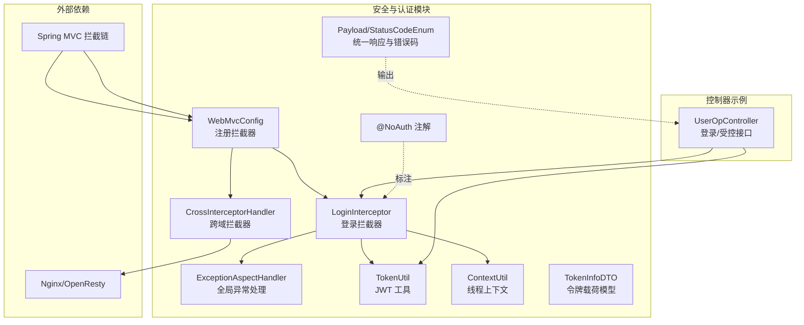
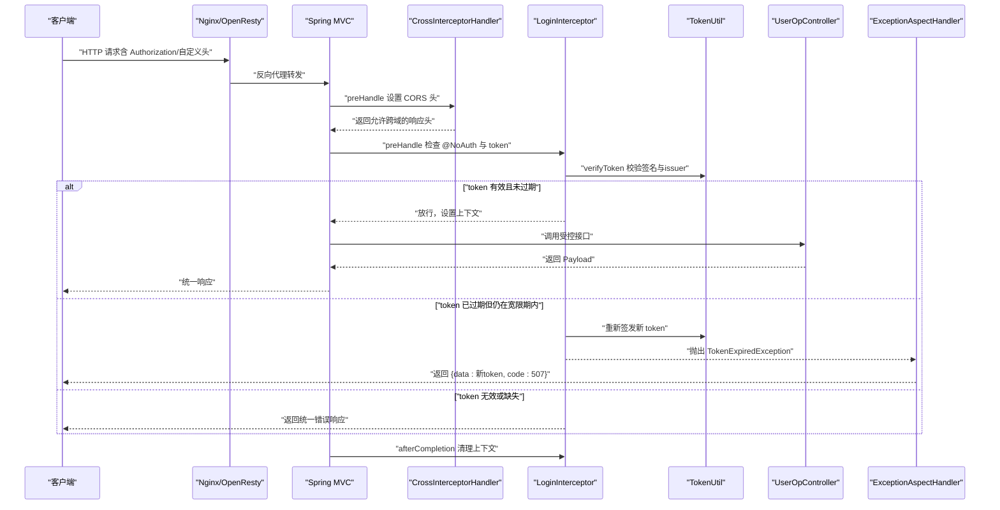
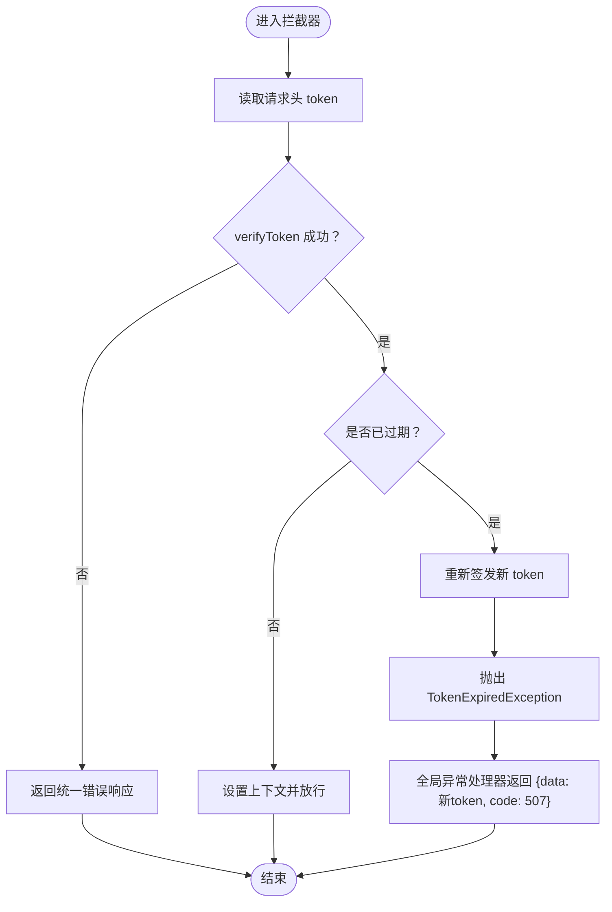
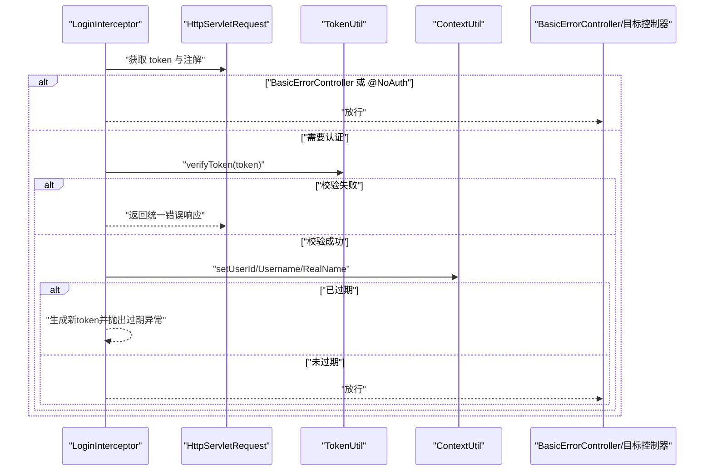
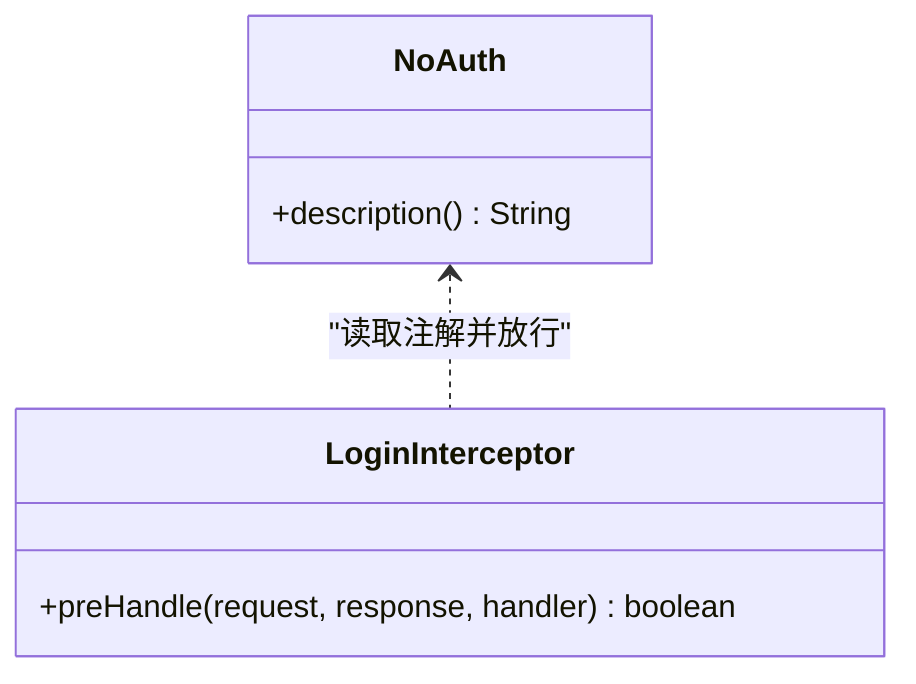
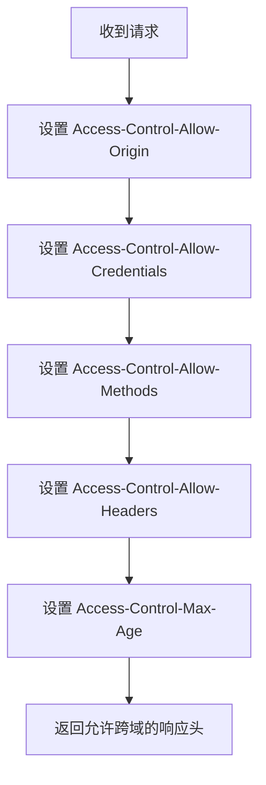
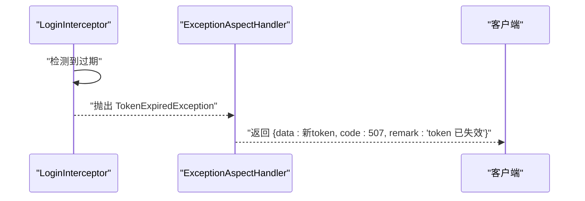
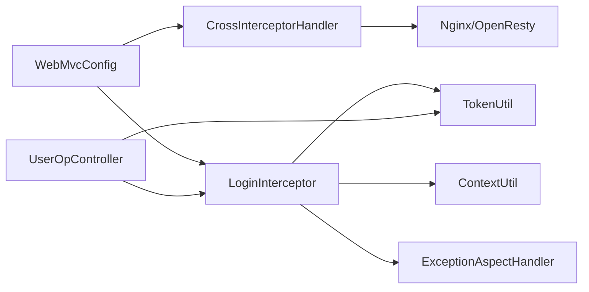

# 安全与认证

<cite>
**本文引用的文件**
- [NoAuth.java](file://src/main/java/com/hch/chat_simple/auth/NoAuth.java)
- [LoginInterceptor.java](file://src/main/java/com/hch/chat_simple/config/LoginInterceptor.java)
- [CrossInterceptorHandler.java](file://src/main/java/com/hch/chat_simple/config/CrossInterceptorHandler.java)
- [WebMvcConfig.java](file://src/main/java/com/hch/chat_simple/config/WebMvcConfig.java)
- [TokenUtil.java](file://src/main/java/com/hch/chat_simple/util/TokenUtil.java)
- [ExceptionAspectHandler.java](file://src/main/java/com/hch/chat_simple/config/ExceptionAspectHandler.java)
- [BusinessException.java](file://src/main/java/com/hch/chat_simple/exception/BusinessException.java)
- [TokenInfoDTO.java](file://src/main/java/com/hch/chat_simple/pojo/dto/TokenInfoDTO.java)
- [Payload.java](file://src/main/java/com/hch/chat_simple/util/Payload.java)
- [StatusCodeEnum.java](file://src/main/java/com/hch/chat_simple/util/StatusCodeEnum.java)
- [UserOpController.java](file://src/main/java/com/hch/chat_simple/controller/UserOpController.java)
- [ContextUtil.java](file://src/main/java/com/hch/chat_simple/util/ContextUtil.java)
- [application.yml](file://src/main/resources/application.yml)
- [nginx.conf](file://openresty_nginx_conf/nginx.conf)
</cite>

## 目录
1. [简介](#简介)
2. [项目结构](#项目结构)
3. [核心组件](#核心组件)
4. [架构总览](#架构总览)
5. [详细组件分析](#详细组件分析)
6. [依赖分析](#依赖分析)
7. [性能考虑](#性能考虑)
8. [故障排查指南](#故障排查指南)
9. [结论](#结论)
10. [附录](#附录)

## 简介
本文件面向聊天应用的安全与认证体系，系统性梳理并说明以下主题：
- 基于 JWT 的认证机制：令牌生成、验证、过期处理与续签策略
- 登录拦截器的工作流程：请求拦截、权限校验、异常处理
- @NoAuth 注解的使用场景：开放接口标记与匿名访问控制
- 跨域拦截器的配置与作用：CORS 处理、安全头设置、预检请求
- 业务异常的统一处理：异常分类、错误码定义、响应格式
- 密码加密与数据安全：BCrypt 密码哈希、敏感数据保护
- 安全配置最佳实践与常见漏洞防范

## 项目结构
围绕安全与认证的关键模块分布如下：
- 认证与拦截：config 包下的拦截器与全局异常处理
- 注解与上下文：auth 与 util 包中的注解与线程上下文工具
- 控制器示例：controller 包中对登录与受控接口的演示
- 配置与资源：WebMvcConfig、application.yml、Nginx/OpenResty 配置

图表来源
- [WebMvcConfig.java:12-16](file://src/main/java/com/hch/chat_simple/config/WebMvcConfig.java#L12-L16)
- [CrossInterceptorHandler.java:10-25](file://src/main/java/com/hch/chat_simple/config/CrossInterceptorHandler.java#L10-L25)
- [LoginInterceptor.java:30-90](file://src/main/java/com/hch/chat_simple/config/LoginInterceptor.java#L30-L90)
- [ExceptionAspectHandler.java:16-20](file://src/main/java/com/hch/chat_simple/config/ExceptionAspectHandler.java#L16-L20)
- [TokenUtil.java:23-59](file://src/main/java/com/hch/chat_simple/util/TokenUtil.java#L23-L59)
- [ContextUtil.java:12-49](file://src/main/java/com/hch/chat_simple/util/ContextUtil.java#L12-L49)
- [TokenInfoDTO.java:14-19](file://src/main/java/com/hch/chat_simple/pojo/dto/TokenInfoDTO.java#L14-L19)
- [Payload.java:18-28](file://src/main/java/com/hch/chat_simple/util/Payload.java#L18-L28)
- [StatusCodeEnum.java:6-21](file://src/main/java/com/hch/chat_simple/util/StatusCodeEnum.java#L6-L21)
- [UserOpController.java:44-66](file://src/main/java/com/hch/chat_simple/controller/UserOpController.java#L44-L66)

章节来源
- [WebMvcConfig.java:12-16](file://src/main/java/com/hch/chat_simple/config/WebMvcConfig.java#L12-L16)
- [CrossInterceptorHandler.java:10-25](file://src/main/java/com/hch/chat_simple/config/CrossInterceptorHandler.java#L10-L25)
- [LoginInterceptor.java:30-90](file://src/main/java/com/hch/chat_simple/config/LoginInterceptor.java#L30-L90)
- [ExceptionAspectHandler.java:16-20](file://src/main/java/com/hch/chat_simple/config/ExceptionAspectHandler.java#L16-L20)
- [TokenUtil.java:23-59](file://src/main/java/com/hch/chat_simple/util/TokenUtil.java#L23-L59)
- [ContextUtil.java:12-49](file://src/main/java/com/hch/chat_simple/util/ContextUtil.java#L12-L49)
- [TokenInfoDTO.java:14-19](file://src/main/java/com/hch/chat_simple/pojo/dto/TokenInfoDTO.java#L14-L19)
- [Payload.java:18-28](file://src/main/java/com/hch/chat_simple/util/Payload.java#L18-L28)
- [StatusCodeEnum.java:6-21](file://src/main/java/com/hch/chat_simple/util/StatusCodeEnum.java#L6-L21)
- [UserOpController.java:44-66](file://src/main/java/com/hch/chat_simple/controller/UserOpController.java#L44-L66)

## 核心组件
- 注解与上下文
  - @NoAuth：用于标注无需认证的开放接口，拦截器在执行前读取该注解以决定是否放行
  - ContextUtil：基于 TransmittableThreadLocal 的线程上下文，存储当前用户的 userId、username、realName 以及新生成的 token（续签）
- 认证与拦截
  - TokenUtil：封装 JWT 的生成与验证，内置 issuer、密钥与过期时间；支持解析 Token 中的用户信息载荷
  - LoginInterceptor：实现 Spring MVC 拦截器，负责读取请求头 token、校验 JWT、设置上下文、处理过期续签与异常响应
  - ExceptionAspectHandler：捕获 TokenExpiredException，返回统一的“token 过期”响应，并携带续签后的 token
  - WebMvcConfig：注册跨域与登录拦截器，排除登录、错误、Swagger 等路径
  - CrossInterceptorHandler：设置 CORS 响应头，允许指定来源、凭证、方法与预检缓存
- 统一响应与错误码
  - Payload：统一响应载体，包含 data、code、remark
  - StatusCodeEnum：集中定义业务错误码与描述，如 token 缺失、验证失败、过期等

章节来源
- [NoAuth.java:8-13](file://src/main/java/com/hch/chat_simple/auth/NoAuth.java#L8-L13)
- [ContextUtil.java:12-49](file://src/main/java/com/hch/chat_simple/util/ContextUtil.java#L12-L49)
- [TokenUtil.java:23-59](file://src/main/java/com/hch/chat_simple/util/TokenUtil.java#L23-L59)
- [LoginInterceptor.java:30-90](file://src/main/java/com/hch/chat_simple/config/LoginInterceptor.java#L30-L90)
- [ExceptionAspectHandler.java:16-20](file://src/main/java/com/hch/chat_simple/config/ExceptionAspectHandler.java#L16-L20)
- [WebMvcConfig.java:12-16](file://src/main/java/com/hch/chat_simple/config/WebMvcConfig.java#L12-L16)
- [CrossInterceptorHandler.java:10-25](file://src/main/java/com/hch/chat_simple/config/CrossInterceptorHandler.java#L10-L25)
- [Payload.java:18-28](file://src/main/java/com/hch/chat_simple/util/Payload.java#L18-L28)
- [StatusCodeEnum.java:6-21](file://src/main/java/com/hch/chat_simple/util/StatusCodeEnum.java#L6-L21)

## 架构总览
下图展示从客户端到服务端的典型请求流，涵盖跨域、认证拦截、JWT 校验与续签、异常处理与统一响应。

图表来源
- [CrossInterceptorHandler.java:10-25](file://src/main/java/com/hch/chat_simple/config/CrossInterceptorHandler.java#L10-L25)
- [LoginInterceptor.java:30-90](file://src/main/java/com/hch/chat_simple/config/LoginInterceptor.java#L30-L90)
- [TokenUtil.java:48-59](file://src/main/java/com/hch/chat_simple/util/TokenUtil.java#L48-L59)
- [ExceptionAspectHandler.java:16-20](file://src/main/java/com/hch/chat_simple/config/ExceptionAspectHandler.java#L16-L20)
- [UserOpController.java:44-66](file://src/main/java/com/hch/chat_simple/controller/UserOpController.java#L44-L66)

## 详细组件分析

### JWT 认证机制
- 令牌生成
  - 使用对称算法与固定密钥生成 JWT，设置签发人、过期时间与附加声明
  - 将用户信息序列化为字符串作为 subject 存入 token
- 令牌验证
  - 校验签名、issuer 与过期时间；提供宽限期用于续签过渡
  - 解析 token 的 subject 并映射到 TokenInfoDTO
- 过期处理与续签
  - 在拦截器中检测过期时间并与当前时间比较
  - 若已过期则重新签发新 token，写入线程上下文并通过全局异常处理器返回给客户端
- 刷新策略
  - 当前实现采用“过期即续签”，由拦截器在过期时生成新 token 并通过异常处理器返回

图表来源
- [LoginInterceptor.java:44-83](file://src/main/java/com/hch/chat_simple/config/LoginInterceptor.java#L44-L83)
- [TokenUtil.java:48-59](file://src/main/java/com/hch/chat_simple/util/TokenUtil.java#L48-L59)
- [ExceptionAspectHandler.java:16-20](file://src/main/java/com/hch/chat_simple/config/ExceptionAspectHandler.java#L16-L20)

章节来源
- [TokenUtil.java:23-59](file://src/main/java/com/hch/chat_simple/util/TokenUtil.java#L23-L59)
- [LoginInterceptor.java:44-83](file://src/main/java/com/hch/chat_simple/config/LoginInterceptor.java#L44-L83)
- [ExceptionAspectHandler.java:16-20](file://src/main/java/com/hch/chat_simple/config/ExceptionAspectHandler.java#L16-L20)

### 登录拦截器工作原理
- 请求拦截
  - 对每个 HandlerMethod 检查是否为错误控制器，若是则放行
  - 读取 @NoAuth 注解，若存在则放行
- 权限验证
  - 从请求头提取 token，调用 TokenUtil 校验
  - 解析 subject 为 TokenInfoDTO，设置线程上下文（userId、username、realName）
- 异常处理
  - token 缺失或无效：返回统一错误响应
  - token 过期：触发续签并抛出 TokenExpiredException，由全局异常处理器返回新 token

图表来源
- [LoginInterceptor.java:30-90](file://src/main/java/com/hch/chat_simple/config/LoginInterceptor.java#L30-L90)

章节来源
- [LoginInterceptor.java:30-90](file://src/main/java/com/hch/chat_simple/config/LoginInterceptor.java#L30-L90)

### @NoAuth 注解使用场景
- 开放接口标记
  - 在登录、注册、公开查询等接口上标注 @NoAuth，拦截器在 preHandle 中读取注解并放行
- 匿名访问控制
  - 通过注解明确哪些接口允许匿名访问，避免误拦截

图表来源
- [NoAuth.java:8-13](file://src/main/java/com/hch/chat_simple/auth/NoAuth.java#L8-L13)
- [LoginInterceptor.java:39-43](file://src/main/java/com/hch/chat_simple/config/LoginInterceptor.java#L39-L43)

章节来源
- [NoAuth.java:8-13](file://src/main/java/com/hch/chat_simple/auth/NoAuth.java#L8-L13)
- [UserOpController.java:46](file://src/main/java/com/hch/chat_simple/controller/UserOpController.java#L46)
- [UserOpController.java:106-111](file://src/main/java/com/hch/chat_simple/controller/UserOpController.java#L106-L111)

### 跨域拦截器配置与作用
- CORS 处理
  - 设置允许来源、凭证、方法与请求头
- 预检请求
  - 设置预检缓存时间，减少重复预检
- 与 Nginx/OpenResty 协同
  - 通过反向代理统一处理跨域与 WebSocket 升级

图表来源
- [CrossInterceptorHandler.java:14-24](file://src/main/java/com/hch/chat_simple/config/CrossInterceptorHandler.java#L14-L24)
- [nginx.conf:53-81](file://openresty_nginx_conf/nginx.conf#L53-L81)

章节来源
- [CrossInterceptorHandler.java:10-25](file://src/main/java/com/hch/chat_simple/config/CrossInterceptorHandler.java#L10-L25)
- [WebMvcConfig.java:12-16](file://src/main/java/com/hch/chat_simple/config/WebMvcConfig.java#L12-L16)
- [nginx.conf:53-81](file://openresty_nginx_conf/nginx.conf#L53-L81)

### 业务异常统一处理机制
- 异常分类
  - TokenExpiredException：拦截器在过期时抛出，由全局异常处理器捕获
- 错误码定义
  - StatusCodeEnum 提供统一错误码与描述，如 TOKEN_INVALID、TOKEN_LACK、TOKEN_EXPIRE 等
- 响应格式
  - Payload 统一输出 data、code、remark 字段，便于前端解析

图表来源
- [ExceptionAspectHandler.java:16-20](file://src/main/java/com/hch/chat_simple/config/ExceptionAspectHandler.java#L16-L20)
- [StatusCodeEnum.java:6-21](file://src/main/java/com/hch/chat_simple/util/StatusCodeEnum.java#L6-L21)
- [Payload.java:18-28](file://src/main/java/com/hch/chat_simple/util/Payload.java#L18-L28)

章节来源
- [ExceptionAspectHandler.java:16-20](file://src/main/java/com/hch/chat_simple/config/ExceptionAspectHandler.java#L16-L20)
- [StatusCodeEnum.java:6-21](file://src/main/java/com/hch/chat_simple/util/StatusCodeEnum.java#L6-L21)
- [Payload.java:18-28](file://src/main/java/com/hch/chat_simple/util/Payload.java#L18-L28)

### 密码加密与数据安全
- 密码哈希
  - 登录接口使用 BCryptPasswordEncoder 进行密码匹配，确保明文不落库
- 敏感数据保护
  - Token 中仅存放必要字段（用户名、真实名、用户ID），避免泄露敏感信息
  - 统一通过 Payload 输出，避免直接暴露内部异常堆栈

章节来源
- [UserOpController.java:50-55](file://src/main/java/com/hch/chat_simple/controller/UserOpController.java#L50-L55)
- [TokenInfoDTO.java:14-19](file://src/main/java/com/hch/chat_simple/pojo/dto/TokenInfoDTO.java#L14-L19)
- [Payload.java:18-28](file://src/main/java/com/hch/chat_simple/util/Payload.java#L18-L28)

## 依赖分析
- 组件耦合
  - LoginInterceptor 依赖 TokenUtil、ContextUtil、@NoAuth 注解与全局异常处理
  - WebMvcConfig 负责注册拦截器并排除特定路径
  - UserOpController 展示登录与受控接口的使用方式
- 外部依赖
  - Spring MVC 拦截链、OpenResty 反向代理、Redis/数据库等

图表来源
- [WebMvcConfig.java:12-16](file://src/main/java/com/hch/chat_simple/config/WebMvcConfig.java#L12-L16)
- [CrossInterceptorHandler.java:10-25](file://src/main/java/com/hch/chat_simple/config/CrossInterceptorHandler.java#L10-L25)
- [LoginInterceptor.java:30-90](file://src/main/java/com/hch/chat_simple/config/LoginInterceptor.java#L30-L90)
- [TokenUtil.java:23-59](file://src/main/java/com/hch/chat_simple/util/TokenUtil.java#L23-L59)
- [ContextUtil.java:12-49](file://src/main/java/com/hch/chat_simple/util/ContextUtil.java#L12-L49)
- [ExceptionAspectHandler.java:16-20](file://src/main/java/com/hch/chat_simple/config/ExceptionAspectHandler.java#L16-L20)
- [UserOpController.java:44-66](file://src/main/java/com/hch/chat_simple/controller/UserOpController.java#L44-L66)
- [nginx.conf:53-81](file://openresty_nginx_conf/nginx.conf#L53-L81)

章节来源
- [WebMvcConfig.java:12-16](file://src/main/java/com/hch/chat_simple/config/WebMvcConfig.java#L12-L16)
- [CrossInterceptorHandler.java:10-25](file://src/main/java/com/hch/chat_simple/config/CrossInterceptorHandler.java#L10-L25)
- [LoginInterceptor.java:30-90](file://src/main/java/com/hch/chat_simple/config/LoginInterceptor.java#L30-L90)
- [TokenUtil.java:23-59](file://src/main/java/com/hch/chat_simple/util/TokenUtil.java#L23-L59)
- [ContextUtil.java:12-49](file://src/main/java/com/hch/chat_simple/util/ContextUtil.java#L12-L49)
- [ExceptionAspectHandler.java:16-20](file://src/main/java/com/hch/chat_simple/config/ExceptionAspectHandler.java#L16-L20)
- [UserOpController.java:44-66](file://src/main/java/com/hch/chat_simple/controller/UserOpController.java#L44-L66)
- [nginx.conf:53-81](file://openresty_nginx_conf/nginx.conf#L53-L81)

## 性能考虑
- 拦截器开销
  - 每次请求均需校验 token，建议合理设置过期时间与宽限期，避免频繁续签
- 线程上下文
  - 使用 TransmittableThreadLocal 保证上下文在线程池场景下的传递，降低共享状态带来的同步成本
- 缓存与限流
  - 结合 Redis 实现登录态缓存与接口限流，缓解高并发下的认证压力
- 跨域处理
  - 合理设置预检缓存时间，减少 OPTIONS 预检请求次数

## 故障排查指南
- token 缺失或无效
  - 检查请求头是否正确携带 token，确认 StatusCodeEnum.TOKEN_LACK 与 TOKEN_INVALID 的返回
- token 过期
  - 观察是否触发 TokenExpiredException，确认全局异常处理器返回的新 token 是否被前端接收
- 跨域问题
  - 核对 CrossInterceptorHandler 设置的来源、方法与头是否与前端一致；同时检查 Nginx/OpenResty 的代理配置
- 登录接口异常
  - 确认 BCrypt 密码匹配逻辑与数据库用户记录一致性

章节来源
- [LoginInterceptor.java:74-82](file://src/main/java/com/hch/chat_simple/config/LoginInterceptor.java#L74-L82)
- [ExceptionAspectHandler.java:16-20](file://src/main/java/com/hch/chat_simple/config/ExceptionAspectHandler.java#L16-L20)
- [CrossInterceptorHandler.java:14-24](file://src/main/java/com/hch/chat_simple/config/CrossInterceptorHandler.java#L14-L24)
- [UserOpController.java:50-55](file://src/main/java/com/hch/chat_simple/controller/UserOpController.java#L50-L55)

## 结论
本项目通过注解驱动的开放接口标记、基于 JWT 的认证拦截、统一的异常与响应处理，构建了清晰的安全与认证体系。结合 Nginx/OpenResty 的跨域与反向代理能力，能够满足聊天应用的典型安全需求。建议在生产环境中进一步完善密钥管理、审计日志、速率限制与更严格的权限模型。

## 附录
- 安全配置最佳实践
  - 使用强密钥与定期轮换；避免硬编码密钥
  - 严格限定 CORS 来源，避免通配符
  - 对关键接口增加权限校验与审计日志
  - 启用 HTTPS 与安全响应头
- 常见安全漏洞防范
  - 防止暴力破解：登录失败计数与封禁策略
  - 防止 CSRF：结合 SameSite Cookie 与 Token 校验
  - 防止信息泄露：最小化 token 载荷，避免敏感字段入参