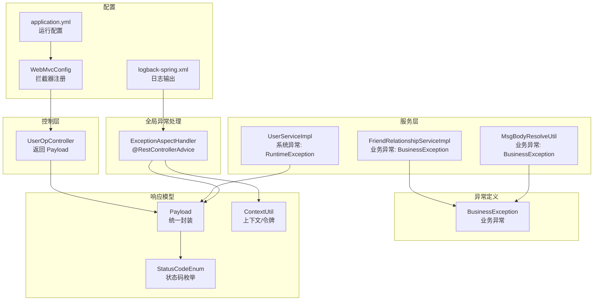
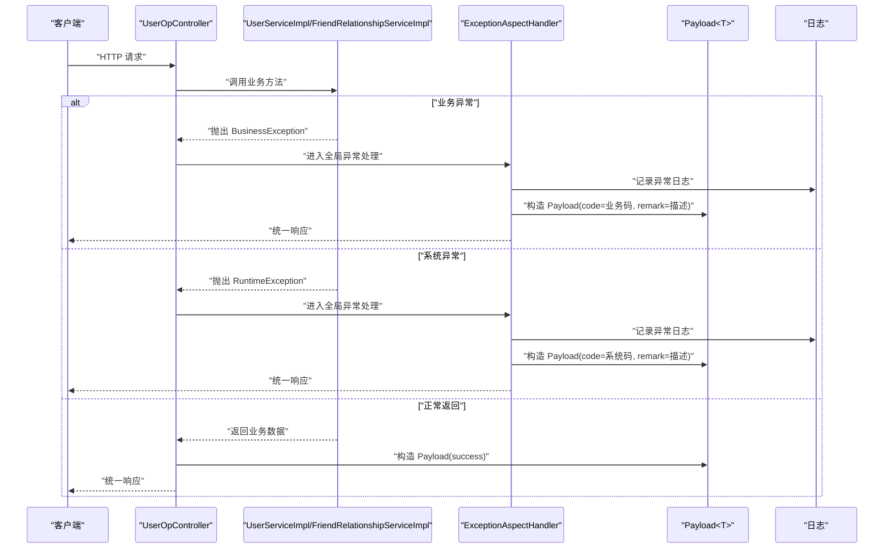
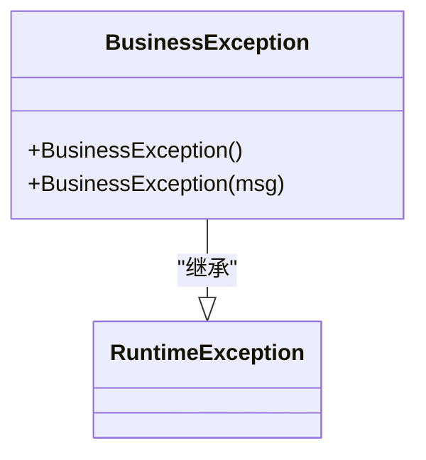
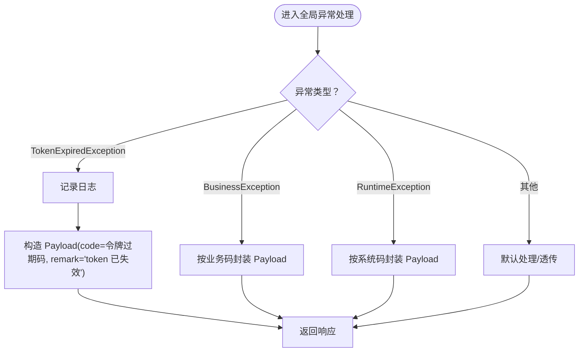
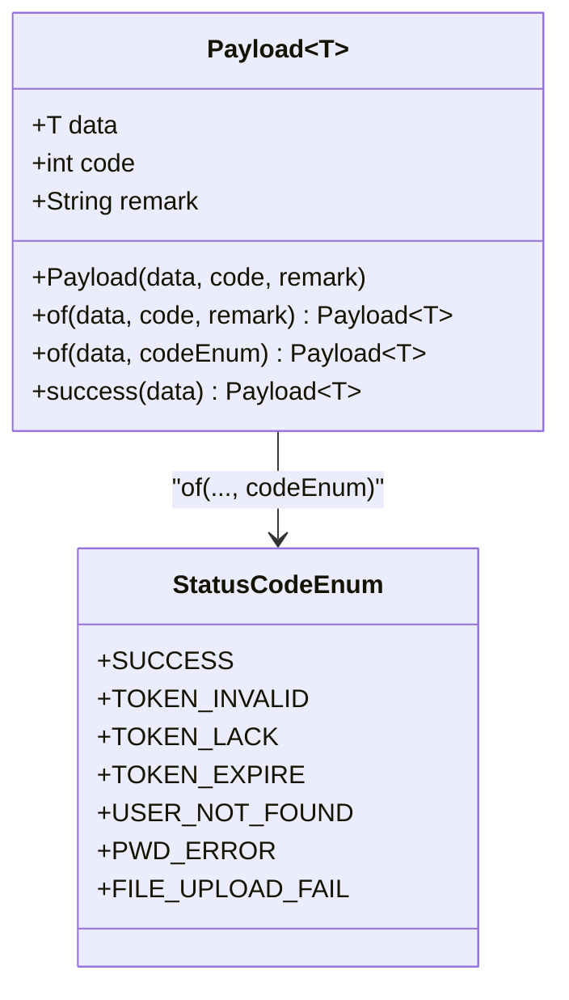
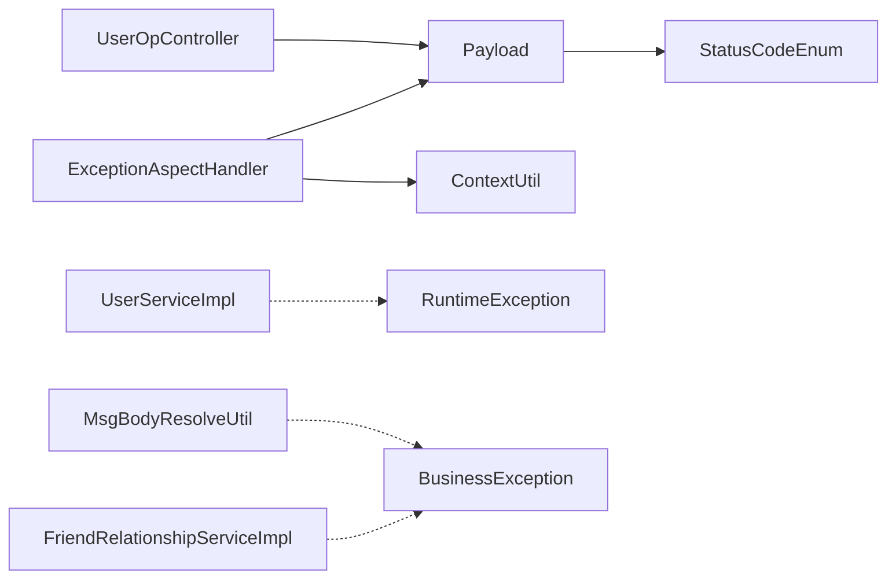

# 异常处理机制

<cite>
**本文引用的文件**
- [BusinessException.java](file://src/main/java/com/hch/chat_simple/exception/BusinessException.java)
- [ExceptionAspectHandler.java](file://src/main/java/com/hch/chat_simple/config/ExceptionAspectHandler.java)
- [Payload.java](file://src/main/java/com/hch/chat_simple/util/Payload.java)
- [StatusCodeEnum.java](file://src/main/java/com/hch/chat_simple/util/StatusCodeEnum.java)
- [ContextUtil.java](file://src/main/java/com/hch/chat_simple/util/ContextUtil.java)
- [WebMvcConfig.java](file://src/main/java/com/hch/chat_simple/config/WebMvcConfig.java)
- [application.yml](file://src/main/resources/application.yml)
- [logback-spring.xml](file://src/main/resources/logback-spring.xml)
- [UserOpController.java](file://src/main/java/com/hch/chat_simple/controller/UserOpController.java)
- [UserServiceImpl.java](file://src/main/java/com/hch/chat_simple/service/impl/UserServiceImpl.java)
- [FriendRelationshipServiceImpl.java](file://src/main/java/com/hch/chat_simple/service/impl/FriendRelationshipServiceImpl.java)
- [MsgBodyResolveUtil.java](file://src/main/java/com/hch/chat_simple/util/MsgBodyResolveUtil.java)
</cite>

## 目录
1. [引言](#引言)
2. [项目结构](#项目结构)
3. [核心组件](#核心组件)
4. [架构总览](#架构总览)
5. [详细组件分析](#详细组件分析)
6. [依赖分析](#依赖分析)
7. [性能考虑](#性能考虑)
8. [故障排查指南](#故障排查指南)
9. [结论](#结论)
10. [附录](#附录)

## 引言
本文件系统性梳理并说明本项目的异常处理机制，重点覆盖以下方面：
- 统一异常处理与业务异常管理的实现方案
- BusinessException 业务异常类的设计（异常分类、错误码定义、错误信息封装）
- ExceptionAspectHandler 切面的异常处理逻辑（异常捕获、日志记录、响应格式化）
- Payload 通用响应对象的设计（数据封装、状态码定义、消息格式）
- 不同类型异常的差异化处理策略（业务异常、系统异常、参数异常）
- 异常处理最佳实践（异常分类、错误码规范、国际化支持）
- 异常处理的监控与告警（异常统计、性能监控、故障预警）
- 常见异常场景的处理示例与调试技巧

## 项目结构
围绕异常处理的相关模块分布如下：
- 异常定义：exception 包下的 BusinessException
- 全局异常处理：config 包下的 ExceptionAspectHandler
- 响应模型：util 包下的 Payload、StatusCodeEnum、ContextUtil
- Web 层：controller 包下的各控制器返回 Payload
- 业务层：service 实现中抛出或使用 RuntimeException（作为系统异常）
- 配置：WebMvcConfig 注册拦截器；application.yml 提供运行时配置；logback-spring.xml 输出日志

图表来源
- [BusinessException.java:1-12](file://src/main/java/com/hch/chat_simple/exception/BusinessException.java#L1-L12)
- [ExceptionAspectHandler.java:1-24](file://src/main/java/com/hch/chat_simple/config/ExceptionAspectHandler.java#L1-L24)
- [Payload.java:1-30](file://src/main/java/com/hch/chat_simple/util/Payload.java#L1-L30)
- [StatusCodeEnum.java:1-22](file://src/main/java/com/hch/chat_simple/util/StatusCodeEnum.java#L1-L22)
- [ContextUtil.java:1-52](file://src/main/java/com/hch/chat_simple/util/ContextUtil.java#L1-L52)
- [WebMvcConfig.java:1-28](file://src/main/java/com/hch/chat_simple/config/WebMvcConfig.java#L1-L28)
- [application.yml:1-89](file://src/main/resources/application.yml#L1-L89)
- [logback-spring.xml:1-24](file://src/main/resources/logback-spring.xml#L1-L24)
- [UserOpController.java:1-114](file://src/main/java/com/hch/chat_simple/controller/UserOpController.java#L1-L114)
- [UserServiceImpl.java:1-100](file://src/main/java/com/hch/chat_simple/service/impl/UserServiceImpl.java#L1-L100)
- [FriendRelationshipServiceImpl.java:1-120](file://src/main/java/com/hch/chat_simple/service/impl/FriendRelationshipServiceImpl.java#L1-L120)
- [MsgBodyResolveUtil.java:1-80](file://src/main/java/com/hch/chat_simple/util/MsgBodyResolveUtil.java#L1-L80)

章节来源
- [WebMvcConfig.java:1-28](file://src/main/java/com/hch/chat_simple/config/WebMvcConfig.java#L1-L28)
- [application.yml:1-89](file://src/main/resources/application.yml#L1-L89)
- [logback-spring.xml:1-24](file://src/main/resources/logback-spring.xml#L1-L24)

## 核心组件
- BusinessException：业务异常基类，继承自 RuntimeException，用于表达“可预期”的业务错误（如参数校验失败、权限不足、资源冲突等）。
- ExceptionAspectHandler：基于 Spring MVC 的全局异常处理器，使用 @RestControllerAdvice 捕获特定异常并统一返回 Payload 响应。
- Payload<T>：统一封装响应体，包含 data、code、remark 字段，提供 of(...) 和 success(...) 等静态工厂方法。
- StatusCodeEnum：集中定义状态码与描述，便于在控制器和服务层复用。
- ContextUtil：线程本地存储，用于在异常处理中携带新 token 等上下文信息。

章节来源
- [BusinessException.java:1-12](file://src/main/java/com/hch/chat_simple/exception/BusinessException.java#L1-L12)
- [ExceptionAspectHandler.java:1-24](file://src/main/java/com/hch/chat_simple/config/ExceptionAspectHandler.java#L1-L24)
- [Payload.java:1-30](file://src/main/java/com/hch/chat_simple/util/Payload.java#L1-L30)
- [StatusCodeEnum.java:1-22](file://src/main/java/com/hch/chat_simple/util/StatusCodeEnum.java#L1-L22)
- [ContextUtil.java:1-52](file://src/main/java/com/hch/chat_simple/util/ContextUtil.java#L1-L52)

## 架构总览
下图展示了从控制器到服务层再到全局异常处理的整体流程，以及响应封装与日志输出的关键节点。

图表来源
- [UserOpController.java:1-114](file://src/main/java/com/hch/chat_simple/controller/UserOpController.java#L1-L114)
- [UserServiceImpl.java:1-100](file://src/main/java/com/hch/chat_simple/service/impl/UserServiceImpl.java#L1-L100)
- [FriendRelationshipServiceImpl.java:1-120](file://src/main/java/com/hch/chat_simple/service/impl/FriendRelationshipServiceImpl.java#L1-L120)
- [ExceptionAspectHandler.java:1-24](file://src/main/java/com/hch/chat_simple/config/ExceptionAspectHandler.java#L1-L24)
- [Payload.java:1-30](file://src/main/java/com/hch/chat_simple/util/Payload.java#L1-L30)
- [logback-spring.xml:1-24](file://src/main/resources/logback-spring.xml#L1-L24)

## 详细组件分析

### BusinessException 业务异常类
- 设计目标：用于表达“可预期”的业务错误，便于在服务层抛出并在全局异常处理器中统一处理。
- 结构特点：继承 RuntimeException，提供无参与带消息的构造函数，便于快速抛出业务错误。
- 使用建议：
  - 在服务层遇到“用户不存在”、“重复提交”、“格式不正确”等场景时抛出。
  - 与 StatusCodeEnum 中的业务码配合，确保前后端一致的错误语义。

图表来源
- [BusinessException.java:1-12](file://src/main/java/com/hch/chat_simple/exception/BusinessException.java#L1-L12)

章节来源
- [BusinessException.java:1-12](file://src/main/java/com/hch/chat_simple/exception/BusinessException.java#L1-L12)

### ExceptionAspectHandler 全局异常处理
- 职责：通过 @RestControllerAdvice 对控制器抛出的异常进行统一捕获与处理。
- 当前实现要点：
  - 捕获 TokenExpiredException 并记录日志，返回 Payload，其中 code 使用令牌过期码，remark 为“token 已失效”，同时通过 ContextUtil.getNewToken() 返回新的 token。
  - 可扩展点：可新增对 BusinessException、RuntimeException、参数校验异常等的处理分支，分别映射到业务码或系统码。
- 日志：使用 SLF4J 记录异常堆栈，便于问题定位与审计。

图表来源
- [ExceptionAspectHandler.java:1-24](file://src/main/java/com/hch/chat_simple/config/ExceptionAspectHandler.java#L1-L24)
- [ContextUtil.java:1-52](file://src/main/java/com/hch/chat_simple/util/ContextUtil.java#L1-L52)
- [Payload.java:1-30](file://src/main/java/com/hch/chat_simple/util/Payload.java#L1-L30)

章节来源
- [ExceptionAspectHandler.java:1-24](file://src/main/java/com/hch/chat_simple/config/ExceptionAspectHandler.java#L1-L24)
- [ContextUtil.java:1-52](file://src/main/java/com/hch/chat_simple/util/ContextUtil.java#L1-L52)

### Payload 通用响应对象
- 数据结构：包含 data（泛型）、code（状态码）、remark（描述）三部分。
- 工厂方法：
  - of(data, code, remark)：按指定值构造
  - of(data, codeEnum)：按枚举构造
  - success(data)：使用 SUCCESS 枚举构造成功响应
- 作用：统一控制器返回格式，简化前端解析与展示。

图表来源
- [Payload.java:1-30](file://src/main/java/com/hch/chat_simple/util/Payload.java#L1-L30)
- [StatusCodeEnum.java:1-22](file://src/main/java/com/hch/chat_simple/util/StatusCodeEnum.java#L1-L22)

章节来源
- [Payload.java:1-30](file://src/main/java/com/hch/chat_simple/util/Payload.java#L1-L30)
- [StatusCodeEnum.java:1-22](file://src/main/java/com/hch/chat_simple/util/StatusCodeEnum.java#L1-L22)

### StatusCodeEnum 错误码定义
- 规范：集中定义所有可用的状态码与描述，避免分散硬编码。
- 建议：
  - 为每类异常预留连续码段（如 500-599），便于扩展与归类。
  - 与前端约定好错误码含义，保证一致性。

章节来源
- [StatusCodeEnum.java:1-22](file://src/main/java/com/hch/chat_simple/util/StatusCodeEnum.java#L1-L22)

### ContextUtil 上下文与令牌
- 用途：在线程范围内保存用户上下文（如 userId、username、realName）以及新生成的 token。
- 在异常处理中的作用：当发生令牌过期等场景时，可在切面中读取新 token 并随响应返回，提升用户体验。

章节来源
- [ContextUtil.java:1-52](file://src/main/java/com/hch/chat_simple/util/ContextUtil.java#L1-L52)

### 控制层与服务层的异常协作
- 控制层：通过 Payload.success(...) 或 Payload.of(...) 返回统一响应。
- 服务层：
  - 业务异常：抛出 BusinessException，由全局异常处理器捕获并转换为业务码响应。
  - 系统异常：抛出 RuntimeException，由全局异常处理器捕获并转换为系统码响应。
- 示例参考：
  - 用户登录：根据用户名或密码错误返回相应业务码。
  - 添加用户：若用户名重复，服务层抛出 RuntimeException，控制器统一返回系统码响应。
  - 业务工具：消息体解析工具在格式不正确时抛出 BusinessException，由切面统一处理。

章节来源
- [UserOpController.java:1-114](file://src/main/java/com/hch/chat_simple/controller/UserOpController.java#L1-L114)
- [UserServiceImpl.java:1-100](file://src/main/java/com/hch/chat_simple/service/impl/UserServiceImpl.java#L1-L100)
- [FriendRelationshipServiceImpl.java:1-120](file://src/main/java/com/hch/chat_simple/service/impl/FriendRelationshipServiceImpl.java#L1-L120)
- [MsgBodyResolveUtil.java:1-80](file://src/main/java/com/hch/chat_simple/util/MsgBodyResolveUtil.java#L1-L80)

## 依赖分析
- 组件耦合度：
  - ExceptionAspectHandler 依赖 Payload、ContextUtil、StatusCodeEnum，形成“异常捕获—响应封装—上下文”的闭环。
  - 控制器依赖 Payload 与 StatusCodeEnum，保持返回格式一致。
  - 服务层与业务异常类解耦，仅在必要处抛出，便于测试与维护。
- 外部依赖：
  - Spring MVC（@RestControllerAdvice、@ExceptionHandler）
  - SLF4J（日志）
  - Lombok（@Data）

图表来源
- [ExceptionAspectHandler.java:1-24](file://src/main/java/com/hch/chat_simple/config/ExceptionAspectHandler.java#L1-L24)
- [Payload.java:1-30](file://src/main/java/com/hch/chat_simple/util/Payload.java#L1-L30)
- [StatusCodeEnum.java:1-22](file://src/main/java/com/hch/chat_simple/util/StatusCodeEnum.java#L1-L22)
- [ContextUtil.java:1-52](file://src/main/java/com/hch/chat_simple/util/ContextUtil.java#L1-L52)
- [UserOpController.java:1-114](file://src/main/java/com/hch/chat_simple/controller/UserOpController.java#L1-L114)
- [UserServiceImpl.java:1-100](file://src/main/java/com/hch/chat_simple/service/impl/UserServiceImpl.java#L1-L100)
- [FriendRelationshipServiceImpl.java:1-120](file://src/main/java/com/hch/chat_simple/service/impl/FriendRelationshipServiceImpl.java#L1-L120)
- [MsgBodyResolveUtil.java:1-80](file://src/main/java/com/hch/chat_simple/util/MsgBodyResolveUtil.java#L1-L80)

## 性能考虑
- 异常路径的开销：日志记录与响应封装会带来额外 CPU 与内存消耗，建议在生产环境合理配置日志级别，避免高频异常导致性能抖动。
- 统一响应的序列化：Payload 的泛型序列化在高并发下需关注 JSON 库的性能与线程安全。
- 令牌刷新：在异常处理中生成新 token 会增加一次计算成本，建议结合缓存与最小化刷新策略。

## 故障排查指南
- 常见问题定位步骤：
  - 查看日志：确认是否触发了全局异常处理，异常类型与堆栈信息。
  - 核对状态码：确认返回的 code 是否与预期一致（业务码 vs 系统码）。
  - 检查上下文：确认 ContextUtil 中是否正确设置了新 token。
- 关键检查点：
  - 全局异常处理是否覆盖了所需异常类型（当前仅覆盖令牌过期）。
  - 控制器与服务层是否正确使用 Payload.of(...) 与 StatusCodeEnum。
  - 日志配置是否开启 DEBUG 级别以便 SQL 与请求细节排查。

章节来源
- [logback-spring.xml:1-24](file://src/main/resources/logback-spring.xml#L1-L24)
- [ExceptionAspectHandler.java:1-24](file://src/main/java/com/hch/chat_simple/config/ExceptionAspectHandler.java#L1-L24)
- [Payload.java:1-30](file://src/main/java/com/hch/chat_simple/util/Payload.java#L1-L30)

## 结论
本项目通过“业务异常 + 全局异常处理 + 统一响应模型”的组合，实现了清晰、可扩展且易维护的异常处理体系。当前实现聚焦于令牌过期场景，后续可进一步扩展对业务异常与系统异常的统一处理，完善错误码规范与国际化支持，并引入监控与告警能力以提升稳定性与可观测性。

## 附录

### 不同类型异常的处理策略
- 业务异常（BusinessException）
  - 场景：参数非法、资源冲突、权限不足、业务规则不满足
  - 处理：由全局异常处理器捕获，映射到业务码与友好提示
- 系统异常（RuntimeException）
  - 场景：数据库异常、网络超时、未捕获的运行时错误
  - 处理：由全局异常处理器捕获，映射到系统码与兜底提示
- 参数异常（参数校验异常）
  - 场景：DTO 校验失败
  - 建议：可引入 MethodArgumentNotValidException 的处理分支，统一返回参数类业务码

章节来源
- [BusinessException.java:1-12](file://src/main/java/com/hch/chat_simple/exception/BusinessException.java#L1-L12)
- [UserServiceImpl.java:1-100](file://src/main/java/com/hch/chat_simple/service/impl/UserServiceImpl.java#L1-L100)
- [ExceptionAspectHandler.java:1-24](file://src/main/java/com/hch/chat_simple/config/ExceptionAspectHandler.java#L1-L24)

### 异常处理最佳实践
- 异常分类与错误码规范
  - 将错误码划分为业务码段与系统码段，避免冲突
  - 为每类异常预留连续码段，便于扩展
- 国际化支持
  - 将 remark 从代码中抽离为多语言资源，按客户端语言动态选择
- 安全与审计
  - 在日志中避免泄露敏感信息（如完整堆栈、用户凭证）
  - 对关键异常事件记录上下文（用户 ID、请求 ID、时间戳）
- 监控与告警
  - 统计各错误码出现频次与趋势，设置阈值告警
  - 结合链路追踪（如 Zipkin/SkyWalking）定位异常根因

### 常见异常场景与调试技巧
- 场景一：用户登录失败（用户名不存在/密码错误）
  - 控制器直接返回业务码，无需全局异常处理
  - 调试技巧：核对用户名与密码加密方式是否一致
- 场景二：添加用户时用户名重复
  - 服务层抛出 RuntimeException，全局异常处理返回系统码
  - 调试技巧：检查数据库唯一约束与查询条件
- 场景三：消息体格式不正确
  - 工具类抛出 BusinessException，全局异常处理返回业务码
  - 调试技巧：打印原始消息体与期望格式对比

章节来源
- [UserOpController.java:1-114](file://src/main/java/com/hch/chat_simple/controller/UserOpController.java#L1-L114)
- [UserServiceImpl.java:1-100](file://src/main/java/com/hch/chat_simple/service/impl/UserServiceImpl.java#L1-L100)
- [FriendRelationshipServiceImpl.java:1-120](file://src/main/java/com/hch/chat_simple/service/impl/FriendRelationshipServiceImpl.java#L1-L120)
- [MsgBodyResolveUtil.java:1-80](file://src/main/java/com/hch/chat_simple/util/MsgBodyResolveUtil.java#L1-L80)