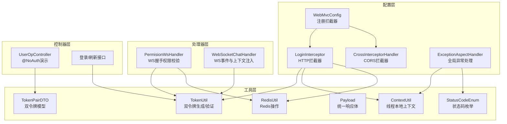
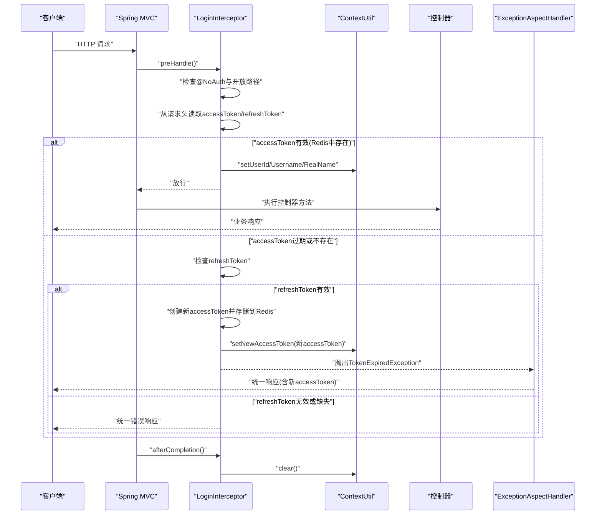
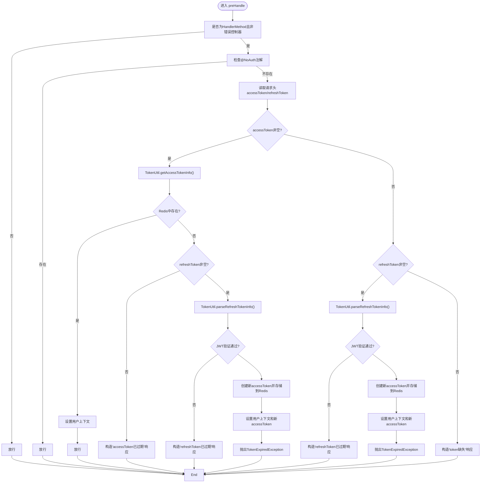
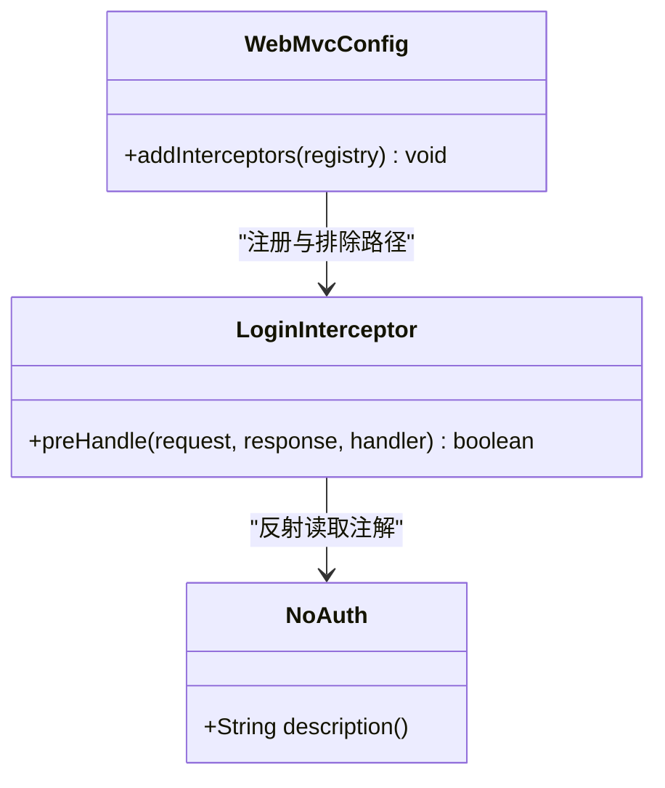
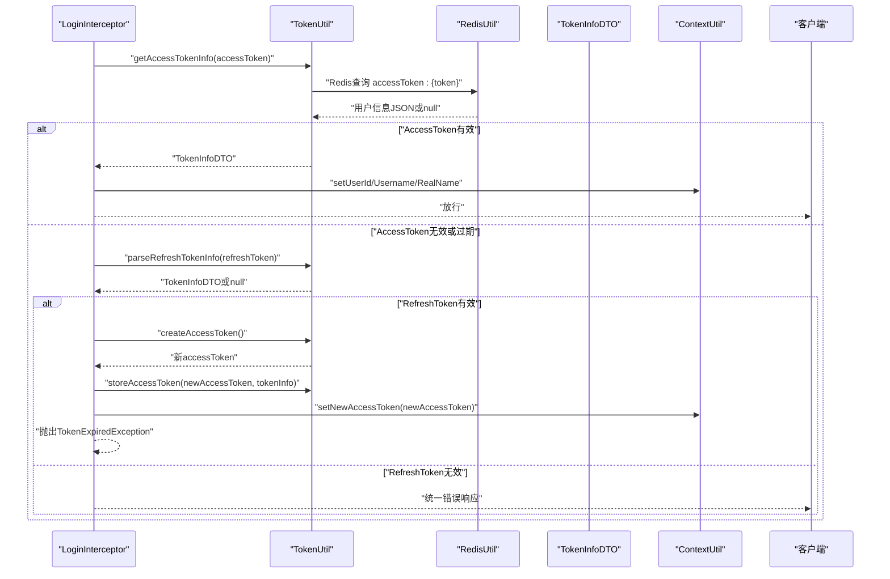
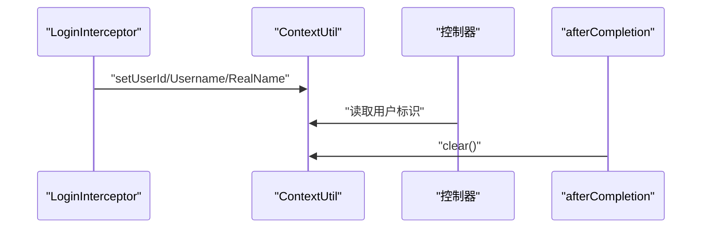
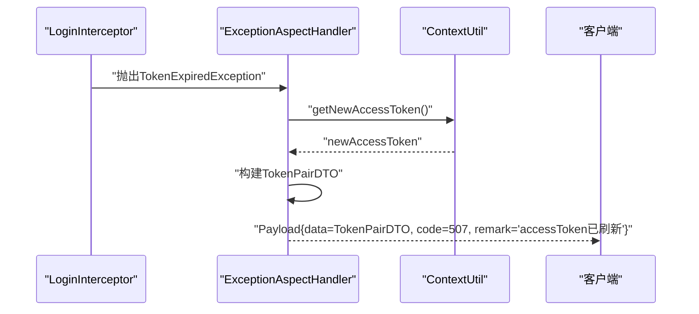
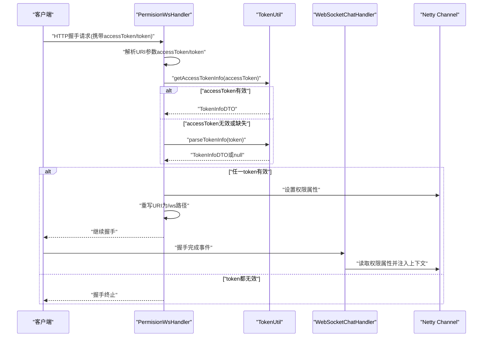
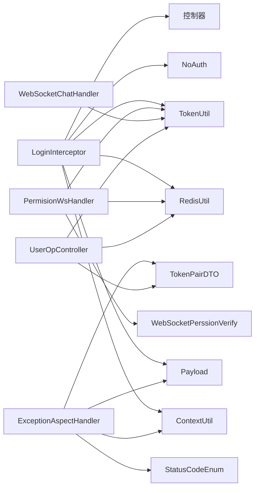

# 权限拦截器

<cite>
**本文引用的文件**
- [LoginInterceptor.java](file://src/main/java/com/hch/chat_simple/config/LoginInterceptor.java)
- [NoAuth.java](file://src/main/java/com/hch/chat_simple/auth/NoAuth.java)
- [WebMvcConfig.java](file://src/main/java/com/hch/chat_simple/config/WebMvcConfig.java)
- [ContextUtil.java](file://src/main/java/com/hch/chat_simple/util/ContextUtil.java)
- [TokenUtil.java](file://src/main/java/com/hch/chat_simple/util/TokenUtil.java)
- [TokenInfoDTO.java](file://src/main/java/com/hch/chat_simple/pojo/dto/TokenInfoDTO.java)
- [TokenPairDTO.java](file://src/main/java/com/hch/chat_simple/pojo/dto/TokenPairDTO.java)
- [Payload.java](file://src/main/java/com/hch/chat_simple/util/Payload.java)
- [StatusCodeEnum.java](file://src/main/java/com/hch/chat_simple/util/StatusCodeEnum.java)
- [ExceptionAspectHandler.java](file://src/main/java/com/hch/chat_simple/config/ExceptionAspectHandler.java)
- [CrossInterceptorHandler.java](file://src/main/java/com/hch/chat_simple/config/CrossInterceptorHandler.java)
- [UserOpController.java](file://src/main/java/com/hch/chat_simple/controller/UserOpController.java)
- [WebSocketChatHandler.java](file://src/main/java/com/hch/chat_simple/handler/WebSocketChatHandler.java)
- [PermisionWsHandler.java](file://src/main/java/com/hch/chat_simple/handler/PermisionWsHandler.java)
- [WebSocketPerssionVerify.java](file://src/main/java/com/hch/chat_simple/pojo/dto/WebSocketPerssionVerify.java)
- [RedisUtil.java](file://src/main/java/com/hch/chat_simple/util/RedisUtil.java)
- [Constant.java](file://src/main/java/com/hch/chat_simple/util/Constant.java)
</cite>

## 更新摘要
**变更内容**
- 从单一JWT令牌验证升级为双令牌认证机制
- 新增AccessToken Redis验证和RefreshToken自动刷新逻辑
- 更新拦截器工作原理以支持双令牌验证流程
- 增强异常处理以返回TokenPairDTO格式
- WebSocket处理器兼容双令牌验证

## 目录
1. [简介](#简介)
2. [项目结构](#项目结构)
3. [核心组件](#核心组件)
4. [架构总览](#架构总览)
5. [详细组件分析](#详细组件分析)
6. [依赖分析](#依赖分析)
7. [性能考虑](#性能考虑)
8. [故障排查指南](#故障排查指南)
9. [结论](#结论)
10. [附录](#附录)

## 简介
本文件系统性阐述 Spring MVC 权限拦截器在聊天应用中的实现与最佳实践，重点围绕 LoginInterceptor 的工作原理展开，包括：
- 双令牌认证机制（AccessToken Redis验证 + RefreshToken自动刷新）
- 请求拦截与放行判定（含注解识别与开放接口处理）
- 令牌提取与验证（请求头解析、Redis验证、JWT验证、过期处理）
- 上下文用户信息的设置与清理（ContextUtil 的线程安全保障）
- 异常处理（TokenExpiredException 的捕获与统一响应）
- WebSocket 连接中的权限校验与特殊处理
- 拦截器配置与扩展建议

## 项目结构
权限相关代码主要分布在以下包与类中：
- config：拦截器与全局异常处理
- util：工具类（上下文、令牌、Redis、统一响应体）
- pojo/dto：数据传输对象（TokenInfoDTO、TokenPairDTO、WebSocketPerssionVerify）
- handler：WebSocket 权限与业务处理器
- controller：演示注解使用与受控接口

**图示来源**
- [WebMvcConfig.java:12-16](file://src/main/java/com/hch/chat_simple/config/WebMvcConfig.java#L12-L16)
- [LoginInterceptor.java:24-28](file://src/main/java/com/hch/chat_simple/config/LoginInterceptor.java#L24-L28)
- [CrossInterceptorHandler.java:10-25](file://src/main/java/com/hch/chat_simple/config/CrossInterceptorHandler.java#L10-L25)
- [ExceptionAspectHandler.java:16-31](file://src/main/java/com/hch/chat_simple/config/ExceptionAspectHandler.java#L16-L31)
- [ContextUtil.java:5-62](file://src/main/java/com/hch/chat_simple/util/ContextUtil.java#L5-L62)
- [TokenUtil.java:18-199](file://src/main/java/com/hch/chat_simple/util/TokenUtil.java#L18-L199)
- [RedisUtil.java:16-127](file://src/main/java/com/hch/chat_simple/util/RedisUtil.java#L16-L127)
- [Payload.java:5-30](file://src/main/java/com/hch/chat_simple/util/Payload.java#L5-L30)
- [TokenPairDTO.java:8-25](file://src/main/java/com/hch/chat_simple/pojo/dto/TokenPairDTO.java#L8-L25)
- [StatusCodeEnum.java:5-23](file://src/main/java/com/hch/chat_simple/util/StatusCodeEnum.java#L5-L23)
- [PermisionWsHandler.java:23-29](file://src/main/java/com/hch/chat_simple/handler/PermisionWsHandler.java#L23-L29)
- [WebSocketChatHandler.java:118-163](file://src/main/java/com/hch/chat_simple/handler/WebSocketChatHandler.java#L118-L163)
- [UserOpController.java:44-172](file://src/main/java/com/hch/chat_simple/controller/UserOpController.java#L44-L172)

**章节来源**
- [WebMvcConfig.java:12-16](file://src/main/java/com/hch/chat_simple/config/WebMvcConfig.java#L12-L16)

## 核心组件
- **LoginInterceptor**：基于 HandlerInterceptor 的 HTTP 层权限拦截器，负责识别开放接口、提取与验证双令牌、设置上下文用户信息、异常处理与清理。
- **NoAuth 注解**：用于标注无需认证的接口或类，拦截器在 preHandle 中优先放行。
- **WebMvcConfig**：注册拦截器与排除路径，定义拦截范围与开放端点。
- **ContextUtil**：基于 TransmittableThreadLocal 的线程安全上下文容器，保存用户标识与新AccessToken。
- **TokenUtil**：双令牌生成与验证工具，包含AccessToken Redis操作和RefreshToken JWT验证。
- **RedisUtil**：Redis操作工具，提供键值存储、过期管理和用户令牌映射功能。
- **TokenPairDTO**：双令牌数据传输对象，包含accessToken和refreshToken。
- **StatusCodeEnum**：状态码枚举，定义各种认证状态的代码和描述。
- **Payload**：统一响应体封装，用于标准化错误与成功返回。
- **ExceptionAspectHandler**：全局异常处理，专门捕获 TokenExpiredException 并返回带新AccessToken的响应。
- **WebSocket 相关处理器**：PermisionWsHandler 在握手阶段校验 WS 令牌；WebSocketChatHandler 在握手完成后注入用户上下文。

**章节来源**
- [LoginInterceptor.java:24-28](file://src/main/java/com/hch/chat_simple/config/LoginInterceptor.java#L24-L28)
- [NoAuth.java:8-13](file://src/main/java/com/hch/chat_simple/auth/NoAuth.java#L8-L13)
- [WebMvcConfig.java:12-16](file://src/main/java/com/hch/chat_simple/config/WebMvcConfig.java#L12-L16)
- [ContextUtil.java:5-62](file://src/main/java/com/hch/chat_simple/util/ContextUtil.java#L5-L62)
- [TokenUtil.java:18-199](file://src/main/java/com/hch/chat_simple/util/TokenUtil.java#L18-L199)
- [RedisUtil.java:16-127](file://src/main/java/com/hch/chat_simple/util/RedisUtil.java#L16-L127)
- [TokenPairDTO.java:8-25](file://src/main/java/com/hch/chat_simple/pojo/dto/TokenPairDTO.java#L8-L25)
- [StatusCodeEnum.java:5-23](file://src/main/java/com/hch/chat_simple/util/StatusCodeEnum.java#L5-L23)
- [Payload.java:5-30](file://src/main/java/com/hch/chat_simple/util/Payload.java#L5-L30)
- [ExceptionAspectHandler.java:16-31](file://src/main/java/com/hch/chat_simple/config/ExceptionAspectHandler.java#L16-L31)
- [PermisionWsHandler.java:23-29](file://src/main/java/com/hch/chat_simple/handler/PermisionWsHandler.java#L23-L29)
- [WebSocketChatHandler.java:118-163](file://src/main/java/com/hch/chat_simple/handler/WebSocketChatHandler.java#L118-L163)

## 架构总览
下图展示从客户端到服务端的关键交互链路，包括 HTTP 拦截、WS 握手与上下文注入：

**图示来源**
- [LoginInterceptor.java:32-89](file://src/main/java/com/hch/chat_simple/config/LoginInterceptor.java#L32-L89)
- [ExceptionAspectHandler.java:23-31](file://src/main/java/com/hch/chat_simple/config/ExceptionAspectHandler.java#L23-L31)
- [ContextUtil.java:53-59](file://src/main/java/com/hch/chat_simple/util/ContextUtil.java#L53-L59)

## 详细组件分析

### LoginInterceptor 工作原理
- **双令牌认证流程**
  - 优先验证AccessToken（Redis中查询），若有效则直接放行
  - 若AccessToken无效或缺失，检查RefreshToken（JWT验证）
  - RefreshToken有效时，创建新AccessToken并存储到Redis，设置上下文并抛出TokenExpiredException
  - 两个令牌都无效时，返回相应的错误响应
- **请求拦截逻辑**
  - 忽略错误控制器与非 HandlerMethod 类型的处理器
  - 若目标方法或类声明了 @NoAuth，则直接放行
  - 否则从请求头提取 accessToken 和 refreshToken 并进行验证
- **权限验证流程**
  - AccessToken验证：通过 TokenUtil.getAccessTokenInfo() 从Redis获取用户信息
  - RefreshToken验证：通过 TokenUtil.parseRefreshTokenInfo() 解析JWT载荷
  - 刷新逻辑：生成新AccessToken，存储到Redis，设置上下文并抛出异常
- **响应与清理**
  - 验证失败或缺失令牌时，构造 Payload 统一响应并输出 JSON
  - afterCompletion 中调用 ContextUtil.clear() 清理线程上下文，避免内存泄漏

**图示来源**
- [LoginInterceptor.java:32-129](file://src/main/java/com/hch/chat_simple/config/LoginInterceptor.java#L32-L129)
- [TokenUtil.java:62-71](file://src/main/java/com/hch/chat_simple/util/TokenUtil.java#L62-L71)
- [TokenUtil.java:145-152](file://src/main/java/com/hch/chat_simple/util/TokenUtil.java#L145-L152)
- [ContextUtil.java:53-59](file://src/main/java/com/hch/chat_simple/util/ContextUtil.java#L53-L59)

**章节来源**
- [LoginInterceptor.java:32-129](file://src/main/java/com/hch/chat_simple/config/LoginInterceptor.java#L32-L129)
- [TokenUtil.java:62-71](file://src/main/java/com/hch/chat_simple/util/TokenUtil.java#L62-L71)
- [TokenUtil.java:145-152](file://src/main/java/com/hch/chat_simple/util/TokenUtil.java#L145-L152)
- [ContextUtil.java:53-59](file://src/main/java/com/hch/chat_simple/util/ContextUtil.java#L53-L59)

### 注解扫描与开放接口处理
- **@NoAuth 注解**
  - 作用于方法与类，标记为无需认证的接口
  - 拦截器在 preHandle 中通过反射读取方法注解，命中即放行
- **开放接口配置**
  - WebMvcConfig 中通过 excludePathPatterns 排除登录、刷新、错误、Swagger 等路径，避免拦截器误伤

**图示来源**
- [NoAuth.java:8-13](file://src/main/java/com/hch/chat_simple/auth/NoAuth.java#L8-L13)
- [LoginInterceptor.java:41-45](file://src/main/java/com/hch/chat_simple/config/LoginInterceptor.java#L41-L45)
- [WebMvcConfig.java:12-16](file://src/main/java/com/hch/chat_simple/config/WebMvcConfig.java#L12-L16)

**章节来源**
- [NoAuth.java:8-13](file://src/main/java/com/hch/chat_simple/auth/NoAuth.java#L8-L13)
- [LoginInterceptor.java:41-45](file://src/main/java/com/hch/chat_simple/config/LoginInterceptor.java#L41-L45)
- [WebMvcConfig.java:12-16](file://src/main/java/com/hch/chat_simple/config/WebMvcConfig.java#L12-L16)

### 双令牌提取与验证
- **请求头解析**
  - 从 HTTP 请求头读取 accessToken 和 refreshToken 字段
  - accessToken 用于短期验证，refreshToken 用于刷新
- **AccessToken 验证（Redis）**
  - 使用 TokenUtil.getAccessTokenInfo() 从Redis获取用户信息
  - Redis key 格式：accessToken:{token} 和 userAccessToken:{userId}
  - 验证通过则设置用户上下文并放行
- **RefreshToken 验证（JWT）**
  - 使用 TokenUtil.parseRefreshTokenInfo() 验证JWT并解析用户信息
  - 严格校验过期时间，过期则返回null
  - 验证通过则创建新AccessToken并存储到Redis
- **过期处理**
  - 当 AccessToken 已过期但 RefreshToken 有效，拦截器生成新 AccessToken 并写入上下文
  - 抛出 TokenExpiredException，由全局异常处理器统一返回新的 TokenPairDTO

**图示来源**
- [LoginInterceptor.java:47-78](file://src/main/java/com/hch/chat_simple/config/LoginInterceptor.java#L47-L78)
- [TokenUtil.java:62-71](file://src/main/java/com/hch/chat_simple/util/TokenUtil.java#L62-L71)
- [TokenUtil.java:145-152](file://src/main/java/com/hch/chat_simple/util/TokenUtil.java#L145-L152)
- [TokenUtil.java:39-55](file://src/main/java/com/hch/chat_simple/util/TokenUtil.java#L39-L55)
- [ContextUtil.java:45-51](file://src/main/java/com/hch/chat_simple/util/ContextUtil.java#L45-L51)

**章节来源**
- [LoginInterceptor.java:47-78](file://src/main/java/com/hch/chat_simple/config/LoginInterceptor.java#L47-L78)
- [TokenUtil.java:62-71](file://src/main/java/com/hch/chat_simple/util/TokenUtil.java#L62-L71)
- [TokenUtil.java:145-152](file://src/main/java/com/hch/chat_simple/util/TokenUtil.java#L145-L152)
- [TokenUtil.java:39-55](file://src/main/java/com/hch/chat_simple/util/TokenUtil.java#L39-L55)
- [ContextUtil.java:45-51](file://src/main/java/com/hch/chat_simple/util/ContextUtil.java#L45-L51)

### 上下文用户信息的设置与清理
- **设置**
  - 通过 ContextUtil.setUserId/setUsername/setRealName 将当前用户的标识写入线程本地存储
  - 新 AccessToken 通过 ContextUtil.setNewAccessToken 写入，供全局异常处理器使用
- **清理**
  - afterCompletion 中调用 ContextUtil.clear() 清空所有线程变量，防止线程复用导致的数据串扰
- **线程安全**
  - 使用 TransmittableThreadLocal，确保在异步场景（如线程池）中上下文可正确传递与回收

**图示来源**
- [ContextUtil.java:13-59](file://src/main/java/com/hch/chat_simple/util/ContextUtil.java#L13-L59)
- [LoginInterceptor.java:55-59](file://src/main/java/com/hch/chat_simple/config/LoginInterceptor.java#L55-L59)

**章节来源**
- [ContextUtil.java:13-59](file://src/main/java/com/hch/chat_simple/util/ContextUtil.java#L13-L59)
- [LoginInterceptor.java:55-59](file://src/main/java/com/hch/chat_simple/config/LoginInterceptor.java#L55-L59)

### 异常处理与统一响应
- **TokenExpiredException 捕获**
  - 全局异常处理器 ExceptionAspectHandler 捕获该异常，读取 ContextUtil.getNewAccessToken() 返回给客户端
  - 返回 TokenPairDTO 格式，包含新的 accessToken
- **统一响应格式**
  - 使用 Payload 封装 data/code/remark，确保前后端一致的响应契约
  - StatusCodeEnum 提供标准化的状态码定义
- **其他错误**
  - 拦截器在 token 缺失或无效时也返回 Payload 统一错误响应

**图示来源**
- [ExceptionAspectHandler.java:23-31](file://src/main/java/com/hch/chat_simple/config/ExceptionAspectHandler.java#L23-L31)
- [ContextUtil.java:45-51](file://src/main/java/com/hch/chat_simple/util/ContextUtil.java#L45-L51)
- [Payload.java:18-28](file://src/main/java/com/hch/chat_simple/util/Payload.java#L18-L28)
- [TokenPairDTO.java:18-24](file://src/main/java/com/hch/chat_simple/pojo/dto/TokenPairDTO.java#L18-L24)

**章节来源**
- [ExceptionAspectHandler.java:23-31](file://src/main/java/com/hch/chat_simple/config/ExceptionAspectHandler.java#L23-L31)
- [ContextUtil.java:45-51](file://src/main/java/com/hch/chat_simple/util/ContextUtil.java#L45-L51)
- [Payload.java:18-28](file://src/main/java/com/hch/chat_simple/util/Payload.java#L18-L28)
- [TokenPairDTO.java:18-24](file://src/main/java/com/hch/chat_simple/pojo/dto/TokenPairDTO.java#L18-L24)

### WebSocket 连接中的特殊处理
- **握手阶段权限校验**
  - PermisionWsHandler 在收到 FullHttpRequest 时，从 URI 参数提取 accessToken 和 token
  - 优先使用 TokenUtil.getAccessTokenInfo() 从Redis验证AccessToken
  - 兼容旧版 TokenUtil.parseTokenInfo() 验证JWT token
  - 将权限信息以属性形式绑定到 Channel，随后将请求 URI 重写为目标 WS 路径
- **握手完成后的上下文注入**
  - WebSocketChatHandler 在握手完成事件中读取 Channel 属性中的权限信息，设置用户标识并加入在线通道组
- **未登录或 token 失效处理**
  - 若 token 缺失或解析失败，握手阶段直接返回，不建立 WS 连接

**图示来源**
- [PermisionWsHandler.java:36-85](file://src/main/java/com/hch/chat_simple/handler/PermisionWsHandler.java#L36-L85)
- [TokenUtil.java:62-71](file://src/main/java/com/hch/chat_simple/util/TokenUtil.java#L62-L71)
- [TokenUtil.java:190-197](file://src/main/java/com/hch/chat_simple/util/TokenUtil.java#L190-L197)
- [WebSocketChatHandler.java:118-163](file://src/main/java/com/hch/chat_simple/handler/WebSocketChatHandler.java#L118-L163)

**章节来源**
- [PermisionWsHandler.java:36-85](file://src/main/java/com/hch/chat_simple/handler/PermisionWsHandler.java#L36-L85)
- [TokenUtil.java:62-71](file://src/main/java/com/hch/chat_simple/util/TokenUtil.java#L62-L71)
- [TokenUtil.java:190-197](file://src/main/java/com/hch/chat_simple/util/TokenUtil.java#L190-L197)
- [WebSocketChatHandler.java:118-163](file://src/main/java/com/hch/chat_simple/handler/WebSocketChatHandler.java#L118-L163)

### 拦截器配置与扩展最佳实践
- **配置要点**
  - 在 WebMvcConfig 中注册 LoginInterceptor 与 CrossInterceptorHandler，并通过 excludePathPatterns 排除登录、刷新、错误、Swagger 等路径
  - 可根据业务需求调整拦截路径与排除规则
- **扩展建议**
  - 自定义注解：可新增更细粒度的权限注解（如 @RequireRole），在拦截器中读取并校验
  - 多种认证方式：支持同时处理 Bearer Token 与自定义 token 头，增强兼容性
  - 日志与审计：在拦截器中记录关键操作日志，便于问题追踪与审计
  - 跨域与安全：结合 CrossInterceptorHandler 与 CORS 配置，确保前端域名与凭证策略正确
  - Redis监控：监控Redis键空间和过期策略，确保AccessToken正常回收

**章节来源**
- [WebMvcConfig.java:12-16](file://src/main/java/com/hch/chat_simple/config/WebMvcConfig.java#L12-L16)
- [CrossInterceptorHandler.java:10-25](file://src/main/java/com/hch/chat_simple/config/CrossInterceptorHandler.java#L10-L25)

## 依赖分析
- **组件耦合**
  - LoginInterceptor 依赖 TokenUtil、ContextUtil、RedisUtil、Payload、NoAuth 与 Spring MVC 拦截器机制
  - ExceptionAspectHandler 依赖 ContextUtil、Payload、TokenPairDTO 与 StatusCodeEnum
  - WebSocket 处理器依赖 TokenUtil、RedisUtil 与 WebSocketPerssionVerify
  - UserOpController 依赖 TokenUtil、TokenPairDTO 与 RedisUtil
- **关键依赖链**
  - HTTP：LoginInterceptor -> TokenUtil -> RedisUtil -> ContextUtil -> 控制器
  - WS：PermisionWsHandler -> TokenUtil -> RedisUtil -> WebSocketChatHandler -> Netty Channel
  - 异常：LoginInterceptor -> ExceptionAspectHandler -> Client
  - 登录：UserOpController -> TokenUtil -> RedisUtil -> TokenPairDTO

**图示来源**
- [LoginInterceptor.java:10-17](file://src/main/java/com/hch/chat_simple/config/LoginInterceptor.java#L10-L17)
- [TokenUtil.java:9-14](file://src/main/java/com/hch/chat_simple/util/TokenUtil.java#L9-L14)
- [ContextUtil.java:3-5](file://src/main/java/com/hch/chat_simple/util/ContextUtil.java#L3-L5)
- [RedisUtil.java:7-12](file://src/main/java/com/hch/chat_simple/util/RedisUtil.java#L7-L12)
- [Payload.java:5-10](file://src/main/java/com/hch/chat_simple/util/Payload.java#L5-L10)
- [NoAuth.java:8-13](file://src/main/java/com/hch/chat_simple/auth/NoAuth.java#L8-L13)
- [PermisionWsHandler.java:8-12](file://src/main/java/com/hch/chat_simple/handler/PermisionWsHandler.java#L8-L12)
- [WebSocketChatHandler.java:118-163](file://src/main/java/com/hch/chat_simple/handler/WebSocketChatHandler.java#L118-L163)
- [ExceptionAspectHandler.java:6-10](file://src/main/java/com/hch/chat_simple/config/ExceptionAspectHandler.java#L6-L10)
- [UserOpController.java:17-28](file://src/main/java/com/hch/chat_simple/controller/UserOpController.java#L17-L28)

## 性能考虑
- **Redis优化**
  - AccessToken 存储在Redis中，支持快速查询和过期管理
  - 使用用户ID映射键，支持按用户维度快速失效
  - Redis连接池配置和超时设置影响整体性能
- **JWT验证成本**
  - RefreshToken JWT验证基于内存计算，单次验证开销较小
  - 严格过期校验确保安全性，但会增加验证时间
- **线程安全上下文**
  - TransmittableThreadLocal 在多线程场景下减少锁竞争，提升吞吐
- **缓存与降级**
  - 可在 TokenUtil 中引入短期缓存（如基于 userId 的轻量缓存）以降低重复解析成本
  - Redis连接异常时的降级策略和重试机制
- **路径匹配优化**
  - 合理设置拦截路径与排除规则，避免对静态资源与公开接口产生不必要的开销

## 故障排查指南
- **AccessToken 缺失**
  - 现象：统一错误响应"accessToken已过期，请提供refreshToken进行刷新"
  - 排查：确认客户端是否正确设置请求头 accessToken；检查Redis中是否存在对应键
- **AccessToken 无效**
  - 现象：统一错误响应"accessToken已过期，请提供refreshToken进行刷新"
  - 排查：核对Redis中accessToken键是否过期；检查用户是否被强制登出
- **RefreshToken 无效**
  - 现象：统一错误响应"refreshToken已过期，请重新登录"
  - 排查：核对JWT签名密钥、签发者、过期时间；确认客户端未篡改refreshToken
- **Redis 连接问题**
  - 现象：AccessToken验证失败或Redis操作异常
  - 排查：检查Redis服务器连接状态；确认Redis配置和连接池设置
- **token 过期**
  - 现象：触发 TokenExpiredException，全局异常返回 code=507 与新 AccessToken
  - 排查：客户端收到新 AccessToken 后应替换旧 token；检查服务端过期容忍窗口与新 AccessToken 生成逻辑
- **上下午未清理**
  - 现象：线程复用导致用户信息串扰
  - 排查：确认 afterCompletion 是否被调用；检查线程池或异步任务是否手动清理上下文
- **WS 握手失败**
  - 现象：连接被拒绝或未建立
  - 排查：确认 URI 参数 accessToken 或 token 是否随握手请求传递；检查 PermisionWsHandler 的 URI 重写逻辑

**章节来源**
- [LoginInterceptor.java:68-72](file://src/main/java/com/hch/chat_simple/config/LoginInterceptor.java#L68-L72)
- [LoginInterceptor.java:124-128](file://src/main/java/com/hch/chat_simple/config/LoginInterceptor.java#L124-L128)
- [ExceptionAspectHandler.java:23-31](file://src/main/java/com/hch/chat_simple/config/ExceptionAspectHandler.java#L23-L31)
- [ContextUtil.java:53-59](file://src/main/java/com/hch/chat_simple/util/ContextUtil.java#L53-L59)
- [PermisionWsHandler.java:72-75](file://src/main/java/com/hch/chat_simple/handler/PermisionWsHandler.java#L72-L75)

## 结论
本权限拦截器通过双令牌认证机制实现了对 HTTP 与 WebSocket 的统一认证控制，结合Redis存储的短期AccessToken和JWT存储的长期RefreshToken，提供了更加安全和灵活的认证方案。通过线程安全上下文与全局异常处理，系统提供了清晰、可扩展的权限保障方案。建议在生产环境中进一步完善Redis监控、异常处理和审计日志，以满足更高的安全性与性能要求。

## 附录
- **双令牌登录流程**
  - 客户端调用登录接口获取双令牌
  - AccessToken存储在Redis中，RefreshToken返回给客户端
  - 正常请求使用AccessToken，过期时使用RefreshToken刷新
- **TokenPairDTO 格式**
  - accessToken：短期访问令牌，30分钟有效，存储在Redis中
  - refreshToken：长期刷新令牌，7天有效，JWT存放在浏览器端
- **统一响应体 Payload**
  - 提供标准字段，便于前端统一处理
  - StatusCodeEnum 定义标准化状态码

**章节来源**
- [UserOpController.java:49-81](file://src/main/java/com/hch/chat_simple/controller/UserOpController.java#L49-L81)
- [TokenPairDTO.java:18-24](file://src/main/java/com/hch/chat_simple/pojo/dto/TokenPairDTO.java#L18-L24)
- [Payload.java:18-28](file://src/main/java/com/hch/chat_simple/util/Payload.java#L18-L28)